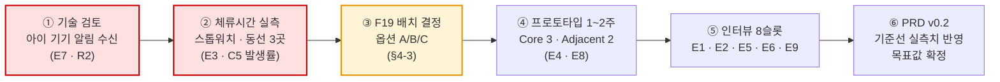
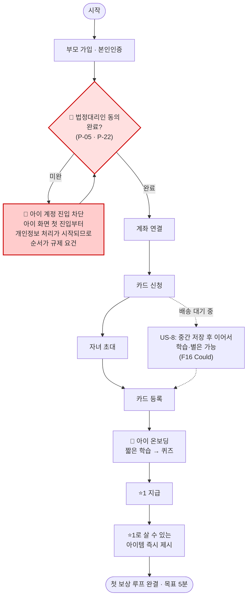
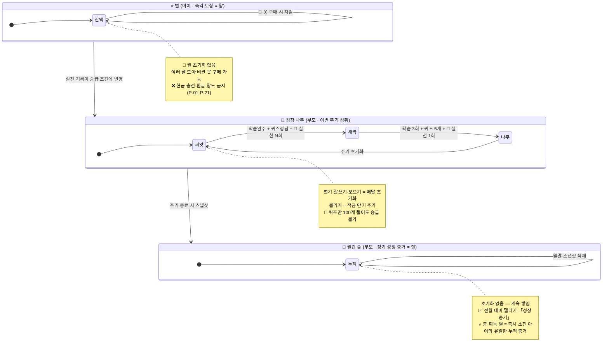
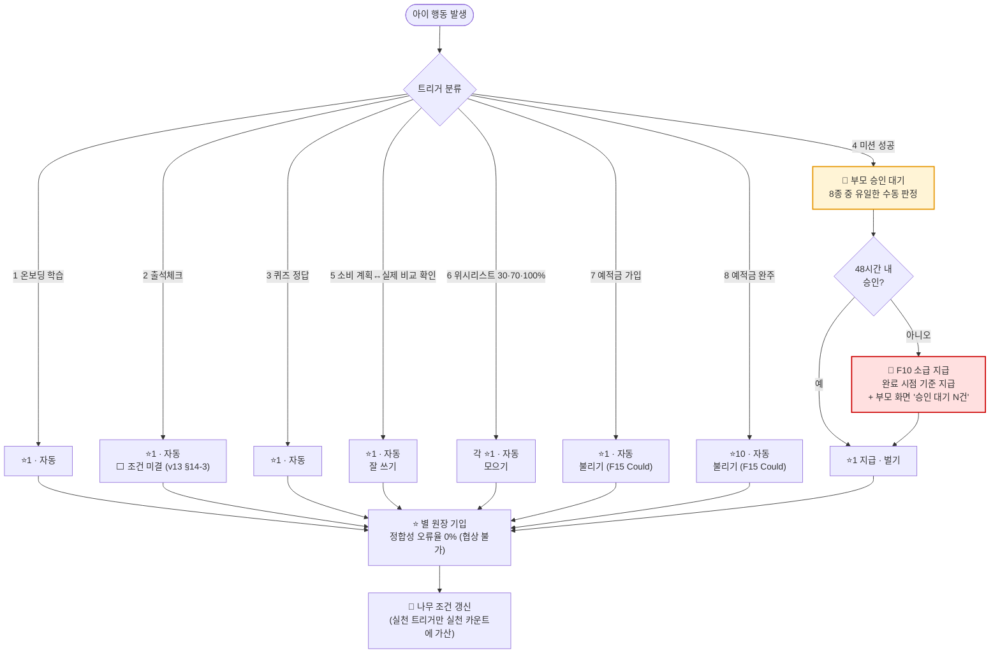
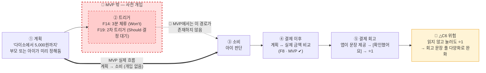

# 핀프렌즈(FinFriends) PRD v0.1

- **Owner 팀** — 제품기획 유림 / 정책·법령 병윤 / 경쟁·리뷰 하영 / 서비스분석 혜원
- **최종 업데이트** — 2026-08-21
- **근거 문서** — `VPS v2.0 rooted` (자립 문서 · 1,089줄). 본 PRD는 VPS의 결론을 **구현 가능한 요구사항으로 번역**한 것이며 새 리서치를 포함하지 않습니다.
- 🔴 **문서 지위 — 고객 인터뷰 0건.** 모든 목표 수치는 **[가설]**, 기준선은 대부분 **⬜ 미측정**입니다. 어느 수치도 **성과로 인용할 수 없습니다.**

**등급 표기 (VPS 승계)** — `[A]` 학술·공공통계 · `[관측]` 팀 직접 확인 · `[추론]` 해석·모델값 · `[가설]` 미검증 · `[설계 확정]` v13 확정 사양 · `✍️[합성 가설]` 페르소나·여정·Pain · `🧪[모의]` 모의 응답(**Evidence 아님**)

> ### 🔴 이 PRD를 읽는 사람이 먼저 알아야 할 것
> 1. **선별 Pain 3건 중 1건(C5)의 대응 기능이 MVP에 없습니다.** 숨기지 않고 §1-4·§4-3·§7-2에 남겼습니다.
> 2. **성능·가용성 목표값은 비워 두었습니다**(`⬜ 미정`). 아키텍처가 없는 상태에서 숫자를 채우면 근거 없는 SLO가 됩니다 — 정하는 방법을 §5-2에 적었습니다.
> 3. **「소비 사전 개입」은 현재 제공 기능이 아닙니다.** 대외 자료에 현재형으로 쓰지 마세요.

---

## 1. 개요·목표

### 1-1. 문제 정의 — Pain ID · 실패 KPI

> **범위 판정** — VPS §1-3의 8건 중 **7건을 PRD 범위에 넣고, A1은 관측만** 합니다. A1은 대응 기능(F15)이 규제 선결(P-20) 대기라 요구사항으로 확정할 수 없습니다.

| 층위 | ID | 문제 (한 줄) | **실패 KPI — 이 값이면 실패** | 기준선 | 등급 | PRD 범위 |
|:-:|---|---|---|:-:|:-:|:-:|
| ★ | **C1** | 누적 숫자가 성장의 증거가 되지 못한다 | 나무 5초 노출 후 **행동 변화 1문장 회상 성공률 < 50%** · 부모 주 1회 확인 시간 **> 8분** | ⬜ 미측정<br>*(인터뷰 T3·Q0-2에서 실측)* | ✍️[합성 가설] | ✅ |
| ★ | **C2** | 실천 칸이 비어 4개 나무가 전부 정체한다 | **가입 후 7일 내 첫 실천 인정률 < 40%** · 월말 4칸 중 2칸 이상 성장 가정 **< 30%** | ⬜ 미측정<br>*(프로토타입 1주차 실측)* | ✍️[합성 가설] | ✅ |
| ★ | **C5** | 「3분 체류」가 1분 미만 즉흥 구매를 못 잡는다 | **소비 순간 트리거 발동률 < 50%**(대상 소비 건 대비) · 아이 소비 중 앱 기록 비율 **< 70%** | **0** *(현금 = 기록 0건)*<br>🔴 **체류시간 실측 선행 필수** | ✍️[합성 가설] | ⚠️ **부분** — §1-4 |
| ◇ | **C3** | 2주 정체를 부모가 아이의 능력 문제로 해석한다 | 정체 발생 시 **원인 표시 열람률 < 40%** · 오귀인 발화 비율 **> 40%** | ⬜ 미측정<br>*(인터뷰 Q1-9)* | ✍️[합성 가설] | ✅ |
| ◇ | **C10** | FOMO 결제는 판단 시간이 3초다 | 온라인 결제 건 중 **사전 개입 도달 0건 유지** | **0** | ✍️[합성 가설] | ⚠️ **관측만** |
| ◇ | **C12** | 온라인 결제 사전 개입이 설계에 원리적으로 없다 | 동일 | **0** | ✍️[합성 가설] | ⚠️ **관측만** |
| △ | **C6** | 회고를 읽지 않고 [확인했어요]만 눌러도 ⭐1이 들어온다 | **동일 회고 문장 재노출률 > 50%**(7일 창) · 회고 화면 체류 **중위 < 2초** | ⬜ 미측정 | [설계 확정]+[추론] | ✅ |
| △ | **A1** | 「불리기」가 학습 단계부터 막힌 칸이 된다 | 4주제 중 **「불리기」 학습 완주율이 최저이며 차상위와 격차 > 20%p** | ⬜ 미측정 | ✍️[합성 가설] | 📋 **관측만** |

**🔴 아이 행동 KPI의 관측 수단 문제**

VPS §1-5는 **아이 Pain 12건 중 부모 화면에 신호로 나타나는 것이 0건**이라고 적습니다 **[추론]**. 아이 인터뷰도 0건입니다. 따라서 아이 기준 KPI는 **관측 수단을 함께 확정**해야 합니다.

| 아이 KPI | 관측 수단 | 상태 |
|---|---|---|
| 첫 실천 인정률 · 실천 트리거 도달 | **인앱 이벤트 로그** | 🟢 확보 가능 (F4 별 지급 로그) |
| 3일/7일 재접속률 | 인앱 세션 로그 | 🟢 확보 가능 |
| 회고 화면 체류 시간 | 인앱 화면 체류 로그 | 🟢 확보 가능 — **C6 판정의 유일한 수단** |
| 「참은 날」의 주관적 차이 | ❌ 없음 | 🔴 **아이 직접 조사 필요** (P-05 동의 · P-12 언어) |
| 소비 순간 실제 멈춤 | ❌ MVP에 트리거 없음 | 🔴 **체류시간 실측 + 프로토타입 관찰로 대체** |

### 1-2. 목표 — Desired Outcome 수치화

| # | Outcome | 지표 | 기준선 | **목표 [가설]** | 측정 주기 | 측정 도구 |
|:-:|---|---|:-:|:-:|:-:|---|
| O1 | 변화가 한 문장으로 읽힌다 | 나무 5초 노출 후 1문장 회상 성공률 | ⬜ | **≥ 70%** | 인터뷰 회차 | 인터뷰 T3 (n=8) |
| O2 | 확인이 짧아진다 | 부모 주 1회 확인 소요시간 | ⬜ *(15분 추정)* | **3분** | 주간 | 인앱 세션 시간 + 인터뷰 Q0-2 |
| O3 | 부모–자녀 대화가 생긴다 | 돈 이야기 월 횟수 | ⬜ *(0회 추정)* | **월 2회** | 월간 | 인터뷰 자기보고 |
| O4 | 첫 실천이 반영된다 | 가입 후 7일 내 첫 실천 인정률 | ⬜ | **≥ 60%** | 주간 | 인앱 이벤트 |
| O5 | 네 칸이 고르게 자란다 | 월말 4칸 중 2칸 이상 성장 가정 비율 | ⬜ | **≥ 50%** | 월간 | 인앱 집계 |
| O6 | 실천 경로가 실제로 쓰인다 | 실천 트리거 5종 중 1종 이상 도달 아동 비율 | ⬜ | **≥ 70%** | 월간 | 인앱 이벤트 |
| O7 | 쓰기 전에 멈춘 기록이 남는다 | 사전 개입 후 「남기기」 선택 주당 횟수 | **0회** | **주 2회** | 주간 | 🔴 **F19 신설 전제** |
| O8 | 소비가 기록으로 남는다 | 아이 소비 건수 중 앱 기록 비율 | **0%** *(현금)* | **전건** | 주간 | 카드 결제 원장 |
| O10 | 멈춘 이유를 알 수 있다 | 정체 원인 표시 열람률 · 실천 근거 열람률 | ⬜ | **≥ 60%** | 월간 | 인앱 화면 로그 |
| O13 | 아이가 멈춘 것을 부모가 곧 안다 | 아이 루프 정지 → 부모 인지 일수 | ⬜ *(최대 한 달)* | **≤ 3일** | 주간 | F11 알림 발송·열람 로그 |
| O14 | 부모 루프가 돈다 | 다음 달 충전율 · 월간 숲 익월 재방문율 | ⬜ | **≥ 70% / ≥ 50%** | 월간 | 인앱 집계 |

### 1-3. 성공 지표 — 북극성 / 보조 KPI

> ## ⭐ 북극성 KPI — **주간 실천 인정 아동 비율 (WPA, Weekly Practiced Active)**
> **정의** — 해당 주에 **실천 트리거(미션 승인 · 소비 회고 · 위시리스트 달성 · 예적금 · 사전 개입 중 1종 이상)로 ⭐를 받은 아동 / 활성 아동**
> **기준선 ⬜ 미측정 · 목표 [가설] ≥ 55% · 주간 측정 · 인앱 이벤트 로그**

**왜 이것 하나인가** — 근거 세 겹입니다.

1. **선언 ①이 ②의 전제**입니다. 아이가 실천하지 않으면 부모 화면은 **거짓말을 하지 않고 비어 있을 뿐**이고(VPS §1-5 관찰 2 **[추론]**), 그 빈 화면이 *"우리 애가 안 하는구나"* 로 읽힙니다. **②의 어떤 지표를 북극성으로 삼아도 ①이 죽으면 함께 죽습니다.**
2. **C2는 AOS·DOS 두 지표에서 순서가 흔들리지 않는 유일한 항목**입니다(VPS §3-2 **[추론]**) — 논쟁의 여지가 가장 적은 투자처입니다.
3. **나무 성장 조건에 「행동 실천 횟수」가 들어 있어**(v13 §3-1 **[설계 확정]**) 실천 없이는 나무·숲·별이 전부 작동하지 않습니다. WPA는 **제품 전체가 파생되는 단일 원천 지표**입니다.

⚠️ **북극성으로 채택하지 않은 후보와 이유**

| 후보 | 왜 아닌가 |
|---|---|
| 나무 5초 회상 성공률 (O1) | **인터뷰 회차 지표**라 상시 계측이 불가능하고, ①이 죽으면 회상할 내용 자체가 없습니다 |
| 다음 달 충전율 (O14) | 지연 지표(월 1회) — 문제를 **한 달 뒤에** 알려줍니다 |
| 아이 7일 재접속률 (O5) | 접속은 실천이 아닙니다. 출석 ⭐1만으로도 올라가 **활동량 지표로 퇴화**합니다 |

**보조 KPI**

| 축 | 지표 | 기준선 | 목표 [가설] | 주기 |
|---|---|:-:|:-:|:-:|
| 선언 ② *(전달)* | 나무 5초 회상 성공률 · 부모 확인 시간 | ⬜ | ≥ 70% · 3분 | 인터뷰 회차 · 주간 |
| 선언 ② *(신뢰)* | 실천 근거 열람률 · 정체 원인 표시 열람률 | ⬜ | ≥ 60% | 월간 |
| J3 *(인정)* | 승인 지연 시 ⭐ 소급 지급 성공률 | — | **100%** | 주간 |
| J3 *(탐지)* | 아이 정지 → 부모 인지 일수 | ⬜ | ≤ 3일 | 주간 |
| 데이터 타당성 | 회고 화면 체류 중위값 · 동일 문장 재노출률 | ⬜ | ≥ 3초 · ≤ 30% | 주간 |
| 지속 | 아이 3일/7일 재접속률 · 익월 숲 재방문율 | ⬜ | ≥ 65%/50% · ≥ 50% | 주간·월간 |
| **수익** 🔴 | **카드 연결률 · 아동 1인당 월 결제액** | ⬜ | ⬜ **미정** | 월간 |

> 🔴 **수익 KPI를 「유료 전환율」로 쓰지 않습니다.** v13 §10에서 **부모·아이 모두 무료**가 확정돼 **SOM Level 3(구독 전제 · 440가구 × 월 4,900원) 산출식이 무효**입니다 **[설계 확정]**. 수익은 **결제 수수료 + 금융사 제휴 2중 구조**이므로 KPI는 **카드 연결률 · 월 결제액**으로 재정의합니다. 목표값은 제휴 수수료율이 미확인(검증과제 ⑥)이라 산정할 수 없어 `⬜ 미정`입니다.

### 1-4. 🔴 이 PRD가 해결하지 못하는 것

| 미대응 | 내용 | 왜 |
|---|---|---|
| ★ **C5** *(선별)* | 소비 순간 사전 개입 — **AOS 4.0 전체 공동 1위** | 대응 기능 **F19가 MVP 밖**. F14(3분 체류)를 올려도 **3분 사각지대가 곧 C5**라 해결되지 않음 |
| ◇ **C10 · C12** *(보조)* | 온라인 결제 사전 개입 | 동일 — F19 하나에 세 Pain이 함께 걸림 |
| △ **A1** *(감시)* | 「불리기」 실천 경로 | F15가 **P-20(금융상품 중개업 회피) 범위 확인 선행** 대기 — MVP에서 「불리기」는 **학습만 열리고 실천은 닫힘** |
| — | 선언 ①의 **「학습」 마디** | 고객 Pain으로 지탱되지 않고 설계 근거로만 서 있음. **검증과제 ①의 결과에 직접 걸림** |

> **결과** — MVP는 **선언 ②(보여준다)를 완성하고 선언 ①(실천한다)을 4칸 중 3칸에서 개통**하는 범위입니다. *"소비 순간에 멈춘다"* 는 **로드맵 1순위(F19)** 로 남습니다.

📑 **이 절이 인용한 VPS 절과 등급** — §1-3(Pain 8건 ✍️합성 가설) · §1-5(신호 0건 [추론]) · §3-1(O1~O14 [가설]) · §3-2(순서 역전 [추론]) · §8-0(v13 사양 [설계 확정]) · §8-3(컷라인 근거) · §9(무료 확정 · SOM 무효)

---

## 2. 사용자와 페르소나

### 2-1. 핵심 페르소나 2인

> **선별 단위는 Pain Point이고 인물은 그 결과**입니다 — 선별 C1·C2·C5를 고른 뒤 인물을 추적하니 H1·H2가 나왔습니다. **새 페르소나를 추가하지 않습니다.**

| | **H1 정미경** *(선별 C1·C2 / 보조 C3)* | **H2 배성우** *(선별 C5 / 감시 C6)* |
|---|---|---|
| **프로필** | 39 · 중학교 교사 · 정하율(만 8세·초2)<br>주 8,000원 앱 충전 · **퍼핀 8개월차** · 아이 전용 태블릿 · 응답 **당일** | 42 · 카페 자영업(주 6일 · 07~20시) · 배주안(만 9세·초3)<br>**현금 봉투 주 5,000원 · 3년** · 아이 기기 **키즈워치** · 확인 주 1회 |
| **세그먼트** | ① 금융성장 증명형 · **29.3만명(35.8%)** · SOM 도달계수 **1.00** | 동일 세그먼트 ① 내부 · 도달계수 **1.00** |
| **Job** | **배운 것이 실제 돈 행동으로 이어졌는지를 짧은 시간에 확인하고 싶다** | **쓰기 전에 한 번 멈추게 하고, 그 선택이 기록으로 남게 하고 싶다** |
| **대체재 한계** | 퍼핀 학습현황 — **"보고도 모른다"** (Satisfaction 2) | 현금 봉투 — **"볼 것이 없다"** (Satisfaction 1 · 기록 0건) |
| **여정 최저 감정** | **3** (0단계 접하기 전) | **1** (3단계 전환 결정 — 온보딩 5단계 vs 현금 5초) |
| **진입 후크** | 🌳 성장 나무 · 🌲 월간 숲 | 📍 위치 알림 *(나무가 아님)* |
| **이탈 트리거** | 나무 **2주 이상 정체** → 아이 탓이 아니라 **앱 불신**으로 조용히 이탈 | **알림이 실제로 오지 않으면 즉시 이탈** |
| **진입 장벽 성격** | **기록 이전 불가**(8개월치 자산) | **시간**(가게 일하면서 배송 받고 등록) |

> ⚠️ **두 인물은 같은 세그먼트 ① 안에 있습니다** — 모수를 각각 더해 58.6만으로 읽지 않습니다.
> 🔴 **선별 인물 둘 다 「전용 스마트폰을 들고 다니는 아이」가 아닙니다**(H1 태블릿=집 안 · H2 키즈워치). C5·C10·C12가 **전부 이 전제 위에** 있습니다 — §7-3 의존성.

### 2-2. 여정 단계별 Pain·Needs 매핑

| 단계 | **H1 정미경** | **H2 배성우** | 대응 기능 |
|:-:|---|---|---|
| **0** 접하기 전 | ★**C1** 누적 숫자 3개(116일·75문제·6,650원)가 증거가 못 됨 *(감정 3)* | 소비 데이터가 **아예 없음** — 무엇을 가르칠지도 모름 *(감정 3)* | F1 · F9 · F13 |
| **1** 문제 신호 | 오답 재시도 보상 목격 → **학습 데이터 불신** | 하교길 문구점에서 3,000원 소진, **닷새 뒤 지갑 보고 안다** *(감정 2)* | F8 · F13 |
| **2** 인지·비교 | 나무 4칸에서 *"어디가 멈췄는지 보인다"* 즉시 이해 | 위치 알림 즉시 이해 — *"제가 못 하던 거"* *(감정 4)* | — |
| **3** 🔑 전환 결정 | **8개월치 기록 이전 불가** → '리셋'으로 체감 | **C4** 현금 5초 ↔ 온보딩 5단계 *(감정 **1** 최저)* | F7 · F16(✖) · F18(✖) |
| **4** 아바타·온보딩 | — | 첫 보상까지 5분 · 규칙 이해 속도 > 별 모으는 속도 | F5 · F6 |
| **5** 학습·별 모으기 | 출석 ⭐1 우려 — *"공부를 안 할 수도"* | 학습 진도 느림 → **출석 ⭐1이 유일한 초기 별** | F3 · F4 |
| **6** 실천 선택 | ★**C2** 실천 칸이 비어 **4칸 전부 정체** *(감정 4)* | ★**C5** 자판기 30초 · 팽이 1분 → **3분 트리거 사각지대** *(감정 4)* | F2 · F12 / 🔴 **F19(✖)** |
| **7** 🔑 실천 판정 | — | △**C6** 안 읽고 [확인했어요] → 참은 날과 안 참은 날이 같음 | F8 |
| **8** 아이템 구매 | 별을 즉시 소진 → 잔액만 표시돼 누적 성과 안 보임 | 참기 → 별 → 아이템 인과가 **가장 선명하게 성립** | F5 · F9(총 획득 별) |
| **9** 나무·숲 | 4칸 확인 | 학습 이력 없어 **벌기·불리기 칸이 오래 비어** 고르지 않게 보임 | F1 · F9 |
| **10** 전환 후 | ◇**C3** 2주 정체 → **오귀인 또는 앱 불신** *(감정 4)* | 소비가 안 줄면 *"보이기만 하고 달라지지 않는다"* 실망 | F1 정체 원인 · F13 |

### 2-3. 범위 밖 세그먼트

| 세그먼트 | 규모 | 왜 범위 밖인가 | 그럼에도 남기는 것 |
|---|---|---|---|
| **③ 용돈 소비통제형** *(H6 임태경형)* | **13.3만명 (16.3%)** | Job이 **「지출 감축」** 이라 두 선언과 **성공 기준 자체가 다름.** AOS 1위(A6 4.0)이지만 DOS(SOM) 7위 | **F13(전월 대비 증감액 상단)** 이 최소 유지 조건을 충족할 수 있음 — **포기가 아니라 1차 타깃 제외** |
| ② 습관관리형 / ④ 잠재관심형 | 27.0만 / 12.2만 | 3차·후순위 확장 | 별도 문서 |
| Extreme *(H7·H8)* | — | AOS·DOS 프레임 밖 | 🔴 **승인 지연은 여정지도에서 P0** → **F10이 대응** |
| Non-user *(H9~H11)* | — | 전환 이전에 이탈 | 진입 전략 사안 — F16·F18 |

📑 **인용 VPS 절과 등급** — §1-1(인물·모수 [A]+모델값) · §1-2(CJM ✍️합성 가설) · §2-1(JTBD 카드 🧪모의) · §1-0③(세그먼트 [A]+[추론]) · §8-2(F 매핑 [설계 확정])

---

## 3. 사용자 스토리와 수용 기준(AC)

> **Job 축** — **J1** 배운 것을 실천할 자리를 만든다 *(선언① · 아이)* / **J2** 행동이 어떻게 달라졌는지 보여준다 *(선언② · 부모)* / **J3** 시작·인정·탐지가 끊기지 않게 한다 *(전제)*
> AC의 Given에 **여정 단계 번호**를 넣어 §2-2와 대조할 수 있게 했습니다.

### US-1 · J2 · ★C1 — 변화를 한 문장으로 읽는다

> **As a** H1 정미경(부모), **I want** 화면을 열었을 때 활동량이 아니라 **무엇이 달라졌는지**를 읽고, **so that** 아이가 배운 것이 행동으로 이어졌는지를 짧은 시간에 확인할 수 있다.

| # | Given / When / Then | 측정 도구 · 표본 |
|:-:|---|---|
| **AC1** | **Given** 여정 0단계, 이번 달 실천 기록이 1건 이상 있는 계정 / **When** 🌳 성장 나무 화면을 **5초만** 노출하고 덮은 뒤 *"기억나는 것"* 을 묻는다 / **Then** *"이번 달 행동이 어떻게 달라졌나"* 를 **1문장으로 회상: 성공률 ≥ 70%** | 인터뷰 T3 · **n=8** (모집 8슬롯) · 회상 내용 코딩 |
| **AC2** | **Given** 나무 상세를 펼치지 않은 기본 상태 / **When** *"나무가 자랐다는 건 아이가 뭘 했다는 뜻인가"* 를 묻는다 / **Then** **진행자 개입 0회로 「실천」에 도달한 응답자 ≥ 6/8**. *"퀴즈를 많이 풀어서"* 만 나오면 **AC 실패** | 인터뷰 Q1-8 · **n=8** · 개입 횟수 로그 |
| **AC3** | **Given** 여정 10단계, 전월 데이터가 존재 / **When** 🌲 월간 숲을 열어 *"지난달과 비교해 뭐가 달라졌는지 찾아보라"* 고 한다 / **Then** **전월 대비 변화 항목을 60초 이내 3개 이상 지목 ≥ 6/8** · 부모 확인 소요시간 **중위 ≤ 3분** | 인터뷰 Q1-10 + 인앱 세션 시간 |
| **AC4** | **Given** 아이가 별을 즉시 소진해 잔액이 0인 계정 / **When** 월간 숲을 연다 / **Then** **「이번 달 획득 별」이 스크롤 없이 노출**되고, 부모가 누적 성과를 지목할 수 있다 ≥ 6/8 | 인터뷰 Q1-11 · 화면 캡처 검수 |

### US-2 · J1 · ★C2 — 첫 실천 한 건이 나무에 반영된다

> **As a** 정하율(아이), **I want** 처음 실천한 한 건이 화면에서 **눈에 보이게** 반영되고, **so that** 계속할 이유가 생긴다. *(부모 관점: 화면이 움직이기 시작하는 것을 본다)*

| # | Given / When / Then | 측정 도구 · 표본 |
|:-:|---|---|
| **AC1** | **Given** 여정 6단계, 가입 7일 이내 아동 / **When** 실천 트리거 5종 중 1종을 최초로 완료한다 / **Then** **⭐ 지급 + 해당 나무 진행도 갱신이 동일 세션 내 반영** · **가입 7일 내 첫 실천 인정률 ≥ 60%** | 인앱 이벤트 로그 · 프로토타입 1~2주 (Core 3 · Adjacent 2) |
| **AC2** | **Given** 학습만 완료하고 실천 0건인 아동 / **When** 퀴즈를 추가로 풀어 학습·정답 조건을 초과 충족한다 / **Then** **나무 단계는 상승하지 않는다**(실천 0건이면 승급 불가) · 화면에 **"실천 N회 남음"** 이 명시된다 | 단위 테스트 + 화면 검수 |
| **AC3** | **Given** 여정 6단계 / **When** 월말에 집계한다 / **Then** **4칸 중 2칸 이상 성장한 가정 ≥ 50%** · **4칸 전부 씨앗 정체 가정 ≤ 15%** | 인앱 집계 · 월간 |
| **AC4** | **Given** MVP에서 「불리기」 실천 경로가 닫힘(F15 제외) / **When** 아이가 「불리기」 칸을 연다 / **Then** **"곧 열려요" 안내가 표시**되고, 4칸 미개통이 결함으로 오인되지 않는다 | 화면 검수 + 인터뷰 Q2-3 |

### US-3 · J2 · ◇C3 — 멈춘 이유를 화면에서 안다

> **As a** H1 정미경(부모), **I want** 나무가 멈췄을 때 그 이유가 **아이 탓인지 조건 탓인지** 화면에서 구분되고, **so that** 실망을 아이에게 돌리지 않고 앱도 계속 신뢰할 수 있다.

| # | Given / When / Then | 측정 도구 · 표본 |
|:-:|---|---|
| **AC1** | **Given** 여정 10단계, 특정 칸이 **14일 이상 미상승** / **When** 부모가 그 칸을 연다 / **Then** **정체 원인이 조건 단위로 표시**된다(예: *"실천 1회가 남았어요 · 학습·퀴즈는 충족"*) · **열람률 ≥ 60%** | 인앱 화면 로그 · 월간 |
| **AC2** | **Given** 동일 상황 / **When** *"무슨 일이 있었다고 생각하느냐"* 를 묻는다 / **Then** **오귀인 발화(*"애가 안 해서"*) 비율 ≤ 25%** · **앱 불신 발화(*"앱을 안 믿게 된다"*) 비율 ≤ 25%** | 인터뷰 Q1-9 · n=8 · 발화 코딩 |
| **AC3** | **Given** 정체 원인 표시를 본 부모 / **When** 다음 주 동일 화면에 재방문한다 / **Then** **정체 계정의 익주 재방문율 ≥ 50%**(정체가 이탈로 직결되지 않음) | 인앱 세션 로그 |

> 🔴 **AC2가 이 스토리의 핵심입니다.** 🧪 모의 응답에서 이 Pain은 *"아이 탓"* 이 아니라 **"앱을 안 믿게 된다"** 로 나타났습니다 — **오귀인은 대화라도 생기지만 불신은 신호 없이 이탈**합니다. 두 경로를 모두 계측합니다.

### US-4 · J1 · ★C5 — 🔴 쓰기 직전에 한 번 멈춘다 *(MVP 미대응)*

> **As a** 배주안(아이), **I want** 지갑을 여는 그 순간에 한 번 멈출 계기가 있고, **so that** 오늘 참았다는 기록이 남는다.
> 🔴 **이 스토리의 대응 기능(F19)은 MVP 밖입니다.** 아래 AC는 **로드맵 수용 기준**이며, MVP 기간에는 **AC0(선행 실측)만** 수행합니다.

| # | Given / When / Then | 측정 도구 · 표본 |
|:-:|---|---|
| **AC0** 🔴 *(MVP 내)* | **Given** H2형 아이의 하교 동선 3곳 이상 / **When** 실제 체류 시간을 스톱워치로 실측한다 / **Then** **가게별 체류 분포와 3분 초과 비율이 산출**되고, **C5의 발생률 0.6이 재산출**된다 | **스톱워치 실측** · 동선 3곳 × 5회 이상 |
| **AC1** *(F19 전제)* | **Given** 여정 6단계, 계획 금액이 설정된 아동 / **When** 소비 직전 시점에 도달한다 / **Then** **대상 소비 건 중 트리거 발동률 ≥ 85%** · 체류 시간 조건에 의존하지 않는다 | 인앱 이벤트 + 실측 대조 |
| **AC2** *(F19 전제)* | **Given** 트리거 발동 / **When** 아이가 「남기기」를 선택한다 / **Then** **「참음」이 자동 기록**되고 ⭐가 지급되며, **주당 「남기기」 선택 ≥ 2회** | 인앱 이벤트 |
| **AC3** *(F19 전제)* | **Given** 아이 기기가 **키즈워치 또는 부모 폰 공유** / **When** 트리거 조건이 성립한다 / **Then** **알림 수신 가능 여부가 판정**된다 — 불가하면 해당 가정은 **대체 경로로 분기** | 🔴 **실기기 기술 검토** |

### US-5 · J1 · △C6 — 참은 날이 확인만 한 날과 다르다

> **As a** 배주안(아이), **I want** 참은 날이 그냥 확인만 한 날과 다르게 느껴지고, **so that** 참는 쪽이 더 좋은 선택으로 학습된다.

| # | Given / When / Then | 측정 도구 · 표본 |
|:-:|---|---|
| **AC1** | **Given** 여정 7단계, 7일 내 회고를 3회 이상 수행한 아동 / **When** 회고 문장을 제시한다 / **Then** **동일 문장 재노출률 ≤ 30%**(문장 풀에서 비복원 추출) | 인앱 문장 배정 로그 |
| **AC2** | **Given** 회고 화면 진입 / **When** [확인했어요]를 누른다 / **Then** **화면 체류 중위 ≥ 3초** · 체류 1초 미만 비율 **≤ 20%** | 인앱 화면 체류 로그 — **C6 판정의 유일한 수단** |
| **AC3** | **Given** 계획 초과일과 계획 준수일 / **When** 각각 회고를 완료한다 / **Then** **회고 문장이 서로 구별되고**, 부모가 두 경우를 화면만 보고 구분 ≥ 6/8 | 화면 검수 + 인터뷰 Q1-15 |

### US-6 · J3 — 부모가 늦어도 내가 한 일이 사라지지 않는다

> **As a** 아이(H7·H8형 포함), **I want** 부모 승인이 늦어도 내가 한 실천이 인정되고, **so that** 부모의 지연이 내 실패로 기록되지 않는다.

| # | Given / When / Then | 측정 도구 · 표본 |
|:-:|---|---|
| **AC1** | **Given** 여정 7단계, 미션 완료 후 부모 미승인 48시간 경과 / **When** 부모가 이후 승인한다 / **Then** **⭐가 완료 시점 기준으로 소급 지급** · **소급 지급 성공률 100%** | 인앱 이벤트 · 단위 테스트 |
| **AC2** | **Given** 승인 대기 건이 1건 이상 / **When** 부모가 🌳 성장 나무를 연다 / **Then** **「승인 대기 N건」이 나무 화면에 표시**되어 *"이번 주엔 안 했구나"* 라는 반대 결론을 막는다 | 화면 검수 · 인터뷰 |
| **AC3** | **Given** 아이 화면 / **When** 승인 대기 상태를 본다 / **Then** **「대기 중」이 「미실천」과 시각적으로 구별**된다(색·문구 상이) | 화면 검수 |

### US-7 · J3 — 아이가 멈춘 것을 3일 안에 안다

> **As a** 부모(H2형 포함), **I want** 아이가 앱을 안 열기 시작하면 곧 알게 되고, **so that** 다음 달 충전 시점에야 알고 *"우리 애가 안 맞나 봐"* 로 결론 내리지 않는다.

| # | Given / When / Then | 측정 도구 · 표본 |
|:-:|---|---|
| **AC1** | **Given** 아동 최종 접속 후 **72시간 경과** / **When** 배치가 실행된다 / **Then** **부모에게 미접속 알림 발송률 100%** · **정지 → 부모 인지 일수 ≤ 3일** | F11 발송·열람 로그 |
| **AC2** | **Given** 미접속 알림 수신 / **When** 부모가 알림을 연다 / **Then** **아이가 멈춘 지점(어느 칸·어느 조건)이 함께 표시**된다 | 화면 검수 |
| **AC3** | **Given** 부모가 자영업 등으로 야간에만 확인 가능 / **When** 알림을 발송한다 / **Then** **발송 시간대가 부모 활동 시간에 맞춰 조정 가능** · 알림 열람률 ≥ 50% | 인앱 설정 + 열람 로그 |

### US-8 · J3 · C4 — 시간을 쪼개서 시작할 수 있다

> **As a** H2 배성우(자영업 부모), **I want** 온보딩을 한 번에 끝내지 않아도 되고, **so that** 가게 일 사이에 나눠서 시작할 수 있다.

| # | Given / When / Then | 측정 도구 · 표본 |
|:-:|---|---|
| **AC1** | **Given** 여정 3단계, 온보딩 5단계 중 2단계까지 진행 / **When** 앱을 종료하고 다음 날 재진입한다 / **Then** **직전 단계에서 이어서 시작** · 재입력 항목 0건 | 인앱 이벤트 · 단위 테스트 |
| **AC2** | **Given** 카드 배송 대기 상태 / **When** 아이가 앱을 연다 / **Then** **학습·퀴즈·별 획득이 가능**하고 카드 필요 기능만 잠긴다 *(F16 — MVP 밖이면 잠금 안내 문구로 대체)* | 화면 검수 |
| **AC3** | **Given** 온보딩 시작 / **When** 완주까지의 소요를 측정한다 / **Then** **세션 분할 시 총 소요 중위 ≤ 10분** · **3단계 이탈률 ≤ 30%** | 인앱 퍼널 로그 |

📑 **인용 VPS 절과 등급** — §2-2(Job 정의) · §3-1(O 지표 [가설]) · §1-2·§1-3(Pain·여정 ✍️합성 가설) · §8-0(사양 [설계 확정]) · §2-1(🧪모의 발화)

---

## 4. 기능 요구사항(Functional)

### 4-1. F 번호 승계 · MSCW 우선순위

> **기능을 새로 발명하지 않았습니다.** VPS §8-2의 F1~F19를 그대로 승계했고, MSCW는 **MVP 컷라인(F1~F13 ✔ / F14~F19 ✖)을 유지**하는 방향으로 배치했습니다.

| F | 기능 | 연결 Pain | Job | 중요도 | 난이도 | **MSCW** | 근거 (대안 대비 가치) |
|---|---|:-:|:-:|:-:|:-:|:-:|---|
| **F1** | 🌳 성장 나무 (4영역 + 실천 근거 기본 노출 + **정체 원인 표시**) | ★C1 ◇C3 | J2 | **5** | 4 | **Must** | 퍼핀은 **숫자 3개**뿐 — 「어디까지 자랐나」를 보여주는 유일한 화면 |
| **F2** | 🧹 미션 루프 (조건·금액 사전 설정 → 승인 → ⭐1) | ★C2 | J1 | **5** | 3 | **Must** | 「벌기」의 **유일한 실천 근거**. 대체재는 조건이 부모 머릿속에만 있음 |
| **F3** | 📚 학습 커리큘럼 4주제 + 퀴즈 (+「불리기」 한 줄 설명) | ★C2 △A1 | J1 | **5** | 3 | **Must** | **4/4 전부 금융** vs 퍼핀 3/7 — 4칸 매핑이 구조적으로 가능한 쪽 |
| **F4** | ⭐ 별 지급 엔진 (트리거 8종 · 차감형 · 초기화 없음) | ★C2 | J1 | **5** | 3 | **Must** | 실천 5경로 vs 학습 2경로 — **경로 수로 실천을 유도** |
| **F5** | 🐾 아바타 · 👕 옷장 (사전 제작 3D) | ★C2 | J1 | **5** | 4 | **Must** | 아이의 **유일한** 동기 장치. 나무는 부모 화면 전용 |
| **F7** | 🔐 부모 온보딩 5단계 + **법정대리인 동의** | C4 | J3 | **5** | 4 | **Must** | 규제 필수(P-05·P-22). **기존 사업자 미이행 관측** → 준수 자체가 신뢰 자산 |
| **F8** | 💳 결제 내역 + 계획↔실제 회고 (+ **회고 문장 풀**) | ★C5 △C6 | J1 J2 | **5** | 4 | **Must** | 대체재는 **울린 뒤에 온다**. 「행동」 데이터의 사후 절반 |
| **F9** | 🌲 월간 숲 (**지난달과 비교**) | ★C1 | J2 | **5** | 3 | **Must** | **전월 대비 변화가 성장 증거** — 3사 전부 공백 |
| **F6** | 🐣 아이 온보딩 (학습→퀴즈→⭐1→아이템 제시) | C4 | J1 J3 | 4 | 2 | **Should** | 첫 보상 루프를 5분에 닫음 |
| **F10** | ⏱ 승인 지연 시 ⭐ **소급 지급** + 「대기 N건」 | US-6 | J1 J2 | 4 | 2 | **Should** | 🔴 **H7·H8의 P0** — 한 규칙으로 「인정」 군집 4건이 함께 풀림 |
| **F11** | 🔔 아이 **3일 미접속 알림** | US-7 | J3 | 4 | 2 | **Should** | **O13(탐지 ≤3일)의 유일한 달성 수단** — 현재 설계에 신호 0건 |
| **F12** | 🎯 위시리스트 (30·70·100% 각 ⭐1) | ★C2 | J1 | 4 | 2 | **Should** | 「모으기」 칸을 여는 실천 · 저축에 **이유**를 만듦 |
| **F13** | 📊 소비 내역 (**전월 대비 증감액 상단**) | ★C5 | J2 | 4 | 2 | **Should** | **H2의 최소 유지 조건** — 🧪 *"어디서 얼마 썼는지, 그거 하나만"* |
| **F19** 🔴 | 🚦 **소비 사전 개입 2차 트리거** (체류 무관 · 온라인 포함) | ★**C5** ◇C10 ◇C12 | J1 | **5** | **5** | **Should** 🔴 **결정 대기 → §4-3** | **세 Pain을 한 번에 덮는 유일한 수단.** 대체재 사전 개입 수단 0개 |
| **F15** | 💰 예적금 비교·선택 (가입 ⭐1 · 완주 ⭐10) | △A1 | J1 | 3 | 3 | **Could** | 「불리기」 실천 칸 — **P-20 범위 확인 선행** |
| **F16** | 🪪 카드 없이 학습부터 시작하는 체험 경로 | C4 | J3 | 3 | 3 | **Could** | H2의 진입 장벽(시간) 완화 |
| **F17** | 🛍 별의 **옷장 외 목적지** | (A2) | J1 | 3 | 3 | **Could** | 모으기형 아이의 루프 회수 — **P-21 현금 분리선 재검토 선행** |
| **F14** | 📍 위치 알림 (3분 체류 · 온디바이스) | ★C5 *(부분)* | J1 | 4 | **5** | **Won't** *(v0.1)* | 🔴 **§4-2 참조** — 올려도 C5를 해결하지 않음 |
| **F18** | 📤 기존 앱 기록 이전 / 병행 사용 | (H1 Anxiety) | J3 | 2 | **5** | **Won't** *(v0.1)* | 난이도 5 · 병행 수요 낮음(🧪 *"둘 다요? 귀찮을 것 같은데요"*) |

**집계** — Must **8** · Should **6**(F19 포함) · Could **3** · Won't **2** = **19개**

### 4-2. 🔴 F14를 Must로 올리지 않는 이유

F14 제외 사유 넷 중 **셋은 그대로 유효**합니다.

| # | 사유 | 상태 |
|:-:|---|:-:|
| ① | **기술 구현 미검증** — 백그라운드 위치 권한 유지율 · 배터리 · 아동 기기 권한 | 🔴 유효 (검증과제 ⑥) |
| ② | **좌표 미저장 정책(P-19)상 온디바이스 판정 필수** → 클라이언트 부담 큼 | 🔴 유효 |
| ③ | **3분 트리거가 잡아야 할 소비를 못 잡음** | 🔴 유효 — **이것이 곧 ★C5** |
| ④ | ~~H6형에서 감시로 오해되어 1차 타깃 아닌 세그먼트를 끌어들임~~ | ✅ **소멸** — H6이 범위 밖으로 결정됨 |

> **결론** — ③이 C5 자체이므로 **F14를 승격해도 C5는 해결되지 않습니다.** 필요한 것은 같은 기능의 승격이 아니라 **다른 트리거(F19)** 입니다. 사유가 넷에서 셋으로 줄었다는 사실은 기록해 둡니다.

### 4-3. 🔴 최상위 결정 — F19를 어디에 둘 것인가

**현재 배치: Should (v0.1 기준) · 결정 대기.** 아래 세 옵션 중 하나를 팀이 확정해야 합니다.

| 옵션 | 배치 | 장점 | 대가 |
|:-:|---|---|---|
| **A** *(현재)* | **Should** — MVP 밖 유지 | 선결 조건 4개가 미해결인 기능이 **MVP 일정을 잡지 않음.** C5 데이터는 F8(사후 회고)로 절반 확보 | 🔴 **선별 3건 중 1건 미대응** · 사전 개입을 대외적으로 말할 수 없음 |
| **B** | **F19를 쪼개서 F19-a만 Must** — *아이 주도형 경량 트리거*(계획 카드 상시 노출 + [지금 살까?] 버튼) | 🟢 **선결 조건 4개를 전부 우회** — 위치 권한·좌표·제휴사 API 불필요, **키즈워치라도 무관.** 난이도 5 → **2~3 추정** | 자동 발동이 아니라 **아이가 열어야 함** → 효과가 약함(그 효과 자체가 검증 대상) · **MVP 범위 증가** |
| **C** | F19를 **Must**로 승격 | 선별과 MVP가 정합 | 🔴 기술 검토·기기 전제·P-19 온디바이스가 **전부 미해결** — MVP가 이 하나에 블록될 위험 |

**선결 조건 (B·C 공통 · §7-3 의존성과 연결)**

1. 🔴 **아이 기기 전제 판정** — 키즈워치·부모 폰 공유에서 알림 수신이 가능한가 *(실기기 기술 검토)*
2. 🔴 **체류시간 실측** — C5의 발생률 0.6 재산출 *(스톱워치)*
3. **P-19 준수 방식** — 온디바이스 판정 구현 범위
4. **온라인 결제 개입 수단** — 카드사·제휴사 정책(P-17·P-18) 범위 확인

> ⚠️ **옵션 B의 F19-a는 v13 확정 사양 안에서 파생됩니다** — 5단계 루프의 **①계획** 단계가 *"부모 또는 아이가 미리 정해둠"* 으로 이미 확정돼 있습니다 **[설계 확정]**. 없는 것은 **「그 계획을 소비 직전에 보게 하는 경로」** 뿐입니다. 다만 **F19-a는 아직 확정 사양이 아니므로**, 채택 시 v13 개정이 함께 필요합니다.

### 4-4. 🔴 MVP에서 비어 보이는 것과 대응

| 사실 | 대응 |
|---|---|
| 「불리기」 칸은 **학습만 열리고 실천은 닫힘**(F15 Could) | 화면에 **"곧 열려요"** 표시 필수 — 4칸 미개통이 결함으로 오인되지 않게 |
| **사전 개입 수단 0개**(F14 Won't · F19 Should) | §4-2·§4-3에 사유 명시 · 대외 문구에서 **현재형 사용 금지** |
| 기록 이전 불가(F18 Won't) | 획득 메시지를 「이전」이 아니라 **「지금부터」** 프레임으로 |

📑 **인용 VPS 절과 등급** — §8-2(F 명세 [설계 확정]) · §8-3(컷라인 근거 [추론]) · §8-4(Pain 추적) · §7-3(대안 비교 [관측])

---

## 5. 비기능 요구사항(NFR)

### 5-1. 🔴 규제 상수 — 최우선 · 협상 불가

> 아동 대상 금융 서비스의 1순위 NFR은 성능이 아니라 **규제**입니다. 아래는 설계 변수가 아니라 **상수**입니다.

| 조항 | 요구사항 | 검증 방법 |
|---|---|---|
| **P-05 · P-22** | **법정대리인 동의 완료 전 아이 화면 진입 불가.** 아이 온보딩은 첫 화면부터 개인정보 처리가 시작되므로 순서가 규제 요건 | 동의 미완 상태에서 아이 계정 진입 시도 → **100% 차단** (자동 테스트) |
| **P-12** | 아동용 **알기 쉬운 고지.** 4칸 명칭은 부모·아이 **동일**하게 두고, 「알기 쉬운 언어」는 **한 줄 설명**이 담당 | 문구 검수 + 아동 이해도 확인(별도 세션) |
| **P-19** | 만 14세 미만 개인위치정보 **옵트인 + 좌표 미저장.** → **서버 지오펜싱 사용 불가, 온디바이스 판정 필수.** 동의 화면에 *「부모는 위치를 볼 수 없습니다」* 를 **동의 전에** 명시 | 서버 로그에 좌표 필드 **부재** 검증 · 패킷 검사 |
| **P-20** | 예적금 **가입 중개 안 함** — 비교·선택 경험까지만 | F15 구현 전 법률 검토 통과(검증과제 ⑤) |
| **P-01 · P-21** | 별은 **차감형 · 교차 금지**, 별↔저금통 **완전 분리.** ❌ 현금 충전 ❌ 현금 환급 ❌ 양도·거래 | 별 원장 감사 · 전환 경로 부재 검증 |
| **P-13** | 동물 아바타 **얼굴 이미지 미수집** | 데이터 스키마 검수 |
| **P-11** | 해지 시 잔액 **전액 환불** | 해지 플로우 테스트 |
| **P-17 · P-18** | 카드 **한도·업종 제한은 제휴사 정책 종속** — 우리가 정할 수 없음 | 제휴 계약서 확인 |
| **F-01** | 만 14세 미만 **마이데이터 가입 불가** → 표준 API로 데이터를 받을 수 없음 | 아키텍처 리뷰 |

### 5-2. 성능 · 신뢰성 — 🔴 목표값 미정 (근거 없는 SLO를 넣지 않음)

> **아키텍처가 확정되지 않은 상태에서 숫자를 채우면 근거 없는 SLO가 됩니다.** 아래는 **측정 대상과 확정 방법**만 정의합니다.

| 항목 | 지표 | 목표 | 확정 방법 |
|---|---|:-:|---|
| 성능 — 부모 핵심 화면 | 🌳 성장 나무 · 🌲 월간 숲 **p95 응답** | ⬜ **미정** | 프로토타입 실측 후 **「5초 노출 테스트가 성립하는 값」** 으로 역산 *(AC1이 5초 회상이므로 렌더 지연이 이를 잠식하면 안 됨)* |
| 성능 — 아이 핵심 화면 | ⭐ 별 지급 반영 · 👕 옷장 **p95 응답** | ⬜ **미정** | 동일 세션 내 반영(US-2 AC1)이 체감되는 값으로 역산 |
| 신뢰성 | 월 가용성 | ⬜ **미정** | 제휴사 결제 인프라 SLA를 확인한 뒤 **그 이하로** 설정 *(우리 SLA가 제휴사보다 높을 수 없음)* |
| 정합성 🔴 | **별 지급·차감 정합성 오류율** | **0%** *(협상 불가)* | 별 원장 이중 기입 + 일일 정산 배치. 별은 아이가 **모은 것을 잃는 경험**과 직결돼 허용 오차가 없음 |
| 정합성 | ⭐ **소급 지급 성공률** | **100%** | US-6 AC1 자동 테스트 |
| 배치 | 미접속 알림(F11) 발송 지연 | **≤ 6시간** | 72시간 경과 판정 + 발송 배치 로그 |

### 5-3. 아동 개인정보 · 보안

- **좌표 미저장**(P-19) · **얼굴 이미지 미수집**(P-13) · 학습·실천 데이터는 **아동 식별정보와 분리 저장**
- 아이 계정은 **부모 계정에 종속** — 독립 로그인·외부 공유·친구 기능 **없음**(v13 §11 범위 제외)
- 별·저금통 간 **전환 경로 자체를 코드에 두지 않음**(P-21) — 기능 플래그로 막는 방식 금지

### 5-4. 비용

| 항목 | 내용 |
|---|---|
| **수익 전제** | 🔴 **구독 매출 0원** — 부모·아이 모두 무료 **[설계 확정]**. 결제 수수료 + 금융사 제휴 **2중 구조** |
| **주요 원가** | 제휴사 수수료(협상 대상) · 3D 에셋 제작(**동물 종수 × 옷 벌수 미결**) · 클라우드·본인인증 |
| 🔴 **리스크** | **수수료 종속** — 결제 수수료가 사실상 유일한 수익원인데 그 몫을 제휴사와 나눔. 실제 수수료율·최소 물량 **⬜ 미확인**(검증과제 ⑥) |

### 5-5. 모니터링 — 로그 · 대시보드 · 알림

| 계층 | 항목 | 알림 기준 |
|---|---|---|
| **북극성** | 주간 실천 인정 아동 비율(WPA) | 전주 대비 **−10%p** 이상 하락 |
| 실천 | 트리거 8종별 지급 건수 · 첫 실천 인정률 | 7일 내 첫 실천 인정률 **< 40%**(실패선) |
| 인정 | 승인 대기 건수 · 대기 시간 분포 | 48시간 초과 대기 **> 20%** |
| 탐지 | 아이 미접속 3일 계정 수 · F11 발송/열람률 | 발송 실패 **> 0건** |
| 데이터 타당성 | 회고 화면 체류 중위 · 동일 문장 재노출률 | 체류 중위 **< 3초** 또는 재노출률 **> 30%** |
| 정합성 🔴 | 별 원장 불일치 건수 | **> 0건 즉시** |
| 규제 🔴 | 동의 미완 상태 아이 진입 시도 · 서버 좌표 필드 유입 | **> 0건 즉시** |

📑 **인용 VPS 절과 등급** — §8-0⑦(규제 상수 [관측]) · §8-0(사양 [설계 확정]) · §6-0(가치사슬 제약 [추론]) · §9(무료·수수료 종속)

---

## 6. 데이터·인터페이스 개요

### 6-1. 핵심 엔터티

| 엔터티 | 주요 필드 | 비고 |
|---|---|---|
| **보호자 계정** | id · 인증정보 · 법정대리인 동의 상태/일시 · 알림 시간대 설정 | 동의 상태가 **아이 계정 활성화의 게이트** |
| **아동 계정** | id · 보호자_id · 생년(만 나이) · 기기 유형(전용폰/키즈워치/공유/없음) | 🔴 **기기 유형이 F14·F19 대상 판정에 쓰임** |
| **학습 이수** | 아동_id · 주제(벌기/잘쓰기/모으기/불리기) · 완주 여부 · 퀴즈 정답 수 | 4주제 고정 |
| **실천 판정** | 아동_id · 경로(미션/회고/위시리스트/예적금/사전개입) · 판정 시각 · **판정 방식(자동/부모승인)** · 승인 지연 시간 | **WPA 산출의 원천 테이블** |
| **별 원장** | 아동_id · 증감 · 트리거 코드(1~8) · 잔액 · 사유 | 🔴 **이중 기입 · 초기화 없음 · 현금 전환 필드 부재** |
| **나무 상태** | 아동_id · 칸 · 단계 · 조건 충족(학습/퀴즈/실천) · 주기 시작일 · **정체 일수** | 정체 일수가 **F1 정체 원인 표시**의 입력 |
| **월간 숲 스냅샷** | 아동_id · 연월 · 4칸 최종 단계 · 학습/실천/소비 집계 · **전월 대비 델타** · 총 획득 별 | 초기화되지 않고 **누적** |
| **소비 내역** | 아동_id · 계획 금액 · 실제 결제 금액 · 가맹점 분류 · 회고 상태 · **회고 문장 id** | 회고 문장 id가 **C6 재노출률** 계산에 쓰임 |

### 6-2. 🔴 데이터 제약

- **만 14세 미만 마이데이터 가입 불가**(F-01) → 표준 오픈뱅킹·마이데이터 연동 **불가**. **자체 카드 발급 + 폐쇄형 수집** 구조 필수
- **위치 판정은 온디바이스**(P-19) → 서버는 **판정 결과(boolean·시각)만** 수신, 좌표 스키마 자체를 두지 않음
- **앱 외부 현금은 범위 제외**(v13 §11) → 수동 입력에 의존하면 성장 기록의 정확성이 훼손됨

### 6-3. 제휴사 API 경계 — 선불업 B안

```
[핀프렌즈]                            [제휴사 — 선불업 등록 보유]
브랜드 · 앱 · 4칸 학습·실천 시스템   ↔   선불전자지급수단 발행·관리
성장 나무 · 월간 숲 · 별 원장             선불충전금 100% 별도관리
실천 판정 로직                            카드 발행 · 가맹점망
                                          🔴 이용한도 · 업종 제한 (P-17·P-18)
```

| 인터페이스 | 입력 | 출력 | 제약 |
|---|---|---|---|
| 충전 요청 | 보호자_id · 금액 | 충전 결과 · 잔액 | 한도는 **제휴사 정책 종속** |
| 결제 내역 조회 | 아동 카드 id · 기간 | 거래 목록(시각·금액·가맹점 분류) | 🔴 **가맹점 분류 상세도가 회고 품질을 좌우** — 계약 시 확인 필요 |
| 해지·환불 | 아동 카드 id | 환불 결과 | **전액 환불**(P-11) |
| *(내부)* 위치 판정 | 계획 장소 · 온디바이스 판정 결과 | 트리거 발동 이벤트 | 좌표 미전송(P-19) · **F14·F19 전제** |

📑 **인용 VPS 절과 등급** — §6-0(마이데이터·온디바이스 제약 [추론]) · §8-0(3층 구조·별·5단계 루프 [설계 확정]) · §8-0⑦(P-11·P-17·P-18·P-19·F-01 [관측])

---

## 7. 범위(In/Out) · 리스크 · 가정 · 의존성

### 7-1. In / Out

| | 내용 |
|---|---|
| **In** | 앱으로 충전된 용돈의 흐름 — **벌기 → 잘 쓰기 → 모으기 → 불리기** · 학습 4주제 + 퀴즈 · 실천 판정(미션·회고·위시리스트) · 별·옷장 · 성장 나무·월간 숲 · 소비 내역 · 부모 온보딩·동의 · 소급 지급 · 미접속 알림 |
| **Out** *(v13 §11 승계)* | **앱 외부에서 오간 현금**(세뱃돈·친척 용돈) · **친구 기능** · 모의투자 *(퍼핀 앱 이름에 포함돼 넣으면 클론)* · 미션 사진 인증 *(퍼핀 동일 기능 + 아동 이미지 리스크)* |
| **Out** *(이번 릴리즈)* | 📍 위치 알림(F14) · 예적금 실천(F15) · 카드 없는 체험(F16) · 별의 옷장 외 목적지(F17) · 기록 이전(F18) · 🔴 **소비 사전 개입(F19 — 결정 대기)** |

### 7-2. 리스크 — VPS §9의 🔴 항목 우선

| # | 리스크 | 영향 | 완화 |
|:-:|---|---|---|
| **R1** 🔴 | **선별 3건 중 C5의 대응 기능이 MVP 밖** | 차별점 절반(사전 개입)을 말할 수 없고, *"왜 선별했나"* 라는 질문에 취약 | §4-3 결정을 **v0.2 전에** 확정 · F19를 로드맵 1순위 고정 |
| **R2** 🔴 | **아이 기기 전제 미확정** — 선별 인물 둘 다 전용 폰 없음. 페르소나 문서(「키즈워치만」)와 여정 문서(알림 정상 작동)가 **어긋나 있음** | F14·F19 전체가 이 전제 위에 있음. 불가하면 **C5 발생률 0.6에 기기 보유율을 곱해 재산출** | **실기기 기술 검토를 최우선 선행**(§8-4) · 스크리너에 기기 유형 분류 |
| **R3** 🔴 | **선언 ①의 *"성장할 수 있습니다"* 는 실제 성장을 주장** — 설계는 있으나 **효과 증명이 없음** | 제3자 검증 없이 성과로 말하면 반박당함 | 대외 문구를 **「설계상 그렇게 되도록 만들었다」** 까지로 제한 · Duolingo·Noom형 외부 검증을 장기 과제로 |
| **R4** 🔴 | **「금융 순도」가 확정 차별점이 아님** — 검증과제 ①이 미검증이고 🧪 모의 응답은 **(b) *"그것도 공부니까 좋다"*** | (c)가 나오면 **4칸 매핑이 흔들려 「행동 변화」 측정 축까지 재설계** | 인터뷰 H1-3 최우선 · **선언 ②는 과목 구성과 무관**하므로 포지션 전체는 유지 |
| **R5** 🔴 | **수익 산출식이 없음** — 무료 확정으로 SOM Level 3 무효, 제휴 수수료율 ⬜ 미확인 | 사업성 판단 불가 · KPI 목표값을 세울 수 없음 | 검증과제 ⑥(제휴 조건 문의) · KPI를 **카드 연결률·월 결제액**으로 재정의 |
| **R6** | **모집단이 매년 5~12% 감소** — 초1 2026년 29.8만명(첫 30만 붕괴) | DOS의 분모가 해마다 줄어듦 · **진입 속도 자체가 경쟁력** | 연도 변경 시 세그먼트·DOS 재산출 |
| **R7** | **가격 경쟁 봉쇄** — 최대 경쟁자(아이부자·78만명)가 이미 0원이고, 대체재가 계좌·카드형 **83.9%** 점유 | 기능 모방 시 즉시 카피 대상 | **운영·생산 / 기술 개발** 두 활동에 자원 집중(차별화 「매우 높음」 유일 두 곳) |
| **R8** | **아이 Pain이 부모 화면에 신호로 안 나타남**(12건 중 0건) | 아이가 멈춰도 부모는 **최대 한 달 뒤** 인지 | **F11(3일 미접속 알림)** 을 Should에서 내리지 않음 |

### 7-3. 가정 · 의존성

| 유형 | 내용 | 확정 방법 | 상태 |
|---|---|---|---|
| 🔴 **의존성** | **아이 기기에서 알림 수신 가능 여부**(키즈워치·부모 폰 공유) | 실기기 기술 검토 | ⬜ **미확인 — F14·F19 블로커** |
| 🔴 **의존성** | **제휴사 수수료율 · 최소 물량 조건** | 제휴사 문의(검증과제 ⑥) | ⬜ 미확인 |
| 🔴 **의존성** | **예적금 「가입 연결」의 중개업 해당 여부**(P-20) | 법률 검토(검증과제 ⑤) | ⬜ 미확인 — **F15 블로커** |
| **의존성** | 위치정보법 만 14세 미만 동의 요건(P-19) | 법령 확인(검증과제 ④) | ⬜ 미확인 |
| **가정** | 부모가 **금융 집중을 원한다** | 인터뷰 H1-3 (검증과제 ①) | 🔴 **[가설]** — 🧪 모의는 (b) |
| **가정** | 아이가 위치 알림에서 **실제로 참는다** | 프로토타입 반응 테스트(검증과제 ②) | 🔴 **[가설]** |
| **가정** | 부모가 **이자를 실제로 준다** | 검증과제 ③ *(10만원 × 연 20% = 월 1,700원)* | 🔴 **[가설]** |
| **가정** | AOS·DOS 순위가 우선순위로 유효 | — | **[추론]** — 합성 가설 위의 판단값, **순위 비교용** |
| **미결(사양)** | 나무 성장 단계 수·조건 수치 · 매달 조건 상승 여부 · 동물 종수·옷 벌수 · 이자 주기 · 출석체크 조건 · 승인 지연 지급 타이밍 | 팀 결정 | ⬜ **v13 §14 미결** |

> 🔴 **출석체크 조건은 H1과 H2가 정반대 신호**입니다 — H1은 *"출석만 해도 주면 공부를 안 할 수도"* 우려, H2는 **학습 진도가 느려 출석 ⭐1이 유일한 초기 별**. 「학습 1개 이상」으로 잡으면 H2의 진입이 지체됩니다. **F4 스펙 확정 전 결정 필요.**

📑 **인용 VPS 절과 등급** — §9(한계 18항목) · §6-4(미완 3건) · §3-3(검증과제 6건) · §8-5(남은 설계 질문) · §1-0②(모집단 [A]) · §4-0(5 Forces [관측])

---

## 8. 실험 · 롤아웃 · 측정

### 8-1. 모집 기반 검증 계획 — 8슬롯

| 슬롯 | 대상 | 이 가정으로 확인할 것 |
|---|---|---|
| **Core 1** | **H1형** — 용돈앱 6개월 이상 사용자 | 검증과제 ① 금융 집중 요구 · C1·C2·C3 · 기록 이전 저항 |
| **Core 2** | **H2형** — 현금 용돈 + 고정 소비 동선 | 검증과제 ② · 🔴 **3분 체류가 실제 동선과 맞는가(C5)** · 기기 유형 |
| **Core 3** | **H3형** — 조건부·협상 지급 | 미션 루프가 「벌기」 실천 근거로 작동하는가 · 현금↔별 구분 |
| **Adjacent 1** | **H5형** — 저축 목표가 없는 가정 | 검증과제 ③ · 위시리스트 30·70·100% 단계 보상 · △A1 |
| **Adjacent 2** | **H6형** — 통제가 목적인 가정 | 검증과제 ④ · **타깃 경계 재확인**(범위 밖 판정 유지 여부) |
| **Extreme 1** | **H7형** — 부모 응답 48시간+ | **F10 소급 지급**의 신뢰 차이 |
| **Extreme 2** | **H4형** — 온라인·게임 결제가 주 소비 | ◇C10·C12 발생률 · **아이 이탈 축** |
| **Non-user 1** | **H10형** — 무료 대체재 사용 중 | 무료여도 카드·자녀 연결 의향이 생기는가 |

> ⚠️ **H2형은 「전용 스마트폰 있음」과 「키즈워치만」을 각각 1가정씩** 확보해 대조합니다 — R2 판정용.

### 8-2. 실험별 가설 · 설계 · 성공/실패 기준

| # | 가설 | 설계 | 측정 도구 | 성공 | **실패(반증)** |
|:-:|---|---|---|---|---|
| **E1** | 나무가 「변화」를 전달한다 | **5초 노출 회상 테스트** | 1문장 회상 성공/실패 · 회상 내용 코딩 (n=8) | 성공률 ≥ 70% | **< 50%** → 나무 UI 재설계 |
| **E2** | 실천 조건이 전달된다 | 동일 세션 Q1-8 | 진행자 개입 횟수 | 개입 0회 도달 ≥ 6/8 | *"퀴즈를 많이 풀어서"* 만 → **실천 근거 기본 노출로 전환** |
| **E3** 🔴 | **3분 체류가 실제 소비를 덮는다** | **체류시간 스톱워치 실측** — H2형 동선 3곳 × 5회+ | 가게별 체류 분포 · 3분 초과 비율 | 3분 초과 비율 ≥ 70% | **< 50%** → **C5 확정 · F19 필수 · 발생률 0.6 재산출** |
| **E4** | 첫 실천이 7일 내 일어난다 | **프로토타입 1~2주 관찰** (Core 3 · Adjacent 2) | 인앱 이벤트 — 첫 실천 인정률 · 3일/7일 재접속 · 4칸 성장 분포 | 인정률 ≥ 60% | **< 40%** → 성장 조건 난이도 재조정 |
| **E5** | 정체 원인 표시가 오귀인·불신을 줄인다 | 정체 시나리오 제시 후 Q1-9 | 발화 코딩(아이 탓 / 앱 탓 / 조건 탓) | 오귀인·불신 각 ≤ 25% | 어느 쪽이든 > 40% → 문구·정보량 재설계 |
| **E6** | 부모가 금융 집중을 원한다 | **반증 인터뷰** H1-3 | (a)/(b)/(c) 분기 판정 | (a) | **(c)** → 🔴 포지션 변경 · 4칸 매핑 재설계 |
| **E7** 🔴 | **아이 기기에 알림이 도달한다** | **실기기 기술 검토** — 키즈워치 · 부모 폰 공유 | 백그라운드 위치 권한 유지율 · 배터리 · **수신 가능 여부** | 수신 가능 | 불가 → **F14·F19 대상 범위 축소 + 대체 경로 설계** |
| **E8** | 회고가 형식적 클릭으로 퇴화하지 않는다 | 프로토타입 로그 분석 | 회고 화면 체류 중위 · 동일 문장 재노출률 | 체류 ≥ 3초 · 재노출 ≤ 30% | 체류 < 2초 → **문장 풀 확대** |
| **E9** | 아이 정지를 부모가 3일 내 안다 | F11 발송·열람 로그 | 발송률 · 열람률 · 인지 일수 | ≤ 3일 · 열람 ≥ 50% | > 7일 → 알림 시간대·채널 재설계 |

> **VPS §3-3 반증 조건 9건이 위 실패 기준에 1:1로 연결**됩니다 — *나무 4칸 전부 정체(E4) · ⭐1 아이템 시큰둥(E4) · 알림이 소비 순간에 안 옴(E3·E7) · "퀴즈를 많이 풀어서"(E2) · 기존 앱 유지(E1 후속) · 지출 감소를 원함(E6·스크리너) · 부모가 한 달 뒤 인지(E9) · 실천이 늘어도 행동 불변(E4 장기)*.

### 8-3. 대안 대비 벤치마크 계획

> **성능·비용 축이 아닙니다.** 무료 서비스이고 최대 경쟁자도 0원이라 가격 비교가 성립하지 않습니다. 아래 **네 축**으로 비교합니다.

| 축 | 지표 | 퍼핀 | 현금 봉투 | 아이부자·아이쿠카 | **핀프렌즈 MVP** |
|:-:|---|---|---|---|---|
| **① 실천 판정** | 성장 승급에 **행동 실천 필수 여부** | ✖ 퀴즈 횟수 누적 | — | ✖ 미션 완료만 | ✅ **학습+퀴즈+실천 3종 필수** |
| **② 개입 시점** | **사전 개입 수단 개수** | **0개** (사후 기록) | **0개** (사후 잔소리) | **0개** | 🔴 **0개** *(F14·F19 제외)* → 로드맵 1개 |
| **③ 부모 확인** | 화면의 **변화 지표 개수** · 확인 1회 소요 | **3개**(일수·문제·보상)<br>⬜ 소요 미측정 | **0개** | 결제 내역·미션 상태 | **전월 대비 델타 N개**<br>목표 ≤ 3분 |
| **④ 커리큘럼** | **금융 과목 비율** | **3/7 (43%)** | — | 금융 기초 아티클 | **4/4 (100%)** |

> 🔴 **②에서 우리 MVP도 0개입니다.** 숨기지 않습니다 — 이것이 이 PRD의 최대 미결(R1)이고, ①③④에서 우위를 주장하되 **②는 "로드맵"으로만** 말합니다.
> ⚠️ *"퍼핀은 확인 기능이 없다"* 로 쓰지 않습니다 — **2024-10에 이미 출시**됐습니다. 정확한 문장은 **"확인은 됩니다. 그게 성장인지 알 수 없는 것이 문제입니다."**

### 8-4. 선결 과제 순서



> **①②를 먼저 두는 이유** — 둘 다 **문항이 아니라 계측**이고, 결과가 F19 배치(§4-3)와 C5 발생률을 직접 바꿉니다. 인터뷰를 먼저 하면 *"알림 반응"* 을 물어도 **알림이 도달하는지 자체를 모르는 상태**라 답이 무의미해집니다.

### 8-5. 롤아웃

| 단계 | 범위 | 게이트 |
|:-:|---|---|
| **α 내부** | 팀 + 지인 가정 3~5 | 규제 상수 자동 테스트 100% · 별 원장 불일치 0건 |
| **β 클로즈드** | 모집 8슬롯 가정 | **E4 성공**(첫 실천 인정률 ≥ 60%) · **E1 성공**(회상 ≥ 70%) |
| **일반 공개** | ① 세그먼트 대상 | WPA ≥ 55% 2주 연속 · O13 ≤ 3일 · 정합성 오류 0건 |

📑 **인용 VPS 절과 등급** — §1-0⑤(모집 8슬롯 ✍️합성 가설) · §3-3(반증 조건·검증과제) · §4-2·§7-3(대안 비교 [관측]) · §8-3(선결 조건)

---

## 9. 근거(Proof)

### 9-1. 주장 · 근거 · 등급 · 실험 · 측정

| 주장 | VPS 절 | 등급 | 실험 설계 | 측정 도구 |
|---|:-:|:-:|---|---|
| 「가르치는 것」과 「행동을 바꾸는 것」은 다른 문제다 — **지식 +0.33 SD vs 행동 +0.07 SD** | §7-1 [K] · §7-2 | **[A]**<br>*Kaiser & Menkhoff 2020, 37개 실험* | 학술 인용(추가 실험 불필요) | — *(선언 ② 부정문의 1차 하중)* |
| 국내 3사 전부 **「학습→성장」 구간이 공백**이다 | §7-1 [L] · §4-1 | **[관측]** | 경쟁사 화면·약관 재확인 | ⚠️ **퍼핀 약관 별첨1 「또래 비교·분석」** 이 있어 퍼핀 한정 **화면 확인 필요** |
| 퍼핀 부모 화면은 **숫자 3개**뿐이다 | §7-1 [M] | **[관측]**<br>*팀 직접 캡처* | 캡처 갱신(버전 변경 대비) | 스크린샷 대조 |
| **실천 없이는 나무가 자라지 않는다** | §7-1 [C] · §8-0 | **[설계 확정]**<br>*v13 §3-1* | 단위 테스트(US-2 AC2) | 승급 조건 판정 로그 |
| 퍼핀은 **7과목 중 4개가 비금융**이라 4칸 매핑이 구조적으로 불가하다 | §7-1 [F] | **[관측]** | 앱 내 과목 목록 재확인 | 과목 캡처 |
| 인센티브는 **양**, 내재동기는 **질**을 예측한다 → 별과 나무를 분리했다 | §7-1 [G] · §7-2 | **[A]**<br>*183편·21만명 / Deci 1999 128개 실험* | 학술 인용 | — |
| **① 성장증명형 29.3만명(35.8%)** 이 최대 세그먼트다 | §7-1 [R] · §1-0③ | **[A]+모델값** | ⚠️ 관여도×문제강도 **독립성 가정** — 교차조사 없음 | 재산출(연도 변경 시) |
| **C1·C2가 DOS 양쪽 1위**, C5가 AOS 1위다 | §7-6 · §3-2 | **[추론]** | 🔴 **"검증됨"으로 쓰지 않음** — 합성 가설 위의 판단값 · **순위 비교용** | 인터뷰 후 Imp·Sat 재채점 |
| 부모 1순위 교육(저축 65.8%)이 아이 실제 행동에서는 꼴찌(12.8%)다 — **격차 53.0%p** | §1-0④ | **[A]**<br>*윤선생 586명* | 인용 | — |
| **83.9%** 가 이미 계좌·카드형 대체재를 쓴다 | §4-3 · §4-0 | **[관측]** | 인용 | — |
| 결제 인프라는 이미 깔려 있다 — **충전식 카드 64.2%** | §1-0④ | **[A]** | 인용 | — |
| 아이 Pain 12건 중 **부모 화면에 나타나는 것 0건** | §1-5 · §7-1 [B] | **[추론]** | F11 도입 전후 탐지 지연 비교 | 인지 일수 로그(E9) |
| *"활동량이 아니라 결과를 외부가 검증하게 한다"* 는 선례가 있다 | §7-1 [T] | **[A]**<br>*Duolingo 하와이대 2024 · Noom RCT 427명·68주* | ⚠️ **전부 해외·성인 대상** — 원리 이전만 | 장기 과제 |
| H1·H2의 Job과 Pain | §1-2 · §2-1 | ✍️**[합성 가설]** + 🧪**[모의]** | 인터뷰 8슬롯 | 발화 코딩 |

### 9-2. 🔴 인용 금지 목록 (§0 금지선 재확인)

| # | 쓰지 말 것 | 대신 |
|:-:|---|---|
| 1 | 기준선·목표 수치를 **성과**로 인용 | 전부 **[가설] · ⬜ 미측정** — *"실측 후 확정"* |
| 2 | *"퍼핀은 확인 기능이 없다"* | *"확인은 됩니다. 그게 성장인지 알 수 없는 것이 문제입니다."* |
| 3 | AOS·DOS를 *"검증됨"·"수학적으로 완벽"* | *"합성 가설 위의 분석자 판단값이며 순위 비교용"* |
| 4 | **「소비 사전 개입」을 현재 제공 기능**으로 | *"로드맵 1순위(F19) — MVP 밖"* |
| 5 | *"OECD가 한국 아이들에 대해…"* | **한국은 PISA 2022 금융이해력 평가 미참여** |
| 6 | **「금융 순도」를 확정 차별점**으로 | 검증과제 ① 미검증 · 🧪 모의는 (b) 시나리오 |
| 7 | *"PISA에서 집안일+용돈 학생이 금융이해력 낮은 국가 10곳"* | **재조사에서 확인 실패** — 인용 금지 |
| 8 | *"3사 전부 활동량 요약 수준"* (퍼핀 포함 단정) | 퍼핀은 **또래 비교·분석 항목 존재** — 화면 확인 필요 |
| 9 | **「유료 전환율」** 을 수익 KPI로 | **카드 연결률 · 월 결제액** (무료 확정) |
| 10 | *"성장했습니다"* 로 효과를 단정 | *"설계상 그렇게 되도록 만들었다"* 까지 |

📑 **인용 VPS 절과 등급** — §7-1(근거 체인 [A]~[T]) · §7-2(학술 4건 [A]) · §7-6(기회점수 [추론]) · §9(한계·금지선 18항목)

---

## 부록. 핵심 로직 다이어그램

### A. 온보딩 게이트 — 🔴 동의가 아이 화면의 선행 조건



### B. 3층 구조 — 무엇이 초기화되고 무엇이 쌓이는가



### C. 별 지급 트리거 8종 — 자동 7 / 수동 1



> **병목이 8분의 1로 좁혀진 상태**입니다 — 부모 승인이 필요한 것은 미션 1종뿐이고 나머지 7종은 자동 판정입니다 **[설계 확정]**.

### D. 소비 5단계 루프 — 🔴 사전 트리거는 MVP 밖



> 🔴 **★C5의 정체가 이 그림입니다** — ①과 ③ 사이에 아무것도 없습니다. F14(3분 체류)를 넣어도 **자판기 30초 · 팽이 1분** 구간은 여전히 비어 있어, 필요한 것은 **다른 트리거(F19)** 입니다.

---

## 최종 요약 — 이 PRD가 확정한 것과 남긴 것

| # | 내용 |
|---|---|
| **1** | **북극성 KPI = 주간 실천 인정 아동 비율(WPA)** — 선언 ①이 ②의 전제이고, C2가 두 지표에서 순서가 흔들리지 않는 유일한 항목이기 때문 |
| **2** | **기능 19개 · MSCW = Must 8 / Should 6 / Could 3 / Won't 2** — v13·VPS의 F 번호를 승계하고 컷라인을 유지 |
| **3** | **스토리 8개 · AC 26개** — 전부 측정 도구·표본 크기 병기. AC 임계치를 **행동·인지 지표** 중심으로 구성 |
| **4** | **규제 9조항을 NFR 최상단 상수로** 고정 — 성능·가용성보다 우선 |
| **5** | 🔴 **성능·가용성 목표값은 비워 둠**(`⬜ 미정`) — 아키텍처 없이 SLO를 정하면 근거가 없으므로, **정하는 방법**만 명시 |
| **6** | 🔴 **최상위 결정 = F19 배치(옵션 A/B/C)** — 선별 3건 중 C5가 MVP 미대응인 상태를 §1-4·§4-3·§7-2·§8-3에 네 번 남김 |
| **7** | 🔴 **선결 순서 = 기술 검토 → 체류시간 실측 → F19 결정 → 프로토타입 → 인터뷰 → v0.2** — 앞의 둘은 문항이 아니라 **계측**이며, 인터뷰를 먼저 하면 답이 무의미해짐 |
| **8** | **인용 금지 10항목**을 §9-2에 명문화 — 자립 문서에서 파생된 PRD가 오인용의 출발점이 되지 않도록 |
