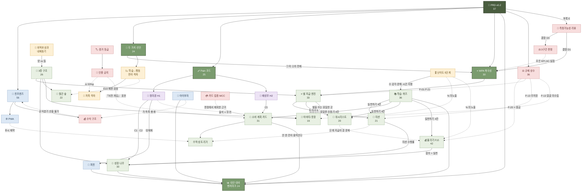

# 🗺 핀프렌즈 위키 — 인덱스

질문에 답할 때 **이 파일을 먼저 읽고** 관련 페이지로 들어간다.
작성 규칙 `wiki/README.md` · 운영 지침 루트 `CLAUDE.md`
설계 사양은 **`공용공간/9. PRD/` · `공용공간/10. SRS/`** 에, 시퀀스·API·배포 설계는
**`공용공간/11. 기술기획 산출물/`** 에 있다. 이 위키는 그 결정의 **판단 배경**을 담는다.

| | |
|---|---|
| **문서** | 44장 |
| **위키링크** | **762개** (본문 44장 기준) · 깨진 링크 **0** · 고립 페이지 **0** |
| **최소 연결도** | 인바운드 **3** — 외따로 떨어진 문서 없음 |
| **수집 범위** | **원본 5종** — PRD v0.2 · 기능정의 v13 · 학습난이도 설계안 · 퀴즈 60문항 · 예적금 비교 |
| **결정 배경** | 주요 결정 9건에 **「🧭 결정 배경 (Context)」** 절 — Summary · Evidence · Implication · 기각한 대안 |
| **설계 사양** | 기능정의 **v14** · PRD **v0.3** · SRS **v1.0** · 기술기획 산출물 **3건** *(`공용공간/`)* — 이 위키는 그 결정의 **배경**을 담는다 |
| **출처 무결성** | 원본 **5종 md5 대조 일치** · 수치 32건 raw 대조 (29 확인 · 3 미수집 표시) |

## 🧩 카테고리 8개 — 번호가 읽는 순서다

| 폴더 | 답하는 질문 | 장수 |
|---|---|:-:|
| **10-제품** | 핀프렌즈는 **무엇인가** | 7 |
| **20-기능** | 화면에서 **무엇을 하는가** | 10 |
| **30-사용자** | **누구의 어떤 문제**인가 | 3 |
| **40-시장** | **누구와 겨루는가** | 6 |
| **50-이론** | **왜 그렇게 만드는가** | 6 |
| **60-규칙** | **무엇을 넘으면 안 되는가** | 5 |
| **70-원본요약** | 그 근거의 **원본은 무엇인가** | 5 |
| **80-종합** | 질문 하나에 **위키 전체로 답하면** | 2 |

> 폴더를 가르는 기준과 헷갈릴 때의 판정법은 `wiki/README.md` 에 있다.
> 🔴 **페이지 이름은 팀이 부르는 이름으로 쓴다** — 검색이 제목을 먼저 맞추기 때문이다.

---

## 🧭 지식 구조 한눈에

> 숫자는 **연결도(인바운드 + 아웃바운드)**. 실선은 직접 파생, 점선은 제약·검증 관계.

---

## 🚪 여기부터 읽으면 된다

| 순서 | 페이지 | 왜 |
|:-:|---|---|
| 1 | [[핀프렌즈]] | 서비스 전체상 · 기능 목록 · 리스크 |
| 2 | [[두-가치-선언]] | 제품 정의의 최상위 문장과 **위계** |
| 3 | [[고객-문제-Pain-코드]] | 무엇을 문제로 골랐나 |
| 4 | [[WPA-북극성-지표]] | 무엇 하나로 성패를 재는가 |
| 5 | [[소비-계획-카드]] | 🔴 **사전 개입 ≠ 대조 기준선** — 이 구분을 놓치면 설계가 흔들린다 |
| 6 | [[인용-금지-목록]] | 🔴 **대외 자료 쓰기 전 필독** |

---

## 🏢 10-제품 — 핀프렌즈는 무엇인가

| 페이지 | 연결도 | 한 줄 |
|---|:-:|---|
| [[핀프렌즈]] | **57** | 🔴 **서비스 전체상** — 타깃·앱 구성·결제 트랙·리스크·게이트가 전부 여기서 갈라진다 |
| [[WPA-북극성-지표]] | 30 | 주간 실천 인정 아동 비율 · 조작적 정의 · v1/v2 |
| [[3층-구조]] | 26 | ⭐ 별(초기화 없음) / 🌳 나무(매달 초기화) / 🌲 숲(누적) |
| [[두-가치-선언]] | 24 | 선언 ①(성장이 일어난다)이 ②(그 성장이 보인다)의 **전제**다 |
| [[수익-구조]] | 14 | 🔴 **결제 수수료는 가정당 월 75원** — 제휴 보상이 사실상 전부 |
| [[PWA]] | 13 | 네이티브가 아니라 웹 · 앱 2개를 **오리진 분리**로 · iOS 푸시 제약 |
| [[기술-스택]] | 13 | Next.js·Node·PostgreSQL·Redis·AWS(서울)·three.js · 🤖 **AI는 아동 데이터 접촉 여부로 3평면** |

## 🧩 20-기능 — 화면에서 무엇을 하는가

**기능 1개 = 페이지 1장.** 팀이 부르는 이름이 곧 페이지 이름이다.

| 페이지 | 4칸 | 연결도 | 한 줄 |
|---|:-:|:-:|---|
| [[미션]] | 💰 벌기 | 21 | F2 · **유일한 수동 트리거** — 부모 승인 시 ⭐1 + 용돈 · 사진은 서버에 안 남긴다 |
| [[소비-계획-카드]] | 🛒 잘 쓰기 | 31 | F8 · **건별 계획 카드** · 🔴 **사전 개입이 아니라 사후 대조** |
| [[계획-카드-작성-트리거]] | 〃 | 9 | 평일 하교 시간대 · 주말 09:00 — **그날 계획이 0건일 때만** 알린다 |
| [[위시리스트]] | 🐷 모으기 | 20 | F12 · 30·70·100% 각 ⭐1 — **아이 화면엔 `%` 를 안 쓴다** |
| [[불리기-예적금-실천]] | 🌱 불리기 | **42** | F15 · 🔒 **비교·선택은 열고 ⭐는 잠금** · 4칸 중 유일하게 실천이 닫힌 칸 |
| [[학습-커리큘럼-퀴즈]] | 전체 | 36 | F3 · **퀴즈는 별을 주지만 성장은 주지 않는다** · 일일 4개 한도 |
| [[별-지급-엔진]] | 전체 | 33 | F4 · 트리거 8종(자동 7 / 수동 1) · 정합성 오류율 0% |
| [[성장-나무]] | 부모 | 33 | F1 · 부모가 이번 주기 성취를 읽는 화면 · **실천 없이는 안 자란다** |
| [[월간-숲]] | 부모 | 22 | F9 · **전월 대비 델타가 성장 증거** · E10의 측정 도구 |
| [[아바타-옷장]] | 아이 홈 | 16 | F5 · **별을 쓰는 유일한 곳**(⭐3·5·7·10) · 얼굴 미수집 |

## 👤 30-사용자 — 누구의 어떤 문제인가

| 페이지 | 연결도 | 한 줄 |
|---|:-:|---|
| [[고객-문제-Pain-코드]] | 25 | Pain 8건 — 선별 3 · 보조 3 · 감시 2 |
| [[정미경-H1]] | 20 | 39 · 교사 · 퍼핀 8개월차 — *"보고도 모른다"* · 선별 C1·C2 |
| [[배성우-H2]] | 17 | 42 · 자영업 · 현금 봉투 3년 — *"볼 것이 없다"* · **1차 타깃의 얼굴** |

## 📊 40-시장 — 누구와 겨루는가

| 페이지 | 연결도 | 한 줄 |
|---|:-:|---|
| [[대안-대비-벤치마크]] | 24 | 3축 5지표 · **개념과 개체가 만나는 교차점** — 변화 지표 0개 vs 7개 |
| [[퍼핀]] | 20 | 기준 비교 대상 — 문제 정의가 여기서 나왔다 · 부모 화면 **숫자 3개** |
| [[아이부자]] | 12 | 국내 최대(자녀 78만) · **0원** · 가격 축 봉쇄(R7) |
| [[하나은행]] | 10 | 아이부자(78만·0원) + 꿈꾸는 저금통(4.00%) — **둘이 이어져 있지 않다** |
| [[금융감독원]] | 9 | 교재 2종이 난이도 **4·5단계의 기준선** · *"초1~2를 왜 뺐는지"* 를 직접 밝힘 |
| [[카카오뱅크]] | 8 | 우리아이적금 **연 7.00%** — 6종 최고금리, 조건은 부모 자동이체 6회 |

## 📚 50-이론 — 왜 그렇게 만드는가

| 페이지 | 연결도 | 한 줄 |
|---|:-:|---|
| [[학습-행동-전이-격차]] | 24 | 지식 **+0.33 SD** vs 행동 **+0.07 SD** `[A]` |
| [[학습-난이도-5단계]] | 22 | **초1~3 교육과정에 금융이 없다** → 수 감각·문해·시간 지평 3축 |
| [[외적보상과-내재동기]] | 20 | 인센티브는 **양**, 내재동기는 **질** → 별과 나무를 분리한 근거 |
| [[어린이-적금-우대금리-구조]] | 19 | 시중 6종 우대조건 중 **아이가 하는 것 0개** `[A]` |
| [[저축-격차]] | 14 | 부모 희망 **65.8%(1위)** ↔ 아이 실제 **12.8%(최하위)** `[A]` · ⚠️ 차감 금지 |
| [[카드-업종-분류-MCC]] | 7 | ⚠️ 일반지식(raw 없음) · **업종 매칭 정확도를 못 재는 이유**의 배경 |

## ⚖️ 60-규칙 — 무엇을 넘으면 안 되는가

| 페이지 | 연결도 | 한 줄 |
|---|:-:|---|
| [[규제-상수]] | **36** | 🔴 9조항 · **협상 불가** · 성능보다 우선 |
| [[인용-금지-목록]] | 22 | 🔴 10항목 + 지오펜싱 서술 전면 금지 — **대외 발화의 관문** |
| [[측정가능성-리뷰]] | 21 | 산출물을 **판정 가능한 형태**로 바꾸는 방법 · 결함 11건 · 재사용 가능 |
| [[증거-등급-체계]] | 18 | `[A]` `[관측]` `[추론]` `[가설]` `[설계 확정]` ✍️`[합성 가설]` 🧪`[모의]` |
| [[PASS-HOLD-FAIL-3구간-판정]] | 11 | 모든 KPI·AC·실험 공통 · `k/8` 정수 판정 · κ ≥ 0.6 |

## 📥 70-원본요약 — 그 근거의 원본은 무엇인가

`raw/` 1건 = 요약 1장. **하위 폴더는 `raw/` 를 그대로 미러링한다:**
`raw/60-internal/prd/PRD_핀프렌즈_v0_2.md` → `wiki/70-원본요약/60-internal/prd/PRD_핀프렌즈_v0_2.md`

| raw 카테고리 | 원본 | 요약 | 페이지 |
|---|:-:|:-:|---|
| **60-internal** / `prd` | **1** | **1** | [[PRD_핀프렌즈_v0_2]] *(현행 · 유일본)* |
| 〃 / `기능정의` | **1** | **1** | [[2026-08-31_팀_기능정의-v13|기능정의 v13]] *(2026-08-31 갱신 · PRD보다 최신)* |
| 〃 / `학습설계` | **2** | **2** | [[2026-08-31_수빈_학습난이도-5단계-설계안|학습 난이도 5단계 설계안]] · [[2026-08-31_수빈_퀴즈샘플-60문항|퀴즈 샘플 60문항]] |
| **20-services** | **1** | **1** | [[2026-08-31_수빈_초등저학년-예적금-비교]] *(기준일 2026-08-31)* |
| 10-market · 30-research · 40-regulation · 50-user-voice · 70-tech · 90-misc | 0 | 0 | — *(수집 전)* |

## 🧪 80-종합 — 위키 전체로 답한 질문

| 페이지 | 질문 |
|---|---|
| [[2026-예적금-기획-종합]] | 「불리기」는 경쟁사·시중 상품 대비 어떤 **내재동기적 차별점**을 갖는가 |
| [[랜딩페이지-퍼널-점검]] | 랜딩페이지(`공용공간/12`)는 인지~재구매 퍼널을 얼마나 채웠고, 무엇이 비어 있는가 |

---

## 🔻 연결이 얇은 곳 — 다음 수집의 단서

| 노드 | 왜 얇은가 | 보강 방법 |
|---|---|---|
| [[수익-구조]] (in 3) | 제휴 조건이 `⬜ 미확인`이라 **다른 페이지가 인용할 수치가 없다** | 발급 보상 단가 확인 후 확장 |
| [[계획-카드-작성-트리거]] (in 4) | **가장 최근에 확정된 설계**라 아직 참조가 얇다 | 실측 후 [[WPA-북극성-지표]]·[[별-지급-엔진]]과 연결 |
| [[카드-업종-분류-MCC]] (in 4) | 판정 경로에서 빠져 **참조 이유가 줄었다** | F13 소비 내역 설계 시 재연결 |
| [[카카오뱅크]] (in 4) | 상품 수치 1건으로만 인용된다 | mini 등 선불 서비스 원본 수집 시 확장 |
| [[아이부자]] (out 5) | 팀이 **직접 조사한 원본이 `raw/`에 없다** | 서비스분석 자료를 `raw/20-services/` 로 수집 |

---

## 🔴 이 위키가 지금 알고 있는 「모르는 것」

수집·검증을 이어갈 때의 우선순위다.

| # | 공백 | 어디에 적혀 있나 |
|:-:|---|---|
| **1** | 🔴 **고객 인터뷰 0건** — 모든 목표 수치가 `[가설]`. 부모 8명 계획은 확정, **아이 인터뷰는 여전히 0건** | [[핀프렌즈]] · [[증거-등급-체계]] |
| **2** | 🔴 **제휴사 발급 건당 보상 단가 미확인** — 수익의 **지배 변수**라 손익분기를 산출할 수 없다 | [[수익-구조]] · [[규제-상수]] |
| **3** | 🔴 **알림 도달률 미검증** — [[PWA]] 푸시 제약(iOS)이 [[계획-카드-작성-트리거]]의 급소다. 목표 ≥70%는 `[가설]` | [[계획-카드-작성-트리거]] |
| **4** | 🔴 **예적금 중개업 해당 여부** · **부모 적금 「표시만」의 유사 표시 해당 여부** — F15 ⭐ 잠금 해제 게이트 | [[규제-상수]] · [[불리기-예적금-실천]] |
| **5** | 🔴 **부모가 실제로 이자를 줄 것인가**(검증과제 ③) — 검증 방식은 확정(β 8명 전후 2회), **결과는 미측정** | [[불리기-예적금-실천]] |
| **6** | 🔴 **미션 자동 지급률 미측정** — 72h 미확인 시 ⭐와 용돈이 **부모 확인 없이** 나간다. 상한 ≤ 10%(`SRS NFR-025`)는 `[가설]`이고, 알림 2회는 전부 [[PWA]] 푸시 도달률(`⬜ 미검증`)에 의존한다 | [[미션]] · [[PWA]] |
| **7** | **하교 시간대 기본값** · 3일 미작성 완화 규칙 미확정 | [[계획-카드-작성-트리거]] |
| **8** | **위시리스트 아이 화면의 `%` 대체 표기 미확정** — 정액·그림으로 간다는 방향만 정해졌다 | [[위시리스트]] · [[학습-난이도-5단계]] |
| **9** | **초5~6에게 옷장 홈이 유치하다** — 홈을 두 벌 만들지 여부가 MVP 밖에 있다 | [[아바타-옷장]] · [[핀프렌즈]] |
| **10** | **간편결제(PG) 비중 미확인** — F13 소비 내역 표시 품질을 좌우한다 | [[카드-업종-분류-MCC]] |
| **11** | ⚠️ **1·2단계 학습 콘텐츠에 금감원 대조 기준이 없다** (금감원이 그 구간을 뺐다) | [[학습-커리큘럼-퀴즈]] · [[학습-난이도-5단계]] |
| **12** | ⚠️ **저축 격차 53%p 표기가 문서마다 엇갈림** | [[저축-격차]] |
| **13** | [[퍼핀]] 「또래 비교·분석」 **실제 화면 미확인** · **가입자 수치가 `raw/` 미수집**(기준 2024-09) | [[퍼핀]] · [[대안-대비-벤치마크]] E11 |
| **14** | [[아이부자]] **금융 과목 비율 미산정** — 직접 조사 원본 없음 | [[아이부자]] |
| **15** | 🔴 **「이자」 Importance 1.02가 `raw/` 미수집** — 4개 문서가 인용하는데 원본을 직접 읽지 않았다 | [[고객-문제-Pain-코드]] |
| **16** | [[카카오뱅크]] **mini** · 토스 유스카드 등 **선불 서비스 원본 미수집** | [[2026-예적금-기획-종합]] |
| **17** | 게이미피케이션의 **자율성·유능감·관계성** 학술 원본 미수집 | 〃 |
| **18** | **1차 타깃 규모 미분해** — 29.3만이 H2형만의 규모인지 알 수 없다(`raw/10-market/` 비어 있음) | [[핀프렌즈]] |
