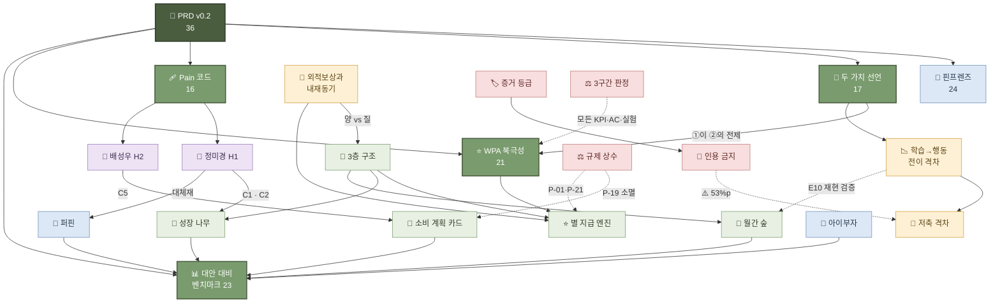

# 🗺 핀프렌즈 위키 — 인덱스

질문에 답할 때 **이 파일을 먼저 읽고** 관련 페이지로 들어간다.
작성 규칙 `wiki/README.md` · 운영 지침 루트 `CLAUDE.md`

| | |
|---|---|
| **문서** | 24장 (concepts 16 · entities 5 · sources 3) |
| **위키링크** | **253개** (본문 24장 기준) · 깨진 링크 **0** · 고립 페이지 **0** |
| **최소 연결도** | 인바운드 **4** ([[아이부자]]) — 외따로 떨어진 문서 없음 |
| **수집 범위** | [[핀프렌즈]] PRD 3종(`raw/60-internal/prd/`)뿐 |

---

## 🧭 지식 구조 한눈에

> 숫자는 **연결도(인바운드 + 아웃바운드)**. 실선은 직접 파생, 점선은 제약·검증 관계.

---

## 🎯 중심축 노드 — 여기가 끊기면 위키가 갈라진다

### 최상위 허브

| 노드 | 연결도 | 역할 |
|---|:-:|---|
| [[PRD_핀프렌즈_v0_2]] | **36** (16↓/20↑) | 🔴 **모든 것의 출처.** 현재 수집된 유일한 현행 원본 |
| [[핀프렌즈]] | **24** (9↓/15↑) | 서비스 전체상 — 기능·리스크·게이트가 여기서 갈라진다 |
| [[대안-대비-벤치마크]] | **23** (11↓/12↑) | **개념과 개체가 만나는 교차점** — 기능 4개 + 경쟁사 3개가 모두 여기로 |
| [[WPA-북극성-지표]] | **21** (10↓/11↑) | 지표 계열의 수렴점 |

### 개념 축 (concepts)

| 노드 | 연결도 | 이 노드가 묶는 것 |
|---|:-:|---|
| [[성장-나무]] | 18 | C1·C3 · 승급 규칙 · 5초 회상 AC |
| [[소비-계획-카드]] | 18 | **최근 최대 결정**(F14·F19 삭제) · C5·C6 · E3 |
| [[두-가치-선언]] | 17 | 선언 ①→② 위계 — 북극성 선택의 근거 |
| [[학습-행동-전이-격차]] | 17 | 학술 근거의 출발점 · E10으로 이어짐 |
| [[월간-숲]] | 17 | 전월 대비 델타 = 성장 증거 · E10 측정 도구 |
| [[인용-금지-목록]] | 17 | **대외 발화의 관문** — 모든 주장이 여기를 통과해야 함 |
| [[별-지급-엔진]] · [[고객-문제-Pain-코드]] · [[3층-구조]] · [[증거-등급-체계]] | 16 | 각각 보상 · 문제 · 데이터 · 근거 계열의 뿌리 |

### 개체 축 (entities)

| 노드 | 연결도 | 역할 |
|---|:-:|---|
| [[정미경-H1]] | 15 | 선별 C1·C2의 인물 — [[퍼핀]]·[[성장-나무]]를 잇는다 |
| [[배성우-H2]] | 12 | 선별 C5의 인물 — **F14·F19를 죽인 근거**(키즈워치) |
| [[퍼핀]] | 12 | 기준 비교 대상 — 문제 정의가 여기서 나왔다 |
| [[아이부자]] | 7 | 가격 축 봉쇄(R7) · 🔻 **가장 느슨한 노드** |

### 🔻 연결이 얇은 곳 — 다음 수집의 단서

| 노드 | 왜 얇은가 | 보강 방법 |
|---|---|---|
| [[아이부자]] (in 4) | 팀이 **직접 조사한 원본이 `raw/`에 없다.** PRD가 인용한 만큼만 서 있음 | 서비스분석 자료를 `raw/20-services/` 로 수집 |
| [[규제-상수]] (out 3) | 조항 9개가 **한 페이지에 뭉쳐 있다** | 법령 원본 수집 후 조항별 분할 검토 |
| [[퍼핀]] (out 5) | 리뷰·화면 캡처 원본 미수집 | `raw/50-user-voice/` · `raw/20-services/` |

---

## 🚪 여기부터 읽으면 된다

| 순서 | 페이지 | 왜 |
|:-:|---|---|
| 1 | [[핀프렌즈]] | 서비스 전체상 · 기능 목록 · 리스크 |
| 2 | [[두-가치-선언]] | 제품 정의의 최상위 문장과 **위계** |
| 3 | [[고객-문제-Pain-코드]] | 무엇을 문제로 골랐나 |
| 4 | [[WPA-북극성-지표]] | 무엇 하나로 성패를 재는가 |
| 5 | [[소비-계획-카드]] | 가장 최근의 큰 결정(F14·F19 삭제) |
| 6 | [[인용-금지-목록]] | 🔴 **대외 자료 쓰기 전 필독** |

---

## 📚 개념 (concepts · 16장)

### 제품 `concepts/product/` — 8장

| 페이지 | 한 줄 |
|---|---|
| [[두-가치-선언]] | 선언 ①(성장이 일어난다)이 ②(그 성장이 보인다)의 **전제**다 |
| [[3층-구조]] | ⭐ 별(초기화 없음) / 🌳 나무(매달 초기화) / 🌲 숲(누적) |
| [[성장-나무]] | F1 · 부모가 이번 주기 성취를 읽는 화면 · **실천 없이는 안 자란다** |
| [[월간-숲]] | F9 · **전월 대비 델타가 성장 증거** · E10의 측정 도구 |
| [[소비-계획-카드]] | F8 · F14·F19를 흡수한 결정 · **생존 조건은 작성률 50%** |
| [[별-지급-엔진]] | F4 · 트리거 8종(자동 7 / 수동 1) · 정합성 오류율 0% |
| [[고객-문제-Pain-코드]] | Pain 8건 — 선별 3 · 보조 3 · 감시 2 |
| [[WPA-북극성-지표]] | 주간 실천 인정 아동 비율 · 조작적 정의 · v1/v2 |

### 사업·방법론 `concepts/business-strategy/` — 5장

| 페이지 | 한 줄 |
|---|---|
| [[PASS-HOLD-FAIL-3구간-판정]] | 모든 KPI·AC·실험 공통 · `k/8` 정수 판정 · κ ≥ 0.6 |
| [[증거-등급-체계]] | `[A]` `[관측]` `[추론]` `[가설]` `[설계 확정]` ✍️`[합성 가설]` 🧪`[모의]` |
| [[인용-금지-목록]] | 🔴 10항목 + 지오펜싱 서술 전면 금지 |
| [[규제-상수]] | 9조항 · **협상 불가** · 성능보다 우선 |
| [[대안-대비-벤치마크]] | 3축 5지표 · 변화 지표 **0개 vs 7개** |

### 금융교육 `concepts/finance-education/` — 2장

| 페이지 | 한 줄 |
|---|---|
| [[학습-행동-전이-격차]] | 지식 **+0.33 SD** vs 행동 **+0.07 SD** `[A]` |
| [[저축-격차]] | 부모 희망 **65.8%(1위)** ↔ 아이 실제 **12.8%(최하위)** `[A]` · ⚠️ 차감 금지 |

### 행동·보상 `concepts/behavior-reward/` — 1장

| 페이지 | 한 줄 |
|---|---|
| [[외적보상과-내재동기]] | 인센티브는 **양**, 내재동기는 **질** → 별과 나무를 분리한 근거 |

---

## 🏷 개체 (entities · 5장)

### 서비스 `entities/services/`

| 페이지 | 한 줄 |
|---|---|
| [[핀프렌즈]] | 자사 · 무료 · 결제 수수료 + 제휴 2중 구조 |
| [[퍼핀]] | 기준 비교 대상 · 부모 화면 **숫자 3개** · 금융 과목 3/7 |
| [[아이부자]] | 국내 최대(자녀 78만) · **0원** · 가격 축 봉쇄 |

### 인물 `entities/people/`

| 페이지 | 한 줄 |
|---|---|
| [[정미경-H1]] | 39 · 교사 · 퍼핀 8개월차 — *"보고도 모른다"* · 선별 C1·C2 |
| [[배성우-H2]] | 42 · 자영업 · 현금 봉투 3년 — *"볼 것이 없다"* · 선별 C5 · **키즈워치** |

> `entities/companies/` · `organizations/` · `tech-stack/` 은 비어 있다 — 해당 원본 미수집.

---

## 📥 원본 요약 (sources · 3장)

| 카테고리 | 원본 | 요약 | 페이지 |
|---|:-:|:-:|---|
| **60-internal** / `prd` | **3** | **3** | [[PRD_핀프렌즈_v0_2]] *(현행)* · [[PRD_핀프렌즈_v0_1]] *(대체됨)* · [[PRD_핀프렌즈_v0_1_품질리뷰]] |
| 10-market | 0 | 0 | — |
| 20-services | 0 | 0 | — |
| 30-research | 0 | 0 | — |
| 40-regulation | 0 | 0 | — |
| 50-user-voice | 0 | 0 | — |
| 70-tech | 0 | 0 | — |
| 90-misc | 0 | 0 | — |

> **경로 규칙** — `wiki/sources/` 는 `raw/` 를 **하위 폴더까지** 미러링한다:
> `raw/60-internal/prd/PRD_핀프렌즈_v0_2.md` → `wiki/sources/60-internal/prd/PRD_핀프렌즈_v0_2.md`

---

## 🔴 이 위키가 지금 알고 있는 「모르는 것」

수집을 이어갈 때의 우선순위다.

| # | 공백 | 어디에 적혀 있나 |
|:-:|---|---|
| 1 | **고객 인터뷰 0건** — 모든 목표 수치가 `[가설]` | [[핀프렌즈]] · [[증거-등급-체계]] |
| 2 | [[퍼핀]] 「또래 비교·분석」 **실제 화면 미확인** | [[퍼핀]] · [[대안-대비-벤치마크]] E11 |
| 3 | [[아이부자]] **금융 과목 비율 미산정** | [[아이부자]] |
| 4 | 제휴사 **수수료율·최소 물량 미확인** → 수익 산출식 없음 | [[규제-상수]] · [[핀프렌즈]] R5 |
| 5 | 예적금 **중개업 해당 여부 미확인** → F15 블로커 | [[규제-상수]] |
| 6 | **업종 일치를 ⭐ 판정에 넣을지 미결** | [[소비-계획-카드]] |
| 7 | **출석체크 조건 미결** — H1과 H2가 정반대 신호 | [[별-지급-엔진]] |
| 8 | ⚠️ **저축 격차 53%p 표기가 문서마다 엇갈림** | [[저축-격차]] |
