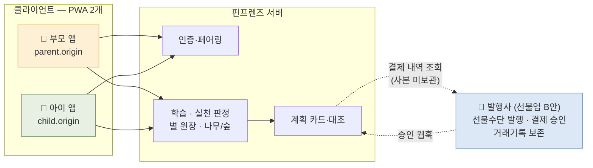
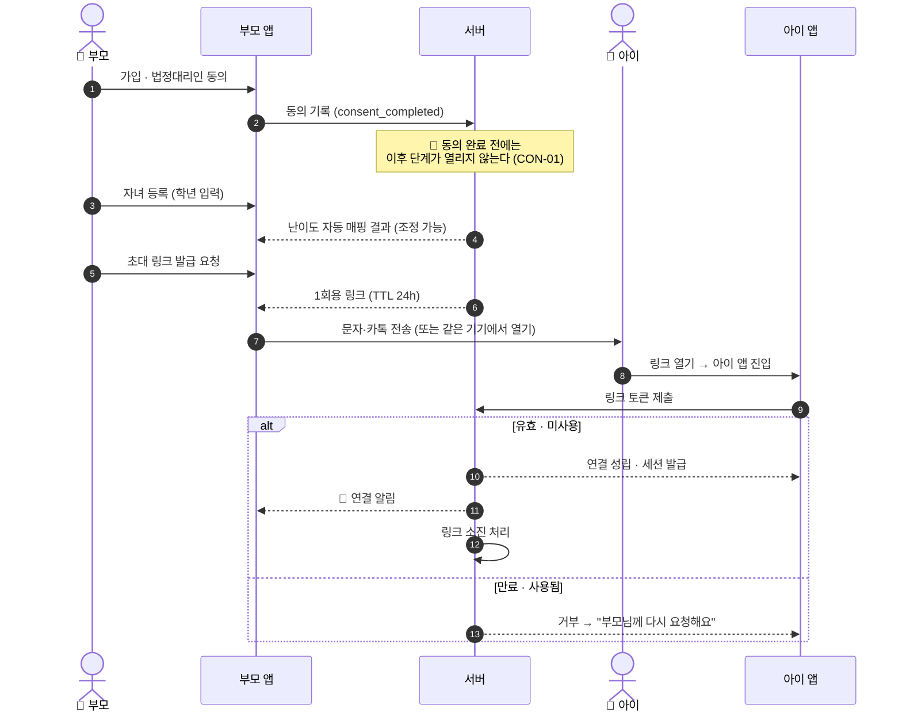
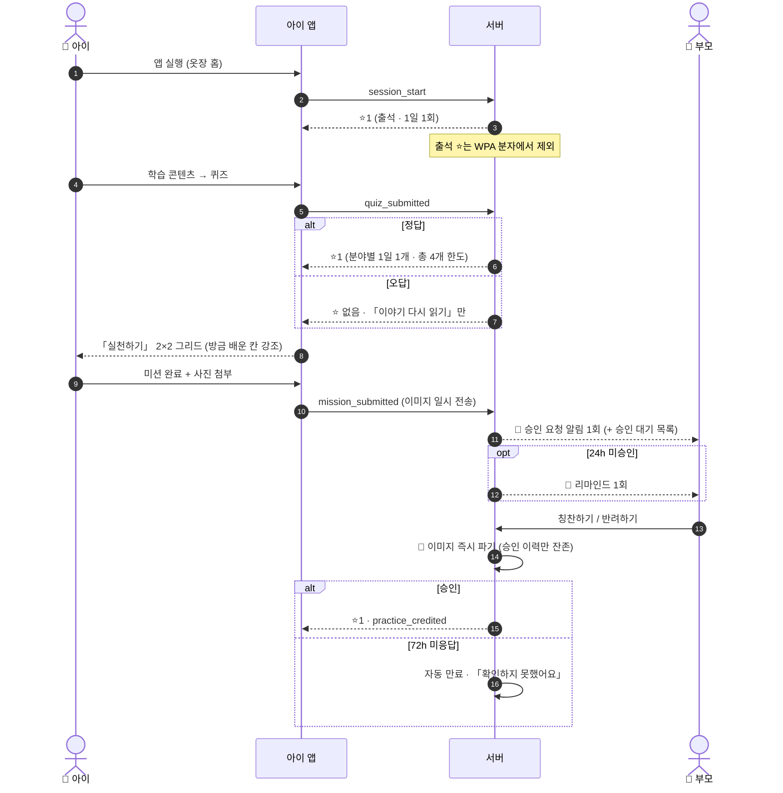
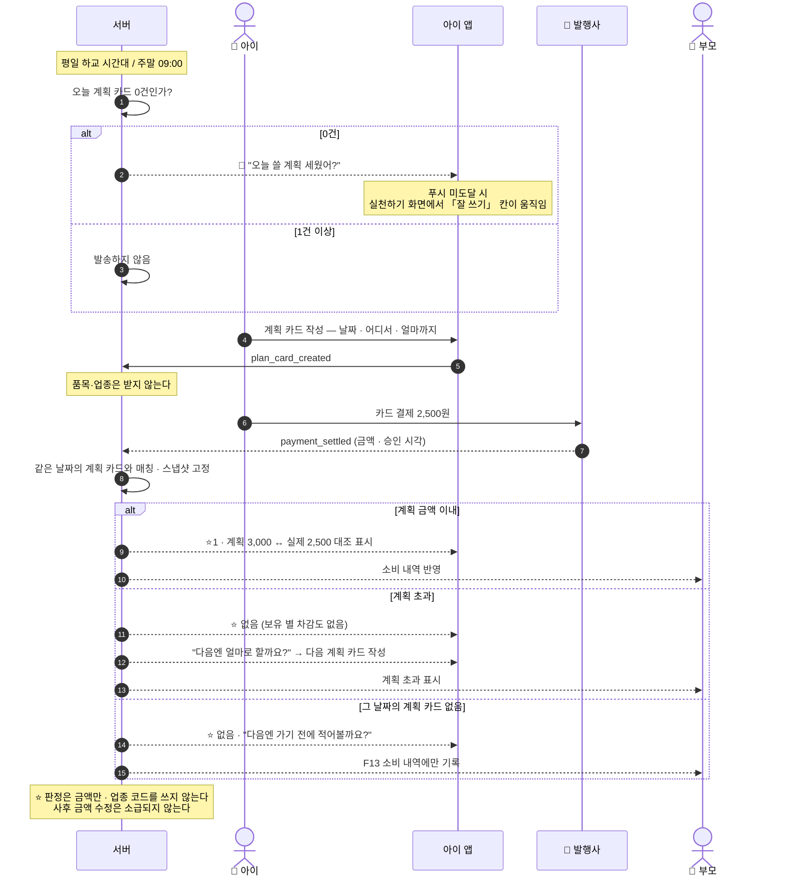
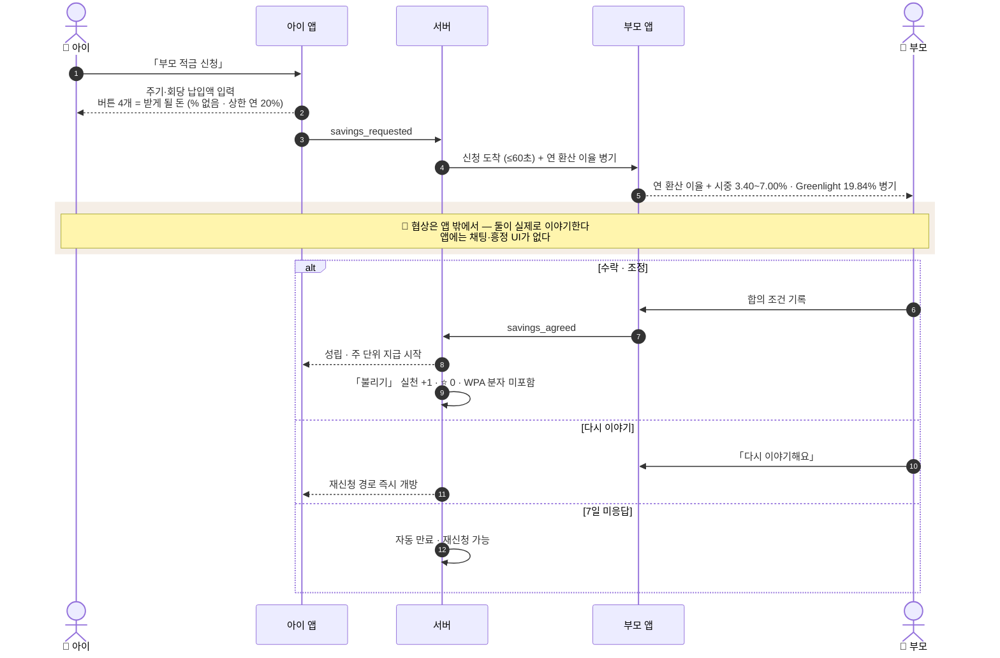
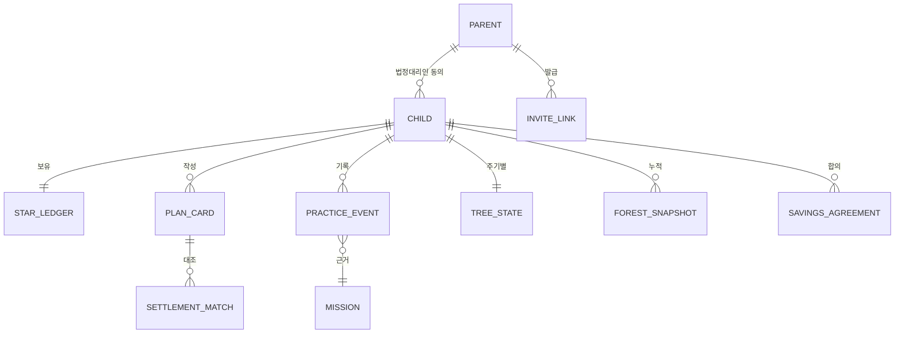

# 핀프렌즈(FinFriends) 소프트웨어 요구사항 명세서 (SRS)

- **문서** — `공용공간/10. SRS/SRS_핀프렌즈_v1_0.md` · **버전** v1.0 · **작성일** 2026-09-01
- **표준** ISO/IEC/IEEE 29148:2018 (Systems and software engineering — Life cycle processes — Requirements engineering)
- **상위 문서** [`9. PRD/PRD_핀프렌즈_v0_3.md`](../9.%20PRD/PRD_%ED%95%80%ED%94%84%EB%A0%8C%EC%A6%88_v0_3.md) · [`0. 확정 기능 정의/기능정의_v13.md`](../0.%20%ED%99%95%EC%A0%95%20%EA%B8%B0%EB%8A%A5%20%EC%A0%95%EC%9D%98/%EA%B8%B0%EB%8A%A5%EC%A0%95%EC%9D%98_v13.md)
- **지식베이스** [`wiki/`](../../wiki/index.md) — 각 결정의 근거는 해당 페이지의 **「🧭 결정 배경 (Context)」** 절
- **Owner** 제품기획 수빈 / 정책·법령 병윤 / 경쟁·리뷰 하영 / 서비스분석 혜원

> 🔴 **문서 지위** — 고객 인터뷰 **0건**입니다. 본 SRS의 **목표 수치는 대부분 `[가설]`** 이고 기준선은 `⬜ 미측정`입니다.
> 어느 수치도 **성과로 인용할 수 없습니다.** 등급 표기는 PRD §0을 승계합니다.

---

## 1. 서론 (Introduction)

### 1.1 목적 (Purpose)

본 문서는 핀프렌즈 MVP의 **소프트웨어 요구사항**을 개발·검증 가능한 형태로 명세한다.
독자는 개발자, QA, 정책·법령 담당, 제휴 협상 담당이다.

### 1.2 범위 (Scope)

핀프렌즈는 **초1~3(만 7~9세) 아동과 그 부모**를 위한 금융 학습·실천 서비스다.
아동이 용돈을 **벌기 · 잘 쓰기 · 모으기 · 불리기** 4영역으로 다루는 동안,
부모는 그 **행동의 변화**를 성장 나무와 월간 숲으로 확인한다.

| 구분 | 내용 |
|---|---|
| **In** | 학습·퀴즈(3단계) · **미션 루프(용돈 보상 + ⭐)** · **소비 계획 카드** · 위시리스트 · **부모 적금 신청·협상** · 별 지급 · 아바타/옷장 · 성장 나무 · 월간 숲 · 소비 내역 · 부모 온보딩·법정대리인 동의 · **아이 앱 페어링** |
| **Out** | 앱 외부 현금 · 친구 기능 · 모의투자 · **위치 기반 기능 일체** · **예적금 가입 중개** · 앱 내 협상 UI · 광고 · 아이템 현금 판매 · 실물 카드 발급(MVP) |

### 1.3 정의 · 약어

| 용어 | 뜻 |
|---|---|
| **계획 카드** | 쓰기 전에 아이가 적는 **「날짜 · 어디서 · 얼마까지」 3필드**. 품목·업종은 받지 않는다. **개입 수단이 아니라 사후 대조의 기준선**이다 |
| **⭐ 별** | 아동의 즉각 보상 재화. 차감형·초기화 없음. **현금과 완전 분리** |
| **미션 보상** | 미션 승인 시 지급되는 **두 가지** — 부모가 정한 **용돈(실제 돈, 지갑 충전)** 과 **⭐1**. 서로 교환되지 않는다 |
| **성장 나무** | 부모 화면. 4영역 × 4단계(새싹·나무·꽃나무·열매나무). **매월 1일 초기화** |
| **월간 숲** | 부모 화면. 초기화 없이 누적. **전월 대비 델타가 성장 증거** |
| **WPA** | Weekly Practiced Active — 주간 실천 인정 아동 비율. 북극성 지표 |
| **오리진(Origin)** | 부모용·아이용 PWA가 각각 배치되는 서로 다른 서브도메인 |
| **발행사** | 선불전자지급수단을 발행하는 제휴 금융사. 선불업 **B안** |

### 1.4 참조 문서

PRD v0.3 · 기능정의 v13 · 학습 난이도 5단계 설계안 · 퀴즈 샘플 60문항 · 초등저학년 예적금 비교 · 개인정보보호법 §22의2 · 전자금융거래법 · 위치정보법

---

## 2. 전체 설명 (Overall Description)

### 2.1 제품 조망



### 2.2 사용자 특성

| 사용자 | 특성 | 설계 제약 |
|---|---|---|
| 🧒 **아동** (만 7~9세) | 비율(`%`)·달력(월 단위)을 아직 배우지 않음. 전용 스마트폰이 없을 수 있음 | `%` 미노출 · **주 단위** 시간 표현 · 부모 기기 공용 가능 |
| 👤 **부모** | 1차 타깃은 **현금·용돈 봉투를 쓰는 아날로그 가정**. 온보딩 부담에 민감 | 판단을 요구하는 질문 최소화 · 학년만 묻고 나머지는 자동 매핑 |

### 2.3 제약 (Constraints)

| ID | 제약 | 출처 |
|---|---|---|
| CON-01 | 법정대리인 동의 완료 전 아이 화면 진입 불가 | 개인정보보호법 · P-05·P-22 |
| CON-02 | 만 14세 미만 **마이데이터 가입 불가** → 오픈뱅킹 연동 불가, **폐쇄형 수집 필수** | F-01 |
| CON-03 | 별 ↔ 현금 **전환 경로를 코드에 두지 않는다**(기능 플래그 차단 금지) | P-01·P-21 |
| CON-04 | 카드 **한도·업종 제한은 발행사 정책 종속** | P-17·P-18 |
| CON-05 | 예적금 **가입 중개 불가** | P-20 |
| CON-06 | **위치정보를 일절 수집하지 않는다** | P-19(적용 대상 소멸) |
| CON-07 | 아동 이미지·결제 내역 **서버 미보관** | ADR-007·008 |

### 2.4 가정 · 의존성

발행사 제휴 조건(발급 보상 단가·수수료율·**가맹점 업종 분류 상세도**) ⬜ 미확정 ·
P-20 및 부모 적금 표시의 법률 검토 ⬜ 미완 · deferred deep link 플랫폼 지원 ⬜ 미검증.

---
## 3. 시스템 인터랙션 (System Interaction)

### 3.1 온보딩 · 페어링



### 3.2 학습 → 실천 → 별 지급



### 3.3 계획 카드 → 결제 → 대조



### 3.4 부모 적금 신청 · 협상



---
## 4. 기능 요구사항 (Functional Requirements)

> **표기** — 각 FR은 `입력 → 처리 → 출력 → 예외`로 명세하고, AC는 **Given-When-Then**으로 성공·실패를 모두 적는다.
> `PRD` 태그는 상위 문서 추적성, `US` 태그는 사용자 스토리 추적성이다.

### 4.1 계정 · 페어링

#### FR-001 법정대리인 동의 게이트 · `PRD §5-1 P-05·P-22` `US-11`

| | |
|---|---|
| **입력** | 부모 식별정보, 동의 항목별 체크, 아동 프로필(닉네임·학년) |
| **처리** | 동의 완료 시각을 기록하고 **아동 프로필 생성 · 초대 링크 발급 권한**을 개방한다 |
| **출력** | `consent_completed` 이벤트, 아동 프로필 ID |
| **예외** | 동의 미완 상태의 링크 발급 요청 → **거부**(403) 및 `consent_gate_blocked` 기록 |

- **AC-001-1** **Given** 동의가 완료되지 않은 부모 계정 / **When** 초대 링크 발급을 요청한다 / **Then** 발급이 거부되고 `consent_gate_blocked`가 1건 기록된다.
- **AC-001-2** **Given** 동의가 완료된 부모 계정 / **When** 자녀를 등록한다 / **Then** 아동 프로필이 생성되고 학년에 대응하는 난이도 단계가 자동 설정된다.
- **AC-001-3 (실패)** **Given** 필수 동의 항목 1건이 미체크 / **When** 다음 단계로 진행한다 / **Then** 진행이 차단되고 미체크 항목이 지시된다.

#### FR-002 초대 링크 발급 · 연결 · `US-11`

| | |
|---|---|
| **입력** | 아동 프로필 ID |
| **처리** | **1회용 토큰**을 생성하고 **TTL 24시간**을 부여한다. 아이 앱 첫 실행 시 토큰을 검증·세션 발급 후 **토큰을 소진 처리**한다 |
| **출력** | 링크 URL, 연결 성립 시 부모 앱 알림 |
| **예외** | 만료·사용된 토큰 → 거부 및 재발급 안내 / 동의 철회 상태 → 전체 무효 |

- **AC-002-1** **Given** 유효한 미사용 링크 / **When** 아이가 링크를 연다 / **Then** 연결이 성립하고 부모 앱에 알림이 도착하며 링크가 즉시 소진된다.
- **AC-002-2 (실패)** **Given** 24시간이 지난 링크 / **When** 아이가 링크를 연다 / **Then** 연결이 거부되고 *"부모님께 다시 요청해요"* 가 표시된다.
- **AC-002-3** **Given** 부모와 아이가 같은 기기를 쓴다 / **When** 부모가 링크를 자기 기기에서 연다 / **Then** 전송 없이 연결이 성립한다.
- **AC-002-4 (실패)** **Given** 부모가 동의를 철회했다 / **When** 미사용 링크로 접속을 시도한다 / **Then** 전부 무효 처리되어 거부된다.

#### FR-003 오리진 분리 · `CON-01` `PRD §5-3`

| | |
|---|---|
| **입력** | 세션 토큰(부모용 / 아이용) |
| **처리** | 서버가 **오리진별 스코프를 강제**한다. 아이 토큰으로는 부모 API에 접근할 수 없다 |
| **출력** | 스코프 위반 시 403 및 감사 로그 |
| **예외** | 아이 오리진 번들에 부모 엔드포인트가 포함된 빌드 → **배포 차단** |

- **AC-003-1** **Given** 아이 세션 토큰 / **When** 부모 전용 API(승인·소비 내역)를 호출한다 / **Then** 403을 반환하고 감사 로그를 남긴다.
- **AC-003-2** **Given** 아이 오리진 빌드 산출물 / **When** 정적 스캔을 수행한다 / **Then** 부모 엔드포인트 문자열이 **0건**이다.

### 4.2 학습 · 보상

#### FR-010 출석 별 지급 · `PRD ADR-012` `US-2`

| | |
|---|---|
| **입력** | 아이 앱 세션 시작 이벤트 |
| **처리** | KST 기준 **1일 1회** ⭐1을 지급하고 원장에 기입한다 |
| **출력** | ⭐ 잔액, `star_granted(trigger=attendance)` |
| **예외** | 같은 날 재접속 → 중복 지급 없음 / 오프라인 후 재연결 → `idempotency_key`로 중복 차단 |

- **AC-010-1** **Given** 오늘 첫 접속 / **When** 아이 앱을 연다 / **Then** ⭐1이 지급되고 **WPA 분자에는 포함되지 않는다**.
- **AC-010-2 (실패)** **Given** 오늘 이미 접속한 아동 / **When** 다시 접속한다 / **Then** ⭐가 추가 지급되지 않는다.

#### FR-011 학습 · 퀴즈 · `PRD §4-1 F3` `US-2`

| | |
|---|---|
| **입력** | 학습 콘텐츠 열람 완료, 퀴즈 답안 |
| **처리** | 정답 시 ⭐1. **분야별 1일 1개 · 총 4개** 한도. 오답 시 「이야기 다시 읽기」만 제공 |
| **출력** | 정답 여부, ⭐, 부모 화면 정답률 |
| **예외** | 한도 소진 후 재도전 → 풀이는 가능하되 ⭐ 미지급 / 배정 난이도의 콘텐츠 부재 → *"준비 중"* 안내 |

- **AC-011-1** **Given** 오늘 「잘 쓰기」 퀴즈를 풀지 않은 아동 / **When** 정답을 제출한다 / **Then** ⭐1이 지급되고 부모 화면 정답률이 갱신된다.
- **AC-011-2 (실패)** **Given** 오답을 제출 / **When** 결과 화면을 연다 / **Then** ⭐가 지급되지 않고 「이야기 다시 읽기」만 제공된다.
- **AC-011-3 (실패)** **Given** 난이도 1·2단계가 배정된 아동 / **When** 학습을 시작한다 / **Then** *"○학년용 콘텐츠는 준비 중"* 이 표시되고 기본 단계로 진행할 수 있다.

#### FR-012 별 원장 · `PRD §5-2` `US-6`

| | |
|---|---|
| **입력** | 지급·차감 요청(트리거 ID, `idempotency_key`, `client_ts`) |
| **처리** | **이중 기입** 후 일일 정산 배치로 대조한다. 별↔현금 **전환 경로를 구현하지 않는다** |
| **출력** | 잔액, 원장 엔트리 |
| **예외** | 불일치 발생 → **지급을 중단하지 않고 해당 엔트리만 격리**한 뒤 즉시 알림 |

- **AC-012-1** **Given** 동일 `idempotency_key`로 2회 요청 / **When** 처리한다 / **Then** ⭐는 **1회만** 지급되고 원장 불일치가 0건이다.
- **AC-012-2** **Given** 오프라인에서 발생한 실천 / **When** 재연결된다 / **Then** **≤ 60초** 내 반영되고 주차 귀속은 `client_ts` 기준으로 한다.
- **AC-012-3 (실패)** **Given** 정산 배치가 불일치 1건을 발견 / **When** 처리한다 / **Then** 해당 엔트리만 격리되고 **아동의 잔액은 감소하지 않으며** 온콜 알림이 발송된다.

### 4.3 소비 계획 카드

#### FR-020 계획 카드 작성 · `PRD §4-1 F8` `US-4`

| | |
|---|---|
| **입력** | **날짜** · **어디서**(텍스트) · **얼마까지**(금액) — 3필드 |
| **처리** | 지정한 **날짜의 계획**으로 저장한다(기본값 오늘). **품목·업종은 입력받지 않는다** |
| **출력** | 계획 카드, `plan_card_created` |
| **예외** | ① 같은 날짜에 여러 장 작성 가능 ② **지난 날짜로는 작성 불가**(사후 작성 차단) ③ 금액 0원 저장 거부 |

- **AC-020-1** **Given** 아이가 계획 카드를 연다 / **When** **날짜 · 어디서 · 얼마까지**를 입력한다 / **Then** 카드가 저장되고 **품목·업종 입력란이 화면에 없다**. 날짜 기본값은 **오늘**이다.
- **AC-020-4 (실패)** **Given** 어제 날짜 / **When** 계획 카드를 저장한다 / **Then** **저장이 거부된다** — 계획은 결제보다 앞서야 대조가 성립한다.
- **AC-020-2** **Given** MVP 운영 4주 / **When** O7을 집계한다 / **Then** `plan_card_created ÷ payment_settled` ≥ **50%** 이다. `[가설]`
- **AC-020-3** **Given** 작성 화면 / **When** 완료까지의 탭 수를 센다 / **Then** **3탭 이내**에 저장된다.

#### FR-022 계획 카드 작성 트리거 · `US-4`

> 🔴 **개입이 아니라 상기다.** 소비 순간에 아이를 멈춰 세우지 않는다. **그날 계획이 없을 때만** 한 번 알린다.

| | |
|---|---|
| **입력** | 현재 시각, 해당 아동의 **오늘 계획 카드 존재 여부**, 부모가 설정한 시간대 |
| **처리** | 아래 조건을 모두 만족할 때만 발송한다 — ① 지정 시각 도달 ② **오늘 작성된 계획 카드 0건** ③ 오늘 아직 이 알림을 보내지 않음 |
| | **평일** — 부모가 설정한 **하교 시간대**(기본값 15:00~17:00 중 1회) / **주말·공휴일** — **09:00** |
| **출력** | 푸시 알림 + 아이 앱 진입 시 동일 프롬프트 |
| **예외** | ① 푸시 미도달 → **실천하기 화면의 유휴 애니메이션**(FR-034)이 유일한 대체 경로다 ② **3일 연속 미작성** → 알림 빈도를 주 3회로 낮춘다 ③ 부모가 시간대를 미설정 → 기본값 사용 |

- **AC-022-1** **Given** 평일 하교 시간대 도달 · 오늘 계획 카드 0건 / **When** 트리거가 평가된다 / **Then** 알림이 **1회** 발송된다.
- **AC-022-2 (실패)** **Given** 오늘 이미 계획 카드를 1건 작성 / **When** 지정 시각이 도달한다 / **Then** 알림이 **발송되지 않는다**.
- **AC-022-3** **Given** 주말 09:00 · 오늘 계획 카드 0건 / **When** 트리거가 평가된다 / **Then** 알림이 1회 발송된다.
- **AC-022-4** **Given** 푸시가 도달하지 않은 아동 / **When** 아이 앱의 실천하기 화면을 연다 / **Then** 「잘 쓰기」 칸이 **유휴 애니메이션으로 강조**된다(FR-034).
- **AC-022-5 (실패)** **Given** 3일 연속 계획 미작성 / **When** 4일째 트리거가 평가된다 / **Then** 알림 빈도가 **주 3회로 낮아진다**.
- **AC-022-6** **Given** 어떤 시각·상태 / **When** 위치 관련 데이터를 조회한다 / **Then** **위치 판정을 수행하지 않는다**(시각 기반 전용).

#### FR-021 계획 ↔ 실제 대조 · ⭐ 판정 · `US-4` `US-5`

| | |
|---|---|
| **입력** | 발행사 결제 승인 웹훅(금액, 승인 시각, 가맹점명) |
| **처리** | **승인일과 같은 날짜의** 계획 카드와 매칭하고 **금액만으로** 판정한다. 「어디서」는 대조 화면에 표시하되 판정에 넣지 않는다 |
| **출력** | 대조 결과, ⭐ 지급/미지급, `practice_credited`(잘 쓰기) |
| **예외** | ① 그 날짜의 계획 카드 없음 → **⭐ 미지급** + 「다음엔 가기 전에 적어볼까요?」 ② 한 카드에 **여러 결제** 매칭 → **합계로 판정** ③ 같은 날짜에 카드가 여러 장 → **가장 이른 미소진 카드**부터 매칭 ④ 승인 취소·환불 → 대조 결과 원복, **⭐는 회수하지 않음** ⑤ 결제 후 계획 금액 수정 → **결제 시각 스냅샷 기준 유지** |

- **AC-021-1** **Given** 「문구점 3,000원까지」 계획 · 2,500원 결제 / **When** 승인이 도착한다 / **Then** **⭐1**이 지급되고 대조 화면에 계획과 실제가 함께 표시된다.
- **AC-021-2 (실패)** **Given** 「문구점 3,000원까지」 계획 · 4,200원 결제 / **When** 승인이 도착한다 / **Then** **⭐가 지급되지 않고** 보유 별도 차감되지 않으며, 회고 화면이 **다음 계획 카드 작성**으로 이어진다.
- **AC-021-3 (실패)** **Given** 계획 카드가 없는 상태의 결제 / **When** 아이가 앱을 연다 / **Then** ⭐ 없이 **「다음엔 가기 전에 적어볼까요?」** 가 노출되고, 이 결제는 **F13 소비 내역에는 그대로 남는다**.
- **AC-021-4 (실패)** **Given** 결제 후 아이가 계획 금액을 5,000원으로 수정 / **When** 직전 결제의 ⭐ 판정을 조회한다 / **Then** **결제 시각 스냅샷 기준이 유지**되어 판정이 바뀌지 않는다.
- **AC-021-5** **Given** 계획 초과 건 / **When** 4주간 회고 열람률을 집계한다 / **Then** 계획 준수 건 대비 **≥ 70%** 이다. `[가설]`
- **AC-021-6** **Given** 어떤 결제 / **When** 판정 로직을 검증한다 / **Then** **가맹점 업종 코드(MCC)를 참조하지 않는다**.

### 4.4 성장 · 실천 판정

#### FR-030 성장 나무 승급 · `PRD 부록 B` `US-1` `US-2`

| | |
|---|---|
| **입력** | 학습 완료 수, 퀴즈 정답 수, **실천 횟수**(영역별) |
| **처리** | 영역별 기준표로 4단계를 판정한다. **세 조건을 모두 충족**해야 승급한다 |
| **출력** | 영역별 단계, 조건 단위 정체 원인 문구 |
| **예외** | 주기 종료 후 승인된 실천 → **주기 N에 귀속**하고 N+1 나무에 가산하지 않으며 **월간 숲 스냅샷에만** 반영 |

| 단계 | 학습 | 퀴즈 정답 | 실천 (벌기·쓰기 / 모으기 / 불리기) |
|---|:-:|:-:|:-:|
| 🌱 새싹 | 0 | 0 | 0 / 0 / 0 |
| 🌳 나무 | 5 | 4 | **2 / 1 / 1** |
| 🌸 꽃나무 | 10 | 8 | **5 / 2 / 1** |
| 🍎 열매나무 | 15 | 12 | **8 / 3 / 1** |

- **AC-030-1 (실패)** **Given** 퀴즈 정답 100회 · 실천 0회 / **When** 승급을 판정한다 / **Then** 모든 영역이 **🌱 새싹**에 머문다.
- **AC-030-2** **Given** 승급 조건 미충족 / **When** 부모가 나무를 연다 / **Then** *"실천 1회가 남았어요 · 학습·퀴즈는 충족"* 처럼 **조건 단위 정체 원인**이 표시된다.
- **AC-030-3** **Given** 매월 1일 00:00 KST / **When** 주기가 전환된다 / **Then** 나무가 초기화되고 직전 주기 스냅샷이 월간 숲에 확정된다.

#### FR-031 부모 적금 신청 · 협상 · `PRD ADR-009·010·011` `US-10`

| | |
|---|---|
| **입력** | 아이의 선택 — **납입 주기 · 회당 납입액 · 이자 단계(버튼 4개 중 1)** |
| **처리** | 4개 버튼은 내부적으로 **이자 단계 4구간**에 대응하며 **상한은 연 20%** 다. 화면에는 **`%` 가 아니라 「받게 될 돈」** 을 계산해 보여준다. 부모 앱에는 같은 값이 **연 환산 이율**로 함께 표시된다. 부모의 수락·조정 기록으로 합의가 성립한다. **협상 자체는 앱 밖에서 이뤄지며 채팅·흥정 UI를 제공하지 않는다** |
| **출력** | 합의 조건, 「불리기」 실천 +1, 주 단위 지급 스케줄 |
| **예외** | ① 반려 → 문구는 **「다시 이야기해요」**, 재신청 즉시 가능 ② **7일 미응답 → 자동 만료**, 재신청 가능 ③ 상한 초과 값은 **입력 자체가 불가**(버튼 4개가 상한을 정의) |

**아이 화면 — 버튼 4개와 「받게 될 돈」**

아이는 이율을 고르는 것이 아니라 **결과 금액을 보고 고른다.** `%` 는 화면에 나타나지 않는다(NFR-050).

```
매주 2,000원씩 · 3개월 동안 모으면

 ┌──────────┬──────────┬──────────┬──────────┐
 │  ① 조금   │  ② 보통   │  ③ 많이   │ ④ 아주많이│
 │  +600원   │ +1,200원  │ +1,800원  │ +2,400원  │
 └──────────┴──────────┴──────────┴──────────┘
        (내부 이자 단계 — 상한 연 20%)

  선택하면 → "부모님께 물어볼게요"
```

- 표시 금액은 **납입 주기 × 회당 납입액 × 이자 단계**로 산출한 **만기 예상 이자액**이다.
- 4구간의 실제 이율 값은 **설정값**이며 상한만 고정한다(연 20%).
- 부모 화면에는 같은 선택이 **연 환산 이율 + 시중 어린이 적금 3.40~7.00% `[A]` + Greenlight 부모 평균 19.84% `[A]`** 와 나란히 표시된다.

> 🔴 **상한을 20%로 두는 이유와 남는 위험** — 아이가 체감할 금액을 만들려면 시중 금리로는 부족하다.
> 다만 **연 20%는 시중 최고(7.00%)의 약 3배**이므로, 아이 화면에서 `%` 를 제거하고 **금액만** 보여주는 것이
> 「잘못된 이율 기준선」을 심지 않기 위한 방어선이다. 부모 화면의 시중 실측치 병기가 두 번째 방어선이다.

- **AC-031-1** **Given** 아이가 신청을 제출 / **When** 60초가 경과한다 / **Then** 부모 앱에 신청이 도착해 있고 **연 환산 이율과 시중 기준선**이 함께 표시된다.
- **AC-031-2** **Given** 부모가 합의를 기록 / **When** 판정을 조회한다 / **Then** 「불리기」 실천이 **+1**, ⭐는 **0개**, **WPA 분자에 포함되지 않는다**.
- **AC-031-3 (실패)** **Given** 부모가 7일간 응답하지 않음 / **When** 만료 배치가 실행된다 / **Then** 신청이 만료되고 아이 화면에 **「확인하지 못했어요」** 가 표시되며 재신청 경로가 열린다.
- **AC-031-4 (실패)** **Given** 부모가 반려 / **When** 아이 화면을 연다 / **Then** **「거절」이라는 단어가 표시되지 않고** 「다시 이야기해요」와 재신청 버튼이 나타난다.
- **AC-031-5** **Given** 아이 신청 화면 / **When** 이자 선택지를 표시한다 / **Then** **`%` 표기가 나타나지 않고** 각 버튼에 **만기 예상 이자 금액**이 원 단위로 표시된다.
- **AC-031-6 (실패)** **Given** 이자 단계 최고 버튼 / **When** 내부 이율을 검증한다 / **Then** **연 20%를 초과하지 않는다**. 초과 설정은 저장이 거부된다.
- **AC-031-7** **Given** 납입 주기 또는 회당 납입액을 변경 / **When** 화면을 갱신한다 / **Then** 4개 버튼의 금액이 **즉시 재계산**되어 표시된다.

#### FR-032 미션 승인 · 사진 확인 · `PRD ADR-007` `US-6`

| | |
|---|---|
| **입력** | 미션 완료 제출(선택적 사진 첨부) |
| **처리** | 제출 즉시 부모에게 **승인 요청 알림을 1회** 발송하고 부모 화면 **승인 대기 목록**에 올린다. 부모 승인 화면에 사진을 표시하고 **판정 즉시 이미지를 파기**한다. 승인 시 ⭐1 + `practice_credited` |
| **출력** | 승인 요청 알림, 24h 리마인드, 부모 화면 승인 대기 목록 항목, 승인 이력(사유 텍스트 포함), ⭐ |
| **예외** | ① **24h 미승인 → 리마인드 1회** ② **72h 미승인 → 자동 만료**, ⭐ 미지급 ③ 반려 → 「승인되지 않음 + 사유」를 **「미실천」과 시각적으로 구별** ④ 대기 5건 이상 → 일괄 승인 경로 제공 |

> 🔴 **부모에게 가는 알림은 두 번이다** — 제출 즉시 1회, 24h 미승인 시 리마인드 1회.
> 둘 다 안 닿으면 남는 경로는 부모 화면의 **승인 대기 목록**뿐이고, 그것은 부모가 앱을 열어야 작동한다.
> [[PWA]] 푸시 도달률이 `⬜ 미검증`이므로 **`mission_expired` 비율(NFR-025)로 이 방어선의 두께를 감시**한다.

- **AC-032-1** **Given** 사진이 첨부된 미션 / **When** 부모가 「칭찬하기」를 누른다 / **Then** ⭐1이 지급되고 **이미지가 스토리지에서 즉시 삭제**된다.
- **AC-032-2** **Given** 승인 완료 후 / **When** 스토리지를 스캔한다 / **Then** 미션 이미지 객체가 **0건**이다.
- **AC-032-3 (실패)** **Given** 72시간 미승인 / **When** 만료 배치가 실행된다 / **Then** 아이 화면에 **「확인하지 못했어요」** 가 표시되고, 이 건은 **「미실천」으로 집계되지 않으나 WPA 분모에서도 제외되지 않는다**.
- **AC-032-4** **Given** 아이가 미션 완료를 제출 / **When** 60초가 경과한다 / **Then** 부모에게 승인 요청 알림이 **1회** 발송되어 있고, 부모 화면 **승인 대기 목록**에 해당 건이 나타난다.
- **AC-032-5** **Given** 제출 후 **24시간** 미승인 / **When** 리마인드 배치가 실행된다 / **Then** 부모에게 리마인드가 **1회만** 발송된다(같은 건에 대한 중복 발송 0건).

#### FR-033 미션 등록 · 보상 지급 · `PRD §4-1 F2` `US-2`

> 🔑 **미션 보상은 둘이다 — 부모가 정한 「용돈(실제 돈)」과 「⭐1」.**
> ⭐는 옷장에서 쓰는 아이의 재화이고, 용돈은 계획을 세워 실제로 쓰는 돈이다.
> 둘은 [[3층 구조]]의 서로 다른 층에 있으며 **교환되지 않는다**([[규제-상수]] P-01·P-21).

| | |
|---|---|
| **입력** | *(등록)* 미션 제목 · 완료 조건 · **보상 금액** · 마감. 등록 주체는 **부모 또는 아이**(아이가 제안하면 부모가 승인해야 활성) |
| | *(수행)* 완료 제출(선택적 사진 첨부) |
| **처리** | 부모 승인 시 ① **보상 금액을 아이 지갑에 충전**하고 ② **⭐1**을 지급하며 ③ `practice_credited`(벌기)를 기록한다. 충전 완료를 알리고, 쓸 때 **계획 카드**를 세우게 한다(FR-020) |
| **출력** | 지갑 잔액 증가, ⭐ 잔액, 「벌기」 실천 +1, `wallet_topped_up(source=mission)` |
| **예외** | ① **보상 금액 0원 미션 허용** — ⭐만 지급 ② 부모 지갑 잔액 부족 → 승인은 되되 **충전은 보류**되고 부모에게 충전 요청이 표시된다. ⭐와 실천은 **정상 지급**된다 ③ 승인 후 취소 → **⭐와 충전 모두 회수하지 않는다**(아이가 이미 받은 것을 잃지 않는다) ④ β 기간에는 🧪 **모의 충전**으로 처리된다 |

- **AC-033-1** **Given** 보상 3,000원으로 등록된 미션 / **When** 부모가 「칭찬하기」를 누른다 / **Then** 아이 지갑에 **3,000원이 충전**되고 **⭐1**이 지급되며 「벌기」 실천이 **+1** 된다.
- **AC-033-2** **Given** 미션 보상 충전이 완료 / **When** 아이가 앱을 연다 / **Then** 충전 알림과 함께 **계획 카드 작성 유도**가 노출된다.
- **AC-033-3** **Given** 아이가 미션을 제안 / **When** 부모가 승인하기 전이다 / **Then** 미션이 **활성화되지 않고** 아이는 수행을 제출할 수 없다.
- **AC-033-4 (실패)** **Given** 부모 지갑 잔액이 보상 금액보다 적다 / **When** 승인한다 / **Then** **⭐와 실천은 지급**되고 충전만 보류되며 부모에게 충전 요청이 표시된다.
- **AC-033-5 (실패)** **Given** 보상 0원 미션 / **When** 승인한다 / **Then** 충전 없이 **⭐1과 실천만** 기록된다.
- **AC-033-6** **Given** 동일 미션에 승인 요청이 2회 이상 / **When** 처리한다 / **Then** **충전과 ⭐가 각각 1회만** 일어난다(FR-012 `idempotency_key`).

> ⚠️ **용돈과 ⭐를 한 화면에서 나란히 보여주지 않는다.** 나란히 두면 아이가 *"별 = 돈"* 으로 학습하고,
> 그것은 P-01·P-21이 막으려는 바로 그 인지다. 미션 완료 화면은 **⭐를 먼저** 보여주고,
> 충전 금액은 **지갑 화면에서** 확인하게 한다.

#### FR-034 실천하기 화면 — 4분할 · 미실행 강조 · `PRD §4-2` `US-2` `US-4`

> 아이의 **실천 통합 페이지**. 학습·퀴즈를 마치고 「실천하기」를 누르면 이 화면으로 이동한다.

| | |
|---|---|
| **입력** | 아동의 오늘 상태 — 미승인 미션 유무, 오늘 계획 카드 유무, 위시리스트 진행, F15 잠금 여부 |
| **처리** | **2×2 고정 그리드**로 4칸을 배치하고, **오늘 아직 실행하지 않은 칸에 유휴 애니메이션**을 적용한다 |
| **출력** | 4칸 상태, 각 칸의 진입 경로 |
| **예외** | ① 「불리기」는 F15 ⭐ 잠금 상태이므로 **🔒 잠금 카드**로 자리를 지키고 애니메이션 대상이 아니다 ② 두 칸이 동시에 미실행이면 **둘 다** 움직인다 |

| 칸 | 실행의 정의 | 유휴 애니메이션 |
|---|---|:-:|
| 🧹 **벌기** — 부모가 낸 용돈 미션 | 오늘 수행 제출 1건 이상 | ✅ **적용** |
| 📝 **잘 쓰기** — 소비 계획 세우기 | 오늘 계획 카드 1건 이상 | ✅ **적용** |
| 🎯 **모으기** — 위시리스트 | *(달성 시점 이벤트)* | ❌ |
| 🔒 **불리기** — 예적금 | *(⭐ 잠금)* | ❌ |

**왜 두 칸만인가** — 벌기와 잘 쓰기는 **매일 발생하는 행동**이라 「오늘 했는가」가 정의된다.
모으기는 목표 달성 시점의 일회성 이벤트이고, 불리기는 잠금 상태다. **매일 물을 수 있는 것만 움직인다.**

**애니메이션 사양**

| 항목 | 값 |
|---|---|
| 형태 | 상하 바운스 + 살짝 기울기 — *"눌러 달라"* 는 신호 |
| 주기 | **2초 간격 · 1회 0.6초** *(연속 반복 아님)* |
| 정지 조건 | 해당 칸을 **실행하면 즉시 정지** · 화면 이탈 시 정지 |
| 접근성 | 🔴 **`prefers-reduced-motion` 이 설정되면 애니메이션 대신 정적 강조**(테두리·배지)로 대체 |
| 성능 | CSS transform 기반 · **JS 애니메이션 루프 금지**(저사양 Android 3D와 경합) |

- **AC-034-1** **Given** 오늘 계획 카드 0건 / **When** 실천하기 화면을 연다 / **Then** 「잘 쓰기」 칸이 **2초 간격으로 움직인다**.
- **AC-034-2** **Given** 「잘 쓰기」 칸이 움직이는 상태 / **When** 계획 카드를 저장한다 / **Then** 해당 칸의 애니메이션이 **즉시 정지**한다.
- **AC-034-3** **Given** 오늘 미션 제출 0건 · 계획 카드 0건 / **When** 화면을 연다 / **Then** **두 칸이 모두** 움직인다.
- **AC-034-4 (실패)** **Given** `prefers-reduced-motion: reduce` 설정 기기 / **When** 화면을 연다 / **Then** **애니메이션이 재생되지 않고** 정적 강조로 대체된다.
- **AC-034-5 (실패)** **Given** F15 ⭐ 잠금 상태 / **When** 화면을 연다 / **Then** 「불리기」는 🔒 잠금 카드로 표시되고 **움직이지 않는다**.
- **AC-034-6** **Given** 학습·퀴즈 완료 직후 / **When** 「실천하기」를 누른다 / **Then** 이 화면으로 이동하고 **방금 학습한 칸이 강조 표시**된다.

> 🔴 **받아들인 대가** — 움직임은 **주의를 끄는 만큼 소모된다.** 매일 같은 방식으로 움직이면
> 배너 실명과 같은 둔감화가 일어난다. **애니메이션 노출 대비 실행률**을 감시 지표로 두고,
> 4주 실측에서 하락 추세면 강도·주기를 재설계한다.

### 4.5 부모 확인 화면 · 계정 종료

#### FR-040 월간 숲 · `US-1`

| | |
|---|---|
| **입력** | 주기별 스냅샷 |
| **처리** | **전월 대비 델타**를 산출해 변화 지표를 구성한다 |
| **출력** | 변화 지표 목록, 이번 달 획득 ⭐ 누계 |
| **예외** | 첫 달(비교 대상 없음) → *"다음 달부터 변화를 보여드려요"* |

- **AC-040-1** **Given** 2개월 이상 사용한 계정 / **When** 숲을 연다 / **Then** 전월 대비 변화 지표가 표시되고 확인 소요 시간 중위값이 **≤ 3분**이다. `[가설]`
- **AC-040-2 (실패)** **Given** 실천 0건 계정 / **When** 숲을 연다 / **Then** *"아직 기록이 없어요 + 첫 실천 안내"* 가 표시되고 빈 화면을 결함으로 인식한 응답이 **≤ 2/8** 이다.

#### FR-041 탈퇴 · 파기 · `PRD ADR-008` `P-11`

| | |
|---|---|
| **입력** | 탈퇴 요청 |
| **처리** | 선불 잔액 **전액 환불**(발행사 처리)을 안내하고, 식별 가능한 모든 데이터를 **즉시 파기**한다 |
| **출력** | 파기 완료 통지, 비식별 집계치만 잔존 |
| **예외** | ⭐는 **환불 대상이 아니다**. 나무·숲은 복구되지 않는다 |

- **AC-041-1** **Given** 탈퇴를 시도하는 부모 / **When** 확인 화면이 뜬다 / **Then** *"모은 별과 나무는 되돌릴 수 없어요"* 가 **진행 전에** 표시되고 명시적 확인 후에만 진행된다.
- **AC-041-2** **Given** 탈퇴 완료 / **When** 데이터베이스를 조회한다 / **Then** 해당 아동의 식별 가능한 레코드가 **0건**이고 비식별 집계치만 남는다.
- **AC-041-3** **Given** 탈퇴 완료 / **When** 결제 내역을 조회한다 / **Then** 시스템에 **사본이 존재하지 않는다**(발행사 보관).

---
## 5. 비기능 요구사항 (Non-Functional Requirements)

> 🔴 **규제(NFR-001~009)가 최상위다.** 아동 대상 금융 서비스에서 1순위 NFR은 성능이 아니라 규제이며,
> 아래 규제 항목은 **설계 변수가 아니라 상수**다. 성능 항목은 AC에서 역산한 **잠정 상한**이며 확정 SLO가 아니다.

### 5.1 규제 · 컴플라이언스

| ID | 요구사항 | 목표 | 검증 · 모니터링 |
|---|---|:-:|---|
| **NFR-001** | 법정대리인 동의 완료 전 아이 화면 진입 차단 | **100%** | `consent_gate_blocked` > 0건 즉시 알림 · 자동 테스트 |
| **NFR-002** | 동의 완료 전 초대 링크 발급 | **0건** | 자동 테스트 · 발급 로그 감사 |
| **NFR-003** | 아이 오리진 번들 내 부모 엔드포인트 문자열 | **0건** | 빌드 파이프라인 정적 스캔(실패 시 배포 차단) |
| **NFR-004** | 아이 토큰의 부모 API 호출 차단 | **100%(403)** | 통합 테스트 · 감사 로그 |
| **NFR-005** | 스토리지 내 미션 이미지 객체 | **0건** | 일 1회 스토리지 스캔 |
| **NFR-006** | 서버 스키마·로그 내 위치 좌표 필드 | **부재** | 스키마 검수 · 패킷 검사 |
| **NFR-007** | 별 ↔ 현금 전환 경로 | **코드에 부재** | 코드 리뷰 · 기능 플래그 차단 방식 금지 |
| **NFR-008** | 브라우저에서 나가는 제3자 오리진 요청 | **0건** | CSP 리포트 · 월 1회 점검 |
| **NFR-009** | 아동 데이터 국외이전 | **없음** | 데이터 흐름도 검수(분기 1회) |
| **NFR-010** | 탈퇴 후 식별 가능 레코드 | **0건** | 파기 배치 로그 · 잔존 스캔 |
| **NFR-011** | 결제 내역 서버 사본 | **미보관**(캐시는 세션 범위) | 스키마 검수 |
| **NFR-012** | 휴면(1년 미접속) → 통지 → 30일 후 파기 | 준수 | 배치 테스트 |

> **에스컬레이션** — NFR-001·002·006은 위반 감지 시 **알림과 동시에 해당 기능을 자동 차단**한다.
> 온콜 30분 내 확인, **2시간 미해결 시 서비스 일시 중단.** 사람의 판단을 기다리지 않는 것이 전제다.

### 5.2 정합성 · 신뢰성

| ID | 요구사항 | 목표 | 검증 · 모니터링 |
|---|---|:-:|---|
| **NFR-020** | 별 지급·차감 정합성 오류율 | **0%** | 이중 기입 + 일일 정산 배치 · 불일치 > 0건 즉시 알림 |
| **NFR-021** | ⭐ 소급 지급 성공률 | **100%** | 통합 테스트 |
| **NFR-022** | 오프라인 후 재연결 시 ⭐ 중복 지급 | **0건** | `idempotency_key` 단위 테스트 |
| **NFR-023** | 계획 카드 매칭 누락률 *(유효 계획이 있는데 매칭 실패)* | **≤ 1%** | 일일 대사 배치 |
| **NFR-024** | 계획 카드 작성 트리거 알림 도달률 | **≥ 70%** `[가설]` | 발송 대비 수신 로그. 🔴 **미도달분의 유일한 대체 경로는 FR-034 애니메이션**이며 아이가 앱을 열어야 작동한다 |
| **NFR-025** | 미션 승인 만료율 `mission_expired / mission_submitted` | **≤ 10%** `[가설]` | 주 단위 집계. 🔴 이 값이 곧 **부모가 아이의 실천을 못 보고 넘긴 비율**이다 — 알림 2회가 모두 실패한 몫. 초과 시 승인 도달 경로 재설계 |

### 5.3 성능 (잠정 상한 — 확정 SLO 아님)

| ID | 항목 | 잠정 상한 | 유도 근거 | 재설정 트리거 |
|---|---|:-:|---|---|
| **NFR-030** | ⭐ 지급 반영 (p95) | **≤ 800 ms** | *"동일 세션 내 반영"* — 아이 세션 이탈이 잦다 | 프로토타입 실측 |
| **NFR-031** | 결제 승인 → 대조 화면 반영 (p95) | **≤ 5 초** | 아이가 결제 직후 결과를 확인 | 발행사 웹훅 지연 실측 |
| **NFR-032** | 오프라인 실천 재연결 반영 | **≤ 60 초** | AC-012-2 역산 | — |
| **NFR-033** | 부모 적금 신청 도달 | **≤ 60 초** | AC-031-1 역산 | — |
| **NFR-034** | 월간 숲 확인 소요(중위) | **≤ 3 분** | O-확인시간 목표 `[가설]` | β 실측 |
| **NFR-035** | 3D 아바타 초기 렌더 (저사양 Android) | **≤ 3 초** | PWA 채택에 따른 신규 항목 | 실기기 실측 |

### 5.4 가용성 · 운영

| ID | 요구사항 | 목표 | 비고 |
|---|---|:-:|---|
| **NFR-040** | 서비스 가용성(월) | **≥ 99.5%** | β는 수동 점검, 일반 공개 전 자동화 필수 |
| **NFR-041** | 규제 계층 알림 대응 | **30분 내 확인** | 온콜 1인 주 단위 로테이션 |
| **NFR-042** | 정합성 알림 대응 | 30분 확인 · 1시간 원인 특정 · **4시간 미해결 시 전체 에스컬레이션** | — |
| **NFR-043** | WPA 배치 산출 | ISO 주 마감 후 **D+1** | β 기간에는 🧪`[모의]` 비중을 함께 기록 |
| **NFR-044** | O13 — 아이 정지 → 부모 인지 | **≤ 3일** | F11(3일 미접속 알림). PWA 푸시 제약으로 도달률 감시 필요 |

### 5.5 사용성 · 접근성 (아동 인지 제약)

| ID | 요구사항 | 검증 |
|---|---|---|
| **NFR-050** | 아이 화면에 **`%`·비율 표기 미사용** — 채움 게이지 + 개수(분모 10 고정), 정액 비례 표현 | 화면 검수 · 문구 린트 |
| **NFR-055** | 유휴 애니메이션은 **`prefers-reduced-motion` 을 존중**하고 **CSS transform 기반**으로만 구현 | 접근성 검수 · JS 애니메이션 루프 부재 확인 |
| **NFR-051** | 아이 화면의 시간 표현은 **주 단위 이하** — 「이번 달」·「○개월 뒤」 미사용 | 화면 검수 |
| **NFR-052** | 아동 눈높이 고지(개인정보보호법 §22의2③) — **학습 난이도 3축**(수 감각·문해 부하·시간 지평)으로 검수 | 출시 전 1회 이상 |
| **NFR-053** | 반려·만료 문구에 **「거절」 미사용** — 「다시 이야기해요」·「확인하지 못했어요」 | 문구 검수 |
| **NFR-054** | 4칸 명칭은 부모·아이 **동일**, 「알기 쉬운 언어」는 한 줄 설명이 담당 | 문구 검수 |

---

## 6. 데이터 요구사항

### 6.1 핵심 엔터티



### 6.2 데이터 제약

| ID | 제약 |
|---|---|
| **DR-01** | `STAR_LEDGER`에 **현금 전환 컬럼·경로를 두지 않는다** |
| **DR-02** | `MISSION`에 **이미지 참조 컬럼을 두지 않는다** — 판정 시점의 일시 처리만 |
| **DR-03** | **결제 내역 원본을 저장하지 않는다.** `SETTLEMENT_MATCH`는 계획 대비 판정 결과와 승인 시각만 보관 |
| **DR-04** | 어떤 테이블에도 **위치 좌표 필드를 두지 않는다** |
| **DR-05** | `PLAN_CARD`는 **날짜·어디서·얼마까지**만 저장한다. **품목·업종 컬럼을 두지 않는다** |
| **DR-06** | ⭐ 판정은 `SETTLEMENT_MATCH.snapshot_at` 기준이며 **소급 재계산하지 않는다.** 판정에 **업종 코드를 쓰지 않는다** |
| **DR-07** | 탈퇴 시 위 전체를 즉시 파기하고 **비식별 집계 테이블만** 남긴다 |

### 6.3 인앱 이벤트

`session_start` · `consent_completed` · `consent_gate_blocked` · `invite_issued` · `invite_redeemed` ·
`quiz_submitted` · `mission_registered` · `mission_submitted` · `mission_expired` · `mission_reward_paid` · `wallet_topped_up`(source: parent | mission) · `plan_card_created` ·
`plan_reminder_sent` · `payment_settled` · `practice_credited` · `star_granted` ·
`savings_requested` · `savings_agreed` · `forest_view_opened`

---

## 7. 검증 · 롤아웃

### 7.1 β 클로즈드 (8슬롯)

| 항목 | 값 |
|---|---|
| 인원 | **8가정** — `k/8` 정수 판정의 분모 |
| 구성 | 아날로그 가정 **6** · 경쟁앱 이탈 **2** |
| 학년 | **초2~3 한정** — 출시 콘텐츠가 3단계뿐이므로 |
| 가입 시점 | **월 초 정렬** — 나무 주기가 매월 1일 초기화라 첫 주기가 잘리면 게이트 판정이 오염된다 |
| 기간 | **4주** (연장하지 않음 — 미달 시 범위 축소 후 재판정) |
| 중도 이탈 | **대체 투입 없음** — 분모를 8로 고정 |
| 결제 | 🧪 **모의 결제** — 실결제 없음 |

### 7.2 게이트

| 단계 | 조건 |
|---|---|
| **α 내부** | 규제 상수 자동 테스트 **100%** · 별 원장 불일치 **0건** |
| **β 클로즈드** | **WPA ≥ 5/8** · 첫 실천 ≥ 5/8 · 나무 변화 회상 ≥ 6/8 · **O7 ≥ 80%** |
| **일반 공개** | WPA **≥ 55% 2주 연속** · O13 ≤ 3일 · 정합성 오류 **0건** · **규제 자동 차단 구현 완료** |

### 7.3 판정 규칙

모든 KPI·AC·실험은 **PASS / HOLD / FAIL 3구간**으로 판정한다.
인터뷰 지표는 비율이 아니라 **`k/8` 정수**로 표기한다(PASS ≥ 5/8 · HOLD 3~4/8 · FAIL ≤ 2/8).
코딩이 필요한 항목은 **코더 2인 독립 코딩**으로 κ ≥ 0.6을 확보한다.

### 7.4 β에서 검증할 수 없는 것

| 항목 | 이유 | 대체 계획 |
|---|---|---|
| **WPA 실천 트리거「소비 회고」** | 모의 데이터 기반 | WPA 산출 시 🧪`[모의]` 비중 병기 |
| **수익 지표 일체** | β 기간 수익 **0** | 제휴 계약 후 산출 |
| **아동 본인의 인식** | 인터뷰 대상 8명이 전부 부모 | **아이 인터뷰를 별도 과제로 등록** |

---

## 8. 추적성 매트릭스 (Traceability)

| PRD 사용자 스토리 | FR | NFR | 검증 |
|---|---|---|---|
| US-1 변화를 한 문장으로 읽는다 | FR-030 · FR-040 | NFR-034 | β 인터뷰 `k/8` |
| US-2 첫 실천이 나무에 반영된다 | FR-010 · FR-011 · FR-033 · FR-034 · FR-030 | NFR-020 · NFR-030 | 게이트 |
| US-3 멈춘 이유를 화면에서 안다 | FR-030 | — | AC-030-2 |
| US-4 쓰기 전에 미리 적어둔다 | FR-020 · FR-021 · FR-022 | NFR-023 · NFR-024 · NFR-031 | O7 (4주 실측) |
| US-5 참은 날이 다르다 | FR-021 · FR-034 | NFR-050 · NFR-055 | AC-021-5 |
| US-6 늦어도 한 일이 사라지지 않는다 | FR-012 · FR-032 | NFR-021 · NFR-022 | AC-012-2 |
| US-7 아이가 멈춘 것을 3일 안에 안다 | FR-040 | NFR-044 | O13 |
| US-8 시간을 쪼개서 시작한다 | FR-001 · FR-002 | — | 온보딩 이탈률 |
| **US-10** 이자를 신청하고 협상한다 | FR-031 | NFR-033 · NFR-050 · NFR-051 · NFR-053 | AC-031-* |
| **US-11** 아이 앱을 안전하게 연결한다 | FR-001 · FR-002 · FR-003 | NFR-001~004 | 자동 테스트 |

### 규제 조항 ↔ 요구사항

| 조항 | 요구사항 |
|---|---|
| P-05 · P-22 (동의 게이트) | FR-001 · FR-002 · NFR-001 · NFR-002 |
| P-01 · P-21 (별↔현금 분리) | FR-012 · **FR-033** · NFR-007 · DR-01 |
| P-13 (아동 이미지) | FR-032 · NFR-005 · DR-02 |
| P-19 (위치정보) | NFR-006 · DR-04 |
| P-20 (예적금 중개) | FR-031 *(⭐ 잠금 · 중개 경로 부재)* |
| P-11 (해지 환불) | FR-041 |
| P-12 · §22의2③ (아동 고지) | NFR-052 · NFR-054 |
| P-17 · P-18 (한도·업종) | FR-021 *(발행사 종속 — 우리는 표시만)* |
| F-01 (마이데이터 불가) | CON-02 *(폐쇄형 수집)* |

---

## 9. 미해결 항목 (Open Issues)

| ID | 내용 | 해소 게이트 |
|---|---|---|
| **OI-01** | 발행사 **발급 건당 보상 단가** 미확인 → 손익분기 산출 불가 | 제휴 계약 |
| **OI-02** | 계획 카드 작성 **트리거 기본값**(하교 시간대)과 3일 미작성 완화 규칙 | β 설계 확정 |
| **OI-03** | P-20 「가입 연결」의 중개업 해당 여부 | F15 ⭐ 잠금 해제 |
| **OI-04** | 부모 적금 「표시만」의 금융상품 유사 표시 해당 여부 · 「적금·이자·금리」 용어 | 동일 게이트 |
| **OI-05** | 예적금 완주 보상의 **중간 마디 설계** | 동일 게이트 |
| **OI-06** | **deferred deep link** 플랫폼 지원 | 스택 확정 |
| **OI-07** | 🔴 **아동 본인 인터뷰 0건** — 아이 Pain 12건 중 10건이 관측 수단 없음 | 별도 과제 |
| **OI-08** | 1차 타깃 규모 미분해(`raw/10-market/` 미수집) | 시장 자료 수집 |

---

*본 SRS는 PRD v0.3과 지식베이스(`wiki/`)를 단일 출처로 삼는다. 요구사항이 상충하면 **규제(§5.1) > PRD > SRS** 순으로 우선한다.*
