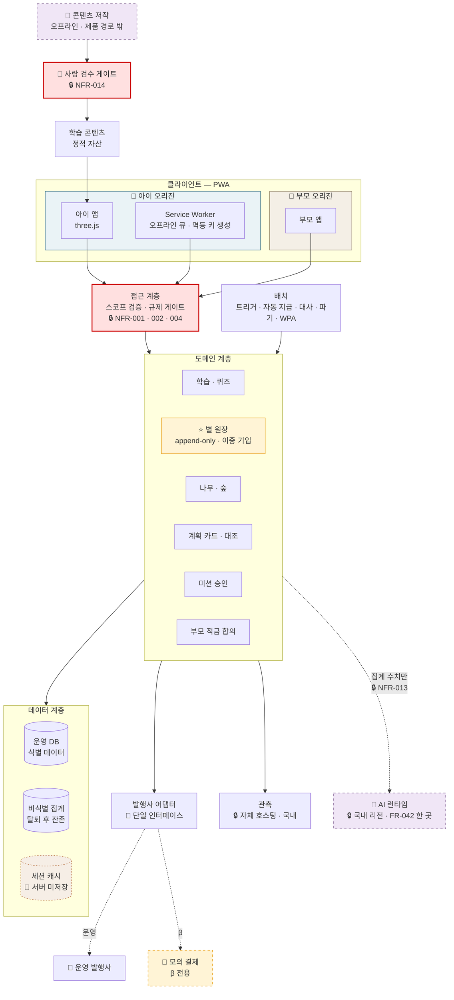

# 시스템 아키텍처 · 배포 설계 (기획 관점)

새싹프렌즈 1팀 · 2차 역기획 프로젝트 · **수빈** 작성 / **병윤** 구현 · 2026-09-01

> **무엇인가** 기술기획 산출물 **②(아키텍처)** 와 **④(배포·환경)** 입니다. 둘은 서로 물려 있어 한 문서로 묶었습니다.
> **왜 기획이 쓰나** 🔑 **이 제품의 아키텍처는 기술 취향이 아니라 규제와 제품 결정이 강제한 형태**입니다. 무엇이 무엇을 강제했는지는 기획이 추적할 수 있어야 하고, 그게 §2의 표입니다.
> **연결** [`증강 시퀀스`](../비즈니스%20로직/증강%20시퀀스%20다이어그램%20(구현%20명세).md) · [`API 명세`](../비즈니스%20로직/API%20명세%20(계약%20수준).md) · [`SRS v1.0`](../../10.%20SRS/SRS_핀프렌즈_v1_0.md) §7 게이트

## 0. 이 문서의 경계

| | |
|---|---|
| ✅ **정합니다** | **신뢰 경계 4겹** · 계층 구조 · 어댑터 위치 · **AI 두 평면의 배치** · **환경 3종 분리 기준** · **게이트별 배포 조건** · **배포 관문 6개** · 롤백 시 데이터 취급 |
| 📎 **다른 문서가 정합니다** | 프레임워크 · 런타임 · DB 제품 · 호스팅 벤더 · CI 도구 · **AI 벤더와 사용 범위** → [`SRS v1.0` §2.5 기술 스택](../../10.%20SRS/SRS_핀프렌즈_v1_0.md). 각 스택을 제약하는 NFR·DR이 함께 적혀 있습니다 |
| ⬜ **정하지 않습니다** | Service Worker 캐시 전략 세부 · 인프라 IaC · 스키마 타입 · **LLM 페이로드 필드 목록** · 프롬프트 문구 → **병윤 님 재량**(§8-2) |

---

# 1. 아키텍처 조망

> 🤖 **AI가 두 번 나오고, 둘의 지위가 다릅니다** (SRS §2.5.1).
> **런타임**(`LLM`)은 도메인 계층에서만 나가고 **집계 수치만** 싣습니다 — `FR-042` 한 곳뿐입니다.
> **저작**(`AUTH`)은 제품 요청 경로 밖이라 아동 데이터를 만지지 않고, **사람 검수 게이트를 통과해야만** 정적 자산이 됩니다.
> 🔴 **클라이언트에서 `LLM`으로 가는 화살표가 없는 것이 설계입니다.**

---

# 2. 🔑 무엇이 이 형태를 강제했나

> **아키텍처 결정 9개는 전부 규제·제품 결정에서 역산됐습니다.** 기술 선호가 개입한 곳은 PWA 하나뿐입니다.

| # | 아키텍처 결정 | 강제한 것 | 어기면 |
|:-:|---|---|---|
| **1** | **오리진 2개 분리** | S9·S12 · 🔒 NFR-003·004 | 아이 번들에서 부모 엔드포인트가 발견되면 **배포가 막힙니다** |
| **2** | **결제 원본 미보관 · 조회 전용** | 🔒 DR-03 · NFR-011 · P3 | 🔴 **사본을 드는 순간 법정 보존 대상**이 되어 「탈퇴 즉시 파기」가 불가능해집니다 |
| **3** | **읽기 캐시 계층을 두지 않음** | 위 2의 따름 결과 | 성능·오프라인을 이유로 결제 내역을 캐시하고 싶어질 때 **2가 먼저 무너집니다.** 캐시는 **세션 범위 · 서버 미저장**만 |
| **4** | **별 원장 append-only + 일일 대사** | 🔒 NFR-020 오류율 **0%** *(협상 불가)* | 단일 컬럼 증감으로 만들면 대사할 대상이 없습니다 |
| **5** | **발행사를 어댑터로 끊기** | O8 — 제휴 없이 β | 🔴 모의와 운영이 **다른 시그니처**면 제휴 후 도메인 계층까지 고쳐야 합니다 |
| **6** | **CDN·외부 분석 미사용 · 관측도 자체 호스팅** | 🔒 NFR-008 제3자 오리진 **0건** · NFR-009 국외이전 없음 | CSP가 브라우저에서 막아 **기능이 조용히 죽습니다** |
| **7** | **식별 데이터 / 비식별 집계 분리 저장** | 🔒 NFR-010 탈퇴 후 식별 레코드 **0건** | 한 테이블에 섞으면 **파기하면 지표가 사라지고, 남기면 규제 위반**입니다 |
| **8** | 🤖 **AI 런타임 호출은 도메인 계층에서 1곳 · 국내 리전** | 🔒 NFR-009·013 · `CON-08` · G-1·G-2·G-6 | 🔴 클라이언트가 직접 부르면 **키가 번들에 실리고 요청이 국외로 나갑니다.** 둘 다 즉시 위반입니다 |
| **9** | 🤖 **콘텐츠 저작을 제품 요청 경로 밖으로 분리** | 🔒 NFR-014 · G-3 | 🔴 런타임 생성으로 만들면 **아이가 검수되지 않은 문장을 보게** 됩니다. 1·2단계는 [금감원 대조 기준선이 없어](../../10.%20SRS/SRS_핀프렌즈_v1_0.md) **품질을 기계로 판정할 수단이 없습니다** |

## 2-1. 🔴 다섯 곳이 특히 미끄러지기 쉽습니다

| | 유혹 | 왜 안 되나 |
|:-:|---|---|
| **①** | *"결제 내역을 캐시해서 대조 화면을 빠르게"* | 결정 **2 → 3**이 연쇄로 무너지고 **P3(탈퇴 즉시 파기)까지 붕괴**합니다 |
| **②** | *"모의 결제를 런타임 플래그로 전환"* | 🔴 **운영에서 모의로 넘어갈 수 있는 경로가 생깁니다** → §4-2에서 빌드 타임 분리를 요구하는 이유 |
| **③** | *"관측은 외부 SaaS가 편하니까"* | 🔒 NFR-008·009 · P5 위반. **아동 데이터가 국외로 나갑니다** |
| **④** | 🤖 *"요약 문장은 프런트에서 직접 부르면 서버를 안 거쳐도 되는데"* | 🔴 `G-1` 위반이고 **결정 6도 같이 무너집니다** — 제3자 오리진 요청이 생기고 CSP가 막습니다. 게다가 **키가 번들에 실립니다** |
| **⑤** | 🤖 *"오답 해설을 실시간으로 만들어 주면 학습에 좋을 텐데"* | 🔴 `G-3` 위반. 아이가 보는 문장은 **전부 사전 검수 대상**입니다(NFR-014 100%). 오답 시 제공은 **「이야기 다시 읽기」로 고정**입니다 |

---

# 3. 신뢰 경계 — 4겹

| 경계 | 무엇을 막나 | 검증 |
|:-:|---|---|
| **1. 오리진** | 아이 번들이 부모 API를 **알지도 못하게** | 🔒 NFR-003 — 빌드 정적 스캔 · **실패 시 배포 차단** |
| **2. 스코프** | 아이 토큰이 부모 API를 **호출해도 거부** | 🔒 NFR-004 — 서버 스코프 강제 · **403** · 통합 테스트 |
| **3. 동의 게이트** | 동의 미완이면 **자격 자체가 발급되지 않게** | 🔒 NFR-001·002 — 초대 링크 미발급. 화면이 아니라 **발급 단계에서** |
| **4. 🤖 페이로드 경계** | 아동 데이터가 **제품 밖으로 나가지 못하게** | 🔒 NFR-013 — 화이트리스트 자동 테스트 · 요청 로그 표본 감사. 🔒 NFR-014 — **검수 서명 없는 콘텐츠는 배포 차단** |

> 🔑 **3번이 이 설계의 핵심**입니다. S12가 *"동의 → 등록 → 링크"* 순서를 만들어서, **동의 없이는 진입할 링크 자체가 존재하지 않습니다.** 화면에서 막는 방식이 아니라 **자격이 발급되지 않는 방식**입니다.

> 🤖 **4번은 앞의 셋과 방향이 반대입니다.** 1~3은 *들어오는 것*을 막고, 4는 ***나가는 것***을 막습니다.
> 🔴 **그래서 검증 방식도 다릅니다** — 거부할 요청이 없으니 403으로 잡히지 않고, **보낸 것을 사후에 감사**해야 합니다.
> 페이로드를 화이트리스트로 **열거**하는 이유가 여기 있습니다. 집계 객체를 그대로 직렬화하면 **나중에 추가된 필드가 조용히 딸려 나갑니다.**

---

# 4. 환경 3종

| | **로컬 · α** | **β 클로즈드** | **운영** |
|---|---|---|---|
| 대상 | 팀 + 지인 3~5 | **8가정** *(초2~3 · 월 초 정렬)* | ① 세그먼트 |
| 결제 | 🧪 모의 | 🧪 **모의**(O8) | 🏦 운영 발행사 |
| 데이터 | 폐기 | 🔴 **운영으로 이관하지 않음** | — |
| 콘텐츠 | 3단계 | **3단계만**(O1) | 3 → 2·4 → 1·5 |
| 관측 | 최소 | 전 계층 | 전 계층 + 자동 차단 |

## 4-1. 🔴 β 데이터를 운영으로 옮기지 않습니다

두 가지 이유입니다.

1. **모의 결제 데이터가 실 데이터와 섞이면** WPA·O7 지표의 🧪`[모의]` 비중을 나중에 분리할 수 없습니다 (O10이 병기를 요구)
2. **β 참여자 8가정의 동의 범위가 다릅니다** — 클로즈드 테스트 동의를 운영 동의로 승계할 수 없습니다

→ β 종료 시 **참여 가정은 운영에서 새로 가입**합니다. *(불편하지만 대안이 없습니다)*

## 4-2. 🔴 모의 ↔ 운영 전환은 **빌드 타임**이어야 합니다

| | 런타임 플래그 | **빌드 타임 분리** ✅ |
|---|---|---|
| 전환 | 환경 변수 하나 | 빌드 산출물 자체가 다름 |
| 위험 | 🔴 **운영에서 모의로 넘어갈 수 있음** | 경로가 존재하지 않음 |
| 확인 | 런타임 검사 필요 | **운영 번들에 모의 어댑터 문자열 0건** |

> 규제 게이트를 **HTTP 상태로 거부**하게 한 것(API 명세 §1-4)과 같은 원리입니다 — **위험한 경로를 「끄는」 게 아니라 「없애는」** 쪽으로 갑니다.

---

# 5. 배포 관문 6개 — 하나라도 실패하면 배포 중단

> SRS §7.2의 게이트를 **파이프라인으로 번역**한 것입니다. 사람의 판단을 기다리지 않습니다.
> 🔴 **예외는 관문 6 하나뿐입니다** — 사람의 검수 서명 자체가 통과 조건이라, 서명이 없으면 파이프라인이 멈춥니다.

| # | 관문 | 검사 | 근거 |
|:-:|---|---|:-:|
| **1** | **아이 번들 정적 스캔** | `/parent/` 문자열 **0건** · 🤖 **모델 엔드포인트·API 키 0건** | 🔒 NFR-003 · G-1 |
| **2** | **규제 상수 자동 테스트** | 동의 게이트 100% 차단 · 링크 무단 발급 0건 · 아이 토큰 403 · 별↔현금 경로 부재 | 🔒 NFR-001·002·004·007 |
| **3** | **스키마 검수** | 금지 컬럼 부재 — 이미지 참조 · 결제 원본 · **위치 좌표** · 현금 전환 | 🔒 DR-01~05 · NFR-006 |
| **4** | **CSP 리포트** | 제3자 오리진 요청 **0건** *(폰트·라이브러리 자체 호스팅 포함)* | 🔒 NFR-008 |
| **5** | 🤖 **LLM 페이로드 화이트리스트** | 허용 필드 목록 밖의 필드가 요청에 실리면 **실패.** 닉네임 · 자녀 id · 계획 카드의 「어디서」 **0건** | 🔒 NFR-013 · G-2 |
| **6** | 🤖 **콘텐츠 검수 서명** | 아이에게 노출되는 생성 콘텐츠 중 **검수 서명 없는 것 0건** | 🔒 NFR-014 · G-3 |

> 🤖 **관문 5·6이 늘어난 이유** — AI가 런타임에 들어오면서 **막아야 할 방향이 하나 늘었습니다.**
> 1~4는 *아이 화면으로 잘못 들어오는 것*을 막고, **5는 나가는 페이로드**를, **6은 아이에게 오는 문장**을 막습니다.
> 🔴 **5는 회귀가 조용합니다** — 집계 객체에 필드를 하나 추가하는 평범한 커밋이 위반을 만듭니다. 그래서 사람 리뷰가 아니라 **자동 테스트**여야 합니다.

## 5-1. 단계별 승격 조건

**일반 공개 추가 조건** — WPA **≥55% 2주 연속** · O13 ≤3일 · 정합성 오류 0건 · 🔴 **규제 자동 차단 구현 완료**

> 🔴 **마지막 항목이 β에는 없습니다.** β는 수동 점검으로 가되(O5), **자동 차단 구현을 일반 공개 게이트에 넣습니다** — 없으면 「30분 SLA」가 문서에만 있는 숫자가 됩니다.

## 5-2. 🔴 β 4주를 늘리지 않습니다

R7 결정입니다. 게이트 미달 시 **기간 연장이 아니라 범위를 줄여 재판정**합니다. 모집단이 연 5~12% 감소하는 시장이라 **진입 속도 자체가 경쟁력**이기 때문입니다.

---

# 6. 롤백 — PWA의 장점과 함정

## 6-1. 🟢 장점

스토어 심사가 없어 **당일 배포·당일 롤백**이 됩니다. β 4주 운영 중 수정이 즉시 반영되는 것이 O6의 채택 근거 중 하나였습니다.

## 6-2. 🔴 함정 2개

| | 함정 | 왜 |
|:-:|---|---|
| **①** | **Service Worker 캐시가 롤백을 먹습니다** | 코드를 되돌려도 **이미 설치된 SW가 옛 자산을 계속 서빙**할 수 있습니다. 버전 관리와 활성화 정책이 필요합니다 → ⬜ **병윤** |
| **②** | 🔴 **별 원장은 코드 롤백으로 되돌아가지 않습니다** | append-only라 **잘못 지급된 별이 그대로 남습니다** |

## 6-3. 잘못 지급된 별의 처리

**🔴 회수하지 않습니다.**

| 원칙 | 근거 |
|---|---|
| 별을 **차감하지 않는다** | 🔒 P-01·P-03 — 「별은 모으기만」 |
| 원장 불일치는 **지급을 멈추지 않고 기록만 격리** | O5 — **아이가 잃는 경험을 만들지 않는다** |
| 보정은 **집계 지표 쪽에서** | WPA·나무 조건 재산출로 흡수 |

> 즉 **롤백의 단위가 코드와 데이터에서 다릅니다.** 코드는 되돌리고, 데이터는 **격리 후 지표에서 보정**합니다.

---

# 7. 관측 — 자체 호스팅

🔒 **NFR-008 · 009 · P5** 때문에 외부 SaaS를 쓸 수 없습니다. 국내 리전 · 자체 호스팅입니다.

| 계층 | 알림 | 대응 |
|---|---|---|
| 🔴 **규제** | `consent_gate_blocked` >0 · 스키마 좌표 유입 | **알림과 동시에 기능 자동 차단** · 30분 내 확인 · 2시간 미해결 시 서비스 일시 중단 |
| 🔴 **정합성** | 별 원장 불일치 >0 | 30분 확인 · 1시간 원인 특정 · **지급은 멈추지 않음** |
| 🔴 🤖 **AI 페이로드** | 화이트리스트 밖 필드 유입 >0 | **`FR-042` 즉시 차단 → 템플릿 문장으로 전환.** 규제 계층과 같은 SLA(30분) |
| 🤖 **AI 품질** | 템플릿 대체율 · 3초 초과율 | 🔴 **차단 사유가 아닙니다** — 대체율이 높으면 Bedrock 서울 리전 가용성(§9)을 다시 봅니다 |
| **북극성** | WPA 전주 대비 −10%p | 24시간 내 분석 · 2주 연속 시 로드맵 재검토 |
| **도달** | 계획 카드 알림 도달률 <70% | 🔴 **iOS 웹 푸시 제약이 여기서 드러납니다** |

> **O5 — 사람이 지켜보지 않습니다.** 규제 계층은 자동 차단이 전제이고, 온콜은 사후 확인입니다.

> 🤖 **AI 알림이 두 줄인 이유** — **규제 위반과 품질 저하는 대응이 정반대**입니다.
> 페이로드 유입은 **즉시 끄고**, 템플릿 대체율 상승은 **끄지 않습니다** — 이미 안전한 경로로 떨어진 상태입니다.
> 🔴 둘을 한 알림으로 묶으면 **품질 알림이 규제 알림을 가립니다.**

---

# 8. 벤더는 정해졌습니다 — 남은 것은 구성입니다

## 8-1. 📎 SRS §2.5가 정한 것 — 이 문서가 다시 정하지 않습니다

| 계층 | 확정 | 이 문서가 그 위에 거는 조건 |
|---|---|---|
| 호스팅 · 리전 | **AWS**(ECS·RDS·S3) · **서울 리전 고정** | 🔒 리전 간 복제·백업 금지 · 🔴 **S3에 미션 이미지를 두지 않는다** |
| 주 저장소 | **PostgreSQL** | 🔒 금지 컬럼 4종 부재(DR-01~05) · 식별/비식별 **분리 저장** |
| 캐시 · 세션 | **Redis** · 🔴 **영속화 끔**(AOF·RDB 미사용) | 🔒 결제 내역 **서버 사본 미보관** — 결정 2·3의 실행 방식 |
| CI/CD | **GitHub Actions** | 🔒 **관문 6개가 배포를 막을 수 있어야** |
| 관측 | **자체 호스팅 · 국내** | 🔒 외부 SaaS 미사용 · 규제 계층은 **자동 차단** |
| 🤖 AI 런타임 | **AWS Bedrock**(Claude · 서울) | 🔒 `FR-042` 한 곳 · 가드레일 6개 |
| 🤖 AI 저작 | **Claude/OpenAI API · ChromaDB · Python·FastAPI** | 🔒 **제품 요청 경로 밖** · 산출물은 검수 후 정적 배포 |

## 8-2. ⬜ 병윤 님이 정할 것 — 벤더가 아니라 **구성**입니다

| # | 결정할 것 | 이 문서가 거는 조건 |
|:-:|---|---|
| **1** | **PostgreSQL 스키마 · 타입 · 인덱스** | 🔒 **금지 컬럼 4종 부재** · 별 원장은 **append-only 행 추가** |
| **2** | **인프라 IaC · ECS 태스크 구성** | 🔒 **서울 리전 고정**이 코드로 강제될 것 — 환경 변수로 바꿀 수 있으면 안 됩니다 |
| **3** | **GitHub Actions 파이프라인 구성** | 🔒 **관문 6개가 전부 배포 차단 게이트**로 들어갈 것 |
| **4** | **Service Worker 캐시 전략** | 🔴 **롤백이 SW에 먹히지 않을 것**(§6-2) |
| **5** | **관측 제품 선정 · 대시보드** | 🔒 **자체 호스팅 · 국내** · 🔴 규제 알림과 품질 알림을 **분리**할 것(§7) |
| **6** | **발행사 어댑터 인터페이스** | 🔴 **모의와 운영이 동일 시그니처** · **빌드 타임 분리** |
| **7** | **인증 구현 · 토큰 수명 · 갱신 정책** | 🔒 스코프 2종 · 403 강제 |
| **8** | 🤖 **LLM 페이로드 화이트리스트 필드 목록** | 🔒 집계 수치와 라벨만 · 🔴 **자동 테스트로 고정**할 것(관문 5) |

## 🔴 아키텍처에서 물러설 수 없는 것 6가지

1. **오리진 2개 분리** — 빌드 스캔이 배포를 막는 구조 (NFR-003)
2. **결제 원본 미보관** — 캐시는 세션 범위·서버 미저장 (DR-03) · **이게 무너지면 P3가 함께 무너집니다**
3. **별 원장 append-only + 일일 대사** (NFR-020 0%)
4. **모의 ↔ 운영은 빌드 타임 분리** — 런타임 플래그 금지
5. **제3자 오리진 요청 0건** — CDN·외부 분석 미사용 (NFR-008·009)
6. 🤖 **LLM 호출은 서버 경유 · 서울 리전 · 페이로드 화이트리스트** — 아이에게 가는 생성 텍스트 **0건** (NFR-009·013·014)

---

# 9. 남은 것

| # | 항목 | 상태 |
|:-:|---|---|
| **1** | **OI-06 deferred deep link 플랫폼 지원** | ⬜ SRS 미해결 — S12 초대 링크가 **스토어 경유 시 컨텍스트를 유지하는지**. PWA라 부담은 줄었으나 확인 필요 |
| **2** | **iOS 웹 푸시 도달률** | 🔴 홈 화면 추가가 전제. **계획 카드 트리거(FR-022)의 급소** |
| **3** | **저사양 Android 3D 렌더** | [NFR-035 ≤3초] — **실기기 실측 필요.** 🔴 three.js와 경합하므로 `FR-034` 유휴 애니메이션은 **CSS transform**으로 고정 |
| **4** | 🤖 **OI-09 Bedrock 서울 리전 Claude 모델 가용성** | ⬜ SRS 미해결 — **불가하면 `FR-042`는 템플릿 문장으로만 동작**합니다. 🟢 아키텍처는 바뀌지 않습니다: 엔드포인트가 항상 `source=template`을 반환할 뿐입니다 |
| **5** | 미확정 4건 *(증강 시퀀스 §10)* | 병윤 님 결정 대기 — 아키텍처에는 **10-1만 영향**(스토리지 계층) |

---

## 📄 기술기획 산출물 현황

| # | 산출물 | 상태 |
|:-:|---|:-:|
| 1 | [증강 시퀀스 다이어그램 (구현 명세)](../비즈니스%20로직/증강%20시퀀스%20다이어그램%20(구현%20명세).md) | ✅ |
| 2 | **시스템 아키텍처** *(본 문서 §1~§3)* | ✅ |
| 3 | [API 명세 (계약 수준)](../비즈니스%20로직/API%20명세%20(계약%20수준).md) | ✅ |
| 4 | **배포 · 환경 설계** *(본 문서 §4~§7)* | ✅ |
