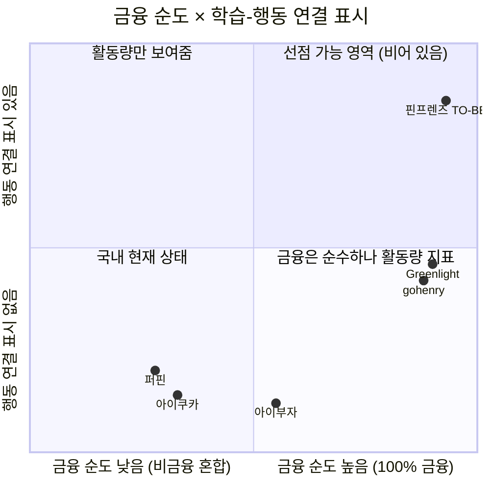

# 핀프렌즈 Value Proposition Sheet — v2.0 (rooted)

> **작성** 2026-08-20 · 유림 · **생성 모델** `claude-opus-5` / effort `high`
> **v1.0 merged에서 바뀐 것** — **자립 문서(rooted)**. 다른 문서를 열지 않아도 판단에 필요한 리서치·분석·기획 지식이 **이 문서 안에 전부** 들어 있습니다. 목차 구조는 v1.0을 그대로 유지했습니다.

<details>
<summary><b>📋 이 문서가 흡수한 선행 산출물 (파일을 열 필요 없음)</b></summary>

| 흡수한 지식 | 이 문서의 위치 |
|---|---|
| 시장 세분화 · TAM/SAM/SOM · 모집단 추계 | §1-1 · §7-4 |
| 고객 여정 11단계 · 페르소나 스펙트럼 11가정 | §1-2 · §1-3 |
| 대표 Pain Point 33건 중 선별 3 + 보조 3 | §1-4 · §1-5 |
| JTBD 인터뷰 설계·요약 카드 | §2 |
| 기회점수 AOS·DOS 채점 원본과 방법론 | §3 |
| 경쟁사·대체재 분석 (국내 3사 · 해외 2사 · 초소형 1사) | §4 |
| 학술 근거 4건 + 반대 증거 2건 + 실패 요인 순위 | §7-1 ~ §7-3 |
| Porter's Five Forces 5개 힘 | §7-5 |
| 가치사슬 9개 활동 | §7-6 |
| 핵심 성공 요인(KSF) 5개 + 기업 사례 | §7-7 |
| 기능정의 v13 확정 사양 · 규제 제약 | §8-1 · §8-2 |

</details>

> ## 🔴 문서의 지위 — 고객 인터뷰 0건
> **부모 인터뷰 0건 · 아이 인터뷰 0건입니다.** 이 문서는 **2차 자료와 팀 분석에 기반한 제안**이지 검증된 결론이 아닙니다. 인용 규칙은 [§10](#10-한계와-사용-금지선).

**등급 표기** — 문서 전체에서 아래 표기를 씁니다.

| 표기 | 의미 |
|:-:|---|
| **[A]** | 공식 통계·학술 논문·기업 공시 등 **1차 확인 자료** |
| **[관측]** | 공개 자료·리뷰·팀 직접 캡처로 확인한 사실 |
| **[추론]** | 관측을 연결한 해석 — 반대 가능성이 있음 |
| **[가설]** | 미검증. 인터뷰·테스트 대상 |
| **[설계 확정]** | 기능정의 v13에서 팀이 확정한 사양 |
| **✍️ [합성 가설]** | 페르소나·여정·발화 — **실제 고객 진술이 아님** |

**목차** — [📌 한 장 요약](#-한-장-요약) · [1. Pain·Needs](#1-페르소나-및-cjm-기반-핵심-문제-pain--needs) · [2. JTBD](#2-jtbd--고객-상황에-따른-job-statement) · [3. Outcome](#3-고객이-원하는-outcome) · [4. 기존 대안](#4-기존-대안-competitor--substitute) · [5. 핵심 제안](#5-우리-솔루션의-핵심-제안-value-proposition) · [6. 차별적 가치](#6-우리가-제공하는-차별적-가치) · [7. Proof](#7-proof) · [8. Job-Feature Map](#8-job-feature-map) · [9. 미결 사항](#9-미결-사항) · [10. 한계와 금지선](#10-한계와-사용-금지선)

---

## 📌 한 장 요약

> ## 🎯 배운 것을 **실천할 자리**를 만든다
> **자녀가 재미있게 금융을 배우고 생활 속에서 실천하며 성장하도록 돕고, 부모는 그 행동이 어떻게 달라졌는지를 한눈에 확인한다.**

| | **선언 ① 성장이 일어난다** | **선언 ② 그 성장이 보인다** |
|---|---|---|
| **문장** | 핀프렌즈는 자녀가 **재미있게 금융에 대해 학습하고 금융 행동을 실천하며 성장**할 수 있습니다 | 핀프렌즈는 자녀가 얼마나 **금융 지식을 배웠는지가 아닌, 금융 행동이 어떻게 달라졌는지** 한 눈에 보여줍니다 |
| **누구의 것** | **아이** — 재미·실천·성장이 아이에게서 일어남 | **부모** — 그 결과를 확인 |
| **화면** | ⭐ 별 · 👕 옷장 ／ 학습 4주제 · 실천 5경로 | 🌳 성장 나무 · 🌲 월간 숲 |
| **최강 근거** | 나무 성장 조건에 **「행동 실천 횟수」** 내장 — 퀴즈만 100개 풀어도 안 자람 | 금융교육은 **지식 +0.33 SD, 행동 +0.07 SD** (Kaiser & Menkhoff, 37개 실험) |
| **기회점수** | C2 · **DOS(SOM) 3.00 🥇** | C1 · **DOS(SOM) 3.00 🥇** |

**이 제안이 서 있는 네 개의 사실**

| # | 사실 | 등급 |
|:-:|---|:-:|
| **1** | 금융교육은 **지식은 올리지만 행동은 거의 못 바꾼다** — 지식 +0.33 SD ↔ 행동 +0.07 SD | **[A]** |
| **2** | 국내 부모가 1순위로 원하는 교육(**저축 65.8%**)과 아이의 실제 행동(**저축 12.8%, 최하위**) 사이에 **53.0%p 격차** | **[A]** |
| **3** | 국내 3사(퍼핀·아이쿠카·아이부자) 전부 **「학습했다 ↔ 성장했다」 구간이 공개 자료상 공백** | [관측] |
| **4** | 결제 인프라는 이미 깔렸다 — 초등 가정 **64.2%가 충전식 체크카드**로 용돈 지급 | **[A]** |

**핵심 지표 4개** *(전부 [가설] · 기준선 ⬜ 미측정)*

| 선언 | 지표 | 목표 |
|:-:|---|---|
| ① | 아이 **7일차 재접속률** | ≥ 50% |
| ① | 가입 후 **7일 내 첫 실천 인정률** | ≥ 60% |
| ② | 성장 나무 **5초 노출 후 「행동이 어떻게 달라졌나」 1문장 회상** | 성공률 ≥ 70% |
| ② | 부모 **주 1회 확인 시간** | 15분 → 3분 |

---

# 1. 페르소나 및 CJM 기반 핵심 문제 (Pain · Needs)

## 1-1. 시장을 어떻게 나눴는가 — 세그먼트 4분할

**기초 모집단 산출** — 2026년 기준 [A]

```
초등 1~3학년 학생 수                975,931명  (초1 298,178 · 초2 324,040 · 초3 353,713)
  × 용돈 지급률 83.8%               [A] 윤선생 조사
= 세분화 기초 모집단                817,830명 (81.8만명)
```

> 🚨 **모집단은 매년 줄어듭니다** [A] — 초1 학생 수 2023년 401,752 → 2024년 353,713 → 2025년 324,040 → **2026년 298,178명(첫 30만명 붕괴)** → 2031년 220,481명. **연 5~12% 감소**로 5년 뒤 지금의 약 74%입니다. → **시장 진입 속도 자체가 경쟁력**입니다.

**세분화 축** — 인구통계(성별·지역·소득)보다 **Need State가 구매를 훨씬 잘 설명**하기 때문에 두 축을 씁니다.

| 축 | 변수 | 대리지표 | 값 |
|---|---|---|---|
| **X** | 부모의 금융교육 관여도 | 자녀에게 경제교육을 실시 중인가 | 실시 **68.8%** [A] |
| **Y** | 아이의 금융행동 문제 강도 | 「계획 없는 충동구매」또는「절약 없이 모두 사용」 걱정 | **52.1%** *(복수응답 합집합의 중앙값 · 하한 41.2%~상한 63.0%)* |

**4개 세그먼트**

| | 세그먼트 | 위치 | 규모 (Base) | 비중 | 부모의 말 |
|---|---|---|---|---|---|
| **①** | **금융성장 증명형** ★ | 관여↑ · 문제↑ | **293,149명** | **35.8%** | *"아이가 앱에서 돈은 벌고 있는데, 그래서 금융적으로 성장하고 있는 건가요?"* |
| ② | 금융습관 관리형 | 관여↑ · 문제↓ | 269,518명 | 33.0% | *"용돈은 주고 있는데 스스로 관리하는 습관이 생겼으면"* |
| ③ | 용돈 소비통제형 | 관여↓ · 문제↑ | 132,940명 | 16.3% | *"돈을 너무 많이 써서 걱정돼요"* |
| ④ | 금융교육 잠재관심형 | 관여↓ · 문제↓ | 122,223명 | 14.9% | *"언젠가는 시켜야 하는데 어떻게 할지 모르겠어요"* |

> ⚠️ **독립성 가정** — 관여도와 문제 강도의 교차조사 데이터가 공개된 바 없어 **두 변수가 독립이라고 가정**했습니다. **모델값이며 관측값이 아닙니다.** [추론]

**세분화를 지지하는 시장 사실** [A]

| 사실 | 값 | 의미 |
|---|---|---|
| 용돈 시작 평균 나이 | **만 8.4세** | **초등 1~3학년(만 7~9세)과 정확히 일치** |
| 월평균 용돈 | 30,740원 | 서비스 내 순환 자금 규모 |
| 정기 지급 비율 | 83.8% 중 **82.1%** | 반복 사용 습관이 이미 존재 |
| 정기 지급 주기 | 매주 **61.0%** / 매월 32.8% | **주 단위 미션 사이클**이 자연스러움 |
| 용돈 지급 이유 1위 | 경제관념 형성 **61.5%** | 부모가 이미 `돈 → 교육` 연결을 의도 중 |

## 1-2. 페르소나 스펙트럼과 선별 2인

후보 풀 **11가정**을 네 유형으로 분류하고, 그중 **1차 인터뷰 대상 2가정**을 선별했습니다.

| 유형 | 판단 기준 | 해당 가정 |
|---|---|---|
| **Core** | 부모 관여도와 아이 금융행동 개선 니즈가 모두 높음 | H1 정미경 · H2 배성우 · H3 한지영 · H4 강동혁 |
| **Adjacent** | 유사 문제는 있으나 성장 증명이 최우선은 아님 | **H5 오하늘 · H6 임태경** |
| **Extreme** | 시간·기기·응답 지연 제약으로 핵심 루프가 자주 실패 | H7 백현주(교대 근무) · H8 서명숙(조손 가정) |
| **Non-user** | 대체재·불신·전환 장벽으로 회피 | H9 류지원(불신) · H10 신가영(포화) · H11 곽민석(미도달) |

**선별 2인** ✍️ [합성 가설]

| | **H1 정미경** | **H6 임태경** |
|---|---|---|
| **스펙트럼 / 세그먼트** | **Core** / **① 금융성장 증명형** — 29.3만명 (35.8%, 최대) | **Adjacent** / **③ 용돈 소비통제형** — 13.3만명 (16.3%) |
| **프로필** | 39세 중학교 교사 · 정하율(만 8세·초2) · 주 8,000원 앱 충전 · **퍼핀 8개월차** · 아이 전용 태블릿 | 43세 물류 배송직 · 임서준(만 8세·초2) · 월 3만원 · **경제교육 경험 없음** · 학원가 편의점 3곳이 고정 동선 |
| **상황적 맥락** | 오후 5시 퇴근 · **네 유형 중 부모 가용 시간이 가장 넉넉**. 교사라 **학습 데이터를 읽는 데 익숙**해 퍼핀 화면의 빈약함을 또래보다 예민하게 느낌. **시간은 있는데 볼 것이 없다** | 오전 6시 출근 · 오후 6시 퇴근. 서준의 소비 동기가 물건이 아니라 **또래 관계**. 태경이 보는 것은 결과(돈이 빨리 없어진다)뿐이라 개입이 *"그만 좀 사"* 한마디로 수렴 |
| **여정 결말** | 🟢 10단계까지 유지 | 🔴 10단계 이탈 (1개월 내 해지) |
| **타깃 판정** | ✅ **1차 타깃** | ⚠️ 1차 타깃 제외 · **제품에서 배제하지 않음** |

## 1-3. 고객 여정 11단계

Pain은 이 11단계 위에서 도출됐습니다. 일반 5단계(`문제 인식 → 탐색 → 의사결정 → 사용 → 유지`)로는 이 서비스의 이탈을 설명할 수 없어 새로 정의했습니다.

| # | 단계 | 일어나는 일 |
|:-:|---|---|
| **0** | 접하기 전 | 핀프렌즈를 모르는 상태의 용돈·확인 루틴. **여기서 Push force(불만) 유무가 갈린다** |
| **1** | 문제 신호 | 현재 방식의 한계가 **구체적 사건으로** 드러나는 순간 |
| **2** | 인지·비교 | **둘 다 무료라 가격이 아니라 전환 비용 대비 가치로 비교됨** |
| **3** | 🔑 **전환 결정** | 본인인증 → 계좌 연결 → 카드 신청 → 자녀 초대 → 카드 등록. **만 14세 미만 법정대리인 동의 + 제휴 선불수단 연결이라는 구조적 게이트** |
| **4** | 아바타 설정 · 온보딩 학습 | 짧은 학습 → 퀴즈 → ⭐1 → **⭐1로 살 수 있는 아이템 제시**. 아이는 나무가 아니라 **별 잔액과 옷장으로 서비스를 이해** |
| **5** | 학습으로 별 모으기 | 4카테고리 학습 + 퀴즈 + 출석으로 별을 모음 |
| **6** | 실천 선택 | 미션 · 위치 알림 · 결제 회고 · 위시리스트가 학습을 **실제 돈 행동**으로 옮김 |
| **7** | 🔑 **실천 판정 후 별 획득** | 학습 트리거 2종 vs 실천 트리거 5종을 가르는 관문 |
| **8** | 아이템 구매 | 모은 별로 온보딩 이후 두 번째 아이템 구매 |
| **9** | 성장 나무 / 월간 숲 | 아이의 개별 행동이 **부모가 읽을 수 있는 성장 증거**로 번역됨 |
| **10** | 전환 후 — 지속·이탈 | **[부모]** 다음 달 용돈 충전 여부 · **[아이]** 학습 단계 재진입 |

**11가정의 이탈은 네 곳으로 갈립니다** ✍️ [합성 가설]

```
🟢 10단계까지 유지 ······················ 4가정 (36%)   H1 · H2 · H3 · H5
🔴 2단계 이탈 — 검토 거부 ··············· 1가정        H9 (앱 3연속 실패 → 제품을 보기 전에 결론)
🔴 3단계 이탈 — 진입 실패 ··············· 2가정        H10(전환비용>가치) · H11(문제강도<온보딩비용)
🔴 5단계 이탈 — 아이가 학습 반복 못 버팀 · 1가정        H9 대안 경로
🟠 10단계 이탈·위험 ····················· 4가정        H4 · H6 · H7 · H8
```

> 🔴 **아이 Pain 12건 중 부모 화면에 신호로 나타나는 것은 0건입니다.** 아이가 멈춰도 나무는 오류 없이, 안 자란 상태로, 정상 작동합니다. 부모는 **다음 달 충전 시점에야** 알게 되어 **최대 한 달의 탐지 지연**이 생깁니다. [추론]

## 1-4. ★ Selected Pain Point — 3건

> **선별 단위는 Pain Point이고, 페르소나는 그 결과입니다.** 여정 11가정 × 11단계에서 대표 Pain 33건을 뽑고, 그중 **C1·A4·A6** 세 건을 선별하니 인물이 **H1·H6 두 가정**으로 좁혀졌습니다.

| ★ | ID | 인물 | 여정 # | **Pain Point** | **Needs (그 순간 원하던 것)** | 감정 | 등급 |
|:-:|:-:|---|:-:|---|---|:-:|:-:|
| ★ | **C1** | H1 | **0** 접하기 전 | 8개월치가 쌓였는데도 **누적 숫자(116일·75문제·6,650원)가 성장의 증거가 되지 못함** — 일요일 밤에 열어 보고 **"그냥 닫는"** 상태 | 활동량이 아니라 **「이번 달 무엇이 달라졌나」**를 읽고 싶다 | 3 | **P0** |
| ★ | **A4** | H6 | **2** 인지·비교 | 위치 알림을 *"어디 있는지 알려주는 기능"*으로 이해 — **진입 동기가 감시 기대**여서 제품 의도(아이의 자기 선택)와 정반대 | 아이가 **어디서 얼마를 쓰는지** 알고 싶다 | 4 | **P1** |
| ★ | **A6** | H6 | **10** 전환 후 | 한 달 뒤 지출이 그대로여서 해지 — **'교육'을 파는 제품이 '통제'를 원하는 부모에게는 실패로 채점** | **"얼마 줄었다"는 숫자 하나**를 보고 싶다 | **1** | **P1** |

## 1-5. 보조 Pain — 3건 *(선별 제외 · 근거로 유지)*

| ID | 인물 | 여정 # | **Pain Point** | 왜 남기는가 |
|:-:|---|:-:|---|---|
| C2 | H1 | **6** 실천 선택 | 성장 조건 3종(학습·퀴즈·**실천**) 중 실천이 비어 **4개 나무가 한 칸도 자라지 못하고 전부 정체** | 🔴 **선언 ①의 최상위 근거** · DOS 공동 1위 — 빠지면 *"실천하며 성장"*이 근거 없이 뜸 |
| C3 | H1 | **10** 전환 후 | 나무가 2주 이상 정체되면 **부모가 아이 능력 문제로 해석**하거나 **앱을 불신** | H1의 **이탈 트리거** · Outcome 2건의 출처 |
| A5 | H6 | **6** 실천 선택 | 알림이 **선택 지원이 아니라 통제 신호**로 전달되면 아이가 앱을 회피 대상으로 학습 | A4의 **아이 쪽 이면** |

## 1-6. 이 Pain이 시장에 실재한다는 근거

**🔑 국내 데이터의 결정적 격차** — 윤선생 조사(초등 학부모 586명) [A]

| 부모가 **하려는** 교육 | 비율 | | 아이가 용돈을 **실제 쓰는** 곳 | 비율 |
|---|---|---|---|---|
| **저축 습관 만들기** | **65.8%** (1위) | ↔ | **저축** | **12.8% (최하위)** |
| 용돈 스스로 관리 | 50.1% | | 간식·군것질 | 77.0% (1위) |
| 이자 등 금융지식 | 20.3% | | 문구·학용품 | 47.5% |

> 💡 **부모가 1순위로 원하는 교육이 아이의 실제 행동에서는 꼴찌입니다 — 격차 53.0%p.** 이것이 C1·C2가 가리키는 문제의 시장 크기입니다.

**핵심 실패 구조** [추론]

```
금전 보상 지급
  → 아이는 '배우는 것'보다 '돈 받는 것'을 목표로 함
  → 미션은 빨리 끝내지만 금융 개념을 실제 상황에 적용하지 못함
  → 부모: "앱에서 돈은 벌었는데, 금융교육이 된 건가?"
  → 아이: 자기 금융 역량이 성장했다는 증거를 체감 못 함
  → 신뢰 하락 · 이탈
```

**그리고 진입 장벽은 이미 낮습니다** [A]

| 용돈 지급 수단 | 비율 |
|---|---|
| **체크카드(충전식)** | **64.2%** |
| 현금 | 48.9% |
| 부모 명의 신용카드 | 2.6% |

> → 선불·충전식 카드가 **초등 가정의 3분의 2에 이미 침투**했습니다. 우리는 *새 결제수단을 설득할 필요가 없고*, 기존 카드 위에 **교육·성장 레이어를 얹는 문제**입니다.

---

# 2. JTBD — 고객 상황에 따른 Job Statement

## 2-1. 페르소나별 JTBD 카드

| | **H1 정미경 (Core / ①)** | **H6 임태경 (Adjacent / ③)** |
|---|---|---|
| **Situation** *(When…)* | **일요일 밤 아이를 재우고 용돈 앱을 열었을 때**, 116일·75문제·6,650원이라는 숫자 세 개만 조금 커져 있고 지난주와 달라진 것을 찾을 수 없을 때 | **카드 결제 문자에 편의점이 연달아 찍히는 것을 보고 "그만 좀 사"라고 말한 다음 날, 또 같은 문자가 올 때** |
| **Job Statement** *(I want to…)* | **아이가 배운 것이 실제 돈 행동으로 이어졌는지를, 짧은 시간 안에 확인하고 싶다** | **말 한마디 말고 다른 수단으로, 아이의 편의점 지출을 줄이고 싶다** |
| **Job의 본질** | **[성장 증명 / 확인]** | **[지출 감축 / 통제]** |
| **Push** *(현상 불만)* | 8개월치 숫자가 쌓일수록 판단이 더 어려워짐 · 하율이 오답 후 재시도로 절반 보상을 받는 것을 목격한 뒤 **학습 데이터 자체를 불신** | 개입 수단이 **말 한마디뿐**이라 반복될수록 효과가 떨어지고 관계만 상함 · 서준의 소비 동기가 **또래 관계**라 절약 요구가 관계 포기로 들림 |
| **Pull** *(새 솔루션 매력)* | 나무 4칸을 보고 *"어디가 멈췄는지 보인다"*를 즉시 이해 · 실천 없이는 자라지 않는 성장 조건에 강하게 동의 | 🔴 위치 알림을 *"아이가 어디서 쓰는지 알려주는 기능"*으로 이해 — **제품 의도와 정반대** |
| **Habit** *(관성)* | 8개월간의 일요일 밤 확인 루틴 · 교사라 학습 데이터 읽기에 익숙 — **그 익숙함이 예민함이자 동시에 이동 관성** | 결제 문자 확인 → 구두 지적. 경제교육 경험이 없고 그럴 계획도 없었음 |
| **Anxiety** *(불안)* | **진입 불안** — 8개월치 기록이 이전되지 않아 전환이 '추가'가 아니라 **'리셋'으로 체감** · 카드 중복 | **유지 불안** — 진입은 쉬움(*"돈 안 들면 깔아는 보죠"*). 불안은 도입이 아니라 **효과에 있음**: 한 달 뒤 지출이 그대로면 즉시 해지 |
| **Current Solutions** | 퍼핀(8개월) 학습현황 화면 + 결제 내역 + 구두 지도. **확인은 되지만 "그냥 닫는" 상태** | 카드 결제 문자 알림 + *"그만 좀 사"* 구두 개입. **기록은 남지 않음**(문자는 지워짐) |
| **Switch Trigger** | 하율이 오답 후 재시도로 절반 보상받는 것을 목격 → **앱 숫자 불신 시작** | 위치 알림 = 감시 기대 → **옵트인 저항이 거의 없어 진입이 가장 쉬움** |
| **Barrier** | 8개월치 기록 이전 불가 · 카드 재발급 · 병행 사용 수요는 낮음 | 진입 장벽은 사실상 없음. **유지 장벽이 결정적** — 지출 감소액이 화면에 없으면 1개월 내 해지 |
| **제품 전략상 위치** | 🟢 **핵심 Target Job** — 1차 개발·가치 제공의 주축 | ⚠️ **보조 대응 Job** — 메인 가치관과 다르나 **정보 배치로 최소 유지 조건** 충족 |

## 2-2. 통합 Core Job Statement

> ### 🎯 **"배운 것을 실천할 자리를 만든다"**
> **자녀가 재미있게 금융을 배우고 생활 속에서 실천하며 성장하도록 돕고, 부모는 그 행동이 어떻게 달라졌는지를 한눈에 확인한다.**

**H1의 Job = 「확인」 · H6의 Job = 「감축」.** 제품 Job은 H1 쪽이고, **H6은 성공 기준 자체가 다른 고객**입니다.

## 2-3. 이 JTBD의 확인 상태

**인터뷰는 아직 수행되지 않았습니다.** 위 카드의 Situation·Push·Anxiety는 여정 분석과 시장 자료에서 역산한 ✍️ **[합성 가설]**입니다.

인터뷰 설계는 준비돼 있습니다 — **75분 · 데모 체험 후 기존 경험 회상** 구조로, 공통 41문항 + H1 전용 10문항 + H6 전용 11문항입니다. 핵심 문항 5개만 옮기면 다음과 같습니다.

| 문항 | 무엇을 판정하는가 | 반증 신호 |
|---|---|---|
| **Q1-8** 나무가 자랐다는 건 아이가 뭘 했다는 뜻일까요? | 「실천 조건」 전달 여부 | *"퀴즈를 많이 풀어서"*만 나옴 |
| **Q1-9** 어떤 칸이 2주째 그대로라면 무슨 일이 있었다고 생각하시겠어요? | C3 — **아이 탓 / 앱 탓 / 조건 탓** 어디로 가는가 | 아이 탓 → 오귀인 확증 |
| **Q2-2** 이 서비스는 뭘 해주는 서비스라고 한 문장으로? | 가치 제안 전달 여부 | *"애가 돈 쓰는 거 볼 수 있는 앱"* |
| **H1-3** 지금 앱 퀴즈에 한국사·시사가 섞인 것, 어떻게 느끼세요? | **「금융 순도」가 차별점인가** | *"그것도 공부니까 좋다"* → (b) 시나리오 |
| **H6-4** 이 알림은 아이 폰으로만 가고 부모는 위치를 볼 수 없습니다. 어떠세요? | A4 — 옵트인 동기가 감시인가 | *"그럼 뭐가 좋은 거죠?"* → A4 확증 |

---

# 3. 고객이 원하는 Outcome

## 3-1. 채점 방법론 — AOS와 DOS

전통적 기회점수(OS)는 `Importance + (Importance − Satisfaction)`로 **중요도가 두 번 반영**돼 시장 감각을 왜곡합니다. 그래서 두 지표를 씁니다.

```
AOS = Importance × (1 − Satisfaction / 5)      … 고객 체감 기준 "중요하지만 덜 해결된 문제"의 강도
DOS = (Importance − Satisfaction) × Market Relevance   … 시장 가중 기준 "고객 미충족 × 시장 파급력"
```

**Satisfaction의 정의** — *"현재 대체 솔루션이 그 Pain이 겨냥하는 **Goal**을 얼마나 충족하는가"*. Pain의 표면 문장이 아니라 그 뒤의 Goal로 채점합니다. 그렇지 않으면 *"현금은 온보딩이 없으니 만족도 5점"* 같은 역전이 생깁니다.

**Market Relevance 모수 — 무엇을 분모로 썼는가**

| 후보 | 값 | 채택 | 이유 |
|---|---|:-:|---|
| TAM | 2.6조원 (글로벌 초등 키즈 금융 플랫폼) | ❌ | **글로벌 금액** 기준이라 국내 가정의 Pain과 단위 불일치 · 민간 추정치 · 이 분모로는 **전 항목이 0에 수렴** |
| SAM (금액) | 글로벌 5,700억 / 국내 화폐화 10~30억 | ❌ | 금액 단위. **Pain은 사람이 겪는 것**이라 인원 모수가 필요 |
| ✅ **SAM 대용 (인원)** | **817,830명** — 초등 1~3 용돈 지급 가정 전체 | ✅ | 세그먼트 4개를 모두 포함해 **Core·Adjacent를 한 자에 놓고 비교 가능** |
| ✅ **SOM (인원)** | **293,149명** — ① 금융성장 증명형 | ✅ | 1차 타깃 그 자체 — **1년 안에 딸 수 있는 몫** |
| SOM Level 3 | 440가구 / 3,115만원 | ❌ | 규모가 작아 노이즈 지배 + **월 5,900원 구독 전제인데 무료 확정으로 산출식 자체가 무효** |

```
Market Relevance = 모수 내 세그먼트 비중 × Pain 발생률

세그먼트 비중   SAM 기준(÷81.8만)   SOM 기준(1년차 도달 계수)
  ① 성장증명형        0.358                1.00   (1차 타깃 = SOM 정의 그 자체)
  ② 습관관리형        0.330                0.15   (3차 확장)
  ③ 소비통제형        0.163                0.30   (2차 확장 — 통제→교육 메시지 전환 필요)

Pain 발생률   1.0 구조적(세그먼트면 거의 전원) · 0.6 조건부 · 0.3 특수
```

> ⚠️ **SOM 도달 계수(0.15 · 0.30)와 발생률 코딩은 [가정]**입니다. 엄격한 SOM 해석이면 ②③이 0이 되어 Adjacent Pain의 DOS가 전부 0이 됩니다.

## 3-2. Outcome × 기회점수 통합표

> 정렬 DOS(SOM) 내림차순 · 목표값은 전부 **[가설]**이고 기준선은 ⬜ 미측정

| ★ | ID · 대상 | **Desired Outcome** | Imp | Sat | **AOS** | DOS<br>(SAM) | **DOS<br>(SOM)** | 측정 가능한 정량 목표 |
|:-:|:-:|---|:-:|:-:|:-:|:-:|:-:|---|
| ★ | **C1**<br>H1 | **활동량이 아니라 「이번 달 행동이 어떻게 달라졌나」를 1문장으로 읽는다** | 5 | 2 | 3.0 | 1.08 | **3.00** 🥇 | • 부모 주 1회 확인 시간 **15분 → 3분(−80%)**<br>• 나무 5초 노출 후 **1문장 회상 성공률 ≥ 70%**<br>• 월간 숲 재방문율(익월) **≥ 50%** · 다음 달 충전율 **≥ 70%** |
| | **C2**<br>H1 *(보조)* | **아이의 첫 실천 1건이 나무에 반영되는 것을 본다** | 4 | 1 | 3.2 | 1.08 | **3.00** 🥇 | • 7일 내 **첫 실천 인정률 ≥ 60%**<br>• 아이 3일차/7일차 **재접속률 ≥ 65% / ≥ 50%**<br>• 월말 4칸 중 **2칸 이상 성장 가정 ≥ 50%** |
| | **C3**<br>H1 *(보조)* | **나무가 멈춘 이유를 화면에서 확인한다** | 4 | 1 | 3.2 | 0.63 | **1.80** | • **실천 근거 열람률 ≥ 60%**<br>• 아이 루프 정지 → 부모 인지 **≤ 3일** 🔴 *현재 달성 수단 없음* |
| ★ | **A6**<br>H6 | **지출이 지난달 대비 얼마 줄었는지 첫 화면에서 본다** | 5 | 1 | **4.0** 🥇 | 0.64 | **1.20** | • 전월 대비 증감액 **5초 내 확인 ≥ 80%**<br>• 편의점 지출 감소액 → ⬜ **목표 미설정**(제품 KPI 아님) |
| ★ | **A4**<br>H6 | **아이가 어디서 얼마를 쓰는지 파악한다** | 4 | 1 | 3.2 | 0.48 | **0.90** | 🔴 옵트인 화면에서 **「부모는 위치를 볼 수 없습니다」를 동의 전에 인지한 비율 ≥ 90%** |
| | **A5**<br>H6·아이 *(보조)* | *(아이)* **감시받지 않으면서 친구들과 어울린다** | 4 | 3 | 1.6 | 0.10 | **0.18** | • 좌표 미저장 · 아동용 알기 쉬운 고지 **100% 충족**<br>• ⬜ **아이 직접 확인 필요** |

**Satisfaction 점수의 근거** — *"지금 쓰는 것이 그 Goal을 얼마나 채우는가"*

| ID | 현재 대체 솔루션이 하는 일 | Sat |
|:-:|---|:-:|
| C1 | 퍼핀이 학습현황 화면을 **제공은 한다** — 확인은 되고, 그게 성장인지만 모른다 | **2** |
| C2 | 퍼핀에는 **학습–실천 연결 자체가 없다.** 오답에도 절반 보상이라 실천 판정 개념이 부재 | **1** |
| C3 | 정체 원인을 설명해 주는 화면이 **어느 대체재에도 없다** | **1** |
| A6 | 지출은 **한 푼도 안 줄고 있다** | **1** |
| A4 | *"그만 좀 사"* 한마디로는 **아무것도 알 수 없다** | **1** |
| A5 | 🔴 현재 아이는 **감시 도구가 없어 자유롭다** — 아이 Goal은 이미 충족 상태 | **3** |

> 🔴 **A4의 Outcome이 「감시 제공」이 아닌 이유** — A4의 Need는 *"어디서 얼마 쓰는지 알고 싶다"*인데 **제품은 그것을 의도적으로 주지 않습니다**(만 14세 미만 개인위치정보 **좌표 미저장** 원칙, 알림은 **아이에게** 감). 따라서 A4의 Outcome은 기능이 아니라 **진입 시점의 기대 교정**입니다.

## 3-3. AOS ↔ DOS 역전이 말해주는 것

```
AOS 순서 (개별 고객 체감)            DOS(SOM) 순서 (1년차 시장 가중)
──────────────────────────           ────────────────────────────────
1.  A6  지출 감소 가시화   4.0        1.  C1  성장 증거 가시화    3.00 🥇
2.  C2  실천 반영         3.2        1.  C2  실천 반영           3.00 🥇
2.  C3  정체 원인         3.2        3.  C3  정체 원인           1.80
2.  A4  소비 파악         3.2        4.  A6  지출 감소 가시화    1.20
5.  C1  성장 증거 가시화   3.0        5.  A4  소비 파악           0.90
6.  A5  아이 자율성       1.6        6.  A5  아이 자율성          0.18
```

- **AOS 1위 A6**은 개별 부모의 체감 통증이 가장 크지만(Imp 5 · Sat 1), 세그먼트가 **13.3만명(16.3%)의 2차 확장 대상**입니다.
- **C1은 시장 가중 시 1위로 뛰어오릅니다** — 29.3만명 **전원의 정의적 Pain**이라 발생률 1.0이기 때문입니다.
- **결정** — MVP·1차 개발 우선순위는 DOS(SOM) 1위인 **C1·C2**에 집중합니다.

> 💡 **두 지표를 다 계산하는 이유** — AOS만 보면 *"가장 아파하는 사람부터 고치자"*가 되는데, **가장 아파하는 사람이 우리가 1년 안에 만날 사람이 아닐 수 있습니다.** 반대로 DOS만 보면 A6·A4가 하위로 밀려 **타깃 경계 판정 신호를 놓칩니다.**

---

# 4. 기존 대안 (Competitor / Substitute)

## 4-1. 대안의 세 층위

| 층위 | 대상 | 규모 [A] | H1의 Job | H6의 Job |
|---|---|---|---|---|
| **직접 경쟁** | 퍼핀 · 아이쿠카 · 아이부자 | 가입 26만 (충전 484억) / 36~50만 / **78만(무료·하나은행)** | 🔴 **아니오** — 3사 전부 「학습→성장」 공백 | 🟡 부분 |
| **해외 참조** | gohenry · Greenlight | 활성 아동 65만 / 매출 3,200억·650만명 | 🟡 **부분** — 금융 100%·표준 매핑은 있으나 **행동 변화 증명은 없음** | — (국내 미진출) |
| **대체재** | 카카오뱅크 mini · 토스 유스카드 · **현금** | 275만명·결제 7.6조 / 320만장 / 현금 **48.9%** | 🔴 아니오 | 🟡 부분 |

> 🔴 **대체재가 산업에서 가장 강한 힘입니다** — 국내 자녀 계정 **685만개 중 게임화·교육형은 16.1%(약 110만)**뿐이고, **83.9%가 순수 계좌·카드형**을 씁니다. 전환 비용이 사실상 0입니다. **게임화·교육 기능은 "있으면 좋은 것"이지 필수재가 아니라는 뜻**입니다. [관측]
> ⚠️ 685만은 초·중·고 약 500만명을 넘으므로 **최소 27% 중복**입니다.

## 4-2. 상세 대조 — 6개사 × 8축

> **🎯 세 줄 요약** — ① 국내 3사는 **「학습→성장」 구간이 통째로 비어 있고** ② 해외 2사는 금융 순도는 높으나 표시하는 것이 **배지·XP = 활동량**이며 ③ **퍼핀은 보상 재원이 부모 지갑**입니다.

| 항목 | **퍼핀** | **아이쿠카** | **아이부자**(하나) | **gohenry** | **Greenlight** | **핀프렌즈 TO-BE** |
|---|---|---|---|---|---|---|
| **교육 주제 순도** | 🔴 7과목 중 **4개 비금융**(한국사·시사·어휘·과학기술) | 🔴 경제 + **문해력·시사** | 🟡 금융 + 주식 | 🟢 전부 금융 | 🟢 전부 금융 | 🟢 **4주제 전부 금융** |
| **외부 교육 표준 매핑** | 🔴 없음 | 🔴 없음 | 🔴 없음 | 🟢 US/UK 가이드라인 | 🟢 Jump$tart·CEE | 🔴 **없음** *(우리도)* |
| **성취·성장 표시** | 🔴 레벨업 외 확인된 장치 없음 | 🔴 확인 안 됨 | 🔴 확인 안 됨 | 🟡 배지 + 레벨 해제 | 🟡 XP·stars·배지·레벨 | 🟢 **4칸 나무 + 월간 숲** |
| **학습 ↔ 행동 연결** | 🔴 **없음** (오답에도 절반 보상 + 재시도) | 🔴 없음 | 🔴 없음 | 🔴 없음 | 🔴 없음 | 🟢 **성장 조건에 실천 횟수 내장** |
| **부모 확인 화면** | 🟡 누적일·문제수·보상액 **숫자 3개** | 🔴 소비내역·잔액·한도·**위치**만 | 🔴 학습 확인 언급 없음 | 🟢 진도 추적 + 부모도 미션 수행 | 🟢 진도 동행 | 🟢 **행동 근거가 붙은 나무·숲** |
| **보상 재원** | 🔴 **부모 지갑이 주 재원** | 현금(용돈 벌기) | 미확인 | 포인트(서비스) + 부모 선택 | 서비스 측 | 🟢 **⭐ 앱 내 재화** |
| **소비 사전 개입** | 🔴 없음 (쓴 다음 기록만) | 🟡 실시간 위치추적(안심존) — **감시 목적** | 🔴 없음 | 🔴 없음 | 🔴 없음 | 🟡 3분 체류 *(MVP 유보)* |
| **수익모델** | 구독(2024-02 도입, 전환율 **1.54%**) | 멤버십 게이팅 | **완전 무료** | 구독 | 구독 | 무료 + 결제 수수료·제휴 |

## 4-3. 「학습 → 성취/성장 → 보상」 구조 비교

중간 구간이 비어 있는 것은 **퍼핀만의 문제가 아닙니다.**

| 서비스 | 학습 | → 성취/성장 | → 보상 |
|---|---|---|---|
| **퍼핀** | 퀴즈 5문제/일 | 🔴 **레벨업 외 확인된 장치 없음** | 현금 (**오답에도 반액**) |
| **gohenry** | 영상 + 퀴즈 | 배지 + **연령·실력에 맞춘 레벨 해제** | 포인트 + 배지 |
| **Greenlight** | 영상 + 미니게임 + 다양한 문항 | **XP + stars + 배지** | Coins (현금 아님) |
| **아이쿠카** | 퀴즈 + 쿠카뉴스(만화형) | 🔴 확인 안 됨 | 보상 (종류 미공개) |
| **아이부자** | 퀴즈 3개/일 + 주식 퀴즈 | 🔴 확인 안 됨 | 보상 (즉시) |
| **핀프렌즈 TO-BE** | 4주제 학습 + 퀴즈 | 🟢 **4칸 나무 — 실천 없이는 안 자람** | ⭐ 별 → 옷장 |

**[추론]** 국내는 *"용돈카드 + 부가 학습"*으로 출발했고 해외는 *"금융교육 + 카드"*로 출발한 차이일 수 있습니다. 각 사 창업 의도는 확인하지 않았으므로 **[가정]**입니다.

## 4-4. 🔴 차별점 재검증 — 우리에게 불리한 근거

**퍼핀 기준으로 정의한 차별점 3개를 아이쿠카·골스텝(초소형 인디앱, 설치 10+)에 대조하면 차별점이 좁아집니다.** 이 문서는 유리한 근거만 싣지 않기 위해 이 결과를 그대로 옮깁니다.

| 핀프렌즈 차별점 | 퍼핀 대비 | 아이쿠카 대비 | 골스텝 대비 |
|---|---|---|---|
| 현금 보상 → 성장형 보상 | ✅ 유효 | ✅ **유효** — 아이쿠카도 미션 완료 시 현금이라 같은 과잉정당화 위험 공유 | 🟡 **부분 겹침** — 골스텝도 포인트 보상. 다만 골스텝은 *포인트=실물 교환권*, 우리는 *별=아바타 성장 그 자체* |
| 숫자 3개 → 성장 시각화 | ✅ 유효 | 🟡 **약화 가능** — 아이쿠카는 **소비 습관 분석**이 있어 한 걸음 앞서 있음 | 🟡 **약화 가능** — 골스텝의 「주간 도란도란」이 숫자가 아닌 **대화형 요약**을 이미 제공 |
| 경쟁 압박 없는 소셜 | ✅ 유효 | ⬜ 확인 불가 | ✅ **유효** — 골스텝도 랭킹 없이 가족 대화로 구현 |

> **결론** — 실제로 방어 가능한 차별점은 **① 성장 시각화의 갱신 빈도**(상시 나무 vs 주간 리포트)와 **② 보상의 최종 형태**(아바타 성장 자체 vs 포인트-교환권)로 **더 좁혀서 언어화해야** 합니다.
> ⚠️ **다섯 서비스 모두 앱을 직접 설치·조작하지 못했습니다.** 공개 자료가 말하는 **설계**이며 실제 화면을 본 결과가 아닙니다. **효과가 학술 검증된 서비스는 하나도 없습니다 — 우리를 포함해서.**

---

# 5. 우리 솔루션의 핵심 제안 (Value Proposition)

```
[가치 선언의 위계]

  선언 ① (아이)  재미있게 금융을 배우고 → 실천하고 → 성장한다
                                │
                                ▼   ①이 일어나야 보여줄 것이 생긴다
  선언 ② (부모)  지식이 아니라 「행동이 어떻게 달라졌는지」를 한 눈에 본다
```

> ### 선언 ① *(성장이 일어난다)*
> **핀프렌즈는 자녀가 재미있게 금융에 대해 학습하고 금융 행동을 실천하며 성장할 수 있습니다.**
>
> ### 선언 ② *(그 성장이 보인다)*
> **핀프렌즈는 자녀가 얼마나 금융 지식을 배웠는지가 아닌, 금융 행동이 어떻게 달라졌는지 한 눈에 보여줍니다.**

**위계의 근거** — 이 산업은 **결제자(부모)와 사용자(아이)가 분리된 이중 고객 구조**입니다. 그런데 역방향도 성립합니다 — **아이가 쓰지 않으면 부모 화면은 빈 상태로 정상 작동**합니다. 아이 Pain 12건 중 부모 화면에 신호로 나타나는 것은 **0건**입니다. 즉 **선언 ②의 화면은 선언 ①이 실패해도 「거짓말을 하지 않고 비어 있을」 뿐**이고, 그 빈 화면이 부모에게는 *"우리 애가 안 하는구나"*로 읽힙니다. [추론]

## 5-1. Job × Opportunity 통합 확인

| ★ | Job | Opportunity | AOS | DOS(SAM) | DOS(SOM) | 선언 |
|:-:|---|---|:-:|:-:|:-:|:-:|
| ★ | 배운 것이 행동으로 이어졌는지 확인 | **C1** 성장 증거 부재 | 3.0 | **1.08** 🥇 | **3.00** 🥇 | ② |
| ★ | *(H6)* 아이 소비를 파악 | **A4** 진입 동기가 감시 기대 | 3.2 | 0.48 | 0.90 | — |
| ★ | *(H6)* 지출 감소 가시화 | **A6** 성공 기준 불일치 | **4.0** 🥇 | 0.64 | 1.20 | — |
| | 아이가 실천을 시작하게 하기 | C2 4칸 전부 정체 *(보조)* | 3.2 | **1.08** 🥇 | **3.00** 🥇 | ① |
| | 멈춘 이유를 알기 | C3 정체 원인 미설명 *(보조)* | 3.2 | 0.63 | 1.80 | ② |
| | *(아이)* 감시받지 않고 어울리기 | A5 알림이 통제 신호 *(보조)* | 1.6 | 0.10 | 0.18 | — |

> **선별 3건 중 우리 두 선언에 대응하는 것은 C1 하나**이고, **선언 ①에 대응하는 것은 보조 Pain C2**입니다. 이 어긋남은 [§9 미결 사항 ①](#9-미결-사항)에서 다룹니다.

---

# 6. 우리가 제공하는 차별적 가치

```
┌───────────────────────────────────────────────────────────────────────────┐
│                🔥 핀프렌즈 차별화 가치 — 6개 메커니즘                       │
├───────────────────────────────────────────────────────────────────────────┤
│ V1 🛑 행동 실천 강제 조건 (Action-Required Growth)                         │
│      퀴즈 100개 풀어도 나무 안 자람 ─▶ 학습 완주 + 퀴즈 정답 + 실천 1회 필수 │
│                                                                           │
│ V2 📈 지식이 아니라 「행동 변화」를 보여줌                                  │
│      🌳 성장 나무(이번 달) + 🌲 월간 숲 「지난달과 비교」                    │
│                                                                           │
│ V3 📚 100% 금융 4주제                                                      │
│      벌기 · 잘 쓰기 · 모으기 · 불리기 ─ 국내 3사는 전부 비금융 혼합          │
│                                                                           │
│ V4 💰 보상 재원이 부모 지갑이 아님                                          │
│      ⭐ 별 = 앱 내 재화 · 현금 환급 · 양도 전부 차단                        │
│                                                                           │
│ V5 👥 이중 고객 산출물 이원화                                              │
│      아이 ⭐별·👕옷장  ／  부모 🌳나무·🌲숲 ─ 같은 원본, 다른 번역           │
│                                                                           │
│ V6 🔄 사전 개입 + 사후 회고            ⚠️ MVP 유보                         │
│      📍3분 체류 알림(사전) + 💳계획↔실제 비교(사후) ─ 기술 검증 후 도입      │
└───────────────────────────────────────────────────────────────────────────┘
```

| # | 무엇이 그것을 만드는가 | 경쟁사는 왜 못 하는가 | 학술·시장 근거 |
|:-:|---|---|---|
| **V1** | 성장 조건 = **학습 완주 3회 + 퀴즈 정답 5개 + 행동 실천 1회**를 모두 충족해야 다음 단계 | 국내 3사는 **학습→성장 구간 자체가 없음.** 퍼핀은 오답에도 절반 보상이라 학습 없이 보상받는 경로가 열려 있음 | 지식 +0.33 SD ↔ 행동 +0.07 SD — **행동을 조건으로 걸지 않으면 행동은 안 바뀜** |
| **V2** | 🌳 이번 달 나무 + 🌲 월간 숲 「지난달과 비교」(사려다 멈춤 2→5회 · 가격 비교 0→4회 · 저축률 12→32%) | 퍼핀은 숫자 3개, 아이쿠카·아이부자는 **학습 확인 화면 자체가 없음**. 해외 2사도 배지·XP는 활동량 | 실패 요인 **2위 「성장 증거가 없음」 · 3위 「부모가 교육 효과를 확인 못 함」** |
| **V3** | 4주제 = 벌기·잘 쓰기·모으기·불리기 — **부모·아이 화면 동일 명칭** | 퍼핀 7과목 중 4개 비금융, 아이쿠카 문해력·시사 혼합 → **4칸 매핑이 구조적으로 불가** | ⚠️ **검증과제** — 부모가 금융 집중을 원하는지 미확인 (§9 ③) |
| **V4** | ⭐ 별은 **앱 내 재화**이고 옷장 아이템으로만 소비. 현금 충전·환급·양도 전부 차단 | 퍼핀은 **부모 지갑이 주 재원** → 리뷰 921건 중 「부모 금전 부담」 **7건** | 금전 보상은 내재동기를 깎고 **아동에게 더 해로움** (Deci 1999, d=−0.28~−0.40) |
| **V5** | 같은 원본을 부모=나무·숲, 아이=별·옷장으로 번역. **7세에게 나무 4개+진도율+정답률은 정보 과부하** | 국내 3사는 부모 화면이 소비·잔액 중심이라 **이원화할 원본이 없음** | 이중 고객 구조에서 **한쪽 이탈이 곧 전체 관계 단절** (KSF 4번) |
| **V6** | 📍 3분 체류 → 💳 계획↔실제 비교 → [확인했어요] ⭐1 | 퍼핀은 쓴 다음 기록만. 아이쿠카 위치추적은 **감시 목적** | ⚠️ **MVP 제외** — 사유는 §8-5 |

> 🟢 **V1이 이 제안의 중심입니다.** *"퀴즈를 100개 풀어도 나무는 안 자란다"*는 문구가 아니라 **강제 조건**이고, 경쟁사는 이 조건을 걸 이유가 없습니다.

---

# 7. Proof

## 7-1. 문제가 실재한다 — 학술 근거 4건 [A]

| # | 발견 | 수치 | 출처 |
|:-:|---|---|---|
| **1** | **금융교육은 '아는 것'은 올리지만 '하는 것'은 잘 못 바꾼다** | 지식 **+0.33 SD** vs 행동 **+0.07 SD** (37개 실험). RCT만 보면 지식 +0.15, 행동 +0.07 | Kaiser & Menkhoff (2020), *Economics of Education Review* |
| **2** | **금전 보상은 내재적 동기를 깎고, 아동에게 더 해롭다** | 참여조건 **d=−0.40** · 완료조건 −0.36 · 성과조건 −0.28. 흥미도 −0.15~−0.17. **유형적 보상은 대학생보다 아동에게 더 부정적** | Deci, Koestner & Ryan (1999), *Psychological Bulletin* (128개 실험) |
| **3** | **게임화만으로는 동기가 크게 오르지 않는다** | 전체 **Hedges' g = 0.257** (작은 효과). 자율성 0.638 · 관계성 1.776인데 **역량감은 0.277로 최저** | *Educational Technology R&D* (2024), 35개 개입·2,500명 |
| **4** | **금융이해력은 실제 행동으로 나타난다** | 상위권은 하위권 대비 저축 확률 **+72%**, 구매 전 가격비교 **+50%**. 부모와 돈 이야기를 월 1회 이상 하는 학생 **68%**가 더 높은 이해력 | OECD PISA 2022 금융이해력 (Volume IV) |

**이 네 건이 제품 설계에 남긴 것**

```
①  지식 ≠ 행동          →  선언 ②의 부정문 "지식을 배웠는지가 아닌"의 1차 하중
                        →  V1 「나무 성장 조건에 행동 실천 횟수」

②  현금 보상의 역효과    →  V4 「보상 재원이 부모 지갑이 아님」 · ⭐ 별의 현금 분리
    (인센티브=행동의 양      →  3층 구조: ⭐별(양·즉각) / 🌳나무(질·이번 달) / 🌲숲(질·누적)
     내재동기=질을 예측)

③  게임화 단독 무력      →  게임화를 차별점으로 내세우지 않음
    (역량감이 최저)          →  「역량감」을 나무 성장 단계로 직접 다룸

④  이해력 → 행동 실증    →  Outcome을 「저축률·가격비교 횟수」 같은 행동 지표로 잡음
```

> ⚠️ **적용 한계** — **한국은 PISA 2022 금융이해력 평가에 참여하지 않았습니다.** *"OECD가 한국 아이들에 대해 말했다"*로 인용하면 안 됩니다.

## 7-2. 🔴 반드시 함께 봐야 할 반대 증거

**"그럼 돈을 주지 말자"는 잘못된 결론입니다.**

- 초등 5학년 **106명**(보상군 50 / 통제군 56) 교육게임 준실험에서 **외적 보상이 동기를 훼손하지 않았고**, 개념 이해도 향상은 **보상군이 유의하게 더 컸습니다.** [A] — *Computers & Education* (2014)
  - ⚠️ **단, 같은 연구가 "보상이 학습 몰입을 촉진하지는 못했다"고 명시**합니다. **보상만으로 지속 사용을 기대하면 안 된다**는 뜻입니다.
- *"PISA에서 집안일 조건 용돈을 받는 학생이 오히려 금융이해력이 낮았다"*는 서술은 **재조사에서 확인하지 못했습니다.** [C·확인 실패] → **발표에 인용하지 마세요.**

> **→ 결론: 보상의 존재 여부가 아니라, 보상이 무엇에 연결되어 있는가가 문제입니다.** 이것이 V1(실천 조건 내장)과 V4(재원 분리)를 함께 두는 이유입니다.

## 7-3. 실패 요인 우선순위 [C · 가설적 모델]

연구에서 직접 측정한 점수가 아니라, **확인된 효과크기와 반복 등장 빈도**를 근거로 세운 모델입니다.

| 순위 | 실패 요인 | 상대 중요도 | 근거 강도 |
|:-:|---|:-:|---|
| **1** | **금융행동으로 전이되지 않음** | **100** | 매우 강함 (Kaiser & Menkhoff) |
| **2** | **성장 증거가 없음** | **90** | 강함 |
| **3** | **부모가 교육 효과를 확인 못 함** | **85** | 간접근거 강함 |
| 4 | 보상이 학습보다 목적이 됨 | 80 | 매우 강함 (Deci et al.) |
| 5 | 역량감 부족 | 75 | 강함 (게임화 메타분석) |
| 6 | 콘텐츠 반복 | 50 | 일반론 |
| 7 | 재미 부족 | 40 | 약함 |
| 8 | UI 불편 | 25 | 보조적 |
| 9 | 캐릭터 디자인 | 15 | 보조적 |

> **핵심 시사점** — *"돈이 적어서 재미없다"*보다 ***"돈은 받는데 내가 뭘 잘하게 됐는지 모르겠다"***가 훨씬 중요한 문제입니다. **부모에게 필요한 건 Reward Report(활동량)가 아니라 Growth Evidence(성장 증거)입니다.**
> 1~3위가 곧 선언 ①·②가 겨냥하는 지점입니다.

## 7-4. 시장 규모 — TAM · SAM · SOM

| 단계 | 정의 | 규모 | 등급 |
|---|---|---|:-:|
| **TAM** | 글로벌 키즈 금융 플랫폼 **6~12세 세그먼트** (전 연령 5.9조원의 44.1%) | **약 2.6조원** (2025) | ⚠️ 민간 시장조사기관 추정치 |
| **SAM** (글로벌) | 위 중 **게임 요소를 핵심 UX로 쓰는 디지털 솔루션** | **약 5,700억원** (범위 3,710억~7,560억) | [추론] 확인 시장값 × 게임화 비중 25% |
| **SAM** (국내·현재 화폐화) | 국내 게임화형 서비스 실제 결제·구독 매출 합계 | **약 10억~30억원** | [추론] |
| **SAM** (국내·이론 천장) | 초등 저학년 전원 유료 구독 가정 | 약 **785억원** | [추론] 무료 경쟁자 미반영 상한 |
| **SOM** Level 1 | 초등 저학년 + 용돈 + 부모 관여 + 금융행동 문제 = ① 세그먼트 | **293,149명** | ✅ 추정 완료 |
| **SOM** Level 2 | 위 중 앱으로 금융교육 시킬 의향이 있는 부모 | 약 **6만~19만명** (중앙값 12.6만) | 🔶 공개 데이터 부재 → 대리지표 |
| **SOM** Level 3 | 위 중 실제 유료 결제 | 🔴 **산출식 무효** — 월 구독 삭제 확정 | — |

**시장이 실제로 움직인 증거** [A] — TAM 추정치보다 이쪽이 강한 근거입니다.

| 사업자 | 지표 |
|---|---|
| **Greenlight**(미) | 2024 추정 매출 **3,200억원**(+16%) · 부모+자녀 합산 **650만명** · 2024년 관리금액 약 2조원 |
| **GoHenry**(영) | 활성 어린이 약 **65만명** · 연간 총 용돈 **5,040억원** · 주당 평균 17,300원 · 총 저축액 918억원 |
| **퍼핀**(국내) | 2024-09 가입 **26만명** · 카드 발급 14만장 · **누적 충전 484억원** · 유료 전환 **1.54%** |
| **아이쿠카**(국내) | 2024-10 가입 36만 → 2025-03 **50만**(5개월 +14만) |
| **아이부자**(하나은행) | **자녀 계정 78만** · **완전 무료** |
| **카카오뱅크 mini** | 누적 이용자 **275만명** · 누적 결제액 **7조 6,000억원** |
| **토스 유스카드** | 누적 발급 **320만장** · 중·고생 85% 이용 |

> 💡 **GoHenry에서 읽을 수 있는 눈높이** — 연간 총 용돈 5,040억원 중 과제 수행으로 번 몫은 **약 524억원(전체의 10%)**입니다. 성숙한 해외 서비스에서도 **행동 보상은 용돈의 일부**이지 전부가 아닙니다.
>
> 🔴 **국내 SAM 785억 vs 실제 화폐화 10~30억.** 이론 천장과 현실의 차이가 **26~78배**입니다. **이 시장은 크지 않고 초기 단계**이며, 최대 사업자가 무료입니다.

## 7-5. 산업 구조 — Porter's Five Forces

**결론: 5개 힘 중 4개가 산업 매력도를 낮추는 방향으로 작용합니다. 가격 경쟁으로는 이길 수 없습니다.**

| 힘 | 강도 | 판단 근거 |
|---|:-:|---|
| **기존 경쟁 강도** | 🔴 **매우 높음** | ① **성장 정체를 넘어 축소** — 초1이 매년 5~12% 감소 ② 국내에만 퍼핀·아이쿠카·아이부자·케이뱅크 머니미션 등 **4개 이상 밀집**, 2025년에도 신규 진입 ③ **가격 경쟁이 봉쇄됨** — 최대 경쟁자(아이부자)가 이미 0원. 그래서 경쟁이 **기능 모방**으로 이동 |
| **구매자(부모) 교섭력** | 🔴 **매우 높음** | ① **표준화** — 국내 사업자 전부 기능이 비슷 ② **전환 비용이 카드 재발급 정도**로 낮음 ③ **이중 고객 구조가 힘을 한 번 더 키움** — 아이 애착과 무관하게 부모가 언제든 이동 |
| **대체재 위협** | 🔴 **매우 높음** | *"아이에게 용돈을 주고 관리하고 싶다"*는 욕구는 게임화 없이도 채워짐. **자녀 계정 83.9%가 순수 계좌·카드형**, 48.9%는 아예 현금. **전환 비용 사실상 0** |
| **신규 진입 위협** | 🟡 **중간** | 자본 장벽 **높음**(은행 계열이 예대마진으로 손실 감내하며 무료 제공) · 채널 장벽 **높음**(275만~320만 규모 보유자) · 그러나 **기술 장벽은 낮음** — 「학습→행동 전이 증명」은 **아직 아무도 확립하지 못한 기술** · 규제는 은행 제휴로 **우회 가능** |
| **공급자 교섭력** | 🟡 **중간~높음** | 핵심 원재료가 **결제·계좌 인프라**이고 자체 발행에 자본금 20억원 필요. **전방통합 위협이 이미 현실** — 하나은행·카카오뱅크가 공급자이면서 동시에 최대 경쟁자 |

```
                     [ 산업 매력도: 낮음 ]
                              ▲
    ┌──────────────┬──────────┼──────────┬──────────────┐
 공급자 중~높음   구매자 매우높음   대체재 매우높음   경쟁강도 매우높음   신규진입 중간
 라이선스 은행이   무료 대안 다수    83.9%가 이미     축소 시장         자본↑ 기술↓
 곧 경쟁자        · 이중 고객       대체재 사용      + 무료 최강자      ← 유일한 틈
```

> **[전략적 함의]** 가격으로는 이길 수 없습니다. 독립 사업자가 승부할 수 있는 지점은 **은행이 구조적으로 만들기 어려운 가치** — 즉 **유일하게 장벽이 낮은 기술적 차별화(학습-행동 연계 증명)**에 한정됩니다.

## 7-6. 내부 활동 — 가치사슬 분석

**결론: 9개 활동 중 차별화 기여가 「매우 높음」인 곳은 단 두 곳이고, 그 공통분모가 「행동 전이 증명」입니다.**

| 활동 | 원가 비중 | 차별화 기여 | 이 활동에서 무엇이 일어나는가 |
|---|:-:|:-:|---|
| 투입·조달 물류 | 🔴 높음 | 낮음 | 아이 명의 결제 수단과 소비 데이터 확보. 만 14세 미만은 **마이데이터 가입 자체가 불가**해 자체 카드 + 폐쇄형 수집 구조 필요 |
| **운영·생산** | 중간 | 🔴 **매우 높음** | **학습 → 실천 판정 → 보상** 흐름. 게임화형 대체재와 구별되는 **유일한 실행 지점** |
| 산출·배송 물류 | 낮음 | 🟡 높음 | 같은 원본을 부모=성장 근거 / 아이=즉각 동기로 **이원화**해 전달 |
| 마케팅 및 영업 | 🔴 높음 | 중간 | 이중 고객이라 **신뢰 소구(부모)와 재미 소구(아이)를 별도 설계**. 목표를 「가입」이 아니라 **「월간 숲 재방문」**에 둬야 함 |
| 서비스 | 중간 | 낮음 | 이상거래 대응 + *"왜 내 실천이 인정 안 됐냐"* 분쟁 처리 |
| 기업 인프라 | 🔴 높음 | 낮음 | **선불업 자체 등록 vs 제휴가 조직 형태를 결정하는 최상위 분기점** |
| **기술 개발** | 중간 | 🔴 **매우 높음** | **학습 이수와 실제 소비·저축 데이터를 연결해 행동 변화를 계량화하는 기술** — 국내외 어느 사업자도 확립 못 함 |
| 조달·구매 | 중간 | 낮음 | 제휴사 **수수료율 협상력** · 3D 에셋 제작 조달 |
| 인적자원 관리 | 낮음 | 낮음 | 금융 규제 + 에듀테크 + 아동 UX 3영역 동시 이해 인력 |

**기술 개발의 3대 제약** [설계 확정]

| 제약 | 내용 |
|---|---|
| ① **표준 데이터 API가 없다** | 만 14세 미만은 마이데이터 불가 → **자체 카드 결제내역 파이프라인을 직접 구축**해야 함 |
| ② **위치 판정을 서버에서 할 수 없다** | 「매장 3분 체류」는 좌표 연속 확인이 필요한데, 아동 위치 리스크를 줄이려 **좌표 미저장** 설계를 택함 → 서버 지오펜싱 불가, **온디바이스 판정** 필요 |
| ③ **아바타는 기술이 아니라 콘텐츠 원가** | 사전 제작 3D 동물 + 옷장 방식. **생성형 AI 미사용**이라 AI 약관 문제는 없으나 **동물 종수 × 옷 벌수 = 개발 비용**이자 「별을 모을 이유의 총량」 |

> **[전략적 함의]** 원가가 가장 크게 걸리는 활동(투입·조달, 마케팅, 기업 인프라)은 대부분 Five Forces가 **"구조적으로 불리하다"**고 지목한 지점과 겹칩니다. 반면 **실제 차별화는 운영·생산과 기술 개발 두 곳에 몰려 있습니다.**

## 7-7. 핵심 성공 요인 (KSF) 5개

Five Forces와 가치사슬을 교차 검토해 좁힌 결과입니다.

| # | KSF | 왜 이것인가 | 검증된 기업 사례 |
|:-:|---|---|---|
| **1** | **행동 전이 증명 역량**<br>*(Outcome Verification)* | Five Forces가 **기술 장벽만 낮다**고 했고, 가치사슬의 「매우 높음」 두 활동의 공통분모가 이것. **놓치면 사업 자체의 존재 이유가 사라짐** | **Duolingo** — 스트릭·XP가 아니라 *"실제로 늘었다"*를 하와이대 독립 연구(2024)로 검증 · **Noom** — 427명 68주 RCT에서 −4.1% vs 대조군 +1.5%를 학술지에 발표하고 *"행동 변화 프로그램"*으로 포지셔닝 |
| **2** | **결제·라이선스 공급망 이중화** | 공급자가 곧 최대 경쟁자인 산업에서 **단일 파트너 의존은 사업 지속가능성 자체를 위협** | **Chime** — Bancorp + Stride 두 은행 동시 제휴 · **Synapse 붕괴(2024, 반증)** — 단일 BaaS 의존으로 10만명·2.65억 달러가 최장 3주 동결, 100개 이상 핀테크 동시 피해 |
| **3** | **규제를 사업 설계의 출발점으로** | 선불업 등록 여부가 **조직 전체 형태를 결정**. 법정대리인 동의·아동 눈높이 고지가 법정 의무인데 **기존 사업자가 미이행** → 준수 자체를 신뢰 자산으로 전환 가능 | **gohenry** — FCA e-money 정식 등록 + 고객 자금 분리 보관(safeguarding)을 **부모에게 안심 근거로 명시** · ⚠️ 다만 다수 아동 핀테크가 COPPA 준수를 **형식화**한다는 비판도 있음 |
| **4** | **이중 고객 맞춤형 산출물·채널** | 전환비용이 낮은 산업에서 **두 고객 중 한쪽만 이탈해도 전체 관계가 끊김** | **Greenlight** — 부모에겐 한도·모니터링, 아이에겐 벌기·저축·투자·기부 4버킷. 2021 시리즈D 23억 달러 |
| **5** | **수수료·제휴 중심 수익구조** | 최대 경쟁자가 0원이라 **가격 경쟁 봉쇄**. 퍼핀 유료 전환 1.54%는 **SaaS식 퍼널이 안 통한다는 신호**. 확인된 자금 흐름은 **결제 수수료가 구독 매출의 약 2배** | **Chime** — 월 유지비·초과인출 수수료 전부 없애고 **인터체인지 72%+**로 2024년 16.7억 달러 |

> **우선순위** — **1·2·3번은 사업이 존재할 수 있는지를 가르는 생존 조건**이라 최우선이며, 하나라도 실패하면 4·5번은 논의 자체가 무의미합니다. 4·5번은 생존 확보 후 성장·수익성을 결정합니다.
> ⚠️ **기업 사례는 전부 해외이거나 성인 대상**입니다. *"같은 원리가 다른 산업에서 검증됐다"*로만 인용합니다.

## 7-8. 근거 체인 종합

| 단계 | 근거 | 등급 |
|---|---|:-:|
| **문제 실재** | 금융교육은 지식 +0.33 SD, 행동 +0.07 SD | **[A]** Kaiser & Menkhoff (2020) |
| **국내 실증** | 부모 저축 희망 65.8% ↔ 아이 실제 저축 12.8% — **격차 53.0%p** | **[A]** 윤선생 초등 학부모 586명 |
| **시장 공백** | 국내 3사 전부 「학습했다 ↔ 성장했다」 구간 공백 | [관측] 공개 자료 5개사 대조 |
| **당사자 인정** | 퍼핀 개발사 — *"의도와 다르게 작동하는 케이스가 있다"* | [관측] 개발사 답변 |
| **현장 증거** | 퍼핀 부모 화면 = 누적일·문제수·보상액 **숫자 3개** | [관측] 팀 직접 캡처 |
| **왜 이 지점인가** | 5개 힘 중 4개 불리 → **유일하게 낮은 장벽이 기술적 차별화** | [추론] Five Forces |
| **어디에 자원을** | 9개 활동 중 차별화 「매우 높음」은 **운영·생산 / 기술 개발 단 둘** | [추론] 가치사슬 |
| **생존 조건** | **KSF 1번 = 행동 전이 증명 역량** | [추론] KSF |
| **수요 규모** | ① 성장증명형 **29.3만명(35.8%)** — 4개 중 최대 | **[A]**+모델값 |
| **우선순위** | **C1·C2의 DOS가 SAM·SOM 양쪽 1위** · C1 발생률 1.0 | [추론] 기회점수 |
| **실행 선례** | Duolingo(제3자 효능 연구) · Noom(RCT) | **[A]** |
| 🔴 **반대 증거** | 보상이 동기를 훼손하지 않은 준실험 존재 · 골스텝이 유사 구현 · 우리도 효과 미검증 | **[A]** / [관측] |

## 7-9. 문제 실재의 크기

```
국제 메타분석 (37개 실험 · Kaiser & Menkhoff 2020)

지식 향상 효과   ██████████████████████   +0.33 SD
행동 변화 효과   ███                      +0.07 SD
                 └──▶ "가르치는 것"과 "행동을 바꾸는 것"은 다른 문제

국내 격차 (윤선생 초등 학부모 586명)

부모가 원하는 것 · 저축   ████████████████████████████  65.8%  (1위)
아이가 실제 하는 것 · 저축 █████                        12.8%  (최하위)
                          └──▶ 격차 53.0%p
```

## 7-10. 포지셔닝



> **Q1(우상단)이 비어 있다는 것이 이 제안의 근거입니다.** ⚠️ 좌표는 공개 자료 기반 [추론]이며 측정값이 아닙니다.

## 7-11. 한 줄 대조

| 질문 | 경쟁사의 답 | **핀프렌즈의 답** |
|---|---|---|
| *"우리 애가 뭘 배웠나요?"* | 116일 · 75문제 · 6,650원 | 벌기 🌳 · 잘 쓰기 🌿 · 모으기 🌱 · 불리기 ⬜ |
| *"그게 성장인가요?"* | 🔴 **답이 없음** | **실천 없이는 자라지 않으므로, 자랐다면 실제로 했다는 뜻** |
| *"지난달과 뭐가 달라졌나요?"* | 🔴 **답이 없음** | 사려다 멈춤 2회 → 5회 · 저축률 12% → 32% |
| *"보상은 누가 냅니까?"* | 🔴 **부모 지갑** (퍼핀) | **앱 내 별** — 현금과 완전 분리 |

---

# 8. Job-Feature Map

## 8-1. 제품 사양 — 확정된 것 [설계 확정]

**한 문장** — 🎯 **배운 것을 실천할 자리를 만든다**

**① 3층 구조 — 무엇이 남고 무엇이 초기화되는가**

| 층 | 무엇 | 초기화 | 누가 보나 | 역할 |
|:-:|---|---|:-:|---|
| **1** ⭐ **별** | 벌면 늘고 옷 사면 줄어드는 **잔액** | ❌ **없음 — 계속 이어짐** | **아이** | **즉각 보상** |
| **2** 🌳 **성장 나무** | 이번 주기 성장 단계 | ⭕ 벌기·잘 쓰기·모으기 **매달** / 불리기 **적금 만기 기준** | **부모** | **이번 주기 성취** |
| **3** 🌲 **월간 숲** | 그 달의 성과를 정리 | ❌ **쌓임** | **부모** | **장기 성장 증거** |

> 별이 초기화되면 여러 달 모아 비싼 아이템을 사는 재미가 사라지므로 **별은 잔액처럼 이어집니다.** 불리기만 적금 만기 주기인 이유는 **적금이 여러 달 부어야 완성되는 행동**이라 매달 초기화하면 진행이 끊기기 때문입니다.

**② 🌳 성장 나무 — 4개 영역**

```
   💰 벌기        🛒 잘 쓰기      🐷 모으기      🌱 불리기
    🌳             🌿              🌱             🌱
   나무           새싹            씨앗           씨앗      ← 4칸 모두 「씨앗」에서 시작
```

| 영역 | 한 줄 설명 *(아동 눈높이 — 법정 의무)* |
|---|---|
| 💰 **벌기** | 일하면 돈이 생겨요 |
| 🛒 **잘 쓰기** | 진짜 필요한 걸까? |
| 🐷 **모으기** | 안 쓰고 두면 쌓여요 |
| 🌱 **불리기** | 모아두면 **저절로** 늘어나요 |

> ⚠️ 「불리기」는 7세가 아는 말이 아닙니다. **법정 의무를 채우는 건 이름이 아니라 그 옆의 한 줄 설명**이므로, 아이 화면에서 **한 줄 설명 없이 단독 노출하지 않습니다.**

**🔑 성장 조건 — 3종을 모두 채워야 다음 단계**

```
예시)  새싹 → 나무 :  학습 완주 3회  +  퀴즈 정답 5개  +  행동 실천 1회

       퀴즈만 100개 풀어도  →  나무는 안 자란다
       실천을 1번 해야      →  다음 단계로 간다
```

**③ ⭐ 별 — 지급 트리거 8종**

| # | 언제 | 지급 | 4칸 | 성격 |
|:-:|---|:-:|---|:-:|
| 1 | 🐣 최초 온보딩 학습 완료 | ⭐1 | — | 학습 |
| 2 | 📅 출석체크 | ⭐1 | — | 습관 |
| 3 | ❓ 퀴즈 정답 | ⭐1 | 전체 | 학습 |
| 4 | 🧹 미션 성공 → **부모 승인** 시 | ⭐1 | 벌기 | **실천** |
| 5 | 💳 소비 계획 ↔ 결제 내역 비교 확인 시 | ⭐1 | 잘 쓰기 | **실천** |
| 6 | 🎯 위시리스트 단계 달성 (30%·70%·100%) | 각 ⭐1 (총 3) | 모으기 | **실천** |
| 7 | 💰 정기 예금·적금 **가입** 시 | ⭐1 | 불리기 | **실천** |
| 8 | 💰 정기 예금·적금 **완주** | ⭐**10** | 불리기 | **실천** |

```
학습에서 나오는 별   퀴즈 정답 · 온보딩 학습              →  경로 2개
실천에서 나오는 별   미션 승인 · 결제 회고 ·              →  경로 5개  + 완주 ⭐10
                     위시리스트 3단계 · 예적금 가입·완주
```

> 🔴 **⭐10은 유일한 대량 지급이고 가장 어려운 「불리기」에 붙어 있습니다.** 여러 달 부어야 받으므로 **지연 만족을 훈련하는 장치**입니다.
> **소비** — 옷 구매 시 차감. **월 초기화 없음.** 총 획득량은 별 잔액에 안 남고 **월간 숲에 기록되어 누적**됩니다.
> **지켜야 할 선 3개** — ❌ 현금으로 별 충전 · ❌ 별을 현금 환급 · ❌ 별 양도·거래·선물. 별로 살 수 있는 것은 **앱 내 꾸미기 아이템뿐**입니다.

**④ 📍 위치 알림 + 💳 결제 회고 — 5단계 루프**

```
① 계획       "다이소에서 5,000원까지 쓸 수 있어"   ← 부모 또는 아이가 미리 정해둠
      ↓
② 알림 확인   계획해둔 장소 범위에서 📍 3분 이상 머무르면 → 알림 → 아이가 확인
      ↓
③ 소비        "5,000원까지 쓸 수 있다"를 인지하고 구매 결정
      ↓
④ 결제 이후   계획 금액 ↔ 실제 결제 금액 비교 화면 제시
      ↓
⑤ 결제 회고   별을 받은 이유 / 못 받은 이유 제시 → [확인했어요] → ⭐1
```

| 왜 3분인가 | |
|---|---|
| **지나가는 것 ≠ 들어간 것** | 통과할 때마다 알림이 오면 알림 자체가 무시됨. **체류 시간이 「살 마음이 있다」의 신호** |
| 개입 시점이 구매 직전 | 매장에서 고르는 동안 알림 도착 — **결제 전 마지막 판단 지점** |

> 리테일 지오펜싱과 **트리거는 같고 메시지가 반대**입니다 — *"사세요"*가 아니라 *"지금 사면 목표까지 3주 늦어져요."*
> **왜 [확인했어요] 한 번으로 끝내나** — 결제 직후는 아이가 매장에 서 있는 시점이고, 7세에게 입력을 요구하면 루프가 끊깁니다. **회고 내용은 앱이 제공하고 아이는 읽고 넘어갑니다.** 계획 준수 여부는 월간 숲 지표로 부모에게 그대로 보고되므로 **확인 버튼이 결과를 덮지 않습니다.**

**⑤ 🎯 위시리스트 · 💰 예적금**

| 기능 | 규칙 | 왜 |
|---|---|---|
| 위시리스트 | **30% · 70% · 100%**에 각 ⭐1 · **순위 변경 월 1회** | 12만원짜리 목표는 7세에게 너무 멂 → **중간 세 번 보상으로 포기 지점 제거**. 매일 바꾸면 지연 만족 훈련이 무력화되고 완전 고정은 관심 변화를 못 받아줌 |
| 예적금 vs 부모 적금 | 가입 ⭐1 · **완주 ⭐10** | 아이가 **직접 선택**해 어떤 것이 합리적인지 경험. ⚠️ **가입 「연결」은 하지 않고 비교·선택 경험까지만** — 금융상품 중개업 회피 |

**⑥ 🌲 월간 숲 — 한 문서로 묶는 이유**

```
🌲 2026년 3월 숲
  이번 달 한 줄        "쓰기와 모으기가 함께 자랐습니다"
  🌳 4개 영역 최종 단계  벌기 🌳 / 잘 쓰기 🌿 / 모으기 🌱 / 불리기 ⬜
  📚 학습              완주 12회 · 퀴즈 정답률 78%
  🏃 실천              미션 8회 · 사려다 멈춤 5회 · 위시리스트 70% · 적금 가입
  💳 소비              총 지출 32,000원 · 저축 15,000원
  📈 지난달과 비교      사려다 멈춤 2→5회 · 가격 비교 0→4회 · 저축률 12%→32%   ← 🔑 핵심
  ⭐ 이번 달 획득 별    46개
```

> 4개로 나누면 부모가 4번 봐야 하고 **영역 간 연결이 안 보입니다.** 하나로 묶으면 *"쓰기를 배웠더니 저축이 늘었다"* 같은 **연결이 드러납니다.** **「지난달과 비교」가 핵심**입니다 — 부모에게 필요한 건 활동량이 아니라 성장 증거이고, **전월 대비 변화가 그 증거**입니다.

**⑦ 화면 역할 분담**

| | 보는 것 | 답하는 질문 |
|---|---|---|
| **아이** | 🐾 아바타(3D·회전) · 👕 옷장 · ⭐ 보유 별 · **다음 아이템까지 남은 별** | **"뭘 더 하면 새 옷을 살 수 있나"** |
| **부모(일일)** | 🌳 나무 4개 · 진도율 · 퀴즈 정답률 · 미션 수행률 | **"이번 주기 어디까지 왔나"** |
| **부모(월간)** | 🌲 숲 누적 | **"1년 동안 얼마나 자랐나"** |

> 🌳 **나무는 아이 화면에 없습니다.** 7세에게 나무 4개 + 진도율 + 정답률은 **정보 과부하**이고, *"별 몇 개 더 모으면 새 옷"*이 훨씬 직관적이기 때문입니다.

**⑧ 이용료와 수익 구조**

**부모·아이 모두 무료 · 월 구독 없음.** 수익모델은 **결제 수수료 + 금융사 제휴** 2중 구조입니다.

> 🔴 **여기에 내재된 긴장** — 무료 모델에서 사업성을 결정하는 건 **카드 결제액**인데, 위치 알림·결제 회고는 **아이가 덜 쓰게 만드는 기능**입니다. *「덜 쓰게 해서 신뢰를 얻고, 오래 써서 총 결제액을 만든다」*는 논리가 성립하는지 확인이 필요합니다(§9 ⑦).

## 8-2. 규제 제약 — 설계의 상수

| 제약 | 내용 | 설계 함의 |
|---|---|---|
| **선불전자지급수단 등록** | 자본금 20억원 이상 · 가맹점 1개 초과 시 필수 | ✅ **제휴사가 등록을 보유하는 B안 확정** — 자본금 요건과 **선불충전금 100% 별도관리** 의무가 우리 조직에서 빠짐. 대신 **이용한도·업종 제한이 제휴사 정책에 종속**되고 **수수료를 나눠야 함** |
| **마이데이터** | **만 14세 미만 가입 자체 불가** | 표준 API로 데이터를 못 받음 → **자체 카드 결제내역 파이프라인 직접 구축** |
| **개인정보보호법 아동특칙** | 법정대리인 **동의 + 동의 여부 확인** · 아동이 이해 가능한 **언어 고지 의무** | 🔴 **순서가 규제 요건** — 아이 온보딩은 첫 화면부터 개인정보 처리가 시작되므로 **법정대리인 동의 완료 후에만** 진행 가능 |
| **개인위치정보** | 만 14세 미만은 **옵트인 + 좌표 미저장** | 서버 지오펜싱 불가 → **온디바이스 판정 필수** |
| **금융상품 중개업** | 「가입 연결」은 별도 인허가 이슈 | 예적금은 **비교·선택 경험까지만** |
| **AI API 약관** | 일부 생성형 AI가 18세 미만 대상 서비스 사용 금지 | ✅ **해당 없음** — 아바타는 **사전 제작 3D**, 생성형 AI 미사용 |

## 8-3. Job 정의

| Job | 내용 | 대응 선언 |
|:-:|---|:-:|
| **J1** | *(아이)* 재미있게 금융을 배우고 실천하며 성장한다 | ① |
| **J2** | *(부모)* 금융 행동이 어떻게 달라졌는지 한 눈에 본다 | ② |
| **J3** | *(전제)* 시작할 수 있고, 멈춘 것을 알 수 있다 | ①·② 공통 |

## 8-4. Feature 명세

> **중요도** = Job 달성 필수성 · **난이도** = 기술·규제·콘텐츠 원가 종합 · **MVP** = 두 Job의 최소 루프를 닫는 데 필요한가

| 기능명 | 핵심 Job 연관성 | 중요도 | 난이도 | MVP | 우선순위 |
| --- | --- | :-: | :-: | :-: | :-: |
| **F1** 🌳 성장 나무 (4영역 + **실천 근거 기본 노출**) | **J2** — 「행동이 어떻게 달라졌는지」의 주 화면 | **5** | 4 | **✔** | **High** |
| **F2** 🧹 미션 루프 (조건·금액 사전 설정 → 수행 → 부모 승인 → ⭐1) | **J1** — 「벌기」의 유일한 실천 근거 | **5** | 3 | **✔** | **High** |
| **F3** 📚 학습 커리큘럼 4주제 + 퀴즈 | **J1** — 「금융에 대해 학습」의 실체 | **5** | 3 | **✔** | **High** |
| **F4** ⭐ 별 지급 엔진 (트리거 8종 · 월 초기화 없는 차감형) | **J1** — 실천 5경로 vs 학습 2경로 | **5** | 3 | **✔** | **High** |
| **F5** 🐾 동물 아바타 · 👕 옷장 | **J1** — 아이의 **유일한** 동기 장치 | **5** | 4 | **✔** | **High** |
| **F6** 🐣 아이 온보딩 (학습→퀴즈→⭐1→⭐1 아이템 즉시 제시) | **J1·J3** — 첫 보상 루프를 5분에 닫음 | 4 | 2 | **✔** | **High** |
| **F7** 🔐 부모 온보딩 5단계 + **법정대리인 동의** | **J3** — 규제 필수 | **5** | 4 | **✔** | **High** |
| **F8** 💳 결제 내역 + 계획↔실제 비교 회고 ([확인했어요] → ⭐1) | **J1·J2** — 「행동」 데이터의 절반 | **5** | 4 | **✔** | **High** |
| **F9** 🌲 월간 숲 (**지난달과 비교** 포함) | **J2** — 「변화」를 만드는 유일한 화면 | **5** | 3 | **✔** | **High** |
| **F10** ⏱ **승인 지연 시 ⭐ 소급 지급 + 「승인 대기 N건」 표시** | **J1·J2** — 지연이 아이 실패로 기록되는 것을 차단 | 4 | 2 | **✔** | **High** |
| **F11** 🔔 **아이 3일 미접속 알림** | **J3** — 「탐지 지연 ≤3일」의 **유일한 달성 수단** | 4 | 2 | **✔** | **High** |
| **F12** 🎯 위시리스트 (30·70·100% 각 ⭐1 · 순위 월 1회 변경) | **J1** — 「모으기」 칸을 여는 실천 | 4 | 2 | **✔** | **Mid** |
| **F13** 📊 주간·월간 소비 내역 (**전월 대비 증감액 상단 배치**) | **J2** — H6형 최소 유지 조건 | 3 | 2 | **✔** | **Mid** |
| **F14** 📍 위치 알림 (3분 체류 · **온디바이스 판정**) | **J1** — 소비 사전 개입 | 4 | **5** | **✖** | **Mid** |
| **F15** 💰 예적금 비교·선택 (가입 ⭐1 · 완주 ⭐10) | **J1** — 「불리기」 칸 | 3 | 3 | **✖** | **Mid** |
| **F16** 🪪 카드 없이 학습부터 시작하는 체험 경로 | **J3** — 진입 비용 제거 | 3 | 3 | **✖** | **Mid** |
| **F17** 🛍 별의 **옷장 외 목적지** (위시리스트 기여 등) | **J1** — 모으기형 아이의 루프 회수 | 3 | 3 | **✖** | **Low** |
| **F18** 📤 기존 앱 기록 이전 / 병행 사용 경로 | **J3** — H1의 진입 Anxiety 해소 | 2 | **5** | **✖** | **Low** |

**MVP 13개 · 제외 5개**

## 8-5. MVP 컷라인의 근거

| 판단 | 이유 |
|---|---|
| **MVP가 13개인 이유** | 이중 고객이라 **J1(아이)과 J2(부모)의 최소 루프를 각각 닫아야** 하고, F7은 **선택이 아니라 규제 요건**입니다. 어느 하나를 빼면 루프가 열린 채로 출시됩니다. |
| 🔴 **F14 위치 알림 제외** | ① **기술 구현 미검증** — 백그라운드 위치 권한·배터리·아동 기기 권한 유지율 ② 좌표 미저장 정책상 **온디바이스 판정 필수**라 클라이언트 부담 큼 ③ **3분 트리거가 잡아야 할 소비를 못 잡을 수 있음** — 문구점 뽑기는 1분 안에 끝남 ④ H6형에서 **감시로 오해**되어 1차 타깃이 아닌 세그먼트를 끌어들임. **사후 회고(F8)만으로도 「행동 변화」 데이터는 나옵니다.** |
| **F10·F11을 넣은 이유** | 확정 사양에 없던 기능이지만 난이도가 낮고 각각 **P0 Pain 하나씩을 직접 막습니다** — F10은 「지연이 아이 실패로 기록됨」, F11은 「부모가 한 달 뒤에야 앎」. |
| **F15 예적금 제외** | 「일정 기간」이 미결이고 **금융상품 중개업 회피** 범위 확인이 선행돼야 합니다. 「불리기」는 학습(F3)으로만 열고 실천은 2차로. |
| **F17을 Low로** | V4의 이면 — 별의 목적지를 넓히면 **현금과의 분리선**을 다시 검토해야 합니다. |

## 8-6. Job별 MVP 커버리지 · 선별 Pain 추적

```
J1 (아이·선언①)  F2 미션 · F3 학습 · F4 별 · F5 옷장 · F6 온보딩 · F12 위시리스트  → 4칸 중 3칸 개통
J2 (부모·선언②)  F1 성장 나무 · F8 결제 회고 · F9 월간 숲 · F13 소비 내역          → 「지난달과 비교」 도달
J3 (전제)         F7 부모 온보딩 · F10 소급 지급 · F11 미접속 알림                  → 시작·인정·탐지 3점
```

| ★ Pain | **Pain Point (고객이 겪는 문제)** | **Needs (그 순간 원하던 것)** | 대응 Feature | MVP |
|:-:|---|---|---|:-:|
| **C1**<br>H1 · 0단계 | 퍼핀 8개월치가 쌓였는데도 **누적 숫자(116일·75문제·6,650원)가 성장의 증거가 되지 못한다** — 일요일 밤에 열어 보고 **"그냥 닫는"** 상태 | 활동량이 아니라 **「이번 달 무엇이 달라졌나」**를 읽고 싶다 | **F1** 성장 나무<br>**F9** 월간 숲 | **✔ ✔** |
| **A4**<br>H6 · 2단계 | 위치 알림을 **"아이가 어디 있는지 알려주는 기능"**으로 이해하고 진입한다 — **진입 동기가 감시 기대**여서 제품 의도와 정반대 | 아이가 **어디서 얼마를 쓰는지** 알고 싶다 | **F14** 위치 알림<br>*(옵트인 고지 설계)* | 🔴 **✖** |
| **A6**<br>H6 · 10단계 | 한 달 뒤 지출이 그대로여서 해지한다 — **'교육'을 파는 제품이 '통제'를 원하는 부모에게는 실패로 채점**된다 | **"얼마 줄었다"는 숫자 하나**를 보고 싶다 | **F13** 소비 내역<br>(전월 대비 증감액 상단) | **✔** |

> 🔴 **선별 3건 중 A4의 대응 기능이 MVP에 없습니다.** A4의 Need 자체가 제품이 의도적으로 주지 않는 것(감시)이므로, MVP에서는 **기능이 아니라 옵트인 고지로만 대응**합니다.
> 🔴 **MVP에서 「불리기」 칸은 학습만 열리고 실천은 닫힙니다**(F15 제외). 4칸 중 한 칸이 계속 비어 보이므로 화면에 *"곧 열려요"* 표시가 필요합니다.

---

# 9. 미결 사항

| # | 미결 | 성격 | 결정 기준 |
|:-:|---|---|---|
| **①** | **선별 Pain(C1·A4·A6)과 DOS 우선순위(C1·C2)가 어긋남** — 선별 3건 중 2건이 1차 타깃 밖(H6)이고, 선언 ①을 지탱하는 것은 비선별 C2 | 🔴 **로드맵 기준** | 선별을 인터뷰 대상 선정용으로만 둘지, 우선순위로 승격할지 |
| **②** | **출석체크 조건** — 「앱 실행」/「학습 1개 열람」/「퀴즈 1문항」 | 🔴 F3·F4 스펙 | H1은 *"출석만 해도 주면 공부를 안 하죠"* 우려 · H6은 *"매일 오겠네요"* 환영 — **정반대 신호** |
| **③** | **「금융 100%」(V3)를 차별점으로 유지할지** | 🔴 포지셔닝 | 부모 인터뷰 H1-3 — **(b) *"그것도 공부니까 좋다"*가 나오면 차별점에서 내려야** 함 |
| **④** | **승인 지연 시 ⭐ 지급 타이밍** | F10 스펙 | 소급 지급 규칙 확정 |
| **⑤** | **별의 옷장 외 목적지** — 옷장 해금(소비) ↔ 모으기 교육의 충돌 | F17 · 규제 | 현금 분리선 재검토 선행 |
| **⑥** | **F14 위치 알림의 기술 구현 가능성** | V6 존폐 | 실기기 테스트 (백그라운드 권한·배터리·아동 기기 권한 유지율) |
| **⑦** | **무료 모델의 수익 논리** — 「덜 쓰게 만드는 기능」과 「결제액이 수익원」의 긴장 | 사업 구조 | SOM 재산출식 · KPI 재정의 |
| **⑧** | **경쟁사 앱 직접 설치 확인** | §4 근거 격상 | 퍼핀 약관에 「또래 집단 비교·분석」이 존재해 *"3사 전부 활동량 요약"* 단정이 흔들릴 수 있음 |
| **⑨** | **3D 에셋 제작량** (동물 종수 × 옷 벌수) | F5 원가 | 「별을 모을 이유의 총량」이자 개발 비용 |
| **⑩** | **선불업 제휴사 실제 조건** (수수료율·최소 물량) | 사업성 | 초기 유저가 적으면 계약 자체가 성립 안 될 수 있음 |

---

# 10. 한계와 사용 금지선

- 🔴 **고객 인터뷰 0건입니다.** 페르소나·여정·발화·감정 점수는 전부 ✍️ **[합성 가설]**이며, *"고객이 이렇게 말했다"*로 인용할 수 없습니다. **발표·PRD에 검증된 결론으로 쓸 수 없습니다.**
- 🔴 **§3의 정량 목표는 전부 [가설]**이고 기준선은 미측정입니다. *"확인 시간을 15분에서 3분으로 줄입니다"*를 **성과로 쓸 수 없습니다.**
- 🔴 **선언 ①의 *"성장할 수 있습니다"*는 실제 성장을 주장합니다.** V1~V5는 그렇게 되도록 만든 **설계**이지 **효과의 증명이 아닙니다.** Duolingo·Noom처럼 제3자 검증 전에는 **「설계상 그렇게 되도록 만들었다」까지만** 말할 수 있습니다.
- 🔴 **「금융 100%」(V3)는 미검증입니다.** 리뷰 921건 중 *"금융이 아니어서 문제"*라고 한 부모가 **0명**이고, 유일한 관련 리뷰는 오히려 **영단어를 요구**했습니다. 인터뷰 전에 확정 차별점으로 발표하지 않습니다.
- 🔴 **§4-4가 보여주듯 차별점은 좁습니다.** *"현금 아닌 보상"*과 *"경쟁 없는 소셜"*은 골스텝이 유사 구현했고, *"성장 시각화"*도 아이쿠카·골스텝이 각자 방식으로 일부 접근합니다. 방어 가능한 것은 **갱신 빈도**와 **보상의 최종 형태**입니다.
- **§4 경쟁사 대조는 공개 자료 기반**이며 **다섯 서비스 모두 앱을 직접 설치·조작하지 못했습니다.** §7-10 포지셔닝 좌표도 [추론]입니다.
- **모든 시장 수치는 2차 자료 기반 추정치**입니다. TAM은 **민간 시장조사기관(자동 생성형 리포트 벤더 포함) 추정**이라 학술·공공 통계와 동급으로 취급하면 안 됩니다.
- **세그먼트 규모(29.3만·13.3만)는 모델값**입니다 — 관여도×문제강도의 **독립성을 가정**했고 교차조사 데이터는 공개된 바 없습니다. Y축 52.1%도 복수응답 합집합의 **중앙값 채택치**(하한 41.2%~상한 63.0%)입니다.
- **모집단은 매년 5~12% 줄어듭니다.** 29.3만명은 2026년 기준이며 **연도가 바뀌면 전부 재산출**해야 합니다.
- **AOS·DOS는 [합성 가설] 위의 분석자 판단값**입니다. SOM 도달 계수(0.15·0.30)와 Pain 발생률(1.0/0.6/0.3)은 **[가정]**이며, C1·C2가 DOS 1위인 것은 **발생률 1.0 부여에 크게 의존**합니다.
- **§8의 중요도·난이도는 분석자 판단값**입니다. **F5의 난이도 4는 3D 에셋 제작량이 미결**이라 잠정치입니다.
- **A5(아이 자율성)의 낮은 점수는 부모가 대신 답한 값**입니다. 아이 직접 조사 전에는 낮다고 단정할 수 없습니다.
- **PISA 2022에 한국은 참여하지 않았습니다.** *"OECD가 한국 아이들에 대해 말했다"*로 인용하면 안 됩니다.
- **KSF 기업 사례(Duolingo·Noom·Chime·gohenry·Greenlight)는 전부 해외이거나 성인 대상**이거나 다른 규제 환경(FCA·미국 BaaS)을 전제합니다. *"같은 원리가 다른 산업에서 검증됐다"*로만 인용합니다.
- **H6은 1차 타깃에서 제외했으나 제품에서 배제하지 않았습니다** — 월간 숲의 소비·전월 비교 블록을 상단으로 올리는 **정보 배치만으로** 13.3만명의 최소 유지 조건이 충족될 수 있습니다.
