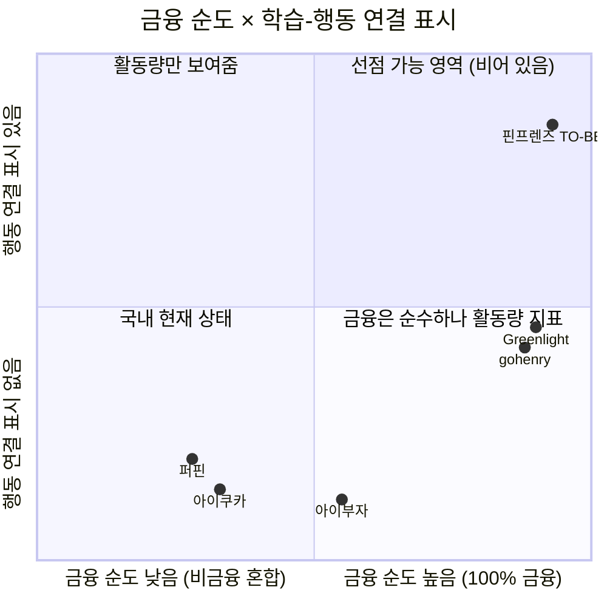

# Value Proposition — 핀프렌즈

> **작성** 2026-08-20 · 유림
> **생성 모델** `claude-opus-5` (Claude Opus 5) · **Effort Level** `high`
> **기반 문서** [`JTBD_인터뷰_결과보고서_H1_H6.md`](../7. JTBD/JTBD_인터뷰_결과보고서_H1_H6.md) — 선별 페르소나의 Pain·JTBD
> **★ Selected Pain Point** `C1` · `A4` · `A6` — **선별 단위는 Pain Point이고 페르소나(H1·H6)는 그 결과**입니다. 비선별 3건(C2·C3·A5)은 §1-3에 **보조 Pain**으로 유지합니다
> **참조** [`페르소나_스펙트럼_v2.md`](../5. 페르소나스펙트럼_고객여정지도/페르소나_스펙트럼_v2.md) · [`고객여정지도_최종.md`](../5. 페르소나스펙트럼_고객여정지도/고객여정지도_최종.md) · [`대표_페인포인트_차트.md`](../5. 페르소나스펙트럼_고객여정지도/대표_페인포인트_차트.md) · [`기회점수_AOS_DOS_분석.md`](../6. 시장기회 분석 AOS_DOS/기회점수_AOS_DOS_분석.md) · [`가치목표_제안.md`](가치목표_제안.md) · [`Five-Forces_사업기획서.md`](../1. Porter's Five Forces 모델/Five-Forces_사업기획서.md) · [`가치사슬_분석.md`](../2. 기업 내부 활동의 가치사슬 분석/가치사슬_분석.md) · [`KSF_분석.md`](../3. 핵심 성공 요인/KSF_분석.md) · [`기능정의_v13.md`](../0. 확정 기능 정의/기능정의_v13.md) · [`TAM-SAM-SOM_시장세분화.md`](../4. TAM-SAM-SOM_Market-Segment/TAM-SAM-SOM_시장세분화.md) · [`하영/05_유사서비스비교`](../../하영/05_유사서비스비교/README.md) · [`혜원/경쟁사비교`](../../혜원/서비스분석/경쟁사비교_아이쿠카_골스텝.md)

> ⚠️ **Effort Level 표기에 대해** — 모델명(`claude-opus-5`)은 확인된 값이고, **Effort Level `high`는 이 문서를 작성한 세션의 설정을 추정한 값**입니다. 실제 설정이 다르면 파일명을 그에 맞게 바꿔 주세요.

> ## 🔴 문서의 지위 — 고객 인터뷰 0건
> 부모 인터뷰 0건 · 아이 인터뷰 0건입니다. 기반 문서인 JTBD 보고서는 **「가설 카드」 판**이며, 이 Value Proposition은 그 위에 세운 **제안**이지 검증된 결론이 아닙니다.
> **[관측]** 공식 자료·통계·팀 직접 확인 → 발표 근거 사용 가능 · **[추론]** 관측을 연결한 해석 · **[가설]** 미검증

---

# 1. 페르소나 및 CJM 기반 핵심 문제 (Pain · Needs)

## 1-1. 선별 페르소나 2인

| | **H1 정미경** | **H6 임태경** |
|---|---|---|
| **스펙트럼 유형** | **Core** | **Adjacent** |
| **시장 세그먼트** | **① 금융성장 증명형** — 29.3만명 (35.8%, 최대) | **③ 용돈 소비통제형** — 13.3만명 (16.3%) |
| **프로필** | 39세 중학교 교사 · 정하율(만 8세·초2) · 주 8,000원 앱 충전 · **퍼핀 8개월차** | 43세 물류 배송직 · 임서준(만 8세·초2) · 월 3만원 · **경제교육 경험 없음** |
| **여정 결말** | 🟢 10단계까지 유지 | 🔴 10단계 이탈 (1개월 내 해지) |
| **타깃 판정** | ✅ **1차 타깃** | ⚠️ **1차 타깃 제외 · 제품에서 배제하지 않음** |

## 1-2. ★ Selected Pain Point — 3건

> **선별 단위는 Pain Point이고, 페르소나는 그 결과로 도출됐습니다.** C1·A4·A6 세 건을 고른 뒤 해당 인물을 추적하니 **H1·H6 두 가정**이 나왔습니다.

| ★ | ID | 인물 | 여정 # | **Pain Point** | **Needs (그 순간 원하던 것)** | 감정 | 등급 |
|:-:|:-:|---|:-:|---|---|:-:|:-:|
| ★ | **C1** | **H1** | **0** 접하기 전 | 8개월치가 쌓였는데도 **누적 숫자(116일·75문제·6,650원)가 성장의 증거가 되지 못함** | 활동량이 아니라 **변화**를 읽고 싶다 | 3 | **P0** |
| ★ | **A4** | **H6** | **2** 인지·비교 | 위치 알림을 *"어디 있는지 알려주는 기능"*으로 이해 — **진입 동기가 감시 기대** | 아이가 **어디서 얼마를 쓰는지** 알고 싶다 | 4 | **P1** |
| ★ | **A6** | **H6** | **10** 전환 후 | 한 달 뒤 지출이 그대로여서 해지 — **'교육'을 파는 제품이 '통제'를 원하는 부모에게는 실패로 채점** | *"얼마 줄었다"*는 **숫자 하나**를 보고 싶다 | **1** | **P1** |

> 🔴 **선별 3건의 무게중심이 H6 쪽에 있습니다.** 1차 타깃인 H1은 C1 하나이고, **1차 타깃에서 제외한 H6이 둘(A4·A6)**입니다. 그런데 DOS(SOM)는 정반대입니다 — **C1이 1위(3.00), A6이 7위(1.20), A4가 10위(0.90)**. **가장 아파하는 쪽과 1년 안에 만날 쪽이 갈린다**는 것이 이 세 건의 조합 자체에 드러나 있습니다.

## 1-3. 보조 Pain — 3건 *(선별 제외 · 근거로 유지)*

> 선별에는 들지 않았지만 **선언 ①의 근거를 지탱**하므로 삭제하지 않고 남깁니다. 특히 **C2는 DOS 공동 1위**입니다.

| ID | 인물 | 여정 # | **Pain Point** | 왜 남기는가 | AOS / DOS(SOM) |
|:-:|---|:-:|---|---|:-:|
| C2 | **H1** | **6** 실천 선택 | 성장 조건 3종(학습·퀴즈·**실천**) 중 실천이 비어 **4개 나무가 한 칸도 자라지 못하고 전부 정체** | 🔴 **선언 ①의 최상위 근거** — 빠지면 *"실천하며 성장"*이 근거 없이 뜸 | 3.2 / **3.00** 🥇 |
| C3 | **H1** | **10** 전환 후 | 나무가 2주 이상 정체되면 **부모가 아이 능력 문제로 해석**하거나 **앱을 불신** | H1의 **이탈 트리거** — O3·O8의 출처 | 3.2 / 1.80 |
| A5 | **H6** | **6** 실천 선택 | 알림이 **선택 지원이 아니라 통제 신호**로 전달되면 아이가 앱을 회피 대상으로 학습 | A4의 **아이 쪽 이면** — 감시 기대가 아이에게 어떻게 닿는지 | 1.6 / 0.18 |

---

# 2. JTBD — 고객 상황에 따른 Job Statement

## 2-1. Job 선언

| | **H1 정미경** | **H6 임태경** |
|---|---|---|
| **Situation** *(When…)* | **일요일 밤 아이를 재우고 용돈 앱을 열었을 때**, 숫자 세 개만 조금 커져 있고 지난주와 달라진 것을 찾을 수 없을 때 | **결제 문자에 편의점이 연달아 찍히는 것을 보고 "그만 좀 사"라고 말한 다음 날, 또 같은 문자가 올 때** |
| **Job Statement** *(I want to…)* | **아이가 배운 것이 실제 돈 행동으로 이어졌는지를, 짧은 시간 안에 확인하고 싶다** | **말 한마디 말고 다른 수단으로, 아이의 편의점 지출을 줄이고 싶다** |
| **4 Forces — Push** | 8개월치 숫자가 쌓일수록 판단이 더 어려워짐 · 오답 재시도 보상을 목격한 뒤 **학습 데이터 자체를 불신** | 개입 수단이 **말 한마디뿐**이라 반복될수록 효과가 떨어지고 관계만 상함 |
| **Pull** | 나무 4칸을 보고 *"어디가 멈췄는지 보인다"*를 즉시 이해 | 🔴 위치 알림을 *"위치를 알려준다"*로 이해 — **제품 의도와 반대** |
| **Habit** | 8개월간의 일요일 밤 확인 루틴 · 교사라 학습 데이터 읽기에 익숙 | 결제 문자 확인 → 구두 지적 |
| **Anxiety** | 🔴 **진입 불안** — 8개월치 기록 이전 불가 · 카드 중복 | 🔴 **유지 불안** — 진입은 쉬운데(*"돈 안 들면 깔아는 보죠"*) 한 달 뒤 지출이 그대로면 즉시 해지 |

## 2-2. 두 Job의 관계 — 제품이 답하는 것은 H1의 Job입니다

> **H1의 Job = 「확인」 · H6의 Job = 「감축」.** 제품 Job(*"배운 것을 실천할 자리를 만든다"*)은 H1 쪽이고, **H6은 성공 기준 자체가 다른 고객**입니다.
> 이 차이는 점수로도 나타납니다 — H6의 Pain A6은 **AOS 4.0으로 전체 1위**(가장 아파함)인데 **DOS(SOM)는 7위**(1년차 시장 가중에서는 밀림)입니다.

---

# 3. 고객이 원하는 Outcome — 측정 가능한 형태

> **[가설]** 목표값은 전부 가설이고 **기준선은 미측정**입니다. 인터뷰·프로토타입 테스트로 실측한 뒤 확정합니다.

## 3-1. H1 — ① 세그먼트 (1차 타깃)

| # | Outcome | 목표 | 출처 Pain | 기준선 |
|:-:|---|---|:-:|:-:|
| **O1** | 성장 나무 5초 노출 후 **「이번 달 행동이 어떻게 달라졌나」 1문장 회상** | 성공률 **≥ 70%** | ★ **C1** | ⬜ 미측정 |
| **O2** | 부모 **주 1회 확인 시간** | **15분 → 3분** | ★ **C1** | ⬜ 미측정 |
| **O3** | **실천 근거 열람률** | **≥ 60%** | C3 *(보조)* | ⬜ 미측정 |
| **O4** | 아이 **3일차 / 7일차 재접속률** | **≥ 65% / ≥ 50%** | C2 *(보조)* | ⬜ 미측정 |
| **O5** | **7일 내 첫 실천 인정률** | **≥ 60%** | C2 *(보조)* | ⬜ 미측정 |
| **O6** | **나무 4칸 중 2칸 이상 성장한 가정 비율**(월말) | **≥ 50%** | C2 *(보조)* | ⬜ 미측정 |
| **O7** | 🌲 **월간 숲 재방문율**(익월) · **다음 달 충전율** | **≥ 50% / ≥ 70%** | ★ **C1** | ⬜ 미측정 |
| **O8** | **아이 루프 정지 → 부모 인지까지 걸린 일수** | **≤ 3일** | C2·C3 *(보조)* | ⬜ 미측정 · **현재 수단 없음** |

> ⚠️ **선별 3건 중 C1만 이 표에 대응합니다.** O3~O6·O8은 **보조 Pain(C2·C3)에서 나온 지표**이며, 이것이 §1-3에서 보조를 삭제하지 않은 실질적 이유입니다 — 지우면 **선언 ①의 측정 지표 4개가 근거를 잃습니다.**

## 3-2. H6 — ③ 세그먼트 (1차 타깃 제외, 최소 조건만)

| # | Outcome | 목표 | 출처 Pain | 비고 |
|:-:|---|---|:-:|---|
| **O9** | 위치 알림 옵트인 화면에서 **「부모는 위치를 볼 수 없습니다」를 동의 전에 인지한 비율** | **≥ 90%** | ★ **A4** | 🔴 A4의 Need는 *"어디서 얼마 쓰는지 알고 싶다"*인데 **제품은 그것을 주지 않습니다.** 따라서 Outcome은 감시 제공이 아니라 **진입 시점의 기대 교정**입니다 |
| **O10** | 월간 화면 **첫 줄에서 전월 대비 지출 증감액을 5초 안에 확인** | 도달률 **≥ 80%** | ★ **A6** | 🟢 **새 기능이 아니라 배치 문제** — 월간 숲의 「💳 소비 · 📈 지난달과 비교」 블록을 상단으로 |
| **O11** | 월 편의점 지출 · *"그만 좀 사"* 발화 빈도 | ⬜ **목표 미설정** | ★ **A6** | 🔴 **제품의 성공 기준이 아님** — 지출 감소를 우리 KPI로 삼지 않습니다 |

> 🔴 **선별 Pain A4가 드러낸 공백** — A4는 「감시 기대」이고 제품은 의도적으로 그것을 주지 않습니다. 그래서 A4의 Outcome은 **기능이 아니라 고지 설계**가 됩니다(P-12·P-19). 이 항목은 이번 선별 정정에서 **새로 추가**됐습니다.

---

# 4. 기존 대안 (Competitor / Substitute)

## 4-1. 대안의 세 층위

| 층위 | 대상 | 규모 | H1의 Job을 채우는가 | H6의 Job을 채우는가 |
|---|---|---|---|---|
| **직접 경쟁** | 퍼핀 · 아이쿠카 · 아이부자 | 가입 26만 / 50만 / 78만 | 🔴 **아니오** — 3사 전부 「학습→성장」 구간 공백 | 🟡 부분 (소비 내역·한도) |
| **해외 참조** | gohenry · Greenlight | 활성 아동 65만 / 매출 3,200억 | 🟡 **부분** — 금융 100%·교육표준 매핑은 있으나 **행동 변화 증명은 없음** | — (국내 미진출) |
| **대체재** | 카카오뱅크 mini · 토스 유스카드 · **현금** | 275만 / 320만 · 현금 **48.9%** | 🔴 아니오 | 🟡 부분 (결제 문자) |

> 🔴 **대체재가 가장 큰 위협입니다** — 국내 자녀 계정의 **83.9%가 이미 게임화 없는 순수 계좌·카드형**을 쓰고 있고, 전환 비용이 사실상 0입니다 (Five Forces §4-4 [관측]).

## 4-2. 직접 경쟁 · 해외 참조 상세 대조

| 항목 | **퍼핀** | **아이쿠카** | **아이부자**(하나은행) | **gohenry** | **Greenlight** | **핀프렌즈 TO-BE** |
|---|---|---|---|---|---|---|
| **교육 주제 순도** | 🔴 7과목 중 **4개가 비금융**(한국사·시사·어휘·과학기술) | 🔴 경제 + **문해력·시사** | 🟡 금융 + 주식 (+기분·만보기) | 🟢 **전부 금융** | 🟢 **전부 금융** | 🟢 **4주제 전부 금융**(벌기·잘 쓰기·모으기·불리기) |
| **외부 교육 표준 매핑** | 🔴 없음 | 🔴 없음 | 🔴 없음 | 🟢 US/UK 가이드라인 | 🟢 Jump$tart·CEE | 🔴 **없음** *(우리도 없음)* |
| **성취·성장 표시** | 🔴 레벨업 외 확인된 장치 없음 | 🔴 확인 안 됨 | 🔴 확인 안 됨 | 🟡 배지 + 레벨 해제 | 🟡 XP·stars·배지·레벨 | 🟢 **4칸 나무 + 월간 숲 전월 비교** |
| **학습 ↔ 행동 연결** | 🔴 **없음** — 오답에도 절반 보상 | 🔴 없음 | 🔴 없음 | 🔴 없음 | 🔴 없음 | 🟢 **성장 조건에 「행동 실천 횟수」 내장** |
| **부모 학습 확인 화면** | 🟡 누적일·문제수·보상액 **숫자 3개** | 🔴 학습 확인 언급 없음 (소비·잔액·한도·**위치**만) | 🔴 학습 확인 언급 없음 | 🟢 진도 추적 + 부모도 미션 수행 | 🟢 진도 동행 | 🟢 **행동 근거가 붙은 나무·숲** |
| **보상 재원** | 🔴 **부모 지갑이 주 재원** | 현금(용돈 벌기) | 미확인 | 포인트(서비스 측) + 부모 선택 | 서비스 측 | 🟢 **⭐ 별 = 앱 내 재화** · 현금과 완전 분리 |
| **소비 사전 개입** | 🔴 없음 (쓴 다음 기록만) | 🟡 위치추적(안심존) — **감시 목적** | 🔴 없음 | 🔴 없음 | 🔴 없음 | 🟡 위치 알림 3분 체류 *(MVP 제외 — §8)* |
| **수익모델** | 구독 (전환율 **1.54%**) | 멤버십 게이팅 | **완전 무료** | 구독 | 구독 | 무료 + 결제 수수료·제휴 |

> 출처 — [`하영/05_유사서비스비교`](../../하영/05_유사서비스비교/README.md) §① · [`혜원/경쟁사비교`](../../혜원/서비스분석/경쟁사비교_아이쿠카_골스텝.md) §2 · Five Forces PART 2
> ⚠️ **네 서비스 모두 앱을 직접 설치·조작하지 못했습니다.** 위는 **공개 자료가 말하는 설계**이며, 실제 화면을 본 결과가 아닙니다(하영 §0).
> ⚠️ **효과가 학술 검증된 서비스는 하나도 없습니다** — 우리를 포함해서입니다.

---

# 5. 우리 솔루션의 핵심 제안 (Value Proposition)

> ### 선언 ① *(성장이 일어난다)*
> **핀프렌즈는 자녀가 재미있게 금융에 대해 학습하고 금융 행동을 실천하며 성장할 수 있습니다.**
>
> ### 선언 ② *(그 성장이 보인다)*
> **핀프렌즈는 자녀가 얼마나 금융 지식을 배웠는지가 아닌, 금융 행동이 어떻게 달라졌는지 한 눈에 보여줍니다.**

## 5-1. 위계 — ①이 일어나야 ②가 보여줄 것이 생깁니다

```
아이가 재미있게 계속한다 → 금융을 배운다 → 금융 행동을 실천한다 → 성장한다   … 선언 ①
                                     ↓
                  그 행동이 어떻게 달라졌는지 부모가 본다               … 선언 ②
```

**근거** — 이중 고객 구조에서 **아이가 쓰지 않으면 부모 화면은 빈 상태로 정상 작동**합니다. 아이 Pain 12건 중 **부모 화면에 신호로 나타나는 것은 0건**입니다(페인포인트 차트 §6-3 [추론]).

## 5-2. Job × Opportunity 통합 확인

| ★ | Job | 대응 Opportunity (기회점수 ID) | AOS | DOS(SAM) | DOS(SOM) | 선언 |
|:-:|---|---|:-:|:-:|:-:|:-:|
| ★ | 배운 것이 행동으로 이어졌는지 확인 | **C1** 성장 증거 부재 | 3.0 | **1.08** 🥇 | **3.00** 🥇 | ② |
| ★ | *(H6)* 아이 소비를 파악 | **A4** 진입 동기가 감시 기대 | 3.2 | 0.48 | 0.90 | — |
| ★ | *(H6)* 지출 감소 가시화 | **A6** 성공 기준 불일치 | **4.0** 🥇 | 0.64 | 1.20 | — |
| | 아이가 실천을 시작하게 하기 | C2 4개 나무 전부 정체 *(보조)* | 3.2 | **1.08** 🥇 | **3.00** 🥇 | ① |
| | 멈춘 이유를 알기 | C3 정체 원인 미설명 *(보조)* | 3.2 | 0.63 | 1.80 | ② |
| | *(아이)* 감시받지 않고 어울리기 | A5 알림이 통제 신호로 전달 *(보조)* | 1.6 | 0.10 | 0.18 | — |

> 🔴 **선별 3건 중 우리 두 선언에 대응하는 것은 C1 하나입니다.** A4·A6은 H6의 것이고 **선언 대응이 없습니다**(— 표기) — H6의 Job이 「감축」이라 제품 Job과 다르기 때문입니다.
> 🟢 **선언 ①에 대응하는 것은 보조 Pain C2**이고, 그 C2가 **DOS 공동 1위**입니다. 선별과 우선순위가 어긋나는 지점이며, §1-3에서 보조를 유지한 이유입니다.

---

# 6. 우리가 제공하는 차별적 가치

| # | 차별 가치 | 무엇이 그것을 만드는가 | 경쟁사는 왜 못 하는가 |
|:-:|---|---|---|
| **V1** | 🔑 **실천 조건이 성장 지표에 내장돼 있다** | 나무 성장 조건 = **학습 완주 + 퀴즈 정답 + 행동 실천 3종을 모두** 채워야 다음 단계 (v13 §3-1) | 국내 3사는 **학습→성장 구간 자체가 없음.** 퍼핀은 **오답에도 절반 보상**이라 학습 없이 보상받는 경로가 열려 있음 |
| **V2** | 🔑 **지식이 아니라 행동 변화를 보여준다** | 🌳 성장 나무(이번 달) + 🌲 월간 숲의 **「지난달과 비교」**(사려다 멈춤·가격 비교·저축률 증감) | 퍼핀은 **숫자 3개**, 아이쿠카·아이부자는 **학습 확인 화면 자체가 없음**. 해외 2사도 배지·XP는 **활동량 지표** |
| **V3** | **금융 100% 커리큘럼** | 4주제 = 벌기 · 잘 쓰기 · 모으기 · 불리기 — **부모·아이 화면 동일 명칭** (v13 §9) | 국내 3사 전부 비금융 혼합 — 퍼핀 4/7과목, 아이쿠카 문해력·시사. **4칸 매핑이 구조적으로 불가** |
| **V4** | **보상 재원이 부모 지갑이 아니다** | ⭐ 별은 **앱 내 재화**이고 옷장 아이템으로만 소비. 현금·환급·양도 전부 차단 (v13 §4-3) | 퍼핀은 **부모 지갑이 주 재원** → 리뷰 921건 중 **「부모의 금전적 보상 부담」 7건** |
| **V5** | **이중 고객 산출물 이원화** | 같은 원본 데이터를 부모=🌳나무·🌲숲, 아이=⭐별·👕옷장으로 번역 (가치사슬 §1-3) | 국내 3사는 부모 화면이 **소비·잔액 중심**이라 이원화할 원본이 없음 |
| **V6** | *(유보)* **소비 사전 개입 + 사후 회고** | 📍 위치 알림 3분 체류 → 💳 계획↔실제 비교 → [확인했어요] ⭐1 | 퍼핀은 **쓴 다음에 기록만**. 아이쿠카 위치추적은 **감시 목적** ⚠️ 단, **MVP 제외** — §8-3 참조 |

> 🟢 **V1이 이 제안의 중심입니다.** *"퀴즈를 100개 풀어도 나무는 안 자란다"*는 문구가 아니라 **강제 조건**이고, 경쟁사는 이 조건을 걸 이유가 없습니다.
> 🔴 **V6는 차별점 목록에 두되 MVP에서 뺐습니다.** 기술 구현 가능성이 미검증(v13 §13-7)이고, **「3분 체류」가 잡아야 할 소비를 못 잡을 수 있다**는 것이 여정 분석에서 드러났습니다(C5).

---

# 7. Proof — 근거와 대안 대비 차별성

## 7-1. 고객가치 목표지점 도출의 근거 체인

| 단계 | 근거 | 등급 | 출처 |
|---|---|:-:|---|
| **문제 실재** | 금융교육 개입은 **지식 +0.33 SD, 행동 +0.07 SD** — *"가르치는 것"과 "행동을 바꾸는 것"은 다른 문제* | [관측] | 국제 메타분석 · Five Forces PART 1 |
| **시장 공백** | 국내 3사 전부 **「학습했다 ↔ 성장했다」 구간이 공개 자료상 공백** | [관측] | Five Forces PART 1 · 하영 §① |
| **공백의 당사자 인정** | 퍼핀 개발사 — *"의도와 다르게 작동하는 케이스가 있다"* | [관측] | 하영 E6 |
| **현장 증거** | 퍼핀 부모 화면 = 누적일·문제수·보상액 **숫자 3개** | [관측] | 혜원 E-11 (팀 직접 캡처) |
| **왜 이 지점인가** | 5개 힘 중 **4개가 불리** → 가격 경쟁 불가. **유일하게 낮은 장벽이 기술적 차별화** | [추론] | Five Forces §4-3 · §4-6 |
| **어디에 자원을** | 9개 활동 중 차별화 「매우 높음」은 **운영·생산 / 기술 개발 단 둘**, 공통분모가 행동 전이 | [추론] | 가치사슬 PART 3 |
| **생존 조건** | **KSF 1번 = 행동 전이 증명 역량** — *"이 요인을 놓치면 사업 자체의 존재 이유가 사라진다"* | [추론] | KSF §1 |
| **수요 규모** | ① 성장증명형 **29.3만명(35.8%)** — 4개 중 최대. 부모 발화 *"돈은 버는데 정말 성장하고 있는지 확인하고 싶다"* | [관측]+모델값 | TAM §5-3 · §5-5 |
| **우선순위** | **C1·C2의 DOS가 SAM·SOM 양쪽에서 1위** · C1 발생률 1.0 | [추론] | 기회점수 §6 · §7 |
| **실행 가능성 선례** | Duolingo(제3자 효능 연구) · Noom(RCT) — *"활동량이 아니라 결과를 외부가 검증하게 한다"* | [관측] | KSF §1 |

## 7-2. 대안 대비 차별성 — 포지셔닝 시각화



> **Q1(우상단)이 비어 있다는 것이 이 제안의 근거입니다.** 해외 2사는 금융 순도는 높지만 표시하는 것이 **배지·XP·레벨 = 활동량**이고, 국내 3사는 **양쪽 모두 낮습니다.**
> ⚠️ **좌표는 공개 자료 기반 [추론]**이며 측정값이 아닙니다. 앱 직접 확인 후 재배치가 필요합니다.

## 7-3. 한 줄 대조

| 질문 | 경쟁사의 답 | **핀프렌즈의 답** |
|---|---|---|
| *"우리 애가 뭘 배웠나요?"* | 116일 · 75문제 · 6,650원 | 벌기 🌳 · 잘 쓰기 🌿 · 모으기 🌱 · 불리기 ⬜ |
| *"그게 성장인가요?"* | 🔴 **답이 없음** | **실천 없이는 자라지 않으므로, 자랐다면 실제로 했다는 뜻** |
| *"지난달과 뭐가 달라졌나요?"* | 🔴 **답이 없음** | 사려다 멈춤 2회 → 5회 · 저축률 12% → 32% |
| *"보상은 누가 냅니까?"* | 🔴 **부모 지갑** (퍼핀) | **앱 내 별** — 현금과 완전 분리 |

---

# 8. Job-Feature Map

## 8-1. Job 정의

| Job | 내용 | 대응 선언 |
|:-:|---|:-:|
| **J1** | *(아이)* 재미있게 금융을 배우고 실천하며 성장한다 | ① |
| **J2** | *(부모)* 금융 행동이 어떻게 달라졌는지 한 눈에 본다 | ② |
| **J3** | *(전제)* 시작할 수 있고, 멈춘 것을 알 수 있다 | ①·② 공통 |

## 8-2. Feature 명세

> **중요도** = Job 달성에 대한 필수성 · **개발 난이도** = 기술·규제·콘텐츠 원가 종합 · **MVP** = 두 Job의 최소 루프를 닫는 데 필요한가

| 기능명 | 핵심 Job 연관성 | 중요도(1~5) | 개발 난이도(1~5) | MVP 포함 | 우선순위 |
| --- | --- | :-: | :-: | :-: | :-: |
| **F1** 🌳 성장 나무 (4영역 + **실천 근거 기본 노출**) | **J2** — 「행동이 어떻게 달라졌는지」의 주 화면 | **5** | 4 | **✔** | **High** |
| **F2** 🧹 미션 루프 (생성·수행·부모 승인 → ⭐1) | **J1** — 「벌기」의 유일한 실천 근거 | **5** | 3 | **✔** | **High** |
| **F3** 📚 학습 커리큘럼 4주제 + 퀴즈 | **J1** — 「금융에 대해 학습」의 실체 | **5** | 3 | **✔** | **High** |
| **F4** ⭐ 별 지급 엔진 (트리거 8종) | **J1** — 실천 5경로 vs 학습 2경로 | **5** | 3 | **✔** | **High** |
| **F5** 🐾 동물 아바타 · 👕 옷장 | **J1** — 아이의 **유일한** 동기 장치 | **5** | 4 | **✔** | **High** |
| **F6** 🐣 아이 온보딩 (학습→퀴즈→⭐1→⭐1 아이템) | **J1·J3** — 첫 보상 루프를 5분에 닫음 | 4 | 2 | **✔** | **High** |
| **F7** 🔐 부모 온보딩 5단계 + **법정대리인 동의** | **J3** — 규제 필수(P-05·P-12·P-22) | **5** | 4 | **✔** | **High** |
| **F8** 💳 결제 내역 + 계획↔실제 비교 회고 ([확인했어요] → ⭐1) | **J1·J2** — 「행동」 데이터의 절반 | **5** | 4 | **✔** | **High** |
| **F9** 🌲 월간 숲 (**지난달과 비교** 포함) | **J2** — 「변화」를 만드는 유일한 화면 | **5** | 3 | **✔** | **High** |
| **F10** ⏱ **승인 지연 시 ⭐ 소급 지급 + 「승인 대기 N건」 표시** | **J1·J2** — 지연이 아이 실패로 기록되는 것을 차단 | 4 | 2 | **✔** | **High** |
| **F11** 🔔 **아이 3일 미접속 알림** | **J3** — O8(탐지 지연 ≤3일)의 **유일한 달성 수단** | 4 | 2 | **✔** | **High** |
| **F12** 🎯 위시리스트 (30·70·100% 각 ⭐1) | **J1** — 「모으기」 칸을 여는 실천 | 4 | 2 | **✔** | **Mid** |
| **F13** 📊 주간·월간 소비 내역 (**전월 대비 증감액 상단 배치**) | **J2** — H6형 O9의 최소 유지 조건 | 3 | 2 | **✔** | **Mid** |
| **F14** 📍 위치 알림 (3분 체류 · **온디바이스 판정**) | **J1** — 소비 사전 개입 | 4 | **5** | **✖** | **Mid** |
| **F15** 💰 예적금 비교·선택 (가입 ⭐1 · 완주 ⭐10) | **J1** — 「불리기」 칸 | 3 | 3 | **✖** | **Mid** |
| **F16** 🪪 카드 없이 학습부터 시작하는 체험 경로 | **J3** — 진입 비용 제거 | 3 | 3 | **✖** | **Mid** |
| **F17** 🛍 별의 **옷장 외 목적지** (위시리스트 기여 등) | **J1** — 모으기형 아이의 루프 회수 | 3 | 3 | **✖** | **Low** |
| **F18** 📤 기존 앱 기록 이전 / 병행 사용 경로 | **J3** — H1의 진입 Anxiety 해소 | 2 | **5** | **✖** | **Low** |

**MVP 13개 · 제외 5개**

## 8-3. MVP 컷라인의 근거

| 판단 | 이유 |
|---|---|
| **MVP가 13개인 이유** | 이중 고객이라 **J1(아이)과 J2(부모)의 최소 루프를 각각 닫아야** 하고, F7(법정대리인 동의)은 **선택이 아니라 규제 요건**입니다. 어느 하나를 빼면 루프가 열린 채로 출시됩니다. |
| 🔴 **F14 위치 알림을 뺀 이유** | ① **기술 구현 가능성 미검증** — 백그라운드 위치 권한·배터리·아동 기기 권한 유지율 (v13 §13-7) ② 좌표 미저장 정책상 **온디바이스 판정 필수**라 클라이언트 부담이 큼 (P-19) ③ **3분 트리거가 잡아야 할 소비를 못 잡을 수 있음** — 문구점 뽑기는 1분 안에 끝남(여정 C5) ④ H6형에서 **감시로 오해**되어 1차 타깃이 아닌 세그먼트를 끌어들임(A4). **사후 회고(F8)만으로도 「행동 변화」 데이터는 나옵니다.** |
| **F10·F11을 MVP에 넣은 이유** | 둘 다 **v13에 없던 기능**이지만 난이도가 낮고, 각각 **P0 Pain 하나씩을 직접 막습니다** — F10은 「지연이 아이 실패로 기록됨」, F11은 「부모가 한 달 뒤에야 앎」. |
| **F15 예적금을 뺀 이유** | 「일정 기간」이 미결(v13 §14-4)이고, **금융상품 중개업 회피** 범위 확인이 선행돼야 합니다(P-20). 「불리기」 칸은 학습(F3)으로만 열어두고 실천은 2차로. |
| **F17을 Low로 둔 이유** | §6 V4의 이면입니다 — 별의 목적지를 넓히면 **현금과의 분리선**(v13 §4-3)을 다시 검토해야 합니다. 규제 확인이 선행. |

## 8-4. Job별 MVP 커버리지

```
J1 (아이 · 선언①)   F2 미션 · F3 학습 · F4 별 · F5 옷장 · F6 온보딩 · F12 위시리스트   → 4칸 중 3칸(벌기·잘쓰기·모으기) 개통
J2 (부모 · 선언②)   F1 성장 나무 · F8 결제 회고 · F9 월간 숲 · F13 소비 내역          → 「지난달과 비교」까지 도달
J3 (전제)           F7 부모 온보딩 · F10 소급 지급 · F11 미접속 알림                   → 시작·인정·탐지 3점 확보
```

## 8-5. ★ Selected Pain → Feature 추적

| ★ Pain | Needs | 대응 Feature | MVP |
|:-:|---|---|:-:|
| **C1** | 활동량이 아니라 변화를 읽고 싶다 | **F1** 성장 나무 · **F9** 월간 숲(지난달과 비교) | **✔ ✔** |
| **A4** | 아이가 어디서 얼마를 쓰는지 알고 싶다 | **F14** 위치 알림 · *(고지 설계 — O9)* | 🔴 **✖** |
| **A6** | 지출이 얼마 줄었는지 숫자 하나 | **F13** 소비 내역(전월 대비 증감액 상단) | **✔** |

> 🔴 **선별 3건 중 A4의 대응 기능이 MVP에 없습니다.** F14(위치 알림)를 §8-3의 네 가지 이유로 제외했기 때문입니다. **A4의 Need 자체가 제품이 의도적으로 주지 않는 것**(감시)이므로, MVP에서는 **기능이 아니라 옵트인 고지(O9)로만 대응**합니다 — 기대를 진입 시점에 교정하는 쪽입니다.

> 🔴 **MVP에서 「불리기」 칸은 학습만 열리고 실천은 닫힙니다**(F15 제외). 4칸 나무 화면에 **한 칸이 계속 비어 보이는 상태**가 되므로, 화면에 *"곧 열려요"* 같은 표시가 필요합니다 — 여정에서 H1이 *"키우기 칸이 계속 잠겨 있으면 부모가 4칸 중 하나를 결함으로 읽는다"*고 지적된 Pain입니다.

---

# 9. 한계와 사용 금지선

- 🔴 **고객 인터뷰 0건입니다.** 기반 문서인 JTBD 보고서가 **「가설 카드」 판**이고, 이 문서는 그 위의 제안입니다. **발표·PRD에 검증된 결론으로 인용할 수 없습니다.**
- **§3의 Outcome 목표값은 전부 [가설]**이고 기준선은 미측정입니다. *"확인 시간을 15분에서 3분으로 줄입니다"*를 **성과로 쓸 수 없습니다.**
- **§4 경쟁사 대조는 공개 자료 기반**이며 **네 서비스 모두 앱을 직접 설치·조작하지 못했습니다**(하영 §0). 특히 퍼핀 약관에 「또래 집단 비교·분석」이 존재해(병윤 F-10), *"3사 전부 활동량 요약 수준"*이라는 단정은 **실제 화면 확인이 필요**합니다.
- **§7-2 포지셔닝 좌표는 [추론]**이며 측정값이 아닙니다.
- 🔴 **선언 ①의 *"성장할 수 있습니다"*는 실제 성장을 주장합니다.** V1~V5는 그렇게 되도록 만든 **설계**이지 **효과의 증명이 아닙니다.** Duolingo·Noom처럼 **제3자 검증 전에는 「설계상 그렇게 되도록 만들었다」까지만** 말할 수 있습니다.
- 🔴 **「금융 100%」(V3)는 검증과제 ①에 걸려 있습니다.** 모의 세션에서 H1은 *"그것도 공부니까 좋다"*(b 시나리오)로 답했습니다. **인터뷰 전에 확정된 차별점으로 발표하지 않습니다.**
- **§8의 중요도·난이도는 분석자 판단값**입니다. 특히 **F5의 난이도 4는 3D 에셋 제작량(동물 종수 × 옷 벌수)이 미결**이라 잠정치입니다(v13 §14-8 · 가치사슬 §2-3).
- **세그먼트 규모(29.3만·13.3만)는 모델값**입니다 — 관여도×문제강도의 **독립성을 가정**했습니다(TAM §5-3). **모집단은 매년 5~12% 줄어듭니다.**
- **H6은 1차 타깃에서 제외했으나 제품에서 배제하지 않았습니다**(O9·F13). 되살릴 근거는 JTBD 보고서 §5-1에 있습니다.
