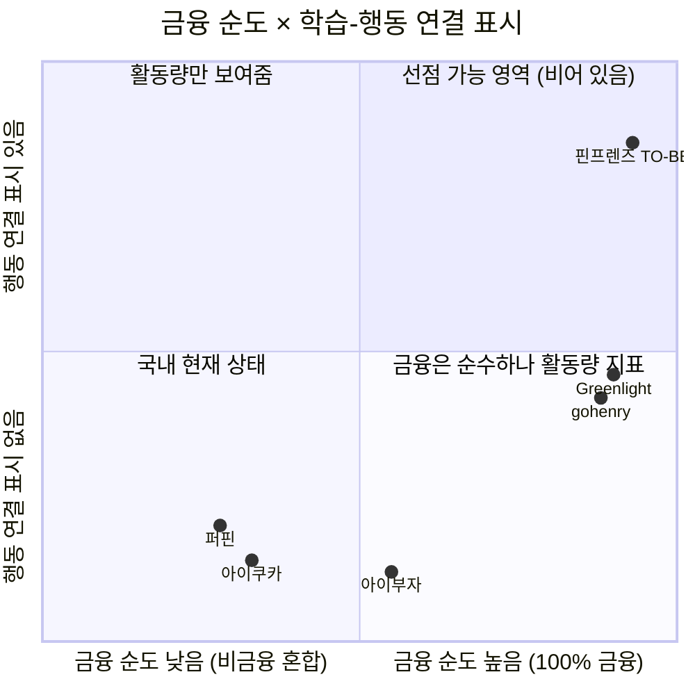

# 핀프렌즈 Value Proposition Sheet — v1.0 (merged)

> **작성** 2026-08-20 · 유림 · **병합 수행** `claude-opus-5` / effort `high`
> **원본 2종** [`Value_proposition_claude-opus-5_effort-high.md`](Value_proposition_claude-opus-5_effort-high.md) *(base)* · [`Value_proposition_Gemini_3.6_Flash_High.md`](Value_proposition_Gemini_3.6_Flash_High.md) *(이식)*
> **병합 근거** [`VP_모델비교_Gemini3.6Flash_vs_Opus5.md`](VP_모델비교_Gemini3.6Flash_vs_Opus5.md)

<details>
<summary><b>📋 병합 내역 — 무엇을 어디서 가져왔나</b></summary>

| 요소 | 출처 | 위치 |
|---|:-:|---|
| 문서 골격 · MVP 컷라인 · 한계·금지선 · 선별/보조 2층 구조 | **Opus** | 전체 |
| **Imp · Sat 원본 수치** + Pain ID를 행 정체성으로 | **Gemini** | §3-1 |
| **통합 Core Job 한 문장** | **Gemini** | §0 · §2-2 |
| **차별화 박스아트** | **Gemini** | §6 |
| **메타분석 막대그래프** | **Gemini** | §7-2 |
| 🆕 목차 · 한 장 요약 · §9 미결 사항 | *신규* | 두 원본 모두 부재 |
| 🔴 **제외** — Gemini §3-1 A4 지표 「부모 확인률 ≥ 80%」 | — | **P-19(좌표 미저장·부모 열람 불가)와 충돌.** O-A4로 교체 |

</details>

**목차** — [📌 한 장 요약](#-한-장-요약) · [1. Pain·Needs](#1-페르소나-및-cjm-기반-핵심-문제-pain--needs) · [2. JTBD](#2-jtbd--고객-상황에-따른-job-statement) · [3. Outcome](#3-고객이-원하는-outcome) · [4. 기존 대안](#4-기존-대안-competitor--substitute) · [5. 핵심 제안](#5-우리-솔루션의-핵심-제안-value-proposition) · [6. 차별적 가치](#6-우리가-제공하는-차별적-가치) · [7. Proof](#7-proof) · [8. Job-Feature Map](#8-job-feature-map) · [9. 미결 사항](#9-미결-사항) · [10. 한계와 금지선](#10-한계와-사용-금지선)

---

## 📌 한 장 요약

> ## 🎯 배운 것을 **실천할 자리**를 만든다
> **자녀가 재미있게 금융을 배우고 생활 속에서 실천하며 성장하도록 돕고, 부모는 그 행동이 어떻게 달라졌는지를 한눈에 확인한다.**

| | **선언 ① 성장이 일어난다** | **선언 ② 그 성장이 보인다** |
|---|---|---|
| **문장** | 핀프렌즈는 자녀가 **재미있게 금융에 대해 학습하고 금융 행동을 실천하며 성장**할 수 있습니다 | 핀프렌즈는 자녀가 얼마나 **금융 지식을 배웠는지가 아닌, 금융 행동이 어떻게 달라졌는지** 한 눈에 보여줍니다 |
| **누구의 것** | **아이** — 재미·실천·성장이 아이에게서 일어남 | **부모** — 그 결과를 확인 |
| **화면** | ⭐ 별 · 👕 옷장 ／ 학습 4주제 · 실천 5경로 | 🌳 성장 나무 · 🌲 월간 숲 |
| **최강 근거** | 나무 성장 조건에 **「행동 실천 횟수」** 내장 — 퀴즈만 100개 풀어도 안 자람 | 금융교육은 **지식 +0.33 SD, 행동 +0.07 SD** |
| **기회점수** | C2 · **DOS(SOM) 3.00 🥇** | C1 · **DOS(SOM) 3.00 🥇** |

**핵심 지표 4개** *(전부 [가설] · 기준선 ⬜ 미측정)*

| 선언 | 지표 | 목표 |
|:-:|---|---|
| ① | 아이 **7일차 재접속률** | ≥ 50% |
| ① | 가입 후 **7일 내 첫 실천 인정률** | ≥ 60% |
| ② | 성장 나무 **5초 노출 후 「행동이 어떻게 달라졌나」 1문장 회상** | 성공률 ≥ 70% |
| ② | 부모 **주 1회 확인 시간** | 15분 → 3분 |

> 🔴 **문서의 지위** — 부모 인터뷰 0건 · 아이 인터뷰 0건. 이 문서는 **근거에 기반한 제안**이지 검증된 결론이 아닙니다. 인용 규칙은 [§10](#10-한계와-사용-금지선).
> **등급 표기** `[관측]` 공식 자료·통계·팀 직접 확인 → 발표 근거 가능 · `[추론]` 관측을 연결한 해석 · `[가설]` 미검증 · `[설계 확정]` 기능정의 v13 확정

---

# 1. 페르소나 및 CJM 기반 핵심 문제 (Pain · Needs)

## 1-1. 선별 페르소나 2인

| | **H1 정미경** | **H6 임태경** |
|---|---|---|
| **스펙트럼 / 세그먼트** | **Core** / **① 금융성장 증명형** — 29.3만명 (35.8%, 최대) | **Adjacent** / **③ 용돈 소비통제형** — 13.3만명 (16.3%) |
| **프로필** | 39세 중학교 교사 · 정하율(만 8세·초2) · 주 8,000원 앱 충전 · **퍼핀 8개월차** | 43세 물류 배송직 · 임서준(만 8세·초2) · 월 3만원 · **경제교육 경험 없음** |
| **여정 결말** | 🟢 10단계까지 유지 | 🔴 10단계 이탈 (1개월 내 해지) |
| **타깃 판정** | ✅ **1차 타깃** | ⚠️ 1차 타깃 제외 · **제품에서 배제하지 않음** |

## 1-2. ★ Selected Pain Point — 3건

> **선별 단위는 Pain Point이고, 페르소나는 그 결과입니다.** C1·A4·A6을 고른 뒤 인물을 추적하니 **H1·H6 두 가정**이 나왔습니다.

| ★ | ID | 인물 | 여정 # | **Pain Point** | **Needs (그 순간 원하던 것)** | 감정 | 등급 |
|:-:|:-:|---|:-:|---|---|:-:|:-:|
| ★ | **C1** | H1 | **0** 접하기 전 | 8개월치가 쌓였는데도 **누적 숫자(116일·75문제·6,650원)가 성장의 증거가 되지 못함** | 활동량이 아니라 **변화**를 읽고 싶다 | 3 | **P0** |
| ★ | **A4** | H6 | **2** 인지·비교 | 위치 알림을 *"어디 있는지 알려주는 기능"*으로 이해 — **진입 동기가 감시 기대** | 아이가 **어디서 얼마를 쓰는지** 알고 싶다 | 4 | **P1** |
| ★ | **A6** | H6 | **10** 전환 후 | 한 달 뒤 지출이 그대로여서 해지 — **'교육'을 파는 제품이 '통제'를 원하는 부모에게는 실패로 채점** | *"얼마 줄었다"*는 **숫자 하나**를 보고 싶다 | **1** | **P1** |

## 1-3. 보조 Pain — 3건 *(선별 제외 · 근거로 유지)*

| ID | 인물 | 여정 # | **Pain Point** | 왜 남기는가 |
|:-:|---|:-:|---|---|
| C2 | H1 | **6** 실천 선택 | 성장 조건 3종(학습·퀴즈·**실천**) 중 실천이 비어 **4개 나무가 한 칸도 자라지 못하고 전부 정체** | 🔴 **선언 ①의 최상위 근거** · DOS 공동 1위 — 빠지면 *"실천하며 성장"*이 근거 없이 뜸 |
| C3 | H1 | **10** 전환 후 | 나무가 2주 이상 정체되면 **부모가 아이 능력 문제로 해석**하거나 **앱을 불신** | H1의 **이탈 트리거** · Outcome 2건의 출처 |
| A5 | H6 | **6** 실천 선택 | 알림이 **선택 지원이 아니라 통제 신호**로 전달되면 아이가 앱을 회피 대상으로 학습 | A4의 **아이 쪽 이면** |

---

# 2. JTBD — 고객 상황에 따른 Job Statement

## 2-1. 페르소나별 JTBD 카드

| | **H1 정미경 (Core / ①)** | **H6 임태경 (Adjacent / ③)** |
|---|---|---|
| **Situation** *(When…)* | **일요일 밤 아이를 재우고 용돈 앱을 열었을 때**, 숫자 세 개만 조금 커져 있고 지난주와 달라진 것을 찾을 수 없을 때 | **결제 문자에 편의점이 연달아 찍히는 것을 보고 "그만 좀 사"라고 말한 다음 날, 또 같은 문자가 올 때** |
| **Job Statement** *(I want to…)* | **아이가 배운 것이 실제 돈 행동으로 이어졌는지를, 짧은 시간 안에 확인하고 싶다** | **말 한마디 말고 다른 수단으로, 아이의 편의점 지출을 줄이고 싶다** |
| **Job의 본질** | **[성장 증명 / 확인]** | **[지출 감축 / 통제]** |
| **Push** | 8개월치 숫자가 쌓일수록 판단이 더 어려워짐 · 오답 재시도 보상을 목격한 뒤 **학습 데이터 자체를 불신** | 개입 수단이 **말 한마디뿐**이라 반복될수록 효과가 떨어지고 관계만 상함 |
| **Pull** | 나무 4칸을 보고 *"어디가 멈췄는지 보인다"*를 즉시 이해 | 🔴 위치 알림을 *"위치를 알려준다"*로 이해 — **제품 의도와 반대** |
| **Habit** | 8개월간의 일요일 밤 확인 루틴 · 교사라 학습 데이터 읽기에 익숙 | 결제 문자 확인 → 구두 지적 |
| **Anxiety** | **진입 불안** — 8개월치 기록 이전 불가 · 카드 중복 | **유지 불안** — 진입은 쉬운데(*"돈 안 들면 깔아는 보죠"*) 한 달 뒤 지출이 그대로면 즉시 해지 |
| **제품 전략상 위치** | 🟢 **핵심 Target Job** — 1차 개발·가치 제공의 주축 | ⚠️ **보조 대응 Job** — 메인 가치관과 다르나 **정보 배치로 최소 유지 조건** 충족 |

## 2-2. 통합 Core Job Statement

> ### 🎯 **"배운 것을 실천할 자리를 만든다"**
> **자녀가 재미있게 금융을 배우고 생활 속에서 실천하며 성장하도록 돕고, 부모는 그 행동이 어떻게 달라졌는지를 한눈에 확인한다.**

**H1의 Job = 「확인」 · H6의 Job = 「감축」.** 제품 Job은 H1 쪽이고, **H6은 성공 기준 자체가 다른 고객**입니다.

---

# 3. 고객이 원하는 Outcome

## 3-1. Outcome × 기회점수 통합표

> 점수 출처 [`기회점수_AOS_DOS_분석.md`](../6. 시장기회 분석 AOS_DOS/기회점수_AOS_DOS_분석.md) — **재계산하지 않고 ID로 인용** · 정렬 DOS(SOM) 내림차순

| ★ | ID · 대상 | **Desired Outcome** | Imp | Sat | **AOS** | DOS<br>(SAM) | **DOS<br>(SOM)** | 측정 가능한 정량 목표 *(전부 ⬜ 기준선 미측정)* |
|:-:|:-:|---|:-:|:-:|:-:|:-:|:-:|---|
| ★ | **C1**<br>H1 | **활동량이 아니라 「이번 달 행동이 어떻게 달라졌나」를 1문장으로 읽는다** | 5 | 2 | 3.0 | 1.08 | **3.00** 🥇 | • 부모 주 1회 확인 시간 **15분 → 3분(−80%)**<br>• 나무 5초 노출 후 **1문장 회상 성공률 ≥ 70%**<br>• 월간 숲 재방문율(익월) **≥ 50%** · 다음 달 충전율 **≥ 70%** |
| | **C2**<br>H1 *(보조)* | **아이의 첫 실천 1건이 나무에 반영되는 것을 본다** | 4 | 1 | 3.2 | 1.08 | **3.00** 🥇 | • 7일 내 **첫 실천 인정률 ≥ 60%**<br>• 아이 3일차/7일차 **재접속률 ≥ 65% / ≥ 50%**<br>• 월말 4칸 중 **2칸 이상 성장 가정 ≥ 50%** |
| | **C3**<br>H1 *(보조)* | **나무가 멈춘 이유를 화면에서 확인한다** | 4 | 1 | 3.2 | 0.63 | **1.80** | • **실천 근거 열람률 ≥ 60%**<br>• 아이 루프 정지 → 부모 인지 **≤ 3일** 🔴 *현재 달성 수단 없음* |
| ★ | **A6**<br>H6 | **지출이 지난달 대비 얼마 줄었는지 첫 화면에서 본다** | 5 | 1 | **4.0** 🥇 | 0.64 | **1.20** | • 전월 대비 증감액 **5초 내 확인 ≥ 80%**<br>• 편의점 지출 감소액 → ⬜ **목표 미설정**(제품 KPI 아님) |
| ★ | **A4**<br>H6 | **아이가 어디서 얼마를 쓰는지 파악한다** | 4 | 1 | 3.2 | 0.48 | **0.90** | 🔴 옵트인 화면에서 **「부모는 위치를 볼 수 없습니다」를 동의 전에 인지한 비율 ≥ 90%**<br>*(아래 주석 참조)* |
| | **A5**<br>H6·아이 *(보조)* | *(아이)* **감시받지 않으면서 친구들과 어울린다** | 4 | 3 | 1.6 | 0.10 | **0.18** | • 좌표 미저장 · 아동용 알기 쉬운 고지 **100% 충족**<br>• ⬜ **아이 직접 확인 필요** |

> 🔴 **A4의 Outcome이 「감시 제공」이 아닌 이유** — A4의 Need는 *"어디서 얼마 쓰는지 알고 싶다"*인데 **제품은 그것을 의도적으로 주지 않습니다**(P-19 좌표 미저장 · 부모 열람 불가, v13 §5는 알림이 **아이에게** 감). 따라서 A4의 Outcome은 기능이 아니라 **진입 시점의 기대 교정**입니다.

## 3-2. AOS ↔ DOS 역전이 말해주는 것

```
AOS 순서 (개별 고객 체감)            DOS(SOM) 순서 (1년차 시장 가중)
──────────────────────────           ────────────────────────────────
1.  A6  지출 감소 가시화   4.0        1.  C1  성장 증거 가시화    3.00 🥇
2.  C2  실천 반영         3.2        1.  C2  실천 반영           3.00 🥇
2.  C3  정체 원인         3.2        3.  C3  정체 원인           1.80
2.  A4  소비 파악         3.2        4.  A6  지출 감소 가시화    1.20
5.  C1  성장 증거 가시화   3.0        5.  A4  소비 파악           0.90
6.  A5  아이 자율성       1.6        6.  A5  아이 자율성          0.18
```

- **AOS 1위 A6**은 개별 부모의 체감 통증이 가장 크지만(Imp 5 · Sat 1), 세그먼트가 **13.3만명(16.3%)의 2차 확장 대상**입니다.
- **C1은 시장 가중 시 1위로 뛰어오릅니다** — 29.3만명 **전원의 정의적 Pain**이라 발생률 1.0이기 때문입니다.
- **결정** — MVP·1차 개발 우선순위는 DOS(SOM) 1위인 **C1·C2(행동 전이 및 성장 증거 가시화)**에 집중합니다.

---

# 4. 기존 대안 (Competitor / Substitute)

## 4-1. 대안의 세 층위

| 층위 | 대상 | 규모 | H1의 Job | H6의 Job |
|---|---|---|---|---|
| **직접 경쟁** | 퍼핀 · 아이쿠카 · 아이부자 | 가입 26만 / 50만 / 78만 | 🔴 **아니오** — 3사 전부 「학습→성장」 공백 | 🟡 부분 |
| **해외 참조** | gohenry · Greenlight | 활성 아동 65만 / 매출 3,200억 | 🟡 **부분** — 금융 100%·표준 매핑은 있으나 **행동 변화 증명은 없음** | — (국내 미진출) |
| **대체재** | 카카오뱅크 mini · 토스 유스카드 · **현금** | 275만 / 320만 · 현금 **48.9%** | 🔴 아니오 | 🟡 부분 |

> 🔴 **대체재가 가장 큰 위협** — 국내 자녀 계정의 **83.9%가 이미 게임화 없는 순수 계좌·카드형**을 쓰고 전환 비용이 사실상 0입니다 (Five Forces §4-4 [관측]).

## 4-2. 상세 대조

> **🎯 세 줄 요약** — ① 국내 3사는 **「학습→성장」 구간이 통째로 비어 있고** ② 해외 2사는 금융 순도는 높으나 표시하는 것이 **배지·XP = 활동량**이며 ③ **퍼핀은 보상 재원이 부모 지갑**입니다.

| 항목 | **퍼핀** | **아이쿠카** | **아이부자**(하나) | **gohenry** | **Greenlight** | **핀프렌즈 TO-BE** |
|---|---|---|---|---|---|---|
| **교육 주제 순도** | 🔴 7과목 중 **4개 비금융** | 🔴 경제 + **문해력·시사** | 🟡 금융 + 주식 | 🟢 전부 금융 | 🟢 전부 금융 | 🟢 **4주제 전부 금융** |
| **외부 교육 표준 매핑** | 🔴 없음 | 🔴 없음 | 🔴 없음 | 🟢 US/UK | 🟢 Jump$tart·CEE | 🔴 **없음** *(우리도)* |
| **성취·성장 표시** | 🔴 레벨업 외 없음 | 🔴 확인 안 됨 | 🔴 확인 안 됨 | 🟡 배지·레벨 | 🟡 XP·배지·레벨 | 🟢 **4칸 나무 + 월간 숲** |
| **학습 ↔ 행동 연결** | 🔴 **없음** (오답도 절반 보상) | 🔴 없음 | 🔴 없음 | 🔴 없음 | 🔴 없음 | 🟢 **성장 조건에 실천 횟수 내장** |
| **부모 확인 화면** | 🟡 **숫자 3개** | 🔴 소비·잔액·**위치**만 | 🔴 학습 확인 없음 | 🟢 진도 추적 | 🟢 진도 동행 | 🟢 **행동 근거가 붙은 나무·숲** |
| **보상 재원** | 🔴 **부모 지갑** | 현금 | 미확인 | 포인트(서비스) | 서비스 | 🟢 **⭐ 앱 내 재화** |
| **소비 사전 개입** | 🔴 없음 | 🟡 위치추적(**감시**) | 🔴 없음 | 🔴 없음 | 🔴 없음 | 🟡 3분 체류 *(MVP 유보)* |
| **수익모델** | 구독(전환 **1.54%**) | 멤버십 게이팅 | **완전 무료** | 구독 | 구독 | 무료 + 수수료·제휴 |

> 출처 [`하영/05_유사서비스비교`](../../하영/05_유사서비스비교/README.md) §① · [`혜원/경쟁사비교`](../../혜원/서비스분석/경쟁사비교_아이쿠카_골스텝.md) §2 · Five Forces PART 2
> ⚠️ **다섯 서비스 모두 앱을 직접 설치·조작하지 못했습니다.** 공개 자료가 말하는 **설계**이며 실제 화면을 본 결과가 아닙니다. **효과가 학술 검증된 서비스는 하나도 없습니다 — 우리를 포함해서.**

---

# 5. 우리 솔루션의 핵심 제안 (Value Proposition)

```
[가치 선언의 위계]

  선언 ① (아이)  재미있게 금융을 배우고 → 실천하고 → 성장한다
                                │
                                ▼   ①이 일어나야 보여줄 것이 생긴다
  선언 ② (부모)  지식이 아니라 「행동이 어떻게 달라졌는지」를 한 눈에 본다
```

**근거** — 이중 고객 구조에서 **아이가 쓰지 않으면 부모 화면은 빈 상태로 정상 작동**합니다. 아이 Pain 12건 중 **부모 화면에 신호로 나타나는 것은 0건**입니다 (페인포인트 차트 §6-3 [추론]).

## 5-1. Job × Opportunity 통합 확인

| ★ | Job | Opportunity | AOS | DOS(SAM) | DOS(SOM) | 선언 |
|:-:|---|---|:-:|:-:|:-:|:-:|
| ★ | 배운 것이 행동으로 이어졌는지 확인 | **C1** 성장 증거 부재 | 3.0 | **1.08** 🥇 | **3.00** 🥇 | ② |
| ★ | *(H6)* 아이 소비를 파악 | **A4** 진입 동기가 감시 기대 | 3.2 | 0.48 | 0.90 | — |
| ★ | *(H6)* 지출 감소 가시화 | **A6** 성공 기준 불일치 | **4.0** 🥇 | 0.64 | 1.20 | — |
| | 아이가 실천을 시작하게 하기 | C2 4칸 전부 정체 *(보조)* | 3.2 | **1.08** 🥇 | **3.00** 🥇 | ① |
| | 멈춘 이유를 알기 | C3 정체 원인 미설명 *(보조)* | 3.2 | 0.63 | 1.80 | ② |
| | *(아이)* 감시받지 않고 어울리기 | A5 알림이 통제 신호 *(보조)* | 1.6 | 0.10 | 0.18 | — |

> **선별 3건 중 우리 두 선언에 대응하는 것은 C1 하나**이고, **선언 ①에 대응하는 것은 보조 Pain C2**입니다. 이 어긋남은 [§9 미결 사항 ①](#9-미결-사항)에서 다룹니다.

---

# 6. 우리가 제공하는 차별적 가치

```
┌───────────────────────────────────────────────────────────────────────────┐
│                🔥 핀프렌즈 차별화 가치 — 6개 메커니즘                       │
├───────────────────────────────────────────────────────────────────────────┤
│ V1 🛑 행동 실천 강제 조건 (Action-Required Growth)                         │
│      퀴즈 100개 풀어도 나무 안 자람 ─▶ 학습 완주 + 퀴즈 정답 + 실천 1회 필수 │
│                                                                           │
│ V2 📈 지식이 아니라 「행동 변화」를 보여줌                                  │
│      🌳 성장 나무(이번 달) + 🌲 월간 숲 「지난달과 비교」                    │
│                                                                           │
│ V3 📚 100% 금융 4주제                                                      │
│      벌기 · 잘 쓰기 · 모으기 · 불리기 ─ 국내 3사는 전부 비금융 혼합          │
│                                                                           │
│ V4 💰 보상 재원이 부모 지갑이 아님                                          │
│      ⭐ 별 = 앱 내 재화 · 현금 환급 · 양도 전부 차단                        │
│                                                                           │
│ V5 👥 이중 고객 산출물 이원화                                              │
│      아이 ⭐별·👕옷장  ／  부모 🌳나무·🌲숲 ─ 같은 원본, 다른 번역           │
│                                                                           │
│ V6 🔄 사전 개입 + 사후 회고            ⚠️ MVP 유보                         │
│      📍3분 체류 알림(사전) + 💳계획↔실제 비교(사후) ─ 기술 검증 후 도입      │
└───────────────────────────────────────────────────────────────────────────┘
```

| # | 무엇이 그것을 만드는가 | 경쟁사는 왜 못 하는가 |
|:-:|---|---|
| **V1** | 성장 조건 = **학습 완주 3회 + 퀴즈 정답 5개 + 행동 실천 1회**를 모두 충족 (v13 §3-1) | 국내 3사는 **학습→성장 구간 자체가 없음.** 퍼핀은 오답에도 절반 보상이라 학습 없이 보상받는 경로가 열려 있음 |
| **V2** | 🌳 이번 달 나무 + 🌲 월간 숲 「지난달과 비교」(사려다 멈춤·가격 비교·저축률 증감) | 퍼핀은 숫자 3개, 아이쿠카·아이부자는 **학습 확인 화면 자체가 없음**. 해외 2사도 배지·XP는 활동량 |
| **V3** | 4주제 = 벌기·잘 쓰기·모으기·불리기 — **부모·아이 화면 동일 명칭** (v13 §9) | 퍼핀 4/7과목, 아이쿠카 문해력·시사 혼합 → **4칸 매핑이 구조적으로 불가** |
| **V4** | ⭐ 별은 앱 내 재화, 옷장 아이템으로만 소비 (v13 §4-3) | 퍼핀은 **부모 지갑이 주 재원** → 리뷰 921건 중 「부모 금전 부담」 **7건** |
| **V5** | 같은 원본을 부모=나무·숲, 아이=별·옷장으로 번역 (가치사슬 §1-3) | 국내 3사는 부모 화면이 소비·잔액 중심이라 **이원화할 원본이 없음** |
| **V6** | 📍 3분 체류 → 💳 계획↔실제 비교 → [확인했어요] ⭐1 | 퍼핀은 쓴 다음 기록만. 아이쿠카 위치추적은 **감시 목적** ⚠️ **MVP 제외 사유는 [§8-3](#8-3-mvp-컷라인의-근거)** |

> 🟢 **V1이 이 제안의 중심입니다.** *"퀴즈를 100개 풀어도 나무는 안 자란다"*는 문구가 아니라 **강제 조건**이고, 경쟁사는 이 조건을 걸 이유가 없습니다.

---

# 7. Proof

## 7-1. 근거 체인

| 단계 | 근거 | 등급 | 출처 |
|---|---|:-:|---|
| **문제 실재** | 금융교육 개입은 **지식 +0.33 SD, 행동 +0.07 SD** | [관측] | 국제 메타분석 · Five Forces PART 1 |
| **시장 공백** | 국내 3사 전부 **「학습했다 ↔ 성장했다」 구간 공백** | [관측] | Five Forces PART 1 · 하영 §① |
| **당사자 인정** | 퍼핀 개발사 — *"의도와 다르게 작동하는 케이스가 있다"* | [관측] | 하영 E6 |
| **현장 증거** | 퍼핀 부모 화면 = 누적일·문제수·보상액 **숫자 3개** | [관측] | 혜원 E-11 (팀 직접 캡처) |
| **왜 이 지점인가** | 5개 힘 중 **4개가 불리** → 가격 경쟁 불가. **유일하게 낮은 장벽이 기술적 차별화** | [추론] | Five Forces §4-3·§4-6 |
| **어디에 자원을** | 9개 활동 중 차별화 「매우 높음」은 **운영·생산 / 기술 개발 단 둘** | [추론] | 가치사슬 PART 3 |
| **생존 조건** | **KSF 1번 = 행동 전이 증명 역량** — *"놓치면 사업 자체의 존재 이유가 사라진다"* | [추론] | KSF §1 |
| **수요 규모** | ① 성장증명형 **29.3만명(35.8%)** — 4개 중 최대 | [관측]+모델값 | TAM §5-3·§5-5 |
| **우선순위** | **C1·C2의 DOS가 SAM·SOM 양쪽 1위** · C1 발생률 1.0 | [추론] | 기회점수 §6·§7 |
| **실행 선례** | Duolingo(제3자 효능 연구) · Noom(RCT) | [관측] | KSF §1 |

## 7-2. 문제 실재의 크기

```
국제 메타분석 (183편 · 21만명)

지식 향상 효과   ██████████████████████   +0.33 SD
행동 변화 효과   ███                      +0.07 SD
                 └──▶ "가르치는 것"과 "행동을 바꾸는 것"은 다른 문제

           그래서 우리는 「지식을 배웠는지」가 아니라
           「행동이 어떻게 달라졌는지」를 보여준다  ── 선언 ②의 1차 하중
```

**같은 자료의 두 번째 함의** — *인센티브는 행동의 **양**, 내재동기는 **질**을 예측*(하영 R3). ⭐ 별(양=즉각 보상)과 🌳 나무(질=성장 증거)를 **3층 구조로 분리한 설계의 원천 근거**입니다.

## 7-3. 포지셔닝



> **Q1(우상단)이 비어 있다는 것이 이 제안의 근거입니다.** ⚠️ 좌표는 공개 자료 기반 [추론]이며 측정값이 아닙니다.

## 7-4. 한 줄 대조

| 질문 | 경쟁사의 답 | **핀프렌즈의 답** |
|---|---|---|
| *"우리 애가 뭘 배웠나요?"* | 116일 · 75문제 · 6,650원 | 벌기 🌳 · 잘 쓰기 🌿 · 모으기 🌱 · 불리기 ⬜ |
| *"그게 성장인가요?"* | 🔴 **답이 없음** | **실천 없이는 자라지 않으므로, 자랐다면 실제로 했다는 뜻** |
| *"지난달과 뭐가 달라졌나요?"* | 🔴 **답이 없음** | 사려다 멈춤 2회 → 5회 · 저축률 12% → 32% |
| *"보상은 누가 냅니까?"* | 🔴 **부모 지갑** (퍼핀) | **앱 내 별** — 현금과 완전 분리 |

---

# 8. Job-Feature Map

## 8-1. Job 정의

| Job | 내용 | 대응 선언 |
|:-:|---|:-:|
| **J1** | *(아이)* 재미있게 금융을 배우고 실천하며 성장한다 | ① |
| **J2** | *(부모)* 금융 행동이 어떻게 달라졌는지 한 눈에 본다 | ② |
| **J3** | *(전제)* 시작할 수 있고, 멈춘 것을 알 수 있다 | ①·② 공통 |

## 8-2. Feature 명세

> **중요도** = Job 달성 필수성 · **난이도** = 기술·규제·콘텐츠 원가 종합 · **MVP** = 두 Job의 최소 루프를 닫는 데 필요한가

| 기능명 | 핵심 Job 연관성 | 중요도 | 난이도 | MVP | 우선순위 |
| --- | --- | :-: | :-: | :-: | :-: |
| **F1** 🌳 성장 나무 (4영역 + **실천 근거 기본 노출**) | **J2** — 「행동이 어떻게 달라졌는지」의 주 화면 | **5** | 4 | **✔** | **High** |
| **F2** 🧹 미션 루프 (조건·금액 사전 설정 → 수행 → 부모 승인 → ⭐1) | **J1** — 「벌기」의 유일한 실천 근거 | **5** | 3 | **✔** | **High** |
| **F3** 📚 학습 커리큘럼 4주제 + 퀴즈 | **J1** — 「금융에 대해 학습」의 실체 | **5** | 3 | **✔** | **High** |
| **F4** ⭐ 별 지급 엔진 (트리거 8종 · 월 초기화 없는 차감형) | **J1** — 실천 5경로 vs 학습 2경로 | **5** | 3 | **✔** | **High** |
| **F5** 🐾 동물 아바타 · 👕 옷장 | **J1** — 아이의 **유일한** 동기 장치 | **5** | 4 | **✔** | **High** |
| **F6** 🐣 아이 온보딩 (학습→퀴즈→⭐1→⭐1 아이템 즉시 제시) | **J1·J3** — 첫 보상 루프를 5분에 닫음 | 4 | 2 | **✔** | **High** |
| **F7** 🔐 부모 온보딩 5단계 + **법정대리인 동의** | **J3** — 규제 필수(P-05·P-12·P-22) | **5** | 4 | **✔** | **High** |
| **F8** 💳 결제 내역 + 계획↔실제 비교 회고 ([확인했어요] → ⭐1) | **J1·J2** — 「행동」 데이터의 절반 | **5** | 4 | **✔** | **High** |
| **F9** 🌲 월간 숲 (**지난달과 비교** 포함) | **J2** — 「변화」를 만드는 유일한 화면 | **5** | 3 | **✔** | **High** |
| **F10** ⏱ **승인 지연 시 ⭐ 소급 지급 + 「승인 대기 N건」 표시** | **J1·J2** — 지연이 아이 실패로 기록되는 것을 차단 | 4 | 2 | **✔** | **High** |
| **F11** 🔔 **아이 3일 미접속 알림** | **J3** — 「탐지 지연 ≤3일」의 **유일한 달성 수단** | 4 | 2 | **✔** | **High** |
| **F12** 🎯 위시리스트 (30·70·100% 각 ⭐1 · 순위 월 1회 변경) | **J1** — 「모으기」 칸을 여는 실천 | 4 | 2 | **✔** | **Mid** |
| **F13** 📊 주간·월간 소비 내역 (**전월 대비 증감액 상단 배치**) | **J2** — H6형 최소 유지 조건 | 3 | 2 | **✔** | **Mid** |
| **F14** 📍 위치 알림 (3분 체류 · **온디바이스 판정**) | **J1** — 소비 사전 개입 | 4 | **5** | **✖** | **Mid** |
| **F15** 💰 예적금 비교·선택 (가입 ⭐1 · 완주 ⭐10) | **J1** — 「불리기」 칸 | 3 | 3 | **✖** | **Mid** |
| **F16** 🪪 카드 없이 학습부터 시작하는 체험 경로 | **J3** — 진입 비용 제거 | 3 | 3 | **✖** | **Mid** |
| **F17** 🛍 별의 **옷장 외 목적지** (위시리스트 기여 등) | **J1** — 모으기형 아이의 루프 회수 | 3 | 3 | **✖** | **Low** |
| **F18** 📤 기존 앱 기록 이전 / 병행 사용 경로 | **J3** — H1의 진입 Anxiety 해소 | 2 | **5** | **✖** | **Low** |

**MVP 13개 · 제외 5개**

## 8-3. MVP 컷라인의 근거

| 판단 | 이유 |
|---|---|
| **MVP가 13개인 이유** | 이중 고객이라 **J1(아이)과 J2(부모)의 최소 루프를 각각 닫아야** 하고, F7은 **선택이 아니라 규제 요건**입니다. 어느 하나를 빼면 루프가 열린 채로 출시됩니다. |
| 🔴 **F14 위치 알림 제외** | ① **기술 구현 미검증**(백그라운드 위치·배터리·아동 기기 권한, v13 §13-7) ② 좌표 미저장 정책상 **온디바이스 판정 필수**(P-19) ③ **3분 트리거가 잡아야 할 소비를 못 잡을 수 있음** — 문구점 뽑기는 1분 안에 끝남(여정 C5) ④ H6형에서 **감시로 오해**(A4). **사후 회고(F8)만으로도 「행동 변화」 데이터는 나옵니다.** |
| **F10·F11을 넣은 이유** | v13에 없던 기능이지만 난이도가 낮고 각각 **P0 Pain 하나씩을 직접 막습니다** — F10은 「지연이 아이 실패로 기록됨」, F11은 「부모가 한 달 뒤에야 앎」. |
| **F15 예적금 제외** | 「일정 기간」 미결(v13 §14-4) + **금융상품 중개업 회피** 범위 확인 선행(P-20). 「불리기」는 학습(F3)으로만 열고 실천은 2차로. |
| **F17을 Low로** | V4의 이면 — 별의 목적지를 넓히면 **현금과의 분리선**(v13 §4-3)을 다시 검토해야 합니다. |

## 8-4. Job별 MVP 커버리지 · 선별 Pain 추적

```
J1 (아이·선언①)  F2 미션 · F3 학습 · F4 별 · F5 옷장 · F6 온보딩 · F12 위시리스트  → 4칸 중 3칸 개통
J2 (부모·선언②)  F1 성장 나무 · F8 결제 회고 · F9 월간 숲 · F13 소비 내역          → 「지난달과 비교」 도달
J3 (전제)         F7 부모 온보딩 · F10 소급 지급 · F11 미접속 알림                  → 시작·인정·탐지 3점
```

| ★ Pain | **Pain Point (고객이 겪는 문제)** | **Needs (그 순간 원하던 것)** | 대응 Feature | MVP |
|:-:|---|---|---|:-:|
| **C1**<br>H1 · 0단계 | 퍼핀 8개월치가 쌓였는데도 **누적 숫자(116일·75문제·6,650원)가 성장의 증거가 되지 못한다** — 일요일 밤에 열어 보고 **"그냥 닫는"** 상태 | 활동량이 아니라 **「이번 달 무엇이 달라졌나」**를 읽고 싶다 | **F1** 성장 나무<br>**F9** 월간 숲 | **✔ ✔** |
| **A4**<br>H6 · 2단계 | 위치 알림을 **"아이가 어디 있는지 알려주는 기능"**으로 이해하고 진입한다 — **진입 동기가 감시 기대**여서 제품 의도(아이의 자기 선택)와 정반대 | 아이가 **어디서 얼마를 쓰는지** 알고 싶다 | **F14** 위치 알림<br>*(옵트인 고지 설계)* | 🔴 **✖** |
| **A6**<br>H6 · 10단계 | 한 달 뒤 지출이 그대로여서 해지한다 — **'교육'을 파는 제품이 '통제'를 원하는 부모에게는 실패로 채점**된다 | **"얼마 줄었다"는 숫자 하나**를 보고 싶다 | **F13** 소비 내역<br>(전월 대비 증감액 상단) | **✔** |

> 🔴 **선별 3건 중 A4의 대응 기능이 MVP에 없습니다.** A4의 Need 자체가 제품이 의도적으로 주지 않는 것(감시)이므로, MVP에서는 **기능이 아니라 옵트인 고지로만 대응**합니다.
> 🔴 **MVP에서 「불리기」 칸은 학습만 열리고 실천은 닫힙니다**(F15 제외). 4칸 중 한 칸이 계속 비어 보이므로 화면에 *"곧 열려요"* 표시가 필요합니다.

---

# 9. 미결 사항

> 두 원본 모두 결론을 내지 않았거나 흩어 놓은 항목을 여기 모았습니다.

| # | 미결 | 성격 | 어디서 결정하나 |
|:-:|---|---|---|
| **①** | **선별 Pain(C1·A4·A6)과 DOS 우선순위(C1·C2)가 어긋남** — 선별 3건 중 2건이 1차 타깃 밖(H6)이고, 선언 ①을 지탱하는 것은 비선별 C2 | 🔴 **로드맵 기준 결정** | 선별을 인터뷰 대상 선정용으로만 둘지, 우선순위로 승격할지 |
| **②** | **출석체크 조건** (v13 §14-3) — 「앱 실행」/「학습 1개」/「퀴즈 1문항」 | 🔴 F3·F4 스펙 | H1은 우려·H6은 환영 — **두 페르소나가 정반대 신호** |
| **③** | **승인 지연 시 ⭐ 지급 타이밍** (v13 §14-7) | F10 스펙 | 소급 지급 규칙 확정 필요 |
| **④** | **별의 옷장 외 목적지** — 옷장 해금(소비) ↔ 모으기 교육의 충돌 | F17 · 규제 | 현금 분리선(v13 §4-3) 재검토 선행 |
| **⑤** | **F14 위치 알림의 기술 구현 가능성** (v13 §13-7) | V6 존폐 | 실기기 테스트 |
| **⑥** | **경쟁사 앱 직접 설치 확인** — 특히 퍼핀 약관의 「또래 집단 비교·분석」(병윤 F-10) | §4 근거 격상 | 설치 후 §4-2 재작성 |

---

# 10. 한계와 사용 금지선

- 🔴 **고객 인터뷰 0건입니다.** 기반 문서인 JTBD 보고서가 **「가설 카드」 판**이고 이 문서는 그 위의 제안입니다. **발표·PRD에 검증된 결론으로 인용할 수 없습니다.**
- 🔴 **§3의 정량 목표는 전부 [가설]**이고 기준선은 미측정입니다. *"확인 시간을 15분에서 3분으로 줄입니다"*를 **성과로 쓸 수 없습니다.**
- 🔴 **선언 ①의 *"성장할 수 있습니다"*는 실제 성장을 주장합니다.** V1~V5는 그렇게 되도록 만든 **설계**이지 **효과의 증명이 아닙니다.** 제3자 검증 전에는 **「설계상 그렇게 되도록 만들었다」까지만** 말할 수 있습니다.
- 🔴 **「금융 100%」(V3)는 검증과제 ①에 걸려 있습니다.** 모의 세션에서 H1은 *"그것도 공부니까 좋다"*(b 시나리오)로 답했습니다. **인터뷰 전에 확정 차별점으로 발표하지 않습니다.**
- **§4 경쟁사 대조는 공개 자료 기반**이며 **다섯 서비스 모두 앱을 직접 설치·조작하지 못했습니다.** §7-3 포지셔닝 좌표도 [추론]입니다.
- **AOS·DOS는 재계산 없이 ID로 인용**했습니다. 원 점수 자체가 **[합성 가설] 위의 분석자 판단값**이라는 한계를 그대로 승계합니다.
- **§8의 중요도·난이도는 분석자 판단값**입니다. **F5의 난이도 4는 3D 에셋 제작량이 미결**이라 잠정치입니다(v13 §14-8).
- **세그먼트 규모(29.3만·13.3만)는 모델값**입니다 — 관여도×문제강도의 **독립성을 가정**했고(TAM §5-3), **모집단은 매년 5~12% 줄어듭니다.**
- **A5(아이 자율성)의 낮은 점수는 부모가 대신 답한 값**입니다. 아이 직접 조사(P-05·P-12) 전에는 낮다고 단정할 수 없습니다.
- **H6은 1차 타깃에서 제외했으나 제품에서 배제하지 않았습니다.** 되살릴 근거는 JTBD 보고서 §5-1에 있습니다.
