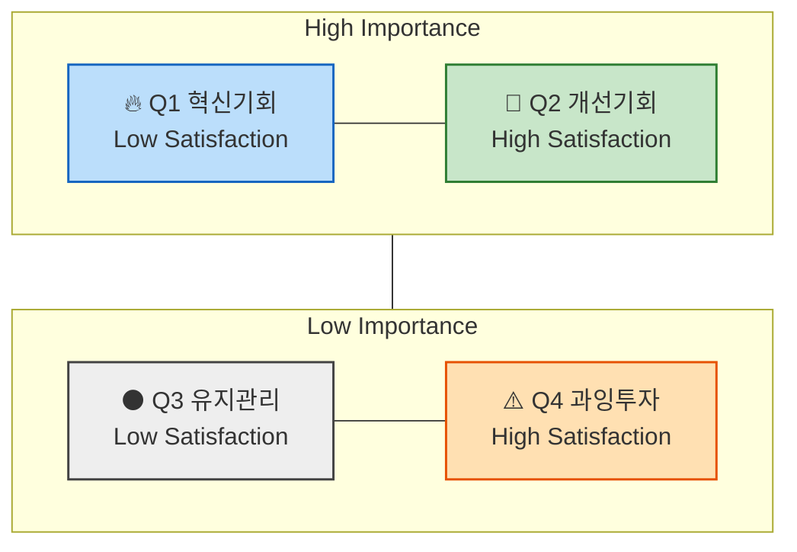

# 06 — 시장기회 분석 방법론 : 기회점수(OS) 기반 우선순위 판단

> 본 문서는 06 챕터에서 진행할 **시장기회 분석**의 **기준 프레임**입니다.
> 개별 분석 결과는 이 방법론을 그대로 적용해 별도 문서로 작성합니다.

**선행 문서** — 이 분석은 앞 챕터의 산출물을 **재료로** 씁니다.

| 문서 | 여기서 가져오는 것 |
|---|---|
| `05-personas/persona-02-spectrum.md` | 페르소나별 주요 Pain·Goal |
| `05-personas/customer-journey-map.md` | 여정 단계별 Pain Point · 개선 기회 |

---

## 1️⃣ `기회점수(OS, Opportunity Score)`란? & `조정형 기회점수(AOS, Adjusted Opportunity Score)`란?

> **전통적 `기회점수` OS**의 수식에서는 고객의 불만족 수준 계산에 고객의 기대치(`중요도`)와 만족도 지표를 직접 사용합니다.
> 하지만 이 경우 고객이 문제(Pain, Goal, Job)에 대해 가지고 있는 기대치(`중요도`)가 **두 번 반영**됩니다.
>
> - 아래와 같이 `Importance`가 두 번 반영되면, **실제 시장감각을 왜곡**하는 문제가 발생하게 됩니다.
>
>     ```markdown
>     OS = Importance(기대치) + (Importance(기대치) - Satisfaction(만족도))(불만족도)
>        = Importance × 2 - Satisfaction(만족도)
>     ```
>
> **조정형 `기회점수` AOS**는 그러한 수식을 개선하여,
> 고객의 불만족 수준을 고객의 기대치 및 중요도와 관계 없는 방법을 사용해 **`비율 계산 형태`(`1 − Satisfaction / 5`)** 로 도출한 뒤,
> 거기에 `Importance`를 곱하여 **현실적 혁신기회 강도**를 산출합니다.
>
> - 아래의 변경된 수식을 사용하면 실제 시장감각에 더 가까운 계산이 가능합니다.
>
>     ```markdown
>     AOS = Importance × (1 - Satisfaction(rate) / 5)
>     ```

---

### 💡 AOS(Adjusted Opportunity Score)의 정의

| 항목 | 설명 |
| --- | --- |
| **Importance** | 고객에게 Pain/Goal이 얼마나 중요한가 (1~5점) |
| **Satisfaction** | 현재 이 Pain이 얼마나 잘 해결되고 있는가 (1~5점) |
| **1 − Satisfaction/5** | 충족되지 않은 영역(Unmet Need)의 비율 |
| **AOS** | *"중요하지만 덜 해결된 문제"*의 강도 |

### 📊 점수 해석 예시

| Pain / Goal | Importance | Satisfaction | 1 − Satisfaction<br/>(rate) | AOS | 해석 |
| --- | :-: | :-: | :-: | --- | --- |
| 리포트 자동화의 한계 | 5 | 2 (40%) | 0.6 | 5 × (1−0.4) = **3.0** | 명확한 혁신 기회 |
| AI 학습 피로감 | 3 | 2 (40%) | 0.6 | 3 × (1−0.4) = **1.8** | 부분적 개선 기회 |
| 데이터 공유 비효율 | 4 | 3 (60%) | 0.4 | 4 × (1−0.6) = **1.6** | 유지관리 대상 |
| 신뢰 부족 | 2 | 4 (80%) | 0.2 | 2 × (1−0.8) = **0.4** | 저기회 영역 |

---

### 📈 AOS 시각화 구조



- **사분면 형태로 시각화**

    `X축`: Satisfaction (충족도) · `Y축`: Importance (중요도)

- **사분면 해석 방법**

    | 사분면 | 조건 | 의미 | 전략 행동 |
    | --- | --- | --- | --- |
    | **Q1** | High AOS | 혁신기회 (High Importance + Low Satisfaction) | JTBD 인터뷰 대상, MVP 실험 우선 |
    | **Q2** | 중간 AOS | 개선기회 | 지속적 개선 필요 |
    | **Q3** | Low AOS | 유지/보완 | UX·마케팅 최적화 중심 |
    | **Q4** | 0 근처 | 과잉투자 위험 | 자원 분배 재검토 |

---

## [참고] 매트릭스에서 사분면 상하 좌우를 가르는 수치 기준점은 어디인가?

### 💡 A. 점수 척도 기반 단순 **기준점 수립** (최초 분석/설계를 위한 분석)

가장 단순하고 직관적인 방식.
Likert 5점 척도(1~5)를 그대로 쓰고, 중간값 **3.0**을 중심선으로 삼습니다.

| 축 | 기준점 | 의미 |
| --- | :-: | --- |
| Satisfaction | **3.0** | 이 이상은 "대체로 만족" |
| Importance | **3.0** | 이 이상은 "대체로 중요" |
| AOS | **2.0~2.5** | 중요도·불만족의 평균 이상 |

📘 **활용법**

- 문제의식 및 솔루션의 유형에 따라 기준을 조정해도 괜찮음
- 예: *"Importance가 4 이상인 Pain만 상단으로 올리자."*
- **목표는 구조적 사고 훈련** → 문제 해결을 구조화하는 데에 초점

### 💡 B. 기존 사업에서의 **데이터 분포에 따라 수립**

이미 사업 운영 중에 있고 여러 차례 도출된 점수 분포가 존재하는 경우, **평균값과 표준편차**를 이용해 사분면을 **데이터 기반으로 자동 구분**할 수 있습니다.

| 항목 | 계산 | 해석 |
| --- | --- | --- |
| Importance 기준선 | 전체 Importance 평균(μ₁) | 평균 이상 → 상단 |
| Satisfaction 기준선 | 전체 Satisfaction 평균(μ₂) | 평균 이하 → 좌측 |
| AOS 기준선 | 전체 AOS 평균 + 0.5σ | 이 값 이상 → "기회 영역" |

- 예시

    ```
    Importance 평균  = 3.6
    Satisfaction 평균 = 2.9
    AOS 평균          = 2.1
    ```

    - Y축 기준(Importance): **3.6**
    - X축 기준(Satisfaction): **2.9**
    - 버블 경계(AOS): **2.1**

📘 **해석 포인트**

*"우리 사업의 실제 평가 분포"*에 맞게 사분면이 형성되므로 **페르소나나 산업별 편향을 줄일 수 있습니다.**

> ### 📌 본 프로젝트에서 실제로 채택한 기준 — **각 지표의 중앙값**
>
> `06-2 AOS 채점 결과`는 A(고정 3.0)도 B(평균±σ)도 아닌 **중앙값**을 경계로 썼습니다.
>
> **A를 쓸 수 없었던 이유** — 대표 Pain을 인물당 3건씩만 골라낸 탓에 **Importance 최솟값이 3점**이라, 3.0을 기준선으로 두면 **42건 전부가 상단**에 몰려 사분면이 성립하지 않습니다.
> **B를 쓸 수 없었던 이유** — 아직 운영 데이터가 없어 **반복 측정된 분포가 존재하지 않습니다.**
>
> 중앙값은 **분포가 한쪽으로 치우쳐도 항상 절반씩 갈라주므로**, 이번처럼 표본이 편중된 1회성 설계 단계에 적합합니다. 다만 **경계선 값(중앙값 그 자체)을 어느 쪽에 넣느냐**를 반드시 명시해야 합니다.

---

## 2️⃣ 평가 대상 정의 — 무엇을 (재료로) 점수화하는가?

- **`우리가 설계한 솔루션`**에 대한 **페르소나 스펙트럼과 고객 여정 지도**에 대하여
- **`기존 솔루션 생태계`** 하에서 **고객이 겪고 있는 Pain/Job 상황**을 평가합니다.

| 분석 단계 | 평가 단위 = `고객 타겟` | 평가 대상 = `Pain 정의 내용` |
| --- | --- | --- |
| **페르소나 단계** | 각 페르소나의 주요 Pain·Goal | *"이 사람에게 가장 중요한 고통은 무엇인가?"* |
| **고객 여정 지도** | 여정 단계별 Pain Point / 개선기회 | *"고객 여정 중 어디서 좌절이 가장 큰가?"* |
| ~~*JTBD 인터뷰 사전 단계*~~ | ~~*Job Statement 단위*~~ | ~~*"이 고객이 진보를 이루기 위해 수행하는 일(Job)은 무엇인가?"*~~ |

> ### ✅ 앞선 분석 결과 중 무엇을 사용하는가?
>
> - 페르소나가 도출되기 전, **"`문제정의`"**, **"`Segment`"** 단계의 Pain List를 사용하면 어떻게 될까요?
> - 페르소나 Spectrum **4가지 중 어떤 페르소나**가 가진 Pain List를 사용해야 할까요?
>
> *(두 질문은 분석 착수 전에 답을 정해두어야 하는 열린 질문입니다.)*

> *분석 & 기획 단계에서는 최대한 많은 **"유효한"** 문제들에 시장기회 점수를 매겨서 **내림차순으로 정렬**해 봅니다.*

---

## 3️⃣ 채점 워크플로우

> ② Importance 평가 → ③ Satisfaction 평가 → ④ AOS 계산 → ⑤ Matrix 시각화
> **본 절의 실행 결과는 `기회점수-분석-종합.md` Ⅱ부에 있습니다.** (절 번호는 원 자료의 구성을 따릅니다)

---

## 4️⃣ AOS에서 시장 가중형 점수 DOS로 확장하기 — VC들이 실제로 사용하는 시장가중형 분석

> AOS는 **고객 한 명의 중요도**를 반영한 지표라면,
> DOS는 **시장 규모와 맥락을 곱해 '발견된 기회(Discovered Opportunity Score)'를 산출**합니다.
>
> *→ **기회 점수 = 고객 미충족 × 시장 파급력** 으로 계산. (실제 VC, PM들이 쓰는 구조와 유사)*

### 🧠 AOS vs. DOS 비교

| 구분 | AOS | DOS |
| --- | --- | --- |
| **계산 기준** | 고객 체감 중심 | 시장가중 중심 |
| **데이터 출처** | 페르소나, 인터뷰 | TAM/SAM, 산업 리서치 |
| **목적** | 혁신 아이디어 탐색 | 시장 확장성 검증 |
| **적용 시점** | 리서치 초기 | 비즈니스 모델 검증 |
| **AI 활용** | 중요도·만족도 평가 | 시장 규모 가중치 계산 |

### 💡 DOS(Discovered Opportunity Simulation)의 개념

> *"고객의 미충족 × 시장 가치"*의 교차점 = **진짜 기회 영역**
>
> ```markdown
> DOS = (Importance - Satisfaction) × Market Relevance
> ```
>
> → **Market Relevance 수치는 시장 파급력.**
> `TAM-SAM-SOM(%)`\* 을 사용하거나, **시장 성장률 · 채택 난이도 · 확산성** 등을 추가로 고려해 평가합니다.
> \* *TAM-SAM-SOM 에 대해 해당 Pain이 갖는 상대적 비중*
>
> ***⇒ 지금까지 수행한 시장분석 자료를 AI에 투입하면 "기회 강도 × 시장 확산성"을 손쉽고 정확하게 도출 가능!***

### DOS 계산식 적용 예시

| Pain | Importance | Satisfaction | TAM-SAM-SOM(%)\* | DOS |
| --- | :-: | :-: | :-: | --- |
| 자동화 한계 | 5 | 2 | 0.8 | (5−2) × 0.8 = **2.4** |
| AI 학습 피로 | 3 | 2 | 0.6 | (3−2) × 0.6 = **0.6** |
| 신뢰 부족 | 2 | 4 | 0.7 | (2−4) × 0.7 = **−1.4** |

\* ***TAM-SAM-SOM 중 적정 모수에 대한 해당 Pain/Goal 의 비중***

### 📎 Market Relevance는 어디서 가져오는가 — 본 프로젝트 기준

| 필요한 값 | 가져올 문서 |
|---|---|
| TAM · SAM · 접근 가능 SAM · SOM | `04-tam-sam-som/시장분석 종합보고서 (TAM-SAM-SOM).md` |
| 세그먼트별 도달 가능 인원 · 금액 | 동일 문서 §6 Market Segment Map |
| Pain을 겪는 인물과 그 인물의 세그먼트 | `06-opportunity-score/기회점수-분석-종합.md` |
