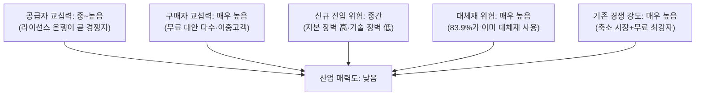

# Five-Forces — 국내 에듀테크(어린이 용돈·금융교육) 서비스 사업기획서

> **문서 성격** 사업 설계 극초반 단계의 기획서다. 서비스 유형·수익모델·타깃 세그먼트 등 핵심 의사결정 대부분이 아직 열려 있는 상태를 전제로 하며, 각 항목은 확정안이 아니라 후속 분석에서 비교·선택할 **후보 목록**이다.
>
> 🔄 **후속 확정** 이 문서가 열어 둔 선택지는 이후 확정됐다 — 타깃 세그먼트 **① 성장증명형**, 수익모델 **부모·아이 무료 + 결제 수수료·금융사 제휴**(월 구독 없음), 결제 인프라 **선불업자 제휴(B안)**. 아래 후보 목록은 그 선택의 **근거**로 읽고, 확정 사양은 [9. PRD](<9. PRD_핀프렌즈_v0_2.md>)에서 확인한다.
---

## PART 0. Business One-Pager

| 항목 | 내용 |
|---|---|
| **사업 영역** | 국내 초등 저학년(1~3학년) 대상, 용돈 관리와 금융 학습을 결합한 디지털 서비스 |
| **핵심 문제** | 부모가 원하는 금융교육(1순위: 저축 습관)과 아이의 실제 금융행동(저축은 최하위 항목) 사이에 큰 격차가 있고, 어느 국내 사업자도 "학습이 행동으로 이어졌다"는 증거를 제공하지 못한다 |
| **산업 매력도 (5 Forces 결론)** | **낮음.** 5개 힘 중 4개(경쟁강도·구매자힘·대체재위협·공급자힘)가 강하고, 1개(신규진입위협)만 중간이다 — 가격 경쟁으로는 이길 수 없는 산업 구조 |
| **목표 시장 규모** | 글로벌 SAM(게임화형) 약 5,700억원 / 국내 실제 화폐화 규모 10억~30억원 — 시장은 작고 초기 단계 |
| **핵심 타깃 (후보)** | 초등 저학년 자녀에게 정기적으로 용돈을 주며 금융교육에 관여 중인 부모. 세부 세그먼트 4개 후보 열려 있음 (PART 3) |
| **서비스 유형 (후보)** | 6개 후보 — 어느 것을 택하든 5 Forces가 지목한 약점(공급자=경쟁자, 대체재 범람)을 정면으로 다뤄야 함 (PART 5) |
| **수익모델 (후보)** | 7개 후보 — 실증 데이터상 구독 단독보다 결제수수료·제휴 결합형이 유리 (PART 6) |
| **핵심 리스크** | ① 은행 자본의 무료 경쟁(5 Forces 공급자·경쟁강도의 근본 원인) ② 저출생 모집단 축소 ③ 아동 대상 규제 ④ 차별화 지점(학습→행동 전이 증명) 자체가 미검증 |
| **문서 상태** | 🔵 가설 단계. 고객 인터뷰 0건, 정량 검증 0건. 모든 시장 수치는 2차 자료 기반 추정치다 |

---

## PART 1. 사업 배경 및 문제 정의

**결론: 지출 여력과 결제 인프라는 이미 갖춰진 시장이지만, "학습이 행동으로 이어졌다"는 증거를 주는 사업자가 하나도 없다 — 이것이 유일하게 확인된 공백이다.**

- 국내 초등 사교육비는 13.2조원(학교급 중 최대, 참여율 87.7%)으로, 부모가 자녀 교육에 지출할 의사와 여력은 이미 검증된 조건이다.
- 용돈을 충전식 카드로 지급하는 가정이 64.2%에 달해, 사업 과제는 "새 결제 수단의 도입"이 아니라 "기존 결제 위에 교육·성장 레이어를 얹는 것"에 가깝다.
- 국내 기존 서비스(퍼핀·아이쿠카·아이부자) 전부에서 "학습했다"와 "성장했다" 사이 구간이 공개 자료상 비어 있다. 특정 사업자의 결함이 아니라 시장 공통의 공백이다.
- 금융교육 개입은 지식 수준(+0.33 SD)은 유의하게 높이지만 행동 변화(+0.07 SD) 효과는 작다는 것이 국제 메타분석에서 반복 확인된다. "가르치는 것"과 "행동을 바꾸는 것"은 다른 문제이며, 이 간극을 좁히는 설계가 사업의 핵심 자산 후보다.

> **[열린 질문]** 문제를 "학습→행동 전이 증명"으로 좁힐지, "부모의 확인 부담 경감" 또는 "아이의 자기주도 저축 습관 형성"으로 재정의할지는 세그먼트 선택(PART 3)에 따라 달라진다.

---

## PART 2. 시장 기회

**결론: 글로벌·이론적 상한은 크지만, 국내 실제 화폐화 규모는 10억~30억원에 불과한 초기 시장이며, 모집단 자체가 매년 줄어드는 축소 국면이다.**

### 2-1. 시장 규모 (단계별)

| 단계 | 정의 | 규모 |
|---|---|---|
| TAM | 글로벌 키즈 금융 플랫폼, 6~12세 세그먼트 | 약 2.6조원 (2025) |
| SAM | 위 중 게임 요소를 핵심 UX로 쓰는 디지털 솔루션(글로벌) | 약 5,700억원 |
| SAM (국내, 현재 화폐화) | 국내 게임화형 서비스 실제 결제·구독 매출 합계 | 약 10억~30억원 |
| SAM (국내, 이론적 천장) | 초등 저학년 전원 유료 구독 가정 | 약 785억원 (무료 경쟁자 미반영 상한) |

### 2-2. 국내외 벤치마크

| 사업자 | 유형 | 규모 지표 | 수익 구조 |
|---|---|---|---|
| Greenlight (미국) | 스타트업 | 매출 약 3,200억원, 650만명 | 구독 |
| GoHenry (영국) | 스타트업 | 활성 아동 약 65만명 | 구독 |
| 퍼핀 (국내) | 스타트업 | 가입 26만, 충전 484억원 | 구독+결제수수료+금융제휴 |
| 아이쿠카 (국내) | 스타트업 | 가입 36~50만 | 무료+멤버십 게이팅 |
| **아이부자** | **은행(하나은행)** | **78만명** | **완전 무료** |
| 카카오뱅크 mini | 은행 계열 | 275만명, 결제 7.6조원 | 무료 |
| 토스 유스카드 | 핀테크 | 320만장 | 무료 |

해외 2곳은 유료 구독 단일 모델로 유의미한 매출을 내지만, 이는 외부 교육 표준 매핑 등 신뢰 자산을 전제로 한다. 국내는 은행 자본의 무료 서비스가 이미 시장을 장악하고 있어 동일 모델이 통할지 검증되지 않았다.

### 2-3. 구조적 리스크 — 모집단 축소

국내 초1 학생 수는 매년 5~12%씩 줄어 5년 뒤 현재의 약 74% 수준이 된다. **이 산업은 성장 정체가 아니라 축소 국면의 모집단을 다룬다.** 장기 성장은 ① ARPU 상승 ② 연령 확장 ③ 해외 진출 ④ 인접 카테고리(사교육) 흡수 중 하나 또는 조합으로만 가능하며, 선택은 아직 열려 있다.

---

## PART 3. 목표 고객 — 세그먼트 후보

**결론: 이 산업은 결제자(부모)와 사용자(아이)가 분리된 이중 고객 구조라 락인이 구조적으로 약하고, 타깃 세그먼트는 4개 후보 중 아직 선택되지 않았다.**

- 부모는 무료 대안이 상존하는 한 아이의 애착 여부와 무관하게 언제든 이탈시킬 수 있다.

| 세그먼트 | 특징 | 추정 규모 | 핵심 니즈(가설) |
|---|---|---|---|
| **① 성장증명형** | 관여 높음·문제 있음 | 약 29.3만명 (35.8%) | "돈은 버는데 정말 성장하고 있는지 확인하고 싶다" |
| **② 습관관리형** | 관여 높음·문제 없음 | 약 27.0만명 (33.0%) | "스스로 관리하는 습관을 만들어주고 싶다" |
| **③ 소비통제형** | 관여 낮음·문제 있음 | 약 13.3만명 (16.3%) | "충동구매가 걱정되지만 교육까지는 생각 안 해봤다" |
| **④ 잠재관심형** | 관여 낮음·문제 없음 | 약 12.2만명 (14.9%) | "언젠가는 해야 하는데 방법을 모른다" |

> **[열린 질문]** 전환 경로 길이(①이 최단)·획득비용(④가 최고)·경쟁 밀도(①·②는 이미 밀집)를 종합해 단일 세그먼트 집중과 순차 공략 중 후속 단계에서 선택해야 한다.

---

## PART 4. 산업 구조 분석 — 포터의 5가지 힘

**결론: 5가지 힘 중 4개가 산업 매력도를 낮추는 방향으로 작용한다. 이 산업은 구조적으로 수익성이 낮고, 가격 경쟁으로는 이길 수 없다.**

> 아래 분석은 `business-research/01-five-forces/methodology.md`가 제시한 각 힘의 하위 판단 기준(괄호 안)을 그대로 적용한 것이다.

### 4-1. 기존 경쟁자 간 경쟁 강도 — 🔴 매우 높음

**(판단 기준: 가격·광고·신제품 경쟁의 정도 / 성장 정체 여부 / 경쟁자 수)**

- **성장 정체를 넘어 축소**: 핵심 모집단(초1)이 매년 5~12% 줄어든다. 방법론이 말하는 "성장 정체기에 경쟁이 심해진다"는 조건보다 더 나쁜 상태다.
- **경쟁자 수**: 국내에만 퍼핀·아이쿠카·아이부자·케이뱅크 머니미션 등 4개 이상이 밀집해 있고, 2025년에도 케이뱅크가 신규 진입했다 — 좁아지는 파이에 참가자는 계속 늘어난다.
- **가격 경쟁의 봉쇄**: 최대 경�쟁자(아이부자)가 이미 가격을 0원으로 만들어놔서, 방법론이 말하는 "가격 인하" 경쟁 자체가 봉쇄돼 있다. 그 결과 경쟁은 **기능 모방**으로 이동한다 — 국내 3사 모두 "학습→성장" 구간이 비어 있다는 것은, 누군가 채우는 순간 즉시 카피 대상이 된다는 뜻이기도 하다.

### 4-2. 구매자(부모) 교섭력 — 🔴 매우 높음

**(판단 기준: 소수의 큰손 여부 / 제품의 표준화 정도 / 구매자의 전환 비용)**

- **표준화**: 국내 사업자 전부 기능이 비슷비슷하다("학습→성장" 공백 공통) — 방법론이 말하는 "제품이 너무 흔해서 다른 곳에서 쉽게 사 올 수 있다"는 조건과 일치한다.
- **전환 비용**: 서비스 대부분 무료이거나 저가이며, 전환 마찰은 카드 재발급 정도로 낮다.
- **이중 고객 구조가 힘을 한 번 더 키운다**: 결제자(부모)와 실사용자(아이)가 분리돼 있어, 아이의 애착과 무관하게 부모가 언제든 이동할 수 있다. 일반적인 "소수의 큰손"형 구매자 힘이 아니라, **개별 구매자 각각이 쉽게 이탈할 수 있다는 형태**로 힘이 발현된다.

### 4-3. 신규 진입자의 위협 — 🟡 중간

**(판단 기준: 규모의 경제 / 기술적 우위·특허 / 채널 확보)**

- **규모의 경제 장벽 — 높음**: 은행 계열(하나·카카오·케이뱅크)이 예대마진·기존 인프라를 바탕으로 손실을 감내하며 무료 제공 중이다. 신규 스타트업은 이 단가를 따라갈 수 없다.
- **채널 확보 장벽 — 높음**: 이미 275만~320만 규모의 사용자 채널을 보유한 사업자들과 경쟁해야 한다.
- **기술적 우위·특허 장벽 — 낮음**: 역설적으로 이 산업의 핵심 차별화 후보("학습→행동 전이 증명")는 **아직 어느 사업자도 확립하지 못한 기술**이다. 특허·독점 기술이 없다는 것은 장벽이 낮다는 뜻이자, 신규 진입자에게도 선점 기회가 열려 있다는 뜻이다.
- **규제 장벽 — 우회 가능**: 선불업 직접 등록(자본금 20억원)은 높은 장벽이지만, 은행 제휴 구조(B2B2C)로 우회한 선례(퍼핀·아이쿠카)가 이미 있다.
- **종합**: 자본·채널 장벽은 높으나 기술 장벽은 낮고 규제는 우회 가능해, 방법론상 "진입 장벽이 높다"고 단순화할 수 없는 **혼합형 중간 강도**로 판단한다.

### 4-4. 대체재의 위협 — 🔴 매우 높음

**(판단 기준: 완전히 다른 종류의 제품·서비스가 같은 욕구를 채우는가 / 대체재로의 전환 비용)**

- **같은 욕구, 다른 해법**: "아이에게 용돈을 주고 관리하고 싶다"는 욕구는 게임화 요소 없이도 채워진다. 국내 자녀 계정의 83.9%가 이미 카카오뱅크 mini·토스 유스카드 같은 순수 계좌·카드형 서비스를 쓰고 있고, 48.9%는 아예 현금으로 용돈을 준다.
- **전환 비용이 사실상 0**: 대체재로 가는 데 필요한 것은 이미 다수가 실행 중인 선택이라, 방법론이 말하는 "전환 비용이 낮으면 대체재 위협이 커진다"는 조건이 그대로 적용된다.
- **[해석]** 게임화·교육 기능은 "있으면 좋은 것"이지 필수재가 아니라는 뜻이며, 이는 대체재 위협을 산업 전체에서 가장 강한 힘 중 하나로 만든다.

### 4-5. 공급자 교섭력 — 🟡 중간~높음

**(판단 기준: 공급 원가 비중 / 대체 어려움과 전환 비용 / 공급자의 전방통합 위협)**

- **원가 비중**: 이 산업의 핵심 "원재료"는 결제·계좌 인프라다. 선불전자지급수단을 자체 발행하려면 자본금 20억원 이상이 필요해, 대부분의 사업자가 은행·카드사 제휴에 원가 구조를 의존한다.
- **대체 어려움**: 라이선스를 보유한 은행 수 자체가 제한적이라 대체 공급자 풀이 좁다.
- **전방통합 위협 — 이미 현실화됨**: 방법론이 경고하는 "공급자가 우리를 건너뛰고 고객에게 직접 팔 수 있다"는 위협이 이 산업에서는 가정이 아니라 **이미 벌어진 일**이다. 하나은행·카카오뱅크가 공급자(라이선스 보유자)이면서 동시에 최대 경쟁자로 시장에 참전해 있다.

### 4-6. 종합

| 힘 | 강도 |
|---|---|
| 기존 경쟁 강도 | 🔴 매우 높음 |
| 구매자 교섭력 | 🔴 매우 높음 |
| 대체재 위협 | 🔴 매우 높음 |
| 신규 진입 위협 | 🟡 중간 |
| 공급자 교섭력 | 🟡 중간~높음 |

**[전략적 함의]** 가격 경쟁으로는 이 산업에서 이길 수 없다. 독립 사업자가 승부할 수 있는 지점은 은행이 구조적으로 만들기 어려운 가치(학습-행동 연계 증명, 서드파티적 객관성, 특화된 UX) — 즉 §4-3에서 확인한 **유일하게 장벽이 낮은 지점(기술적 차별화)**에 한정된다. 이는 PART 5·6의 서비스 유형·수익모델 선택과 직결된다.

---

## PART 5. 서비스 유형 후보

**결론: 6개 후보 모두 PART 4의 5 Forces 문제를 정면으로 풀어야 하며, 그중 은행이 구조적으로 따라 하기 어려운 유형(D)이 이론상 가장 방어력이 크다.**

| 유형 | 개념 | 실제 사례 | 5 Forces 대응 | 리스크 |
|---|---|---|---|---|
| **A. 게임화 학습형** | 퀴즈·미션·레벨이 제품 중심 | 퍼핀, 아이쿠카 | 대체재 위협에 취약 — 은행 무료 대안과 기능이 유사해 보이기 쉬움 | 차별화 약함 |
| **B. 은행 부가서비스형** | 은행이 직접 운영 | 아이부자, 카카오뱅크 mini | 경쟁강도·공급자 문제의 원인 그 자체 | 독립 스타트업은 진입 불가, 제휴 대상으로만 접근 가능 |
| **C. 커리큘럼 라이선스형** | 외부 교육 표준 매핑 콘텐츠가 상품 | Greenlight, gohenry | 구매자 교섭력(표준화 문제) 완화 — 제3자 신뢰로 차별화 | 국내 표준기관 협력 필요 |
| **D. 소비-학습 연계 분석형** | 실제 카드 소비 데이터+학습 콘텐츠 결합 | 명시적 사례 없음(공백) | **공급자=경쟁자 문제를 우회하는 유일한 후보** — 데이터 자산은 은행이 쉽게 못 베낌 | 기술 난이도·개인정보 리스크 |
| **E. B2B2G 학교연계형** | 학교·교육청 대상 공급 | 국내 미확인 | 대체재 위협권 밖의 별도 시장 진입 | 긴 조달 영업주기 |
| **F. 데이터 플랫폼형** | 아동 금융행동 데이터의 후속 상품화 | 미확인(장기 옵션) | 강력한 진입장벽(모트) 형성 가능 | 규제·윤리 리스크 매우 큼 |

---

## PART 6. 수익모델(BM) 후보

**결론: 국내 실증 데이터는 구독 단독 모델의 리스크를 명확히 보여준다 — 결제수수료·제휴가 결합된 하이브리드가 현재까지 가장 근거가 강한 방향이다.**

- 국내 게임화형 시장의 확인된 자금 흐름을 보면, 구독 매출(약 3.8억~9.2억원)보다 결제(카드) 수수료 매출(약 7.6억~20.3억원)이 약 2배 크다.
- 퍼핀 한 곳만 봐도 유료 구독 매출(약 3.8억원) 대비 카드 누적 충전액(484억원)이 127배다. **돈은 구독료가 아니라 결제·충전 흐름을 통해 움직인다.**

| BM 유형 | 개념 | 사례 | 시사점 |
|---|---|---|---|
| **① 구독(Freemium)** | 기본 무료+프리미엄 유료 | Greenlight, gohenry, 퍼핀 | 국내는 무료 경쟁자로 전환율이 낮음(퍼핀 1.54%) |
| **② 결제(카드) 수수료** | 결제·충전액 수수료 | 퍼핀, 아이부자 | 확인된 가장 큰 매출원, 단 요율 낮아 거래액 규모 필요 |
| **③ 금융상품 제휴 중개수수료** | 적금·투자상품 비교·추천 송객수수료 | 퍼핀-신한투자증권/국민은행 | "가입 중개"는 별도 인허가 이슈 — "비교·계산 정보 제공"으로 범위 한정이 일반적 |
| **④ B2B2C 기술·콘텐츠 라이선스** | 은행에 기술/콘텐츠 공급 | 제안 단계 | PART 4의 "공급자=경쟁자" 문제를 파트너십으로 전환 |
| **⑤ B2B2G 공급계약** | 학교·지자체 대상 | 미확인 | 대체재 압력이 없는 별도 시장 |
| **⑥ 브랜드 제휴·스폰서십** | 미션·콘텐츠에 브랜드 결합 | 퍼핀 일부 확인 | 아동 서비스 특성상 광고 거부감 관리 필요 |
| **⑦ 하이브리드** | 2개 이상 결합 | 퍼핀 | 근거상 가장 안전한 방향, 단 비중 설계는 미정 |

> **[열린 질문]** "구독만으로 시작"하는 안은 근거상 리스크가 크다는 것 외에, 정확한 조합·비중은 이 문서 범위 밖이다.

---

## PART 7. 핵심 가치제안 후보

**결론: 세그먼트별로 대응하는 가치제안 후보 5개가 있으며, 그중 "성장 증거"만이 국내 시장에서 아직 아무도 선점하지 않은 포지션이다.**

| 가치제안 후보 | 대응 세그먼트 | 근거 |
|---|---|---|
| **"우리 아이가 정말 성장하고 있는지 보여드립니다"** | ① 성장증명형 | 국내 3사 공통 공백 지점 |
| **"용돈을 스스로 관리하는 습관을 만들어줍니다"** | ② 습관관리형 | 부모 실제 교육 1·2순위와 대응 |
| **"충동구매를 금융 미션으로 바꿔줍니다"** | ③ 소비통제형 | 부모 41.2% 우려사항과 대응 |
| **"안심하고 지켜볼 수 있는 첫 용돈 관리"** | 관여도 낮은 세그먼트 전반 | 아이쿠카의 실제 포지셔닝 |
| **"제3자 교육 표준에 검증된 커리큘럼"** | 신뢰 민감군 | 해외 사업자 포지셔닝, 국내 공백 |

---

## PART 8. 규제·도메인 제약

**결론: 4개 규제가 서비스 구조의 최상위 분기점을 결정한다 — 특히 선불업 등록 여부가 사업 형태 자체를 가른다.**

| 제약 | 내용 | 설계 함의 |
|---|---|---|
| 선불전자지급수단 등록 | 자본금 20억원 이상, 가맹점 1개 초과 시 등록 필수 | 자체 라이선스 vs 은행 제휴가 최상위 분기점 |
| 마이데이터 | 만 14세 미만 가입 자체 불가 | 개인화 서비스는 자체 카드·수동 기록 방식 필요 |
| 개인정보보호법 아동특칙 | 법정대리인 동의·확인, 아동이 이해 가능한 언어 고지 의무 | 온보딩에 이중 동의·이중 고지 절차 필수 |
| AI API 이용 약관 | 일부 생성형 AI(예: Gemini)가 18세 미만 대상 서비스 사용 금지 | 자체 호스팅 등 대안 검토 필요 |

---

## PART 9. 리스크 및 열린 이슈

**결론: 5 Forces가 지목한 구조적 열세(은행 자본·모집단 축소)와, 아직 아무도 풀지 못한 차별화 지점(학습→행동 증명)이 이 사업의 양대 리스크다.**

### 9-1. 아직 결정하지 않은 것

| 이슈 | 선택지 |
|---|---|
| 라이선스 전략 | 자체 선불업 등록 vs 은행 제휴 |
| 1차 타깃 세그먼트 | 4개 후보 중 단일 vs 순차 공략 |
| 서비스 유형 | 6개 후보 중 단일/조합 |
| 수익모델 조합 | 7개 후보의 비중 설계 |
| 유료화 시점 | 완전 무료 출시 후 유료화 vs 초기 부분 유료 |
| 데이터 자산화 여부 | 소비-학습 데이터 상품화 여부·시점 |
| 확장 방향 | 연령 확장 / 해외 진출 / 인접 카테고리 흡수 우선순위 |

### 9-2. 구조적 리스크

- **은행 자본과의 정면 경쟁**(5 Forces §4-1·§4-5): 최대 경쟁자가 손실을 감내할 수 있는 대기업이며 동시에 공급자다.
- **모집단 축소**(5 Forces §4-1): 저출생으로 핵심 타깃 자체가 매년 준다.
- **대체재 범람**(5 Forces §4-4): 시장의 83.9%가 이미 게임화 없는 대체재를 쓰고 있다.
- **미검증 차별화 지점**: "학습→행동 전이 증명"은 유일하게 장벽이 낮은 지점(§4-3)이지만, 동시에 어느 사업자도 구현·측정 방법을 증명한 바 없는 미지의 영역이다.

---

## PART 10. 다음 단계 제안

1. **핵심 가설 검증**: 부모의 학습-행동 전이 증거에 대한 지불 의사를 정성 인터뷰(최소 8가정)로 확인한다.
2. **라이선스 전략 결정**: 자체 선불업 등록과 은행 제휴 구조의 비용을 비교하는 재무·법률 분석을 진행한다.
3. **세그먼트 우선순위 확정**: 4개 후보의 획득비용·전환 가능성·경쟁 밀도를 정량 비교한다.
4. **수익모델 시뮬레이션**: BM 후보별 1~3년 재무 시나리오로 하이브리드 최적 비중을 도출한다.
5. **경쟁사 실사용 검증**: 아이쿠카·아이부자 앱을 직접 설치해 학습-성장 구간의 실제 유무를 확인한다.

---

## [출처]

### 적용 방법론

- `business-research/01-five-forces/methodology.md` — 포터의 5가지 힘 분석 틀 (PART 4 전체에 적용)

### 팀 내부 자료

| 자료 | 활용 내용 |
|---|---|
| `../혜원/서비스분석/포터의5가지힘_분석.md` | PART 4 산업구조 분석의 1차 원자료 |
| `../혜원/서비스분석/경쟁사비교_아이쿠카_골스텝.md` | PART 2·5의 국내 경쟁사 사례 |
| `../혜원/고객분석/페인포인트_근거보강.md`, `../혜원/고객분석/고객여정지도.md` | PART 1 문제 정의 근거 |
| `../유림/시장분석/TAM-SAM-SOM_시장세분화.md` | PART 2 시장 규모·PART 3 세그먼트 수치 |
| `../병윤/03_법령조사/법령조사_결과.md` | PART 8 규제 제약 |
| `../하영/05_유사서비스비교/README.md` | PART 5 서비스 유형 비교 근거 |

> **주의**: 본문에 인용된 모든 수치는 2차 자료(공식 발표·언론 보도·민간 시장조사기관 추정) 기반이며, 팀 자체 실사용 검증이나 고객 인터뷰로 확인된 것이 아니다. 후속 분석 시 위 원본 문서의 등급 표기(사실/추론/가정)를 반드시 함께 확인할 것.
