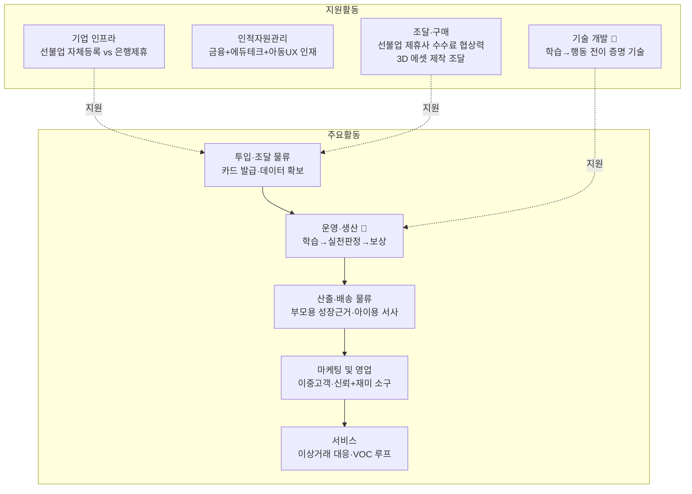

# 가치사슬

> **제품 기준** 기능정의 **v13** 확정 사양 — 선불업 B안(제휴) · 아바타 사전 제작 · 별 트리거 8종 · 부모·아이 무료
> 🔄 **사전 개입 수단 확정** — 📍 위치 알림(3분 체류)은 **삭제**됐고, 사전 개입은 **📝 소비 계획 카드**(가기 전에 어디서·업종·얼마를 적기)가 담당한다. **위치정보를 일절 수집하지 않는다** — [9. PRD](<9. PRD_핀프렌즈_v0_2.md>) §4-2. §1-2 · §2-3이 이 기준으로 서술돼 있다.

## 0. 분석 전제 — Five Forces에서 가져오는 3가지

| Five Forces 결론 | 이 문서에서 무엇을 봐야 하는가 |
|---|---|
| **공급자(은행)가 동시에 최대 경쟁자다** (전방통합 위협 현실화) | 투입·조달 물류(§1-1)·조달·구매(§2-4)·기업 인프라(§2-1) — 은행 의존 구조가 어디서 발생하는지 |
| **대체재(카카오뱅크mini 등)가 83.9%를 이미 장악** | 운영·생산(§1-2)·마케팅 및 영업(§1-4) — 게임화만으로는 안 되고 무엇을 더 해야 대체재와 달라 보이는지 |
| **유일하게 장벽이 낮은 차별화 지점은 "학습→행동 전이 증명" 기술** | 기술 개발(§2-3) — 이 지점을 실제로 채우는 활동이 무엇인지 |

> ⚠️ **2026-08-20 전제 갱신** — 위 첫 번째 항목은 **제휴 대상이 은행일 때** 성립한다. 기능정의 v13 §10이 **선불업자 제휴(B안)** 로 확정했으므로, 제휴 상대는 은행이 아닌 **결제 인프라 사업자**가 되고 **전방통합 위협은 낮아지는 대신 수수료 종속이 실질 리스크로 올라온다.** §1-1 · §2-1 · §2-4는 이 갱신을 반영해 서술했다.

이 세 가지가 아래 9개 활동 중 **투입·조달 물류 / 운영·생산 / 마케팅 및 영업 / 기업 인프라 / 기술 개발 / 조달·구매**에 분석 비중을 두는 이유다. 인적자원관리·산출물류·서비스는 상대적으로 간략히 다룬다.

---

## PART 1. 주요활동 (Primary Activities)

### 1-1. 투입·조달 물류 (Inbound Logistics) — 🔴 원가·리스크가 가장 크게 걸리는 활동

**결론: 핵심 투입자원(금융 데이터·결제 인프라)의 대부분을 은행 제휴로 조달해야 하며, 이는 Five Forces의 공급자 교섭력 문제를 그대로 발생시키는 근원 활동이다.**

- 🏗️ **핵심 투입자원**: 아이 명의 결제 수단(카드/계좌)과 그 위에서 발생하는 소비 데이터다. 만 14세 미만은 마이데이터 가입 자체가 불가능하므로, 표준화된 오픈뱅킹·마이데이터 연동이 아니라 **자체 카드 발급 + 수동/폐쇄형 데이터 수집** 구조로 설계해야 한다.
- 🏗️ **확보 방식 — B안 확정**: 선불전자지급수단을 자체 등록(자본금 20억원 이상)하거나, 이미 등록을 보유한 사업자의 인프라를 쓰는 두 갈래이며, **기능정의 v13 §10에서 후자(B안)로 확정**했다. 제휴 대상은 은행이 아니라 **선불업 등록을 보유한 결제 인프라 사업자**(코나아이 등)다.
- ⚠️ **퍼핀은 B안이 아니다**: 퍼핀은 **레몬트리가 직접 선불업 등록**하고 KB국민카드가 발행을 대행하는 **A안**이다(v13 §10). 퍼핀머니 이용약관 제2조 1호도 퍼핀머니를 "전자금융거래법에 명시한 선불전자지급수단"으로 스스로 명시한다. **퍼핀을 B안 선례로 인용할 수 없다.**
- 🚀 **개선 관점(퍼핀 관측)**: 퍼핀은 신한투자증권(주식거래)·국민은행(적금·청약) 제휴로 투입 자원을 넓혔고, 연간 충전·결제 흐름이 484억원 규모까지 성장했다. 다만 이 구조는 곧 §2-4(조달·구매)의 의존 리스크로 이어진다.
- **Five Forces 연결 — B안 확정으로 성격이 바뀐다**: 제휴 대상이 은행이면 "그 은행이 동일 기능을 무료로 직접 제공하는 경쟁자로 전환"될 위험을 함께 들여오지만, **선불업 인프라 사업자(코나아이 등)는 아동 금융 앱을 직접 운영하지 않으므로 전방통합 위협이 은행 제휴보다 낮다.** 대신 v13 §10이 지목한 **수수료 종속**이 실질 리스크로 대체된다 — 구독이 없어 결제 수수료가 주 수익원인데 그 몫을 제휴사와 나눠야 한다.

### 1-2. 운영·생산 (Operations) — 대체재와 구별되는 유일한 실행 지점

**결론: "학습→실천 판정→보상" 흐름이 게임화형 대체재(카카오뱅크mini 등)와 구별되는 유일한 운영 활동이며, 이 판정 로직의 설계 품질이 곧 제품력이다.**

- 🏗️ **핵심 처리 흐름**: 부모 가입 → **법정대리인 동의 + 동의 여부 확인** → 카드/계좌 연결 → 자녀 초대 → **🐣 아이 온보딩**(짧은 학습 → 퀴즈 → ⭐1 → 살 수 있는 아이템 제시) → 학습 → **실천 판정** → 보상 지급.
  - 🔴 **순서가 규제 요건이다**: 아이 온보딩은 첫 화면부터 개인정보 처리가 시작되므로 **법정대리인 동의가 완료된 뒤에만 진행**돼야 한다(병윤 P-22 · 개인정보 보호법 제22조의2 제1항).
  - 🔄 **「이중 고지」는 폐기됐다**: v13 §9에서 4칸 명칭을 **부모·아이 화면 동일**하게 통일했고, 「알기 쉬운 언어」 법정 의무는 **명칭이 아니라 한 줄 설명**이 담당한다(병윤 P-12).
- 🏗️ **실천 판정의 두 번째 축 — 소비 5단계 루프**(v13 §5): **소비 계획 카드 작성**(어디서·업종·얼마) → 소비 → 결제 내역과 계획 **업종별 대조** → 회고 → **계획을 지킨 경우에만 ⭐1**. 학습 콘텐츠 이수만 보는 것이 아니라 **소비의 사전(적는 순간)과 사후(돌아보는 순간)를 모두 판정 대상으로 삼는다**는 점이 이 활동의 핵심이다. 발동 조건이 **위치가 아니라 「미리 적었는가」** 이므로, 기기·알림 전제 없이 성립한다.
- ✅ **자동화 vs 수동 심사의 경계 — v13에서 확정됨**: 부모 승인이 지연되면 흐름 전체가 멈춘다는 것이 팀 여정지도에서 확인된 리스크였고, v13 §4의 **별 지급 트리거 8종**이 이 경계를 이미 그었다. **부모 승인이 필요한 것은 「④ 미션 성공 → 부모 승인」 1종뿐이고, 나머지 7종(온보딩·출석·퀴즈 정답·소비 계획 비교·위시리스트 달성·예적금·완주)은 자동 판정**이다. 즉 **병목이 8분의 1로 좁혀진 상태**이며, 이는 미결 과제가 아니라 확정된 설계 선택으로 서술할 수 있다.
- 🚀 **개선 관점(퍼핀 관측)**: 퍼핀은 오답에도 절반 보상을 지급하고 재시도를 허용하는 구조를 갖고 있는데, 이는 "학습 없이 보상만 받는 경로"를 열어둔 것으로 확인된다 — 방법론이 말하는 "자동화와 수동 심사의 경계"를 잘못 그은 사례로 참고할 수 있다.
- **Five Forces 연결**: 게임화 요소(퀴즈·미션·포인트)만으로는 카카오뱅크mini 같은 대체재와 기능적으로 구별되지 않는다. 이 활동에서 "행동 전이 판정"까지 실제로 구현해야만 대체재 위협을 벗어난다.

### 1-3. 산출·배송 물류 (Outbound Logistics)

**결론: 같은 원본 데이터를 부모에게는 「🌳 성장 나무 / 🌲 월간 숲」(성장 근거)으로, 아이에게는 「⭐ 별 누적 → 👕 옷 해금」(즉각 동기)으로 이원화해 전달하는 것 자체가 시장 공통 공백을 메우는 지점이다.**

- 🏗️ 부모에게는 "몇 문제 풀었는지"가 아니라 "행동이 어떻게 바뀌었는지"를 보여줘야 한다. 국내 3사(퍼핀·아이쿠카·아이부자) 전부 이 산출물이 활동량 요약 수준에 머물러 있다는 것이 확인된 공백이다.
- ⚠️ **단정 재확인 필요**: 퍼핀 퍼핀페이 약관 별첨1에 **「분석 서비스 — 또래 집단과 비교·분석」** 이 존재한다(병윤 F-10). 또래 비교는 단순 활동량 요약을 넘으므로, "3사 전부 활동량 요약 수준"이라는 단정은 **퍼핀에 대해서는 실제 화면 확인이 필요**하다. 1차 경쟁분석 오류 3건과 같은 뿌리다.
- 🏗️ 아이에게는 같은 데이터를 **「별을 몇 개 더 모으면 새 옷을 살 수 있다」** 로 번역해 전달한다. **아바타 자체는 성장 지표가 아니다** — 성장을 보여주는 나무·숲은 **부모 화면 전용**이고, 아이의 동기 장치는 **옷장 해금**이다(v13 §3 · §8). 7세에게 나무 4개 + 진도율 + 정답률은 정보 과부하라는 것이 이 분리의 근거다.
- 🏗️ 두 채널이 **같은 원본 데이터를 전혀 다른 형식으로 가공**한다는 점에서, 이 활동의 산출물 설계 자체가 제품 차별화 지점이다.

### 1-4. 마케팅 및 영업 (Marketing & Sales) — 이중 고객 구조를 그대로 반영해야 하는 활동

**결론: 결제자(부모)와 사용자(아이)가 분리된 구조 때문에, 이 산업의 마케팅은 "신뢰 소구(부모)"와 "재미 소구(아이)"를 별도로 설계해야 하고, 최대 경쟁자가 무료인 이상 유료 전환이 아니라 활성화·잔존을 목표로 삼아야 한다.**

- 🏗️ **핵심 고객**: 개인 고객(부모+아이) 중심이며, 은행·카드사는 고객이 아니라 §1-1의 공급자다.
- 🏗️ **핵심 이유**: "성장 증거"라는, 아직 국내에 아무도 제공하지 않는 가치가 부모를 끌어들이는 채널이다.
- ⬜ **미검증**: 부모가 실제로 이 가치를 원하는지는 확인되지 않았다. 리뷰 921건 중 "금융이 아니어서 문제"라고 한 부모가 **0명**이고, 유일한 관련 리뷰는 오히려 영단어를 요구했다(하영 리뷰분석). **부모 3~5명 인터뷰가 이 활동 전체의 전제**다.
- 🚀 **개선 관점**: 퍼핀 유료 전환율이 1.54%에 불과하다는 것은, 이 산업에서 "무료 체험 → 유료 전환"이라는 통상적 SaaS식 퍼널이 잘 작동하지 않는다는 신호다. 최대 경쟁자(아이부자)가 완전 무료인 이상, CAC 회수를 구독 전환이 아니라 **결제 수수료 + 금융사 제휴 2중 구조**에 걸어야 한다는 것이 [`Five-Forces_사업기획서.md`](../1. Porter's Five Forces 모델/Five-Forces_사업기획서.md)와 기능정의 v13 §10의 결론과 일치한다.
- **Five Forces 연결**: 구매자 교섭력이 강한 산업(전환비용 낮음)에서는 획득만큼 잔존(retention) 설계가 중요하다 — 마케팅 활동의 목표를 "가입"이 아니라 **"🌲 월간 숲 재방문"**(v13 §3-2)에 둬야 한다.

### 1-5. 서비스 (Service)

**결론: 아동 금융 특유의 사고(계정도용·이상거래·부모 승인 분쟁) 대응 체계와, 리뷰·VOC를 제품 개선으로 되돌리는 루프가 이 활동의 핵심이며, 팀이 이미 이 활동의 실제 사례를 보유하고 있다.**

- 🏗️ 결제 실패·이상거래 대응뿐 아니라, 이 산업 특유의 문제(부모-아이 간 승인 갈등, "왜 내 실천이 인정 안 됐냐")를 다루는 체계가 필요하다.
- 🚀 **개선 관점**: 팀이 진행한 퍼핀 리뷰 921건 전수분석 자체가 바로 이 "서비스" 활동의 산출물(VOC → 개선 기회 도출)에 해당한다. 리뷰에서 확인된 "보호자가 퀴즈를 풀 수 없다"는 불만은 서비스 활동이 아니라 §1-2(운영) 설계 미비가 드러난 사례로, 활동 간 경계가 실제로는 서로 얽혀 있음을 보여준다.

---

## PART 2. 지원활동 (Support Activities)

### 2-1. 기업 인프라 (Firm Infrastructure) — 사업 구조의 최상위 분기점

**결론: 선불업을 자체 등록할지 제휴할지가 이 산업 전체 조직 구조를 결정하는 최상위 의사결정이었고, v13 §10에서 「제휴사가 선불업자」(B안)로 확정됐다. 이 결정으로 자본금 20억원 요건과 선불충전금 100% 별도관리 의무가 우리 조직에서 빠지는 대신, 준법 책임의 상당 부분이 제휴사에 있게 되어 「우리가 통제할 수 없는 정책」이 생긴다.**

- ✅ **확정**: 선불업 등록과 **선불충전금 100% 별도관리**(신탁/예치/지급보증보험)는 **제휴사**가 수행하고, 핀프렌즈는 브랜드·앱·4칸 학습·실천 시스템을 담당한다(v13 §10). 자본금 20억원 요건이 우리에게 발생하지 않는다.
- ⚠️ **그 대가 — 정책 통제 불가**: 이용한도·업종 제한이 제휴사 정책에 종속된다(참고: 퍼핀은 14세 미만 50만원). 우리 준법 조직은 **등록 주체가 아니라 「제휴사 정책을 감시·검증하는 조직」** 으로 설계돼야 한다.
- 🏗️ 아동 대상 서비스 특유의 조직 요건: 법정대리인 동의 확인 절차, 아동 눈높이 고지 의무(법정 의무이나 퍼핀은 미이행 확인 — 차별화 지점)를 누가 설계·감사할지 정해야 한다.

### 2-2. 인적자원 관리 (Human Resource Management)

**결론: 금융 규제·에듀테크 콘텐츠·아동 UX 세 영역을 동시에 이해하는 인력 확보가 관건이나, 이번 분석에서 원가·차별화 비중이 상대적으로 낮아 간략히 다룬다.**

- 🏗️ 최종 책임자(실천 판정 로직, 아동 개인정보 처리)의 의사결정권 소재를 명확히 해야 한다 — 이는 §2-1과 맞물린다.

### 2-3. 기술 개발 (Technology Development) — 유일하게 장벽이 낮은 차별화 지점

**결론: Five Forces 분석이 지목한 "아직 아무도 기술적 우위를 확립하지 못한 지점"이 바로 이 활동이며, 여기에 자원을 집중하는 것이 은행 자본과 정면 경쟁하지 않는 유일한 길이다.**

- 🏗️ **핵심 경쟁력 후보**: "학습 콘텐츠 이수"와 "실제 소비·저축 데이터"를 연결해 행동 변화를 계량화하는 기술. 국내외 어느 사업자도 공개적으로 확립하지 못한 영역이다.
- 🏗️ **제약 ① 표준 데이터 API가 없다**: 만 14세 미만은 마이데이터 가입이 불가능하므로(병윤 F-01), 위 계량화 기술의 **입력 데이터를 표준 API로 받을 수 없다.** 자체 카드 결제내역 파이프라인을 직접 구축해야 하며, 이것이 이 활동의 난이도를 결정하는 1차 요인이다.
- 🏗️ **제약 ② 결제 내역과 계획을 자동으로 맞춰야 한다**: 🔄 **2026-08-21 개정** — 위치 알림(3분 체류)을 삭제하고 **소비 계획 카드**로 대체했다(PRD §4-2). 위치·온디바이스 판정 부담은 **사라졌고**, 대신 **카드 승인 데이터의 가맹점명·업종 코드를 계획 카드와 자동 매칭**하는 것이 새 난점이다(매칭 정확도 ≥ 90% 요구). 이는 **제휴 선불업자가 어떤 수준의 승인 데이터를 넘겨주는지에 종속**되므로 §2-4(조달)와 직결된다.
- ✅ **사라진 제약** — 위치정보 수집·온디바이스 지오펜싱·백그라운드 위치 권한이 **전부 불필요**해졌다. 규제 측면에서도 **P-19(만 14세 미만 개인위치정보)가 적용되지 않는다.**
- 🏗️ **제약 ③ 아바타는 기술이 아니라 콘텐츠 원가다**: 아바타는 **사전 제작 3D 동물 캐릭터 + 옷장** 방식으로 확정됐다(v13 §8). **생성형 AI를 사용하지 않으므로** 외부 AI API 약관·모델 호스팅·AI 공급자 조달 문제가 발생하지 않는다. 대신 **동물 종수 × 옷 벌수 = 3D 에셋 제작량**이 곧 개발 비용이자 「별을 모을 이유의 총량」이 되므로(v13 §14), 이 항목은 기술 개발이 아니라 **콘텐츠 조달(§2-4)** 성격으로 다뤄야 한다.
- 🏗️ 공통 플랫폼(카드 연동, 동의 관리, 알림)의 재사용률을 높여 서비스별 중복 개발을 줄이는 것이 개선 관점의 핵심 질문이다.

### 2-4. 조달·구매 (Procurement) — 공급자 교섭력 문제의 실무적 층위

**결론: §1-1에서 확인한 은행 의존 구조는 결국 이 활동에서 "협상력 확보"와 "대안 확보" 문제로 구체화된다.**

- 🏗️ 클라우드·본인인증·결제망·고객센터 솔루션 중 자체 개발과 외부 조달의 경계를 정해야 한다.
- 🏗️ **3D 에셋 조달**: 아바타·옷 에셋은 생성형 AI가 아니라 **제작 발주 또는 라이선스 구매** 대상이다(§2-3 제약 ③). 제작량이 확정되지 않아(v13 §14 미결) 이 항목의 원가를 아직 산정할 수 없다.
- 🏗️ **핵심 질문(Five Forces 직결)** — B안 확정으로 질문이 바뀐다: 「제휴사가 경쟁자로 전환될 때 대안이 있는가」보다 **「제휴사 수수료율에 대한 협상력이 있는가」** 가 실질 문제다. 구독 매출이 0원이므로 **결제 수수료가 사실상 유일한 수익원**인데 그 몫을 제휴사와 나눈다(v13 §10 B안 리스크).
- ⬜ **미확인**: 코나아이 등의 실제 **수수료율·최소 물량 조건이 검색 요약 수준**에서 확인되지 않았다(v13 §10). 초기 유저가 적으면 계약 자체가 성립하지 않을 수 있다는 것이 v13이 명시한 리스크다.
- 🚀 **개선 관점**: 퍼핀이 신한투자증권·국민은행 두 곳과 제휴한 것은 "특정 공급자에 대한 의존도 분산" 원칙과 일치하는 설계로 볼 수 있다. 단 퍼핀의 제휴는 **선불업 라이선스 조달이 아니라 금융상품 확장** 목적이다(퍼핀 자신은 직접 등록 — §1-1 참고).

---

## PART 3. 종합 — 가치사슬 구조도

| 활동 | 원가 비중 | 차별화 기여 | Five Forces 연결 |
|---|:-:|:-:|---|
| 투입·조달 물류 | 🔴 높음 | 낮음 | 공급자 교섭력의 근원 |
| **운영·생산** | 중간 | 🔴 **매우 높음** | 대체재 위협 방어 |
| 산출·배송 물류 | 낮음 | 🟡 높음 | 구매자 교섭력(표준화) 완화 |
| 마케팅 및 영업 | 🔴 높음 | 중간 | 구매자 교섭력(낮은 전환비용) 대응 |
| 서비스 | 중간 | 낮음 | 대체재로의 이탈 방지 |
| 기업 인프라 | 🔴 높음 | 낮음 | 신규 진입 장벽 그 자체 |
| **기술 개발** | 중간 | 🔴 **매우 높음** | 유일하게 장벽 낮은 차별화 지점 |
| 조달·구매 | 중간 | 낮음 | 공급자 교섭력의 실무 층위 |

> ⚠️ **기술 개발 원가는 재산정 대기 중** — 생성형 AI 자체 호스팅(GPU) 비용이 설계 변경으로 사라진 대신 **3D 에셋 제작 원가**가 들어왔다(§2-3 제약 ③). **동물 종수·옷 벌수가 미결**이어서(v13 §14) 순증감을 확정할 수 없다. 위 표의 「중간」은 잠정치다.

**[전략적 함의]** 원가가 가장 크게 걸리는 활동(투입·조달 물류, 마케팅, 기업 인프라)은 대부분 Five Forces가 이미 "구조적으로 불리하다"고 지목한 지점과 겹친다. 반면 실제 차별화가 발생하는 활동은 **운영·생산**과 **기술 개발** 단 두 곳에 몰려 있다 — 이 둘이 바로 다음 단계(KSF·핵심역량) 분석에서 최우선으로 다뤄야 할 후보다.

---

## PART 4. 다음 단계로 넘기는 것

이 가치사슬 분석은 "무엇을 잘해야 살아남는가(KSF)"로 이어지는 중간 산출물이다. 후속 KSF 분석에서는 아래 3개 후보를 우선 검증할 것을 제안한다.

1. **학습→행동 전이 판정 기술**(§2-3·§1-2) — 국내 유일의 미확립 기술 지점
2. **은행 제휴 협상력 및 대안 확보**(§1-1·§2-4) — 공급자 리스크의 실무적 해법
3. **이중 고객 채널 설계 역량**(§1-3·§1-4) — 부모/아이 이원화 산출물과 마케팅

> **[열린 질문]** 이 세 후보 중 실제로 "잘해야 생존·성장하는 조건(KSF)"으로 격상되는 것이 무엇인지는 별도의 KSF 분석에서 판단한다. 이 문서는 후보를 제시할 뿐 확정하지 않는다.

---

## [출처]

### 적용 방법론

- `business-research/02-value-chain/methodology.md` — 가치사슬 주요활동 5종·지원활동 4종 분석 틀

### 팀 내부 자료

| 자료 | 활용 내용 |
|---|---|
| `Five-Forces_사업기획서.md` (본 폴더) | §0 전제, 각 활동의 "Five Forces 연결" 판단 근거 |
| `../혜원/서비스분석/경쟁사비교_아이쿠카_골스텝.md` | §1-2·§1-3의 퍼핀·아이쿠카 관측 사례 |
| `../혜원/고객분석/고객여정지도.md` | §1-2 실천 판정·부모 승인 지연 흐름 |
| `../혜원/고객분석/페인포인트_근거보강.md` | §1-5 리뷰 기반 VOC 사례 |
| `../유림/시장분석/TAM-SAM-SOM_시장세분화.md` | §1-1·§1-4의 자금 흐름·전환율 수치 |
| `../병윤/03_법령조사/법령조사_결과.md` | §1-1·§2-1의 규제 제약(선불업 자본금·마이데이터 14세) §2-3의 데이터·위치 제약(F-01 · P-19) · §1-2의 아동 동의 요건(F-04 · P-12 · P-22) |
| `../하영/05_유사서비스비교/README.md`, `../하영/01_리뷰분석/` | §1-2·§1-5의 퍼핀 운영·서비스 관측 사실 |

> **주의**: 퍼핀·아이쿠카에 대한 "개선🚀" 관점 서술은 공개 자료(약관·앱 설명·리뷰) 기반 관측이며, 내부 조직·실제 원가 구조를 직접 확인한 것이 아니다. "설계🏗️" 관점 항목은 전부 아직 결정되지 않은 후보로 취급해야 한다.
