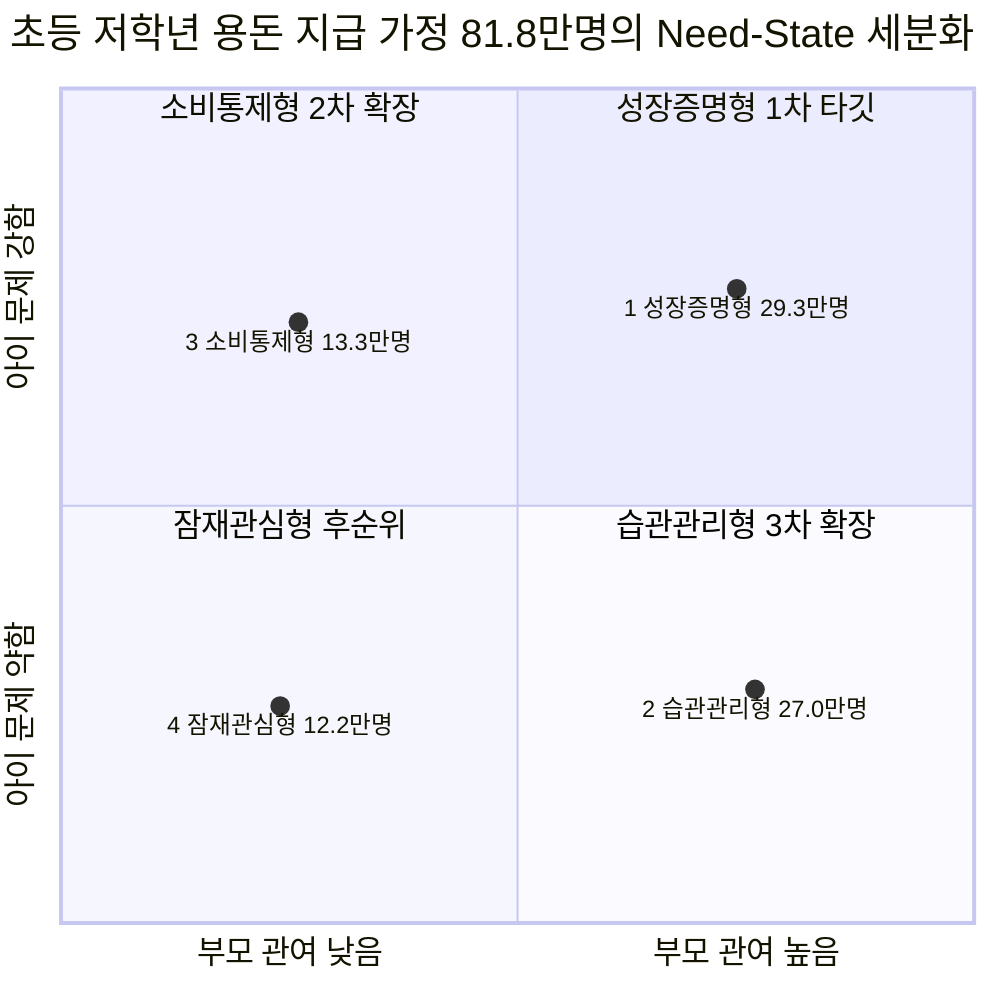
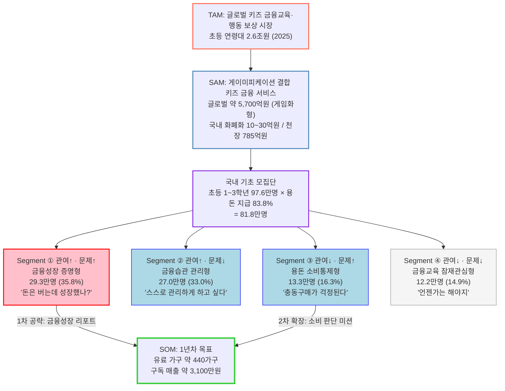

# TAM–SAM–SOM & Market Segment 분석
### 키즈 금융교육·행동 보상 시장

> **작성** 송유림 (팀장·통합) | **최종 수정** 2026-08-17
>
> 🔄 **이후 확정으로 바뀐 전제** — **부모·아이 무료 · 월 구독 없음**이 확정되면서(기능정의 v13 §10), 본 문서의 **구독 기반 SOM(§8 — 440가구 · 3,115만원)과 가격대 3,900/5,900/9,900원 가정은 매출 추정으로 유효하지 않습니다.** 시장 정의·규모·세그먼트·모수(§1~§7)는 그대로 유효하며, 이 문서의 실제 쓰임도 **모수와 세그먼트**입니다. 확정 사양은 [9. PRD](<9. PRD_핀프렌즈_v0_2.md>).

---

## 요약 3줄

1. **시장 규모** — TAM(초등 6~12세 키즈 금융 플랫폼)은 약 **2.6조원**(전 연령 5.9조원의 44.1%), 게임화형 SAM은 글로벌 **약 5,700억원**(매출 기준 게임화 비중 25%). 국내 화폐화 규모는 **10~30억원**이고 자녀 계정 685만개 중 게임화·교육형은 16.1%. 다만 **하나은행 아이부자가 자녀 78만명에게 무료 제공** 중이라 차별점은 게임화가 아니라 성장 증거여야 한다.
2. **핵심 고객** — 국내 초등 1~3학년 97.6만명 중 용돈을 받는 **81.8만명**을 「부모 관여도 × 아이 금융행동 문제」로 4분할하면, 1차 타깃인 **① 성장증명형이 29.3만명(35.8%)** 으로 가장 크다.
3. **1년차 목표** — 구독 기준 SOM은 유료 가구 약 **440가구 / 매출 약 3,100만원**(월 5,900원 가정)에 그친다. 🔄 **이후 무료가 확정돼 이 금액 자체는 매출 추정으로 쓸 수 없고**, *"구독 단독으로는 규모가 나오지 않는다"* 는 **결론만 유효**하다 — 수익은 **결제 수수료·금융사 제휴**로 설계한다.

---

## 목차

- [0. 이 문서를 읽는 법](#0-이-문서를-읽는-법)
- [1. 시장 정의](#1-시장-정의)
- [2. TAM — 키즈 금융교육·행동 보상 시장](#2-tam--키즈-금융교육행동-보상-시장)
- [3. SAM — 게이미피케이션 결합 시장](#3-sam--게이미피케이션-결합-시장)
- [4. 문제 구조 — 세분화의 근거](#4-문제-구조--세분화의-근거)
- [5. Market Segment Map](#5-market-segment-map)
- [6. SOM — 실질 공략 가능 시장](#6-som--실질-공략-가능-시장)
- [7. 전체 구조도](#7-전체-구조도)
- [8. 한계와 다음 단계](#8-한계와-다음-단계)
- [부록. 출처](#부록-출처)

---

## 0. 이 문서를 읽는 법

**TAM / SAM / SOM이 뭔가요?** 시장 크기를 3단계로 좁혀가는 방법입니다.

| 단계 | 뜻 | 우리 경우 |
|---|---|---|
| **TAM** (Total Addressable Market) | 이 분야 전체 시장 | 키즈 금융교육·행동 보상 전부 |
| **SAM** (Serviceable Available Market) | 그중 우리 방식으로 가능한 시장 | 게임 요소를 쓰는 디지털 서비스만 |
| **SOM** (Serviceable Obtainable Market) | 그중 1년 안에 실제로 딸 수 있는 몫 | 특정 고객군 × 실제 결제 |

**근거 등급.** 모든 수치에 원출처 확인 결과를 붙였습니다.

| 등급 | 뜻 |
|---|---|
| **[A]** | 원출처 직접 확인, 수치 일치 |
| **[B]** | 출처 확인, 일부 수치만 대조 가능 |
| **[C]** | 원출처 미확인 — **발표자료에 단독 근거로 쓰지 마세요** |

**환율 가정.** 원화 환산은 모두 **1,400원/$** 기준입니다.

---

## 1. 시장 정의

세 단계를 한 문장씩으로 고정합니다. 이후 모든 숫자는 이 정의에 종속됩니다.

| 단계 | 정의 |
|---|---|
| **TAM** | 미성년자(주로 초등학생)를 대상으로 **금융 학습**과 **실제 금융 행동**을 연결하고, 그 행동을 **용돈·포인트로 보상**하는 모든 서비스 |
| **SAM** | 위 중에서 **퀴즈·미션·포인트·레벨·배지·캐릭터·챌린지 등 게임 요소를 핵심 UX로 사용하는 디지털 솔루션** |
| **SOM** | 위 중에서 **초등 저학년(1~3학년) 자녀에게 정기적으로 용돈을 주면서, 실제 소비·저축 습관 개선까지 원하는 부모** 가 1년 내 유료 결제하는 규모 |

> **정의상 경계** — 학교 대상 B2B 금융교육 솔루션, 성인 금융교육, 단순 용돈 송금 앱(교육·보상 요소 없음)은 SAM에서 제외합니다. 우리 서비스는 *부모가 결제하고 아이가 매일 쓰는 B2C 금융행동 서비스*에 가깝기 때문입니다.

---

## 2. TAM — 키즈 금융교육·행동 보상 시장

### 2-1. 결론

**글로벌 약 5.9조원 (2025년) → 17.9조원 (2034년), CAGR 13.2%** [A]

> ✅ **발표자료 권장 문구**
> "글로벌 키즈 금융·용돈 플랫폼 시장 **5.9조원 (2025)** → **17.9조원 (2034), CAGR 13.2%**
> *출처: Dataintelo, Kids Debit Card Platform Market Report 2034*"

*Kids Debit Card Platform*(아이용 선불·체크카드 플랫폼 = 용돈 충전 + 소비 + 부모 관리)은 우리 TAM 정의와 실질적으로 가장 가까운 공개 시장입니다.

**우리 타깃 연령대만 떼어내면** [A]

같은 보고서는 **6~12세(Children) 세그먼트가 2025년 매출의 44.1%** 를 차지하고 CAGR 12.4%로 성장한다고 제시합니다. 초등 저학년이 여기 포함되므로:

```
글로벌 키즈 금융 플랫폼 TAM   5.9조원
  × 6~12세 세그먼트 비중       44.1%
= 초등 연령대 TAM             약 2.6조원
```

> 전 연령 5.9조원보다 **우리 타깃에 정확히 대응하는 2.6조원** 를 쓰는 편이 정직하고, 뒤의 SAM·SOM과도 논리적으로 이어집니다.

### 2-2. 참고용 인접 시장

| 시장 정의 | 기준연도 | 전망 | CAGR | 등급 |
|---|---|---|---|---|
| **Digital Pocket Money Kid App** | 2.0조원 (2024) | 7.1조원 (2033) | 16.7% | [A] |
| 금융문해교육 (전 연령) | 17.9조원 (2025) | 40.0조원 (2034) | 9.3% | [A] |

> ⚠️ **인용 주의** — 시중에 도는 「디지털 용돈관리 앱 6.7조원 → 19.9조원, CAGR 12.8%」는 **출처가 확인되지 않는 값**입니다. 같은 조사기관(Dataintelo)의 실제 *Digital Pocket Money Kid App Market* 값은 **2.0조원 (2024) → 7.1조원 (2033), CAGR 16.7%** 이며, 규모는 3분의 1 수준이고 성장률은 더 높습니다. 본 문서는 **확인값만** 씁니다.

> ⚠️ **시장조사기관 신뢰도 주의** — Dataintelo·MarketIntelo 계열은 자동 생성형 리포트 벤더로, 학술·공공 통계와 동급으로 취급하면 안 됩니다. **TAM 슬라이드에는 반드시 "민간 시장조사기관 추정치" 라벨을 붙이세요.**

### 2-3. TAM보다 강한 근거 — 실제로 돈이 움직인 증거

시장조사기관 숫자보다 **실제 사업자 실적**이 훨씬 방어력이 높습니다.

**Greenlight (미국)** [A]
- 2024년 추정 매출 **3,200억원** (전년 대비 +16%) — Sacra 추정
- 2024년 아이들이 관리한 금액 **2.8조원**
- 요금제: Core 8,390원 / Max 15,370원 / Infinity 22,370원 / Family Shield 34,970원 (월)
- 2025년 5월 기준 **부모+자녀 합산 650만명** ← *가족 수가 아님에 주의*

**GoHenry (영국)** [A] — *재조사로 원출처 확인 완료*
- 활성 어린이 약 **65만명** (2024.01.01~11.14 활동 기준) / 연간 총 용돈 **5,040억원** / 주당 평균 용돈 **17,300원**
- **행동(과제) 수행으로 번 돈 주 1,550원** — 최고 단가 과제는 베이비시팅 9,580원
- 가장 많이 수행한 과제: **"방 정리", "옷 정리"**
- 총 저축액 **918억원** (주당 평균 7,290원)
- 연령별 용돈: 6세 주 6,640원 → 16세 주 **32,200원**
- 요금: **1개월 무료 후 월 7,180원**

> 💡 **1,550원이라는 숫자의 의미** — 연간 총 용돈 5,040억원 중 과제 수행으로 번 몫은 65만명 × 1,550원 × 52주 ≈ **524억원으로 전체의 약 10%** 입니다. 즉 성숙한 해외 서비스에서도 *행동 보상은 용돈의 일부*이지 전부가 아닙니다. 우리 모델의 보상 설계 눈높이를 잡는 기준으로 쓸 수 있습니다.

**한국** [A]
- **퍼핀(레몬트리)**: 2024년 9월 기준 가입자 **26만명**, 카드 발급 14만장, **누적 충전 484억원**
- **아이쿠카**: 2024년 10월 기준 가입자 **36만명**
- **토스 유스카드**: 2021년 출시 이후 누적 발급 **320만장**, 토스 틴즈 가입자 300만명 돌파, **중·고생 85% 이용**
- **카카오뱅크 mini**: 누적 이용자 **275만명**, 누적 결제액 **7조 6,000억원** (2025.11 기준). 만 7~18세 선불전자지급수단 [A] · *블로터*

> 💡 **해석** — 한국은 "키즈 금융 서비스를 써본 적 없는 시장"이 아니라, **이미 인프라가 깔린 시장**입니다. 우리 과제는 *금융 서비스 도입*이 아니라 *교육·성장 레이어의 차별화*입니다.

### 2-4. 한국의 지불능력 근거 [A]

TAM 자체는 아니지만, **부모가 초등 자녀 교육에 돈을 쓰는가**에 대한 가장 강한 공식 통계입니다.

| 항목 | 2024년 |
|---|---|
| 초·중·고 사교육비 총액 | **29.2조원** (전년비 +7.7%) |
| **초등학교** | **13.2조원** (학교급 중 최대) |
| 초등 사교육 참여율 | **87.7%** |
| 초등 전체학생 1인당 월평균 | **44.2만원** |

*출처: 통계청·교육부 「2024년 초중고사교육비조사」 (전국 약 3,000개 학급, 7.4만명 대상)*

---

## 3. SAM — 게이미피케이션 결합 시장

> **이 장의 원칙** — SAM 정의가 **게임화를 필터로 명시**하므로 그 필터를 수치로 적용합니다. 미확인 계수(FMI K-12 44.8% 등)를 빌려오지 않고, **확인된 사업자 지표에서 게임화 비중을 직접 도출**합니다.

### 3-1. 결론

| 구분 | 값 | 근거 성격 |
|---|---|---|
| **글로벌 SAM** | **약 5,700억원** (범위 3,710억 ~ 7,560억) | 확인 시장값 × 매출 기준 게임화 비중 |
| **국내 SAM — 현재 화폐화** | 약 **10억 ~ 30억원** | 확인 지표 + 결제액 추론 |
| **국내 SAM — 이론적 천장** | 약 **785억원** | 확인 지표만으로 산출 |

### 3-2. 게임화 비중을 직접 도출한다

#### 분류 기준 — 발행 주체가 아니라 제품 설계

> **기준** — *제품의 중심 가치가 「미션·퀴즈·보상·학습 루프」인가, 아니면 「결제·계좌」인가.*
> 미션 기능이 있더라도 **부가 기능**에 그치면 게임화형으로 세지 않습니다.

⚠️ **은행 서비스는 결제 중심이라는 가정은 성립하지 않습니다.** 하나은행 **아이부자**는 은행이 만든 서비스인데도 **미션·퀴즈·보상이 제품의 중심**입니다. 따라서 기준은 *누가 만들었나*가 아니라 *무엇이 제품의 중심인가*여야 합니다.

**아이부자가 게임화 핵심형인 근거** [A]

| 영역 | 기능 |
|---|---|
| 모으기 | 용돈 · **알바** · 저축 |
| 쓰기 | 결제 · 송금 · ATM 출금 |
| 불리기 | **주식투자 체험** |
| 나누기 | 기부 |
| 금융역량 콘텐츠 | 부자MBTI · 투자 이상형 · **경제상식퀴즈** |
| 매일 혜택 | 기분 기록 · 목표 걸음 수 · **퀴즈 풀기** · 습관 인증 |
| 미션 | **집안일 돕기 · 방 청소 → "내 용돈은 내 손으로 벌어요"** |

> 하나은행은 아이부자를 **"체험형 금융 플랫폼"**, **"국내 최초 금융 Parent Tech"** 로 스스로 규정합니다. 결제 앱이 아니라 교육·체험 플랫폼입니다.

#### 계수 단위를 자녀 기준으로 통일한다

아이부자 공시가 중요한 단위 문제를 드러냈습니다. **전체 가입자 160만명 = 부모 82만 + 자녀 78만** 입니다 [A]. 즉 「가입자」는 부모+자녀 합산일 수 있어, 서비스 간 단순 비교가 왜곡됩니다.

| 서비스 | 발표 수치 | 자녀 기준 환산 | 근거 |
|---|---|---|---|
| 아이부자 (하나은행) | 전체 160만 | **78만** | [A] 자녀 회원 수 직접 공시 (2024.11) |
| 퍼핀 | 가입 26만 | **약 14만** | [A] 카드 발급 14만장 = 자녀 수 근사 |
| 아이쿠카 | 가입 36만 | **약 18만** | [추론] 아이부자 자녀 비율 48.8% 적용 |
| 토스 틴즈 | 300만 | 300만 | [A] 청소년 본인 가입 |
| 카카오뱅크 mini | 275만 | 275만 | [A] 청소년 본인 가입 |

**국내 자녀 계정 기준 분류**

| 구분 | 서비스 | 자녀 계정 | 비중 |
|---|---|---|---|
| **게임화·교육 핵심형** | 아이부자 78만 + 아이쿠카 18만 + 퍼핀 14만 | **110만** | **16.1%** |
| 결제·계좌 중심형 | 토스 틴즈 300만 + 카카오뱅크 mini 275만 | 575만 | 83.9% |
| | **합계** | 685만 | 100% |

- **아이부자 · 아이쿠카 · 퍼핀** — 미션·퀴즈·보상이 제품 중심 → **게임화 핵심**
- **토스 유스카드** — 만보기·행운퀴즈 등 리워드가 있으나 **토스 앱 전체의 범용 리워드**이고 금융교육 루프가 아님 → 부가 기능
- **카카오뱅크 mini** — 선불전자지급수단(계좌·카드)이 중심 → 부가 기능
- **케이뱅크 알파·머니미션** (2025.5 출시) — 매일 미션 → 현금 리워드로 **게임화 핵심에 해당하나 만 14~17세 대상이고 가입자 미공개** → 집계 제외 (우리 타깃 연령 아님)

> ⚠️ **중복 가입 주의** — 685만은 초·중·고 약 500만명 [A]을 넘으므로 **최소 27% 중복**입니다. 다만 **중복이 어느 쪽에 편중되는지는 알 수 없습니다.** 비례적으로 중복된다면 비중은 변하지 않으므로, 16.1%를 하한이라고 단정할 근거는 없습니다.

#### 게임화 비중 — 세 각도가 16~33%로 수렴

> ⚠️ **단위를 반드시 맞춰야 합니다.** SAM은 **매출** 시장이므로 곱하는 비중도 **매출 기준**이어야 합니다.
> 아래 각도 A는 **계정 수** 비중이라 SAM 산식에 직접 곱하지 않습니다 — 특히 게임화형 110만의 **71%(아이부자 78만)가 매출 0인 무료 서비스**라, 계정 비중을 매출에 곱하면 SAM이 구조적으로 과대해집니다.

```
[산식에 사용] 각도 B · 글로벌 매출 기준 하한
  Greenlight 3,200억원 [A] + GoHenry 약 524억원 [A 지표 기반]
  = 3,724억원 ÷ 글로벌 앱 시장 2.29조원 = 16.2%
  ※ 이름을 확인한 두 곳만 계상했으므로 하한

[산식에 사용] 각도 C · 롱테일 보정 상한
  RoosterMoney·BusyKid·FamZoo·퍼핀·아이쿠카·아이부자·Acorns Early 등
  나머지 게임화형이 대형 2사와 유사 규모라 가정 → 각도 B × 2 = 약 33%   [추론]
──────────────────────────────────────────────────────────
게임화 비중(매출 기준) = 16.2% ~ 33%   ·   Base 25% 채택

[참고 · 산식 미사용] 각도 A · 국내 자녀 계정 기준
  게임화형 110만 ÷ (110만 + 575만) = 16.1%
  → 매출이 아닌 보급 구조를 보여주는 값. 각도 B(16.2%)와 우연히 근접하나
    개념이 다르므로 별개로 취급합니다.
```

> ⚠️ **각도 C는 각도 B의 2배로 놓은 값이라 독립 근거가 아닙니다.** 실질적으로 독립인 근거는 **각도 B(매출)와 각도 A(계정) 2개**이며, 상한은 그중 하나를 배수 보정한 것입니다. “세 각도가 수렴한다”고 말하면 과장입니다.

> 💡 **이 비중은 보정에 견딥니다** — 분자에 아이부자 78만을 더하면서 동시에 퍼핀·아이쿠카를 **자녀 기준으로 정정**(62만→32만)하면, 두 보정이 상쇄되어 **16.1%**가 됩니다. 보정 전(17.1%)과 사실상 같은 값이라는 점 자체가 **추정치의 신뢰도 근거**입니다.

**전용 앱 사업자 전수 분류**

| 사업자 | 미션·퀴즈·보상이 핵심? | 근거 | 등급 |
|---|---|---|---|
| Greenlight (미국) | **O** | 용돈→집안일→보상→저축→투자 연결 | [A] |
| GoHenry (영국) | **O** | 과제 수행으로 **주 1,550원** 실제 지급 | [A] |
| **아이부자 (한국·하나은행)** | **O** | 경제상식퀴즈·집안일 미션·주식체험·습관 인증 | [A] |
| 퍼핀 (한국) | **O** | 퍼핀월드 · 돈버는퀴즈 | [A] |
| 아이쿠카 (한국) | **O** | 생활 미션 · 금융교육 콘텐츠 | [A] |
| 케이뱅크 머니미션 (한국) | O | 매일 미션 → 현금 리워드 (만 14~17세) | [A] |
| RoosterMoney (영국) | O | 별 · 미션 보상 체계 | [C] |
| BusyKid · FamZoo (미국) | O | 집안일 기반 용돈 지급 | [C] |

### 3-3. 글로벌 SAM 산출

```
Digital Pocket Money Kid App 시장 (2024)   1조 9,880억원   [A]
  × 종점 함의 성장률 15.2% 1년 적용
    → 2025년 환산                          2조 2,900억원   [추론]
  × 게임화 비중(매출 기준)                  16.2% ~ 33%     [도출]
────────────────────────────────────────────────────────────
= 글로벌 SAM   3,710억 ~ 7,560억원   ·   Base(25%) 약 5,700억원
```

> ⚠️ **원자료 자체에 모순이 있습니다.** 보고서는 CAGR을 **16.7%** 로 표기하지만, 자신이 제시한 두 종점(2024년 1조 9,880억 → 2033년 7조 840억, 9년)이 함의하는 성장률은 **15.2%** 입니다. 16.7%를 적용하면 2033년이 8조원이 되어 자기 종점과 어긋납니다.
> → 헤드라인 CAGR보다 **종점 두 개가 더 신뢰할 만하다고 보고 15.2%를 채택**했습니다. 발표에서 CAGR을 인용할 때는 **“보고서 표기 16.7%, 종점 함의 15.2%”** 로 병기하세요.

**TAM과의 정합성**

| 단계 | 값 | 상위 단계 대비 |
|---|---|---|
| TAM · 전 연령 키즈 금융 플랫폼 | 5.9조원 | — |
| ├ 초등(6~12세) 연령대 | 2.6조원 | 44.1% |
| ├ 앱 형태 (2025 환산) | 2.29조원 | 39% |
| **└ SAM · 게임화형** | **약 5,700억원** | **앱 시장의 25%** |

### 3-4. 국내 SAM — 현재 화폐화 규모

```
① 구독 매출  — 유료 구독이 확인된 곳은 퍼핀뿐
   퍼핀 가입 26만 × 유료 전환 1.54% × 연 96,000원 = 3.8억원   [A]
   아이쿠카가 구독을 도입했다면 (62만 기준)         = 9.2억원   [가정]
   → 3.8억 ~ 9.2억원
   ※ 아이부자는 하나은행 무료 서비스로 구독 매출 없음

② 결제 수수료  — 자녀 1인당 연 충전 23.1만원 기준 [A 퍼핀 실측: 323억 ÷ 14만]
   퍼핀    자녀 14만 → 연  323억원  [A]
   아이부자 자녀 78만 → 연 1,802억원  [추론]
   아이쿠카 자녀 18만 → 연  416억원  [추론]
   합계 연 결제·충전액 약 2,540억원
   × 선불 발행사 몫 0.3~0.8% [업계 통상] = 7.6억 ~ 20.3억원
────────────────────────────────────────────────
합계 약 11억 ~ 30억원  →  국내 게임화형 SAM ≈ 약 10억 ~ 30억원
```

> **1인당 연 충전 23.1만원의 타당성** — 초등 월평균 용돈 30,740원 × 12 = 36.9만원의 **62%** 수준입니다. 카카오뱅크 mini의 1인당 연 결제액 46.8만원(1조 2,880억 ÷ 275만)보다 낮은데, 아이부자·퍼핀이 초등 중심이라 용돈 규모가 작은 점과 정합합니다. [A 지표 기반 추론]

### 3-5. 🚨 새로 드러난 최대 리스크 — 게임화는 이미 무료다

아이부자를 넣고 보니 **유료화 가정 자체가 위협받습니다.**

| | 아이부자 (하나은행) | 우리 계획 |
|---|---|---|
| 퀴즈 → 포인트 | ✅ 경제상식퀴즈 · 매일 퀴즈 혜택 | ✅ |
| 미션 → 용돈 | ✅ 집안일 돕기 · 방 청소 | ✅ |
| 저축·소비 관리 | ✅ 모으기 · 쓰기 | ✅ |
| 투자 체험 | ✅ 주식투자 체험 | 보조 |
| 자녀 규모 | **78만명** | 1차 타깃 Problem Pool 29.3만 |
| **가격** | **무료** | **월 3,900~9,900원** |

> ❗ **우리가 유료로 팔려는 기능 대부분을 하나은행이 이미 자녀 78만명에게 무료로 제공하고 있습니다.**
> → **SOM의 유료 전환율 3% 가정과 이론적 천장 785억원(전원 유료 구독)은 이 무료 경쟁을 반영하지 않은 값**입니다.
>
> ✅ **그래서 차별점은 「게임화」가 될 수 없습니다.** 게임화는 이미 무료로 보편화됐습니다.
> 유일하게 비어 있는 자리는 [4장](#4-문제-구조--세분화의-근거)에서 도출한 **Outcome Metrics — 「우리 아이가 실제로 성장했는가」에 답하는 증거**입니다. 아이부자·퍼핀·아이쿠카 모두 활동량(퀴즈 수·포인트)은 보여주지만 **소비 판단·저축 습관의 변화를 증명하지는 않습니다.**

### 3-6. 국내 SAM — 이론적 천장

```
초등 1~3학년 용돈 지급 가정   818,000명   [A]
× 연 구독료                 96,000원    [A] 퍼핀 PLUS 기준
────────────────────────────────────
= 약 785억원   ← 저학년 가정이 전원 유료 구독할 때의 상한
```

| 구분 | 값 | 배수 |
|---|---|---|
| 현재 화폐화 | 약 10~30억원 | 1× |
| 이론적 천장 | 약 785억원 | **약 26~78배** |

> ⚠️ **단위 주의** — 818,000은 **학생 수**이고 96,000원은 **가구 단위 구독료**입니다. 형제가 있는 가정은 한 번만 결제하므로 **가구 수로 환산하면 천장은 785억원보다 낮아집니다.** 또 분모(현재 화폐화 10~30억)는 전 연령 자녀 기반이고 분자(천장)는 저학년 기반이라, **26~78배라는 배수는 모집단이 다른 값끼리의 비교**입니다. 규모 감각용으로만 쓰세요.

> ⚠️ **이 천장은 "무료 대안이 없다면"의 값입니다.** 아이부자가 무료로 존재하는 한 실제 도달 가능 상한은 이보다 훨씬 낮습니다. 발표에서는 **천장을 목표가 아니라 "유료화가 성립할 때의 이론적 한계"** 로만 제시하세요.

> ⚠️ **천장은 매년 낮아집니다.** 초1 학생 수가 연 5~12%씩 줄어(→ [5장](#5-market-segment-map)) 5년 뒤 약 74% 수준이 됩니다.

### 3-7. 발표에서 이렇게 쓰세요

> ✅ **권장 문구**
> “게임화형 키즈 금융 서비스 글로벌 SAM은 **약 5,700억원**(앱 시장 2.29조원 × 매출 기준 게임화 25%).
> 국내는 자녀 계정 **685만개 중 게임화·교육형이 110만개(16.1%)** 이고, 화폐화 규모는 **10~30억원**이다.
> 다만 최대 사업자 **아이부자(하나은행)가 자녀 78만명에게 무료로** 미션·퀴즈·보상을 제공하고 있어,
> **우리의 차별점은 게임화가 아니라 「성장 증거(Outcome Metrics)」여야 한다.**”

> ❌ **이렇게 쓰면 안 됩니다**
> ~~“게이미피케이션 적용률 20~45%를 곱해 국내 SAM 110~250억원”~~ — 적용률의 근거를 원출처에서 확인하지 못했습니다.
> ~~“게임화가 우리 차별점”~~ — 아이부자·퍼핀·아이쿠카·케이뱅크가 이미 전부 게임화형입니다.

---

## 4. 문제 구조 — 세분화의 근거

세그먼트 축을 「부모 관여도 × 아이 금융행동 문제」로 잡은 이유입니다. **인구통계(성별·지역·소득)보다 Need State가 구매를 훨씬 잘 설명**하기 때문이며, 그 근거는 아래와 같습니다.

### 4-1. 핵심 실패 구조

```
금전 보상 지급
  → 아이는 '배우는 것'보다 '돈 받는 것'을 목표로 함
  → 미션은 빨리 끝내지만 금융 개념을 실제 상황에 적용하지 못함
  → 부모: "앱에서 돈은 벌었는데, 금융교육이 된 건가?"
  → 아이: 자기 금융 역량이 성장했다는 증거를 체감 못 함
  → 신뢰 하락 · 이탈
```

### 4-2. 이를 뒷받침하는 연구 [A]

| # | 발견 | 수치 | 출처 |
|---|---|---|---|
| 1 | **금융교육은 '아는 것'은 올리지만 '하는 것'은 잘 못 바꾼다** | 지식 **+0.33 SD** vs 행동 **+0.07 SD** (37개 실험). RCT만 보면 지식 +0.15 SD, 행동 +0.07 SD | Kaiser & Menkhoff (2020), *Economics of Education Review* |
| 2 | **금전 보상은 내재적 동기를 깎을 수 있고, 아동에게 더 해롭다** | 참여조건 **d=−0.40** / 완료조건 **d=−0.36** / 성과조건 **d=−0.28**. 흥미도 d=−0.15~−0.17. 유형적 보상은 대학생보다 **아동에게 더 부정적** | Deci, Koestner & Ryan (1999), *Psychological Bulletin* (128개 실험) |
| 3 | **게임화만으로는 동기가 크게 오르지 않는다** | 전체 효과 **Hedges' g=0.257** (작은 효과). 자율성 g=0.638, 관계성 g=1.776인데 **역량감은 g=0.277로 최저** | *Educational Technology R&D* (2024), 35개 개입·2,500명 |
| 4 | **금융이해력은 실제 행동으로 나타난다** | 상위권 학생은 하위권 대비 저축 확률 **+72%**, 구매 전 가격비교 확률 **+50%**. 부모와 돈 이야기를 월 1회 이상 하는 학생 **68%** 가 더 높은 이해력 | OECD PISA 2022 금융이해력 (Volume IV) |

> ⚠️ **적용 한계** — **한국은 PISA 2022 금융이해력 평가에 참여하지 않았습니다.** (참여 20개국: 오스트리아·벨기에 플랑드르·캐나다 8개주·코스타리카·체코·덴마크·헝가리·이탈리아·네덜란드·노르웨이·폴란드·포르투갈·스페인·미국 + 파트너 6개국) → **"OECD가 한국 아이들에 대해 말했다"는 식으로 인용하면 안 됩니다.**

### 4-3. 반드시 함께 봐야 할 반대 증거

**"그럼 돈을 주지 말자"는 잘못된 결론입니다.**

- 초등 5학년 **106명**(보상군 50 / 통제군 56) 대상 교육게임 준실험에서, 외적 보상이 **동기를 훼손하지 않았고 개념 이해도(proximal) 향상은 보상군이 유의하게 더 컸습니다.** [A]
  <br>*Computers & Education* (2014), <i>A multilevel analysis of the effects of external rewards on elementary students' motivation, engagement and learning in an educational game</i>
  <br>⚠️ **단, 같은 연구가 “보상이 학습 몰입(disciplinary engagement)을 촉진하지는 못했다”고 명시**합니다. 보상은 이해를 돕지만 몰입을 만들지는 않는다는 뜻이라, 우리 설계에서 보상만으로 지속 사용을 기대하면 안 됩니다.
- OECD PISA 2022에서, 정기적으로 집안일을 하고 용돈을 받는 학생이 오히려 금융이해력이 낮게 나온 국가가 10곳 있었다는 서술은 **재조사에서 확인하지 못했습니다.** [C·확인 실패] → **발표에서 인용하지 마세요.**
  <br>대신 확인된 사실: PISA 2022는 “집안일 없이 받는 용돈”과 “집안일 조건 용돈”을 구분해 조사했으며, 이탈리아는 각각 59% / 48%, 브라질은 48% / 44%였습니다. [A]

> **→ 결론: 보상의 존재 여부가 아니라, 보상이 무엇에 연결되어 있는가가 문제입니다.**

### 4-4. 🔑 국내 데이터의 결정적 격차 [A]

윤선생 조사(초등 학부모 586명)를 교차하면, **부모의 의도와 아이의 실제 행동 사이에 정면 충돌**이 드러납니다.

| 부모가 **하려는** 교육 | 비율 | | 아이가 용돈을 **실제 쓰는** 곳 | 비율 |
|---|---|---|---|---|
| **저축 습관 만들기** | **65.8%** (1위) | ↔ | **저축** | **12.8% (최하위)** |
| 용돈 스스로 관리 | 50.1% | | 간식·군것질 | 77.0% (1위) |
| 이자 등 금융지식 | 20.3% | | 문구·학용품 | 47.5% |

> 💡 **이것이 우리 서비스의 문제 정의입니다.**
> **부모가 1순위로 원하는 교육(저축, 65.8%)이 아이의 실제 행동에서는 꼴찌(12.8%)** — 격차 **53.0%p**.

**결제 인프라는 이미 깔려 있다** [A]

| 용돈 지급 수단 | 비율 |
|---|---|
| **체크카드(충전식)** | **64.2%** |
| 현금 | 48.9% |
| 부모 명의 신용카드 | 2.6% |

> → 선불·충전식 카드는 이미 **초등 가정의 3분의 2에 침투**했습니다. 우리 서비스는 *새 결제수단을 설득할 필요가 없고*, 기존 카드 위에 **교육·성장 레이어를 얹는 문제**입니다. 진입장벽이 그만큼 낮습니다.

### 4-5. 실패 요인 우선순위

**연구에서 직접 측정한 점수가 아니라, 확인된 효과크기와 반복 등장 빈도를 근거로 한 가설적 모델**입니다. [C]

| 순위 | 실패 요인 | 상대 중요도 | 근거 강도 |
|---|---|---|---|
| 1 | 금융행동으로 전이되지 않음 | 100 | 매우 강함 (Kaiser & Menkhoff) |
| 2 | 성장 증거가 없음 | 90 | 강함 |
| 3 | 부모가 교육 효과를 확인 못 함 | 85 | 간접근거 강함 |
| 4 | 보상이 학습보다 목적이 됨 | 80 | 매우 강함 (Deci et al.) |
| 5 | 역량감 부족 | 75 | 강함 (게임화 메타분석) |
| 6 | 콘텐츠 반복 | 50 | 일반론 |
| 7 | 재미 부족 | 40 | 약함 |
| 8 | UI 불편 | 25 | 보조적 |
| 9 | 캐릭터 디자인 | 15 | 보조적 |

> **핵심 시사점:** *"돈이 적어서 재미없다"* 보다 ***"돈은 받는데 내가 뭘 잘하게 됐는지 모르겠다"*** 가 훨씬 중요한 문제입니다.
> 부모에게 필요한 건 **Reward Report(활동량)** 가 아니라 **Growth Evidence(성장 증거)** 입니다.

---

## 5. Market Segment Map

### 5-1. 기초 모집단

**초등 저학년(1~3학년) 학생 수 — 2026년 기준** [A]

| 학년 | 2026년 학생 수 | 근거 |
|---|---|---|
| 초1 | **298,178명** | 교육부 「2025년 초·중·고 학생 수 추계 보정 결과(2026~2031)」 |
| 초2 | **324,040명** | 2025년 초1 실측 코호트 연결 [추론] |
| 초3 | **353,713명** | 2024년 초1 실측 코호트 연결 [추론] |
| **합계** | **975,931명 (97.6만명)** | |

> ⚠️ 초2·초3은 직전 연도 초1 실측치를 코호트로 연결한 **추정치**입니다. 전입·전출·유예를 반영한 2026년 확정 학년별 통계가 아닙니다.

> 🚨 **모집단은 매년 줄어듭니다.**
> 초1 학생 수: 2023년 401,752명 → 2024년 353,713명 → 2025년 324,040명 → **2026년 298,178명(첫 30만명 붕괴)** → 2027년 277,674명 → 2030년 232,268명 → 2031년 220,481명
> **연 5~12% 감소** (2024년 −12.0% · 2025년 −8.4% · 2026년 −8.0% · 2031년 −5.1%). 5년 뒤 모집단은 지금의 약 74% 수준입니다. → **시장 진입 속도 자체가 경쟁력**이며, 장기 성장은 1인당 ARPU 상승 또는 연령 확장으로만 가능합니다.

**용돈 지급 가정으로 좁히기**

```
초등 1~3학년              975,931명
  × 용돈 지급률 83.8%     [A] 윤선생 조사
= 세분화 기초 모집단       817,830명 (81.8만명)
```

용돈을 주지 않는 **158,101명(16.2%)** 은 용돈 연동 서비스의 초기 대상이 아니므로 시장 외부로 둡니다.

### 5-2. 세분화 축

성별·지역·맞벌이·소득 같은 인구통계보다, **부모가 왜 금융교육을 시키는가**와 **아이에게 지금 어떤 문제가 있는가**가 구매 가능성을 훨씬 잘 설명합니다.

| 축 | 변수 | 대리지표(Proxy) | 값 |
|---|---|---|---|
| **X축** | 부모의 금융교육 관여도 | 자녀에게 경제교육을 실시 중인가 | 실시 **68.8%** / 미실시 31.2% [A] |
| **Y축** | 아이의 금융행동 문제 강도 | 「계획 없는 충동구매」또는「절약 없이 모두 사용」을 걱정하는가 | **52.1%** (아래 참조) |

> ⚠️ **Y축 값 산정 시 주의 — 복수응답 문항입니다.**
> 원자료 전체 항목: 충동구매 41.2% / 모두 사용 21.8% / 친구 정산 11.6% / 더 달라고 함 6.5% / 분실 6.3% / 고가 구매 3.9% → 합계 91.3%
> 복수응답 비율은 응답자가 중복되므로 **두 항목을 더할 수 없습니다.** 합집합은 **하한 41.2%**(완전 포함) ~ **상한 63.0%**(전혀 겹치지 않음) 범위이며, 본 문서는 **중앙값 52.1%를 Base로 채택**하고 세그먼트 규모를 범위로 제시합니다.

### 5-3. 세그먼트 분할

```
기초 모집단 817,830명
├─ 관여 있음 68.8% → 562,667명
│   ├─ 문제 있음 52.1% → ① 성장증명형   293,149명
│   └─ 문제 없음 47.9% → ② 습관관리형   269,518명
└─ 관여 없음 31.2% → 255,163명
    ├─ 문제 있음 52.1% → ③ 소비통제형   132,940명
    └─ 문제 없음 47.9% → ④ 잠재관심형   122,223명
                              합계 = 817,830명 ✔
```

> **독립성 가정** — 관여도와 문제 강도의 교차조사 데이터가 공개된 바 없어 두 변수가 독립이라고 가정했습니다. 실제로는 상관이 있을 수 있으므로(예: 관여도 높은 부모가 문제를 더 민감하게 인지) **모델값이며 관측값이 아닙니다.**

### 5-4. 시장 세분화 지도



| | 세그먼트 | 위치 | 규모 (Base) | 비중 | 규모 범위 (하한~상한) |
|---|---|---|---|---|---|
| **①** | **금융성장 증명형** ★ | 관여↑ · 문제↑ | **293,149명** | **35.8%** | 23.2만 ~ 35.4만 |
| ② | 금융습관 관리형 | 관여↑ · 문제↓ | 269,518명 | 33.0% | 20.8만 ~ 33.1만 |
| ③ | 용돈 소비통제형 | 관여↓ · 문제↑ | 132,940명 | 16.3% | 10.5만 ~ 16.1만 |
| ④ | 금융교육 잠재관심형 | 관여↓ · 문제↓ | 122,223명 | 14.9% | 9.4만 ~ 15.0만 |
| — | *(시장 외부)* 용돈 미지급 | — | 158,101명 | — | 고정 |

### 5-5. 세그먼트별 프로파일

#### ① 금융성장 증명형 — 핵심 SOM ★

> **부모의 말:** *"아이가 앱에서 돈은 벌고 있는데, 그래서 금융적으로 성장하고 있는 건가요?"*

| 항목 | 내용 |
|---|---|
| **규모** | 29.3만명 (23.2만~35.4만) |
| **상태** | 이미 경제교육 중(68.8%) + 용돈 지급(83.8%) + 아이에게 실제 소비 문제 있음 |
| **핵심 JTBD** | "아이에게 돈을 주는 것을 금융교육으로 연결하고, 아이가 실제로 돈을 잘 관리하게 성장했음을 **확인**하고 싶다" |
| **왜 1차 타깃인가** | 문제를 **이미 인지**하고 있어 별도 문제인식 교육 단계가 불필요 → 전환 경로가 가장 짧음 |
| **핵심 기능** | **금융성장 리포트** (Activity Metrics → Outcome Metrics 전환) |
| **획득 메시지** | "우리 아이가 정말 성장하고 있는지 보여드려요" |

#### ② 금융습관 관리형

| 항목 | 내용 |
|---|---|
| **규모** | 27.0만명 |
| **부모의 말** | *"용돈은 주고 있는데, 스스로 관리하는 습관이 생겼으면 좋겠어요"* |
| **근거** | 부모가 실제 하는 교육 1위 저축 습관 65.8%, 2위 용돈 스스로 관리 50.1% |
| **핵심 기능** | 저축·소비 미션 |
| **획득 메시지** | "용돈을 스스로 관리하는 습관을 만들어줘요" |

#### ③ 용돈 소비통제형

| 항목 | 내용 |
|---|---|
| **규모** | 13.3만명 |
| **부모의 말** | *"돈을 너무 많이 써서 걱정돼요"* |
| **특징** | 문제는 명확하나 **교육 의도가 없음** → 메시지를 '통제'에서 '교육'으로 전환시키는 단계 필요 |
| **핵심 기능** | 소비 판단 미션 |
| **획득 메시지** | "충동소비를 금융 미션으로 바꿔보세요" |

#### ④ 금융교육 잠재관심형

| 항목 | 내용 |
|---|---|
| **규모** | 12.2만명 |
| **부모의 말** | *"언젠가는 시켜야 하는데 어떻게 할지 모르겠어요"* |
| **왜 후순위인가** | `문제인식 → 교육 → 구매` 라는 **추가 2단계**가 필요해 CAC가 가장 높음 |
| **핵심 기능** | 입문 콘텐츠 |
| **획득 메시지** | "놀이처럼 시작하는 첫 금융교육" |

### 5-6. 세분화를 지지하는 시장 사실 [A]

| 사실 | 값 | 의미 |
|---|---|---|
| 용돈 시작 평균 나이 | **만 8.4세** | **초등 1~3학년(만 7~9세)과 정확히 일치** → 타깃 연령 설정의 강력한 근거 |
| 월평균 용돈 | 30,740원 | 서비스 내 순환 자금 규모 |
| 정기 지급 비율 | 83.8% 중 **82.1%** | 반복 사용 습관이 이미 존재 |
| 정기 지급 주기 | 매주 **61.0%** / 매월 32.8% | **주 단위 미션 사이클**이 자연스러움 |
| 용돈 지급 이유 1위 | 경제관념 형성 **61.5%** | 부모가 이미 `돈 → 교육` 연결을 의도 중 |

> 💡 **만 8.4세라는 숫자가 핵심입니다.** `용돈 지급 시작 → 경제관념 교육 시작 → 금융습관 형성 → 게임화 개입` 이 자연스러운 고객 여정이 만들어집니다.

---

## 6. SOM — 실질 공략 가능 시장

### 6-1. SOM을 3단계로 정의하는 이유

**29.3만명을 그대로 SOM이라고 부르면 안 됩니다.** 이는 *문제를 가진 사람의 수*일 뿐, *돈을 낼 사람의 수*가 아닙니다.

| 단계 | 정의 | 규모 | 상태 |
|---|---|---|---|
| **Level 1** — Problem Pool | 초등 저학년 + 용돈 + 부모 관여 + 금융행동 문제 | **293,149명** | ✅ 추정 완료 |
| **Level 2** — Targetable Pool | 위 중 **앱으로 금융교육을 시킬 의향**이 있는 부모 | **약 4만 ~ 19만명** | 🔶 공개 데이터 부재 → 아래 추론 |
| **Level 3** — Actual SOM | 위 중 **실제 유료 결제**하는 부모 | **아래 산출** | 🔶 벤치마크 기반 추정 |

### 6-2. Level 2 추론 — 공개 데이터가 없어 대리지표로 세운다

국내에 “부모의 자녀 금융교육 앱 이용·지불 의향”을 직접 물은 공개 조사는 **재조사에서도 찾지 못했습니다.** 그래서 검증된 두 지표로 상·하한을 잡습니다.

```
상한 — 디지털 용돈 수단을 이미 수용한 비율
  초등 가정 충전식 체크카드 사용률          64.2%  [A] 윤선생
  → 29.3만 × 64.2% ≈ 18.8만명

하한 — 게임화·교육형 앱이 실제로 침투한 비율
  게임화형 자녀 계정 110만 [3-2에서 산출]
  ÷ 초·중·고 학생 약 500만명 [A · 2026년 500만명 붕괴 보도]  = 22.0%
  → 29.3만 × 22.0% ≈ 6.4만명
────────────────────────────────────────
Level 2 ≈ 6만 ~ 19만명   (중앙값 약 12.6만명)
```

> **왜 이 두 지표인가** — 상한(64.2%)은 *“디지털로 용돈을 주는 것 자체에 이미 동의한 부모”* 의 비율이라 앱 수용 의향의 천장 역할을 합니다. 하한(22.0%)은 *“이미 게임화·교육형 앱을 실제로 쓰고 있는 비율”* 이라 바닥 역할을 합니다.

> ⚠️ **단위 일치** — 분자에 **부모 포함 가입자 62만**을, 분모에 **학생 수**를 넣으면 단위가 섞입니다. 여기서는 [3-2](#3-2-게임화-비중을-직접-도출한다)에서 확립한 **자녀 계정 기준 110만**(아이부자 78만 + 아이쿠카 18만 + 퍼핀 14만)을 씁니다.

### 6-3. Level 3 — 1년차 SOM 산출

**전제 벤치마크** — 확인값과 가정을 분리합니다

| 변수 | 값 | 근거 | 등급 |
|---|---|---|---|
| 유료 전환율 (실측) | **1.54%** | 퍼핀: 가입자 26만명 중 유료 구독 4,000명 (2024.10, 구독 출시 8개월차) | **[A]** |
| 1년차 가입 도달률 | 3~8% | 퍼핀이 출시 약 1.5년만에 26만 가입자 확보한 속도 참고 | **[가정]** |
| 가격대 | 월 3,900 / 5,900 / 9,900원 | 8-2 검증 조사에서 테스트할 자사 제안가 | **[자사 설정]** |

**시나리오별 산출** — 세 가격대를 시나리오에 직접 매핑합니다

| 시나리오 | 가입 도달률 | 유료 전환율 | 월 구독료 | 유료 가구 | **1년차 매출** |
|---|---|---|---|---|---|
| 보수 | 3% (8,794명) | 1.54% *(실측)* | 3,900원 | 135가구 | **약 632만원** |
| **Base** | **5% (14,657명)** | **3%** | **5,900원** | **440가구** | **약 3,115만원** |
| 공격 | 8% (23,452명) | 5% | 9,900원 | 1,173가구 | **약 1억 3,935만원** |

> **Base에서 전환율 3%를 쓰는 이유** — 성장증명형은 문제를 이미 명확히 인지한 집단이므로, 전체 평균(퍼핀 1.54%)보다 높은 전환율을 기대할 수 있습니다. 다만 **검증되지 않은 가정**이며, [3-5](#3-5--새로-드러난-최대-리스크--게임화는-이미-무료다)의 **무료 경쟁(아이부자)을 반영하지 않은 값**입니다.

> ⚠️ **이 산출은 Level 2를 건너뜁니다.** 가입 도달률을 Level 1(29.3만)에 직접 적용했습니다. 엄밀하게는 `Level 1 → Level 2(6~19만) → Level 3` 순서여야 하나, Level 2 자체가 추론값이라 오차를 두 번 곱하지 않기 위해 단순화했습니다.

**교차검증 ①** — 국내 화폐화 시장 10~30억원의 1~3%를 신규 진입자가 1년차에 확보한다고 보면 **1,000만 ~ 9,000만원**. 위 바텀업 결과(632만~1억 3,935만원)와 범위가 상당 부분 겹쳐 **두 접근이 대체로 일관**됩니다.

**교차검증 ②** — Base 유료 440가구는 Level 2 중앙값(12.6만명)의 **0.35%** 입니다. 낮아 보이지만, 1년차 신규 진입자의 인지도·마케팅 예산 제약을 감안하면 무리한 값이 아닙니다. 반대로 이 비율이 2%를 넘는 계획이라면 근거를 따로 대야 합니다.

### 6-4. 🚨 이 숫자가 말하는 것 — 가장 중요한 전략 시사점

**1년차 구독 매출 3,115만원은 사업으로 성립하기 어려운 규모입니다.** 이는 추정 실패가 아니라 **이 시장의 구조적 특징**이며, **확인값만으로 증명됩니다.**

```
① 국내 게임화형 시장의 구성 [3-4에서 산출]
   구독 매출        3.8억 ~  9.2억원
   결제 수수료      7.6억 ~ 20.3억원   ← 구독의 약 2배
   → 이 시장에서 이미 결제 수수료가 구독보다 큽니다

② 퍼핀 한 곳의 자금 흐름 [A]
   유료 구독 4,000명 × 96,000원 =  3.8억원
   누적 충전액                   = 484억원   ← 구독의 127배
   → 돈은 구독료가 아니라 충전·결제로 흐릅니다

③ 확인된 제휴 구조 [A]
   퍼핀–신한투자증권 주식거래 · 퍼핀–국민은행 적금·청약
```

> ✅ **결론: 구독은 이 시장의 주 수익원이 아닙니다.**
> 위 세 근거 모두 **확인값**입니다. 「퍼핀 전체 매출 14억원」 같은 **미확인값을 빼도** 결론은 그대로 성립합니다.
>
> **→ 우리 서비스도 「구독 + 결제 수수료 + 제휴」 3중 수익모델을 전제로 설계해야 합니다.** 구독 단독 모델로 계획하면 1년차에 규모가 나오지 않습니다.

### 6-5. SOM 최종 표기

> ✅ **발표자료 권장 문구**
>
> **Target Problem Pool ≈ 29.3만명**
> *초등 저학년 중 용돈 경험 · 부모의 금융교육 관여 · 금융행동 개선 니즈를 동시에 가진 것으로 추정되는 고객군*
>
> **1년차 SOM ≈ 440가구 / 약 3,100만원** *(구독 기준, Base 시나리오 · 월 5,900원)*

> ❌ **이렇게 쓰면 안 됩니다**
> ~~"한국 초등 저학년 금융교육 게이미피케이션 SOM = 35.6만명"~~ *(출처 미확인 — 검증 실패로 폐기)*
> → 게이미피케이션 앱 **이용 의향**이 확인되지 않았고, 35.6만은 **복수응답을 단순 합산한 상한**을 쓴 값입니다. 본 문서의 동일 조건 상한은 **35.4만명**입니다.

---

## 7. 전체 구조도



---

## 8. 한계와 다음 단계

### 8-1. 한계 — 발표 시 정직하게 밝힐 것

1. **초등 저학년 직접 실증 데이터 부족** — 근거 중 상당수가 초등 5학년(교육게임 실험) 또는 만 15세(PISA) 대상입니다. **만 7~9세에 그대로 일반화할 수 없습니다.**
2. **교차조사 부재** — 관여도 × 문제강도 교차표가 공개된 바 없어 독립성을 가정했습니다. 세그먼트 규모는 **모델값**입니다.
3. **조사 주체 편향** — 세분화의 기반인 윤선생 조사는 **영어교육 기업**이 실시했으며, 표본 586명 기준 표본오차는 95% 신뢰수준에서 약 ±4.0%p입니다.
4. **시장조사기관 품질** — Dataintelo·MarketIntelo 등은 자동 생성형 리포트 벤더입니다. 게이미피케이션 교육 시장은 기관별 추정이 **최대 9배** 벌어집니다.
5. **지불의사 미검증** — Level 2(앱 이용 의향)를 직접 조사한 공개 데이터가 없어 **대리지표 2개로 4만~19만명 범위를 추론**했습니다. 폭이 5배라 **여전히 SOM의 가장 큰 불확실성**입니다.
6. **국내 사업자 매출 비공개** — 레몬트리·아이쿠카 모두 **DART 공시 대상이 아니어서 매출을 확인할 수 없습니다.** 이번 판은 인용 매출값을 **아예 쓰지 않고** 가입자·전환율·구독료 등 확인 지표로만 국내 SAM을 세웠습니다.
7. **무료 경쟁 미반영** — **하나은행 아이부자가 자녀 78만명에게 퀴즈·미션·보상을 무료로 제공**하고 있습니다. SOM의 유료 전환율 3%와 이론적 천장 785억원은 이 무료 대안을 반영하지 않은 값이라 **실제 도달 가능 상한은 더 낮습니다.**
8. **SAM의 게임화 비중 미분리** — 글로벌 SAM으로 쓴 디지털 용돈앱 시장은 게임화 여부를 가르지 않아 **다소 넉넉하게 잡힌 값**입니다. 국내 SAM의 수수료율 0.3~0.8%도 업계 통상 구간을 적용한 추론입니다.

### 8-2. 최우선 — SOM 검증 조사

이 단계에서는 추가 시장조사보다 **자체 SOM 검증 조사**가 훨씬 가치가 높습니다. 부모 **300~500명** 대상으로 아래 5문항이면 충분합니다.

1. 현재 자녀에게 용돈을 주고 있는가?
2. 용돈을 금융교육 목적으로 활용하는가?
3. 현재 금융교육 앱/콘텐츠를 사용하는가?
4. 미션 수행 시 포인트/용돈을 지급하는 서비스에 관심이 있는가?
5. **월 3,900원 / 5,900원 / 9,900원 중 실제 결제 의향이 있는가?**

→ `초1·2·3 × 금융교육 관여도 × 자녀의 소비문제` 로 교차하면 **97.6만 → 29.3만 → 실제 유료 SOM**까지 정교하게 내려갈 수 있습니다.

### 8-3. 함께 진행할 것

| 우선순위 | 과제 | 이유 |
|---|---|---|
| 1 | **퍼핀·아이쿠카 매출 확보** — 유료 기업정보 서비스 열람 또는 기사 재검색 | 국내 SAM 바텀업의 유일한 미검증 기초값 |
| 2 | **수익모델 재설계** — 구독 + 결제 수수료 + 제휴 | 6-3의 구조적 결론 |
| 3 | **7~9세 대상 A/B 실험 설계** — 보상 중심 / 성장 피드백 중심 / 보상+성장 | 저학년 직접 근거 공백 해소 |
| 4 | **Outcome Metrics 정의** | 서비스 핵심 차별점의 실체 |

### 8-4. 서비스 설계로 이어지는 결론

```
[기존 구조]  미션 → 정답 → 포인트 → 레벨업 → 끝
             ↳ "그래서 금융적으로 무엇이 성장했지?" ← 답이 없음

[바람직한 구조]
  금융 개념 학습 → 게임 미션 → 금융 의사결정 → 실제 행동 → 금전 보상
                                                    ↓
                              다음 금융행동 ← 성장 피드백 ← 행동 결과 기록
```

**부모 대시보드가 보여줘야 할 것**

| ❌ Activity Metrics (현재 대부분의 앱) | ✅ Outcome Metrics (우리의 차별점) |
|---|---|
| 오늘 3개 미션 완료! 500P 획득! | 충동 소비 판단: 2회 → 5회 |
| 며칠 연속 접속 | 저축 목표 설정: 1회 → 3회 |
| 몇 문제 풀었는지 | 구매 전 가격 비교: 0회 → 4회 |

> **단, 아이에게는 다르게 보여줘야 합니다.** 초등 저학년에게 "금융역량 +13%"는 의미가 없습니다.
> → *"사기 전에 한 번 더 생각했어요"* / *"원하는 것을 위해 돈을 모으고 있어요"* 처럼 **행동 증거를 성장의 단위**로 제시해야 합니다.

**핵심 가설 (검증 대상)**

> *"금전적 보상 자체가 아이의 금융교육을 방해하는 것이 아니라, **보상이 금융역량의 성장과 연결되지 않을 때** 아이에게는 돈 벌기 게임이 되고 부모에게는 효과를 믿기 어려운 서비스가 된다."*

---

## 부록. 출처

### 공공 통계 · 정부 [A]

| 출처 | 사용 수치 | 링크 |
|---|---|---|
| 통계청·교육부, 「2024년 초중고사교육비조사 결과」 | 사교육비 29.2조 / 초등 13.2조 / 참여율 87.7% / 월 44.2만원 | [교육부](https://www.moe.go.kr/boardCnts/viewRenew.do?boardID=294&boardSeq=102822&lev=0&m=020402) · [정책브리핑](https://www.korea.kr/briefing/policyBriefingView.do?newsId=156678713) |
| 교육부, 「2025년 초·중·고 학생 수 추계 보정 결과(2026~2031)」 | 2026 초1 298,178명, 2027~2031 전망 | [강원도민일보](https://www.kado.net/news/articleView.html?idxno=2027858) · [투데이신문](https://www.ntoday.co.kr/news/articleView.html?idxno=124169) |
| 교육부 학생 수 실측 | 2023 초1 401,752 / 2024 353,713 / 2025 324,040 | [아시아경제](https://www.asiae.co.kr/article/2026011308003694258) |
| OECD, PISA 2022 Results (Volume IV) | 저축 +72% / 가격비교 +50% / 부모 대화 68% / 참여국 20개(한국 미참여) | [OECD](https://www.oecd.org/en/publications/pisa-2022-results-volume-iv_5a849c2a-en.html) · [OECD Topics](https://www.oecd.org/en/topics/student-financial-literacy.html) |

### 학술 논문 [A]

| 출처 | 사용 수치 | 링크 |
|---|---|---|
| *Computers & Education* (2014). *A multilevel analysis of the effects of external rewards on elementary students' motivation, engagement and learning in an educational game* | 초등 5학년 106명(보상군 50/통제군 56) · 보상이 동기 훼손 안 함 · 개념이해 유의하게 향상 · 단 학습 몰입은 촉진 못함 | [ScienceDirect](https://www.sciencedirect.com/science/article/abs/pii/S0360131514000426) |
| Kaiser, T. & Menkhoff, L. (2020). *Financial education in schools: A meta-analysis of experimental studies*, Economics of Education Review | 37개 실험 / 지식 +0.33 SD / 행동 +0.07 SD / RCT 18개 0.15·0.07 | [ScienceDirect](https://www.sciencedirect.com/science/article/abs/pii/S0272775718306940) · [PDF](https://epub.ub.uni-muenchen.de/69210/1/187.pdf) |
| Deci, E., Koestner, R. & Ryan, R. (1999). *A meta-analytic review…*, Psychological Bulletin | 128개 실험 / d=−0.40, −0.36, −0.28 / 흥미 −0.15~−0.17 / 아동에게 더 부정적 | [PDF](https://home.ubalt.edu/tmitch/642/articles%20syllabus/Deci%20Koestner%20Ryan%20meta%20IM%20psy%20bull%2099.pdf) · [SDT](https://www.selfdeterminationtheory.org/SDT/documents/2001_DeciKoestnerRyan.pdf) |
| *Gamification enhances student intrinsic motivation…* (2024). Educational Technology Research and Development | 35개 개입·2,500명 / g=0.257 / 자율성 0.638 · 관계성 1.776 · 역량감 0.277 | [Springer](https://link.springer.com/article/10.1007/s11423-023-10337-7) · [ERIC](https://eric.ed.gov/?id=EJ1424760) |

### 국내 설문 · 언론 [A]

| 출처 | 사용 수치 | 링크 |
|---|---|---|
| **윤선생** 설문조사 (2025.10.15~20, 초등 학부모 586명, 금융의 날 기념) | 경제교육 68.8% / 용돈 83.8% / 정기 82.1% / 매주 61.0% / 8.4세 / 30,740원 / 경제관념 61.5% / 저축습관 65.8% / **저축 사용처 12.8%** / **체크카드 64.2%** / 충동구매 41.2% | [이투데이](https://www.etoday.co.kr/news/view/2519042) · [아시아에이](https://www.asiaa.co.kr/news/articleView.html?idxno=228343) · [경기신문](https://www.kgnews.co.kr/news/article.html?no=871115) |
| 전자신문 (2024.10.09) | 퍼핀 가입 26만·카드 14만장·충전 484억·**구독 4,000명**(2024.2 도입) / 아이쿠카 36만 | [전자신문](https://www.etnews.com/20241008000165) |
| 뉴스1 · 전자신문 · 경향신문 (2024.11.27) | **하나은행 아이부자** 자녀 회원 78만 · 전체 160만 · 2021.6 출시 · 경제상식퀴즈·집안일 미션·주식체험 · [하나은행 소개](https://m.hanabank.com/cont/ibooja/intro.html) · [전자신문](https://www.etnews.com/20241127000159) · [뉴스1](https://www.news1.kr/finance/bank/5039471) | [A] |
| 뉴데일리 · 뉴스핌 (2025.5) | **케이뱅크 알파카드·머니미션** 만 14~17세 · 매일 미션 → 현금 리워드 · [케이뱅크](https://www.kbanknow.com/web/product/card/alpha-card) · [뉴데일리](https://biz.newdaily.co.kr/site/data/html/2025/05/19/2025051900337.html) | [A] |
| 블로터 · 전자신문 (2025.11) | 카카오뱅크 mini 누적 **275만명** · 누적 결제 **7조 6,000억원** · 2023.8 만 7세로 확대 · [블로터](https://www.bloter.net/news/articleView.html?idxno=650416) · [전자신문](https://www.etnews.com/20230825000033) | [A] |
| 아시아에이 | 토스 유스카드 누적 320만장 / 틴즈 300만명 / 중·고생 85% | [아시아에이](https://www.asiaa.co.kr/news/articleView.html?idxno=211346) |

### 해외 사업자

| 출처 | 사용 수치 | 등급 | 링크 |
|---|---|---|---|
| Sacra, Greenlight | 2024 매출 3,200억원(+16%) / 2025.5 부모+자녀 650만명 / 요금 8,390원·15,370원·22,370원·34,970원 | [A] | [Sacra](https://sacra.com/c/greenlight/) · [Latka](https://getlatka.com/companies/greenlight.com) |
| Greenlight, Year in Review 2024 | 2024년 아이들이 관리한 금액 2.8조원 | [A] | [Greenlight](https://greenlight.com/learning-center/case-studies/year-in-review-2024) |
| GoHenry, *Pocket money unwrapped 2024* | 65만명 / 5,040억원 / 주 17,300원 / **과제 수행 주 1,550원** / 저축 918억원(주 7,290원) / 베이비시팅 9,580원 / 6세 6,640원→16세 32,200원 / 요금 월 7,180원 | **[A]** | [GoHenry](https://www.gohenry.com/uk/blog/pocket-money/pocket-money-unwrapped-2024) |

### 시장조사기관

| 출처 | 사용 수치 | 등급 | 링크 |
|---|---|---|---|
| Dataintelo, **Kids Debit Card Platform Market** | 2025 5.9조원 → 2034 17.9조원, CAGR 13.2% · **6~12세 세그먼트 44.1%(2025), CAGR 12.4%** | [A] | [Dataintelo](https://dataintelo.com/report/kids-debit-card-platform-market) |
| Dataintelo, **Digital Pocket Money Kid App Market** | 2024 2.0조원 → 2033 7.1조원, CAGR 16.7% | [A] | [Dataintelo](https://dataintelo.com/report/digital-pocket-money-kid-app-market) |
| Dataintelo, **Financial Literacy Education Market** | 2025 17.9조원 → 2034 40.0조원, CAGR 9.3% | [A] | [Dataintelo](https://dataintelo.com/report/financial-literacy-education-market) |
| ~~GlobalData, South Korea EdTech Market~~ | 2024 8.7조원 / Pre-K12+K-12 4.8조원 = 54.8% → **이번 판에서 미사용** (톱다운 SAM 폐기) | [A] | [GlobalData](https://www.globaldata.com/store/report/south-korea-edtech-market-analysis/) |
| ~~게이미피케이션 교육 시장 (기관별)~~ | FMI K-12 44.8% 확인 실패 · 기관별 1.6조~14조원(최대 9배 편차) → **이번 판에서 미사용** | [C] | — |
| ~~글로벌 EdTech 시장~~ | 262조원(Grand View) ~ 565조원(HolonIQ) · 출처 특정 실패 → **이번 판에서 미사용** | [C] | — |
| ~~퍼핀·아이쿠카 매출~~ | DART 공시 대상 아님, 확인 실패 → **이번 판에서 미사용** (가입자·전환율·구독료 등 확인 지표로 대체) | [C] | — |

### 원자료 (프로젝트 내부)

- [`../gpt_deep_research_키즈 금융교육·행동 보상 시장.md`](../../유림/gpt_deep_research_키즈 금융교육·행동 보상 시장.md) — 심층 리서치 원문
