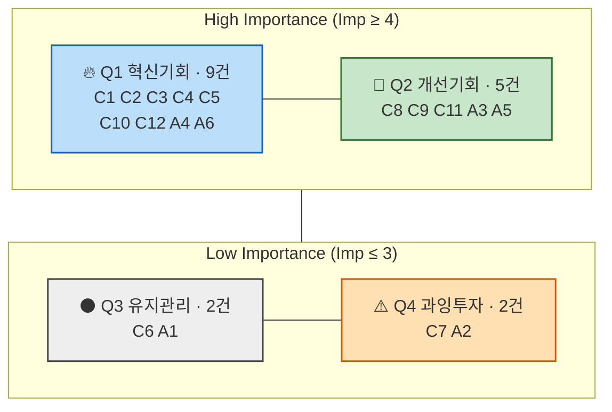

# 기회점수 분석 — AOS · DOS

> **작성** 2026-08-20 · 유림
> **방법론** `AOS, DOS - methodology.md` ②~⑤ 워크플로우 + 4️⃣ DOS 확장
> **평가 재료** [`대표_페인포인트_차트.md`](../5. 페르소나스펙트럼_고객여정지도/대표_페인포인트_차트.md) — 페르소나별 대표 Pain·Goal
> **여정 근거** [`고객여정지도_최종.md`](../5. 페르소나스펙트럼_고객여정지도/고객여정지도_최종.md) · **페르소나** [`페르소나_스펙트럼_v2.md`](../5. 페르소나스펙트럼_고객여정지도/페르소나_스펙트럼_v2.md)
> **시장 모수** [`TAM-SAM-SOM_시장세분화.md`](../4. TAM-SAM-SOM_Market-Segment/TAM-SAM-SOM_시장세분화.md) §5 · §6
> **사분면 기준** 각 지표의 **중앙값**

> 🔄 **이후 확정으로 바뀐 전제** — ① 📍 위치 알림은 **삭제**됐고 사전 개입은 **📝 소비 계획 카드**가 담당합니다([9. PRD](<9. PRD_핀프렌즈_v0_2.md>) §4-2). §8-4가 요구한 *「위치 기반이 아닌 두 번째 트리거」* 는 **트리거가 아니라 「미리 적기」로 답이 났습니다.** ② **부모·아이 무료 · 월 구독 없음**이 확정돼 **SOM Level 3(구독 전제)은 무효**입니다 — 본 분석은 이미 **SOM Level 1(29.3만명)** 을 모수로 씁니다(§6-2).

---

# 0. 분석 범위와 전제

## 0-1. 왜 Core + Adjacent 18건인가

*"페르소나 스펙트럼 4유형 중 어떤 유형의 Pain List를 채점 대상으로 삼을 것인가"* 에 대한 답은 **Core + Adjacent 18건**입니다.

| 유형 | 가정 | 포함 여부 | 이유 |
|---|---|:-:|---|
| **Core** | H1 정미경 · H2 배성우 · H3 한지영 · H4 강동혁 | ✅ **포함** | 1차 타깃(① 성장증명형)에 대응. **기회점수를 매기는 목적 자체가 이 집단의 우선순위 결정** |
| **Adjacent** | H5 오하늘 · H6 임태경 | ✅ **포함** | 2·3차 확장 세그먼트. **Core와 같은 축에 올려야 확장 판단이 가능** |
| Extreme | H7 백현주 · H8 서명숙 | ⬜ 제외 | 포용성 설계에서 도출된 유형으로 **직접 근거가 없고**(스펙트럼 v2 §5), 시장 모수에 대응하는 세그먼트가 없어 **Market Relevance를 산출할 수 없음** |
| Non-user | H9 · H10 · H11 | ⬜ 제외 | **전환 이전에 이탈**하므로 「현재 대체 솔루션의 만족도」는 측정되지만, 이들의 Pain은 기회 발굴이 아니라 **진입 전략 사안** |

> ⚠️ **제외는 「중요하지 않다」가 아닙니다.** Extreme은 포용성 합격선, Non-user는 시장 확장 한계를 판정하는 자료이며 각각 다른 프레임으로 다룹니다. 여기서 빼는 이유는 **AOS·DOS 프레임에 맞지 않아서**입니다.

**평가 단위 = 18건** (Core 12 · Adjacent 6). ID는 `C1~C12` · `A1~A6`.

## 0-2. Satisfaction을 무엇으로 재는가 — 이 분석의 정의

방법론은 Satisfaction을 *"현재 이 Pain이 얼마나 잘 해결되고 있는가"*로 정의합니다. 그런데 우리 Pain 목록에는 **「우리 제품의 온보딩이 무겁다」처럼 대체재에는 존재하지도 않는 항목**이 섞여 있어, 그대로 읽으면 *"현금은 온보딩이 없으니 만족도 5점"* 같은 역전이 생깁니다.

> ### ✅ 채택한 정의
> **Satisfaction = 그 Pain이 겨냥하는 Goal이 「현재 대체 솔루션」에서 얼마나 충족되는가.**
>
> 즉 채점 대상은 **Pain의 표면 문장이 아니라 그 뒤의 Goal**입니다. 예) C4의 Pain은 「온보딩 5단계가 무겁다」지만, Goal은 「가볍게 시작해서 소비를 보고 싶다」이므로 **현금(가볍지만 아무것도 안 보임)에 2점**을 줍니다.

**각 인물의 「현재 대체 솔루션」**

| 인물 | 세그먼트 | 현재 쓰는 것 |
|---|---|---|
| **H1** 정미경 | ① 성장증명형 | 퍼핀 8개월 (학습현황 화면 있음) |
| **H2** 배성우 | ① 성장증명형 | 현금 봉투 · 일요일 지갑 확인 |
| **H3** 한지영 | ① 성장증명형 | 조건부 현금 + 월말 구두 협상 |
| **H4** 강동혁 | ① 성장증명형 | 선불카드 + 앱스토어 결제 알림(사후) |
| **H5** 오하늘 | ② 습관관리형 | 돼지저금통 · 부모 이자 · 스티커판 |
| **H6** 임태경 | ③ 소비통제형 | "그만 좀 사" 구두 개입 |

---

# 1. ② Importance Table — 고객 입장 중요도 (1~5)

**채점 질문** — *"이 Pain이 해결되지 않으면, 이 고객이 원하는 것(Goal)에 얼마나 못 미치는가?"*

| ID | 인물 | # | 대표 Pain Point | 이 Pain이 겨냥하는 Goal | **Imp** | 근거 |
|---|---|:-:|---|---|:-:|---|
| **C1** | H1 | 0 | 누적 숫자가 성장 증거가 못 됨 | 활동량이 아니라 변화를 읽고 싶다 | **5** | 이 가정이 서비스에 오는 **이유 그 자체** (JTBD 본문) |
| **C2** | H1 | 6 | 실천이 비어 4개 나무 전부 정체 | 첫 실천 한 건을 쉽게 넘게 하고 싶다 | **4** | 핵심 약속이나 C1의 **파생** — 증거가 안 생기는 원인 |
| **C3** | H1 | 10 | 정체를 아이 능력 문제로 오귀인 | 멈춘 이유가 아이 탓인지 조건 탓인지 구분되길 | **4** | 관계·자기효능감 훼손 · 이 가정의 **이탈 트리거** |
| **C4** | H2 | 3 | 현금 5초 vs 온보딩 5단계 | 봉투에 5천원 넣는 것만큼 가볍게 시작하고 싶다 | **4** | 진입을 막지만 **수단 층위**의 문제 |
| **C5** | H2 | 6 | 3분 미달로 즉흥구매가 사각지대 | 지갑을 여는 그 순간에 한 번 멈추게 하고 싶다 | **5** | 이 가정의 **진입 후크이자 핵심 Goal** |
| **C6** | H2 | 7 | 안 읽고 [확인했어요]를 누름 | 참은 날이 더 좋은 날로 느껴지게 하고 싶다 | **3** | 보상 변별 문제 — **있으면 좋으나 목표의 직접 축은 아님**<br>🔄 **2026-08-21** — v13 §5가 **계획 준수 시에만 ⭐1**로 확정하여 「참은 날 ≠ 확인만 한 날」이 성립. **보상 변별 문제 자체는 해소**되고 잔여는 열람 여부. 점수는 부모 응답 기준이라 유지 |
| **C7** | H3 | 5 | 출석 ⭐1이 노동 보상 교육관과 충돌 | 보상이 노력에 비례한다는 원칙이 지켜지길 | **3** | 부모의 **신뢰** 문제 · 교육 성과와는 간접 |
| **C8** | H3 | 7 | 미션 현금과 ⭐의 의미가 안 갈림 | 한 번의 일에 한 번의 보상이라는 감각을 지키고 싶다 | **4** | 이 가정 교육관의 **핵심 규칙**이 흐려짐 |
| **C9** | H3 | 8 | 번 돈과 살 수 있는 별이 다른 지갑 | "일했더니 갖고 싶던 게 생겼다"를 경험하게 하고 싶다 | **4** | 「벌기」 교육의 **결과 회수 지점** |
| **C10** | H4 | 1 | FOMO 결제는 판단 시간이 너무 짧음 | 3초가 아니라 3분의 판단 시간을 만들어 주고 싶다 | **5** | 이 가정이 **문제로 인식한 사건 자체** (감정 최저 1) |
| **C11** | H4 | 4 | 옷장이 게임 스킨 하위호환으로 즉시 판정 | 앱 안에서 갖고 싶은 게 생기게 하고 싶다 | **4** | 아이 이탈 = 서비스 종료 · 다만 **동기 층위** |
| **C12** | H4 | 6 | 온라인 결제에 사전 개입이 원리적으로 없음 | 어디에 있든 결제 직전에 한 번 멈추게 하고 싶다 | **5** | C10과 **같은 Goal의 기능 공백 버전** |
| **A1** | H5 | 5 | 「불리기」가 학습 단계부터 막힘 | 아이가 "저절로 늘어난다"를 자기 말로 설명하게 | **3** | 🔻 **「이자」 Importance 1.02로 부모 인식 최하위** (JTBD v1 Ⅳ부) |
| **A2** | H5 | 8 | 별을 안 쓰고 쌓기만 함 | 모은 것이 진짜 원하는 것에 가까워지는 느낌 | **3** | 아이 동기 문제이나 **부모는 문제로 인식조차 안 함** |
| **A3** | H5 | 10 | ⭐10이 부모 충전 지속에 종속 | 아이가 통제할 수 있는 것으로만 평가받게 하고 싶다 | **4** | **공정성** 문제 — 인지되면 신뢰가 크게 흔들림 |
| **A4** | H6 | 2 | 진입 동기가 감시 기대 | 아이가 어디서 얼마를 쓰는지 알고 싶다 | **4** | 이 부모의 **실제 목표**이자 진입 사유 |
| **A5** | H6 | 6 | 알림이 통제 신호로 전달됨 | *(아이)* 감시받지 않으면서 친구들과 어울리고 싶다 | **4** | 아이 관계·자율성 — **아이에게는 최상위** |
| **A6** | H6 | 10 | 성공 기준 자체가 제품과 다름 | "얼마 줄었다"는 숫자 하나를 보고 싶다 | **5** | 이 가정의 **유지 판단 그 자체** (감정 1, 이탈 확정) |

**분포** — 5점 5건 · 4점 9건 · 3점 4건 · **중앙값 4.0**

> ⚠️ **최솟값이 3점인 이유** — 인물당 대표 Pain을 3건씩만 골라낸 목록이라 **처음부터 중요한 것만 남아 있습니다.** 방법론 §100이 지적한 대로 이 편중 때문에 고정 기준선 3.0을 쓸 수 없고(전 건이 상단), **중앙값을 경계로 씁니다.**

---

# 2. ③ Satisfaction Table — 현재 대체 솔루션의 충족도 (1~5)

**채점 질문** — *"지금 쓰는 것(퍼핀·현금·저금통·구두 개입)으로 이 Goal이 얼마나 충족되고 있는가?"*

| ID | 인물 | 현재 대체 솔루션이 이 Goal에 대해 하는 일 | **Sat** | 1 − Sat/5 |
|---|---|---|:-:|:-:|
| **C1** | H1 | 퍼핀이 학습현황 화면을 **제공은 한다** — 확인은 되고, 그게 성장인지만 모른다 | **2** | 0.6 |
| **C2** | H1 | 퍼핀에는 **학습–실천 연결 자체가 없다.** 오답에도 절반 보상이라 실천 판정 개념이 부재 | **1** | 0.8 |
| **C3** | H1 | 정체 원인을 설명해 주는 화면이 **어느 대체재에도 없다** | **1** | 0.8 |
| **C4** | H2 | 현금은 가볍지만 **그것으로 얻는 정보가 0**이다. 기존 용돈앱은 무겁고 | **2** | 0.6 |
| **C5** | H2 | 현금으로는 **소비 전 개입이 원천적으로 불가** | **1** | 0.8 |
| **C6** | H2 | 회고 절차 자체가 **존재하지 않는다** | **1** | 0.8 |
| **C7** | H3 | 현재는 부모가 기준을 직접 정하므로 **이 충돌이 없다** — 원칙은 지켜지는 중 | **3** | 0.4 |
| **C8** | H3 | 현금만 줄 때는 **무엇에 대한 보상인지 명확했다** | **3** | 0.4 |
| **C9** | H3 | 🔴 현금은 **하나의 지갑**이라 "일했더니 샀다"가 그대로 성립한다 — **이미 잘 되던 것** | **4** | 0.2 |
| **C10** | H4 | 결제 알림은 **울린 뒤에 온다.** 사전 개입 수단 0 | **1** | 0.8 |
| **C11** | H4 | 🔴 아이는 **게임 스킨으로 이미 충족**돼 있다 — 우리가 대체할 대상이 강력 | **3** | 0.4 |
| **C12** | H4 | 온라인 결제 사전 개입은 **어떤 대체재에도 없다** | **1** | 0.8 |
| **A1** | H5 | 이자·복리를 **아무도 가르치지 않는다.** 다만 부모가 아쉬워하지도 않음 | **2** | 0.6 |
| **A2** | H5 | 🔴 저금통도 **쌓기만 하는 상태**라 현 상태와 동일 — 문제로 인식되지 않음 | **3** | 0.4 |
| **A3** | H5 | 현재는 그런 대량 보상 자체가 없어 **박탈도 없다**(중립) | **3** | 0.4 |
| **A4** | H6 | "그만 좀 사" 한마디로는 **아무것도 알 수 없다** | **1** | 0.8 |
| **A5** | H6 | 🔴 현재 아이는 **감시 도구가 없어 자유롭다** — 아이 Goal은 이미 충족 상태 | **3** | 0.4 |
| **A6** | H6 | 지출은 **한 푼도 안 줄고 있다** | **1** | 0.8 |

**분포** — 1점 8건 · 2점 3건 · 3점 6건 · 4점 1건 · **중앙값 2.0**

> 🔴 **Satisfaction 3점 이상 6건의 성격에 주목하세요.** C9·C11·A2·A5는 **대체재가 이미 어느 정도 해주고 있는 것을 우리 설계가 건드린 항목**입니다. 이 넷은 "미충족을 채우는 기회"가 아니라 **"잘 되던 것을 나쁘게 만들 위험"**이며, §4의 Q2에 모입니다.

---

# 3. ④ AOS Table — `AOS = Importance × (1 − Satisfaction/5)`

**AOS 내림차순 정렬**

| 순위 | ID | 인물 | # | 대표 Pain Point | Imp | Sat | 1−S/5 | **AOS** | 해석 |
|:-:|---|---|:-:|---|:-:|:-:|:-:|:-:|---|
| **1** | **C5** | H2 | 6 | 3분 미달로 즉흥구매가 사각지대 | 5 | 1 | 0.8 | **4.0** | 🔥 명확한 혁신 기회 |
| **1** | **C10** | H4 | 1 | FOMO 결제는 판단 시간이 너무 짧음 | 5 | 1 | 0.8 | **4.0** | 🔥 명확한 혁신 기회 |
| **1** | **C12** | H4 | 6 | 온라인 결제에 사전 개입이 원리적으로 없음 | 5 | 1 | 0.8 | **4.0** | 🔥 명확한 혁신 기회 |
| **1** | **A6** | H6 | 10 | 성공 기준 자체가 제품과 다름 | 5 | 1 | 0.8 | **4.0** | 🔥 명확한 혁신 기회 |
| **5** | **C2** | H1 | 6 | 실천이 비어 4개 나무 전부 정체 | 4 | 1 | 0.8 | **3.2** | 🔥 혁신 기회 |
| **5** | **C3** | H1 | 10 | 정체를 아이 능력 문제로 오귀인 | 4 | 1 | 0.8 | **3.2** | 🔥 혁신 기회 |
| **5** | **A4** | H6 | 2 | 진입 동기가 감시 기대 | 4 | 1 | 0.8 | **3.2** | 🔥 혁신 기회 |
| **8** | **C1** | H1 | 0 | 누적 숫자가 성장 증거가 못 됨 | 5 | 2 | 0.6 | **3.0** | 🔥 혁신 기회 |
| **9** | **C4** | H2 | 3 | 현금 5초 vs 온보딩 5단계 | 4 | 2 | 0.6 | **2.4** | 💎 부분 개선 기회 |
| **9** | **C6** | H2 | 7 | 안 읽고 [확인했어요]를 누름 | 3 | 1 | 0.8 | **2.4** | 💎 부분 개선 기회 |
| **11** | **A1** | H5 | 5 | 「불리기」가 학습 단계부터 막힘 | 3 | 2 | 0.6 | **1.8** | 💎 부분 개선 기회 |
| **12** | **C8** | H3 | 7 | 미션 현금과 ⭐의 의미가 안 갈림 | 4 | 3 | 0.4 | **1.6** | ⚫ 유지·보완 |
| **12** | **C11** | H4 | 4 | 옷장이 게임 스킨 하위호환 | 4 | 3 | 0.4 | **1.6** | ⚫ 유지·보완 |
| **12** | **A3** | H5 | 10 | ⭐10이 부모 충전 지속에 종속 | 4 | 3 | 0.4 | **1.6** | ⚫ 유지·보완 |
| **12** | **A5** | H6 | 6 | 알림이 통제 신호로 전달됨 | 4 | 3 | 0.4 | **1.6** | ⚫ 유지·보완 |
| **16** | **C7** | H3 | 5 | 출석 ⭐1이 노동 보상 교육관과 충돌 | 3 | 3 | 0.4 | **1.2** | ⚫ 유지·보완 |
| **16** | **A2** | H5 | 8 | 별을 안 쓰고 쌓기만 함 | 3 | 3 | 0.4 | **1.2** | ⚫ 유지·보완 |
| **18** | **C9** | H3 | 8 | 번 돈과 살 수 있는 별이 다른 지갑 | 4 | 4 | 0.2 | **0.8** | ⚠️ 과잉투자 위험 |

**AOS 중앙값 = 2.4** · 최댓값 4.0 · 최솟값 0.8

---

# 4. ⑤ Matrix 시각화 — X: Satisfaction · Y: Importance · Bubble: AOS

## 4-1. 사분면 경계 — 각 지표의 중앙값

| 축 | **경계값** | 경계선 포함 규칙 |
|---|:-:|---|
| **Y — Importance** | **4.0** | **4 이상 = 상단(High)** · 3 이하 = 하단(Low) |
| **X — Satisfaction** | **2.0** | **2 이하 = 좌측(Low)** · 3 이상 = 우측(High) |
| *(버블)* AOS | 2.4 | 참고선 — 사분면을 가르지는 않음 |

> **왜 중앙값인가** — 방법론 A안(고정 3.0)은 **Importance 최솟값이 3점**이라 18건 전부가 상단에 몰려 사분면이 성립하지 않고, B안(평균±σ)은 **운영 데이터가 없어** 쓸 수 없습니다. 중앙값은 분포가 치우쳐도 항상 절반씩 갈라줍니다.
> **경계선 값의 귀속** — Importance 4.0과 Satisfaction 2.0 **자체는 각각 상단·좌측에 넣었습니다.** 반대로 넣으면 C4가 Q1에서 Q2로 이동합니다.

## 4-2. 산점도

```
 Importance
   ▲
 5 │  C5  C10  C12  A6            C1              ┊
   │                                              ┊
 4 │  C2  C3  A4                  C4              ┊   C8  C11  A3  A5        C9
   ├╌╌╌╌╌╌╌╌╌╌╌╌╌╌╌╌╌╌╌╌╌╌╌╌╌╌╌╌╌╌╌╌╌╌╌╌╌╌╌╌╌╌╌╌╌╌┼╌╌╌╌╌╌╌╌╌╌╌╌╌╌╌╌╌╌╌╌╌╌╌╌╌╌╌╌  Imp 중앙값 4.0
 3 │  C6                          A1              ┊   C7  A2
   │                                              ┊
   └──────────────────────────────────────────────┼──────────────────────────────▶
      Sat 1                        Sat 2          ┊    Sat 3              Sat 4    Satisfaction
                                                  ↑
                                        Sat 중앙값 2.0
```

## 4-3. 사분면 배치

| 사분면 | 조건 | 건수 | 항목 | 전략 행동 |
|---|---|:-:|---|---|
| 🔥 **Q1 혁신기회** | Imp ≥ 4 · Sat ≤ 2 | **9** | **C1 C2 C3 C4 C5 C10 C12 A4 A6** | JTBD 인터뷰 대상 · **MVP 실험 우선** |
| 💎 **Q2 개선기회** | Imp ≥ 4 · Sat ≥ 3 | **5** | **C8 C9 C11 A3 A5** | 지속적 개선 — 단, 아래 🔴 참조 |
| ⚫ **Q3 유지관리** | Imp ≤ 3 · Sat ≤ 2 | **2** | **C6 A1** | UX·마케팅 최적화 중심 |
| ⚠️ **Q4 과잉투자** | Imp ≤ 3 · Sat ≥ 3 | **2** | **C7 A2** | 자원 분배 재검토 |



> 🔴 **Q2 5건의 정체 — 「개선기회」가 아니라 「우리가 만든 신규 Pain」입니다.**
> **C9**(번 돈 ↔ 별이 다른 지갑) · **C11**(옷장 vs 게임 스킨) · **A5**(알림이 감시로) · **A2**는 전부 **대체재에서는 문제가 아니었거나 이미 충족되던 것**입니다. Q2를 통상적 해석대로 "지속 개선"으로 읽으면 안 되고, **"우리 설계가 후퇴시킨 지점"으로 읽어 회귀 여부를 먼저 판단**해야 합니다. 특히 **C9는 Sat 4점 · AOS 0.8로 전체 최하위** — 현금에서 이미 잘 되던 것입니다.

---

# 5. Market Relevance — 어떤 모수를 쓸 것인가

## 5-1. 판단 — **인원 기준 2단(SAM 대용 81.8만 / SOM 29.3만)을 채택합니다**

| 후보 모수 | 값 | 채택 | 판단 근거 |
|---|---|:-:|---|
| **TAM** | 2.6조원 (글로벌 초등 키즈 금융 플랫폼) | ❌ | ① **글로벌 금액** 기준이라 국내 가정이 겪는 Pain과 단위가 다름 ② 민간 시장조사기관 추정치(Dataintelo 계열) ③ 이 분모로 나누면 **18건 전부가 0에 수렴해 변별력이 사라짐** |
| **SAM (금액)** | 글로벌 5,700억 / 국내 10~30억 / 천장 785억 | ❌ | 금액 단위. **Pain은 사람이 겪는 것**이므로 인원 모수라야 「해당 Pain을 겪는 사람의 비중」을 계산할 수 있음 |
| ✅ **SAM 대용 (인원)** | **817,830명** — 초등 1~3학년 **용돈 지급 가정** 전체 (§5-1 세분화 기초 모집단) | ✅ | SAM 정의(*"게임 요소를 핵심 UX로 쓰는 디지털 솔루션"*)에 대응하는 **국내 인원 모수**. 세그먼트 ①②③④를 모두 포함하므로 **Core와 Adjacent를 한 자에 놓고 비교 가능** |
| ✅ **SOM Level 1** | **293,149명** — ① 금융성장 증명형 Problem Pool (§6-1) | ✅ | 1차 타깃 그 자체. **1년 안에 딸 수 있는 몫**을 기준으로 한 우선순위 산출 |
| SOM Level 3 | 440가구 / 3,115만원 | ❌ | ① 규모가 작아 소수점 노이즈가 순위를 지배 ② 🔴 **월 5,900원 구독 전제인데 [`기능정의_v13.md`](../0. 확정 기능 정의/기능정의_v13.md)에서 무료가 확정**돼 **산출식 자체가 무효** (v13 §10이 재산출 필요를 명시) |

> **왜 SAM과 SOM을 둘 다 내는가** — 둘은 **다른 질문에 답합니다.**
> **SAM 버전** = *"우리가 다룰 수 있는 국내 시장 전체에서 이 Pain은 얼마나 넓은가"* → **로드맵·확장 판단**
> **SOM 버전** = *"1년 안에 실제로 딸 수 있는 몫 안에서 이 Pain은 얼마나 무거운가"* → **MVP 범위 결정**

## 5-2. Market Relevance 산식

```
Market Relevance = 모수 내 세그먼트 비중 × Pain 발생률
```

**① 모수 내 세그먼트 비중**

| 세그먼트 | 규모 | **SAM 기준**<br>(÷ 81.8만) | **SOM 기준**<br>(1년차 도달 계수) | 계수 근거 |
|---|---:|:-:|:-:|---|
| **① 금융성장 증명형** ★ | 293,149명 | **0.358** | **1.00** | 1차 타깃 = SOM 정의 그 자체 |
| **② 금융습관 관리형** | 269,518명 | **0.330** | **0.15** | §5-4 **「3차 확장」** — 문제 강도가 약해 전환이 가장 늦음 |
| **③ 용돈 소비통제형** | 132,940명 | **0.163** | **0.30** | §5-4 **「2차 확장」** — 문제는 강하나 *통제→교육* 메시지 전환 단계가 필요 |

> ⚠️ **SOM 도달 계수 0.15 / 0.30은 [가정]입니다.** 시장분석 §5-4가 명시한 확장 순서(1차 ① / 2차 ③ / 3차 ②)를 수치화한 것이며 관측값이 아닙니다.
> **엄격한 SOM 해석을 쓰면 ②③은 0이 되어 Adjacent 6건의 DOS가 전부 0**이 됩니다. 그러면 순위 정보가 사라지므로, **확장 순서를 보존하는 차등 계수**를 썼습니다. 이 선택이 §7의 결론(확장 Pain의 순위 하락)의 **강도**를 좌우합니다.

**② Pain 발생률** — 그 세그먼트 안에서 이 Pain이 실제로 발생할 비율 [추론]

| 계수 | 성격 | 판단 기준 | 해당 |
|:-:|---|---|---|
| **1.0** | **구조적** | 제품 구조·법제도·발달단계에서 오므로 그 세그먼트면 거의 전원이 겪음 | C1 C2 A1 A4 A6 |
| **0.6** | **조건부** | 특정 조건(소비 동선·소비 유형·미션 사용)이 맞을 때 발생 | C3~C12 · A2 A5 |
| **0.3** | **특수** | 두 조건이 겹칠 때만 발생 | A3 (적금 가입 **and** 부모 충전 중단) |

---

# 6. DOS Table — SAM 버전 `DOS = (Importance − Satisfaction) × Market Relevance`

> **모수** 817,830명 (초등 1~3학년 용돈 지급 가정 전체) · **답하는 질문** *"국내 시장 전체에서 이 Pain은 얼마나 넓은가"*

| 순위 | ID | 인물 | 세그 | 대표 Pain Point | I | S | **I−S** | 비중 | 발생률 | **MR** | **DOS** |
|:-:|---|---|:-:|---|:-:|:-:|:-:|:-:|:-:|:-:|:-:|
| **1** | **C1** | H1 | ① | 누적 숫자가 성장 증거가 못 됨 | 5 | 2 | **3** | 0.358 | 1.0 | **0.36** | **1.08** |
| **1** | **C2** | H1 | ① | 실천이 비어 4개 나무 전부 정체 | 4 | 1 | **3** | 0.358 | 1.0 | **0.36** | **1.08** |
| **3** | **C5** | H2 | ① | 3분 미달로 즉흥구매가 사각지대 | 5 | 1 | **4** | 0.358 | 0.6 | 0.21 | **0.84** |
| **3** | **C10** | H4 | ① | FOMO 결제는 판단 시간이 너무 짧음 | 5 | 1 | **4** | 0.358 | 0.6 | 0.21 | **0.84** |
| **3** | **C12** | H4 | ① | 온라인 결제에 사전 개입이 원리적으로 없음 | 5 | 1 | **4** | 0.358 | 0.6 | 0.21 | **0.84** |
| **6** | **A6** | H6 | ③ | 성공 기준 자체가 제품과 다름 | 5 | 1 | **4** | 0.163 | 1.0 | 0.16 | **0.64** |
| **7** | **C3** | H1 | ① | 정체를 아이 능력 문제로 오귀인 | 4 | 1 | **3** | 0.358 | 0.6 | 0.21 | **0.63** |
| **8** | **A4** | H6 | ③ | 진입 동기가 감시 기대 | 4 | 1 | **3** | 0.163 | 1.0 | 0.16 | **0.48** |
| **9** | **C4** | H2 | ① | 현금 5초 vs 온보딩 5단계 | 4 | 2 | **2** | 0.358 | 0.6 | 0.21 | **0.42** |
| **9** | **C6** | H2 | ① | 안 읽고 [확인했어요]를 누름 | 3 | 1 | **2** | 0.358 | 0.6 | 0.21 | **0.42** |
| **11** | **A1** | H5 | ② | 「불리기」가 학습 단계부터 막힘 | 3 | 2 | **1** | 0.330 | 1.0 | 0.33 | **0.33** |
| **12** | **C8** | H3 | ① | 미션 현금과 ⭐의 의미가 안 갈림 | 4 | 3 | **1** | 0.358 | 0.6 | 0.21 | **0.21** |
| **12** | **C11** | H4 | ① | 옷장이 게임 스킨 하위호환 | 4 | 3 | **1** | 0.358 | 0.6 | 0.21 | **0.21** |
| **14** | **A3** | H5 | ② | ⭐10이 부모 충전 지속에 종속 | 4 | 3 | **1** | 0.330 | 0.3 | 0.10 | **0.10** |
| **14** | **A5** | H6 | ③ | 알림이 통제 신호로 전달됨 | 4 | 3 | **1** | 0.163 | 0.6 | 0.10 | **0.10** |
| **16** | **C7** | H3 | ① | 출석 ⭐1이 노동 보상 교육관과 충돌 | 3 | 3 | **0** | 0.358 | 0.6 | 0.21 | **0.00** |
| **16** | **C9** | H3 | ① | 번 돈과 살 수 있는 별이 다른 지갑 | 4 | 4 | **0** | 0.358 | 0.6 | 0.21 | **0.00** |
| **16** | **A2** | H5 | ② | 별을 안 쓰고 쌓기만 함 | 3 | 3 | **0** | 0.330 | 0.6 | 0.20 | **0.00** |

**DOS(SAM) 합계 8.22** · 최댓값 1.08 · 중앙값 0.42

---

# 7. DOS Table — SOM 버전

> **모수** 293,149명 (① 금융성장 증명형 Problem Pool) · **답하는 질문** *"1년 안에 딸 수 있는 몫 안에서 이 Pain은 얼마나 무거운가"*

| 순위 | ID | 인물 | 세그 | 대표 Pain Point | I | S | **I−S** | 도달계수 | 발생률 | **MR** | **DOS** | vs SAM |
|:-:|---|---|:-:|---|:-:|:-:|:-:|:-:|:-:|:-:|:-:|:-:|
| **1** | **C1** | H1 | ① | 누적 숫자가 성장 증거가 못 됨 | 5 | 2 | **3** | 1.00 | 1.0 | **1.00** | **3.00** | — |
| **1** | **C2** | H1 | ① | 실천이 비어 4개 나무 전부 정체 | 4 | 1 | **3** | 1.00 | 1.0 | **1.00** | **3.00** | — |
| **3** | **C5** | H2 | ① | 3분 미달로 즉흥구매가 사각지대 | 5 | 1 | **4** | 1.00 | 0.6 | 0.60 | **2.40** | — |
| **3** | **C10** | H4 | ① | FOMO 결제는 판단 시간이 너무 짧음 | 5 | 1 | **4** | 1.00 | 0.6 | 0.60 | **2.40** | — |
| **3** | **C12** | H4 | ① | 온라인 결제에 사전 개입이 원리적으로 없음 | 5 | 1 | **4** | 1.00 | 0.6 | 0.60 | **2.40** | — |
| **6** | **C3** | H1 | ① | 정체를 아이 능력 문제로 오귀인 | 4 | 1 | **3** | 1.00 | 0.6 | 0.60 | **1.80** | 🔺 7→6 |
| **7** | **C4** | H2 | ① | 현금 5초 vs 온보딩 5단계 | 4 | 2 | **2** | 1.00 | 0.6 | 0.60 | **1.20** | 🔺 9→7 |
| **7** | **C6** | H2 | ① | 안 읽고 [확인했어요]를 누름 | 3 | 1 | **2** | 1.00 | 0.6 | 0.60 | **1.20** | 🔺 9→7 |
| **7** | **A6** | H6 | ③ | 성공 기준 자체가 제품과 다름 | 5 | 1 | **4** | 0.30 | 1.0 | 0.30 | **1.20** | 🔻 6→7 |
| **10** | **A4** | H6 | ③ | 진입 동기가 감시 기대 | 4 | 1 | **3** | 0.30 | 1.0 | 0.30 | **0.90** | 🔻 8→10 |
| **11** | **C8** | H3 | ① | 미션 현금과 ⭐의 의미가 안 갈림 | 4 | 3 | **1** | 1.00 | 0.6 | 0.60 | **0.60** | 🔺 12→11 |
| **11** | **C11** | H4 | ① | 옷장이 게임 스킨 하위호환 | 4 | 3 | **1** | 1.00 | 0.6 | 0.60 | **0.60** | 🔺 12→11 |
| **13** | **A5** | H6 | ③ | 알림이 통제 신호로 전달됨 | 4 | 3 | **1** | 0.30 | 0.6 | 0.18 | **0.18** | 🔺 14→13 |
| **14** | **A1** | H5 | ② | 「불리기」가 학습 단계부터 막힘 | 3 | 2 | **1** | 0.15 | 1.0 | 0.15 | **0.15** | 🔻 11→14 |
| **15** | **A3** | H5 | ② | ⭐10이 부모 충전 지속에 종속 | 4 | 3 | **1** | 0.15 | 0.3 | 0.05 | **0.05** | 🔻 14→15 |
| **16** | **C7** | H3 | ① | 출석 ⭐1이 노동 보상 교육관과 충돌 | 3 | 3 | **0** | 1.00 | 0.6 | 0.60 | **0.00** | — |
| **16** | **C9** | H3 | ① | 번 돈과 살 수 있는 별이 다른 지갑 | 4 | 4 | **0** | 1.00 | 0.6 | 0.60 | **0.00** | — |
| **16** | **A2** | H5 | ② | 별을 안 쓰고 쌓기만 함 | 3 | 3 | **0** | 0.15 | 0.6 | 0.09 | **0.00** | — |

**DOS(SOM) 합계 21.08** · 최댓값 3.00 · 중앙값 1.05

> **Core 12건이 SOM 1~6위를 독점**합니다. Adjacent 최상위인 **A6**은 SAM에서 6위였으나 SOM에서는 **7위에서야 C4·C6과 동점으로 합류**합니다.

---

# 8. 해석 — AOS와 DOS가 갈리는 지점

## 8-1. 순위 이동 요약

| ID | 대표 Pain | AOS 순위 | DOS(SAM) | DOS(SOM) | 이동 |
|---|---|:-:|:-:|:-:|---|
| **C1** | 누적 숫자가 성장 증거가 못 됨 | 8 | **1** | **1** | 🔺🔺 **+7** |
| **C2** | 실천이 비어 4개 나무 전부 정체 | 5 | **1** | **1** | 🔺 **+4** |
| **A6** | 성공 기준 자체가 제품과 다름 | **1** | 6 | 7 | 🔻🔻 **−6** |
| **A4** | 진입 동기가 감시 기대 | 5 | 8 | 10 | 🔻 **−5** |
| **A1** | 「불리기」가 학습 단계부터 막힘 | 11 | 11 | 14 | 🔻 −3 |
| C5 · C10 · C12 | 소비 사전 개입 3건 | 1 | 3 | 3 | 유지 |

## 8-2. 🔴 가장 중요한 발견 — **AOS 1위가 DOS에서는 7위입니다**

**A6(H6 임태경 · 성공 기준 불일치)**은 AOS 4.0으로 공동 1위입니다. Importance 5, Satisfaction 1 — **고객 체감으로는 이보다 큰 기회가 없습니다.** 그런데 DOS(SOM)에서는 **7위(1.20)**로 내려갑니다 — Core의 C4·C6과 동점이고, **그 위 6칸은 전부 Core**입니다.

이유는 단순합니다. **이 Pain을 가진 사람은 1차 타깃이 아닙니다.** ③ 용돈 소비통제형은 §5-4에서 「2차 확장」으로 분류돼 있고, 시장분석 §5-5는 이 세그먼트에 *"교육 의도가 없음 → 메시지를 '통제'에서 '교육'으로 전환시키는 단계 필요"*라고 명시합니다.

> **이것이 AOS와 DOS를 둘 다 계산하는 이유입니다.** AOS만 보면 *"가장 아파하는 사람부터 고치자"*가 되는데, **가장 아파하는 사람이 우리가 1년 안에 만날 사람이 아닐 수 있습니다.**
> 반대로 **DOS만 보면 A6·A4가 하위로 밀려** — 여정지도가 「타깃 경계 판정용」으로 남겨둔 가정의 신호를 놓칩니다. H6은 **고치는 대상이 아니라 포기 여부를 결정할 대상**이며, 그 결정을 미루면 **AOS 1위가 계속 로드맵을 흔듭니다.**

## 8-3. 🟢 시장 가중을 넣자 제품의 핵심 주장이 1위로 올라옵니다

**C1(누적 숫자가 성장 증거가 못 됨)**은 AOS 8위(3.0)로 중위권입니다. Satisfaction 2점 — 퍼핀이 학습현황 화면을 **제공은 하기 때문**입니다. 그런데 DOS는 **SAM·SOM 양쪽에서 모두 1위**입니다.

**발생률이 1.0이기 때문입니다.** 이 Pain은 특정 소비 동선이나 기기 조건에 걸리지 않고, **① 성장증명형 29.3만명의 정의적 특성**입니다. 시장분석 §5-5가 이 세그먼트의 부모 발화로 적어 둔 문장이 그대로 이 Pain입니다 — *"아이가 앱에서 돈은 벌고 있는데, 그래서 금융적으로 성장하고 있는 건가요?"*

같은 이유로 **C2(4개 나무 전부 정체)**도 공동 1위입니다. **DOS 상위 두 건이 모두 H1 정미경, 모두 발생률 1.0, 모두 「성장 증거」 축**입니다.

> 👉 **이 결과는 기능정의 v13의 「한 문장」을 시장 가중으로 재확인해 줍니다** — *"배운 것을 실천할 자리를 만든다."* 개별 고객 체감(AOS)에서는 소비 개입 3건(C5·C10·C12)이 더 아프지만, **넓이까지 곱하면 성장 증거가 먼저입니다.**

## 8-4. 소비 사전 개입 3건은 두 지표 모두에서 상위입니다

**C5 · C10 · C12**는 AOS 공동 1위, DOS 양쪽 공동 3위입니다. 셋 다 Importance 5 · Satisfaction 1 — **대체재가 하나도 못 해주는 영역**이고, 우리가 「사전 개입」을 차별점으로 내세우는 근거이기도 합니다.

다만 셋의 성격이 다릅니다.

| ID | 무엇이 문제인가 | 성격 |
|---|---|---|
| **C10** | FOMO 결제는 판단 시간이 3초 | **고객의 원 문제** — 우리가 만든 게 아님 |
| **C12** | 온라인 결제에 사전 개입 수단이 **설계에 없음** | 🔴 **기능 공백** — v13에 대응 기능 없음 |
| **C5** | 「3분 체류」 확정이 **짧은 즉흥 구매를 못 잡음** | 🔴 **확정 스펙이 만든 사각지대** |

**C12와 C5는 v13이 확정된 뒤에 생긴 문제**이고, 둘 다 「위치 알림」이라는 한 기능의 한계에서 나옵니다. **사전 개입을 차별점으로 유지하려면 위치 기반이 아닌 두 번째 트리거가 필요합니다.**

> ✅ **이 요구는 이후 다르게 답이 났습니다** — 두 번째 트리거를 만드는 대신 **위치 알림(F14)과 트리거 신설안(F19)을 함께 삭제**하고, **F8 「소비 계획 카드」**(가기 전에 어디서·업종·얼마를 적기)로 옮겼습니다([9. PRD](<9. PRD_핀프렌즈_v0_2.md>) §4-2). **C5는 「부분 대응」**(계획을 적어둔 소비만 대조됨), **C12는 「미대응 확정」**(온라인 결제는 계획을 적을 계기조차 없음)입니다.

## 8-5. DOS 0.00 세 건 — 손대면 손해인 영역

**C7 · C9 · A2**는 `Importance − Satisfaction = 0`이라 어떤 모수를 써도 DOS가 0입니다.

| ID | Pain | 왜 0인가 |
|---|---|---|
| **C9** | 번 돈과 살 수 있는 별이 다른 지갑 | 🔴 현금은 **하나의 지갑**이라 이미 잘 되던 것. Sat 4점으로 전체 최고 |
| **C7** | 출석 ⭐1이 노동 보상 교육관과 충돌 | 부모가 직접 기준을 정하던 시절엔 **충돌 자체가 없었음** |
| **A2** | 별을 안 쓰고 쌓기만 함 | 저금통도 **쌓기만 하는 상태**라 현 상태와 동일 |

셋 다 **우리 설계가 개입해서 새로 만들거나 그대로 옮겨온 문제**입니다. **여기에 자원을 넣으면 「없던 문제를 만들고 고치는」 일**이 되므로, 필요한 것은 개선이 아니라 **설계 결정 재검토**입니다 — 미션 현금과 ⭐를 굳이 분리해야 하는가(C9·C7), 별의 목적지를 옷장 하나로 둘 것인가(A2).

## 8-6. 종합 — 이 분석이 내놓는 우선순위

| 순위 | 무엇을 | 근거 |
|:-:|---|---|
| **1** | **성장 증거를 첫 화면에서 읽히게 한다** (C1 · C2) | DOS **SAM·SOM 양쪽 1위** · 발생률 1.0 · ① 세그먼트 정의적 Pain |
| **2** | **소비 사전 개입의 두 번째 트리거를 만든다** (C5 · C12 · C10) | AOS 1위 · DOS 3위 · **v13 확정 후 생긴 기능 공백** |
| **3** | **나무 정체의 원인을 화면에 쓴다** (C3) | DOS(SOM) 6위 · H1의 **이탈 트리거** |
| **4** | **온보딩 중간 저장·카드 없는 체험** (C4) | DOS(SOM) 7위 · 진입 관문 |
| **—** | ⚠️ **H6(임태경형)을 타깃으로 유지할지 먼저 결정한다** (A6 · A4) | **AOS 1위 ↔ DOS(SOM) 7위**의 괴리 자체가 결정 대상 |
| **—** | ⚠️ **C7 · C9 · A2는 개선이 아니라 설계 재검토** | DOS 0.00 — 대체재가 이미 하고 있던 일 |

---

# 9. 한계와 사용 금지선

- **Importance · Satisfaction은 인터뷰 0건 상태의 분석자 판단값입니다.** 원 Pain 자체가 [합성 가설]이고 Goal은 거기서 역산한 [추론]이므로, **이 점수는 「가설 위의 가설 위의 채점」**입니다. 조사 수치로 인용하지 않습니다.
- **AOS·DOS 값은 절대 크기가 아니라 순위 비교용입니다.** "DOS 3.00이니 3배 크다"는 성립하지 않습니다.
- **SOM 도달 계수(② 0.15 · ③ 0.30)는 [가정]입니다.** 시장분석 §5-4의 확장 순서를 수치화한 것이며, 이 값이 §8-2의 결론(A6의 순위 하락 폭)을 직접 좌우합니다. **엄격한 SOM 해석으로는 ②③이 0이 되어 Adjacent 6건이 모두 0점**이 됩니다.
- **Pain 발생률(1.0 / 0.6 / 0.3)도 [추론]입니다.** 세그먼트 내 실제 발생 비율을 관측한 값이 아니라 3단계로 코딩한 것이며, **C1·C2가 DOS 1위인 것은 발생률 1.0 부여에 크게 의존**합니다.
- **세그먼트 규모 자체가 모델값입니다.** 시장분석 §5-3이 밝힌 대로 **관여도와 문제 강도의 독립성을 가정**했고 교차조사 데이터는 공개된 바 없습니다. Y축 52.1%도 복수응답 합집합의 **중앙값 채택치**(하한 41.2%~상한 63.0%)입니다.
- **모집단은 매년 5~12% 감소합니다.** 초1 학생 수가 2026년 29.8만명으로 첫 30만 붕괴이며, **DOS의 분모가 해마다 줄어듭니다.** 연도가 바뀌면 재산출이 필요합니다.
- **Extreme·Non-user 5가정 15건은 이 분석에 없습니다.** 여기 없다는 이유로 그 Pain을 후순위로 읽으면 안 되며, 특히 **H7·H8의 승인 지연은 여정지도에서 P0**입니다.
- **인물당 3건만 채점했으므로 Importance 최솟값이 3점**입니다. 이 편중 때문에 고정 기준선(3.0)이 아니라 중앙값을 썼고, **다른 Pain을 추가하면 사분면 경계가 이동**합니다.

---

## 최종 요약

Core 4가정 · Adjacent 2가정의 대표 Pain **18건**에 Importance·Satisfaction을 매겨 AOS를 산출하고, 중앙값(Imp 4.0 · Sat 2.0)으로 사분면에 배치한 뒤, **SAM(81.8만) · SOM(29.3만) 두 모수**로 DOS를 각각 계산했습니다.

| # | 이 분석이 드러낸 것 |
|---|---|
| **1** | **Q1 혁신기회에 9건(50%)이 몰립니다** — 대체재가 거의 아무것도 해주지 못하는 영역이 절반입니다 |
| **2** | 🔴 **Q2 5건은 「개선기회」가 아니라 「우리가 만든 신규 Pain」입니다.** C9·C11·A5·A2는 대체재에서 이미 충족되던 것을 우리 설계가 건드린 항목입니다 |
| **3** | 🔴 **AOS 1위(A6)가 DOS(SOM) 7위로 내려갑니다** — 그 위 6칸은 전부 Core입니다. 가장 아파하는 사람이 1년 안에 만날 사람이 아닙니다. **H6을 타깃으로 유지할지가 먼저 결정돼야 합니다** |
| **4** | 🟢 **시장 가중을 넣으면 「성장 증거」(C1·C2)가 SAM·SOM 양쪽에서 1위**입니다 — 개별 체감으로는 8위였습니다. **제품의 한 문장이 시장 축에서 재확인됩니다** |
| **5** | **소비 사전 개입 3건은 두 지표 모두 상위**이나, 그중 둘(C5·C12)은 **v13 확정 후 생긴 기능 공백**입니다 — 🔄 **이후 트리거 신설이 아니라 F8 「소비 계획 카드」로 답이 났습니다**(C5 부분 대응 · C12 미대응 확정 · [9. PRD](<9. PRD_핀프렌즈_v0_2.md>) §4-2) |
| **6** | **DOS 0.00 세 건(C7·C9·A2)은 손대면 손해**입니다. 개선이 아니라 **설계 결정 재검토** 대상입니다 |

> **Market Relevance 모수 판단** — TAM(글로벌 금액)과 SOM Level 3(구독 전제·무료 확정으로 무효)은 부적합하고, **인원 기준 2단**을 채택했습니다: **SAM 대용 81.8만명**(로드맵·확장 판단) · **SOM 29.3만명**(MVP 범위 결정).
