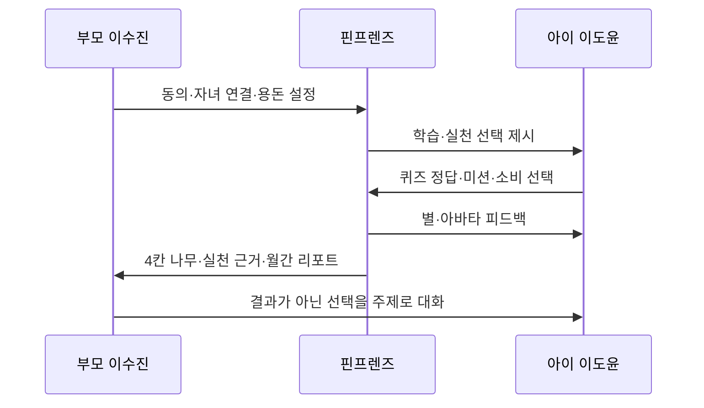
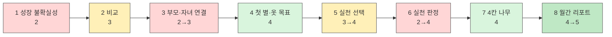

# 핀프렌즈 고객 여정지도(CJM) v1

> **작성일** 2026-08-19  
> **방법론** `05 — 고객 여정지도(CJM) 분석 방법론`  
> **여정 주체** [`페르소나_스펙트럼_v1.md`](페르소나_스펙트럼_v1.md)의 Core 이수진·이도윤 가정  
> **제품 기준** [`기능정의_v12.md`](기능정의_v12.md)

---

## 0. 문서의 지위

핀프렌즈는 신규 제안 서비스이므로 실제 핀프렌즈 사용 데이터가 없다. 따라서 본 문서는 다음을 분리한다.

| 구분 | 의미 | 사용 범위 |
|---|---|---|
| **AS-IS** | 퍼핀 공식 자료·리뷰·팀 직접 확인을 바탕으로 한 현재 여정 | 문제 정의와 전환 지점 파악 |
| **TO-BE** | Core 페르소나와 v12 기능을 연결한 기대 여정 | 프로토타입·인터뷰 검증 대상 |
| **Spectrum Check** | Adjacent·Extreme·Non-user가 같은 여정에서 실패하는 지점 | 포용성·시장 진입 장벽 점검 |

**부모 인터뷰 0건, 아이 인터뷰 0건이다.** TO-BE의 생각·감정·반응은 모두 [합성 가설]이며, 실제 고객의 발언으로 인용하지 않는다. AS-IS의 기능·화면·보상 구조는 관측 근거에 기반하지만, 표 안의 생각·감정 문구는 직접 인용이 아닌 [추론]이다.

---

# 1. 여정 주체와 성공 조건

## 1-1. Core 가정 요약

| 주체 | 역할 | 현재 상황 | 여정의 성공 조건 |
|---|---|---|---|
| **이수진, 39세** | 구매자·법정대리인·성장 확인자 | 용돈 앱을 이미 사용하지만 숫자만으로는 아이의 성장을 판단하기 어려움 | 짧은 확인으로 학습→실천 근거를 이해하고 월 5,900원의 가치를 판단 |
| **이도윤, 만 8세·초2** | 실제 사용자·학습자·소비 주체 | 퀴즈와 보상에 익숙하지만 배운 내용을 소비 선택에 연결하지는 못함 | 스스로 선택·실천하고 즉시 별을 받으며 아바타 목표에 가까워짐 |

## 1-2. 이중 고객 여정의 특성

핀프렌즈에서 부모와 아이의 여정은 별개가 아니다. 한 쪽의 행동이 다른 쪽의 다음 단계를 열거나 막는다.

핵심 실패도 연결된다. 부모의 승인이 느리면 아이의 실천이 별·나무에 반영되지 않고, 아이가 실천하지 않으면 부모의 리포트는 다시 활동량 숫자로 퇴행한다.

---

# 2. 핀프렌즈 고유 여정 단계 도출

## 2-1. 일반 5단계를 그대로 쓰지 않는 이유

`문제 인식 → 탐색 → 의사결정 → 사용 → 유지`만으로는 다음 관문을 설명할 수 없다.

- 부모의 법정대리인 동의와 선불업 제휴 구조 안에서의 자녀 연결
- 아이가 학습만 한 것과 실제로 행동한 것을 가르는 **실천 판정**
- 아이에게는 별·아바타, 부모에게는 4칸 나무로 번역되는 이중 피드백
- 나무는 매달 초기화되지만 월간 리포트와 별은 누적되는 다른 시간 구조

## 2-2. 최종 8단계

| # | 핀프렌즈 고유 단계 | 이 단계가 별도로 필요한 이유 |
|---|---|---|
| 1 | **성장 불확실성 발생** | 용돈·퀴즈 숫자는 있지만 학습과 행동의 연결은 보이지 않는 문제 신호 |
| 2 | **무료 용돈 기능 ↔ 성장 증거 비교** | 무료 아이부자 등이 존재하므로 미션·카드·캐릭터는 구매 이유가 될 수 없음 |
| 3 | **부모 인증·자녀 연결** | 만 14세 미만 동의와 제휴 선불 수단 연결이 실사용을 여는 구조적 게이트 |
| 4 | **첫 별·첫 옷 목표 형성** | 아이는 나무가 아닌 별 잔액·옷장으로 서비스의 보상 규칙을 처음 이해 |
| 5 | **배우기→실천 선택** | 미션, 위치 알림, 결제 회고, 위시리스트가 학습을 실제 돈 행동으로 전환 |
| 6 | **실천 판정·별 2배 확정** | 퀴즈 1개와 실천 추가 1개를 가르는 관문. 승인 지연 시 핵심 루프가 깨짐 |
| 7 | **4칸 나무로 번역** | 아이의 개별 행동을 부모가 이해할 수 있는 이번 달 성장 증거로 변환 |
| 8 | **나무 초기화·리포트 누적·재구독** | 이번 달의 나무는 다시 시작하고, 성장 기록은 쌓이며, 부모가 유료 가치를 다시 판단하는 핀프렌즈 고유의 월간 관문 |

### 리트머스 테스트

`실천 판정·별 2배 확정`, `4칸 나무로 번역`, `나무 초기화·리포트 누적`은 일반 쇼핑·가구·자동차 서비스에 그대로 붙일 수 없다. 이 세 단계가 핀프렌즈 여정의 고유성을 만든다.

---

# 3. Core 고객 여정지도

## 3-1. AS-IS 요약 — 기존 용돈·학습 앱

| 단계 | 고객 행동 | 고객 생각 | 감정 | Pain Point | 핀프렌즈 전환 기회 |
|---|---|---|---|---|---|
| **용돈 교육 필요 자각** | 부모가 용돈을 주고 소비를 지켜봄 | “언제부터 어떻게 가르쳐야 하지?” | 관심·부담 | 부모가 일일이 설명해야 함 | 용돈 행동과 학습을 한 루프로 제시 |
| **용돈계약·보상 충전** | 부모가 학습 보상액을 설정하고 잔액을 충전 | “돈을 넣어두지 않으면 학습도 못 하네” | 순응·불편 | 아이의 학습이 부모 지갑 상태에 종속 | 학습 별을 현금·추가 충전과 분리 |
| **퀴즈·현금 보상 반복** | 아이가 문제를 풀고 보상을 확인 | “틀려도 보상이 있네” | 단기 만족 | 학습보다 보상 획득이 목적이 될 위험 | 정답·실천을 구분한 별 피드백 |
| **학습 현황 숫자 확인** | 부모가 누적일·문제 수·보상액을 확인 | “그래서 어떤 행동이 달라졌지?” | 불확실 | 활동량은 보이지만 실천·성장은 판단하기 어려움 | 실천 조건이 포함된 4칸 나무 |
| **유지·이탈 판단** | 부모는 구독을 재평가하고 아이는 반복 또는 이탈 | “돈은 움직이는데 교육이 되고 있나?” | 신뢰 저하 | 장기 변화를 비교할 자료가 부족 | 월별로 쌓이는 단일 성장 리포트 |

## 3-2. TO-BE 6열 고객 여정지도

> 감정 점수는 실측값이 아닌 **목표 상태에 대한 분석자 가설**이다. 1은 매우 부정, 3은 중립, 5는 매우 긍정을 뜻한다.

| 단계 | 고객 행동 | 고객 생각 | 감정 | Pain Point | 개선 기회 |
|---|---|---|---|---|---|
| **1. 성장 불확실성 발생** | **부모:** 학습 숫자와 결제 내역을 보지만 행동 변화를 알지 못함 **아이:** 퀴즈와 소비를 별개로 반복 | **부모:** “많이 한 건 알겠는데, 성장한 건가?” **아이:** “퀴즈는 퀴즈고, 용돈은 용돈이지” | 2 불확실 | 학습과 실제 돈 행동 사이에 연결 증거가 없음 | ‘금융 콘텐츠 순도’보다 ‘배운 것의 실천’을 문제 메시지로 제시 |
| **2. 무료 용돈 기능 ↔ 성장 증거 비교** | **부모:** 기존 무료 앱과 리포트 예시를 비교 **아이:** 아바타·옷장 미리보기 | **부모:** “미션·카드는 공짜로도 되는데, 이 리포트는 다른가?” **아이:** “내가 꾸미고 싶은 동물이 있나?” | 3 기대·의심 | 기존 무료 대체재가 강하고, 기능 설명만으로는 성장 증거의 가치가 추상적 | 가입 전 커리큘럼, 리포트 샘플, 포함·미포함 항목, 무료 체험을 함께 제시 |
| **3. 부모 인증·자녀 연결** | **부모:** 본인인증→계좌 연결→카드 신청→자녀 초대→카드 등록 **아이:** 알기 쉬운 고지를 보고 초대 수락 | **부모:** “누가 돈을 관리하고 무엇을 보는지 명확한가?” **아이:** “엄마가 내 어떤 내용을 보는 거지?” | 2→3 경계 | 인증·카드·동의 단계가 길고, 소비 공유와 위치 알림이 감시로 인식될 수 있음 | 단계별 진척 저장, 발행·잔액 관리 주체 표시, 아이용 쉬운 고지, 위치 알림 별도 옵트인 |
| **4. 첫 별·첫 옷 목표 형성** | **아이:** 동물을 고르고 첫 학습·퀴즈로 별을 받은 후 옷 목표를 선택 **부모:** 학습 별이 현금과 분리됨을 확인 | **아이:** “몇 개 더 모으면 이 옷을 사지?” **부모:** “퀴즈를 할 때마다 내 지갑에서 돈이 나가지는 않네” | 4 이해·기대 | 7세에게 별 2배·차감·누적 규칙이 복잡할 수 있고, 초기 아이템 매력이 약하면 목표가 생기지 않음 | 첫 1분 안에 별 획득, 살 수 있는 첫 아이템과 장기 목표를 동시 제시, 다음 아이템까지 남은 별 표시 |
| **5. 배우기→실천 선택** | **아이:** 학습 후 미션 수행, 편의점 앞 알림에서 사기·남기기 선택, 결제 후 회고 **부모:** 미션·위시리스트·이자 조건 설정 | **아이:** “지금 쓸까, 내 목표를 위해 남길까?” **부모:** “잔소리 대신 아이가 선택하게 도울 수 있을까?” | 3→4 집중 | 알림이 감시로 느껴지거나, 위치 알림이 잦으면 무시하거나, 온라인 결제에는 사전 개입하지 못함 | 아이가 알림 장소·시점을 함께 설정, 여부 선택 제공, 결제 후 비난이 아닌 짧은 회고 문항 제시 |
| **6. 실천 판정·별 2배 확정** | **아이:** 실천 결과와 승인 대기 상태를 확인 **부모/시스템(개선안):** 미션은 승인, 결제 참기·목표 달성은 자동 판정 | **아이:** “나는 했는데 왜 별이 안 들어왔지?” **부모:** “매번 바로 승인해야 하나?” | 2→4 긴장·인정 | 부모 응답이 느리면 보상과 나무가 멈추고, 실천 신뢰성을 높이면 부모 운영 비용이 커짐 | 자동·승인형 실천 분리, 승인 대기 중에도 기록 보존, 일괄 승인, 승인 지연을 아이 실패로 표시하지 않음 |
| **7. 4칸 나무로 번역** | **부모:** 벌기·잘 쓰기·모으기·키우기 나무와 실천 근거를 확인 **아이:** 별 잔액·옷장의 변화만 확인 | **부모:** “잘 쓰기가 멈춰 있는 이유가 보이네” **아이:** “실천해서 새 옷에 더 가까워졌다” | 4 확신·성취 | 나무가 단순 활동량을 그리거나, 멈춘 이유가 설명되지 않으면 부모의 오해를 키움 | 나무 단계별 학습·정답·실천 조건 표시, 해당 실천 근거로 드릴다운, 비교·비난 대신 대화 주제 제시 |
| **8. 나무 초기화·리포트 누적·재구독** | **부모:** 월간 단일 리포트와 지난달 비교를 보고 구독을 재평가 **아이:** 나무와 무관하게 별 잔액·구매한 옷을 유지 | **부모:** “나무는 다시 시작해도 지난달 성장은 남아 있네” **아이:** “내 별과 옷은 안 사라졌네” | 4→5 안정·확신 | 초기화 이유가 불명하면 성취 삭제로 느끼고, 리포트가 활동 요약에 그치면 유료 가치가 생기지 않음 | 초기화 전 월 마감 예고, 이월되는 별·옷·리포트를 명시, 행동 변화·다음 달 추천을 포함한 월간 리포트 |

## 3-3. 감정 흐름

가장 큰 감정 저점은 **3단계 부모 인증·자녀 연결**과 **6단계 실천 판정**이다. 3단계는 시작 자체를 막고, 6단계는 이미 한 행동을 인정하지 않는 것처럼 보이게 만든다. 두 단계 모두 아이 혼자만의 UX로는 해결할 수 없다.

---

# 4. 핵심 Moment of Truth

| 우선순위 | 순간 | 성공 신호 | 실패 신호 | 연결 가설 |
|---|---|---|---|---|
| **1** | 실천 후 별·나무 반영 | 아이가 실천 직후 인정받았다고 이해 | 승인 지연을 자신의 실패로 인식 | Extreme 백현주·백노아 |
| **2** | 최초 4칸 나무 확인 | 부모가 나무 단계의 구체적 행동 근거를 설명할 수 있음 | 단순 진도·랭킹 표시로 이해 | Core 이수진·이도윤 |
| **3** | 무료 대체재와 리포트 비교 | 가격을 알고도 행동 근거 리포트를 선택 | “미션·카드가 이미 무료인데”로 종료 | Non-user 신가영·신윤슬 |
| **4** | 첫 저축 목표 설정 | 아이가 사고 싶은 대상과 기간을 스스로 선택 | 부모가 목표를 대신 설정 | Adjacent 오하늘·오시윤 |
| **5** | 월말 나무 초기화 | 별·옷·월간 기록이 남는 구조를 부모와 아이가 모두 이해 | 성취가 삭제됐다고 느낌 | Core·Adjacent 공통 |

---

# 5. 페르소나 스펙트럼 Stress Test

| 스펙트럼 | 주 진입 단계 | 가장 자주 실패할 단계 | 추가 Pain Point | 여정 보정 요구 |
|---|---|---|---|---|
| **Core** 이수진·이도윤 | 1 성장 불확실성 | 7 4칸 나무 | 나무와 실천 근거의 연결이 약하면 핵심 가치가 사라짐 | 각 단계에서 해당 실천 기록으로 드릴다운 |
| **Adjacent** 오하늘·오시윤 | 5 배우기→실천 선택 | 4 첫 별·옷 목표 | 옷장이 저축 동기가 아닌 즉시 소비를 학습시키는 장치가 될 수 있음 | 옷 소비와 위시리스트 장기 목표를 별도로 표시 |
| **Extreme** 백현주·백노아 | 5 배우기→실천 선택 | 6 실천 판정 | 부모 승인이 느리면 아이의 보상·나무·신뢰가 동시에 멈춤 | 자동 판정 항목, 승인 대기 보존, 일괄 승인 |
| **Non-user** 신가영·신윤슬 | 2 무료 기능↔성장 증거 비교 | 2에서 진입 중단 | 게임화·미션·카드는 전환 이유가 아니며, 온보딩 비용만 크게 느껴짐 | 가입 전 실제 리포트 샘플과 행동 증거 데모 제공 |

### 스펙트럼 적용 후 바뀌는 설계 우선순위

1. **실천 판정 지연이 아이의 실패로 보이지 않게 한다.**
2. **가입 전에 성장 리포트의 실물 가치를 보여준다.**
3. **나무의 각 단계에 실천 근거를 붙인다.**
4. **별·옷의 즉시 소비와 현실 용돈 저축 목표를 혼동하지 않는다.**
5. **초기화되는 것과 누적되는 것을 월 마감 전에 명시한다.**

---

# 6. Pain Point → 개선 기회 우선순위

| 우선순위 | Pain Point | 영향 단계 | 심각도 | 비즈니스 영향 | 개선 기회 |
|---|---|---|---|---|---|
| **P0** | 부모 승인 지연 시 실천·별·나무 루프가 멈춤 | 6→7→8 | 매우 큼 | 핵심 가치인 ‘실천 증거’의 신뢰 붕괴 | 실천 판정 정책, 자동/승인형 분리, 대기 상태 설계 |
| **P0** | 리포트가 활동량 요약에 머무름 | 7→8 | 매우 큼 | 무료 대체재 대비 구독 근거 소멸 | 행동 근거, 월별 변화, 대화 제안을 포함 |
| **P1** | 본인인증·계좌·카드·자녀 연결이 길고 다시 시작하기 어려움 | 3 | 큼 | 활성화 전 이탈 | 단계별 임시 저장, 재진입, 카드 배송 전 체험 범위 정의 |
| **P1** | 위치 알림이 감시로 인식될 수 있음 | 3→5 | 큼 | 아이 신뢰 저하·옵트인 거부 | 아이 공동 설정, 좌표 미저장, 알기 쉬운 고지 |
| **P1** | 나무 초기화가 성취 삭제로 보임 | 8 | 큼 | 월 경계의 이탈·불신 | 마감 예고, 초기화/누적 대상 비교, 지난달 기록 즉시 열람 |
| **P2** | 아바타 아이템이 약하면 아이 목표가 생기지 않음 | 4 | 중간 | 아이 초기 이탈 | 다양한 가격대와 시각 변화가 큰 아이템 구성 |

---

# 7. 검증 계획

| 우선순위 | 검증 단계 | 핵심 가설 | 방법 | 성공 신호 | 반증 신호 |
|---|---|---|---|---|---|
| **1** | 7 4칸 나무 | 부모가 나무를 행동 성장 증거로 이해 | 5초 노출 후 이해 내용 회상, 실천 근거 탐색 테스트 | 부모가 학습+실천 조건을 자발적으로 설명 | “퀴즈를 많이 풀어서 자랐다”고만 설명 |
| **2** | 6 실천 판정 | 승인 대기가 아이의 성취감을 훼손 | Core·Extreme 가정에 즉시 승인/대기 표시/자동 판정 시안 비교 | 아이가 대기 상태를 실패로 받아들이지 않음 | 승인 전에는 “안 한 것”으로 이해 |
| **3** | 2 비교 | 리포트가 월 5,900원의 가치를 만들 수 있음 | 무료 대체재·핀프렌즈 시안을 가격 포함 비교 | 유료 시안 선택 이유로 행동 근거·확인 시간 절감을 제시 | 기능은 이해하지만 무료 대체재를 선택 |
| **4** | 5 실천 선택 | 위치 알림이 아이의 자기 선택을 촉진 | 문구점·편의점 상황 태스크 테스트 | 아이가 알림을 “내가 선택하는 기회”로 설명 | 위치 추적·부모 감시로 설명하거나 즉시 닫음 |
| **5** | 8 월 마감 | 초기화와 누적의 구분을 모두 이해 | 초기화 전·후 프로토타입 설명 테스트 | 나무만 초기화되고 별·옷·리포트는 남는다고 회상 | 별도 사라지거나 성취 전체가 삭제된다고 이해 |

> 인터뷰에서 “이 기능이 좋은가요?”를 묻지 않는다. 시안을 보여준 후 **무엇을 이해했는지, 다음에 무엇을 할 것인지, 어느 지점에서 멈춰서는지**를 관찰한다.

---

# 8. 근거 추적

| 여정 판단에 쓴 사실 | 출처 | 상태 |
|---|---|---|
| 퍼핀 학습 현황은 누적일·문제 수·보상액 숫자 3개 중심 | [`페인포인트_근거보강.md`](../혜원/고객분석/페인포인트_근거보강.md), E-11 | [관측] |
| 퍼핀은 부모의 학습보상 설정·잔액 충전 후 퀴즈 시작 가능 | [`04_도움말.md`](../병윤/04_퍼핀원문/04_도움말.md) Q4 | [관측] |
| 금전 보상은 유지해야 하며, 별은 돈을 대체하는 것이 아니라 실천·누적을 보완 | [`하영/06_개선기회확정/README.md`](../하영/06_개선기회확정/README.md) | [관측+설계] |
| 별은 옷 구매 시 차감되고 월 초기화되지 않음 | [`기능정의_v12.md`](기능정의_v12.md) §1·4 | [설계 확정] |
| 나무는 부모 화면 전용이며 학습·정답·실천 조건을 모두 채워야 성장 | 동일 문서 §3 | [설계 확정] |
| 나무는 매달 초기화, 월간 리포트는 4칸을 하나로 정리해 누적 | 동일 문서 §3·5-1 | [설계 확정] |
| 위치 알림은 옵트인·좌표 미저장 정책이 필요 | [`정책설계_근거추적.md`](../병윤/02_정책설계/정책설계_근거추적.md) P-19 | [일부 미검증] |
| 만 14세 미만은 법정대리인 동의·확인이 필요하고, 아동용 알기 쉬운 고지가 필요 | 동일 문서 P-05·P-12 | [법령 확인] |

---

# 9. 한계와 사용 금지선

- TO-BE의 생각·감정 점수·대사는 전부 [합성 가설]이다.
- 아이 직접 인터뷰가 없으므로 아이 트랙을 확인된 행동으로 인용하지 않는다.
- ‘금융 콘텐츠 집중’은 고객 요구로 확인되지 않았으므로 핵심 여정 단계로 두지 않았다.
- 실천 자동 판정·일괄 승인은 v12에서 확정된 기능이 아니라 Extreme 여정이 드러낸 **개선 기회**다.
- 구독 가치와 월 5,900원 지불의향은 직접 조사 전이므로 재구독 감정을 성공 예측으로 쓰지 않는다.
- 기존 [`고객여정지도.md`](../혜원/고객분석/고객여정지도.md)는 AS-IS 근거와 이전 가설을 확인하는 참고 문서다. 본 문서의 TO-BE와 충돌하는 친구 기능·초기 별 규칙·카드 범위는 v12를 따른다.

---

## 최종 요약

핀프렌즈의 고객 여정은 ‘앱을 찾고 쓰다’가 아니라, **성장이 안 보이는 상태에서 시작해 아이의 실천이 별·나무로 번역되고 월간 기록으로 남는 과정**이다.

이 여정의 성패를 가르는 관문은 두 곳이다. **부모 인증·자녀 연결**은 사용 시작을 가르고, **실천 판정**은 서비스의 핵심 약속인 ‘배운 것을 했으면 인정받는다’를 가른다. 마지막으로 월간 리포트가 단순 활동 요약을 넘어야만 Non-user의 무료 대체재 장벽을 넘고 재구독 가치가 생긴다.
