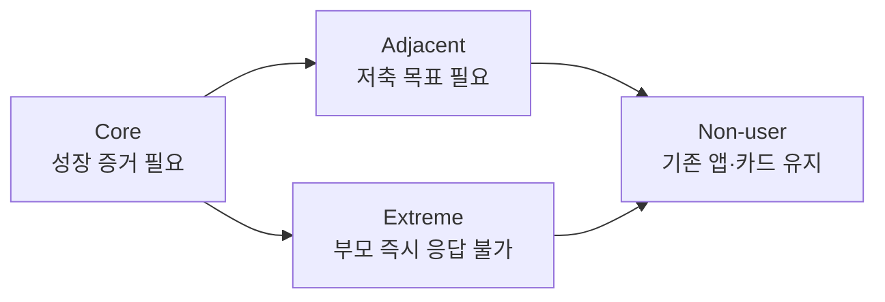
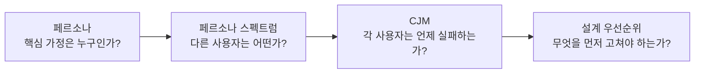

# 핀프렌즈 페르소나 스펙트럼·고객 여정지도 쉬운 설명

> **목적** 페르소나 스펙트럼과 고객 여정지도를 처음 보는 팀원도 핀프렌즈 분석 결과를 빠르게 이해하도록 설명한다.  
> **기준 문서** [`페르소나_스펙트럼_v1.md`](페르소나_스펙트럼_v1.md) · [`고객여정지도_v1.md`](고객여정지도_v1.md) · [`기능정의_v13.md`](기능정의_v13.md)  
> **이용 모델** 부모·아이 무료, 월 구독 없음

---

## 1. 30초 요약

세 분석은 서로 다른 질문에 답한다.

| 분석 | 쉽게 말하면 | 핵심 질문 |
|---|---|---|
| **페르소나** | 대표 사용자를 구체적인 한 가정으로 그린 것 | “우리가 가장 먼저 해결할 사람은 누구인가?” |
| **페르소나 스펙트럼** | 핵심 사용자 주변의 다른 사용자·실패 상황·비사용자까지 넓혀 보는 것 | “누가 다르게 쓰고, 누가 자주 실패하며, 누가 아예 안 쓰는가?” |
| **고객 여정지도(CJM)** | 고객이 서비스를 알고 시작해 반복 사용하기까지의 과정을 시간순으로 보는 것 | “고객은 언제 무엇을 하고, 어디서 막히는가?” |

한 문장으로 연결하면 다음과 같다.

> **페르소나로 ‘누구’를 정하고, 스펙트럼으로 ‘다른 사람들’을 확인하고, CJM으로 ‘언제 왜 실패하는지’를 찾는다.**

---

## 2. 핀프렌즈는 왜 ‘가정’을 페르소나로 보는가

핀프렌즈는 한 사람만 쓰는 서비스가 아니다.

| 아이 | 부모 |
|---|---|
| 학습, 퀴즈, 미션, 소비·저축 실천 | 법정대리인 동의, 자녀·카드 연결, 미션 설정, 리포트 확인 |
| 별을 받고 아바타를 꾸밈 | 4칸 나무와 월간 리포트로 성장을 확인 |
| 사용을 멈추면 아이 루프가 종료 | 연결을 끊으면 가정 전체의 사용이 종료 |

따라서 페르소나도 **부모 1명+아이 1명**의 가정 단위로 만들었다.

### 핵심 페르소나

**이수진·이도윤 가정**은 용돈 앱을 이미 쓰고 있다. 도윤은 퀴즈를 풀고 보상을 받지만, 배운 내용을 실제 소비·저축 선택에 잘 연결하지 못한다. 수진은 퀴즈 수와 보상액은 보지만, 그것이 성장인지는 판단하기 어렵다.

> **핵심 문제:** 아이가 얼마나 많이 했는지는 보이지만, 배운 것이 실제 행동으로 이어졌는지는 보이지 않는다.

핀프렌즈는 이 문제를 다음과 같이 풀고자 한다.

```text
배우기 → 퀴즈 → 실제 행동 → 별·나무에 반영 → 부모가 성장 확인
```

---

## 3. 페르소나 스펙트럼은 무엇인가

핵심 페르소나 하나만 보면 ‘잘 맞는 사용자’만 보게 된다. 스펙트럼은 일부러 다른 사용자와 실패 상황까지 넣어 제품이 어디서 약해지는지 확인하는 방법이다.

| 유형 | 핀프렌즈 대표 가정 | 쉽게 설명하면 | 제품에 던지는 질문 |
|---|---|---|---|
| **Core** | 이수진·이도윤 | 성장 증거가 가장 필요한 핵심 가정 | “나무와 리포트가 진짜 행동 변화를 보여주는가?” |
| **Adjacent** | 오하늘·오시윤 | 큰 소비 문제는 없지만 저축할 목표가 없는 인접 가정 | “아이가 스스로 모을 이유를 만들 수 있는가?” |
| **Extreme** | 백현주·백노아 | 교대 근무로 부모가 미션을 바로 승인하기 어려운 극단 제약 가정 | “부모 응답이 느려도 아이의 성취가 사라지지 않는가?” |
| **Non-user** | 신가영·신윤슬 | 기존 앱·카드를 이미 잘 쓰고 있어 무료여도 옮길 이유가 없는 가정 | “카드 중복·기록 분산을 감수할 만큼 차별점이 있는가?” |

### 중요한 해석

- Core만 만족시키면 ‘정상적으로 자주 사용하는 가정’에서만 잘 돌아갈 수 있다.
- Extreme을 보면 **부모 승인 지연**이 아이의 별·나무·성취감을 모두 멈출 수 있음을 알 수 있다.
- Non-user를 보면 서비스가 무료여도 자동으로 사용하지 않는다는 점을 알 수 있다.
- 따라서 차별점은 미션·카드·캐릭터 자체가 아니라 **실천 근거가 포함된 성장 증거**여야 한다.



---

## 4. 고객 여정지도는 무엇인가

페르소나가 ‘사람’을 설명한다면, CJM은 그 사람이 겪는 **시간의 흐름**을 설명한다.

핀프렌즈는 일반적인 `문제 인식 → 탐색 → 사용 → 유지`를 그대로 쓰지 않았다. 핀프렌즈에서만 중요한 관문을 별도 단계로 나누었다.

| 단계 | 고객에게 일어나는 일 | 핵심 질문 | 가장 큰 위험 |
|---|---|---|---|
| **1. 성장 불확실성 발생** | 부모가 퀴즈 수·보상액을 보고도 성장을 판단하지 못함 | 실제 행동 변화가 보이는가? | 문제를 부모가 중요하게 느끼지 않을 수 있음 |
| **2. 기존 서비스↔성장 증거 비교** | 기존 앱을 계속 쓸지 핀프렌즈로 옮길지 판단 | 무료여도 옮길 만큼 다른가? | 카드 중복·기록 분산·재가입 번거로움 |
| **3. 부모 인증·자녀 연결** | 동의, 계좌, 카드, 자녀 초대를 진행 | 누가 돈과 데이터를 관리하는가? | 복잡한 온보딩과 감시에 대한 경계 |
| **4. 첫 별·첫 옷 목표** | 아이가 동물을 고르고 첫 별을 받음 | 아이가 다시 접속할 목표가 생겼는가? | 규칙이 복잡하거나 아이템이 매력 없을 수 있음 |
| **5. 배우기→실천 선택** | 아이가 미션, 소비 알림, 결제 회고, 저축 목표를 실행 | 배운 내용을 실제 선택에 써보는가? | 위치 알림을 감시로 느끼거나 무시할 수 있음 |
| **6. 실천 판정·별 2배 확정** | 실천이 인정되면 추가 별을 받음 | 아이가 한 행동이 제때 인정되는가? | 부모 승인이 느리면 아이가 실패로 느낄 수 있음 |
| **7. 4칸 나무로 번역** | 아이의 행동이 부모용 성장 증거로 변환됨 | 나무가 활동량이 아니라 실천을 보여주는가? | 나무가 왜 멈췄는지 알 수 없으면 오해가 생김 |
| **8. 나무 초기화·리포트 누적** | 나무는 새 달에 다시 시작하고, 별·옷·월간 리포트는 남음 | 다음 달에도 계속 쓸 이유가 있는가? | 나무 초기화를 성취 삭제로 오해할 수 있음 |

### 핀프렌즈에서만 중요한 세 단계

1. **실천 판정:** 배운 것을 실제로 했는지 가르는 관문이다.
2. **4칸 나무로 번역:** 아이의 행동을 부모가 이해할 수 있는 성장 증거로 바꾸는 단계다.
3. **나무 초기화·리포트 누적:** 이번 달은 새로 도전하되 지난 성장은 지우지 않는 구조다.

이 세 단계는 다른 일반 서비스에 그대로 붙이기 어렵다. 따라서 핀프렌즈 CJM의 고유한 단계라고 볼 수 있다.

---

## 5. 스펙트럼과 CJM은 어떻게 연결되는가

같은 고객 여정을 따라가도 페르소나 유형마다 다른 곳에서 실패한다.

| 유형 | CJM에서 가장 중요한 단계 | 실패 이유 | 필요한 설계 |
|---|---|---|---|
| **Core** | 7. 4칸 나무 | 나무와 실제 행동 근거가 연결되지 않으면 핵심 가치가 사라짐 | 나무 단계에서 해당 실천 기록으로 이동 |
| **Adjacent** | 4~5. 목표 형성·실천 선택 | 옷 구매만 강조하면 실제 저축 목표가 약해짐 | 옷 목표와 현실 용돈 저축 목표를 분리 |
| **Extreme** | 6. 실천 판정 | 부모 승인이 느리면 별·나무·성취감이 동시에 멈춤 | 승인 대기 표시, 일괄 승인, 자동 판정 가능한 행동 분리 |
| **Non-user** | 2. 기존 서비스 비교 | 무료여도 카드 중복·기록 분산·온보딩이 번거로움 | 가입 전 리포트 데모, 카드 연결 전 체험, 기존 앱과 병행 사용 경로 |

이 관계를 흐름으로 보면 다음과 같다.



---

## 6. 한 가정의 여정으로 다시 보기

Core 이수진·이도윤 가정을 예로 들면 다음과 같다.

1. 수진은 도윤이 퀴즈를 많이 풀었다는 것은 알지만 소비 습관이 나아졌는지는 모른다.
2. 기존 앱과 핀프렌즈를 비교하며, 새 카드와 자녀 연결을 할 만큼 리포트가 다른지 확인한다.
3. 도윤은 첫 퀴즈를 풀고 별을 받아 사고 싶은 아바타 옷을 정한다.
4. 편의점 앞에서 “지금 사기”와 “목표를 위해 남기기” 중 하나를 선택한다.
5. 그 선택이 실천으로 인정되면 추가 별을 받는다.
6. 수진은 ‘잘 쓰기’ 나무와 실천 기록을 보고 도윤과 구체적인 대화를 한다.
7. 월말에 나무는 초기화되지만 별·옷·월간 리포트는 남아 다음 달 성장과 비교할 수 있다.

이 여정이 성공하려면 단순히 ‘앱이 재미있다’로는 부족하다. **실천이 제때 인정되고, 그 근거가 나무와 월간 리포트에 정확히 연결**되어야 한다.

---

## 7. 분석에서 나온 핵심 결론

### 1. 핀프렌즈의 핵심 가치는 ‘기능이 많음’이 아니다

미션, 카드, 퀴즈, 캐릭터는 기존 서비스에도 있다. 핀프렌즈의 핵심 가치는 **배운 것이 실제 행동으로 이어졌는지 보여주는 것**이다.

### 2. 무료여도 사용자는 자동으로 옮겨오지 않는다

가격 장벽은 없어졌지만 기존 앱, 카드, 사용 기록, 습관이 남아 있다. 따라서 가입 전에 리포트를 보여주고, 카드 연결 전에 핵심 가치를 체험할 수 있어야 한다.

### 3. 가장 위험한 관문은 ‘실천 판정’이다

아이가 실천했는데 부모가 바로 승인하지 못하면, 아이에게는 ‘내가 안 한 것’처럼 보일 수 있다. 이는 별, 나무, 리포트의 신뢰를 함께 깨뜨린다.

### 4. 월간 리포트는 과금 수단이 아니라 반복 사용 이유다

핀프렌즈는 무료 서비스다. 월간 리포트의 역할은 돈을 받는 것이 아니라 부모가 다시 앱을 열고, 아이와 대화하고, 다음 달에도 연결을 유지하게 만드는 것이다.

---

## 8. 발표할 때는 이렇게 설명하면 된다

### 1분 설명문

> “저희는 부모와 아이를 하나의 가정 페르소나로 봤습니다. 핵심 가정은 기존 용돈 앱을 쓰고 있지만, 아이가 많이 했는지만 보일 뿐 실제로 성장했는지는 확인하기 어려운 가정입니다.
>
> 핵심 사용자만 보지 않고, 저축 목표가 필요한 인접 사용자, 부모 승인이 느린 극단 사용자, 기존 앱을 계속 쓰는 비사용자까지 스펙트럼으로 확장했습니다.
>
> 그리고 이 가정들이 어디서 막히는지 확인하기 위해 고객 여정을 8단계로 나누었습니다. 가장 중요한 관문은 아이의 실천을 제때 인정하는 단계와, 그 실천을 부모용 4칸 나무와 월간 리포트로 바꾸는 단계입니다. 결국 핀프렌즈의 차별점은 기능 수가 아니라 학습과 실천을 연결한 성장 증거입니다.”

### 발표에서 피할 표현

| 피할 말 | 왜 피해야 하는가 | 대신 쓸 말 |
|---|---|---|
| “이런 부모가 있습니다” | 인터뷰 0건으로 실존을 증명하지 못함 | “이런 조건의 부모를 가설로 정의했습니다” |
| “부모는 금융 콘텐츠만 원합니다” | 해당 요구는 리뷰에서 확인되지 않음 | “금융 집중 요구는 인터뷰로 검증할 가설입니다” |
| “무료라서 모두 쓸 겁니다” | 카드 중복·신뢰·온보딩 장벽이 남아 있음 | “무료화로 가격 장벽은 낮추지만 전환 비용은 별도로 검증해야 합니다” |
| “나무가 자라면 금융 실력이 올랐습니다” | 나무는 설계된 대리 지표이지 실제 역량 측정치가 아님 | “나무는 학습·정답·실천이 함께 있었음을 보여줍니다” |

---

## 9. 반드시 기억할 한계

현재 부모 인터뷰와 아이 인터뷰는 모두 0건이다. 이름, 대사, 감정, 상황은 관측 자료를 조합해 만든 **합성 가설**이다.

따라서 이 분석의 역할은 “이 고객이 실제로 존재한다”를 증명하는 것이 아니라, 다음을 정하는 것이다.

- 어떤 조건의 가정을 만나야 하는가
- 어떤 순서로 프로토타입을 보여줘야 하는가
- 어떤 반응이 나오면 가설을 유지하거나 폐기해야 하는가
- 제품의 어느 관문을 가장 먼저 개선해야 하는가

---

## 최종 한 문장

> **핀프렌즈는 ‘성장을 확인하고 싶은 가정’을 핵심으로 두되, 목표가 다른 가정·제약이 큰 가정·아예 쓰지 않는 가정까지 확장해 보고, 그들이 고객 여정의 어느 단계에서 실패하는지를 찾아 학습→실천→성장 증거 루프를 완성하는 서비스다.**
