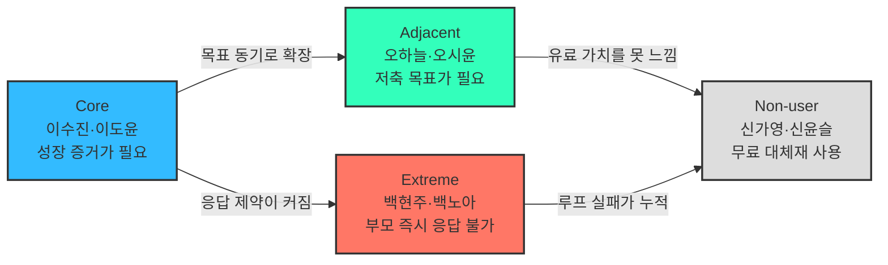

# 핀프렌즈 페르소나 · 페르소나 스펙트럼 v1

> **작성일** 2026-08-19  
> **기준** `05 — 페르소나 · 페르소나 스펙트럼 분석 방법론`  
> **제품 기준** [`기능정의_v12.md`](기능정의_v12.md)  
> **후보 풀** [`페르소나_10가정.md`](페르소나_10가정.md)

---

## 0. 문서의 지위와 판독 규칙

**부모 인터뷰 0건, 아이 인터뷰 0건이다.** 이 문서의 인물·대사·감정·상황은 시장·리뷰·제품 근거를 조합해 만든 **[합성 가설]**이지 실재 고객의 진술이 아니다.

| 구분 | 의미 | 사용 규칙 |
|---|---|---|
| **[관측]** | 공식 자료·리뷰·통계에서 확인 | 출처와 함께 발표 근거로 사용 가능 |
| **[추론]** | 관측 자료를 연결한 해석 | 반대 가능성을 함께 표기 |
| **[합성 가설]** | 페르소나를 구체화하기 위해 생성 | 인터뷰 모집·설계에만 사용 |

이 문서는 “이런 사람이 있다”를 증명하지 않는다. **“이 조건의 사람을 만나 어떤 가설을 검증할지”**를 정의한다.

---

# 1. 핵심 페르소나

## 1-1. 왜 ‘가정 단위’로 작성하는가

핀프렌즈는 사용자와 구매자가 다른 이중 고객 서비스다.

| 역할 | 아이 | 부모 |
|---|---|---|
| 핵심 행동 | 학습, 퀴즈, 미션, 소비·저축 실천, 별·아바타 사용 | 동의, 결제, 용돈·미션 설정, 리포트 확인 |
| 성공 판단 | “재미있고 내가 잘해지는 느낌이 든다” | “배운 것이 실제 행동으로 이어지고 있다” |
| 이탈 권한 | 사용을 안 함 | 구독·용돈 연결을 중단함 |

따라서 부모나 아이 한 명만으로는 핵심 루프의 성공·실패를 설명할 수 없다. 본 문서의 기본 단위는 **부모 1명 + 아이 1명의 가정 페르소나**다.

## 1-2. 주 페르소나 — 이수진 · 이도윤 가정 [합성 가설]

> **한 줄 정의**  
> 용돈 앱을 이미 쓰고 있지만, 퀴즈 수·사용일·보상금만으로는 아이의 금융 성장을 판단하기 어려운 초등 2학년 가정.

| 항목 | 부모 — **이수진, 39세** | 아이 — **이도윤, 만 8세·초2** |
|---|---|---|
| 역할 | 구매자·관리자·해석자 | 실제 사용자·학습자 |
| 상황 | 맞벌이, 디지털 용돈 앱 7개월차 | 매주 8,000원, 퀴즈와 캐릭터 보상에 익숙 |
| 반복 행동 | 주 1회 학습 현황과 결제 내역을 확인 | 퀴즈는 빠르게 풀고, 용돈은 하교 후 간식에 주로 사용 |
| 목표 | 아이가 얼마나 풀었는지가 아니라 **무엇을 실천하게 됐는지** 알고 싶음 | 돈을 잘 쓰고 모으는 방법을 스스로 알고 싶음 |
| 고충 | 숫자는 쌓이지만 그것이 성장인지 판단할 수 없음 | 정답·보상은 즉시 느끼지만 오래 배운 느낌은 약함 |
| 대체재 | 현행 용돈 앱, 엑셀·메모, 구두 지도 | 현금 용돈, 무료 퀴즈, 캐릭터 게임 |
| 결정 기준 | 월 5,900원으로 **부모의 확인 시간이 줄고 행동 변화가 보이는가** | 실천하면 바로 보상받고 아바타가 달라지는가 |

### 핵심 JTBD

> 아이에게 용돈을 줄 때, 단순히 지급과 소비를 관리하는 것을 넘어, **배운 것이 실제 돈 행동으로 이어지고 있음을 확인**하고 싶다. 그래야 교육이 되고 있다는 확신을 갖고 계속 사용할 수 있다.

### 상황 시나리오

1. 수진은 도윤이 퀴즈를 꾸준히 풀었다는 숫자는 보지만, 소비 습관이 나아졌는지는 모른다.
2. 도윤은 하교길 편의점 앞에서 위치 알림을 보고 “지금 사기 / 목표를 위해 남기기”를 한 번 선택한다.
3. 귀가 후 결제 내역에서 선택을 돌아보고, 실천 별을 추가로 받는다.
4. 수진은 일간 리포트의 ‘잘 쓰기’ 나무와 실천 기록을 보고 구체적인 대화를 시작한다.
5. 월말에는 나무는 초기화되지만, 월간 리포트는 누적되어 이전 달과 비교한다.

### 핵심 요구와 기능 연결

| 우선순위 | 필요 | 핀프렌즈 응답 | 성공 조건 |
|---|---|---|---|
| 1 | 학습이 행동으로 이어졌는지 확인 | 4칸 나무 + 일간·월간 리포트 | 퀴즈만으로는 나무가 자라지 않음 |
| 2 | 소비 전·후에 스스로 생각할 기회 | 위치 알림 + 결제 내역 회고 | 감시가 아닌 아이의 선택으로 인식 |
| 3 | 현금 보상에 의존하지 않는 즉시 피드백 | 퀴즈 1개, 실천 시 추가 1개의 별 | 행동 직후 즉시 지급 |
| 4 | 아이가 스스로 다시 접속할 이유 | 동물 아바타 + 옷장 | 별 잔액은 월 초기화되지 않음 |

### 가장 위험한 가정

| 가정 | 반증되는 신호 | 설계 영향 |
|---|---|---|
| 부모는 금융 성장의 집중 표시를 원한다 | 부모가 한국사·어휘 혼합을 문제로 느끼지 않고 오히려 선호 | ‘금융 순도’ 대신 ‘학습→실천 성장 증거’를 전면에 둔다 |
| 나무와 리포트가 월 5,900원의 가치를 만든다 | 무료 대체재 사용자가 리포트를 보고도 지불을 거부 | 구독 단독 모델과 리포트 혜택 재정의 |
| 위치 알림이 소비 전 정지 신호로 작동한다 | 아이가 감시로 느끼거나 알림을 무시 | 옵트인·아이용 고지·좌표 미저장 정책 강화 |

---

# 2. 페르소나 스펙트럼

## 2-1. 도출 기준

| 유형 | 핀프렌즈에서의 판단 기준 | 핵심 질문 |
|---|---|---|
| **Core** | 부모 관여도와 아이 금융행동 개선 니즈가 모두 높음 | 성장 리포트와 실천 연결이 구독 이유가 되는가? |
| **Adjacent** | 유사한 용돈·습관 문제는 있지만 성장 증명이 최우선은 아님 | 어떤 다른 진입 기능이 핵심 가치로 연결되는가? |
| **Extreme** | 시간·기기·응답 지연 등 제약으로 핵심 루프가 자주 실패 | 부모가 즉시 관여하지 못해도 아이의 실천이 인정되는가? |
| **Non-user** | 무료 대체재·신뢰·가격·온보딩 장벽으로 핀프렌즈를 회피 | 기존 무료 서비스를 두고 전환할 충분한 이유가 있는가? |

## 2-2. 1차 후보 생성 — 기존 10가정의 스펙트럼 재분류

| 유형 | 후보 | 해당 이유 |
|---|---|---|
| **Core** | H1 정미경, H2 배성우, H3 문세라, H4 강동혁 | 관여 의지와 구체적 행동 문제가 모두 존재 |
| **Adjacent** | H5 오하늘, H8 임태경 | 저축 동기 또는 소비 통제가 일차 목적 |
| **Extreme** | H6 류지원, H9 백현주 | 기기 공유·짧은 집중 시간·교대 근무로 루프가 중단됨 |
| **Non-user** | H7 신가영, H10 곽민석 | 무료 대체재를 이미 쓰거나 문제 인식과 지불의향이 낮음 |

> H8은 행동 문제가 강하지만 교육·성장 확인 의도가 낮아 Adjacent로 분류했다. H7은 키즈 금융 서비스 사용자이지만 **핀프렌즈의 비사용자**라는 의미에서 Non-user다.

## 2-3. 2차 평가 및 선별

평가 점수는 조사 수치가 아닌 **분석자 판단값**이다. 1점은 낮음, 5점은 높음이며 통계로 인용하지 않는다.

| 유형 | 선정 가정 | 문제 현실성 | 핵심 가치 적합 | 맥락 대표성 | 실패 학습가치 | 선정 이유 |
|---|---:|---:|---:|---:|---:|---|
| **Core** | H1 정미경 | 5 | 5 | 5 | 4 | ‘숫자는 있지만 성장은 안 보임’이라는 핵심 문제를 가장 직접적으로 보여줌 |
| **Adjacent** | H5 오하늘 | 5 | 4 | 4 | 4 | 문제 사용자가 아니라 ‘목표가 없는 잔액’ 사용자를 포함해 저축 동기 설계를 검증 |
| **Extreme** | H9 백현주 | 5 | 5 | 4 | 5 | 부모 승인 지연이 별·나무·리포트 전체의 신뢰를 깨뜨리는 구조적 실패를 드러냄 |
| **Non-user** | H7 신가영 | 5 | 5 | 5 | 5 | 무료 78만 계정 대체재 대비 구독 가치를 가장 엄격하게 검증 |

## 2-4. 3차 보정 — 대표 스펙트럼 카드

Core는 H1의 문제 구조를 따르되, 기존 페르소나를 그대로 복제하지 않고 1절의 주 페르소나로 다시 썼다. Adjacent·Extreme·Non-user는 후보 풀에서 선별된 H5·H9·H7을 사용한다. 모두 실존 고객이 아닌 [합성 가설]이다.

### Core — 이수진 · 이도윤 가정

| 항목 | 내용 |
|---|---|
| **문제** | 사용일·풀이 수·보상은 보이지만 학습이 실제 행동으로 이어졌는지 알 수 없음 |
| **목표** | 금융 학습과 소비·저축 실천의 연결을 짧은 시간 안에 확인 |
| **감정 동기** | 교육 비용과 관심이 헛되지 않았다는 확신 |
| **대체 솔루션** | 기존 용돈 앱 학습 현황, 결제 내역, 구두 대화 |
| **첫 가치 순간** | 실천 없이는 자라지 않는 4칸 나무와 월간 성장 비교를 보는 순간 |
| **설계 우선순위** | 리포트의 해석 가능성, 행동 근거 추적, 부모 확인 시간 최소화 |

### Adjacent — 오하늘 · 오시윤 가정

| 항목 | 내용 |
|---|---|
| **문제** | 아이가 돈을 낭비하지는 않지만, 모을 이유와 목표가 없음 |
| **목표** | 저축을 부모의 지시가 아닌 아이의 목표 달성 경험으로 바꾸기 |
| **감정 동기** | “모으라”는 잔소리 없이 아이가 스스로 선택하길 바람 |
| **대체 솔루션** | 돼지저금통, 부모 이자, 저축 스티커판 |
| **첫 가치 순간** | 위시리스트 목표와 예적금·부모 저축의 결과를 비교할 때 |
| **설계 우선순위** | 목표 진척 피드백, 초등 저학년용 이자 표현, 오래 모으는 성공 경험 |

### Extreme — 백현주 · 백노아 가정

| 항목 | 내용 |
|---|---|
| **제약** | 부모가 교대 근무로 알림을 며칠 뒤 확인하며, 미션 승인이 즉시 이루어지지 않음 |
| **반복 실패** | 아이가 실천해도 별과 나무에 반영되지 않아 ‘내가 안 한 것’처럼 보임 |
| **감정 동기** | 부모는 운영 부담을 줄이고 싶고, 아이는 하자마자 인정받고 싶음 |
| **대체 솔루션** | 즉시 현금 지급, 메신저로 완료 보고, 승인 생략 |
| **설계 기회** | 결제 참기·목표 달성 등 자동 판정 가능한 실천, 일괄 승인, 승인 대기 상태 표시 |
| **포용성 합격 기준** | 부모가 48시간 응답하지 않아도 아이의 핵심 루프가 완전히 멈추지 않음 |

### Non-user — 신가영 · 신윤슬 가정

| 항목 | 내용 |
|---|---|
| **회피 이유** | 무료 아이부자로 이미 용돈·카드·미션을 사용하며 새 앱과 월 5,900원이 필요하지 않음 |
| **인식** | 게임화나 캐릭터는 기존 서비스와 다를 것이 없음 |
| **감정 동기** | 기능 중복과 불필요한 교육비 지출을 피하고 싶음 |
| **전환 조건** | 리포트가 기존 결제 내역으로는 알 수 없는 행동 변화를 보여주고, 확인 시간을 실제로 줄여줌 |
| **복귀 조건** | 무료 체험 후에도 부모가 ‘기존 앱+대화’보다 낫지 않다고 판단하면 비사용자로 남음 |
| **시장 합격 기준** | 가격을 감춘 뒤가 아니라, 성장 증거의 독자 가치로 전환 의향이 발생 |

## 2-5. 4차 교차검증 결과

| 검증 축 | 현재 판단 | 근거 | 남은 위험 |
|---|---|---|---|
| 시장 존재 가능성 | **중간** | 초등 1~3학년 97.6만 명, 저축 교육 희망 65.8%와 아이 실제 저축 12.8%의 격차 | 관여도×문제강도의 교차 통계가 없음 |
| 핵심 문제 존재 | **중간** | 퍼핀이 학습의 의도와 다르게 작동하는 사례를 인정, 국내 경쟁사 공개 자료에서 학습→성취 구간 공백 | 아이 직접 진술 0건, 리뷰 지지 3건으로 약함 |
| 금융 집중 요구 | **낮음** | 퀴즈에 비금융 과목이 혼합된 구조는 확인 | 부모가 혼합을 문제로 느낀다는 리뷰 0건, 유일 관련 리뷰는 역방향 |
| 비금전 보상 적합성 | **중간** | 돈이 학습 동기였다는 리뷰 126건, 게임화는 초등에서 효과가 크지만 내재동기 악화 반증도 존재 | 별·아바타의 지속 사용 효과는 미검증 |
| 구독 가능성 | **낮음~중간** | 사교육비 지불 여력은 있으나, 무료 게임화 키즈 금융 서비스가 이미 크게 보급 | 월 5,900원에 대한 직접 지불의향 조사 없음 |

초기 결론은 **Core 존재 가능성은 있지만, 금융 집중 요구와 구독 전환은 증명되지 않았다**는 것이다. 따라서 페르소나의 중심 문장은 “금융만 가르쳐 달라”가 아니라 **“배운 것이 실천으로 이어졌는지 확인하고 싶다”**로 유지한다.

## 2-6. 5차 통합 — Spectrum Map

### 스펙트럼이 만든 제품 원칙

| 원칙 | 도출 근거 | 요구사항 |
|---|---|---|
| **부모 승인이 느려도 아이의 성취를 지우지 않는다** | Extreme | 승인 대기 표시, 일괄 승인, 자동 판정 실천 분리 |
| **성장 지표는 활동량이 아니라 학습+실천을 함께 보여준다** | Core | 퀴즈만으로 나무 성장 불가, 행동 근거 표시 |
| **저축은 통제가 아니라 목표로 설계한다** | Adjacent | 위시리스트, 목표 진척, 이자 비교 |
| **무료 대체재와 같은 기능은 차별점으로 주장하지 않는다** | Non-user | 게임화·미션·카드가 아닌 성장 증거를 첫 가치로 제시 |
| **아이의 소비 개입은 감시가 아닌 자기 선택으로 보여준다** | Core·Extreme | 위치 알림 옵트인, 좌표 미저장, 아이용 쉬운 고지 |

---

# 3. 검증 계획

## 3-1. 스크리너

| 확인 항목 | 모집 질문 | 분류 |
|---|---|---|
| 아이 연령 | 초등 1~3학년 자녀가 있나요? | 공통 |
| 용돈 경험 | 용돈을 주기적으로 주고 있나요? | 공통 |
| 현재 대체재 | 현금, 은행·용돈 앱, 엑셀 중 무엇을 쓰나요? | Core·Non-user |
| 부모 관여 가능 시간 | 미션 완료를 보통 얼마나 빨리 확인할 수 있나요? | Extreme |
| 저축 목표 | 아이가 자신이 모으고 싶은 대상을 정한 적이 있나요? | Adjacent |
| 지불 저항 | 용돈 앱의 월 5,900원 유료 기능을 결정할 때 가장 먼저 보는 것은 무엇인가요? | Non-user |

## 3-2. 우선 검증 질문과 판정

| 우선순위 | 검증 가설 | 인터뷰·테스트 질문 | 유지 신호 | 반증 신호 |
|---|---|---|---|---|
| 1 | 부모는 학습→실천 성장 증거를 원한다 | “용돈 앱에서 아이가 성장했다고 판단하려면 무엇이 보여야 하나요?” | 실제 선택·습관 변화를 자발적으로 요구 | 오직 지출 통제·잔액 확인만 요구 |
| 2 | 금융 집중이 필요하다 | “금융 앱 퀴즈에 한국사·어휘가 섞여 있는 것을 알고 계셨나요? 어떻게 느끼시나요?” | 금융 학습의 분류·집중 표시를 원함 | 다양한 교과 콘텐츠를 더 선호 |
| 3 | 리포트가 월 5,900원의 가치를 만든다 | 무료 대체재와 핀프렌즈 리포트 시안을 함께 보여주고 선택 이유를 묻는다 | 가격을 알고도 유료 시안을 선택하며 행동 근거를 이유로 듬 | 리포트를 이해해도 무료 서비스를 선택 |
| 4 | 부모 즉시 응답 없이도 실천 루프가 작동해야 한다 | 교대·야근 가정에서 승인형·자동형 미션 프로토타입을 비교 | 자동 판정에서 완료율·신뢰가 높음 | 부모 승인 없이는 교육적 신뢰가 생기지 않음 |
| 5 | 위치 알림이 감시가 아닌 선택 지원으로 받아들여진다 | 문구점·편의점 상황의 아이용 알림을 보여주고 의미를 묻는다 | 아이가 ‘내가 선택하는 알림’으로 설명 | 부모의 위치 추적·감시로 설명 |

## 3-3. 모집 권고안

최소 8가정을 모집한다. Core 3, Adjacent 2, Extreme 2, Non-user 1을 기본으로 하되, **무료 대체재 사용자 2명 이상**과 **부모 응답이 하루 이상 느린 가정 2명 이상**을 포함한다. 아이 당사자 조사는 법정대리인 동의와 알기 쉬운 언어로 별도 진행한다.

---

# 4. 근거 추적

| 분석에 쓴 핵심 사실 | 출처 | 상태 |
|---|---|---|
| 주 타깃은 초등 1~3학년, 용돈 시작 평균 만 8.4세 | [`TAM-SAM-SOM_시장세분화.md`](../유림/시장분석/TAM-SAM-SOM_시장세분화.md) | [관측] |
| 부모 저축 교육 희망 65.8%, 아이 실제 저축 12.8% | 동일 문서 §4 | [관측] |
| 퍼핀에 15단계 경제금융 커리큘럼이 존재 | [`하영/06_개선기회확정/README.md`](../하영/06_개선기회확정/README.md) E2 | [관측] |
| 학습 성장감의 아이 직접 리뷰 근거는 없고, 관련 리뷰도 3건 | [`pain_point_evidence_final.md`](../하영/01_리뷰분석/pain_point_evidence_final.md) | [관측] |
| 금융 집중을 요구하는 부모 리뷰는 0건, 관련 1건은 역방향 | 동일 문서 | [관측] |
| 무료 아이부자 자녀 계정이 78만에 달함 | [`TAM-SAM-SOM_시장세분화.md`](../유림/시장분석/TAM-SAM-SOM_시장세분화.md) §3 | [관측] |
| 별은 옷 구매 시 차감, 월 초기화 없음; 나무는 월 초기화; 리포트는 누적 | [`기능정의_v12.md`](기능정의_v12.md) §1·4 | [설계 확정] |
| 위치 알림은 옵트인·좌표 미저장 정책이 필요 | [`정책설계_근거추적.md`](../병윤/02_정책설계/정책설계_근거추적.md) P-19 | [일부 미검증] |

---

# 5. 한계와 사용 금지선

- 페르소나의 이름·직업·대사·세부 에피소드는 전부 합성 가설이다.
- Core·Adjacent·Extreme·Non-user 비중은 시장 비중이 아니다. 포용성과 실패 맥락을 점검하기 위한 분석 구조다.
- 초등 1~3학년 타깃과 4개 시장 세그먼트는 관련 통계에 기반하지만, 관여도×행동문제 교차 비율은 관측값이 아니다.
- 인터뷰 전에는 본 문서의 대사를 “고객이 이렇게 말했다”로 인용하지 않는다.
- 인터뷰 후에는 검증된 행동과 진술만 남기고, 반증된 가정은 삭제하지 말고 취소선과 이유를 남긴다.

---

## 최종 요약

**핵심 페르소나**는 ‘아이에게 돈을 주고 학습앱도 쓰게 하지만, 그 결과가 실제 금융 행동으로 이어졌는지 확인하기 어려운 초등 저학년 가정’이다. 핀프렌즈의 주 가치는 기능 수가 아니라 **학습→실천→성장 증거**다.

스펙트럼은 Core의 구독 가치만 보지 않고, Adjacent의 저축 동기, Extreme의 부모 응답 제약, Non-user의 무료 대체재 장벽까지 설계에 반영한다. 이 네 유형을 모두 견디지 못하면 ‘성장 증거’는 타깃 설명에만 머무르고 실제 사용 루프로 완성되지 않는다.
