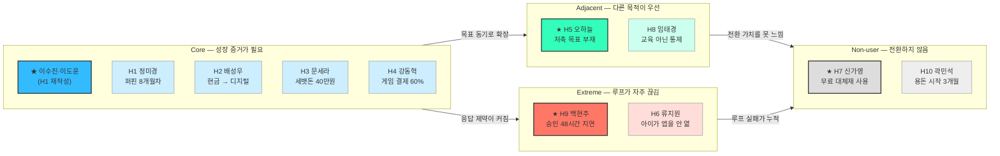

# 핀프렌즈 페르소나 · 페르소나 스펙트럼 v1

> **작성일** 2026-08-19  
> **기준** `05 — 페르소나 · 페르소나 스펙트럼 분석 방법론`  
> **제품 기준** [`기능정의_v12.md`](기능정의_v12.md)  
> **후보 풀** [`페르소나_10가정.md`](페르소나_10가정.md)
> **이용 모델** 부모·아이 무료 · 월 구독 없음
> **여정** [`고객여정지도_v3.md`](고객여정지도_v3.md) — 본 문서 11가정 전원의 10단계 여정
>
> **2026-08-20 갱신** 후보 풀 **10가정 전원**을 §2-2 프로필 · §2-3 전원 채점 · §2-4 카드에 노출했다. 선별 결과(Core H1 / Adjacent H5 / Extreme H9 / Non-user H7)는 그대로 두되, **미선정 가정이 각각 무엇을 드러내는지**를 함께 남긴다.

> ⚠️ 후보 풀의 ‘월 5,900원’·지불의향 항목은 이전 유료 모델의 역사적 가정이다. 본 문서의 분류·선별·검증에서는 사용하지 않는다.

---

## 0. 문서의 지위와 판독 규칙

**부모 인터뷰 0건, 아이 인터뷰 0건이다.** 이 문서의 인물·대사·감정·상황은 시장·리뷰·제품 근거를 조합해 만든 **[합성 가설]**이지 실재 고객의 진술이 아니다.

| 구분 | 의미 | 사용 규칙 |
|---|---|---|
| **[관측]** | 공식 자료·리뷰·통계에서 확인 | 출처와 함께 발표 근거로 사용 가능 |
| **[추론]** | 관측 자료를 연결한 해석 | 반대 가능성을 함께 표기 |
| **[합성 가설]** | 페르소나를 구체화하기 위해 생성 | 인터뷰 모집·설계에만 사용 |

이 문서는 “이런 사람이 있다”를 증명하지 않는다. **“이 조건의 사람을 만나 어떤 가설을 검증할지”**를 정의한다.

---

# 1. 핵심 페르소나

## 1-1. 왜 ‘가정 단위’로 작성하는가

핀프렌즈는 아이가 실제로 사용하고 부모가 가입·연결·지속 사용을 결정하는 이중 고객 서비스다. 부모는 이용료를 내는 구매자가 아니라 **법정대리인·가입 결정자·용돈 연결자**다.

| 역할 | 아이 | 부모 |
|---|---|---|
| 핵심 행동 | 학습, 퀴즈, 미션, 소비·저축 실천, 별·아바타 사용 | 동의, 자녀·카드 연결, 용돈·미션 설정, 리포트 확인 |
| 성공 판단 | “재미있고 내가 잘해지는 느낌이 든다” | “배운 것이 실제 행동으로 이어지고 있다” |
| 이탈 권한 | 사용을 안 함 | 자녀·용돈·카드 연결을 중단함 |

따라서 부모나 아이 한 명만으로는 핵심 루프의 성공·실패를 설명할 수 없다. 본 문서의 기본 단위는 **부모 1명 + 아이 1명의 가정 페르소나**다.

## 1-2. 주 페르소나 — 이수진 · 이도윤 가정 [합성 가설]

> **한 줄 정의**  
> 용돈 앱을 이미 쓰고 있지만, 퀴즈 수·사용일·보상금만으로는 아이의 금융 성장을 판단하기 어려운 초등 2학년 가정.

| 항목 | 부모 — **이수진, 39세** | 아이 — **이도윤, 만 8세·초2** |
|---|---|---|
| 역할 | 법정대리인·가입 결정자·관리자·해석자 | 실제 사용자·학습자 |
| 상황 | 맞벌이, 디지털 용돈 앱 7개월차 | 매주 8,000원, 퀴즈와 캐릭터 보상에 익숙 |
| 반복 행동 | 주 1회 학습 현황과 결제 내역을 확인 | 퀴즈는 빠르게 풀고, 용돈은 하교 후 간식에 주로 사용 |
| 목표 | 아이가 얼마나 풀었는지가 아니라 **무엇을 실천하게 됐는지** 알고 싶음 | 돈을 잘 쓰고 모으는 방법을 스스로 알고 싶음 |
| 고충 | 숫자는 쌓이지만 그것이 성장인지 판단할 수 없음 | 정답·보상은 즉시 느끼지만 오래 배운 느낌은 약함 |
| 대체재 | 현행 용돈 앱, 엑셀·메모, 구두 지도 | 현금 용돈, 무료 퀴즈, 캐릭터 게임 |
| 결정 기준 | **기존 앱·카드를 두고 전환할 만큼 확인 시간이 줄고 행동 변화가 보이는가** | 실천하면 바로 보상받고 아바타가 달라지는가 |

### 핵심 JTBD

> 아이에게 용돈을 줄 때, 단순히 지급과 소비를 관리하는 것을 넘어, **배운 것이 실제 돈 행동으로 이어지고 있음을 확인**하고 싶다. 그래야 교육이 되고 있다는 확신을 갖고 계속 사용할 수 있다.

### 상황 시나리오

1. 수진은 도윤이 퀴즈를 꾸준히 풀었다는 숫자는 보지만, 소비 습관이 나아졌는지는 모른다.
2. 도윤은 하교길 편의점 앞에서 위치 알림을 보고 “지금 사기 / 목표를 위해 남기기”를 한 번 선택한다.
3. 귀가 후 결제 내역에서 선택을 돌아보고, 실천 별을 추가로 받는다.
4. 수진은 일간 리포트의 ‘잘 쓰기’ 나무와 실천 기록을 보고 구체적인 대화를 시작한다.
5. 월말에는 나무는 초기화되지만, 월간 리포트는 누적되어 이전 달과 비교한다.

### 핵심 요구와 기능 연결

| 우선순위 | 필요 | 핀프렌즈 응답 | 성공 조건 |
|---|---|---|---|
| 1 | 학습이 행동으로 이어졌는지 확인 | 4칸 나무 + 일간·월간 리포트 | 퀴즈만으로는 나무가 자라지 않음 |
| 2 | 소비 전·후에 스스로 생각할 기회 | 위치 알림 + 결제 내역 회고 | 감시가 아닌 아이의 선택으로 인식 |
| 3 | 현금 보상에 의존하지 않는 즉시 피드백 | 퀴즈 1개, 실천 시 추가 1개의 별 | 행동 직후 즉시 지급 |
| 4 | 아이가 스스로 다시 접속할 이유 | 동물 아바타 + 옷장 | 별 잔액은 월 초기화되지 않음 |

### 가장 위험한 가정

| 가정 | 반증되는 신호 | 설계 영향 |
|---|---|---|
| 부모는 금융 성장의 집중 표시를 원한다 | 부모가 한국사·어휘 혼합을 문제로 느끼지 않고 오히려 선호 | ‘금융 순도’ 대신 ‘학습→실천 성장 증거’를 전면에 둔다 |
| 나무와 리포트가 전환·지속 사용의 이유를 만든다 | 기존 앱 사용자가 리포트를 보고도 카드·기록 이전 번거로움으로 전환을 거부 | 가입 전 데모, 카드 연결 전 체험, 기록 이전·병행 사용 방안 재정의 |
| 위치 알림이 소비 전 정지 신호로 작동한다 | 아이가 감시로 느끼거나 알림을 무시 | 옵트인·아이용 고지·좌표 미저장 정책 강화 |

---

# 2. 페르소나 스펙트럼

## 2-1. 도출 기준

| 유형 | 핀프렌즈에서의 판단 기준 | 핵심 질문 |
|---|---|---|
| **Core** | 부모 관여도와 아이 금융행동 개선 니즈가 모두 높음 | 성장 리포트와 실천 연결이 전환·지속 사용 이유가 되는가? |
| **Adjacent** | 유사한 용돈·습관 문제는 있지만 성장 증명이 최우선은 아님 | 어떤 다른 진입 기능이 핵심 가치로 연결되는가? |
| **Extreme** | 시간·기기·응답 지연 등 제약으로 핵심 루프가 자주 실패 | 부모가 즉시 관여하지 못해도 아이의 실천이 인정되는가? |
| **Non-user** | 기존 대체재·신뢰·카드 중복·기록 이전·온보딩 장벽으로 핀프렌즈를 회피 | 가격이 0원이어도 기존 서비스를 두고 전환할 이유가 충분한가? |

## 2-2. 1차 후보 생성 — 후보 풀 10가정 전원

### 유형별 분류

| 유형 | 후보 | 해당 이유 |
|---|---|---|
| **Core** | H1 정미경 · H2 배성우 · H3 문세라 · H4 강동혁 | 관여 의지와 구체적 행동 문제가 모두 존재 |
| **Adjacent** | H5 오하늘 · H8 임태경 | 저축 동기 또는 소비 통제가 일차 목적 |
| **Extreme** | H6 류지원 · H9 백현주 | 기기 공유·짧은 집중 시간·교대 근무로 루프가 중단됨 |
| **Non-user** | H7 신가영 · H10 곽민석 | 기존 대체재를 이미 쓰거나 문제 인식과 전환 필요가 낮음 |

> H8은 행동 문제가 강하지만 교육·성장 확인 의도가 낮아 Adjacent로 분류했다. H7은 키즈 금융 서비스 사용자이지만 **핀프렌즈의 비사용자**라는 의미에서 Non-user다.

### 10가정 프로필

| 코드 | 유형 | 부모 | 아이 | 한 줄 상태 | 진입 후크 | 이탈 트리거 |
|---|---|---|---|---|---|---|
| **H1** | Core | 정미경 (39) 교사 | 정하율 (초2·8세) | 퍼핀 8개월차 — 숫자는 쌓이는데 확신은 안 쌓임 | 🌳 나무 · 📊 월간 리포트 | 나무가 2주 넘게 정체 |
| **H2** | Core | 배성우 (42) 카페 | 배주안 (초3·9세) | 현금 봉투 용돈 — 소비 데이터가 아예 없음 | 📍 위치 알림 | 온보딩이 현금 습관보다 번거로움 |
| **H3** | Core | 문세라 (37) 프리랜서 | 문지호 (초3·9세) | 세뱃돈 40만원이 어디 갔는지 모름 | 💳 결제 내역 | 앱 외부 현금이 범위 밖 |
| **H4** | Core | 강동혁 (45) 주 양육자 | 강루아 (초3·9세) | 게임 아이템 결제로 용돈 60% 증발 | 💳 결제 내역 | 옷장이 게임 스킨에 밀림 → **아이 이탈** |
| **H5** | Adjacent | 오하늘 (38) 약사 | 오시윤 (초2·8세) | 낭비는 안 하는데 모을 이유가 없음 | 🎯 위시리스트 | 이자 체감 부족 |
| **H8** | Adjacent | 임태경 (43) 물류업 | 임서준 (초2·8세) | 편의점 소비 통제가 목적, 교육 의도 없음 | 📍 위치 알림 *(감시로 오해)* | 소비가 안 줄면 1개월 내 해지 |
| **H6** | Extreme | 류지원 (36) 맞벌이 | 류하민 (초1·7세) | 기기 공유 · 3일차에 앱을 안 엶 | 🐾 아바타·옷장 | 3일차 → **아이 이탈** |
| **H9** | Extreme | 백현주 (40) 교대 근무 | 백노아 (초2·8세) | 시간이 없어 미션 승인을 못 함 | 🧹 미션 루프 | 미승인 미션 3건 누적 |
| **H7** | Non-user | 신가영 (41) 은행원 | 신윤슬 (초3·9세) | 아이부자(무료) 사용 중 — 불만이 없음 | 📊 월간 리포트 | 카드 중복 · 기록 분산 |
| **H10** | Non-user | 곽민석 (35) IT | 곽서아 (초1·7세) | 용돈 시작 3개월차 — 무엇부터인지 모름 | 🐾 3D 아바타 | 온보딩 5단계 완주 실패 |

### ⚠️ 시장 세그먼트와 스펙트럼 유형은 다른 축이다

후보 풀은 **시장 세그먼트**(부모 관여도 × 아이 문제 강도)로 나뉘어 있고, 본 문서는 **핵심 루프의 성공·실패 맥락**으로 다시 나눈다. 두 축이 어긋나는 가정이 넷 있으므로 인용할 때 혼동하지 않아야 한다.

| 코드 | 후보 풀의 시장 세그먼트 | 본 문서의 스펙트럼 유형 | 재분류 사유 |
|---|---|---|---|
| **H6** | ② 금융습관 관리형 | **Extreme** | 관여도가 아니라 **기기 공유·저연령 제약**이 루프를 끊는다 |
| **H7** | ② 금융습관 관리형 | **Non-user** | 문제가 아니라 **기존 대체재**가 전환을 막는다 |
| **H8** | ③ 용돈 소비통제형 | **Adjacent** | 문제는 강하나 **성장 증명이 목적이 아니다** |
| **H9** | ③ 용돈 소비통제형 | **Extreme** | 소비 문제가 아니라 **부모 응답 지연**이 핵심 실패다 |

> 나머지 여섯 가정(H1~H5 · H10)은 두 축의 분류가 일치한다.

## 2-3. 2차 평가 및 선별

평가 점수는 조사 수치가 아닌 **분석자 판단값**이다. 1점은 낮음, 5점은 높음이며 통계로 인용하지 않는다.

| 유형 | 가정 | 문제 현실성 | 핵심 가치 적합 | 맥락 대표성 | 실패 학습가치 | 판정 | 사유 |
|---|---|---:|---:|---:|---:|:-:|---|
| **Core** | **H1 정미경** | 5 | 5 | 5 | 4 | ✅ **선정** | ‘숫자는 있지만 성장은 안 보임’이라는 핵심 문제를 가장 직접적으로 보여줌 |
| Core | H2 배성우 | 5 | 4 | 4 | 4 | ⬜ 후보 | 현금→디지털 전환 맥락은 중요하나, 성장 증명이 아니라 **위치 알림 검증** 트랙에 가깝다 |
| Core | H3 문세라 | 4 | 3 | 3 | 4 | ⬜ 후보 | 앱 외부 현금(세뱃돈)은 인터뷰가 아니라 **서비스 범위 결정** 사안이다 |
| Core | H4 강동혁 | 5 | 3 | 3 | 5 | ⬜ 후보 | 문제는 선명하나 **현 설계에 대응 기능이 없어**(온라인 결제 사전 개입 부재) 핵심 가치 적합이 낮다 |
| **Adjacent** | **H5 오하늘** | 5 | 4 | 4 | 4 | ✅ **선정** | 문제 사용자가 아니라 ‘목표가 없는 잔액’ 사용자를 포함해 저축 동기 설계를 검증 |
| Adjacent | H8 임태경 | 5 | 2 | 4 | 5 | ⬜ 후보 | 원하는 것이 교육이 아니라 **통제**라 성공 기준 자체가 다르다 — 타깃 경계 판정용 |
| **Extreme** | **H9 백현주** | 5 | 5 | 4 | 5 | ✅ **선정** | 부모 승인 지연이 별·나무·리포트 전체의 신뢰를 깨뜨리는 구조적 실패를 드러냄 |
| Extreme | H6 류지원 | 5 | 4 | 4 | 5 | ⬜ 후보 | **아이 이탈**이라는 별도 축을 드러내나, 유형당 1가정 원칙에 따라 H9에 자리를 내줌 |
| **Non-user** | **H7 신가영** | 5 | 5 | 5 | 5 | ✅ **선정** | 78만 계정 대체재를 두고도 카드·기록 전환을 감수할 수 있는지 가장 엄격하게 검증 |
| Non-user | H10 곽민석 | 3 | 3 | 3 | 3 | ⬜ 후보 | 문제 강도가 가장 약하고 CAC가 가장 높아 1차 타깃이 아니다 |

### 🔴 미선정 가정 중 셋은 선정 가정이 못 잡는 축을 갖고 있다

선별은 **유형당 1가정** 원칙을 따랐지만, 그 결과 다음 세 축이 대표 4가정에서 빠진다. [`고객여정지도_v3.md`](고객여정지도_v3.md)에서 11가정 여정을 그린 뒤 드러난 것이다.

| 빠지는 축 | 해당 가정 | 왜 중요한가 | 대응 |
|---|---|---|---|
| **아이가 먼저 이탈하는 경로** | **H6 · H4** | 아이가 나가면 부모 화면은 **빈 상태로 정상 작동**하므로, 부모 지표만으로는 이탈 원인을 알 수 없다 | §3-3 모집안에 H6형을 Extreme 2번 슬롯으로 포함 |
| **위치 알림의 상반된 해석** | **H2 · H4 · H8** | 같은 기능이 H2에서는 최적 적중, H4에서는 무용, H8에서는 감시로 인식된다 | H2형·H8형을 각각 모집해 대조 |
| **타깃 경계** | **H8** | 교육이 아니라 통제를 원하는 부모는 **애초에 타깃이 아닐 수 있다** | 포기 여부를 인터뷰로 판정 |

> 따라서 §3-3 모집안(8가정)은 선정 4가정만이 아니라 **H2 · H4 · H6 · H8을 포함**해 구성한다.

## 2-4. 3차 보정 — 대표 스펙트럼 카드

Core는 H1의 문제 구조를 따르되, 기존 페르소나를 그대로 복제하지 않고 1절의 주 페르소나로 다시 썼다. Adjacent·Extreme·Non-user는 후보 풀에서 선별된 H5·H9·H7을 사용한다. 모두 실존 고객이 아닌 [합성 가설]이다.

**카드는 두 종류다.** 선정 4가정은 **전체 카드**(6필드)로, 미선정 6가정은 **후보 카드**(4필드)로 남긴다. 깊이는 다르지만 **10가정 전원이 카드로 존재한다** — 인터뷰에서 선정 가정이 반증되면 후보 카드에서 대체 가정을 바로 꺼낼 수 있어야 하기 때문이다.

### ★ Core 선정 — 이수진 · 이도윤 가정 *(H1 재작성)*

| 항목 | 내용 |
|---|---|
| **문제** | 사용일·풀이 수·보상은 보이지만 학습이 실제 행동으로 이어졌는지 알 수 없음 |
| **목표** | 금융 학습과 소비·저축 실천의 연결을 짧은 시간 안에 확인 |
| **감정 동기** | 교육 비용과 관심이 헛되지 않았다는 확신 |
| **대체 솔루션** | 기존 용돈 앱 학습 현황, 결제 내역, 구두 대화 |
| **첫 가치 순간** | 실천 없이는 자라지 않는 4칸 나무와 월간 성장 비교를 보는 순간 |
| **설계 우선순위** | 리포트의 해석 가능성, 행동 근거 추적, 부모 확인 시간 최소화 |

#### Core 후보 4가정

**H1 · 정미경 · 정하율** — 위 Core 대표의 원본이 된 가정. 대표 카드가 담지 않은 **퍼핀 8개월 실사용 이력**이 이 가정의 고유 조건이다.

| 항목 | 내용 |
|---|---|
| **문제** | 8개월치 데이터가 쌓였는데도 누적 숫자(116일·75문제·6,650원)는 성장의 증거가 되지 못함 |
| **이 가정만의 조건** | 경쟁 서비스 실사용자 — 차이는 빨리 알아보지만 **기존 기록을 옮길 방법이 없다** |
| **결정적 순간** | 하율이 첫 주에 별을 다 써서 옷을 삼 → 월간 리포트의 **「총 획득 별」이 유일한 누적 증거**가 됨 |
| **드러내는 설계 질문** | 검증과제 ①의 **(b) 시나리오 대표** — 미경은 비금융 퀴즈를 “그것도 공부니까 좋다”고 답할 수 있다. 그러면 「금융 순도」를 차별점에서 내려야 한다 |

**H2 · 배성우 · 배주안** — 현금 봉투에서 디지털로 넘어오는 가정.

| 항목 | 내용 |
|---|---|
| **문제** | 현금으로 주니 **소비 데이터가 아예 존재하지 않아**, 무엇을 가르쳐야 할지도 모름 |
| **이 가정만의 조건** | 학교 앞 문구점이라는 **고정 동선** + 소액 반복 구매 |
| **결정적 순간** | 문구점 앞 알림에서 ‘남기기’를 선택하고, 결제 내역에 ‘참음’이 자동으로 남는 순간 |
| **드러내는 설계 질문** | 검증과제 ②의 **최적 관측 대상**. 동시에 전환 비용의 기준선이 **현금의 ‘5초’**여서 온보딩 5단계가 상대적으로 가장 큰 비용으로 체감된다 |

**H3 · 문세라 · 문지호** — 앱 밖의 큰돈이 있는 가정.

| 항목 | 내용 |
|---|---|
| **문제** | 가장 교육 효과가 큰 금액(세뱃돈 40만원)이 **서비스 범위 밖**이라 매년 교육 기회가 사라짐 |
| **이 가정만의 조건** | 아이가 “내 돈인데 왜 내가 못 써?”라고 항의 — **소유감과 통제권의 불일치** |
| **결정적 순간** | 온보딩에서 “세뱃돈도 넣을 수 있나요?”를 묻고, “안 된다”는 답에 **“그럼 반쪽이네”**로 이어지는 지점 |
| **드러내는 설계 질문** | 기능정의 §8의 「앱 외부 현금 제외」가 **합리적 절단인지 회피인지.** 부모 수동 충전으로 유입 가능하면 이 이탈은 막힌다 |

**H4 · 강동혁 · 강루아** — 소비가 앱 안에서 일어나는 가정.

| 항목 | 내용 |
|---|---|
| **문제** | 게임 아이템에 월 용돈의 60%가 하루에 소진 — **오프라인 소비보다 판단 시간이 짧다** |
| **이 가정만의 조건** | 📍 위치 알림이 **무용지물**이라 차별점의 절반이 사라진 채로 진입 |
| **결정적 순간** | 루아가 옷장을 보고 “게임 스킨이 훨씬 나은데”라고 말하는 순간 → **아이 동기가 즉시 꺼짐** |
| **드러내는 설계 질문** | **온라인 결제 사전 개입이 설계에 없다.** 그리고 상용 게임과 비교되는 순간 옷장은 하위호환이 된다 |

### ★ Adjacent 선정 — H5 오하늘 · 오시윤 가정

| 항목 | 내용 |
|---|---|
| **문제** | 아이가 돈을 낭비하지는 않지만, 모을 이유와 목표가 없음 |
| **목표** | 저축을 부모의 지시가 아닌 아이의 목표 달성 경험으로 바꾸기 |
| **감정 동기** | “모으라”는 잔소리 없이 아이가 스스로 선택하길 바람 |
| **대체 솔루션** | 돼지저금통, 부모 이자, 저축 스티커판 |
| **첫 가치 순간** | 위시리스트 목표와 예적금·부모 저축의 결과를 비교할 때 |
| **설계 우선순위** | 목표 진척 피드백, 초등 저학년용 이자 표현, 오래 모으는 성공 경험 |

#### Adjacent 후보 — H8 · 임태경 · 임서준

목표가 교육이 아니라 **통제**인 가정. 타깃 경계를 판정하기 위해 남긴다.

| 항목 | 내용 |
|---|---|
| **문제** | 개입 수단이 “그만 좀 사” 한마디뿐이라 반복될수록 효과는 떨어지고 관계만 상함 |
| **이 가정만의 조건** | 아이의 소비 동기가 욕구가 아니라 **또래 관계** — 절약 요구가 아이에게는 관계 포기로 들림 |
| **결정적 순간** | 위치 알림을 **“어디 있는지 알려주는 기능”**으로 이해한 채 옵트인 → 아이는 “엄마가 나 보고 있는 거야?”로 받아들임 |
| **드러내는 설계 질문** | 검증과제 ④(위치정보법 P-19). **부모가 감시 목적으로 동의하면 옵트인은 쉬워지고 아이 신뢰는 시작부터 깨진다.** 아이용 고지 문구가 필수이며, 더 근본적으로 **이 가정이 타깃인지 아닌지**를 결정해야 한다 |

### ★ Extreme 선정 — H9 백현주 · 백노아 가정

| 항목 | 내용 |
|---|---|
| **제약** | 부모가 교대 근무로 알림을 며칠 뒤 확인하며, 미션 승인이 즉시 이루어지지 않음 |
| **반복 실패** | 아이가 실천해도 별과 나무에 반영되지 않아 ‘내가 안 한 것’처럼 보임 |
| **감정 동기** | 부모는 운영 부담을 줄이고 싶고, 아이는 하자마자 인정받고 싶음 |
| **대체 솔루션** | 즉시 현금 지급, 메신저로 완료 보고, 승인 생략 |
| **설계 기회** | 결제 참기·목표 달성 등 자동 판정 가능한 실천, 일괄 승인, 승인 대기 상태 표시 |
| **포용성 합격 기준** | 부모가 48시간 응답하지 않아도 아이의 핵심 루프가 완전히 멈추지 않음 |

#### Extreme 후보 — H6 · 류지원 · 류하민

**아이가 먼저 이탈하는** 가정. 선정 가정(H9)이 못 잡는 축이다.

| 항목 | 제약·내용 |
|---|---|
| **제약** | 스마트폰이 **부모 폰 공유** — 아이가 원할 때 열 수 없고 접속이 부모 일정에 종속됨 |
| **반복 실패** | 교육앱 3개를 깔았고 전부 2주 내 방치. 부모에게 **이탈이 이미 학습된 경험** |
| **결정적 순간** | 3일차. 하민이 **「별 2배」 규칙을 이해하지 못하고** 앱을 열지 않음 |
| **포용성 합격 기준** | 만 7세가 **“무엇을 하면 별을 두 개 받는지”를 스스로 말할 수 있다** |
| **드러내는 설계 질문** | 아이 화면의 실천 유도 장치가 **「별 2배」 하나뿐**이다. 7세에게 안 통하면 아이 화면 설계 전체를 다시 봐야 한다. 또한 **아이가 나가도 부모 화면은 빈 상태로 정상 작동**하므로 부모 지표로는 원인을 알 수 없다 |

### ★ Non-user 선정 — H7 신가영 · 신윤슬 가정

| 항목 | 내용 |
|---|---|
| **회피 이유** | 아이부자로 이미 용돈·카드·미션을 사용하며, 새 카드 연결·자녀 초대·사용 기록 분산을 감수할 이유가 없음 |
| **인식** | 게임화나 캐릭터는 기존 서비스와 다를 것이 없음 |
| **감정 동기** | 기능 중복, 복잡한 재가입, 자녀 데이터·카드 분산을 피하고 싶음 |
| **전환 조건** | 리포트가 기존 결제 내역으로는 알 수 없는 행동 변화를 보여주고, 확인 시간을 실제로 줄여줌 |
| **복귀 조건** | 카드 연결 전 체험 후에도 부모가 ‘기존 앱+대화’보다 낫지 않다고 판단하면 비사용자로 남음 |
| **시장 합격 기준** | 무료라는 이유가 아니라, 성장 증거·확인 시간 절감의 독자 가치로 카드·자녀 연결 의향이 발생 |

#### Non-user 후보 — H10 · 곽민석 · 곽서아

용돈을 이제 막 시작한 가정. **문제 강도가 가장 약한데 전환 비용은 동일하게 부과**되는 사례다.

| 항목 | 내용 |
|---|---|
| **회피 이유** | 문제 인식 → 교육 → 전환의 **2단계가 추가로 필요해** CAC가 가장 높음 |
| **인식** | 금융이 아니라 **3D 동물 캐릭터**로 진입 — 부모의 기대와 아이의 기대가 처음부터 다름 |
| **전환 조건** | **카드 없이 시작할 수 있는 경로** — “7살한테 카드까지 만들어줘야 하나”가 실제 중단 지점 |
| **드러내는 설계 질문** | 아이 눈높이 용어(벌기·잘 쓰기·모으기·키우기)가 만 7세에게 통하는지, 특히 **「키우기 = 저절로 늘어나요」(복리)** 가 7세 인지 발달 단계에서 이해되는지 |

## 2-5. 4차 교차검증 결과

| 검증 축 | 현재 판단 | 근거 | 남은 위험 |
|---|---|---|---|
| 시장 존재 가능성 | **중간** | 초등 1~3학년 97.6만 명, 저축 교육 희망 65.8%와 아이 실제 저축 12.8%의 격차 | 관여도×문제강도의 교차 통계가 없음 |
| 핵심 문제 존재 | **중간** | 퍼핀이 학습의 의도와 다르게 작동하는 사례를 인정, 국내 경쟁사 공개 자료에서 학습→성취 구간 공백 | 아이 직접 진술 0건, 리뷰 지지 3건으로 약함 |
| 금융 집중 요구 | **낮음** | 퀴즈에 비금융 과목이 혼합된 구조는 확인 | 부모가 혼합을 문제로 느낀다는 리뷰 0건, 유일 관련 리뷰는 역방향 |
| 비금전 보상 적합성 | **중간** | 돈이 학습 동기였다는 리뷰 126건, 게임화는 초등에서 효과가 크지만 내재동기 악화 반증도 존재 | 별·아바타의 지속 사용 효과는 미검증 |
| 전환·활성화 가능성 | **중간** | 이용료 장벽은 없지만 기존 대체재와 카드·기록·습관이 이미 형성 | 자녀 연결·카드 등록·첫 실천 완료율 미검증 |

초기 결론은 **Core 존재 가능성은 있지만, 금융 집중 요구와 기존 서비스에서의 전환·활성화는 증명되지 않았다**는 것이다. 따라서 페르소나의 중심 문장은 “금융만 가르쳐 달라”가 아니라 **“배운 것이 실천으로 이어졌는지 확인하고 싶다”**로 유지한다.

## 2-6. 5차 통합 — Spectrum Map

★ = 선정 가정. 나머지는 후보 가정이며 §2-4에 후보 카드로 남아 있다.

### 스펙트럼이 만든 제품 원칙

| 원칙 | 도출 근거 | 요구사항 |
|---|---|---|
| **부모 승인이 느려도 아이의 성취를 지우지 않는다** | Extreme | 승인 대기 표시, 일괄 승인, 자동 판정 실천 분리 |
| **성장 지표는 활동량이 아니라 학습+실천을 함께 보여준다** | Core | 퀴즈만으로 나무 성장 불가, 행동 근거 표시 |
| **저축은 통제가 아니라 목표로 설계한다** | Adjacent | 위시리스트, 목표 진척, 이자 비교 |
| **무료 대체재와 같은 기능은 차별점으로 주장하지 않는다** | Non-user | 게임화·미션·카드가 아닌 성장 증거를 첫 가치로 제시 |
| **아이의 소비 개입은 감시가 아닌 자기 선택으로 보여준다** | Core·Extreme | 위치 알림 옵트인, 좌표 미저장, 아이용 쉬운 고지 |

---

# 3. 검증 계획

## 3-1. 스크리너

| 확인 항목 | 모집 질문 | 분류 |
|---|---|---|
| 아이 연령 | 초등 1~3학년 자녀가 있나요? | 공통 |
| 용돈 경험 | 용돈을 주기적으로 주고 있나요? | 공통 |
| 현재 대체재 | 현금, 은행·용돈 앱, 엑셀 중 무엇을 쓰나요? | Core·Non-user |
| 부모 관여 가능 시간 | 미션 완료를 보통 얼마나 빨리 확인할 수 있나요? | Extreme |
| 저축 목표 | 아이가 자신이 모으고 싶은 대상을 정한 적이 있나요? | Adjacent |
| 전환 저항 | 무료여도 새 용돈 앱으로 옮기지 않는다면 가장 큰 이유는 무엇인가요? | Non-user |

## 3-2. 우선 검증 질문과 판정

| 우선순위 | 검증 가설 | 인터뷰·테스트 질문 | 유지 신호 | 반증 신호 |
|---|---|---|---|---|
| 1 | 부모는 학습→실천 성장 증거를 원한다 | “용돈 앱에서 아이가 성장했다고 판단하려면 무엇이 보여야 하나요?” | 실제 선택·습관 변화를 자발적으로 요구 | 오직 지출 통제·잔액 확인만 요구 |
| 2 | 금융 집중이 필요하다 | “금융 앱 퀴즈에 한국사·어휘가 섞여 있는 것을 알고 계셨나요? 어떻게 느끼시나요?” | 금융 학습의 분류·집중 표시를 원함 | 다양한 교과 콘텐츠를 더 선호 |
| 3 | 리포트가 카드·자녀 연결을 전환할 가치를 만든다 | 기존 앱과 핀프렌즈 리포트 시안을 함께 보여주고 어느 서비스를 계속 쓸지 묻는다 | 핀프렌즈를 선택하며 행동 근거·확인 시간 절감을 이유로 듬 | 리포트를 이해해도 기존 앱·카드를 유지 |
| 4 | 부모 즉시 응답 없이도 실천 루프가 작동해야 한다 | 교대·야근 가정에서 승인형·자동형 미션 프로토타입을 비교 | 자동 판정에서 완료율·신뢰가 높음 | 부모 승인 없이는 교육적 신뢰가 생기지 않음 |
| 5 | 위치 알림이 감시가 아닌 선택 지원으로 받아들여진다 | 문구점·편의점 상황의 아이용 알림을 보여주고 의미를 묻는다 | 아이가 ‘내가 선택하는 알림’으로 설명 | 부모의 위치 추적·감시로 설명 |

## 3-3. 모집 권고안

최소 8가정을 모집한다. Core 3, Adjacent 2, Extreme 2, Non-user 1을 기본으로 하되, **무료 대체재 사용자 2명 이상**과 **부모 응답이 하루 이상 느린 가정 2명 이상**을 포함한다. 아이 당사자 조사는 법정대리인 동의와 알기 쉬운 언어로 별도 진행한다.

**어느 가정을 어느 슬롯에 넣는가** — 선정 4가정만으로는 §2-3에서 확인한 세 축이 빠지므로, 후보 가정을 슬롯에 함께 배치한다.

| 슬롯 | 대상 | 이 가정으로 확인할 것 |
|---|---|---|
| **Core 1** | **H1형** — 기존 용돈앱 6개월 이상 사용자 | 검증과제 ① 금융 집중 요구 · 기록 이전 저항 |
| **Core 2** | **H2형** — 현금 용돈 + 고정 소비 동선 | 검증과제 ② 위치 알림에서 실제로 참는가 |
| **Core 3** | **H4형** — 온라인·게임 결제가 주 소비 | 온라인 결제 사전 개입 부재의 실제 타격 |
| **Adjacent 1** | **H5형** — 저축 목표가 없는 가정 | 검증과제 ③ 부모가 이자를 실제로 줄 것인가 |
| **Adjacent 2** | **H8형** — 통제가 목적인 가정 | 검증과제 ④ 위치정보 동의를 감시로 받아들이는가 · **타깃 경계 판정** |
| **Extreme 1** | **H9형** — 부모 응답이 하루 이상 느림 | 자동 판정 vs 승인형의 신뢰 차이 |
| **Extreme 2** | **H6형** — 기기 공유 · 저학년 | 「별 2배」가 만 7세에게 작동하는가 · **아이 이탈 축** |
| **Non-user 1** | **H7형** — 무료 대체재 사용 중 | 무료여도 카드·자녀 연결 의향이 생기는가 |

> **H3와 H10은 이번 8가정에서 제외한다.** H3(세뱃돈)는 인터뷰가 아니라 **서비스 범위 결정(팀 논의)** 사안이고, H10(용돈 시작기)은 CAC가 가장 높아 1차 타깃이 아니다. 제외 사유를 남겨 두어 판단이 바뀌면 되살릴 수 있게 한다.

---

# 4. 근거 추적

| 분석에 쓴 핵심 사실 | 출처 | 상태 |
|---|---|---|
| 주 타깃은 초등 1~3학년, 용돈 시작 평균 만 8.4세 | [`TAM-SAM-SOM_시장세분화.md`](../유림/시장분석/TAM-SAM-SOM_시장세분화.md) | [관측] |
| 부모 저축 교육 희망 65.8%, 아이 실제 저축 12.8% | 동일 문서 §4 | [관측] |
| 퍼핀에 15단계 경제금융 커리큘럼이 존재 | [`하영/06_개선기회확정/README.md`](../하영/06_개선기회확정/README.md) E2 | [관측] |
| 학습 성장감의 아이 직접 리뷰 근거는 없고, 관련 리뷰도 3건 | [`pain_point_evidence_final.md`](../하영/01_리뷰분석/pain_point_evidence_final.md) | [관측] |
| 금융 집중을 요구하는 부모 리뷰는 0건, 관련 1건은 역방향 | 동일 문서 | [관측] |
| 무료 아이부자 자녀 계정이 78만에 달함 | [`TAM-SAM-SOM_시장세분화.md`](../유림/시장분석/TAM-SAM-SOM_시장세분화.md) §3 | [관측] |
| 별은 옷 구매 시 차감, 월 초기화 없음; 나무는 월 초기화; 리포트는 누적 | [`기능정의_v12.md`](기능정의_v12.md) §1·4 | [설계 확정] |
| 위치 알림은 옵트인·좌표 미저장 정책이 필요 | [`정책설계_근거추적.md`](../병윤/02_정책설계/정책설계_근거추적.md) P-19 | [일부 미검증] |

---

# 5. 한계와 사용 금지선

- 페르소나의 이름·직업·대사·세부 에피소드는 전부 합성 가설이다.
- Core·Adjacent·Extreme·Non-user 비중은 시장 비중이 아니다. 포용성과 실패 맥락을 점검하기 위한 분석 구조다.
- **선정 4가정과 후보 6가정은 카드 깊이가 다르다.** 후보 카드가 얕은 것은 중요도가 낮아서가 아니라 **유형당 1가정 선별 원칙** 때문이다. 인터뷰에서 선정 가정이 반증되면 후보 카드를 전체 카드로 승격시킨다.
- §2-2의 **시장 세그먼트와 스펙트럼 유형은 서로 다른 축**이다. H6·H7·H8·H9는 두 축의 분류가 어긋나므로 인용 시 어느 축인지 밝혀야 한다.
- 초등 1~3학년 타깃과 4개 시장 세그먼트는 관련 통계에 기반하지만, 관여도×행동문제 교차 비율은 관측값이 아니다.
- 인터뷰 전에는 본 문서의 대사를 “고객이 이렇게 말했다”로 인용하지 않는다.
- 인터뷰 후에는 검증된 행동과 진술만 남기고, 반증된 가정은 삭제하지 말고 취소선과 이유를 남긴다.

---

## 최종 요약

**핵심 페르소나**는 ‘아이에게 돈을 주고 학습앱도 쓰게 하지만, 그 결과가 실제 금융 행동으로 이어졌는지 확인하기 어려운 초등 저학년 가정’이다. 핀프렌즈의 주 가치는 기능 수가 아니라 **학습→실천→성장 증거**다.

스펙트럼은 Core의 성장 확인 가치만 보지 않고, Adjacent의 저축 동기, Extreme의 부모 응답 제약, Non-user의 전환·신뢰 장벽까지 설계에 반영한다. 이 네 유형을 모두 견디지 못하면 ‘성장 증거’는 타깃 설명에만 머무르고 실제 사용 루프로 완성되지 않는다.
