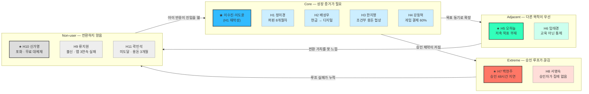

# 핀프렌즈 페르소나 · 페르소나 스펙트럼 v2 — 후보 풀 11가정

> **작성일** 2026-08-19 · **개정** 2026-08-20 (v2)
> **기준** `05 — 페르소나 · 페르소나 스펙트럼 분석 방법론`
> **제품 기준** [`기능정의_v12.md`](기능정의_v12.md) + **2026-08-20 확정 솔루션 명세**(§4 근거추적 참조)
> **후보 풀** [`페르소나_10가정.md`](페르소나_10가정.md) — **본 문서에서 3건 변경**
> **이용 모델** 부모·아이 무료 · 월 구독 없음
> **여정** [`고객여정지도_v4.md`](고객여정지도_v4.md) — 여정 11단계(0~10) 기준
> **이전 판** [`페르소나_스펙트럼_v1.md`](페르소나_스펙트럼_v1.md)

### v1에서 바뀐 것 — 후보 풀 3건 변경 · 전체 코드 재부여

| # | 변경 | 내용 | 이유 |
|---|---|---|---|
| **①** | 🔻 **제외** | Core **문세라 · 문지호**(세뱃돈 40만원) | 세뱃돈 페인포인트는 **서비스 범위 밖**이라 인터뷰로 판정할 수 없다 — 범위 결정(팀 논의) 사안이지 페르소나 축이 아니다 |
| **①** | 🆕 **대체** | Core **H3 한지영 · 한서우**(조건부 용돈) | 같은 Core 유형에서 **범위 안에서 검증 가능한** 축으로 교체 — 🧹 미션 루프와 「벌기」 나무를 정면으로 검증하는 유일한 Core |
| **②** | 🔄 **이동** | **류지원 · 류하민** Extreme → **Non-user H9** | 이 가정을 막는 것은 사용 중 제약이 아니라 **교육앱 3개 연속 실패에서 온 학습된 불신** — 시작 이전에 회피한다 |
| **③** | 🆕 **신설** | Extreme **H8 서명숙 · 서다온**(조손 가정) | 류지원이 빠진 Extreme 자리. 백현주가 「승인이 **늦은**」 실패라면, 이 가정은 승인 권한자가 **현장에 없는** 실패다 |
| **④** | 🔢 **재부여** | 전 가정 코드를 유형 순서대로 H1~H11 | v1은 코드가 유형 순서와 어긋나 있었다(H5 다음이 H8) |

> **결과** 후보 풀이 10가정 → **11가정**이 된다. Core 4 · Adjacent 2 · Extreme 2 · **Non-user 3**.
> **⚠️ 코드가 바뀌었다.** v1·[`고객여정지도_v3.md`](고객여정지도_v3.md)·[`고객여정지도_v4.md`](고객여정지도_v4.md)를 인용할 때는 §2-2의 **코드 대조표**를 반드시 확인한다.

> ⚠️ 후보 풀의 ‘월 5,900원’·지불의향 항목은 이전 유료 모델의 역사적 가정이다. 본 문서의 분류·선별·검증에서는 사용하지 않는다.

## 0. 문서의 지위와 판독 규칙

**부모 인터뷰 0건, 아이 인터뷰 0건이다.** 이 문서의 인물·대사·감정·상황은 시장·리뷰·제품 근거를 조합해 만든 **[합성 가설]**이지 실재 고객의 진술이 아니다.

| 구분 | 의미 | 사용 규칙 |
|---|---|---|
| **[관측]** | 공식 자료·리뷰·통계에서 확인 | 출처와 함께 발표 근거로 사용 가능 |
| **[추론]** | 관측 자료를 연결한 해석 | 반대 가능성을 함께 표기 |
| **[합성 가설]** | 페르소나를 구체화하기 위해 생성 | 인터뷰 모집·설계에만 사용 |

이 문서는 “이런 사람이 있다”를 증명하지 않는다. **“이 조건의 사람을 만나 어떤 가설을 검증할지”**를 정의한다.

---

# 1. 핵심 페르소나

## 1-1. 왜 ‘가정 단위’로 작성하는가

핀프렌즈는 아이가 실제로 사용하고 부모가 가입·연결·지속 사용을 결정하는 이중 고객 서비스다. 부모는 이용료를 내는 구매자가 아니라 **법정대리인·가입 결정자·용돈 연결자**다.

| 역할 | 아이 | 부모 |
|---|---|---|
| 핵심 행동 | 학습, 퀴즈, 미션, 소비·저축 실천, 별·아바타 사용 | 동의, 자녀·카드 연결, 용돈·미션 설정, 리포트 확인 |
| 성공 판단 | “재미있고 내가 잘해지는 느낌이 든다” | “배운 것이 실제 행동으로 이어지고 있다” |
| 이탈 권한 | 사용을 안 함 | 자녀·용돈·카드 연결을 중단함 |

따라서 부모나 아이 한 명만으로는 핵심 루프의 성공·실패를 설명할 수 없다. 본 문서의 기본 단위는 **부모 1명 + 아이 1명의 가정 페르소나**다.

## 1-2. 주 페르소나 — 이수진 · 이도윤 가정 [합성 가설]

> **한 줄 정의**  
> 용돈 앱을 이미 쓰고 있지만, 퀴즈 수·사용일·보상금만으로는 아이의 금융 성장을 판단하기 어려운 초등 2학년 가정.

| 항목 | 부모 — **이수진, 39세** | 아이 — **이도윤, 만 8세·초2** |
|---|---|---|
| 역할 | 법정대리인·가입 결정자·관리자·해석자 | 실제 사용자·학습자 |
| 상황 | 맞벌이, 디지털 용돈 앱 7개월차 | 매주 8,000원, 퀴즈와 캐릭터 보상에 익숙 |
| 반복 행동 | 주 1회 학습 현황과 결제 내역을 확인 | 퀴즈는 빠르게 풀고, 용돈은 하교 후 간식에 주로 사용 |
| 목표 | 아이가 얼마나 풀었는지가 아니라 **무엇을 실천하게 됐는지** 알고 싶음 | 돈을 잘 쓰고 모으는 방법을 스스로 알고 싶음 |
| 고충 | 숫자는 쌓이지만 그것이 성장인지 판단할 수 없음 | 정답·보상은 즉시 느끼지만 오래 배운 느낌은 약함 |
| 대체재 | 현행 용돈 앱, 엑셀·메모, 구두 지도 | 현금 용돈, 무료 퀴즈, 캐릭터 게임 |
| 결정 기준 | **기존 앱·카드를 두고 전환할 만큼 확인 시간이 줄고 행동 변화가 보이는가** | 실천하면 바로 보상받고 아바타가 달라지는가 |

### 상황적 맥락

수진과 배우자는 둘 다 오후 7시 넘어 퇴근하는 **맞벌이**다. 도윤은 하교 후 학원 두 곳을 거쳐 오후 5시에 귀가하고, 부모와 얼굴을 맞대는 시간은 저녁 8시 이후 한두 시간뿐이다. **용돈에 대해 길게 이야기할 시간이 구조적으로 없다.**

용돈은 매주 월요일 8,000원씩 **디지털 용돈 앱으로 충전**한다 — 만 8.4세에 용돈을 시작하고 61%가 주 단위로 지급한다는 조사와 겹치는 지점이다 [관측]. 도윤은 전용 키즈폰을 갖고 있어 스스로 앱을 열 수 있다.

**어쩌다 이 상태가 됐나.** 초1 겨울, 수진은 “이제 돈 개념을 가르쳐야겠다”고 판단해 용돈 앱을 깔았다. 7개월 동안 도윤은 빠지지 않고 퀴즈를 풀었고 앱은 그 기록을 성실히 쌓아 왔다. 문제는 **그 기록이 쌓일수록 판단이 어려워졌다**는 것이다. 처음엔 “꾸준히 하네”로 충분했지만, 7개월치 숫자를 보고 나니 “그래서 뭐가 달라졌지?”라는 질문이 남았다.

**하루 장면** — 일요일 밤 *(합성 가설)*

> 아이를 재우고 수진이 앱을 연다. **116일 · 75문제 · 6,650원.** 지난주와 달라진 것은 숫자 세 개가 조금 커졌다는 것뿐이다.
> 낮에 도윤이 편의점에서 젤리를 두 개 산 일이 떠오른다. 퀴즈에서 ‘필요한 것과 갖고 싶은 것’을 배웠다던데, 그 배움과 오늘의 젤리 사이에 무슨 관계가 있는지 화면은 아무것도 말해주지 않는다.
> 수진은 앱을 닫고, 내일 아침에 한마디 해야겠다고 생각한다. **7개월째 같은 결론이다.**

### 핵심 JTBD

> 아이에게 용돈을 줄 때, 단순히 지급과 소비를 관리하는 것을 넘어, **배운 것이 실제 돈 행동으로 이어지고 있음을 확인**하고 싶다. 그래야 교육이 되고 있다는 확신을 갖고 계속 사용할 수 있다.

### 상황 시나리오

1. 수진은 도윤이 퀴즈를 꾸준히 풀었다는 숫자는 보지만, 소비 습관이 나아졌는지는 모른다.
2. 도윤은 하교길 편의점 앞에서 위치 알림을 보고 “지금 사기 / 목표를 위해 남기기”를 한 번 선택한다.
3. 귀가 후 결제 내역에서 계획과 실제 결제를 비교하고, **[확인했어요]**를 눌러 실천 별을 받는다.
4. 수진은 **일일 나무**의 ‘쓰기’ 칸과 실천 기록을 보고 구체적인 대화를 시작한다.
5. 월말에는 **월간 숲**에 한 달치 일일 나무가 누적되어 이전 달과 비교된다.

### 핵심 요구와 기능 연결

| 우선순위 | 필요 | 핀프렌즈 응답 | 성공 조건 |
|---|---|---|---|
| 1 | 학습이 행동으로 이어졌는지 확인 | 4칸 **일일 나무 + 월간 숲** | 퀴즈만으로는 나무가 자라지 않음 |
| 2 | 소비 전·후에 스스로 생각할 기회 | 위치 알림 + 결제 내역 회고 | 감시가 아닌 아이의 선택으로 인식 |
| 3 | 현금 보상에 의존하지 않는 즉시 피드백 | 퀴즈·출석·미션 승인·결제 회고 등 **8종 지급처의 별** | 행동 직후 즉시 지급 |
| 4 | 아이가 스스로 다시 접속할 이유 | 동물 아바타 + 옷장 | 별 잔액은 월 초기화되지 않음 |

### 가장 위험한 가정

| 가정 | 반증되는 신호 | 설계 영향 |
|---|---|---|
| 부모는 금융 성장의 집중 표시를 원한다 | 부모가 한국사·어휘 혼합을 문제로 느끼지 않고 오히려 선호 | ‘금융 순도’ 대신 ‘학습→실천 성장 증거’를 전면에 둔다 |
| 나무와 리포트가 전환·지속 사용의 이유를 만든다 | 기존 앱 사용자가 리포트를 보고도 카드·기록 이전 번거로움으로 전환을 거부 | 가입 전 데모, 카드 연결 전 체험, 기록 이전·병행 사용 방안 재정의 |
| 위치 알림이 소비 전 정지 신호로 작동한다 | 아이가 감시로 느끼거나 알림을 무시 | 옵트인·아이용 고지·좌표 미저장 정책 강화 |

---

# 2. 페르소나 스펙트럼

## 2-1. 도출 기준

| 유형 | 핀프렌즈에서의 판단 기준 | 핵심 질문 |
|---|---|---|
| **Core** | 부모 관여도와 아이 금융행동 개선 니즈가 모두 높음 | 성장 리포트와 실천 연결이 전환·지속 사용 이유가 되는가? |
| **Adjacent** | 유사한 용돈·습관 문제는 있지만 성장 증명이 최우선은 아님 | 어떤 다른 진입 기능이 핵심 가치로 연결되는가? |
| **Extreme** | 시간·기기·응답 지연 등 제약으로 핵심 루프가 자주 실패 | 부모가 즉시 관여하지 못해도 아이의 실천이 인정되는가? |
| **Non-user** | 기존 대체재·신뢰·카드 중복·기록 이전·온보딩 장벽으로 핀프렌즈를 회피 | 가격이 0원이어도 기존 서비스를 두고 전환할 이유가 충분한가? |

## 2-2. 1차 후보 생성 — 후보 풀 11가정 전원

### 코드 대조표 — v1을 인용할 때 반드시 확인

| v2 코드 | 가정 | v1 코드 | 유형 변화 |
|---|---|---|---|
| **H1** | 정미경 · 정하율 | H1 | Core (동일) |
| **H2** | 배성우 · 배주안 | H2 | Core (동일) |
| **H3** | **한지영 · 한서우** | — | 🆕 **신규 Core** (문세라 · 문지호 대체) |
| **H4** | 강동혁 · 강루아 | H4 | Core (동일) |
| **H5** | 오하늘 · 오시윤 | H5 | Adjacent (동일) |
| **H6** | 임태경 · 임서준 | H8 | Adjacent (코드만 변경) |
| **H7** | 백현주 · 백노아 | H9 | Extreme (코드만 변경) |
| **H8** | **서명숙 · 서다온** | — | 🆕 **신규 Extreme** |
| **H9** | 류지원 · 류하민 | H6 | 🔄 **Extreme → Non-user** |
| **H10** | 신가영 · 신윤슬 | H7 | Non-user (코드만 변경) |
| **H11** | 곽민석 · 곽서아 | H10 | Non-user (코드만 변경) |
| — | ~~문세라 · 문지호~~ | H3 | 🔻 **제외** (서비스 범위 밖) |

### 유형별 분류

| 유형 | 후보 | 해당 이유 |
|---|---|---|
| **Core** | H1 정미경 · H2 배성우 · **H3 한지영** · H4 강동혁 | 관여 의지와 구체적 행동 문제가 모두 존재 |
| **Adjacent** | H5 오하늘 · H6 임태경 | 저축 동기 또는 소비 통제가 일차 목적 |
| **Extreme** | H7 백현주 · **H8 서명숙** | 교대 근무·양육자 분리로 **승인 루프가 구조적으로 끊김** |
| **Non-user** | **H9 류지원** · H10 신가영 · H11 곽민석 | 불신·포화·미도달 — **회피 이유가 서로 다른 세 축** |

> H6(임태경)은 행동 문제가 강하지만 교육·성장 확인 의도가 낮아 Adjacent로 분류했다. H10(신가영)은 키즈 금융 서비스 사용자이지만 **핀프렌즈의 비사용자**라는 의미에서 Non-user다.

> 🆕 **Non-user가 세 가정이 된 이유** — v1은 Non-user를 「이미 충분함」(H10 신가영)과 「아직 이르다」(H11 곽민석) 둘로 봤다. 여기에 **「해봤는데 안 됐음」(H9 류지원)**이 더해지면서, 안 쓰는 이유가 **포화 · 미도달 · 불신** 세 축으로 완결된다. 셋은 전환 설계가 전혀 다르다.

### 11가정 프로필

| **코드** | **유형** | **부모** | **아이** | **한 줄 상태** | **진입 후크** | **이탈 트리거** |
| --- | --- | --- | --- | --- | --- | --- |
| **H1** | Core | 정미경 (39) 교사 | 정하율 (초2·8세) | 퍼핀 8개월차 — 숫자는 쌓이는데 확신은 안 쌓임 | 🌳 일일 나무 · 📊 월간 숲 | 나무가 2주 넘게 정체 |
| **H2** | Core | 배성우 (42) 카페 | 배주안 (초3·9세) | 현금 봉투 용돈 — 소비 데이터가 아예 없음 | 📍 위치 알림 | 온보딩이 현금 습관보다 번거로움 |
| **H3** 🆕 | Core | **한지영 (40) 공무원** | **한서우 (초3·9세)** | **용돈을 조건부로 줘 매번 금액을 협상 — 아이에게 「내 돈」 감각이 없음** | 🧹 **미션 루프** | 미션이 **‘집안일 삯’으로만 굳어** 학습·저축으로 안 번짐 |
| **H4** | Core | 강동혁 (45) 주 양육자 | 강루아 (초3·9세) | 게임 아이템 결제로 용돈 60% 증발 | 💳 결제 내역 | 옷장이 게임 스킨에 밀림 → **아이 이탈** |
| **H5** | Adjacent | 오하늘 (38) 약사 | 오시윤 (초2·8세) | 낭비는 안 하는데 모을 이유가 없음 | 🎯 위시리스트 | 이자 체감 부족 |
| **H6** | Adjacent | 임태경 (43) 물류업 | 임서준 (초2·8세) | 편의점 소비 통제가 목적, 교육 의도 없음 | 📍 위치 알림 *(감시로 오해)* | 소비가 안 줄면 1개월 내 해지 |
| **H7** | Extreme | 백현주 (40) 교대 근무 | 백노아 (초2·8세) | 시간이 없어 미션 승인을 못 함 | 🧹 미션 루프 | 미승인 미션 3건 누적 |
| **H8** 🆕 | Extreme | **서명숙 (63) 조모** *법정대리인은 타지 근무 중인 부(父)* | **서다온 (초2·8세)** | **키우는 사람과 승인 권한자가 다른 사람 — 실천을 본 사람에게 권한이 없음** | 🧹 **미션 루프** | 조모가 승인할 수 없어 **미션이 매번 대기** |
| **H9** 🔄 | Non-user | 류지원 (36) 맞벌이 | 류하민 (초1·7세) | **교육앱 3개 연속 방치 — “또 2주 만에 안 하겠지”** | 🐾 아바타·옷장 | **시작 전 포기** / 진입해도 3일차 → **아이 이탈** |
| **H10** | Non-user | 신가영 (41) 은행원 | 신윤슬 (초3·9세) | 아이부자(무료) 사용 중 — 불만이 없음 | 📊 월간 숲 | 카드 중복 · 기록 분산 |
| **H11** | Non-user | 곽민석 (35) IT | 곽서아 (초1·7세) | 용돈 시작 3개월차 — 무엇부터인지 모름 | 🐾 3D 아바타 | 온보딩 5단계 완주 실패 |

### 상황 조건 비교 — 유형을 가르는 것은 태도가 아니라 구조다

각 가정의 **상황적 맥락 전문과 하루 장면은 §2-4 카드**에 있다. 아래는 그중 **유형 분류를 실제로 결정하는 조건**만 뽑은 것이다.

| 코드 | 유형 | 부모 근무·귀가 | 아이 돌봄 공백 | 아이 전용 기기 | 용돈 수단 · 주기 | 부모 응답 속도 |
|---|---|---|---|---|---|---|
| **H1** | Core | 교사 · 오후 5시 | 짧음 | 태블릿 | 앱 충전 · 주 8,000원 | **당일** |
| **H2** | Core | 자영업 · 오후 8시 (주 6일) | **김** | ❌ 키즈워치만 | **현금 봉투** · 주 5,000원 | 주 1회 (지갑 확인) |
| **H3** 🆕 | Core | 공무원 · 오후 6시 30분 (정시) | 짧음 | 스마트폰 | 🔴 **조건부 지급** · 월 3만원 **기준액** *(성적·집안일로 증감)* | **당일** |
| **H4** | Core | 회사원 · 오후 8시 (주 양육자) | **김** | 스마트폰 + 게임 2종 | 선불카드 · 월 4만원 | 결제 알림 후 (사후) |
| **H5** | Adjacent | 약사 · 오후 7시 | 보통 | 키즈폰 | 주 7,000원 + 돼지저금통 | 당일 |
| **H6** | Adjacent | 배송직 · 오후 6시 | 보통 | 스마트폰 | 현금+체크카드 · 월 3만원 | 당일 |
| **H7** | Extreme | 요양보호사 · **2교대** | 김 | 키즈폰 | 주 6,000원 | 🔴 **48시간+** |
| **H8** 🆕 | Extreme | 🔴 **조모 상시 재가 / 부(父) 타지 근무·월 1~2회 귀가** | 없음 (조모가 상시) | 키즈폰 | 부(父) 원격 이체 · 월 3만원 | 🔴 **권한자 부재** *조모는 옆에 있으나 승인 권한 없음* |
| **H9** 🔄 | Non-user | 맞벌이 사무직 · 오후 7시 | 김 | 🔴 **없음 — 부모 폰 공유** | 월 2만원 | 당일 |
| **H10** | Non-user | 은행원 · 정시 퇴근 | 짧음 | 스마트폰 + **아이부자 카드 2년차** | 아이부자 충전 · 월 4만원 | 당일 |
| **H11** | Non-user | IT · 재택 병행 | 짧음 | ❌ 없음 (검토 중) | **현금** · 주 3,000원 *(시작 3개월차)* | 당일 |

**이 표가 말하는 것**

| 유형 | 유형을 만드는 구조적 조건 | 태도로 설명되지 않는 이유 |
|---|---|---|
| **Extreme** | **H7은 부모 응답 창이 48시간 이상**이고, **H8은 응답할 사람이 애초에 집에 없다** | 두 부모 모두 의지는 충분하다. 막는 것은 **근무표와 가족 구성**이다 |
| **Non-user** | **H10은 이미 갖췄고(2년차 카드), H11은 아직 시작 전(기기 없음), H9는 세 번 해보고 그만뒀다** | 같은 Non-user지만 **회피 이유가 정반대** — 포화 · 미도달 · 불신 |
| **Core** | 넷 다 부모 관여가 높지만 **돈이 아이에게 도달하는 방식이 다르다** — H2 현금 봉투, H3 조건부 협상, H4 선불카드 자동, H1 앱 정기 충전 | 같은 기능(미션 루프·위치 알림)이 가정마다 적중·무용·오해로 갈리는 이유가 여기 있다 |
| **Adjacent** | H5는 시간·기기 제약이 없고, H6도 마찬가지다 | 이 유형을 가르는 것은 제약이 아니라 **부모가 원하는 결과**(목표 경험 vs 지출 감소)다 |

> ⚠️ 위 조건들도 **[합성 가설]**이다. 다만 아이 연령·용돈 금액·지급 주기는 후보 풀의 🔒 고정값을 따르므로 시장 통계에 묶여 있다.

### ⚠️ 시장 세그먼트와 스펙트럼 유형은 다른 축이다

후보 풀은 **시장 세그먼트**(부모 관여도 × 아이 문제 강도)로 나뉘어 있고, 본 문서는 **핵심 루프의 성공·실패 맥락**으로 다시 나눈다. 두 축이 어긋나는 가정이 넷 있으므로 인용할 때 혼동하지 않아야 한다.

| 코드 | 후보 풀의 시장 세그먼트 | 본 문서의 스펙트럼 유형 | 재분류 사유 |
|---|---|---|---|
| **H6** 임태경 | ③ 용돈 소비통제형 | **Adjacent** | 문제는 강하나 **성장 증명이 목적이 아니다** |
| **H7** 백현주 | ③ 용돈 소비통제형 | **Extreme** | 소비 문제가 아니라 **부모 응답 지연**이 핵심 실패다 |
| **H9** 류지원 | ② 금융습관 관리형 | **Non-user** 🔄 | v1은 Extreme(기기 공유)으로 봤다. 그러나 이 가정을 막는 것은 사용 중 제약이 아니라 **교육앱 3연속 실패에서 온 학습된 불신**이며, 그 불신은 **진입 이전에 작동한다** |
| **H10** 신가영 | ② 금융습관 관리형 | **Non-user** | 문제가 아니라 **기존 대체재**가 전환을 막는다 |

> 나머지 일곱 가정(H1~H5 · H8 · H11)은 두 축의 분류가 일치하거나 신규 가정이다.

## 2-3. 2차 평가 및 선별

평가 점수는 조사 수치가 아닌 **분석자 판단값**이다. 1점은 낮음, 5점은 높음이며 통계로 인용하지 않는다.

| 유형 | 가정 | 문제 현실성 | 핵심 가치 적합 | 맥락 대표성 | 실패 학습가치 | 판정 | 사유 |
|---|---|---:|---:|---:|---:|:-:|---|
| **Core** | **H1 정미경** | 5 | 5 | 5 | 4 | ✅ **선정** | ‘숫자는 있지만 성장은 안 보임’이라는 핵심 문제를 가장 직접적으로 보여줌 |
| Core | H2 배성우 | 5 | 4 | 4 | 4 | ⬜ 후보 | 현금→디지털 전환 맥락은 중요하나, 성장 증명이 아니라 **위치 알림 검증** 트랙에 가깝다 |
| Core | **H3 한지영** 🆕 | 5 | 5 | 4 | 4 | ⬜ 후보 | **🧹 미션 루프와 「벌기」 나무를 정면으로 검증하는 유일한 Core.** 다만 문제 구조가 H1과 겹치지 않아 대표 자리를 다투지는 않는다 |
| Core | H4 강동혁 | 5 | 3 | 3 | 5 | ⬜ 후보 | 문제는 선명하나 **현 설계에 대응 기능이 없어**(온라인 결제 사전 개입 부재) 핵심 가치 적합이 낮다 |
| **Adjacent** | **H5 오하늘** | 5 | 4 | 4 | 4 | ✅ **선정** | 문제 사용자가 아니라 ‘목표가 없는 잔액’ 사용자를 포함해 저축 동기 설계를 검증 |
| Adjacent | H6 임태경 | 5 | 2 | 4 | 5 | ⬜ 후보 | 원하는 것이 교육이 아니라 **통제**라 성공 기준 자체가 다르다 — 타깃 경계 판정용 |
| **Extreme** | **H7 백현주** | 5 | 5 | 4 | 5 | ✅ **선정** | 부모 승인 지연이 별·나무·리포트 전체의 신뢰를 깨뜨리는 구조적 실패를 드러냄 |
| Extreme | **H8 서명숙** 🆕 | 4 | 3 | 3 | 5 | ⬜ 후보 | **법정대리인과 실제 양육자가 분리**되는 구조를 드러내나, 온보딩·승인 권한이 법·제휴 정책에 묶여 있어 설계 재량이 좁다 |
| **Non-user** | **H10 신가영** | 5 | 5 | 5 | 5 | ✅ **선정** | 78만 계정 대체재를 두고도 카드·기록 전환을 감수할 수 있는지 가장 엄격하게 검증 |
| Non-user | **H9 류지원** 🔄 | 5 | 4 | 4 | 5 | ⬜ 후보 | **아이 이탈**과 **학습된 불신**이라는 두 축을 함께 갖는다. 유형당 1가정 원칙에 따라 H10에 자리를 내줌 |
| Non-user | H11 곽민석 | 3 | 3 | 3 | 3 | ⬜ 후보 | 문제 강도가 가장 약하고 CAC가 가장 높아 1차 타깃이 아니다 |

> **선별 결과는 v1과 같은 네 가정이다** — Core H1 · Adjacent H5 · Extreme H7(구 H9) · Non-user H10(구 H7). **바뀐 것은 후보 구성이지 대표가 아니다.**

### 🔴 미선정 가정 중 넷은 선정 가정이 못 잡는 축을 갖고 있다

선별은 **유형당 1가정** 원칙을 따랐지만, 그 결과 다음 네 축이 대표 4가정에서 빠진다. [`고객여정지도_v4.md`](고객여정지도_v4.md)에서 11단계 여정을 그린 뒤 드러난 것이다.

| 빠지는 축 | 해당 가정 | 왜 중요한가 | 대응 |
|---|---|---|---|
| **아이가 먼저 이탈하는 경로** | **H9 · H4** | 아이가 나가면 부모 화면은 **빈 상태로 정상 작동**하므로, 부모 지표만으로는 이탈 원인을 알 수 없다 | §3-3 모집안에 H9형을 Non-user 2번 슬롯으로 포함 |
| **위치 알림의 상반된 해석** | **H2 · H4 · H6** | 같은 기능이 H2에서는 최적 적중, H4에서는 무용, H6에서는 감시로 인식된다 | H2형·H6형을 각각 모집해 대조 |
| **타깃 경계** | **H6** | 교육이 아니라 통제를 원하는 부모는 **애초에 타깃이 아닐 수 있다** | 포기 여부를 인터뷰로 판정 |
| 🆕 **미션 루프의 정상 작동 조건** | **H3 · H8** | 미션은 「벌기」 나무의 유일한 실천 근거인데, **승인이 정상인 가정(H3)과 승인자가 없는 가정(H8)**을 함께 봐야 조건이 드러난다 | H3형을 Core 슬롯에 포함, H8형은 2차 라운드로 |

> 따라서 §3-3 모집안(8가정)은 선정 4가정만이 아니라 **H2 · H3 · H4 · H6 · H9를 포함**해 구성한다.

## 2-4. 3차 보정 — 대표 스펙트럼 카드

Core는 H1의 문제 구조를 따르되, 기존 페르소나를 그대로 복제하지 않고 1절의 주 페르소나로 다시 썼다. Adjacent·Extreme·Non-user는 후보 풀에서 선별된 **H5 · H7 · H10**을 사용한다. 모두 실존 고객이 아닌 [합성 가설]이다.

**모든 카드에 상황적 맥락과 하루 장면을 붙였다.** 가정 구성·생활 리듬·용돈 운영·디지털 환경, 그리고 **어쩌다 이 상태가 됐는지**의 경위까지 적는다 — 인터뷰 모집 조건과 프로토타입 테스트 상황을 이 맥락에서 그대로 뽑아 쓰기 위해서다.

**카드는 두 종류다.** 선정 4가정은 **전체 카드**(6필드)로, 미선정 7가정은 **후보 카드**(4필드)로 남긴다. 깊이는 다르지만 **11가정 전원이 카드로 존재한다** — 인터뷰에서 선정 가정이 반증되면 후보 카드에서 대체 가정을 바로 꺼낼 수 있어야 하기 때문이다.

### ★ Core 선정 — 이수진 · 이도윤 가정 *(H1 재작성)*

> **상황 요약** 맞벌이 · 저녁 8시 이후에만 대화 가능 · 주 8,000원 디지털 충전 · 용돈 앱 7개월차 · 아이 전용 키즈폰 보유. 상세 맥락과 하루 장면은 **§1-2**에 있다.

| 항목 | 내용 |
|---|---|
| **문제** | 사용일·풀이 수·보상은 보이지만 학습이 실제 행동으로 이어졌는지 알 수 없음 |
| **목표** | 금융 학습과 소비·저축 실천의 연결을 짧은 시간 안에 확인 |
| **감정 동기** | 교육 비용과 관심이 헛되지 않았다는 확신 |
| **대체 솔루션** | 기존 용돈 앱 학습 현황, 결제 내역, 구두 대화 |
| **첫 가치 순간** | 실천 없이는 자라지 않는 4칸 나무와 월간 성장 비교를 보는 순간 |
| **설계 우선순위** | 리포트의 해석 가능성, 행동 근거 추적, 부모 확인 시간 최소화 |

#### Core 후보 4가정

**H1 · 정미경 · 정하율** — 위 Core 대표의 원본이 된 가정. 대표 카드가 담지 않은 **퍼핀 8개월 실사용 이력**이 이 가정의 고유 조건이다.

**상황적 맥락** — 미경은 중학교 교사다. 오후 5시면 퇴근하고 방학도 있어 **네 유형을 통틀어 부모 가용 시간이 가장 넉넉한 가정**이다. 하율은 외동이고 전용 태블릿으로 저녁마다 퀴즈를 푼다. 용돈은 주 8,000원을 퍼핀 계정에 충전하며 8개월째다.

**어쩌다 이 상태가 됐나.** 미경은 직업상 **학습 데이터를 읽는 데 익숙**하다. 학생 성적표에서 무엇을 봐야 하는지 아는 사람이라, 오히려 퍼핀 화면의 빈약함을 또래 부모보다 예민하게 느낀다. 승인·확인에 시간을 못 내는 문제는 이 가정에 없다 — **시간은 있는데 볼 것이 없다**는 것이 문제다.

> **하루 장면** 하율이 저녁에 5문제를 푼다. 두 개를 틀리고 곧바로 재시도해 절반 보상을 받는다. 옆에서 보던 미경은 생각한다. **“문제를 푸는 게 아니라 보상을 받고 있구나.”** 그날 이후로 미경은 앱의 숫자를 믿지 않게 된다.

| 항목 | 내용 |
|---|---|
| **문제** | 8개월치 데이터가 쌓였는데도 누적 숫자(116일·75문제·6,650원)는 성장의 증거가 되지 못함 |
| **이 가정만의 조건** | 경쟁 서비스 실사용자 — 차이는 빨리 알아보지만 **기존 기록을 옮길 방법이 없다** |
| **결정적 순간** | 하율이 첫 주에 별을 다 써서 옷을 삼 → 월간 리포트의 **「총 획득 별」이 유일한 누적 증거**가 됨 |
| **드러내는 설계 질문** | 검증과제 ①의 **(b) 시나리오 대표** — 미경은 비금융 퀴즈를 “그것도 공부니까 좋다”고 답할 수 있다. 그러면 「금융 순도」를 차별점에서 내려야 한다 |

**H2 · 배성우 · 배주안** — 현금 봉투에서 디지털로 넘어오는 가정.

**상황적 맥락** — 성우 부부는 카페를 함께 운영한다. 주 6일, 오전 7시부터 오후 8시까지 가게에 있다. **부모가 아이의 소비 현장을 볼 기회가 구조적으로 없다.** 주안은 초3이고 스마트폰은 없다(키즈워치만 있다). 결제 수단도 없어 **모든 소비가 현금**이다.

용돈은 매주 일요일 봉투에 5,000원을 넣어 준다. 이 방식은 국내 용돈 지급 수단에서 현금이 여전히 큰 비중을 차지한다는 현실과 겹친다 [관측].

**어쩌다 이 상태가 됐나.** 성우는 아이를 못 챙긴다는 마음이 있어 용돈만큼은 거르지 않는다. 다만 현금이라 **기록이 남지 않고**, 확인할 수 있는 수단은 일요일에 지갑을 열어보는 것뿐이다. 학교 앞 문구점은 하교 동선에 그대로 놓여 있다.

> **하루 장면** 주안이 하교길 문구점에서 뽑기를 세 번 한다. 3,000원이 사라진다. 성우가 이 일을 아는 것은 **닷새 뒤 일요일, 지갑이 비어 있는 것을 보고서**다. 그때는 무슨 말을 해도 늦다.

| 항목 | 내용 |
|---|---|
| **문제** | 현금으로 주니 **소비 데이터가 아예 존재하지 않아**, 무엇을 가르쳐야 할지도 모름 |
| **이 가정만의 조건** | 학교 앞 문구점이라는 **고정 동선** + 소액 반복 구매 |
| **결정적 순간** | 문구점 앞 알림에서 ‘남기기’를 선택하고, 결제 내역에 ‘참음’이 자동으로 남는 순간 |
| **드러내는 설계 질문** | 검증과제 ②의 **최적 관측 대상**. 동시에 전환 비용의 기준선이 **현금의 ‘5초’**여서 온보딩 5단계가 상대적으로 가장 큰 비용으로 체감된다 |

**H3 · 한지영 · 한서우** 🆕 — 용돈을 **조건부로** 주는 가정. **미션 루프의 수요가 가장 명확한 Core**다.

**상황적 맥락** — 지영은 구청 주민센터 공무원이라 오후 6시 30분에 정시 퇴근한다. 배우자도 직장인이고, 서우는 초3에 전용 스마트폰이 있다. 용돈은 **월 3만원이 ‘기준액’일 뿐 실제 지급액은 매달 다르다** — 시험 성적, 집안일, 태도에 따라 더 주거나 깎는다.

**어쩌다 이 상태가 됐나.** 지영은 “돈은 그냥 주는 게 아니라 **버는 것**”이라고 믿는다. 의도 자체는 제품이 하려는 것과 같다 — 노동과 보상을 연결해 가르치려는 것이다. 문제는 **기준을 적어 둔 적이 없다**는 점이다. 기준이 머릿속에만 있으니 매달 금액이 협상으로 정해지고, 서우 입장에서는 **용돈이 자기 행동이 아니라 부모 판단에 달린 것**으로 보인다. 다음 달에 얼마가 들어올지 모르니 **저축도 소비 계획도 성립하지 않는다.**

> **하루 장면** 월말 저녁. 서우가 묻는다. **“이번 달 얼마야?”** 지영이 “네가 뭘 했는지 생각해 봐”라고 답한다. 서우가 설거지 세 번, 분리수거 두 번을 센다. 지영이 “근데 방은 안 치웠잖아”라고 한다. 15분간 실랑이 끝에 2만 5천원으로 정해진다. 둘 다 지친다. **서우가 그날 배운 것은 돈의 원리가 아니라 협상이다.**

| 항목 | 내용 |
|---|---|
| **문제** | 지급액이 매달 협상으로 정해져 아이에게 **예측 가능한 소득이 없음** — 계획도 저축도 성립하지 않는다 |
| **이 가정만의 조건** | 부모가 **이미 노동–보상 연결을 가르치려 하고 있다.** 의도는 제품과 같은데 **기준이 없어서** 실패하는 중 — 11가정 중 🧹 미션 루프 수요가 가장 명확하다 |
| **결정적 순간** | 미션 목록에 **조건과 보상이 미리 적혀 있는 것**을 보고 “협상을 안 해도 되네”라고 말하는 순간, 그리고 승인 즉시 ⭐가 지급되는 것을 아이가 확인하는 순간 |
| **드러내는 설계 질문** | 미션은 「벌기」 나무의 **유일한 실천 근거**다. 그런데 이 가정에서 미션이 **‘집안일 삯’으로만 굳으면** 학습·모으기·불리기 칸은 빈 채로 벌기 나무 하나만 자란다. **미션의 현금 보상과 별 보상이 설계상 분리돼 있는가**, 그리고 부모가 그 차이를 이해하는가 |

**H4 · 강동혁 · 강루아** — 소비가 앱 안에서 일어나는 가정.

**상황적 맥락** — 동혁은 출장이 잦은 배우자를 대신해 **사실상 주 양육자**다. 오후 8시에 귀가하므로 루아는 하교 후 서너 시간을 혼자 또는 조부모와 보낸다. **그 시간의 주된 여가가 모바일 게임 두 종**이다. 루아는 초3이고 전용 스마트폰이 있으며, 앱스토어 결제는 부모 카드에 연동돼 있다. 용돈은 월 4만원을 선불카드에 충전한다.

**어쩌다 이 상태가 됐나.** 혼자 있는 시간이 길다 보니 소비가 전부 **화면 안에서** 일어난다. 게임의 한정 판매는 판단 시간을 의도적으로 줄이도록 설계돼 있어, **오프라인 소비보다 개입 여지가 훨씬 좁다.** 동혁이 지출을 아는 시점은 언제나 결제 알림이 울린 뒤다.

> **하루 장면** 오후 6시, 한정 스킨 배너가 뜬다. 남은 시간 02:41. 루아는 3초 만에 결제한다. 밤 9시, 동혁의 폰에 결제 알림이 뜬다. **“용돈을 준 게 아니라 게임 회사에 준 것 같다.”**

| 항목 | 내용 |
|---|---|
| **문제** | 게임 아이템에 월 용돈의 60%가 하루에 소진 — **오프라인 소비보다 판단 시간이 짧다** |
| **이 가정만의 조건** | 📍 위치 알림이 **무용지물**이라 차별점의 절반이 사라진 채로 진입 |
| **결정적 순간** | 루아가 옷장을 보고 “게임 스킨이 훨씬 나은데”라고 말하는 순간 → **아이 동기가 즉시 꺼짐** |
| **드러내는 설계 질문** | **온라인 결제 사전 개입이 설계에 없다.** 그리고 상용 게임과 비교되는 순간 옷장은 하위호환이 된다 |

### ★ Adjacent 선정 — H5 오하늘 · 오시윤 가정

**상황적 맥락** — 하늘은 동네 약국에서 주 5일 오전 9시부터 오후 7시까지 일한다. 계획적이고 기록하는 성향이라 **아이 교육에도 “해야 할 것”의 목록이 분명하다.** 시윤은 학교와 방과후교실을 거쳐 오후 5시에 귀가하고, 저녁에는 부모와 시간을 보낼 여유가 있다. **이 가정에 시간 제약은 없다 — 없는 것은 이유다.**

용돈은 매주 7,000원을 주고, 그와 별개로 돼지저금통을 놓아두었다. 시윤은 낭비하는 아이가 아니다. 오히려 매주 절반 정도가 남는다. 다만 그것은 **참아서 남긴 돈이 아니라 살 것이 떠오르지 않아 남은 돈**이다.

**어쩌다 이 상태가 됐나.** 하늘은 “저축 습관을 만들어야 한다”는 말을 여러 번 들었고 실제로 그렇게 믿는다 — 부모 희망 1위가 저축(65.8%)이라는 조사와 정확히 겹치는 위치다 [관측]. 그런데 시윤에게 **왜 모아야 하는지 설명해 본 적이 없다.** 목표가 없으니 저축은 ‘안 쓰기’와 구분되지 않고, 남은 돈은 그냥 남은 돈으로 쌓여 간다. 아이 실제 저축 실행률이 꼴찌(12.8%)인 것과 같은 구조다 [관측].

**하루 장면** — 토요일 오후 *(합성 가설)*

> 하늘이 저금통을 열어 3만 원을 센다. “우와, 시윤이 잘 모았네.”
> 시윤이 묻는다. **“그래서 이걸로 뭐 해?”**
> 하늘은 답을 준비하지 못했다. “나중에 큰 거 살 때 쓰는 거야”라고 말하지만, 시윤의 얼굴에는 **‘나중’이 언제인지 모르겠다**고 쓰여 있다.
> 돈은 다시 저금통으로 들어간다. 다음 주에도 같은 장면이 반복될 것이다.

| 항목 | 내용 |
|---|---|
| **문제** | 아이가 돈을 낭비하지는 않지만, 모을 이유와 목표가 없음 |
| **목표** | 저축을 부모의 지시가 아닌 아이의 목표 달성 경험으로 바꾸기 |
| **감정 동기** | “모으라”는 잔소리 없이 아이가 스스로 선택하길 바람 |
| **대체 솔루션** | 돼지저금통, 부모 이자, 저축 스티커판 |
| **첫 가치 순간** | 위시리스트 목표와 예적금·부모 저축의 결과를 비교할 때 |
| **설계 우선순위** | 목표 진척 피드백, 초등 저학년용 이자 표현, 오래 모으는 성공 경험 |

#### Adjacent 후보 — H6 · 임태경 · 임서준

목표가 교육이 아니라 **통제**인 가정. 타깃 경계를 판정하기 위해 남긴다.

**상황적 맥락** — 태경은 물류 배송직이라 오전 6시에 출근해 오후 6시에 퇴근한다. 배우자는 파트타임으로 일한다. **경제교육을 해 본 경험이 없고, 그럴 계획도 없었다.** 서준은 초2이고 스마트폰이 있으며, 학원가 상가에 편의점이 세 곳 붙어 있어 학원 쉬는 시간마다 친구들과 들른다. 용돈은 월 3만원이다.

**어쩌다 이 상태가 됐나.** 서준의 소비 동기는 갖고 싶은 물건이 아니라 **또래 관계**다. 친구들이 사면 같이 사고 때로는 사 준다. 태경이 보는 것은 결과(돈이 빨리 없어진다)뿐이라 개입은 “그만 좀 사” 한마디로 수렴한다. **이 가정이 서비스에 기대하는 것은 성장 증거가 아니라 지출 감소**다 — 성공 기준 자체가 우리와 다르다.

> **하루 장면** 태경이 앱 소개를 보다가 위치 알림에서 멈춘다. **“애가 어디서 쓰는지 볼 수 있는 거죠?”** 그는 망설임 없이 동의를 켠다. 며칠 뒤 편의점 앞에서 알림을 받은 서준이 묻는다. **“엄마가 나 보고 있는 거야?”**

| 항목 | 내용 |
|---|---|
| **문제** | 개입 수단이 “그만 좀 사” 한마디뿐이라 반복될수록 효과는 떨어지고 관계만 상함 |
| **이 가정만의 조건** | 아이의 소비 동기가 욕구가 아니라 **또래 관계** — 절약 요구가 아이에게는 관계 포기로 들림 |
| **결정적 순간** | 위치 알림을 **“어디 있는지 알려주는 기능”**으로 이해한 채 옵트인 → 아이는 “엄마가 나 보고 있는 거야?”로 받아들임 |
| **드러내는 설계 질문** | 검증과제 ④(위치정보법 P-19). **부모가 감시 목적으로 동의하면 옵트인은 쉬워지고 아이 신뢰는 시작부터 깨진다.** 아이용 고지 문구가 필수이며, 더 근본적으로 **이 가정이 타깃인지 아닌지**를 결정해야 한다 |

### ★ Extreme 선정 — H7 백현주 · 백노아 가정

**상황적 맥락** — 현주는 요양원에서 **주간·야간 2교대**로 일한다. 근무 중에는 휴대폰을 쓸 수 없고, 야간 근무를 마친 날은 낮에 잠을 잔다. **하루 중 알림을 확인할 수 있는 창이 좁고, 그마저 매일 다른 시간에 열린다.** 노아는 방과후 돌봄교실과 조부모 집을 오가며 저녁을 먹는다.

용돈은 매주 6,000원이다. 노아는 키즈폰이 있어 앱은 혼자서도 열 수 있다 — **아이 쪽 접속에는 문제가 없다.** 막히는 곳은 반대편이다.

**어쩌다 이 상태가 됐나.** 현주는 노아에게 미안한 마음이 커서 집안일 미션 같은 것을 오히려 반긴다. 문제는 미션의 **생성·금액 설정·승인 세 단계가 전부 부모 수동**이라는 점이다. 근무표가 불규칙하니 승인은 몰아서 하게 되고, 그사이 노아의 실천은 **화면상 아무 일도 없었던 것**이 된다. 현주 입장에서는 “승인 눌러줄 시간에 그냥 돈을 주는 게 빠르다”는 계산이 자연스럽게 선다.

**하루 장면** — 화요일 → 목요일 *(합성 가설)*

> **화요일 저녁.** 노아가 설거지를 돕고 앱에 완료를 등록한다. “엄마 오면 별 두 개 받는다.” 그날 밤 현주는 야간 근무다.
> **수요일.** 현주는 낮에 자고 저녁에 다시 출근한다. 알림은 쌓인다.
> **목요일 오전.** 퇴근길에 앱을 열어 승인을 누른다. 노아는 이미 이틀 전 일을 잊었다.
> 노아가 기억하는 것은 **“내가 했는데 별이 안 들어왔던 이틀”**이고, 현주가 보는 리포트에는 **“이번 주 실천 1회”**만 남는다. 둘 다 사실이지만, 둘 다 무슨 일이 있었는지 설명하지 못한다.

| 항목 | 내용 |
|---|---|
| **제약** | 부모가 교대 근무로 알림을 며칠 뒤 확인하며, 미션 승인이 즉시 이루어지지 않음 |
| **반복 실패** | 아이가 실천해도 별과 나무에 반영되지 않아 ‘내가 안 한 것’처럼 보임 |
| **감정 동기** | 부모는 운영 부담을 줄이고 싶고, 아이는 하자마자 인정받고 싶음 |
| **대체 솔루션** | 즉시 현금 지급, 메신저로 완료 보고, 승인 생략 |
| **설계 기회** | 결제 참기·목표 달성 등 자동 판정 가능한 실천, 일괄 승인, 승인 대기 상태 표시 |
| **포용성 합격 기준** | 부모가 48시간 응답하지 않아도 아이의 핵심 루프가 완전히 멈추지 않음 |

#### Extreme 후보 — H8 · 서명숙 · 서다온 🆕

**승인할 사람이 집에 없는** 가정. 선정 가정(H7)이 「승인이 **늦은**」 실패라면, 이 가정은 「승인 권한자가 **현장에 없는**」 실패다.

**상황적 맥락** — 다온의 친권자는 아버지 준호(38)인데, 지방 사업장에서 일해 **월 1~2회만 귀가한다.** 다온은 할머니 명숙(63)과 산다. 명숙은 스마트폰으로 통화·메신저는 쓰지만 **앱 설치와 본인인증은 어려워한다.** 다온은 키즈폰이 있어 접속 자체에는 문제가 없다. 용돈은 준호가 월 3만원을 원격으로 이체한다.

**어쩌다 이 상태가 됐나.** 명숙은 다온의 하루를 전부 본다 — 심부름을 시키는 것도, 분리수거를 함께 하는 것도 명숙이다. 그런데 **앱에서 명숙은 존재하지 않는다.** 온보딩(본인인증 → 계좌 연결 → 카드 신청 → 자녀 초대)이 전부 **법정대리인 기준**이라 계정은 준호의 것이고, 미션 생성·금액 설정·승인 권한도 준호에게 있다. **실천을 목격한 사람에게 권한이 없고, 권한이 있는 사람은 현장을 보지 못한다.**

> **하루 장면** 화요일 저녁. 다온이 분리수거를 들고 나갔다 온다. 명숙이 “잘했다” 한다. 다온이 폰을 내민다. **“할머니가 앱에서 눌러줘.”** 명숙은 누를 수 없다. 다온이 아빠에게 전화하지만 회의 중이다. 승인은 **목요일 밤**에 눌린다. 다온이 기억하는 것은 **“할머니가 봤는데도 이틀 동안 안 됐던 것”**이다.

| 항목 | 제약·내용 |
|---|---|
| **제약** | 🔴 **법정대리인(부)과 실제 양육자(조모)가 다른 사람**이고, 앱 권한은 전부 법정대리인에게 있다 |
| **반복 실패** | 조모가 실천을 목격해도 승인할 수 없어 **미션이 매번 부(父)의 연락·귀가를 기다린다** — 지연이 우연이 아니라 **구조** |
| **결정적 순간** | 다온이 “할머니가 앱에서 눌러줘”라고 말했는데 **누를 수 있는 화면이 없는** 순간 |
| **포용성 합격 기준** | 법정대리인이 아닌 **보조 양육자에게 승인 권한을 위임**할 수 있고, 그래도 만 14세 미만 동의 구조가 깨지지 않는다 |
| **드러내는 설계 질문** | 온보딩 3단계는 **한 사람이 가입자·관찰자·승인자를 겸한다**고 전제한다. 조손·한부모·재혼·주말가정에서는 이 셋이 갈라지는데 기능정의에 **역할 분리가 없다.** 위임 승인이 법적으로 가능한지(P-05 법정대리인 동의 · P-12 아동 고지)부터 확인해야 한다 |

### ★ Non-user 선정 — H10 신가영 · 신윤슬 가정

**상황적 맥락** — 가영은 시중은행 지점에서 일한다. **금융권 종사자라 디지털 용돈 도입이 또래 부모보다 2~3년 빨랐다.** 윤슬이 초1이던 해에 아이부자를 시작해 지금 2년차이고, 카드·미션·같이 모으기까지 이미 다 쓰고 있다. 배우자도 같은 앱에 연결돼 있다.

용돈은 월 4만원을 아이부자 카드에 충전한다. 윤슬은 초3이라 카드 결제에 능숙하고 잔액을 스스로 확인한다. **이 가정은 우리가 만들려는 상태에 이미 상당 부분 도달해 있다.**

**어쩌다 이 상태가 됐나.** 아이부자는 하나은행이 직접 운영하고 자녀 계정이 78만 개다 [관측]. 무료이고 은행 브랜드라 가영에게 신뢰 비용이 들지 않았다. **2년치 사용 기록·카드·습관이 그 위에 쌓였다.** 이 가정이 핀프렌즈를 쓰지 않는 이유는 우리 제품이 나빠서가 아니라, **바꿀 이유가 생길 만큼 지금이 불편하지 않아서**다. Push force가 거의 없다는 것이 이 유형의 정의다.

**하루 장면** — 학부모 모임 다음 날 *(합성 가설)*

> 지인이 “요즘 이런 앱도 있대”라며 핀프렌즈를 보여준다. 가영은 4칸 나무와 월간 리포트를 한참 본다. **“이건 아이부자엔 없네.”**
> 집에 와서 설치까지 한다. 그런데 다음 화면이 **카드 신청**이다.
> 가영은 계산을 한다. 카드가 하나 더 생기고, 윤슬을 다시 초대해야 하고, 2년치 기록은 저쪽에 남는다. 얻는 것은 “아이가 뭘 실천했는지 보이는 화면” 하나다.
> **앱을 닫는다.** 나쁜 제품이라고 생각해서가 아니라, **지금 것을 두고 옮길 만큼은 아니라고 판단**했기 때문이다.

| 항목 | 내용 |
|---|---|
| **회피 이유** | 아이부자로 이미 용돈·카드·미션을 사용하며, 새 카드 연결·자녀 초대·사용 기록 분산을 감수할 이유가 없음 |
| **인식** | 게임화나 캐릭터는 기존 서비스와 다를 것이 없음 |
| **감정 동기** | 기능 중복, 복잡한 재가입, 자녀 데이터·카드 분산을 피하고 싶음 |
| **전환 조건** | 리포트가 기존 결제 내역으로는 알 수 없는 행동 변화를 보여주고, 확인 시간을 실제로 줄여줌 |
| **복귀 조건** | 카드 연결 전 체험 후에도 부모가 ‘기존 앱+대화’보다 낫지 않다고 판단하면 비사용자로 남음 |
| **시장 합격 기준** | 무료라는 이유가 아니라, 성장 증거·확인 시간 절감의 독자 가치로 카드·자녀 연결 의향이 발생 |

#### Non-user 후보 2가정

**H9 · 류지원 · 류하민** 🔄 — **해봤는데 안 됐던** 가정. v1에서는 Extreme이었으나, 이 가정을 막는 것은 **사용 중 제약이 아니라 사용 이전의 불신**이다.

**상황적 맥락** — 지원 부부는 둘 다 사무직 맞벌이로 오후 7시 이후에 귀가한다. 하민은 초1이라 방과후교실을 거쳐 조부모가 데려온다. **하민에게는 전용 기기가 없다 — 스마트폰은 부모 폰을 빌려 쓴다.** 용돈은 초1이라 월 2만원으로 적다.

**어쩌다 이 상태가 됐나.** 지원은 이미 교육앱을 세 개 깔았고 셋 다 2주 안에 방치됐다. **부모에게 ‘앱 이탈’은 새로운 사건이 아니라 학습된 경험**이다. 그래서 네 번째 앱을 권유받았을 때 지원의 첫 반응은 기능 검토가 아니라 **“또 2주 만에 안 하겠지”**다. 🔴 **이것이 v1의 Extreme 분류를 뒤집은 지점이다** — 기기 공유는 진입한 뒤에야 작동하는 제약이지만, **학습된 불신은 진입 이전에 작동한다.** 하민은 만 7세로 집중이 15분을 넘기지 않고, 두 단계로 된 보상 규칙은 아직 이해하기 어렵다.

> **하루 장면** 학부모 단톡방에 핀프렌즈 링크가 올라온다. 지원은 열어보지 않는다. 홈 화면에는 아직 지우지 않은 교육앱 세 개가 남아 있다. **“저것들도 처음엔 다 좋아 보였다.”** 그날 저녁, 하민이 화면을 보고 **“이 동물 귀엽다”**고 말한다. 지원은 그제야 앱을 연다 — **이 가정의 진입은 부모의 판단이 아니라 아이의 반응으로 열린다.**

| 항목 | 내용 |
|---|---|
| **회피 이유** | 교육앱 3연속 방치 경험 → **제품을 보기 전에 결론이 나 있음.** 대체재가 있어서가 아니라 **어떤 앱도 안 될 것이라 믿어서** 회피한다 |
| **인식** | 11가정 중 **아이가 부모를 끌고 들어오는 유일한 가정** — 진입 후크가 부모 리포트가 아니라 🐾 아바타다 |
| **전환 조건** | **“이번엔 2주를 넘겼다”는 증거.** 온보딩에서 **별 1개로 바로 살 수 있는 아이템을 제시**하는 확정 설계가 이 가정에 정확히 대응한다 — 첫 보상까지의 거리를 줄이는 것이 유일한 반박 수단이다 |
| **드러내는 설계 질문** | 진입에 성공해도 **3일차 아이 이탈**이 남는다. 만 7세가 학습 반복을 버티게 하는 장치가 「별 → 옷」 하나뿐이고, **아이가 나가도 부모 화면은 빈 상태로 정상 작동**하므로 부모 지표로는 원인을 알 수 없다 |

**H11 · 곽민석 · 곽서아** — 용돈을 이제 막 시작한 가정. **문제 강도가 가장 약한데 전환 비용은 동일하게 부과**되는 사례다.

**상황적 맥락** — 민석은 IT 회사원으로 재택과 출근을 병행한다. 서아는 **올해 3월에 입학한 초1**이고, 용돈을 시작한 지 3개월째다. 매주 3,000원을 현금으로 준다 — 용돈 시작 평균이 만 8.4세라는 조사에 비추면 **이 가정은 평균보다 조금 이른 출발**이다 [관측]. 서아에게는 전용 기기가 없고, 스마트워치를 살지 부부가 아직 의논 중이다.

**어쩌다 이 상태가 됐나.** 입학을 계기로 용돈을 시작하긴 했는데 **기준이 없다.** 얼마가 적당한지, 무엇을 가르쳐야 하는지 검색해 봐도 답이 제각각이다. 한편 서아는 **수의 크기 개념 자체를 아직 배우는 중**이라, 소비 문제가 생길 단계에 이르지도 않았다. 문제가 없으니 도입을 미룰 이유는 늘 있다.

> **하루 장면** 문방구에서 서아가 두 물건을 들고 묻는다. **“이거 비싼 거야?”** 1,000원과 3,000원이다. 민석은 답을 하려다 멈춘다. **비싸다는 것이 무엇인지부터 설명해야 한다는 걸 그제야 깨닫는다.**

| 항목 | 내용 |
|---|---|
| **회피 이유** | 문제 인식 → 교육 → 전환의 **2단계가 추가로 필요해** CAC가 가장 높음 |
| **인식** | 금융이 아니라 **3D 동물 캐릭터**로 진입 — 부모의 기대와 아이의 기대가 처음부터 다름 |
| **전환 조건** | **카드 없이 시작할 수 있는 경로** — “7살한테 카드까지 만들어줘야 하나”가 실제 중단 지점 |
| **드러내는 설계 질문** | 아이 눈높이 용어(벌기·쓰기·모으기·**불리기**)가 만 7세에게 통하는지, 특히 **「불리기 = 저절로 늘어나요」(복리)** 가 7세 인지 발달 단계에서 이해되는지. ⚠️ 확정 명세에서 4번째 영역 명칭이 **「키우기」 → 「불리기」**로 바뀌었으므로 테스트 문구도 함께 갱신한다 |

## 2-5. 4차 교차검증 결과

| 검증 축 | 현재 판단 | 근거 | 남은 위험 |
|---|---|---|---|
| 시장 존재 가능성 | **중간** | 초등 1~3학년 97.6만 명, 저축 교육 희망 65.8%와 아이 실제 저축 12.8%의 격차 | 관여도×문제강도의 교차 통계가 없음 |
| 핵심 문제 존재 | **중간** | 퍼핀이 학습의 의도와 다르게 작동하는 사례를 인정, 국내 경쟁사 공개 자료에서 학습→성취 구간 공백 | 아이 직접 진술 0건, 리뷰 지지 3건으로 약함 |
| 금융 집중 요구 | **낮음** | 퀴즈에 비금융 과목이 혼합된 구조는 확인 | 부모가 혼합을 문제로 느낀다는 리뷰 0건, 유일 관련 리뷰는 역방향 |
| 비금전 보상 적합성 | **중간** | 돈이 학습 동기였다는 리뷰 126건, 게임화는 초등에서 효과가 크지만 내재동기 악화 반증도 존재 | 별·아바타의 지속 사용 효과는 미검증 |
| 전환·활성화 가능성 | **중간** | 이용료 장벽은 없지만 기존 대체재와 카드·기록·습관이 이미 형성 | 자녀 연결·카드 등록·첫 실천 완료율 미검증 |

초기 결론은 **Core 존재 가능성은 있지만, 금융 집중 요구와 기존 서비스에서의 전환·활성화는 증명되지 않았다**는 것이다. 따라서 페르소나의 중심 문장은 “금융만 가르쳐 달라”가 아니라 **“배운 것이 실천으로 이어졌는지 확인하고 싶다”**로 유지한다.

## 2-6. 5차 통합 — Spectrum Map

★ = 선정 가정. 나머지는 후보 가정이며 §2-4에 후보 카드로 남아 있다.

> 🆕 **화살표 하나가 추가됐다** — `Non-user → Core`. H9 류지원 가정은 **아이의 반응(🐾 아바타)이 부모의 불신을 뚫고 진입을 여는** 유일한 경로다. 나머지 열 가정은 부모가 먼저 판단한다.

### 확정 솔루션 명세와 11가정의 대응

2026-08-20 확정된 솔루션 항목별로 **어느 가정이 그 기능의 성공·실패를 판정하는지** 매핑한다. 비어 있는 칸은 검증 공백이다.

| 확정 기능 | 성공을 보여줄 가정 | 실패를 드러낼 가정 |
|---|---|---|
| 🧹 **미션 루프** (벌기의 실천 근거) | **H3 한지영** — 수요가 가장 명확 | **H7 백현주**(승인 48시간) · **H8 서명숙**(승인 권한 부재) |
| 📍 **위치 알림** (특정 장소 **3분 이상 체류** 시 알림) | **H2 배성우** — 고정 동선 최적 적중 | **H4 강동혁**(온라인 소비라 무용) · **H6 임태경**(감시로 오해) |
| 💳 **결제 내역 회고** (쓰고 난 뒤의 생각) | 이수진 · **H2** | **H4** — 회고만으로는 FOMO 결제를 못 막음 |
| 🎯 **위시리스트** (30 · 70 · 100%마다 ⭐1 · 월 1회 순위 변경) | **H5 오하늘** — 목표-경사가 여기서 발생 | **H5** — 목표가 **앱 밖(자전거)**이면 별이 회수되지 않음 |
| 🐷 **예적금 vs 부모 적금** (가입 ⭐1 · 완주 ⭐10) | **H5 오하늘** | **H11 곽서아** — 만 7세에게 「불리기」가 이해되는가 |
| 🌳 **일일 나무 / 월간 숲** | **H1 정미경** — 데이터를 읽을 줄 아는 부모 | **H6 임태경**(성장 지표에 무관심) · **H8**(부가 원격에서만 봄) |
| 🌱 **나무 성장 3조건** (학습 완주·퀴즈 정답·행동 실천) | **H1 · H3** | **H4** — 잘쓰기 칸이 자라지 않는 것을 보고도 수단이 없음 |
| 📊 **주간·월간 소비 내역** | **H6 임태경** — 이 가정이 원하는 유일한 답 | **H6** — 감소액을 직접 안 보여주면 그대로 이탈 |
| ⭐ **별 8종 지급처** *(퀴즈·출석·온보딩 학습·미션 승인·결제 회고·위시리스트 단계·예적금 가입·만기)* | **H1 하율** — 획득 경로가 늘어 초기 좌절이 줄어듦 | 🔴 **H9 하민(7세)** — 지급 규칙이 8종으로 늘면 **「별 2배」보다 더 이해하기 어려워질 수 있다** |
| 🐾 **동물 아바타 · 옷장** | **H9 하민 · H11 서아** — 유일한 진입 후크 | **H4 루아** — 상용 게임 스킨에 밀림 |
| 🚪 **온보딩** (학습 1회 → ⭐1 → **⭐1로 살 수 있는 아이템 제시**) | **H9 류지원 · H11 곽민석** — 첫 보상까지의 거리를 줄이는 직접 대응 | **H11** — 그 앞의 **카드 신청**이 여전히 중단 지점 |

> 🔴 **가장 큰 변화** — 확정 명세에서 별 지급처가 **퀴즈+실천 2종에서 8종으로 늘었다.** 획득 경로가 넓어져 H1·H5 같은 가정에는 유리하지만, **만 7세(H9 하민 · H11 서아)에게는 규칙이 더 복잡해진다.** v1이 걱정하던 「별 2배 미이해」가 「별 8종 미이해」로 커질 수 있으므로, **아이 화면에서는 지급처를 다 보여주지 않는 설계**가 필요하다.

### 스펙트럼이 만든 제품 원칙

| 원칙 | 도출 근거 | 요구사항 |
|---|---|---|
| **부모 승인이 느려도 아이의 성취를 지우지 않는다** | Extreme **H7** | 승인 대기 표시, 일괄 승인, 자동 판정 실천 분리 |
| 🆕 **가입자 · 관찰자 · 승인자는 한 사람이 아닐 수 있다** | Extreme **H8** | 법정대리인 동의는 유지하되 **보조 양육자 승인 위임** 가능성 검토 |
| 🆕 **미션의 현금 보상과 별 보상을 섞지 않는다** | Core **H3** | 미션 조건·금액을 **사전에 고정**해 협상을 없애고, 별은 승인 즉시 별도 지급 |
| **성장 지표는 활동량이 아니라 학습+실천을 함께 보여준다** | Core | 퀴즈만으로 나무 성장 불가, 행동 근거 표시 |
| **저축은 통제가 아니라 목표로 설계한다** | Adjacent | 위시리스트 단계 보상, 목표 진척, 예적금 비교 |
| **무료 대체재와 같은 기능은 차별점으로 주장하지 않는다** | Non-user **H10** | 게임화·미션·카드가 아닌 성장 증거를 첫 가치로 제시 |
| 🆕 **첫 보상까지의 거리를 짧게 만든다** | Non-user **H9** | 온보딩 학습 1회 → ⭐1 → **그 별로 살 수 있는 아이템 즉시 제시** |
| **아이의 소비 개입은 감시가 아닌 자기 선택으로 보여준다** | Core · Adjacent | 위치 알림 옵트인, 좌표 미저장, 아이용 쉬운 고지 |

# 3. 검증 계획

## 3-1. 스크리너

| 확인 항목 | 모집 질문 | 분류 |
|---|---|---|
| 아이 연령 | 초등 1~3학년 자녀가 있나요? | 공통 |
| 용돈 경험 | 용돈을 주기적으로 주고 있나요? | 공통 |
| 현재 대체재 | 현금, 은행·용돈 앱, 엑셀 중 무엇을 쓰나요? | Core·Non-user |
| 부모 관여 가능 시간 | 미션 완료를 보통 얼마나 빨리 확인할 수 있나요? | Extreme |
| 저축 목표 | 아이가 자신이 모으고 싶은 대상을 정한 적이 있나요? | Adjacent |
| 전환 저항 | 무료여도 새 용돈 앱으로 옮기지 않는다면 가장 큰 이유는 무엇인가요? | Non-user |

## 3-2. 우선 검증 질문과 판정

| 우선순위 | 검증 가설 | 인터뷰·테스트 질문 | 유지 신호 | 반증 신호 |
|---|---|---|---|---|
| 1 | 부모는 학습→실천 성장 증거를 원한다 | “용돈 앱에서 아이가 성장했다고 판단하려면 무엇이 보여야 하나요?” | 실제 선택·습관 변화를 자발적으로 요구 | 오직 지출 통제·잔액 확인만 요구 |
| 2 | 금융 집중이 필요하다 | “금융 앱 퀴즈에 한국사·어휘가 섞여 있는 것을 알고 계셨나요? 어떻게 느끼시나요?” | 금융 학습의 분류·집중 표시를 원함 | 다양한 교과 콘텐츠를 더 선호 |
| 3 | 리포트가 카드·자녀 연결을 전환할 가치를 만든다 | 기존 앱과 핀프렌즈 리포트 시안을 함께 보여주고 어느 서비스를 계속 쓸지 묻는다 | 핀프렌즈를 선택하며 행동 근거·확인 시간 절감을 이유로 듬 | 리포트를 이해해도 기존 앱·카드를 유지 |
| 4 | 부모 즉시 응답 없이도 실천 루프가 작동해야 한다 | 교대·야근 가정에서 승인형·자동형 미션 프로토타입을 비교 | 자동 판정에서 완료율·신뢰가 높음 | 부모 승인 없이는 교육적 신뢰가 생기지 않음 |
| 5 | 위치 알림이 감시가 아닌 선택 지원으로 받아들여진다 | 문구점·편의점 상황의 아이용 알림을 보여주고 의미를 묻는다 | 아이가 ‘내가 선택하는 알림’으로 설명 | 부모의 위치 추적·감시로 설명 |

## 3-3. 모집 권고안

최소 8가정을 모집한다. Core 3, Adjacent 2, Extreme 2, Non-user 1을 기본으로 하되, **무료 대체재 사용자 2명 이상**과 **부모 응답이 하루 이상 느린 가정 2명 이상**을 포함한다. 아이 당사자 조사는 법정대리인 동의와 알기 쉬운 언어로 별도 진행한다.

**어느 가정을 어느 슬롯에 넣는가** — 선정 4가정만으로는 §2-3에서 확인한 네 축이 빠지므로, 후보 가정을 슬롯에 함께 배치한다.

| 슬롯 | 대상 | 이 가정으로 확인할 것 |
|---|---|---|
| **Core 1** | **H1형** — 기존 용돈앱 6개월 이상 사용자 | 검증과제 ① 금융 집중 요구 · 기록 이전 저항 |
| **Core 2** | **H2형** — 현금 용돈 + 고정 소비 동선 | 검증과제 ② 위치 알림에서 실제로 참는가 · **3분 체류 트리거가 실제 동선과 맞는가** |
| **Core 3** 🆕 | **H3형** — 용돈을 조건부·협상으로 지급하는 가정 | 🧹 미션 루프가 「벌기」 실천 근거로 작동하는가 · **미션의 현금과 별을 부모가 구분하는가** |
| **Adjacent 1** | **H5형** — 저축 목표가 없는 가정 | 검증과제 ③ 부모가 이자를 실제로 줄 것인가 · 위시리스트 30·70·100% 단계 보상이 동기가 되는가 |
| **Adjacent 2** | **H6형** — 통제가 목적인 가정 | 검증과제 ④ 위치정보 동의를 감시로 받아들이는가 · **타깃 경계 판정** |
| **Extreme 1** | **H7형** — 부모 응답이 하루 이상 느림 | 자동 판정 vs 승인형의 신뢰 차이 |
| **Extreme 2** 🔄 | **H4형** — 온라인·게임 결제가 주 소비 | 온라인 결제 사전 개입 부재의 실제 타격 · **아이 이탈 축** |
| **Non-user 1** | **H10형** — 무료 대체재 사용 중 | 무료여도 카드·자녀 연결 의향이 생기는가 |

> **1차 8가정에서 제외한 셋과 사유**
> **H8 서명숙형**(조손 가정) — 인터뷰보다 **법·제휴 정책 확인(P-05 위임 승인 가능 여부)**이 먼저다. 가능하다는 답이 나오면 2차 라운드 1순위.
> **H9 류지원형**(앱 3연속 실패) — 모집 자체가 어렵다. **“교육앱을 깔았다가 그만둔 적 있는 부모”** 스크리너를 H1·H2 슬롯 안에서 교차 확보해 대체 관측한다.
> **H11 곽민석형**(용돈 시작기) — CAC가 가장 높아 1차 타깃이 아니다.
> 제외 사유를 남겨 두어 판단이 바뀌면 되살릴 수 있게 한다.

> ⚠️ **v1과 달라진 슬롯** — v1의 Extreme 2번은 H6형(구 류지원, 기기 공유)이었다. 그 가정이 Non-user로 이동했으므로, **아이 이탈 축을 계속 관측하기 위해** Extreme 2번을 H4형(강동혁)으로 대체한다. H4는 Core로 분류되지만 **아이가 먼저 이탈하는 경로**를 그대로 갖고 있다.

# 4. 근거 추적

| 분석에 쓴 핵심 사실 | 출처 | 상태 |
|---|---|---|
| 주 타깃은 초등 1~3학년, 용돈 시작 평균 만 8.4세 | [`TAM-SAM-SOM_시장세분화.md`](../유림/시장분석/TAM-SAM-SOM_시장세분화.md) | [관측] |
| 부모 저축 교육 희망 65.8%, 아이 실제 저축 12.8% | 동일 문서 §4 | [관측] |
| 퍼핀에 15단계 경제금융 커리큘럼이 존재 | [`하영/06_개선기회확정/README.md`](../하영/06_개선기회확정/README.md) E2 | [관측] |
| 학습 성장감의 아이 직접 리뷰 근거는 없고, 관련 리뷰도 3건 | [`pain_point_evidence_final.md`](../하영/01_리뷰분석/pain_point_evidence_final.md) | [관측] |
| 금융 집중을 요구하는 부모 리뷰는 0건, 관련 1건은 역방향 | 동일 문서 | [관측] |
| 무료 아이부자 자녀 계정이 78만에 달함 | [`TAM-SAM-SOM_시장세분화.md`](../유림/시장분석/TAM-SAM-SOM_시장세분화.md) §3 | [관측] |
| 별은 옷 구매 시 차감, 월 초기화 없음; 나무는 초기화; 리포트는 누적 | [`기능정의_v12.md`](기능정의_v12.md) §1·4 | [설계 확정] |
| 위치 알림은 옵트인·좌표 미저장 정책이 필요 | [`정책설계_근거추적.md`](../병윤/02_정책설계/정책설계_근거추적.md) P-19 | [일부 미검증] |
| 만 14세 미만 법정대리인 동의 · 아동용 알기 쉬운 고지 | 동일 문서 P-05 · P-12 | [법령 확인] |
| 🆕 **위치 알림은 특정 장소에 3분 이상 머물면 발송** | 2026-08-20 확정 솔루션 명세 | [설계 확정] |
| 🆕 **일일 나무 / 월간 숲** 2층 구조 · 4영역 = 벌기 · 쓰기 · 모으기 · **불리기** | 동일 명세 | [설계 확정] |
| 🆕 **별 지급처 8종** — 퀴즈 정답 · 출석체크 · 온보딩 학습 · 미션 승인 · 결제 회고 확인 · 위시리스트 단계 · 예적금 가입 · 만기 | 동일 명세 | [설계 확정] |
| 🆕 **위시리스트 30 · 70 · 100%마다 ⭐1 · 순위는 월 1회 변경** | 동일 명세 | [설계 확정] |
| 🆕 **예적금 가입 ⭐1 · 완주 ⭐10** | 동일 명세 | [설계 확정] |
| 🆕 **결제 회고는 [확인했어요] 클릭 시 별 지급** | 동일 명세 | [설계 확정] |
| 🆕 **온보딩은 짧은 학습 + 퀴즈 → ⭐1 → 그 별로 살 수 있는 아이템 제시** | 동일 명세 | [설계 확정] |
| ⚠️ **4번째 영역 명칭이 「키우기」 → 「불리기」로 변경** | 기능정의 v12 §3 ↔ 확정 명세 | ⚠️ **문서 간 불일치 — 기능정의 갱신 필요** |
| ⚠️ **나무 초기화 주기 — 일일 vs 매달** | 확정 명세 「일일 나무」 ↔ 기능정의 v12 §3 「매달 초기화」 | ⚠️ **불일치 — 확인 필요** ([`고객여정지도_v4.md`](고객여정지도_v4.md) §0-1과 동일 건) |
| H1~H11 가정 프로필 | [`페르소나_10가정.md`](페르소나_10가정.md) + 본 문서 §2-2 변경 3건 | ✍️ **합성 가설** |

# 5. 한계와 사용 금지선

- 페르소나의 이름·직업·대사·세부 에피소드는 전부 합성 가설이다. **신규 2가정(H3 한지영 · H8 서명숙)은 v1에 없던 순수 신설이므로 근거가 더 얕다.**
- Core·Adjacent·Extreme·Non-user 비중은 시장 비중이 아니다. 포용성과 실패 맥락을 점검하기 위한 분석 구조다. **Non-user가 셋이 된 것도 시장에서 비사용자가 늘었다는 뜻이 아니다.**
- **코드가 v1과 다르다.** H3·H6·H7·H8·H9·H10·H11이 전부 다른 가정을 가리킨다. v1·[`고객여정지도_v3.md`](고객여정지도_v3.md)·[`고객여정지도_v4.md`](고객여정지도_v4.md)를 인용할 때 §2-2 **코드 대조표**를 반드시 거친다.
- **문세라·문지호 가정을 삭제한 것은 그 문제가 없다는 뜻이 아니다.** 세뱃돈 등 앱 외부 현금은 실재하는 페인포인트이며, **서비스 범위 결정(팀 논의) 대기 항목**으로 남는다. 범위를 넓히기로 하면 이 가정을 되살린다.
- **류지원 가정의 재분류는 판단이지 관측이 아니다.** 「학습된 불신이 진입 이전에 작동한다」는 것은 합성 가설이며, 인터뷰에서 이 부모가 실제로는 진입한 뒤 이탈한다면 Extreme으로 되돌린다.
- **선정 4가정과 후보 7가정은 카드 깊이가 다르다.** 후보 카드가 얕은 것은 중요도가 낮아서가 아니라 **유형당 1가정 선별 원칙** 때문이다. 인터뷰에서 선정 가정이 반증되면 후보 카드를 전체 카드로 승격시킨다.
- §2-2의 **시장 세그먼트와 스펙트럼 유형은 서로 다른 축**이다. H6·H7·H9·H10은 두 축의 분류가 어긋나므로 인용 시 어느 축인지 밝혀야 한다.
- 초등 1~3학년 타깃과 4개 시장 세그먼트는 관련 통계에 기반하지만, 관여도×행동문제 교차 비율은 관측값이 아니다.
- **§4의 불일치 2건(「키우기」↔「불리기」, 나무 초기화 주기)이 해소되기 전까지 관련 서술은 잠정이다.**
- 인터뷰 전에는 본 문서의 대사를 “고객이 이렇게 말했다”로 인용하지 않는다.
- 인터뷰 후에는 검증된 행동과 진술만 남기고, 반증된 가정은 삭제하지 말고 취소선과 이유를 남긴다.

---

## 최종 요약

**핵심 페르소나**는 ‘아이에게 돈을 주고 학습앱도 쓰게 하지만, 그 결과가 실제 금융 행동으로 이어졌는지 확인하기 어려운 초등 저학년 가정’이다. 핀프렌즈의 주 가치는 기능 수가 아니라 **학습→실천→성장 증거**다. **v2에서도 이 중심 문장과 선정 4가정은 바뀌지 않았다.**

바뀐 것은 **스펙트럼의 양 끝**이다.

| # | v2가 바꾼 것 |
|---|---|
| **1** | **범위 밖 문제를 페르소나에서 뺐다** — 세뱃돈(문세라)은 인터뷰로 판정할 수 없는 **범위 결정 사안**이라, 같은 Core에서 **범위 안에서 검증 가능한** 조건부 용돈 가정(H3 한지영)으로 교체했다 |
| **2** | **Extreme의 정의가 「시간」에서 「승인 구조」로 넓어졌다** — H7은 승인이 **늦고**, H8은 승인 권한자가 **집에 없다**. 후자는 온보딩이 전제하는 **1인 1역할** 가정을 정면으로 깬다 |
| **3** | **Non-user가 세 축으로 완결됐다** — 포화(H10) · 미도달(H11) · **불신(H9)**. 셋은 전환 설계가 전혀 다르며, H9만 **아이가 부모를 끌고 들어오는** 경로를 갖는다 |
| **4** | **확정 솔루션 명세를 11가정에 매핑했다**(§2-6) — 기능마다 성공을 보여줄 가정과 실패를 드러낼 가정을 짝지어, 검증 공백이 어디인지 표에서 바로 보이게 했다 |

스펙트럼은 Core의 성장 확인 가치만 보지 않고, Adjacent의 저축 동기, Extreme의 **승인 구조 제약**, Non-user의 **세 가지 회피 이유**까지 설계에 반영한다. 이 네 유형을 모두 견디지 못하면 ‘성장 증거’는 타깃 설명에만 머무르고 실제 사용 루프로 완성되지 않는다.

> 🔴 **가장 시급한 확인 한 가지** — 확정 명세에서 **별 지급처가 2종에서 8종으로 늘었다.** 획득 경로가 넓어진 것은 H1·H5에 유리하지만, **만 7세(H9 하민 · H11 서아)에게는 규칙이 더 어려워진다.** v1이 걱정한 「별 2배 미이해」가 「별 8종 미이해」로 커질 수 있으므로, **아이 화면에서 지급처를 전부 노출하지 않는 설계**를 먼저 정해야 한다.
