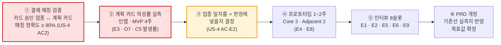
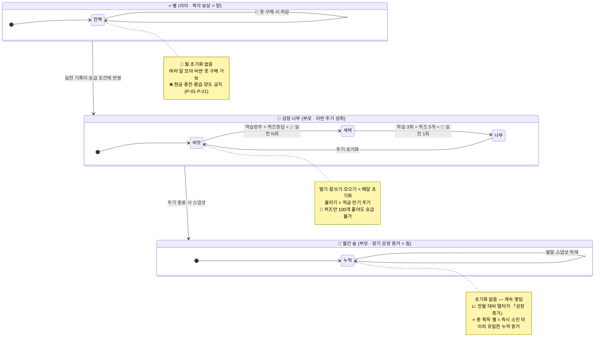
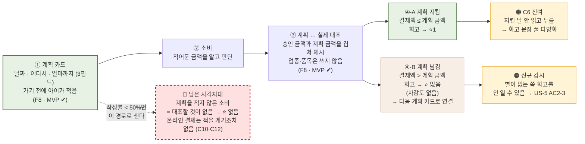

# 핀프렌즈(FinFriends) PRD v0.3

- **Owner 팀** — 제품기획 수빈 / 정책·법령 병윤 / 경쟁·리뷰 하영 / 서비스분석 혜원 *(3차 진행 중 유림 → 수빈 교체)*
- **최종 업데이트** — **2026-09-01**
- **근거 문서** — `VPS v2.0 rooted` (자립 문서 · 1,089줄). 본 PRD는 VPS의 결론을 **구현 가능한 요구사항으로 번역**한 것입니다.
- **판본** — **v0.3** (2026-09-01). 결정 근거는 **[부록 E. ADR](#부록-e-adr-architecture-decision-record)**
- **v0.2 원본** — `raw/60-internal/prd/PRD_핀프렌즈_v0_2.md` *(불변 스냅샷 · 수정 금지)*
- **하위 문서** — [`10. SRS/SRS_핀프렌즈_v1_0.md`](SRS_%ED%95%80%ED%94%84%EB%A0%8C%EC%A6%88_v1_0.md) *(요구사항 명세 · FR/NFR/AC)*
- 🔴 **문서 지위 — 고객 인터뷰 0건.** 모든 목표 수치는 **[가설]**, 기준선은 대부분 **⬜ 미측정**입니다. 어느 수치도 **성과로 인용할 수 없습니다.**

**등급 표기 (VPS 승계)** — `[A]` 학술·공공통계 · `[관측]` 팀 직접 확인 · `[추론]` 해석·모델값 · `[가설]` 미검증 · `[설계 확정]` 확정 사양 · `✍️[합성 가설]` 페르소나·여정·Pain · `🧪[모의]` 모의 응답(**Evidence 아님**)

> ### 🔴 이 PRD를 읽는 사람이 먼저 알아야 할 것
> 1. **대상은 초1~3(만 7~9세)** 이고 1차 타깃은 **현금·용돈 봉투를 쓰는 아날로그 가정**입니다. 주 비교 대상은 경쟁 앱이 아니라 **현금 봉투**입니다.
> 2. **앱은 부모용·아이용 2개**이며 전달 방식은 **PWA(웹)** 입니다. 설치가 아니라 **오리진(서브도메인) 분리**이고, 연결은 **부모가 만든 초대 링크**로 합니다.
> 3. **F8은 건별 계획 카드입니다** — 쓰기 전에 **「날짜 · 어디서 · 얼마까지」 3필드**만 적고, 쓴 뒤에 실제 결제와 맞춰봅니다. 품목·업종은 받지 않고 **⭐ 판정은 금액만**으로 합니다.
> 4. 🔴 **「사전 개입」은 제공하지 않습니다 — 0개입니다.**
>    **계획 카드는 개입 수단이 아니라 「사후 대조의 기준선」입니다.** 이 둘을 섞어 쓰지 마세요(§4-4·부록 D).
>    위치정보도 일절 쓰지 않습니다 — 지오펜싱·위치 알림 서술 금지.
> 5. **F15는 화면만 열고 ⭐는 잠금입니다.** 부모 적금은 **아이가 신청하고 부모와 현실에서 협상**하며, **합의 성립이 「불리기」 실천 1회**입니다 — ⭐는 지급되지 않습니다.
> 6. **β는 제휴 없이 모의 결제로 돌립니다.** 따라서 **업종 매칭 정확도(US-4 AC2)를 β에서 잴 수 없고**, WPA-v1 3종 중 「소비 회고」는 🧪`[모의]` 기반입니다.
> 7. **성능·가용성은 「잠정 상한」입니다**(§5-2) — 확정 SLO가 아니라 AC에서 역산한 상한입니다.
> 8. **모든 인터뷰 지표는 `k/8` 정수 판정**이고, 모든 KPI·AC·실험은 **PASS / HOLD / FAIL 3구간**으로 판정합니다(§1-3-1 · §3-0).

---

## 0. 용어·코드 사전 — 이 문서의 모든 약어

> 본문에서는 코드마다 뜻을 함께 적었지만, 처음 읽는 사람을 위해 한자리에 모았습니다.

### 0-1. 두 가치 선언

| 코드 | 문장 | 누구의 것 |
|:-:|---|---|
| **선언 ①**<br>*(성장이 일어난다)* | **"핀프렌즈는 자녀가 금융에 대해 학습하고 금융 행동을 실천하며 성장할 수 있습니다."** | 🧒 **아이** — 학습·실천·성장이 아이에게서 일어남 |
| **선언 ②**<br>*(그 성장이 보인다)* | **"핀프렌즈는 자녀가 얼마나 금융 지식을 배웠는지가 아닌, 금융 행동이 어떻게 달라졌는지 한 눈에 보여줍니다."** | 👤 **부모** — 그 결과를 확인 |

**위계** — 선언 ①이 일어나야 선언 ②가 보여줄 것이 생깁니다. 아이가 멈추면 부모 화면은 **빈 상태로 「정상 작동」** 합니다.

### 0-2. 제품이 수행하는 일 (Job)

| 코드 | 읽는 이름 | 뜻 | 대응 선언 |
|:-:|---|---|:-:|
| **J1** | **실천할 자리 만들기** | 배운 것을 실천할 자리를 만들고, 실천이 성장으로 집계되게 한다 | 선언 ①(성장이 일어난다) · 아이 |
| **J2** | **행동 변화 보여주기** | 활동량이 아니라 「행동이 어떻게 달라졌는지」를 한 눈에 보여준다 | 선언 ②(그 성장이 보인다) · 부모 |
| **J3** | **끊김 방지** | 시작·인정·탐지가 끊기지 않게 한다 *(위계의 전제)* | ①→② 연결 |

### 0-3. 고객 문제(Pain) 코드 — 8건

| 층위 | 코드 | 읽는 이름 | 한 줄 뜻 | 인물 |
|:-:|:-:|---|---|:-:|
| ★ **선별** | **C1(성장 증거 부재)** | **성장 증거 부재** | 누적 숫자(116일·75문제·6,650원)가 성장의 증거가 되지 못한다 | 정미경 |
| ★ **선별** | **C2(실천 공백 → 나무 정체)** | **실천 공백 → 나무 정체** | 실천 칸이 비어 4개 나무가 전부 정체한다 | 정미경 |
| ★ **선별** | **C5(사전 개입 사각지대)** | **사전 개입 사각지대** | **재정의** — 소비 직전에 아이를 멈춰 세울 자동 수단이 없다. *(구: 「3분 체류」가 1분 미만 즉흥 구매를 못 잡는다 → 위치 알림 삭제로 전제 소멸)* | 배성우 |
| ◇ **보조** | **C3(정체 원인 미설명)** | **정체 원인 미설명** | 2주 정체를 부모가 아이의 능력 문제로 해석한다 | 정미경 |
| ◇ **보조** | **C10(FOMO 3초 판단)** | **FOMO 3초 판단** | 한정 스킨 결제는 판단 시간이 3초다 | 강동혁 |
| ◇ **보조** | **C12(온라인 개입 부재)** | **온라인 개입 부재** | 온라인 결제 사전 개입이 설계에 원리적으로 없다 | 강동혁 |
| △ **감시** | **C6(회고 형식화)** | **회고 형식화** | **범위 축소** — ⭐를 **계획 준수 시에만** 지급하도록 확정(v13 §5)하여 「참은 날 = 안 참은 날」 문제는 해소. 남은 것은 **지킨 날에 읽지 않고 누르는 것** | 배성우 |
| △ **감시** | **A1(「불리기」 학습 장벽)** | **「불리기」 학습 장벽** | 이자·복리가 어려워 「불리기」가 학습 단계부터 막힌다 | 오하늘 |
| — | **C4(온보딩 5단계 비용)** | **온보딩 5단계 비용** | 현금 5초 ↔ 온보딩 5단계. 선별은 아니나 로드맵에 남음 | 배성우 |

**층위 표기** — ★ **선별**(3건 · 반드시 해결) · ◇ **보조**(3건 · 같은 해법으로 함께 풀림) · △ **감시**(2건 · 선언에 걸려 있으나 지표는 낮음)

### 0-4. 인물 (페르소나)

| 코드 | 읽는 이름 | 한 줄 |
|:-:|---|---|
| **H1** | **정미경**(39 · 중학교 교사) | 퍼핀 8개월차 — 숫자는 쌓이는데 확신은 안 쌓임 |
| **H2** | **배성우**(42 · 카페 자영업) | 현금 봉투 3년 — 소비 데이터가 아예 없음 |
| **H4** | **강동혁**(45 · 주 양육자) | 게임 결제로 용돈 60% 증발 *(보조 Pain 인물)* |
| **H5** | **오하늘**(38 · 약사) | 낭비는 안 하는데 모을 이유가 없음 *(감시 Pain 인물)* |
| **H6** | **임태경**(43 · 물류) | 지출 통제가 목적 — 🔴 **범위 밖으로 결정** |
| **H7 · H8** | 백현주 · 서명숙 | 승인 지연·부재 *(포용성 · 여정에서 P0)* |
| **H10** | 신가영(41 · 은행원) | 아이부자 2년차 — 불만이 없음 *(전환 검증용)* |

### 0-5. 지표 · 실험 · 기능 코드

| 접두 | 뜻 | 예 |
|:-:|---|---|
| **WPA** | **Weekly Practiced Active** — 주간 실천 인정 아동 비율 *(북극성 지표)* | §1-3 |
| **O1~O14** | **Outcome** — 고객이 원하는 결과의 정량 지표 | O4 = 7일 내 첫 실천 인정률 |
| **E1~E11** | **Experiment** — 검증 실험 | **E3 = 계획 카드 작성률** · E7은 폐기(결번) |
| **F1(성장 나무)~F18** | **Feature** — 기능 번호 *(기능정의 v13·가치제안서 승계)* | 위치 기반 기능는 **결번** — 위치 기반 기능은 제공하지 않는다 |
| **US-1~US-8** | **User Story** — 사용자 스토리 | US-2 = 첫 실천이 나무에 반영된다 |
| **AC / AC-E** | **Acceptance Criteria** — 수용 기준 / **AC-E** = 예외·실패 케이스 기준 | US-6 AC-E2 |
| **P-01~P-23 · F-01** | **정책·법령 조항** — 규제 상수 | P-17·P-18 = 카드 한도·업종 제한<br>**P-19(위치정보)는 적용 없음** — 위치정보 미수집 |
| **①~④ 세그먼트** | 시장 세그먼트 | ① 금융성장 증명형(29.3만명 · 1차 타깃) |

### 0-6. 일반 약어

| 약어 | 풀어쓰면 |
|:-:|---|
| **MVP** | Minimum Viable Product — 최소 기능 제품 (여기서는 **F1(성장 나무)~F13(소비 내역·전월 비교) 13개**) |
| **KPI** | Key Performance Indicator — 핵심 성과 지표 |
| **NFR** | Non-Functional Requirement — 비기능 요구사항 |
| **SLO** | Service Level Objective — 서비스 수준 목표 *(성능·가용성 약속치)* |
| **Must·Should·Could·Won't** | 기능 우선순위 4단계 *(MoSCoW 기법)* |
| **AOS · DOS** | Attractive/Dissatisfied Opportunity Score — 고객 체감 / 시장 가중 기회점수 |
| **TAM · SAM · SOM** | 전체 / 유효 / 실질 공략 가능 시장 |
| **PASS · HOLD · FAIL** | 판정 3구간 — 통과 / 보류(표본 추가 후 재판정) / 실패(재설계) |
| **p95** | 95번째 백분위 — 100번 중 95번은 이 값 이내 |
| **Cohen's κ** | 코더 2인의 판정 일치도 계수 *(0.6 이상을 요구)* |

## 1. 개요·목표

### 1-1. 문제 정의 — Pain ID · 실패 KPI

> **범위 판정** — VPS §1-3의 8건 중 **7건을 PRD 범위에 넣고, A1(「불리기」 학습 장벽)은 관측만** 합니다. A1은 대응 기능(F15 예적금 실천)이 규제 선결(P-20: 예적금 가입 중개 회피) 대기라 요구사항으로 확정할 수 없습니다.

| 층위 | ID | 문제 (한 줄) | **실패 KPI — 이 값이면 실패** | 기준선 | 등급 | PRD 범위 |
|:-:|---|---|---|:-:|:-:|:-:|
| ★ **선별** | **C1(성장 증거 부재)** | 누적 숫자가 성장의 증거가 되지 못한다 | 나무 5초 노출 후 **행동 변화 1문장 회상 성공률 < 50%** · 부모 주 1회 확인 시간 **> 8분** | ⬜ 미측정<br>*(인터뷰 T3·Q0-2에서 실측)* | ✍️[합성 가설] | ✅ |
| ★ **선별** | **C2(실천 공백 → 나무 정체)** | 실천 칸이 비어 4개 나무가 전부 정체한다 | **가입 후 7일 내 첫 실천 인정률 < 40%** · 월말 4칸 중 2칸 이상 성장 가정 **< 30%** | ⬜ 미측정<br>*(프로토타입 1주차 실측)* | ✍️[합성 가설] | ✅ |
| ★ **선별** | **C5(사전 개입 사각지대)** | 소비 직전 자동 개입 수단이 없다 → **계획 카드를 적어둔 소비만 대조된다** | **계획 카드 작성률 < 50%**(카드 결제 건 대비) · 아이 소비 중 앱 기록 비율 **< 70%** | **0** *(현금 = 기록 0건)*<br>**체류시간 실측 불필요해짐** | ✍️[합성 가설] | ⚠️ **부분** — §1-4 |
| ◇ **보조** | **C3(정체 원인 미설명)** | 2주 정체를 부모가 아이의 능력 문제로 해석한다 | 정체 발생 시 **원인 표시 열람률 < 40%** · 오귀인 발화 비율 **> 40%** | ⬜ 미측정<br>*(인터뷰 Q1-9)* | ✍️[합성 가설] | ✅ |
| ◇ **보조** | **C10(FOMO 3초 판단)** | FOMO 결제는 판단 시간이 3초다 | 온라인 결제 건 중 **사전 개입 도달 0건 유지** | **0** | ✍️[합성 가설] | ⚠️ **관측만** |
| ◇ **보조** | **C12(온라인 개입 부재)** | 온라인 결제 사전 개입이 설계에 원리적으로 없다 | 동일 | **0** | ✍️[합성 가설] | ⚠️ **관측만** |
| △ **감시** | **C6(회고 형식화)** | **범위 축소** — ⭐는 **계획 준수 시에만** 지급(v13 §5). 남은 위험은 **계획을 지킨 날에 회고를 읽지 않고 누르는 것** | **동일 회고 문장 재노출률 > 50%**(7일 창) · **계획 준수 건의** 회고 화면 체류 **중위 < 2초** | ⬜ 미측정 | [설계 확정]+[추론] | ✅ |
| △ **감시** | **A1(「불리기」 학습 장벽)** | 「불리기」가 학습 단계부터 막힌 칸이 된다 | 4주제 중 **「불리기」 학습 완주율이 최저이며 차상위와 격차 > 20%p** | ⬜ 미측정 | ✍️[합성 가설] | 📋 **관측만** |

**🔴 아이 행동 KPI의 관측 수단 문제**

VPS §1-5는 **아이 Pain 12건 중 부모 화면에 신호로 나타나는 것이 0건**이라고 적습니다 **[추론]**. 아이 인터뷰도 0건입니다. 따라서 아이 기준 KPI는 **관측 수단을 함께 확정**해야 합니다.

| 아이 KPI | 관측 수단 | 상태 |
|---|---|---|
| 첫 실천 인정률 · 실천 트리거 도달 | **인앱 이벤트 로그** | 🟢 확보 가능 (F4(별 지급 엔진) 별 지급 로그) |
| 3일/7일 재접속률 | 인앱 세션 로그 | 🟢 확보 가능 |
| 회고 화면 체류 시간 | 인앱 화면 체류 로그 | 🟢 확보 가능 — **C6(회고 형식화) 판정의 유일한 수단** |
| 「참은 날」의 주관적 차이 | ❌ 없음 | 🔴 **아이 직접 조사 필요** (P-05 동의 · P-12 언어) |
| 소비 순간 실제 멈춤 | ❌ **트리거를 만들지 않기로 확정** (§4-2) | **계획 카드 작성률 + 계획 준수율로 대체** — 「멈췄는가」는 못 재고 **「적은 대로 썼는가」** 를 잼 |

### 1-2. 목표 — Desired Outcome 수치화

| # | Outcome | 지표 | 기준선 | **목표 [가설]** | 측정 주기 | 측정 도구 |
|:-:|---|---|:-:|:-:|:-:|---|
| O1 | 변화가 한 문장으로 읽힌다 | 나무 5초 노출 후 1문장 회상 성공률 | ⬜ | **≥ 70%** | 인터뷰 회차 | 인터뷰 T3 (n=8) |
| O2 | 확인이 짧아진다 | 부모 주 1회 확인 소요시간 | ⬜ *(15분 추정)* | **3분** | 주간 | 인앱 세션 시간 + 인터뷰 Q0-2 |
| O3 | 부모–자녀 대화가 생긴다 | 돈 이야기 월 횟수 | ⬜ 미측정 | **월 2회** | 월간 | 🔴 **자기보고 단독 — 인앱 관측 불가.** 교차 검증 수단이 없어 **보조 지표로만** 사용하고 게이트 기준으로 쓰지 않음 |
| O4 | 첫 실천이 반영된다 | 가입 후 7일 내 첫 실천 인정률 | ⬜ | **≥ 60%** | 주간 | 인앱 이벤트 |
| O5 | 네 칸이 고르게 자란다 | 월말 4칸 중 2칸 이상 성장 가정 비율 | ⬜ | **≥ 50%** | 월간 | 인앱 집계 |
| O6 | 실천 경로가 실제로 쓰인다 | 실천 트리거 5종 중 1종 이상 도달 아동 비율 | ⬜ | **≥ 70%** | 월간 | 인앱 이벤트 |
| O7 | 쓰기 전에 적은 기록이 남는다 | **계획 카드 작성 건수 / 카드 결제 건수** | **0%** | **≥ 50%** | 주간 | `plan_card_created` ÷ `payment_settled` — **F8의 생존 조건** |
| O8 | 소비가 기록으로 남는다 | 아이 소비 건수 중 앱 기록 비율 | **0%** *(현금)* | **전건** | 주간 | 카드 결제 원장 |
| O10 | 멈춘 이유를 알 수 있다 | 정체 원인 표시 열람률 · 실천 근거 열람률 | ⬜ | **≥ 60%** | 월간 | 인앱 화면 로그 |
| O13 | 아이가 멈춘 것을 부모가 곧 안다 | 아이 루프 정지 → 부모 인지 일수 | ⬜ *(최대 한 달)* | **≤ 3일** | 주간 | F11(3일 미접속 알림) 알림 발송·열람 로그 |
| O14 | 부모 루프가 돈다 | 다음 달 충전율 · 월간 숲 익월 재방문율 | ⬜ | **≥ 70% / ≥ 50%** | 월간 | 인앱 집계 |

### 1-2-1. 측정 경로 — 인앱 이벤트 명세

> 아래는 각 지표가 **어떤 이벤트를 무슨 필드로 적재해 산출되는지**의 명세입니다.

| 이벤트명 | 발생 시점 | 필수 필드 | 이 이벤트로 산출되는 지표 |
|---|---|---|---|
| `practice_credited` | 실천 트리거로 ⭐ 지급 확정 | `child_id` `trigger_code(4·5·6·7·8)` `earned_at` `awarded_at` `approval_mode(auto·parent)` `tree_slot` | 🔴 **WPA(북극성)** · O4(7일 내 첫 실천 인정률) · O6(실천 경로 도달) |
| `star_ledger_entry` | 별 증감 확정 | `child_id` `delta` `trigger_code` `balance_after` `idempotency_key` | 별 정합성 오류율 · O8 |
| `tree_state_changed` | 나무 단계·조건 갱신 | `child_id` `slot` `stage_before` `stage_after` `cond_learn` `cond_quiz` `cond_practice` `stall_days` | O5(월말 4칸 성장) · C3(정체 원인 미설명) 정체 일수 |
| `tree_view_opened` | 부모가 성장 나무 진입 | `parent_id` `dwell_ms` `evidence_expanded(bool)` `stall_reason_shown(bool)` | O10(실천 근거·정체 원인 열람률) |
| `forest_view_opened` | 부모가 월간 숲 진입 | `parent_id` `year_month` `delta_items_rendered(int)` `dwell_ms` | O2(부모 확인 시간) · O14(익월 재방문) · **§8-3 ③ 변화 지표 개수** |
| `retro_viewed` | 회고 화면 진입~이탈 | `child_id` `sentence_id` `dwell_ms` `plan_amount` `actual_amount` **`plan_met(bool)`** **`star_granted(bool)`** | △ 감시 C6(회고 형식화) 체류 중위 · 동일 문장 재노출률 · **계획 준수율** · **갈래별 회고 열람률** |
| `approval_state_changed` | 미션 승인/거절/소급 | `mission_id` `state(pending·approved·rejected·backfilled)` `delay_hours` `cycle_id` | US-6 소급 성공률 · 대기 분포 |
| `inactivity_notified` | 3일 미접속 알림 발송 | `parent_id` `child_id` `last_session_at` `sent_at` `opened_at` | O13 탐지 일수 · F11(3일 미접속 알림) 발송·열람률 |
| `onboarding_step` | 온보딩 단계 진입/완료/이탈 | `parent_id` `step(1~5)` `state` `resumed(bool)` | US-8 퍼널 · 3단계 이탈률 |
| `consent_gate_blocked` | 동의 미완 상태 아이 진입 차단 | `parent_id` `attempted_at` | 🔴 규제 알림(>0건 즉시) |

> **적재 규칙** — 모든 이벤트에 `idempotency_key`(중복 방지) · `client_ts` / `server_ts`(오프라인 보정) 필수. **오프라인 발생 이벤트는 `client_ts` 기준으로 주차(week)에 귀속**합니다.

### 1-3. 성공 지표 — 북극성 / 보조 KPI

> ## ⭐ 북극성 KPI — **WPA (Weekly Practiced Active · 주간 실천 인정 아동 비율)**

### 조작적 정의

```
WPA(주차 w) = 분자 / 분모

분자 — 주차 w 동안 「실천 트리거」로 ⭐를 1회 이상 받은 아동 수
       (practice_credited 이벤트가 1건 이상 있는 distinct child_id)

분모 — 주차 w 「활성 아동」 수
       = 주차 w 시작 시점에 아래 3조건을 모두 만족하는 아동
         ① 보호자 법정대리인 동의 완료 (P-05: 법정대리인 동의)
         ② 아이 계정 생성 후 7일 경과   ← 온보딩 ⭐가 실천을 과대계상하는 것을 차단
         ③ 직전 28일 내 앱 세션 1회 이상 ← 완전 이탈 계정 제외

주차 기준 — ISO 주(월~일) · KST
```

| 버전 | 「실천 트리거」 범위 | 언제 쓰는가 |
|:-:|---|---|
| 🔴 **WPA-v1** *(MVP 기준)* | **트리거 4** 미션 승인 · **5** 소비 회고 · **6** 위시리스트 달성 — **3종** | MVP 전 기간 |
| **WPA-v2** *(개통 후)* | v1 + **트리거 7·8** 예적금(F15) — **4종** | F15 개통 시점부터 |

> 🔴 **분자에 넣는 트리거는 MVP에 실제로 구현된 것만입니다.** 정의와 구현이 어긋나면 **WPA가 구조적으로 3종 상한에 묶인 것을 성능 문제로 오독**하게 됩니다.
> **WPA-v2 전환 시 시계열을 단절 표기**하고, 전환 후 4주간은 v1·v2를 **병기**합니다.

**제외 규칙 (분자에 넣지 않음)** — 트리거 **1** 온보딩 학습 · **2** 출석체크 · **3** 퀴즈 정답. 셋 다 **학습 경로**이며, 특히 출석 ⭐1이 분자에 들어가면 *"접속만으로 실천 지표가 오르는"* 활동량 지표로 퇴화합니다.

| 항목 | 값 |
|---|---|
| **기준선** | ⬜ 미측정 — **프로토타입 2주차부터 산출** |
| **목표 [가설]** | **≥ 5/8 가정** *(β 클로즈드 · n=8)* → 일반 공개 후 **≥ 55%** |
| 측정 주기 | 주간 (ISO 주 마감 후 D+1 배치) |
| 측정 경로 | `practice_credited` + 활성 아동 스냅샷 |

**왜 이것 하나인가** — 근거 세 겹입니다.

1. **선언 ①(성장이 일어난다)이 ②의 전제**입니다. 아이가 실천하지 않으면 부모 화면은 **거짓말을 하지 않고 비어 있을 뿐**이고(VPS §1-5 관찰 2 **[추론]**), 그 빈 화면이 *"우리 애가 안 하는구나"* 로 읽힙니다. **②의 어떤 지표를 북극성으로 삼아도 ①이 죽으면 함께 죽습니다.**
2. **C2(실천 공백 → 나무 정체)는 AOS·DOS 두 지표에서 순서가 흔들리지 않는 유일한 항목**입니다(VPS §3-2 **[추론]**) — 논쟁의 여지가 가장 적은 투자처입니다.
3. **나무 성장 조건에 「행동 실천 횟수」가 들어 있어**(v13 §3-1 **[설계 확정]**) 실천 없이는 나무·숲·별이 전부 작동하지 않습니다. WPA는 **제품 전체가 파생되는 단일 원천 지표**입니다.

⚠️ **북극성으로 채택하지 않은 후보와 이유**

| 후보 | 왜 아닌가 |
|---|---|
| 나무 5초 회상 성공률 (O1) | **인터뷰 회차 지표**라 상시 계측이 불가능하고, ①이 죽으면 회상할 내용 자체가 없습니다 |
| 다음 달 충전율 (O14) | 지연 지표(월 1회) — 문제를 **한 달 뒤에** 알려줍니다 |
| 아이 7일 재접속률 (O5) | 접속은 실천이 아닙니다. 출석 ⭐1만으로도 올라가 **활동량 지표로 퇴화**합니다 |

### 1-3-1. 3구간 판정 규칙 — 모든 KPI · AC · 실험에 공통 적용

> 통과선과 실패선만 두면 **그 사이 구간의 판정이 없습니다.** 그래서 HOLD 구간을 명시합니다.

| 구간 | 판정 | 행동 |
|---|:-:|---|
| **통과선 이상** | ✅ **PASS** | 다음 게이트로 진행 |
| **통과선 미달 ~ 실패선 초과** | ⚠️ **HOLD** | **표본 +4 추가 후 재판정.** 2회 연속 HOLD면 **FAIL로 간주** · 그 사이 로드맵 변경 없음 |
| **실패선 이하** | ✕ **FAIL** | 지정된 재설계를 실행하고 다음 판본에 반영 |

| 지표 | PASS | HOLD | FAIL |
|---|:-:|:-:|:-:|
| 나무 5초 회상 (O1) | **≥ 6/8** | 4~5/8 | **≤ 3/8** |
| 첫 실천 인정률 (O4) | ≥ 60% | 40~59% | < 40% |
| 계획 카드 작성률 (E3) | ≥ 50% | 30~49% | < 30% |
| 정체 원인 열람률 (O10) | ≥ 60% | 40~59% | < 40% |
| WPA (β 기준) | ≥ 5/8 | 3~4/8 | ≤ 2/8 |

**보조 KPI**

| 축 | 지표 | 기준선 | 목표 [가설] | 주기 | 측정 경로 |
|---|---|:-:|:-:|:-:|---|
| 선언 ②(그 성장이 보인다) *(전달)* | 나무 5초 회상 · 부모 확인 시간 | ⬜ | **≥ 6/8** · 3분 | 인터뷰 회차 · 주간 | 인터뷰 T3 rubric · `forest_view_opened.dwell_ms` |
| 선언 ②(그 성장이 보인다) *(신뢰)* | 실천 근거 열람률 · 정체 원인 표시 열람률 | ⬜ | ≥ 60% | 월간 | `tree_view_opened.evidence_expanded` · `.stall_reason_shown` |
| J3(끊김 방지) *(인정)* | 승인 지연 시 ⭐ 소급 지급 성공률 | — | **100%** | 주간 | `approval_state_changed(state=backfilled)` |
| J3(끊김 방지) *(탐지)* | 아이 정지 → 부모 인지 일수 | ⬜ | ≤ 3일 | 주간 | `inactivity_notified` |
| 데이터 타당성 | 회고 화면 체류 중위값 · 동일 문장 재노출률 | ⬜ | ≥ 3초 · **≤ 2/8** | 주간 | `retro_viewed.dwell_ms` p50 · `sentence_id` 중복률 |
| 지속 | 아이 3일/7일 재접속률 · 익월 숲 재방문율 | ⬜ | ≥ 65%/50% · ≥ 50% | 주간·월간 | 세션 로그 · `forest_view_opened` |
| 관계 *(보조)* | 부모–자녀 돈 대화 월 횟수 | ⬜ | 월 2회 | 월간 | 🔴 **자기보고 단독 — 인앱 관측 불가.** 게이트 기준으로 쓰지 않음 |
| **수익** 🔴 | **카드 연결률 · 아동 1인당 월 결제액** | ⬜ | ⬜ **미정** | 월간 | **확정 방법** — 제휴사 수수료율 확인(검증과제 ⑥) 후 **`월 결제액 × 수수료율 ≥ 아동 1인당 월 원가`** 를 만족하는 최소값으로 역산. 그때까지 **관측만 하고 목표를 세우지 않음** |

> 🔴 **수익 KPI를 「유료 전환율」로 쓰지 않습니다.** v13 §10에서 **부모·아이 모두 무료**가 확정돼 **SOM Level 3(구독 전제 · 440가구 × 월 4,900원) 산출식이 무효**입니다 **[설계 확정]**. 수익은 **결제 수수료 + 금융사 제휴 2중 구조**입니다.

### 1-4. 🔴 이 PRD가 해결하지 못하는 것

| 미대응 | 내용 | 왜 |
|---|---|---|
| ★ **C5(사전 개입 사각지대)** *(선별)* | 🔴 **미대응 확정** — 소비 직전 개입 수단 **0개** (AOS 4.0 전체 공동 1위) | F8은 개입이 아니라 **대조 기준선**을 만든다. 계획을 적지 않은 소비는 **회고 대상이 아닐 뿐** F13 소비 내역에는 남는다 — 사각지대는 그대로다 |
| ◇ **C10(FOMO 3초 판단) · C12(온라인 개입 부재)** *(보조)* | 온라인 결제 사전 개입 | 🔴 **미대응 확정** — 대응 기능 **0개**. 온라인 결제는 계획 카드를 적을 계기조차 없다 |
| △ **A1(「불리기」 학습 장벽)** *(감시)* | 「불리기」 실천 경로 | F15(예적금 실천)가 **P-20(금융상품 중개업 회피) 범위 확인 선행** 대기 — MVP에서 「불리기」는 **학습만 열리고 실천은 닫힘** |
| — | 선언 ①(성장이 일어난다)의 **「학습」 마디** | 고객 Pain으로 지탱되지 않고 설계 근거로만 서 있음. **검증과제 ①의 결과에 직접 걸림** |

> **결과** — MVP는 **선언 ②(그 성장이 보인다)를 완성하고 선언 ①(성장이 일어난다)을 4칸 중 3칸에서 개통**하는 범위입니다.
> *"소비 순간에 자동으로 멈춘다"* 는 **제공하지 않습니다.** 우리가 주는 것은 **「쓰기 전에 적고, 쓴 뒤에 맞춰보는」 고리**이며, 자동 개입은 **계획 카드 작성률이 검증된 뒤** 다시 논의합니다.

📑 **이 절이 인용한 VPS 절과 등급** — §1-3(Pain 8건 ✍️합성 가설) · §1-5(신호 0건 [추론]) · §3-1(O1~O14 [가설]) · §3-2(순서 역전 [추론]) · §8-0(v13 사양 [설계 확정]) · §8-3(컷라인 근거) · §9(무료 확정 · SOM 무효)

---

## 2. 사용자와 페르소나

### 2-1. 핵심 페르소나 2인

> **선별 단위는 Pain Point이고 인물은 그 결과**입니다 — 선별 C1(성장 증거 부재)·C2(실천 공백 → 나무 정체)·C5(사전 개입 사각지대)를 고른 뒤 인물을 추적하니 H1·H2가 나왔습니다. **새 페르소나를 추가하지 않습니다.**

| | **H1 정미경** *(선별 — C1 성장 증거 부재 · C2 실천 공백→나무 정체 / 보조 — C3 정체 원인 미설명)* | **H2 배성우** *(선별 — C5 사전 개입 사각지대 / 감시 — C6 회고 형식화)* |
|---|---|---|
| **프로필** | 39 · 중학교 교사 · 정하율(만 8세·초2)<br>주 8,000원 앱 충전 · **퍼핀 8개월차** · 아이 전용 태블릿 · 응답 **당일** | 42 · 카페 자영업(주 6일 · 07~20시) · 배주안(만 9세·초3)<br>**현금 봉투 주 5,000원 · 3년** · 아이 기기 **키즈워치** · 확인 주 1회 |
| **세그먼트** | ① 금융성장 증명형 · **29.3만명(35.8%)** · SOM 도달계수 **1.00** | 동일 세그먼트 ① 내부 · 도달계수 **1.00** |
| **Job** | **배운 것이 실제 돈 행동으로 이어졌는지를 짧은 시간에 확인하고 싶다** | **쓰기 전에 한 번 멈추게 하고, 그 선택이 기록으로 남게 하고 싶다** |
| **대체재 한계** | 퍼핀 학습현황 — **"보고도 모른다"** (Satisfaction 2) | 현금 봉투 — **"볼 것이 없다"** (Satisfaction 1 · 기록 0건) |
| **여정 최저 감정** | **3** (0단계 접하기 전) | **1** (3단계 전환 결정 — 온보딩 5단계 vs 현금 5초) |
| **진입 후크** | 🌳 성장 나무 · 🌲 월간 숲 | 📝 **소비 계획 카드 · 계획↔실제 대조** *(나무가 아님)* |
| **이탈 트리거** | 나무 **2주 이상 정체** → 아이 탓이 아니라 **앱 불신**으로 조용히 이탈 | **알림이 실제로 오지 않으면 즉시 이탈** |
| **진입 장벽 성격** | **기록 이전 불가**(8개월치 자산) | **시간**(가게 일하면서 배송 받고 등록) |

> ⚠️ **두 인물은 같은 세그먼트 ① 안에 있습니다** — 모수를 각각 더해 58.6만으로 읽지 않습니다.
> ✅ **아이 전용 기기는 전제가 아닙니다.** 선별 인물 둘 다 「전용 스마트폰을 들고 다니는 아이」가 아니며(H1 태블릿=집 안 · H2 키즈워치), 아이 앱은 **부모 폰에 함께 두고 쓸 수 있습니다**(§4-2).
> 🔴 다만 **C10(FOMO 3초 판단)·C12(온라인 개입 부재)** 는 이제 **대응 수단이 0개**입니다 — §1-4.

### 2-2. 여정 단계별 Pain·Needs 매핑

| 단계 | **H1 정미경** | **H2 배성우** | 대응 기능 |
|:-:|---|---|---|
| **0** 접하기 전 | ★**C1(성장 증거 부재)** 누적 숫자 3개(116일·75문제·6,650원)가 증거가 못 됨 *(감정 3)* | 소비 데이터가 **아예 없음** — 무엇을 가르칠지도 모름 *(감정 3)* | F1(성장 나무) · F9(월간 숲) · F13(소비 내역·전월 비교) |
| **1** 문제 신호 | 오답 재시도 보상 목격 → **학습 데이터 불신** | 하교길 문구점에서 3,000원 소진, **닷새 뒤 지갑 보고 안다** *(감정 2)* | F8(결제 회고) · F13(소비 내역·전월 비교) |
| **2** 인지·비교 | 나무 4칸에서 *"어디가 멈췄는지 보인다"* 즉시 이해 | **계획↔실제 대조 화면** 즉시 이해 — *"어디에 얼마 썼는지 그거 하나만"* *(감정 4)* | — |
| **3** 🔑 전환 결정 | **8개월치 기록 이전 불가** → '리셋'으로 체감 | **C4(온보딩 5단계 비용)** 현금 5초 ↔ 온보딩 5단계 *(감정 **1** 최저)* | F7(부모 온보딩·동의) · F16(카드 없는 체험)(✖) · F18(기록 이전)(✖) |
| **4** 아바타·온보딩 | — | 첫 보상까지 5분 · 규칙 이해 속도 > 별 모으는 속도 | F5(아바타·옷장) · F6(아이 온보딩) |
| **5** 학습·별 모으기 | 출석 ⭐1 우려 — *"공부를 안 할 수도"* | 학습 진도 느림 → **출석 ⭐1이 유일한 초기 별** | F3(학습 4주제) · F4(별 지급 엔진) |
| **6** 실천 선택 | ★**C2(실천 공백 → 나무 정체)** 실천 칸이 비어 **4칸 전부 정체** *(감정 4)* | ★**C5(사전 개입 사각지대)** 계획을 적어두지 않고 나간 소비는 **대조할 것이 없음** *(감정 4)* | F2(미션 루프) · F12(위시리스트) / **F8 계획 카드(부분)** |
| **7** 🔑 실천 판정 | — | **해소** — ⭐를 **계획 준수 시에만** 지급하도록 확정(v13 §5)하여 참은 날과 안 참은 날이 구별됨. 남은 △**C6(회고 형식화)** 은 **지킨 날의 미열람**과 **못 받은 날의 회고 이탈** | F8(결제 회고) |
| **8** 아이템 구매 | 별을 즉시 소진 → 잔액만 표시돼 누적 성과 안 보임 | 참기 → 별 → 아이템 인과가 **가장 선명하게 성립** | F5(아바타·옷장) · F9(월간 숲)(총 획득 별) |
| **9** 나무·숲 | 4칸 확인 | 학습 이력 없어 **벌기·불리기 칸이 오래 비어** 고르지 않게 보임 | F1(성장 나무) · F9(월간 숲) |
| **10** 전환 후 | ◇**C3(정체 원인 미설명)** 2주 정체 → **오귀인 또는 앱 불신** *(감정 4)* | 소비가 안 줄면 *"보이기만 하고 달라지지 않는다"* 실망 | F1(성장 나무) 정체 원인 · F13(소비 내역·전월 비교) |

### 2-3. 범위 밖 세그먼트

| 세그먼트 | 규모 | 왜 범위 밖인가 | 그럼에도 남기는 것 |
|---|---|---|---|
| **③ 용돈 소비통제형** *(H6 임태경형)* | **13.3만명 (16.3%)** | Job이 **「지출 감축」** 이라 두 선언과 **성공 기준 자체가 다름.** AOS 1위(A6 4.0)이지만 DOS(SOM) 7위 | **F13(소비 내역·전월 비교)(전월 대비 증감액 상단)** 이 최소 유지 조건을 충족할 수 있음 — **포기가 아니라 1차 타깃 제외** |
| ② 습관관리형 / ④ 잠재관심형 | 27.0만 / 12.2만 | 3차·후순위 확장 | 별도 문서 |
| Extreme *(H7·H8)* | — | AOS·DOS 프레임 밖 | 🔴 **승인 지연은 여정지도에서 P0** → **F10(⭐ 소급 지급)이 대응** |
| Non-user *(H9~H11)* | — | 전환 이전에 이탈 | 진입 전략 사안 — F16(카드 없는 체험)·F18(기록 이전) |

📑 **인용 VPS 절과 등급** — §1-1(인물·모수 [A]+모델값) · §1-2(CJM ✍️합성 가설) · §2-1(JTBD 카드 🧪모의) · §1-0③(세그먼트 [A]+[추론]) · §8-2(F 매핑 [설계 확정])

---

## 3. 사용자 스토리와 수용 기준(AC)

> **Job 축** — **J1(실천할 자리 만들기)** 배운 것을 실천할 자리를 만든다 *(선언① · 아이)* / **J2(행동 변화 보여주기)** 행동이 어떻게 달라졌는지 보여준다 *(선언② · 부모)* / **J3(끊김 방지)** 시작·인정·탐지가 끊기지 않게 한다 *(전제)*
> AC의 Given에 **여정 단계 번호**를 넣어 §2-2와 대조할 수 있게 했습니다.
> **AC-E** = 예외·실패 케이스 수용 기준.

### 3-0. AC 판정 규칙 — 표본 · 임계치 · 코딩

**① 정수 임계치 환산 (n=8 인터뷰 지표)**

> 🔴 **비율 표기를 쓰지 않습니다.** n=8에서 `≥70%`는 5.6명이라 정수 경계가 불명확합니다. **모든 인터뷰 AC는 `k/8` 로 표기**합니다.

| 비율 표기 | 정수 판정 | 실제 비율 |
|---|:-:|:-:|
| ≥ 70% | **≥ 6/8** | 75% |
| ≥ 60% | **≥ 5/8** | 62.5% |
| ≤ 30% | **≤ 2/8** | 25% |
| ≤ 25% | **≤ 2/8** | 25% |

**② 코딩 규칙 (rubric)**

| 판정 대상 | 성공 조건 | 코딩 방식 |
|---|---|---|
| **「변화 회상」 성공** | 응답에 **① 비교 시점**(지난달·지난주 등) **② 변화 방향**(늘었다·줄었다·자랐다) **③ 대상**(칸 또는 행동) 세 요소가 모두 포함 | 진행자 외 **코더 2인 독립 코딩** |
| **「실천」 도달** | *"실천"·"실제로 했다"·"참았다"·"미션"* 중 하나를 **진행자 개입 없이** 발화 | 동일 |
| **오귀인 발화** | 정체 원인을 **아이의 능력·의지**로 귀속(*"애가 안 해서"*) | 동일 |
| **앱 불신 발화** | 정체 원인을 **앱의 신뢰성**으로 귀속(*"앱을 안 믿게 된다"*) | 동일 |

- **일치도 기준** — 두 코더의 **Cohen's κ ≥ 0.6**. 미달 시 코딩 규칙을 조정하고 **전 표본 재코딩**
- **불일치 항목** — 제3자(리뷰어)가 판정하고 사유를 기록
- **5초 노출 통제** — 타이머 + 화면 덮기 도구 사용. **노출 오차 ±0.5초 초과 세션은 표본에서 제외**하고 제외 건수를 보고

**③ 표본 미확보 시 판정 규칙**

| 확보 표본 | 판정 |
|:-:|---|
| **n ≥ 8** | 정상 판정 |
| **5 ≤ n < 8** | ⚠️ **HOLD 고정** — PASS 판정을 내리지 않음. 비율 환산 금지 |
| **n < 5** | **판정 불가** — 실험 미실시로 기록 |

### US-1 — 변화를 한 문장으로 읽는다  `J2 행동 변화 보여주기`  `★선별 C1 성장 증거 부재`
 변화를 한 문장으로 읽는다

> **As a** H1 정미경(부모), **I want** 화면을 열었을 때 활동량이 아니라 **무엇이 달라졌는지**를 읽고, **so that** 아이가 배운 것이 행동으로 이어졌는지를 짧은 시간에 확인할 수 있다.

| # | Given / When / Then | 측정 도구 · 표본 |
|:-:|---|---|
| **AC1** | **Given** 여정 0단계, 이번 달 실천 기록이 1건 이상 있는 계정 / **When** 🌳 성장 나무 화면을 **5초만** 노출하고 덮은 뒤 *"기억나는 것"* 을 묻는다 / **Then** *"이번 달 행동이 어떻게 달라졌나"* 를 **1문장으로 회상: ≥ 6/8** *(rubric「변화 회상」)* | 인터뷰 T3 · **n=8** (모집 8슬롯) · 회상 내용 코딩 |
| **AC2** | **Given** 나무 상세를 펼치지 않은 기본 상태 / **When** *"나무가 자랐다는 건 아이가 뭘 했다는 뜻인가"* 를 묻는다 / **Then** **진행자 개입 0회로 「실천」에 도달한 응답자 ≥ 6/8**. *"퀴즈를 많이 풀어서"* 만 나오면 **AC 실패** | 인터뷰 Q1-8 · **n=8** · 개입 횟수 로그 |
| **AC3** | **Given** 여정 10단계, 전월 데이터가 존재 / **When** 🌲 월간 숲을 열어 *"지난달과 비교해 뭐가 달라졌는지 찾아보라"* 고 한다 / **Then** **전월 대비 변화 항목을 60초 이내 3개 이상 지목 ≥ 6/8** · 부모 확인 소요시간 **중위 ≤ 3분** | 인터뷰 Q1-10 + 인앱 세션 시간 |
| **AC4** | **Given** 아이가 별을 즉시 소진해 잔액이 0인 계정 / **When** 월간 숲을 연다 / **Then** **「이번 달 획득 별」이 스크롤 없이 노출**되고, 부모가 누적 성과를 지목할 수 있다 ≥ 6/8 | 인터뷰 Q1-11 · 화면 캡처 검수 |
| **AC-E1** | **Given** 이번 달 실천 기록이 **0건**인 계정 / **When** 성장 나무를 연다 / **Then** **"아직 기록이 없어요 + 첫 실천 안내"** 가 표시되고, **빈 화면을 앱 결함으로 인식한 응답자 ≤ 2/8** *(빈 화면이 「우리 애가 안 하는구나」로 오독되는 경로 차단 — VPS §1-5 관찰 2)* | 인터뷰 · 화면 검수 |
| **AC-E2** | **Given** 가입 첫 달로 **전월 데이터가 없음** / **When** 월간 숲을 연다 / **Then** **「지난달과 비교」 영역이 "다음 달부터 비교할 수 있어요"로 대체**되고, **델타 0으로 렌더되지 않는다** *(0% → 0%가 「변화 없음」으로 오독되는 것 차단)* | 화면 검수 |

### US-2 — 첫 실천 한 건이 나무에 반영된다  `J1 실천할 자리 만들기`  `★선별 C2 실천 공백 → 나무 정체`
> **As a** 정하율(아이), **I want** 처음 실천한 한 건이 화면에서 **눈에 보이게** 반영되고, **so that** 계속할 이유가 생긴다. *(부모 관점: 화면이 움직이기 시작하는 것을 본다)*

| # | Given / When / Then | 측정 도구 · 표본 |
|:-:|---|---|
| **AC1** | **Given** 여정 6단계, 가입 7일 이내 아동 / **When** 실천 트리거 5종 중 1종을 최초로 완료한다 / **Then** **⭐ 지급 + 해당 나무 진행도 갱신이 동일 세션 내 반영** · **가입 7일 내 첫 실천 인정률 ≥ 60%** | 인앱 이벤트 로그 · 프로토타입 1~2주 (Core 3 · Adjacent 2) |
| **AC2** | **Given** 학습만 완료하고 실천 0건인 아동 / **When** 퀴즈를 추가로 풀어 학습·정답 조건을 초과 충족한다 / **Then** **나무 단계는 상승하지 않는다**(실천 0건이면 승급 불가) · 화면에 **"실천 N회 남음"** 이 명시된다 | 단위 테스트 + 화면 검수 |
| **AC3** | **Given** 여정 6단계 / **When** 월말에 집계한다 / **Then** **4칸 중 2칸 이상 성장한 가정 ≥ 50%** · **4칸 전부 씨앗 정체 가정 ≤ 15%** | 인앱 집계 · 월간 |
| **AC4** | **Given** MVP에서 「불리기」 실천 경로가 닫힘(F15(예적금 실천) 제외) / **When** 아이가 「불리기」 칸을 연다 / **Then** **"곧 열려요" 안내가 표시**되고, 4칸 미개통이 결함으로 오인되지 않는다 | 화면 검수 + 인터뷰 Q2-3 |
| **AC-E1** | **Given** 아동 기기가 **오프라인** / **When** 실천을 완료하고 이후 재연결된다 / **Then** **⭐ 중복 지급 0건**(`idempotency_key`) · 재연결 후 지급 반영 **≤ 60초** · 주차 귀속은 **`client_ts` 기준** | 단위 테스트 + `practice_credited` |
| **AC-E2** | **Given** 동일 미션에 대한 승인 요청이 **2회 이상** 발생 / **When** 부모가 각각 승인한다 / **Then** **⭐는 1회만 지급**되고 별 원장에 **불일치 0건** | 단위 테스트 + `star_ledger_entry` |
| **AC-E3** | **Given** 실천 조건은 충족했으나 **학습·퀴즈 조건 미충족** / **When** 나무 화면을 연다 / **Then** **승급하지 않고**, 남은 조건이 **조건별로 각각 표시**된다(*"학습 2회 · 퀴즈 3개 남음"*) | 단위 테스트 + 화면 검수 |

### US-3 — 멈춘 이유를 화면에서 안다  `J2 행동 변화 보여주기`  `◇보조 C3 정체 원인 미설명`
> **As a** H1 정미경(부모), **I want** 나무가 멈췄을 때 그 이유가 **아이 탓인지 조건 탓인지** 화면에서 구분되고, **so that** 실망을 아이에게 돌리지 않고 앱도 계속 신뢰할 수 있다.

| # | Given / When / Then | 측정 도구 · 표본 |
|:-:|---|---|
| **AC1** | **Given** 여정 10단계, 특정 칸이 **14일 이상 미상승** / **When** 부모가 그 칸을 연다 / **Then** **정체 원인이 조건 단위로 표시**된다(예: *"실천 1회가 남았어요 · 학습·퀴즈는 충족"*) · **열람률 ≥ 60%** | 인앱 화면 로그 · 월간 |
| **AC2** | **Given** 동일 상황 / **When** *"무슨 일이 있었다고 생각하느냐"* 를 묻는다 / **Then** **오귀인 발화 ≤ 2/8** · **앱 불신 발화 ≤ 2/8** *(분모 = 응답자 수)* | 인터뷰 Q1-9 · n=8 · rubric 코딩(κ≥0.6) |
| **AC3** | **Given** 정체 원인 표시를 본 부모 / **When** 다음 주 동일 화면에 재방문한다 / **Then** **정체 계정의 익주 재방문율 ≥ 50%**(정체가 이탈로 직결되지 않음) | 인앱 세션 로그 |
| **AC-E1** | **Given** 정체 원인이 **복수**(학습·실천 둘 다 미충족) / **When** 정체 원인을 표시한다 / **Then** **미충족 조건을 전부 표시**하고, **「가장 적게 남은 조건」을 최상단**에 둔다 *(다음 행동을 하나로 좁힘)* | 화면 검수 |
| **AC-E2** | **Given** 정체가 **주기 초기화 직후**에 발생(=아직 아무 조건도 채우지 않은 정상 상태) / **When** 부모가 화면을 연다 / **Then** **「정체」로 표시하지 않는다** — 정체 판정은 **주기 시작 후 14일 경과분에만** 적용 · **오탐 0건** | 단위 테스트 |

> 🔴 **AC2가 이 스토리의 핵심입니다.** 🧪 모의 응답에서 이 Pain은 *"아이 탓"* 이 아니라 **"앱을 안 믿게 된다"** 로 나타났습니다 — **오귀인은 대화라도 생기지만 불신은 신호 없이 이탈**합니다. 두 경로를 모두 계측합니다.

### US-4 — 📝 쓰기 전에 미리 적어둔다  `J1 실천할 자리 만들기`  `★선별 C5 사전 개입 사각지대`
> **As a** 배주안(아이), **I want** 가게에 가기 전에 **언제 · 어디서 · 얼마까지** 쓸지 적어두고, **so that** 쓰고 나서 그 카드와 실제 결제를 겹쳐 볼 수 있다.
> 🔴 **이것은 사전 개입이 아니다.** 소비 순간에 아이를 멈춰 세우는 장치는 없다(0개). 계획 카드는 **사후 대조의 기준선**이다.

| # | Given / When / Then | 측정 도구 · 표본 |
|:-:|---|---|
| **AC1** | **Given** 아이가 계획 카드를 연다 / **When** **날짜 · 어디서 · 얼마까지**를 입력한다 / **Then** 카드가 저장된다. **품목·업종은 입력받지 않고 지난 날짜로는 저장되지 않는다** | 단위 테스트 + 화면 검수 |
| **AC2** | **Given** 유효한 계획 카드가 있는 아동 / **When** 카드 결제가 발생한다 / **Then** 해당 결제가 계획 카드에 매칭되고 **⭐ 판정은 금액만으로** 이뤄진다 *(「어디서」는 화면에 표시하되 판정에 넣지 않음)* | 단위 테스트 |
| **AC3** | **Given** 계획 카드가 **없는** 상태에서 결제가 발생 / **When** 아이가 앱을 연다 / **Then** **「다음엔 가기 전에 적어볼까요?」 유도**가 노출되고 **⭐가 지급되지 않는다** | 화면 검수 |
| **AC4** *(생존 조건)* | **Given** MVP 운영 4주 / **When** 작성률을 집계한다 / **Then** **카드 결제 건 대비 ≥ 50%** *(O7)* | `plan_card_created` ÷ `payment_settled` |
| **AC-E1** | **Given** 한 계획 카드에 **여러 건의 결제**가 매칭 / **When** 대조 화면을 만든다 / **Then** **합계로 판정**하고 내역을 모두 나열한다 | 단위 테스트 |
| **AC-E2** | **Given** 계획 금액을 결제 후에 수정 / **When** ⭐ 판정을 조회한다 / **Then** **결제 시각 스냅샷 기준**이 유지되고 소급되지 않는다 | 단위 테스트 |
| **AC-E3** | **Given** 유효 기간이 지난 계획 카드 / **When** 결제가 발생한다 / **Then** 매칭하지 않고 **계획 없는 소비**로 처리한다 | 단위 테스트 |

### US-5 — 참은 날이 확인만 한 날과 다르다  `J1 실천할 자리 만들기`  `△감시 C6 회고 형식화`
> **As a** 배주안(아이), **I want** 참은 날이 그냥 확인만 한 날과 다르게 느껴지고, **so that** 참는 쪽이 더 좋은 선택으로 학습된다.

| # | Given / When / Then | 측정 도구 · 표본 |
|:-:|---|---|
| **AC1** | **Given** 여정 7단계, 7일 내 회고를 3회 이상 수행한 아동 / **When** 회고 문장을 제시한다 / **Then** **동일 문장 재노출률 ≤ 2/8**(문장 풀에서 비복원 추출) | 인앱 문장 배정 로그 |
| **AC2** | **Given** 회고 화면 진입 / **When** [확인했어요]를 누른다 / **Then** **화면 체류 중위 ≥ 3초** · 체류 1초 미만 비율 **≤ 20%** | 인앱 화면 체류 로그 — **C6(회고 형식화) 판정의 유일한 수단** |
| **AC2-1** *(갈래 A · 계획 지킴)* | **Given** 실제 결제액 **≤** 계획 금액 / **When** [확인했어요]를 누른다 / **Then** **⭐1이 지급**되고 `star_granted=true` · `plan_met=true`로 기록된다 | 단위 테스트 + 인앱 이벤트 |
| **AC2-2** *(갈래 B · 계획 넘김)* | **Given** 실제 결제액 **>** 계획 금액 / **When** [확인했어요]를 누른다 / **Then** **회고 문장은 동일하게 제시**되지만 **⭐가 지급되지 않고**, `star_granted=false` · `plan_met=false`로 기록된다. **보유 별을 차감하지 않는다** *(P-03 「별은 모으기만」)* | 단위 테스트 + 인앱 이벤트 |
| **AC2-3** *(갈래 B 이탈 감시)* | **Given** 계획 초과로 별을 받지 못하는 건 / **When** 회고가 대기한다 / **Then** **회고 열람률이 계획 준수 건 대비 ≥ 70%** *(보상 없는 쪽 회고가 방치되면 「행동」 데이터가 실패한 날만 비게 됨 — 미달 시 AC-E2 큐 정책으로 대응)* | `retro_viewed` 갈래별 열람률 |
| **AC3** | **Given** 계획 초과일과 계획 준수일 / **When** 각각 회고를 완료한다 / **Then** **회고 문장이 서로 구별되고**, 부모가 두 경우를 화면만 보고 구분 ≥ 6/8 | 화면 검수 + 인터뷰 Q1-15 |
| **AC-E1** | **Given** 회고 문장 풀이 **소진 임계(잔여 20% 이하)** / **When** 다음 회고를 배정한다 / **Then** **운영 알림이 발송**되고, 재사용을 시작하기 전에 **풀 확장이 요구**된다 *(비복원 추출은 유한하므로 「≤ 2/8 재노출」이 구조적으로 깨지는 시점을 사전 포착)* | 문장 풀 잔여율 모니터 |
| **AC-E2** | **Given** 회고 미완 상태에서 **다음 소비가 발생** / **When** 아이가 앱을 연다 / **Then** **미완 회고가 큐에 쌓여 순서대로 제시**되고, 큐 길이 **3건 초과 시 오래된 건은 「요약 회고」로 병합** | 단위 테스트 + 화면 검수 |

### US-6 — 부모가 늦어도 내가 한 일이 사라지지 않는다  `J3 끊김 방지`
> **As a** 아이(H7·H8형 포함), **I want** 부모 승인이 늦어도 내가 한 실천이 인정되고, **so that** 부모의 지연이 내 실패로 기록되지 않는다.

| # | Given / When / Then | 측정 도구 · 표본 |
|:-:|---|---|
| **AC1** | **Given** 여정 7단계, 미션 완료 후 부모 미승인 48시간 경과 / **When** 부모가 이후 승인한다 / **Then** **⭐가 완료 시점 기준으로 소급 지급** · **소급 지급 성공률 100%** | 인앱 이벤트 · 단위 테스트 |
| **AC2** | **Given** 승인 대기 건이 1건 이상 / **When** 부모가 🌳 성장 나무를 연다 / **Then** **「승인 대기 N건」이 나무 화면에 표시**되어 *"이번 주엔 안 했구나"* 라는 반대 결론을 막는다 | 화면 검수 · 인터뷰 |
| **AC3** | **Given** 아이 화면 / **When** 승인 대기 상태를 본다 / **Then** **「대기 중」이 「미실천」과 시각적으로 구별**된다(색·문구 상이) | 화면 검수 |
| **AC-E1** | **Given** 미션 완료 후 부모가 **거절** / **When** 거절이 확정된다 / **Then** **⭐ 미지급** · 아이 화면에 **「승인되지 않음 + 사유」** 가 표시되고 **「미실천」과 시각적으로 구별**된다 · 실천 카운트에 **가산되지 않음** | `approval_state_changed(state=rejected)` · 화면 검수 |
| **AC-E2** 🔴 | **Given** 미션 완료 시점의 주기(`cycle_id=N`)가 **이미 종료**되고 부모가 다음 주기(N+1)에 승인 / **When** 소급 지급이 실행된다 / **Then** **⭐는 지급**하되 **나무 조건은 주기 N에 귀속**되어 **N+1 나무에 가산하지 않는다.** 대신 **🌲 월간 숲(주기 N 스냅샷)에 반영**되고, 부모 화면에 *"지난 달 실천으로 인정됐어요"* 가 표시된다 | 단위 테스트 + `approval_state_changed.cycle_id` |
| **AC-E3** | **Given** 승인 대기 건이 **5건 이상 누적** / **When** 부모가 앱을 연다 / **Then** **일괄 승인 경로**가 제공되고, 일괄 승인 시에도 **각 건의 완료 시각 기준으로 개별 소급** 처리된다 | 단위 테스트 |

### US-7 — 아이가 멈춘 것을 3일 안에 안다  `J3 끊김 방지`
> **As a** 부모(H2형 포함), **I want** 아이가 앱을 안 열기 시작하면 곧 알게 되고, **so that** 다음 달 충전 시점에야 알고 *"우리 애가 안 맞나 봐"* 로 결론 내리지 않는다.

| # | Given / When / Then | 측정 도구 · 표본 |
|:-:|---|---|
| **AC1** | **Given** 아동 최종 접속 후 **72시간 경과** / **When** 배치가 실행된다 / **Then** **부모에게 미접속 알림 발송률 100%** · **정지 → 부모 인지 일수 ≤ 3일** | F11(3일 미접속 알림) 발송·열람 로그 |
| **AC2** | **Given** 미접속 알림 수신 / **When** 부모가 알림을 연다 / **Then** **아이가 멈춘 지점(어느 칸·어느 조건)이 함께 표시**된다 | 화면 검수 |
| **AC3** | **Given** 부모가 자영업 등으로 야간에만 확인 가능 / **When** 알림을 발송한다 / **Then** **발송 시간대가 부모 활동 시간에 맞춰 조정 가능** · 알림 열람률 ≥ 50% | 인앱 설정 + 열람 로그 |
| **AC-E1** | **Given** 부모가 **푸시 알림을 차단** / **When** 72시간 미접속이 판정된다 / **Then** **앱 내 배너 + (동의 시)문자**로 대체 발송되고, **차단 상태가 계측**된다 · **O13 산출에서 차단 계정은 별도 집계** | 권한 상태 + `inactivity_notified` |
| **AC-E2** | **Given** 아동이 **앱을 삭제** / **When** 72시간 판정 시점이 온다 / **Then** 알림 문구가 **「재설치 안내」로 분기**되고, 「미접속」과 **다른 이벤트 코드**로 적재된다 | 이벤트 코드 검수 |
| **AC-E3** | **Given** 미접속 **71시간** 시점에 아이가 재접속 / **When** 배치가 실행된다 / **Then** **알림을 발송하지 않는다** — **오탐 발송 0건** | 단위 테스트 |

### US-8 — 시간을 쪼개서 시작할 수 있다  `J3 끊김 방지`  `C4 온보딩 5단계 비용`
> **As a** H2 배성우(자영업 부모), **I want** 온보딩을 한 번에 끝내지 않아도 되고, **so that** 가게 일 사이에 나눠서 시작할 수 있다.

| # | Given / When / Then | 측정 도구 · 표본 |
|:-:|---|---|
| **AC1** | **Given** 여정 3단계, 온보딩 5단계 중 2단계까지 진행 / **When** 앱을 종료하고 다음 날 재진입한다 / **Then** **직전 단계에서 이어서 시작** · 재입력 항목 0건 | 인앱 이벤트 · 단위 테스트 |
| **AC2** | **Given** 카드 배송 대기 상태 / **When** 아이가 앱을 연다 / **Then** **학습·퀴즈·별 획득이 가능**하고 카드 필요 기능만 잠긴다 *(F16(카드 없는 체험) — MVP 밖이면 잠금 안내 문구로 대체)* | 화면 검수 |
| **AC3** | **Given** 온보딩 시작 / **When** 완주까지의 소요를 측정한다 / **Then** **세션 분할 시 총 소요 중위 ≤ 10분** · **3단계 이탈률 ≤ 30%** | `onboarding_step` 퍼널 |
| **AC-E1** | **Given** 카드 신청 단계에서 **외부 API 실패** / **When** 오류가 반환된다 / **Then** **입력값이 24시간 보존**되고 재진입 시 **재입력 항목 0건** · 오류 사유가 사용자 언어로 표시된다 | 단위 테스트 + 화면 검수 |
| **AC-E2** | **Given** 온보딩 중 **세션 만료** / **When** 재로그인한다 / **Then** **직전 완료 단계에서 재개**되고, **동의(P-05: 법정대리인 동의) 단계는 재확인**한다 *(동의는 캐시하지 않음)* | 단위 테스트 |

📑 **인용 VPS 절과 등급** — §2-2(Job 정의) · §3-1(O 지표 [가설]) · §1-2·§1-3(Pain·여정 ✍️합성 가설) · §8-0(사양 [설계 확정]) · §2-1(🧪모의 발화)

---

### US-10 — 🤝 부모에게 이자를 신청하고 협상한다  `J1 실천할 자리 만들기`  `△감시 A1 「불리기」 학습 장벽`

> **아이로서** 부모 적금의 조건을 직접 신청하고 이야기해서 정하고 싶다. **내가 요구해서 얻은 것**이어야 의미가 있기 때문이다.

| AC | 내용 |
|---|---|
| **AC1** | 아이가 **납입 주기 · 회당 납입액**을 정하고 **버튼 4개** 중 하나를 고른다. 각 버튼에는 **받게 될 돈**이 원 단위로 표시되고 `%` 는 나타나지 않는다. 내부 이자 단계의 **상한은 연 20%** 이며, 부모 화면에는 **연 환산 이율 + 시중 기준선**이 함께 표시된다 |
| **AC2** | 신청은 **≤ 60초** 내 부모 화면에 도착하고, **7일 미응답 시 자동 만료**되며 재신청할 수 있다 |
| **AC3** | 부모가 합의를 기록하면 **「불리기」 실천 +1** · **⭐ 0개** · **WPA 분자 미포함** |
| **AC4** | 앱은 **신청과 합의 기록만** 제공한다. 채팅·흥정 UI를 두지 않는다 |
| **AC-E1** | 부모가 반려하면 화면 문구는 **「다시 이야기해요」** 이며 「거절」로 표기하지 않는다. 재신청 경로가 즉시 열린다 |

### US-11 — 🔗 아이 앱을 내 계정에 안전하게 연결한다  `J3 끊김 방지`  `C4 온보딩 5단계 비용`

> **부모로서** 아이 앱을 내 계정에 연결하고, 필요하면 언제든 끊고 싶다.

| AC | 내용 |
|---|---|
| **AC1** | 🔴 **법정대리인 동의 완료 전에는 초대 링크가 발급되지 않는다** — 발급 시도 0건 (자동 테스트) |
| **AC2** | 초대 링크는 **1회용 · 24시간 만료**이며, 만료 시 부모 앱에서 재발급할 수 있다 |
| **AC3** | 아이 앱 첫 실행으로 연결이 성립하면 **부모 앱에 연결 알림**이 도착한다 |
| **AC-E1** | 부모가 동의를 철회하면 아이 오리진이 **즉시 차단**되고 **미사용 초대 링크가 전부 무효화**된다 |
| **AC-E2** | 같은 기기에서 링크를 여는 경우에도 전송 없이 연결이 성립한다 |

---

## 4. 기능 요구사항(Functional)

### 4-1. 기능 목록 · 우선순위(Must·Should·Could·Won't)

> **기능 목록은 VPS §8-2를 승계**했습니다. MVP 컷라인은 **F1~F13 ✔ / F15~F18 ✖** 입니다.

| F | 기능 | 연결 Pain | Job | 중요도 | 난이도 | **우선순위(Must·Should·Could·Won't)** | 근거 (대안 대비 가치) |
|---|---|:-:|:-:|:-:|:-:|:-:|---|
| **F1** | 🌳 성장 나무 (4영역 + 실천 근거 기본 노출 + **정체 원인 표시**) | ★ 선별 C1(성장 증거 부재) ◇ 보조 C3(정체 원인 미설명) | J2(행동 변화 보여주기) | **5** | 4 | **Must** | 퍼핀은 **숫자 3개**뿐 — 「어디까지 자랐나」를 보여주는 유일한 화면 |
| **F2** | 🧹 미션 루프 (부모 또는 아이가 등록 → 조건·**보상 금액** 사전 설정 → 승인 → **용돈 충전 + ⭐1**) | ★ 선별 C2(실천 공백 → 나무 정체) | J1(실천할 자리 만들기) | **5** | 3 | **Must** | 「벌기」의 **유일한 실천 근거**. 보상이 **용돈(실제 돈)과 ⭐ 둘**이고 서로 교환되지 않는다. 대체재는 조건이 부모 머릿속에만 있음 |
| **F3** | 📚 학습 커리큘럼 4주제 + 퀴즈 (+「불리기」 한 줄 설명) | ★ 선별 C2(실천 공백 → 나무 정체) △ 감시 A1(「불리기」 학습 장벽) | J1(실천할 자리 만들기) | **5** | 3 | **Must** | **4/4 전부 금융** vs 퍼핀 3/7 — 4칸 매핑이 구조적으로 가능한 쪽 |
| **F4** | ⭐ 별 지급 엔진 (트리거 8종 · 차감형 · 초기화 없음) | ★ 선별 C2(실천 공백 → 나무 정체) | J1(실천할 자리 만들기) | **5** | 3 | **Must** | 실천 5경로 vs 학습 2경로 — **경로 수로 실천을 유도** |
| **F5** | 🐾 아바타 · 👕 옷장 (사전 제작 3D) | ★ 선별 C2(실천 공백 → 나무 정체) | J1(실천할 자리 만들기) | **5** | 4 | **Must** | 아이의 **유일한** 동기 장치. 나무는 부모 화면 전용 |
| **F7** | 🔐 부모 온보딩 5단계 + **법정대리인 동의** | C4(온보딩 5단계 비용) | J3(끊김 방지) | **5** | 4 | **Must** | 규제 필수(P-05·P-22). **기존 사업자 미이행 관측** → 준수 자체가 신뢰 자산 |
| **F8** | 📝 **소비 계획 카드** — 쓰기 전 **「날짜 · 어디서 · 얼마까지」** 3필드 · 결제 후 **계획↔실제 대조** · **두 갈래 회고**(지킴 ⭐1 / 넘김 회고만) | ★ 선별 C5(사전 개입 사각지대) △ 감시 C6(회고 형식화) | J1 J2 | **5** | **5** | **Must** | 🔴 **개입 수단이 아니라 대조 기준선.** 대체재는 전부 결제 후 기록만 남기고 맞춰볼 것이 없다. 품목·업종을 받지 않아 **업종 코드 오분류에 영향받지 않는다** |
| **F9** | 🌲 월간 숲 (**지난달과 비교**) | ★ 선별 C1(성장 증거 부재) | J2(행동 변화 보여주기) | **5** | 3 | **Must** | **전월 대비 변화가 성장 증거** — 3사 전부 공백 |
| **F6** | 🐣 아이 온보딩 (학습→퀴즈→⭐1→아이템 제시) | C4(온보딩 5단계 비용) | J1(실천할 자리 만들기) J3(끊김 방지) | 4 | 2 | **Should** | 첫 보상 루프를 5분에 닫음 |
| **F10** | ⏱ 승인 지연 시 ⭐ **소급 지급** + 「대기 N건」 | US-6 | J1(실천할 자리 만들기) J2(행동 변화 보여주기) | 4 | 2 | **Should** | 🔴 **H7·H8의 P0** — 한 규칙으로 「인정」 군집 4건이 함께 풀림 |
| **F11** | 🔔 아이 **3일 미접속 알림** | US-7 | J3(끊김 방지) | 4 | 2 | **Should** | **O13(아이 정지 → 부모 인지 ≤3일)의 유일한 달성 수단** — 현재 설계에 신호 0건 |
| **F12** | 🎯 위시리스트 (30·70·100% 각 ⭐1) | ★ 선별 C2(실천 공백 → 나무 정체) | J1(실천할 자리 만들기) | 4 | 2 | **Should** | 「모으기」 칸을 여는 실천 · 저축에 **이유**를 만듦 |
| **F13** | 📊 소비 내역 (**전월 대비 증감액 상단** · **업종별 집계**) | ★ 선별 C5(사전 개입 사각지대) | J2(행동 변화 보여주기) | 4 | 2 | **Should** | **H2의 최소 유지 조건** — 🧪 *"어디서 얼마 썼는지, 그거 하나만"*. F8이 업종을 받으므로 **그대로 집계됨** |
| **F15** | 💰 예적금 비교·선택 + 🤝 **부모 적금 신청·협상**(아이 신청 → 현실 협상 → 부모 합의 기록) · 🔒 **⭐ 트리거 7·8 잠금** | △ 감시 A1(「불리기」 학습 장벽) | J1 | 3 | 3 | **Could** *(화면 개통 · 보상 잠금)* | 「불리기」의 실천 = **합의 성립**. 시중 우대조건 중 아이가 하는 것 0개인 문제에 **「신청하고 협상하는 행위」** 로 답함 |
| **F16** | 🪪 카드 없이 학습부터 시작하는 체험 경로 | C4(온보딩 5단계 비용) | J3(끊김 방지) | 3 | 3 | **Could** | H2의 진입 장벽(시간) 완화 |
| **F17** | 🛍 별의 **옷장 외 목적지** | (A2) | J1(실천할 자리 만들기) | 3 | 3 | **Could** | 모으기형 아이의 루프 회수 — **P-21 현금 분리선 재검토 선행** |
| **F18** | 📤 기존 앱 기록 이전 / 병행 사용 | (H1 Anxiety) | J3(끊김 방지) | 2 | **5** | **Won't** | 난이도 5 · 병행 수요 낮음(🧪 *"둘 다요? 귀찮을 것 같은데요"*) |

**집계** — Must **8** · Should **5** · Could **3** · Won't **1** = **17개**

### 4-2. 앱 구성 · 전달 방식

| 항목 | 사양 |
|---|---|
| **앱 수** | **2개** — 👤 부모 앱 · 🧒 아이 앱 |
| **전달 방식** | **PWA(웹)** — 스토어 설치 없음. 부모용·아이용을 **서로 다른 오리진(서브도메인)** 에 둔다 |
| **부모 앱** | 성장 나무 · 월간 숲 · 미션 승인 · 소비 내역 · 계획↔실제 대조 열람 · 부모 적금 응답 · 온보딩·동의 |
| **아이 앱** | 옷장 홈 · 학습·퀴즈 · 실천하기 4칸 · 계획 카드·회고 · 부모 적금 신청 |
| **연결** | 부모 앱에서 **초대 링크** 발급 → 문자·카톡 전송 또는 같은 기기에서 열기 → 아이 앱 자동 연결 |
| **링크 정책** | **1회용 · 24시간 만료 · 동의 완료 후에만 발급** · 연결 시 부모 앱 알림 · 부모가 언제든 해제 |
| **3D 렌더링** | three.js (glTF 에셋) · 외부 CDN 미사용, **정적 자산 자체 호스팅** |

**아이 앱 홈 = 옷장(아바타·펫·공간 키트).** 나무는 아이 화면에 없다. 학습·실천은 하단 탭으로 들어간다.
**「실천하기」 화면은 2×2 고정 그리드**이고, 미개통인 「불리기」는 🔒 잠금 카드로 자리를 지킨다 —
부모 성장 나무의 4분할과 배치를 맞춰 **부모·아이가 같은 자리를 가리킬 수 있게** 한다.

### 4-3. 콘텐츠 출시 범위

학습 난이도는 **5단계**로 설계하되 **출시는 3단계(초2-2~초3-1)만** 하고 **3 → 2·4 → 1·5** 순으로 확장한다.
문항은 **「지문 3종 × 숫자 변형 5종」** 으로 생성한다.

- 난이도는 **부모가 학년을 입력하면 자동 매핑**되고 조정 슬라이더로 바꿀 수 있다.
- 🔴 출시 시점에 **1·2단계 콘텐츠가 없다.** 온보딩에서 *"○학년용은 준비 중"* 을 **명시**하고, β는 **초2~3 가정으로 모집**한다.
- 아이 화면에는 **`%` 를 쓰지 않는다** — 채움 게이지 + 개수(분모 10 고정)와 정액 비례 표현을 쓴다.

### 4-4. 🔴 MVP에서 비어 보이는 것과 대응

| 사실 | 대응 |
|---|---|
| 「불리기」 칸은 **학습만 열리고 실천은 닫힘**(F15(예적금 실천) Could) | 화면에 **"곧 열려요"** 표시 필수 — 4칸 미개통이 결함으로 오인되지 않게 |
| 🔴 **사전 개입 0개** — F8은 개입이 아니라 **사후 대조 기준선**이다 | 「사전 개입」·「사전 수단」이라는 말을 F8에 붙이지 않는다 · 지오펜싱 서술 **대외 사용 금지** · 생존 조건은 **계획 카드 작성률 ≥ 50%** |
| 기록 이전 불가(F18(기록 이전) Won't) | 획득 메시지를 「이전」이 아니라 **「지금부터」** 프레임으로 |

📑 **인용 VPS 절과 등급** — §8-2(F 명세 [설계 확정]) · §8-3(컷라인 근거 [추론]) · §8-4(Pain 추적) · §7-3(대안 비교 [관측])

---

## 5. 비기능 요구사항(NFR)

### 5-1. 🔴 규제 상수 — 최우선 · 협상 불가

> 아동 대상 금융 서비스의 1순위 NFR은 성능이 아니라 **규제**입니다. 아래는 설계 변수가 아니라 **상수**입니다.

| 조항 | 요구사항 | 검증 방법 |
|---|---|---|
| **P-05 · P-22** | **법정대리인 동의 완료 전 아이 화면 진입 불가.** 동의 → 자녀 등록 → 초대 링크 발급 순서이므로 **동의 없이는 진입할 링크 자체가 존재하지 않는다** | 진입 시도 → **100% 차단** · **동의 완료 전 초대 링크 발급 0건** (자동 테스트) |
| **P-12** | 아동용 **알기 쉬운 고지.** 4칸 명칭은 부모·아이 **동일**하게 두고, 「알기 쉬운 언어」는 **한 줄 설명**이 담당 | 문구 검수 + 아동 이해도 확인(별도 세션) |
| **P-19** | 만 14세 미만 개인위치정보 — **위치정보를 일절 수집하지 않는다**(적용 대상 소멸) | 서버 로그·스키마에 좌표 필드 **부재** 검증 |
| **P-20** | 예적금 **가입 중개 안 함** — 비교·선택 경험까지만. **⭐ 트리거 7·8 잠금** | 중개 경로 부재 검증 · F15 ⭐ 잠금 해제 전 법률 검토(검증과제 ⑤) |
| **P-01 · P-21** | 별은 **차감형 · 교차 금지**, 별↔저금통 **완전 분리.** ❌ 현금 충전 ❌ 현금 환급 ❌ 양도·거래 | 별 원장 감사 · 전환 경로 부재 검증 |
| **P-13** | 아바타 **얼굴 이미지 미수집** · **미션 사진 서버 무저장**(판정 후 즉시 파기) | 데이터 스키마 검수 · 스토리지 이미지 객체 **0건** |
| **P-11** | 해지 시 잔액 **전액 환불**(발행사 처리) · ⭐는 환불 대상 아님 · 나무·숲 파기 · **탈퇴 화면에 사전 명시** | 해지 플로우 테스트 |
| **P-17 · P-18** | 카드 **한도·업종 제한은 제휴사 정책 종속** — 우리가 정할 수 없음 | 제휴 계약서 확인 |
| **F-01** | 만 14세 미만 **마이데이터 가입 불가** → 표준 API로 데이터를 받을 수 없음 | 아키텍처 리뷰 |

### 5-2. 성능 · 신뢰성 — 🔧 잠정 상한 + 재설정 트리거

> 확정치를 지어내지 않으면서 **테스트는 가능하게** 하려고 **잠정 상한(provisional ceiling)** 을 **AC에서 역산**했습니다 — AC가 성립하지 않는 값은 어떤 경우에도 허용될 수 없기 때문입니다.

| 항목 | **잠정 상한** | 유도 근거 (AC 역산) | 측정 방법 | **재설정 트리거** |
|---|:-:|---|---|---|
| 🌳 성장 나무 **p95 렌더** | **≤ 1,250 ms** | US-1 AC1이 **5초 노출**이므로, 렌더가 5초의 **25%를 넘으면 회상 테스트 자체가 오염** | `tree_view_opened` 진입~첫 페인트 · p95/주 | 프로토타입 실측 p95가 **3일 연속 초과** → 아키텍처 재검토 후 확정치 산정 |
| 🌲 월간 숲 **p95 렌더** | **≤ 2,000 ms** | US-1 AC3이 *"60초 이내 3개 지목"* — 렌더가 60초의 **3%를 넘으면** 과업 시간을 잠식 | `forest_view_opened` · p95/주 | 동일 |
| ⭐ 별 지급 반영 **p95** | **≤ 800 ms** | US-2 AC1이 *"동일 세션 내 반영"* — 아이 세션 이탈이 잦아 **1초 내 체감**이 전제 | `practice_credited` → 화면 반영 · p95/일 | 동일 |
| 오프라인 재연결 후 반영 | **≤ 60 s** | US-2 AC-E1에 명시 | 재연결~반영 · p95/일 | — *(AC 확정치)* |
| 월 가용성 | **≥ 99.0%** *(잠정)* | 🔴 **우리 SLA가 제휴사보다 높을 수 없음** — 제휴사 SLA 미확인이므로 보수적 하한 | 월간 · 5분 단위 프로브 | 제휴사 SLA 확인 시 **min(우리 목표, 제휴사 SLA)** 로 갱신(검증과제 ⑥) |
| API 오류율 *(별 제외)* | **≤ 0.5%** *(잠정)* | 일반 모바일 관행값 | (5xx + 타임아웃) / 전체 요청 · 일간 | **3일 연속 초과** → 원인 특정 전까지 릴리즈 중단 |
| 🔴 **별 지급·차감 정합성 오류율** | **0%** | **협상 불가** — 아이가 모은 것을 잃는 경험이라 허용 오차가 없음 | 별 원장 이중 기입 + 일일 정산 배치 | 없음 *(불변)* |
| ⭐ 소급 지급 성공률 | **100%** | US-6 AC1 · AC-E2 | 자동 테스트 + `approval_state_changed` | 없음 *(불변)* |
| F11(3일 미접속 알림) 미접속 알림 발송 지연 | **≤ 6 h** | — | **`sent_at − (last_session_at + 72h)`** · p95/주 | — |

> **잠정치의 지위** — 위 값은 **[가설]이며 SLO가 아닙니다.** 프로토타입 실측 후 이 절을 **확정 SLO로 교체**하고, 그때까지는 **「이 값을 넘으면 AC가 성립하지 않는다」는 상한**으로만 씁니다.

### 5-3. 아동 개인정보 · 보안

| 항목 | 요구사항 | 검증 |
|---|---|---|
| **보존·파기** | 탈퇴 시 **식별 가능한 모든 데이터 즉시 파기**. 남기는 것은 **비식별 집계치**뿐 | 파기 배치 로그 · 잔존 레코드 0건 |
| **결제 내역** | 🔴 **사본을 보관하지 않는다.** 필요 시 발행사 API로 조회하고 **캐시는 세션 범위 · 서버 미저장** | 스키마 검수 · 스토리지 스캔 |
| **미션 사진** | **서버 무저장** — 부모 판정 즉시 파기. 남는 것은 승인 이력과 사유 텍스트 | 스토리지 이미지 객체 **0건** |
| **동의 철회** | 아이 오리진 **즉시 차단** + 파기 + **미사용 초대 링크 전부 무효화** | 철회 플로우 테스트 |
| **휴면** | 1년 이상 미접속 → 휴면 전환 → 부모 통지 → **30일 뒤 파기** | 배치 테스트 |
| **오리진 분리** | 아이 오리진 번들에 **부모 API 엔드포인트 문자열 0건** · 아이 토큰으로 부모 API 호출 시 **403** | 번들 스캔 + 통합 테스트 |
| **국외이전** | **없음.** 분석·모니터링은 자체 호스팅 또는 국내 리전 | 데이터 흐름도 검수 |
| **제3자 오리진** | 브라우저에서 나가는 제3자 요청 **0건** — CSP로 강제 | CSP 리포트 · 정기 점검 |
| **아동 눈높이 고지** | 개인정보보호법 §22의2③ — **학습 난이도 3축을 그대로 적용해 검수**, `%` 미사용 | 출시 전 문구 검수 1회 이상 |

### 5-4. 비용

| 항목 | 내용 |
|---|---|
| **수익 전제** | 🔴 **구독 매출 0원** — 부모·아이 모두 무료 **[설계 확정]**. 결제 수수료 + 금융사 제휴 **2중 구조** |
| **주요 원가** | 제휴사 수수료(협상 대상) · 3D 에셋 제작(**동물 종수 × 옷 벌수 미결**) · 클라우드·본인인증 |
| 🔴 **리스크** | **수수료 종속** — 결제 수수료가 사실상 유일한 수익원인데 그 몫을 제휴사와 나눔. 실제 수수료율·최소 물량 **⬜ 미확인**(검증과제 ⑥) |

### 5-5. 모니터링 — 🔧 계산식 · 수신자 · 대응 SLA

> 알림은 **임계치와 함께 「울린 뒤에 무엇이 일어나는가」** 를 정의해야 운영 검증이 가능합니다.

| 계층 | 항목 | **계산식 / 소스** | 알림 기준 | **수신자** | **대응 SLA** | **에스컬레이션** |
|---|---|---|---|---|---|---|
| 🔴 규제 | 동의 미완 아이 진입 · 서버 좌표 필드 유입 | `consent_gate_blocked` 건수 · 스키마 스캔 | **> 0건 즉시** | 개발 온콜 + 정책 담당 | **30분 내 확인 · 즉시 기능 차단** | 2시간 미해결 → 서비스 일시 중단 |
| 🔴 정합성 | 별 원장 불일치 | 일일 정산 배치 diff 건수 | **> 0건 즉시** | 개발 온콜 | **30분 내 확인 · 1시간 내 원인 특정** | 4시간 미해결 → 팀 전체 |
| **북극성** | WPA | `practice_credited` distinct / 활성 아동 | 전주 대비 **−10%p** | 제품 담당 | **24시간 내 원인 분석** | 2주 연속 → 로드맵 재검토 |
| 실천 | 7일 내 첫 실천 인정률 | 코호트 기반 | **< 40%** (FAIL선) | 제품 담당 | 주간 리뷰 | 2주 연속 → 성장 조건 난이도 재조정 |
| 인정 | 48h 초과 승인 대기 비율 | `approval_state_changed.delay_hours` | **> 20%** | 제품 담당 | 주간 리뷰 | — |
| 탐지 | F11(3일 미접속 알림) 발송 실패 | 발송 시도 − 성공 | **> 0건** | 개발 온콜 | 4시간 | 24시간 → 대체 채널 강제 |
| 데이터 타당성 | 회고 체류 중위 · 동일 문장 재노출률 | `retro_viewed.dwell_ms` p50 · `sentence_id` 중복률 | 중위 **< 3초** 또는 재노출 **> 2/8** | 콘텐츠 담당 | 1주 내 문장 풀 확장 | 2주 연속 → F8(결제 회고) 스펙 재검토 |
| 콘텐츠 | 회고 문장 풀 잔여 | 미사용 문장 / 전체 | **< 20%** | 콘텐츠 담당 | 1주 | — |
| 성능 | 화면별 p95 | §5-2 측정 방법 | 잠정 상한 초과 **3일 연속** | 개발 담당 | 3일 내 원인 특정 | 릴리즈 중단 |

📑 **인용 VPS 절과 등급** — §8-0⑦(규제 상수 [관측]) · §8-0(사양 [설계 확정]) · §6-0(가치사슬 제약 [추론]) · §9(무료·수수료 종속)

---

## 6. 데이터·인터페이스 개요

### 6-1. 핵심 엔터티

| 엔터티 | 주요 필드 | 비고 |
|---|---|---|
| **보호자 계정** | id · 인증정보 · 법정대리인 동의 상태/일시 · 알림 시간대 설정 | 동의 상태가 **아이 계정 활성화의 게이트** |
| **아동 계정** | id · 보호자_id · 생년(만 나이) · 학년 · 난이도 단계 · 기기 유형(전용폰/키즈워치/공유/없음) | 기기 유형은 **참고 정보** — 기능 판정에 쓰지 않는다 |
| **학습 이수** | 아동_id · 주제(벌기/잘쓰기/모으기/불리기) · 완주 여부 · 퀴즈 정답 수 | 4주제 고정 |
| **실천 판정** | 아동_id · 경로(미션/회고/위시리스트/예적금/사전개입) · 판정 시각 · **판정 방식(자동/부모승인)** · 승인 지연 시간 | **WPA 산출의 원천 테이블** |
| **별 원장** | 아동_id · 증감 · 트리거 코드(1~8) · 잔액 · 사유 | 🔴 **이중 기입 · 초기화 없음 · 현금 전환 필드 부재** |
| **나무 상태** | 아동_id · 칸 · 단계 · 조건 충족(학습/퀴즈/실천) · 주기 시작일 · **정체 일수** | 정체 일수가 **F1(성장 나무) 정체 원인 표시**의 입력 |
| **월간 숲 스냅샷** | 아동_id · 연월 · 4칸 최종 단계 · 학습/실천/소비 집계 · **전월 대비 델타** · 총 획득 별 | 초기화되지 않고 **누적** |
| **소비 내역** | 아동_id · 계획 금액 · 실제 결제 금액 · 가맹점 분류 · 회고 상태 · **회고 문장 id** | 회고 문장 id가 **C6(회고 형식화) 재노출률** 계산에 쓰임 |

### 6-2. 🔴 데이터 제약

- **만 14세 미만 마이데이터 가입 불가**(F-01) → 표준 오픈뱅킹·마이데이터 연동 **불가**. **자체 카드 발급 + 폐쇄형 수집** 구조 필수
- **위치 판정은 온디바이스**(P-19) → 서버는 **판정 결과(boolean·시각)만** 수신, 좌표 스키마 자체를 두지 않음
- **앱 외부 현금은 범위 제외**(v13 §11) → 수동 입력에 의존하면 성장 기록의 정확성이 훼손됨

### 6-3. 제휴사 API 경계 — 선불업 B안

```
[핀프렌즈]                            [제휴사 — 선불업 등록 보유]
브랜드 · 앱 · 4칸 학습·실천 시스템   ↔   선불전자지급수단 발행·관리
성장 나무 · 월간 숲 · 별 원장             선불충전금 100% 별도관리
실천 판정 로직                            카드 발행 · 가맹점망
                                          🔴 이용한도 · 업종 제한 (P-17·P-18)
```

| 인터페이스 | 입력 | 출력 | 제약 |
|---|---|---|---|
| 충전 요청 | 보호자_id · 금액 | 충전 결과 · 잔액 | 한도는 **제휴사 정책 종속** |
| 결제 내역 조회 | 아동 카드 id · 기간 | 거래 목록(시각·금액·가맹점 분류) | 🔴 **가맹점 분류 상세도가 회고 품질을 좌우** — 계약 시 확인 필요 |
| 해지·환불 | 아동 카드 id | 환불 결과 | **전액 환불**(P-11) |

📑 **인용 VPS 절과 등급** — §6-0(마이데이터·온디바이스 제약 [추론]) · §8-0(3층 구조·별·5단계 루프 [설계 확정]) · §8-0⑦(P-11·P-17·P-18·P-19·F-01 [관측])

---

## 7. 범위(In/Out) · 리스크 · 가정 · 의존성

### 7-1. In / Out

| | 내용 |
|---|---|
| **In** | 앱으로 충전된 용돈의 흐름 — **벌기 → 잘 쓰기 → 모으기 → 불리기** · 학습 4주제 + 퀴즈(3단계) · **미션 루프(용돈 보상 + ⭐)** · 실천 판정(미션·계획↔실제 대조·위시리스트·부모 적금 합의) · 별·옷장 · 성장 나무·월간 숲 · 소비 내역 · 부모 온보딩·동의 · 아이 앱 페어링 · 소급 지급 · 미접속 알림 · 미션 사진 확인(**서버 무저장**) |
| **Out** | **앱 외부에서 오간 현금**(세뱃돈·친척 용돈) · **친구 기능** · 모의투자 · **위치 기반 기능 일체** · **예적금 가입 중개** · 앱 내 협상(채팅·흥정) UI · **소비 품목·업종 수집** · 광고 · 아이템 현금 판매 |
| **Out** *(이번 릴리즈)* | 예적금 ⭐ 지급(F15 트리거 7·8 — **화면은 개통, 보상만 잠금**) · 카드 없는 체험(F16) · 별의 옷장 외 목적지(F17) · 기록 이전(F18) · 실물 카드 발급 · 학습 난이도 1·2·4·5단계 |

### 7-2. 리스크

| # | 리스크 | 영향 | 완화 | 감시 지표 |
|:-:|---|---|---|---|
| **R1** 🟠 | **계획 카드 작성률이 낮으면 회고 표본이 부족해진다** | 대조 사례가 적으면 「잘 쓰기」 칸이 안 자라고 부모에게 보여줄 변화가 없다 | 조건부 알림(평일 하교·주말 09:00) + 실천하기 화면 미실행 강조 | **O7 ≥ 50%** (E3) |
| **R3** 🔴 | 선언 ①의 *"성장할 수 있습니다"* 는 **실제 성장을 주장**하는데 효과 증명이 없다 | 성과로 말하면 반박당함 | 대외 문구를 **「설계상 그렇게 되도록 만들었다」** 까지로 제한 | 인용 금지 목록 준수 |
| **R4** 🔴 | **「금융 순도」가 확정 차별점이 아니다** | (c)가 나오면 4칸 매핑이 흔들림 | β 인터뷰 필수 문항 | 검증과제 ① |
| **R5** 🔴 | **손익분기 산출 불가** — 발급 건당 보상 단가 ⬜ 미확인 | 사업성 판단 불가 | 발급 보상 단가를 **제휴 확인 사항 1순위**로 · β 결과를 협상 카드로 | 제휴 계약 체결 |
| **R6** | 모집단이 매년 **5~12% 감소** (초1 2026년 29.8만명) | 분모가 해마다 줄어듦 · **진입 속도 자체가 경쟁력** | **β 4주를 연장하지 않는다** — 게이트 미달 시 범위 축소 후 재판정 | 출시까지 소요 주수 |
| **R7** | **가격 경쟁 봉쇄** — 아이부자 0원 · 계좌카드형 83.9% | 기능 모방 시 즉시 카피 | 무료 유지 · 차별 축을 **「변화 지표 7개」** 에 둠 | 벤치마크 ③ 축 |
| **R8** | **아이 Pain 12건 중 부모 화면 신호 2건** *(계획 초과·재계획)* | 나머지 10건은 여전히 안 보임 | **아이 인터뷰를 별도 과제로 등록** | 갈래 B 회고 열람률 ≥ 70% |
| **R9** 🔴 | **PWA 신뢰도** — 스토어에 없는 서비스에 아동 금융 정보를 맡길지가 `[가정]` | 1차 타깃이 아날로그 가정이라 특히 위험 | β 인터뷰 필수 문항 · 홈 화면 추가 안내 | 온보딩 이탈률 |
| **R11** | **아이가 거절당하는 경험** — 부모 적금 신청 반려 | 이 제품에서 아이가 *"요구했는데 안 됐다"* 를 만나는 첫 지점 | 「다시 이야기해요」 문구 · 재신청 경로 상시 개방 | 신청 1회 후 중단 비율 |
| **R12** | **콘텐츠 공백** — 1·2·4·5단계 미출시 | 초1 가정은 매핑된 단계의 콘텐츠가 없다 | 온보딩에 *"준비 중"* 명시 · β는 초2~3 한정 | 단계별 소진율 |
| **R13** | **수익이 전적으로 제휴사에 종속** — PWA라 스토어 결제 경로도 없다 | 제휴 실패 시 수익 0 | 제휴 협상을 개발과 **병렬** 진행 | 계약 체결 시점 |

### 7-3. 가정 · 의존성

| 유형 | 내용 | 확정 방법 | 상태 |
|---|---|---|---|
| 🔴 **의존성** | **제휴사 발급 건당 보상 단가 · 수수료율 · 최소 물량** | 제휴사 문의(검증과제 ⑥) | ⬜ 미확인 — **손익분기 산출의 지배 변수** |
| **의존성** | 가맹점 업종 분류 상세도 | 제휴사 문의 | ⬜ 미확인 — **F13 소비 내역 표시 품질에만 영향**(⭐ 판정과 무관) |
| 🔴 **의존성** | **예적금 「가입 연결」의 중개업 해당 여부**(P-20) | 법률 검토(검증과제 ⑤) | ⬜ 미확인 — **F15 ⭐ 잠금 해제 게이트** |
| 🔴 **의존성** | **부모 적금 「표시만」의 금융상품 유사 표시 해당 여부** | 법률 검토 | ⬜ 미확인 — 동일 게이트 |
| **의존성** | **deferred deep link** — 앱 설치·홈 화면 추가 후 초대 링크 컨텍스트 유지 | 플랫폼 기술 검증 | ⬜ 미확인 |
| **가정** | 부모가 **금융 집중을 원한다** | β 인터뷰(검증과제 ①) | 🔴 **[가설]** — 🧪 모의는 (b) |
| **가정** | 부모가 **이자를 실제로 준다** | β 인터뷰 전후 2회(검증과제 ③) | 🔴 **[가설]** — 의향이 아니라 **행동**을 잰다 |
| **가정** | 부모가 **스토어에 없는 서비스를 신뢰한다**(PWA) | β 인터뷰 | 🔴 **[가설]** — 리스크 R9 |
| **가정** | 조건부 알림 + 화면 미실행 강조로 **작성률 50%가 달성된다** | β 4주 실측(O7) | 🔴 **[가설]** |
| **가정** | 1차 타깃 규모 **29.3만(35.8%)** 중 H2형 비중 | 시장 자료 수집 | 🔴 **[가설]** — `raw/10-market/` 미수집 |
| **가정** | AOS·DOS 순위가 우선순위로 유효 | — | **[추론]** — 순위 비교용 |

📑 **인용 VPS 절과 등급** — §1-1(인물·모수 [A]+모델값) · §1-2(CJM ✍️합성 가설) · §2-1(JTBD 카드 🧪모의) · §1-0③(세그먼트 [A]+[추론]) · §8-2(F 매핑 [설계 확정])

---

## 8. 실험 · 롤아웃 · 측정

### 8-1. 모집 기반 검증 계획 — 8슬롯

| 슬롯 | 대상 | 이 가정으로 확인할 것 |
|---|---|---|
| **Core 1** | **H1형** — 용돈앱 6개월 이상 사용자 | 검증과제 ① 금융 집중 요구 · C1(성장 증거 부재)·C2(실천 공백 → 나무 정체)·C3(정체 원인 미설명) · 기록 이전 저항 |
| **Core 2** | **H2형** — 현금 용돈 + 고정 소비 동선 | 검증과제 ② · **가기 전에 계획 카드를 실제로 적는가(C5 사전 개입 사각지대)** |
| **Core 3** | **H3형** — 조건부·협상 지급 | 미션 루프가 「벌기」 실천 근거로 작동하는가 · 현금↔별 구분 |
| **Adjacent 1** | **H5형** — 저축 목표가 없는 가정 | 검증과제 ③ · 위시리스트 30·70·100% 단계 보상 · △ 감시 A1(「불리기」 학습 장벽) |
| **Adjacent 2** | **H6형** — 통제가 목적인 가정 | 검증과제 ④ · **타깃 경계 재확인**(범위 밖 판정 유지 여부) |
| **Extreme 1** | **H7형** — 부모 응답 48시간+ | **F10(⭐ 소급 지급) 소급 지급**의 신뢰 차이 |
| **Extreme 2** | **H4형** — 온라인·게임 결제가 주 소비 | ◇ 보조 C10(FOMO 3초 판단)·C12(온라인 개입 부재) 발생률 · **아이 이탈 축** |
| **Non-user 1** | **H10형** — 무료 대체재 사용 중 | 무료여도 카드·자녀 연결 의향이 생기는가 |

> ⚠️ **H2형은 「전용 스마트폰 있음」과 「키즈워치만」을 각각 1가정씩** 확보해 대조합니다 — R2 판정용.

### 8-2. 실험별 가설 · 설계 · 🔧 3구간 판정

| # | 가설 | 설계 | 측정 도구 | **PASS** | **HOLD** | **FAIL → 조치** |
|:-:|---|---|---|:-:|:-:|---|
| **E1** | 나무가 「변화」를 전달한다 | 5초 노출 회상 테스트 *(노출 오차 ±0.5초)* | rubric「변화 회상」 · 코더 2인 κ≥0.6 | **≥ 6/8** | 4~5/8 | **≤ 3/8** → 나무 UI 재설계 |
| **E2** | 실천 조건이 전달된다 | 동일 세션 Q1-8 | 진행자 개입 횟수 | **≥ 6/8** | 4~5/8 | ≤ 3/8 → 실천 근거 기본 노출 강화 |
| **E3** 🔴 | **계획 카드가 실제로 작성된다** | 작성률 = `plan_card_created ÷ payment_settled` | **PASS ≥ 50% / HOLD 30~49% / FAIL < 30%** | FAIL이면 작성 UX 재설계 |
| **E4** | 첫 실천이 7일 내 일어난다 | 프로토타입 1~2주 | `practice_credited` 코호트 | **≥ 60%** | 40~59% | < 40% → 성장 조건 난이도 재조정 |
| **E5** | 정체 원인 표시가 오귀인·불신을 줄인다 | 정체 시나리오 + Q1-9 | 발화 코딩(4범주) | 오귀인·불신 **각 ≤ 2/8** | 각 3/8 | 어느 쪽이든 **≥ 4/8** → 문구·정보량 재설계 |
| **E6** | 부모가 금융 집중을 원한다 | 반증 인터뷰 H1-3 | (a)/(b)/(c) 분기 | (a) **≥ 5/8** | (a) 3~4/8 | **(c) ≥ 3/8** → 포지션 변경 · 4칸 매핑 재설계 |
| **E7** 🔴 | 아이 기기에 알림이 도달한다 | **실기기 검토** — 키즈워치 · 부모 폰 공유 | 수신 성공/시도 · 권한 유지율 · 배터리 증분 | 수신 **≥ 90%** · 24h 권한 유지 **≥ 90%** | 70~89% | **< 70%** → 위치 기반 기능 대상 범위 축소 + 대체 경로 설계 |
| **E8** | 회고가 형식적 클릭으로 퇴화하지 않는다 | 프로토타입 로그 | `retro_viewed.dwell_ms` p50 · 재노출률 | p50 **≥ 3초** · 재노출 **≤ 2/8** | p50 2~3초 | p50 **< 2초** → 문장 풀 확대 · 상호작용 추가 |
| **E9** | 아이 정지를 부모가 3일 내 안다 | F11(3일 미접속 알림) 로그 | 발송률 · 열람률 · 인지 일수 | **≤ 3일** · 열람 **≥ 50%** | 4~7일 | **> 7일** → 알림 시간대·채널 재설계 |
| **E10** 🔴 | **실천 증가가 실제 소비·저축 행동 변화로 이어진다** *(§9-1 [K]의 우리 제품 재현 검증)* | **3개월 종단 관찰** — 월간 숲 「지난달과 비교」 3지표 추적 | 사려다 멈춤 횟수 · 가격 비교 횟수 · 저축률 | **3지표 중 2개 이상**이 3개월 연속 개선 | 1개만 개선 | **실천은 늘고 3지표 불변** → 🔴 **선언 ①(성장이 일어난다)의 「성장」 재정의** |
| **E11** | **국내 3사의 「학습→성장」 공백이 유지된다** *(§9-1 [L][M][F]의 재확인)* | **분기 1회 경쟁사 재점검** — 담당: 경쟁·리뷰 / 서비스분석 | 부모 화면 캡처 · 약관 대조 · 과목 목록 | 공백 유지 확인 | 부분 변화 | **경쟁사가 공백을 메움** → 차별 축 ①③ 재산정 · 포지션 재검토 |

> **E11에 반드시 포함할 항목** — 퍼핀 약관 별첨1의 **「분석 서비스 — 또래 집단과 비교·분석」** 실제 화면 확인. *"3사 전부 활동량 요약 수준"* 이라는 단정의 유일한 미검증 지점입니다.
> **VPS §3-3 반증 조건 9건이 위 FAIL 기준에 1:1로 연결**됩니다.

### 8-3. 대안 대비 벤치마크 계획 — 🔧 정량화


| 축 | **정량 지표** | 퍼핀 | 현금 봉투 | 아이부자·아이쿠카 | **핀프렌즈 MVP** | 측정 방법 |
|:-:|---|:-:|:-:|:-:|:-:|---|
| **① 실천 판정** | **승급에 필요한 최소 실천 횟수** | **0회** | — | **0회** | **≥ 1회** | 앱 내 승급 규칙 대조 |
| ① *(보조)* | **실천 0건으로 도달 가능한 최대 단계** | **상한 없음** | — | **상한 없음** | **0단계** | US-2 AC2 단위 테스트 |
| **② 개입 시점** | **사전 개입 수단 개수** | 0개 | 0개 | 0개 | 🔴 **0개** *(위치 기반 기능 제외)* → 로드맵 1개 | 기능 목록 대조 |
| **③ 부모 확인** | **전월 대비 「변화」 지표 개수** | **0개**<br>*(누적 3개는 변화 지표가 아님)* | 0개 | 0개 | **7개**<br>4칸 단계 + 사려다 멈춤 · 가격 비교 · 저축률 | `forest_view_opened.delta_items_rendered` |
| ③ *(보조)* | 확인 1회 소요시간 (중위) | ⬜ **미측정**<br> Q0-2에서 **자기 앱을 열어 실제 확인 행동을 재연**하게 하고 계측 | — | ⬜ | 목표 **≤ 3분** | `forest_view_opened.dwell_ms` p50 |
| **④ 커리큘럼** | **금융 과목 비율** | **3/7 (43%)** | — | ⬜ *(E11(경쟁사 분기 재점검)에서 산정)* | **4/4 (100%)** | 과목 목록 대조 |

**요구 충족 판정** — *"대안 대비 2가지 이상 수치 비교"* → **①(2지표) · ③(2지표) · ④(1지표) = 3축 5지표**로 충족합니다.

> 🔴 **② 축은 0 vs 0입니다.** 우리도 소비 순간 개입 수단이 **0개**입니다.
> 계획 카드를 이 축에 세지 않습니다 — 미리 적는 것은 **개입이 아니라 기록**입니다.
> 대신 **보조 축**을 둡니다: *"쓰고 나서 맞춰볼 기준선이 있는가"* — 대체재는 전부 없고 우리는 있습니다.
> 대외 문구는 *"소비 순간에 알림"* ❌ / **"가기 전에 적고, 쓴 뒤에 맞춰본다"** ✅.
> ⚠️ *"퍼핀은 확인 기능이 없다"* 로 쓰지 않습니다 — **2024-10에 이미 출시**됐습니다. 정확한 문장은 **"확인은 됩니다. 그게 성장인지 알 수 없는 것이 문제입니다."**

### 8-4. 선결 과제 순서



> **①②를 먼저 두는 이유** — 둘 다 **문항이 아니라 계측**이고, 결과가 **F8의 성립 여부**와 C5 발생률을 직접 바꿉니다. ①이 실패하면(업종 매칭 부정확) 대조 화면 자체가 신뢰를 잃고, ②가 실패하면(작성률 미달) 대조할 것이 없습니다.

### 8-5. 롤아웃

| 단계 | 범위 | 게이트 |
|:-:|---|---|
| **α 내부** | 팀 + 지인 가정 3~5 | 규제 상수 자동 테스트 100% · 별 원장 불일치 0건 |
| **β 클로즈드** | 모집 8슬롯 가정 | **E4(첫 실천 인정) PASS**(첫 실천 인정률 ≥ 60%) · **E1(5초 회상) PASS**(회상 **≥ 6/8**) · **WPA ≥ 5/8** |
| **일반 공개** | ① 세그먼트 대상 | WPA ≥ 55% 2주 연속 · O13 ≤ 3일 · 정합성 오류 0건 |

📑 **인용 VPS 절과 등급** — §1-0⑤(모집 8슬롯 ✍️합성 가설) · §3-3(반증 조건·검증과제) · §4-2·§7-3(대안 비교 [관측]) · §8-3(선결 조건)

---

## 9. 근거(Proof)

### 9-1. 주장 · 근거 · 등급 · 🔧 검증 설계 · 측정


| 주장 | VPS 절 | 등급 | **검증 설계** | **측정 도구 / 통과 기준** |
|---|:-:|:-:|---|---|
| 「가르치는 것」과 「행동을 바꾸는 것」은 다른 문제다 — 지식 +0.33 SD vs 행동 +0.07 SD | §7-1 [K] | **[A]** | **E10(행동 전이 3개월 종단) — 3개월 종단 관찰**<br>*(문헌은 확정 · 우리 제품에서의 재현이 검증 대상)* | 월간 숲 3지표 · **2/3 이상 3개월 연속 개선** |
| 국내 3사 전부 「학습→성장」 구간이 공백이다 | §7-1 [L] | **[관측]** | **E11(경쟁사 분기 재점검) — 분기 1회 재점검** | 화면 캡처 + 약관 대조 · **공백 유지 확인** |
| 퍼핀 부모 화면은 숫자 3개뿐이다 | §7-1 [M] | **[관측]** | **E11(경쟁사 분기 재점검) 포함** · 버전 갱신 시 즉시 재캡처 | 스크린샷 대조 · **변화 지표 0개 재확인** |
| 🔴 퍼핀에 「또래 비교·분석」 항목이 존재한다 | §4-1 유보 | **[관측]** *(약관)* | **E11(경쟁사 분기 재점검) 필수 항목 — 실제 화면 확인** | **화면 존재 여부 + 내용이 「변화 지표」인가 판정** |
| 실천 없이는 나무가 자라지 않는다 | §7-1 [C] | **[설계 확정]** | **US-2 AC2 · AC-E3 단위 테스트** | 승급 조건 판정 로그 · **실천 0건 승급 0건** |
| 퍼핀은 7과목 중 4개가 비금융이라 4칸 매핑이 불가하다 | §7-1 [F] | **[관측]** | **E11(경쟁사 분기 재점검) 포함** | 과목 목록 캡처 · **비금융 비율 재산정** |
| 인센티브는 양, 내재동기는 질을 예측한다 → 별과 나무를 분리했다 | §7-1 [G] | **[A]** | **E8(회고 진위) + WPA 제외 규칙 검증** — 출석 ⭐1이 실천 지표를 밀어올리지 않는지 | WPA 분자에서 트리거 1·2·3 제외 후 **출석률과 WPA 상관 r ≤ 0.3** |
| ① 성장증명형 29.3만명(35.8%)이 최대 세그먼트다 | §7-1 [R] | **[A]+모델값** | **연 1회 재산출** — 학생 수 추계 갱신 시 | ⚠️ 관여도×문제강도 **독립성 가정** 유지 여부 명시 |
| C1(성장 증거 부재)·C2(실천 공백 → 나무 정체)가 DOS 양쪽 1위, C5(사전 개입 사각지대)가 AOS 1위다 | §7-6 | **[추론]** | **인터뷰 후 Imp·Sat 재채점**(8슬롯 완료 시) | 🔴 *"검증됨"으로 쓰지 않음* · **순위 변동 여부만** 판정 |
| 부모 1순위 교육(저축 65.8%) ↔ 아이 실제 행동(12.8%) 격차 53.0%p | §1-0④ | **[A]** | **E10에 저축률 지표로 편입** — 우리 사용 가정에서 격차가 줄어드는가 | 월간 숲 저축률 · **3개월 후 개선 여부** |
| 83.9%가 이미 계좌·카드형 대체재를 쓴다 | §4-3 | **[관측]** | **인터뷰 스크리너에서 교차 확인**(현재 대체재 문항) | 8슬롯 응답 분포 · **표본 편중 여부 판정** |
| 결제 인프라는 이미 깔려 있다 — 충전식 카드 64.2% | §1-0④ | **[A]** | **카드 연결률과 대조** — 실제 연결 전환에 반영되는가 | 카드 연결률 · **≥ 50% 시 인프라 전제 지지** |
| 아이 Pain 12건 중 부모 화면에 나타나는 것 0건 | §1-5 | **[추론]** | **E9(미접속 알림 검증) — F11(3일 미접속 알림) 도입 전후 탐지 지연 비교** | `inactivity_notified` 인지 일수 · **≤ 3일** |
| *"활동량이 아니라 결과를 외부가 검증하게 한다"* 는 선례가 있다 | §7-1 [T] | **[A]** | **장기 마일스톤** — E10 3개월 결과 확보 → 6개월 시점 **외부 검증 파트너 탐색 착수** | ⚠️ 선례는 **전부 해외·성인 대상** — 원리 이전만 |
| H1·H2의 Job과 Pain | §1-2 · §2-1 | ✍️**[합성 가설]** + 🧪**[모의]** | **인터뷰 8슬롯** · rubric 코딩 | κ ≥ 0.6 · **🧪 모의와 실제 응답을 나란히 보존** |

### 9-2. 🔴 인용 금지 목록 (§0 금지선 재확인)

| # | 쓰지 말 것 | 대신 |
|:-:|---|---|
| 1 | 기준선·목표 수치를 **성과**로 인용 | 전부 **[가설] · ⬜ 미측정** — *"실측 후 확정"* |
| 2 | *"퍼핀은 확인 기능이 없다"* | *"확인은 됩니다. 그게 성장인지 알 수 없는 것이 문제입니다."* |
| 3 | AOS·DOS를 *"검증됨"·"수학적으로 완벽"* | *"합성 가설 위의 분석자 판단값이며 순위 비교용"* |
| 4 | **「사전 개입」을 제공 기능**으로 | *"사전 개입은 0개 — 계획 카드는 대조 기준선이지 개입 수단이 아님"* |
| 5 | *"OECD가 한국 아이들에 대해…"* | **한국은 PISA 2022 금융이해력 평가 미참여** |
| 6 | **「금융 순도」를 확정 차별점**으로 | 검증과제 ① 미검증 · 🧪 모의는 (b) 시나리오 |
| 7 | *"PISA에서 집안일+용돈 학생이 금융이해력 낮은 국가 10곳"* | **재조사에서 확인 실패** — 인용 금지 |
| 8 | *"3사 전부 활동량 요약 수준"* (퍼핀 포함 단정) | 퍼핀은 **또래 비교·분석 항목 존재** — 화면 확인 필요 |
| 9 | **「유료 전환율」** 을 수익 KPI로 | **카드 연결률 · 월 결제액** (무료 확정) |
| 10 | *"성장했습니다"* 로 효과를 단정 | *"설계상 그렇게 되도록 만들었다"* 까지 |

📑 **인용 VPS 절과 등급** — §7-1(근거 체인 [A]~[T]) · §7-2(학술 4건 [A]) · §7-6(기회점수 [추론]) · §9(한계·금지선 18항목)

---

## 부록. 핵심 로직 다이어그램

### A. 온보딩 게이트 — 🔴 동의가 아이 화면의 선행 조건

```mermaid
flowchart TD
    S(["시작"]) --> P1["부모 가입 · 본인인증"]
    P1 --> G{"🔴 법정대리인 동의<br/>완료?<br/>(P-05 · P-22)"}
    G -->|"미완"| BLOCK["🚫 아이 계정 진입 차단<br/>아이 화면 첫 진입부터<br/>개인정보 처리가 시작되므로<br/>순서가 규제 요건"]
    BLOCK --> G
    G -->|"완료"| P2["계좌 연결"]
    P2 --> P3["카드 신청"]
    P3 --> P4["자녀 초대"]
    P4 --> P5["카드 등록"]
    P5 --> C1(성장 증거 부재)["🐣 아이 온보딩<br/>짧은 학습 → 퀴즈"]
    C1(성장 증거 부재) --> C2(실천 공백 → 나무 정체)["⭐1 지급"]
    C2(실천 공백 → 나무 정체) --> C3(정체 원인 미설명)["⭐1로 살 수 있는<br/>아이템 즉시 제시"]
    C3(정체 원인 미설명) --> DONE(["첫 보상 루프 완결 · 목표 5분"])

    P3 -.->|"배송 대기 중"| PAUSE["US-8: 중간 저장 후 이어서<br/>학습·별은 가능<br/>(F16(카드 없는 체험) Could)"]
    PAUSE -.-> P5

    style G fill:#ffe0e0,stroke:#c00,stroke-width:2px
    style BLOCK fill:#ffcccc,stroke:#c00,stroke-width:2px
```

### B. 3층 구조 — 무엇이 초기화되고 무엇이 쌓이는가



### C. 별 지급 트리거 8종 — 자동 7 / 수동 1

```mermaid
flowchart TD
    EV(["아이 행동 발생"]) --> T{"트리거 분류"}

    T -->|"1 온보딩 학습"| A1(「불리기」 학습 장벽)["⭐1 · 자동"]
    T -->|"2 출석체크"| A2["⭐1 · 자동<br/>⬜ 조건 미결 (v13 §14-3)"]
    T -->|"3 퀴즈 정답"| A3["⭐1 · 자동"]
    T -->|"5 소비 계획↔실제 비교"| A5["실제 ≤ 계획 → ⭐1 · 자동<br/>실제 > 계획 → ⭐ 없음<br/>잘 쓰기"]
    T -->|"6 위시리스트 30·70·100%"| A6["각 ⭐1 · 자동<br/>모으기"]
    T -->|"7 예적금 가입"| A7["⭐1 · 자동<br/>불리기 (F15(예적금 실천) Could)"]
    T -->|"8 예적금 완주"| A8["⭐10 · 자동<br/>불리기 (F15(예적금 실천) Could)"]

    T -->|"4 미션 성공"| M1["🔴 부모 승인 대기<br/>8종 중 유일한 수동 판정"]
    M1 --> M2{"48시간 내<br/>승인?"}
    M2 -->|"예"| M3["⭐1 지급 · 벌기"]
    M2 -->|"아니오"| M4["🔴 F10(⭐ 소급 지급) 소급 지급<br/>완료 시점 기준 지급<br/>+ 부모 화면 '승인 대기 N건'"]
    M4 --> M3

    A1(「불리기」 학습 장벽) & A2 & A3 & A5 & A6 & A7 & A8 & M3 --> LED["⭐ 별 원장 기입<br/>정합성 오류율 0% (협상 불가)"]
    LED --> TREE["🌳 나무 조건 갱신<br/>(실천 트리거만 실천 카운트에 가산)"]

    style M1 fill:#fff4d6,stroke:#e69500,stroke-width:2px
    style M4 fill:#ffe0e0,stroke:#c00,stroke-width:2px
```

> **병목이 8분의 1로 좁혀진 상태**입니다 — 부모 승인이 필요한 것은 미션 1종뿐이고 나머지 7종은 자동 판정입니다 **[설계 확정]**.

### D. 소비 루프 — 📝 사후 대조 기준선은 「계획 카드」



> 🔴 **①은 「개입」이 아닙니다.** 소비 순간에 아이를 멈춰 세우는 장치는 **0개**입니다.
> 계획 카드는 ③에서 **맞춰볼 기준선**을 만드는 일이고, 그것이 대체재에는 없습니다.
> 🔴 **남은 사각지대** — 계획을 적지 않은 소비는 대조 대상이 아닙니다. 다만 **F13 소비 내역에는 그대로 남습니다** —
> 사각지대가 커지는 게 아니라 **회고할 거리가 줄어듭니다.**
> 🔑 **품목·업종을 받지 않으므로** 편의점에서 간식과 문구를 함께 사도 판정이 흔들리지 않습니다 — 금액만 봅니다.

---

## 최종 요약 — 이 PRD가 확정한 것과 남긴 것

| # | 내용 |
|---|---|
| **1** | **북극성 KPI = 주간 실천 인정 아동 비율(WPA)** — 선언 ①(성장이 일어난다)이 ②의 전제이고, C2(실천 공백 → 나무 정체)가 두 지표에서 순서가 흔들리지 않는 유일한 항목이기 때문 |
| **2** | **기능 19개 · 우선순위(Must·Should·Could·Won't) = Must 8 / Should 6 / Could 3 / Won't 2** — v13·VPS의 F 번호를 승계하고 컷라인을 유지 |
| **3** | **스토리 8개 · AC 26개 + AC-E 17개 = 43개** — 전부 측정 도구·표본 병기. 인터뷰 지표는 **`k/8` 정수 판정**, 모든 판정은 **PASS/HOLD/FAIL 3구간** |
| **4** | **규제 9조항을 NFR 최상단 상수로** 고정 — 성능·가용성보다 우선 |
| **5** | 🔧 **성능·가용성은 「잠정 상한」** — AC에서 역산한 상한 + 재설정 트리거. 확정 SLO는 프로토타입 실측 후 |
| **6** | 🔴 **최상위 결정 = 위치 기반 사전 개입 배치(옵션 A/B/C)** — 선별 3건 중 C5(사전 개입 사각지대)가 MVP 미대응인 상태를 §1-4·§4-3·§7-2·§8-3에 네 번 남김 |
| **7** | **선결 순서 = 계측 먼저, 인터뷰 나중** |
| **8** | **인용 금지 10항목**을 §9-2에 명문화 — 자립 문서에서 파생된 PRD가 오인용의 출발점이 되지 않도록 |
| **9** | **북극성 WPA의 조작적 정의** — 분자·분모·제외 규칙 확정 + **WPA-v1(MVP 3종) / v2(개통 후 5종)** 분리. v0.1은 분모가 미정의였고 분자에 MVP 밖 경로 2종이 섞여 있었습니다 |
| **10** | **인앱 이벤트 명세 10종**(§1-2-1) — 측정 경로가 이벤트명·필드·발생 시점까지 내려가 **구현 가능**해졌습니다 |
| **11** | **실험 E10(행동 전이 종단) · E11(경쟁사 분기 재점검) 신설** — 인용형 주장도 우리 제품에서의 재현을 검증합니다 |

---

## 부록 E. ADR (Architecture Decision Record)

확정된 결정과 **그 결정을 그렇게 내린 이유**만 적습니다. 기각한 대안의 근거는 지식베이스에 있습니다
(`wiki/` 각 페이지의 **「🧭 결정 배경 (Context)」** 절).

| ID | 결정 | 이유 | 되돌리는 조건 |
|---|---|---|---|
| **ADR-001** | **F8은 「날짜 · 어디서 · 얼마까지」 3필드 건별 계획 카드** — 품목·업종을 받지 않고 **⭐ 판정은 금액만** | 결제 승인은 **가맹점당 업종 코드 하나**뿐이라 편의점에서 과자와 지우개를 함께 사면 어느 분류도 정확하지 않고, PG 간편결제는 판매자가 아니라 **PG사로 찍힌다.** 받아도 대조가 성립하지 않으므로 **아예 받지 않는다** | 작성률 < 30%(E3 FAIL) → 작성 UX 재설계 |
| **ADR-002** | **계획을 넘겨도 결제는 통과, ⭐만 미지급** | P-03(계획을 넘겨도 별을 차감하지 않는다)과 같은 철학 — **미지급은 보상의 부재지만 결제 차단은 제재**다. 실제 차단은 제휴사 한도 API 종속(P-17·P-18)이라 우리 권한도 아니다 | 갈래 B 회고 열람률 < 70% |
| **ADR-003** | **F15는 화면만 열고 ⭐(트리거 7·8)는 잠금** | **판정할 수 없는 것에는 보상을 붙이지 않는다.** 가입은 앱 밖에서 일어나 실측 경로가 없고, 부모 승인 대체는 승인 병목을 2배로 만들며, 캡처 제출은 P-13(사진 무저장)이 막았다 | P-20 법률 검토 통과 + 판정 경로 확보 |
| **ADR-004** | **앱을 부모용·아이용 2개로 분리** | 선별 인물 둘 다 아이 전용 스마트폰이 없다(키즈워치). 분리하면 부모 폰에 아이 앱을 함께 둘 수 있고, P-05 차단을 **오리진 단위로 검증**할 수 있으며, 접속 ⭐가 **아이 오리진 세션 시작**으로 명확해진다 | — |
| **ADR-005** | **전달 방식은 PWA(웹)** | three.js가 브라우저 네이티브라 브릿지가 없고, **초대 링크가 설치 없이 연결**되어 앱 분리가 온보딩에 얹은 마찰을 되돌려받는다. 앱 2개를 한 코드베이스에서 낼 수 있다 | 부모 신뢰도 검증 실패(R9) |
| **ADR-006** | **β는 제휴 없이 모의 결제로** | F8이 결제를 막지 않고 대조만 하므로 제휴사 한도 API에 의존하지 않는다. 실결제 없이 학습·미션·계획 카드·나무·숲을 전부 검증할 수 있고 **β 결과 자체가 협상 카드**가 된다 | — |
| **ADR-007** | **미션 사진은 서버에 저장하지 않는다** | 사진의 목적은 승인 판정 한 번이지 기록이 아니다. 저장하면 보존기간·파기·유출 대응·열람권이 전부 딸려오는데 아동 개인정보에서 그 묶음은 감당 크기를 넘는다 | — |
| **ADR-008** | **탈퇴 시 즉시 파기 · 결제 내역 사본 미보관** | 선불업 B안이라 **거래기록 보존 의무는 발행사**에 있다. 사본을 들면 그 순간 법정 보존 대상이 되어 즉시 파기가 불가능해진다 | 발행사 구조 변경(A안 전환) |
| **ADR-009** | **부모 적금은 아이가 신청하고 현실에서 협상** · 앱은 신청·합의 기록만 | 앱 안 흥정은 **금융 거래 중개 모양**이 되어 법적 성격 판단이 나빠지고, 교육 가치인 「말로 요구하고 조율하는 경험」이 사라진다. 우리가 자금을 수취하지 않는다는 성격도 분명해진다 | 「표시만」의 유사 표시 해당 판정 |
| **ADR-010** | **합의 성립 = 「불리기」 실천 1회, ⭐는 미지급** | 합의 기록은 앱 안 행위라 판정 가능하다. ⭐를 주지 않아도 나무는 자란다 — **별은 「양」, 나무는 「질」로 원래 분리된 층**이다 | F15 ⭐ 잠금 해제 시 재검토 |
| **ADR-011** | **아이가 버튼 4개로 신청하고 부모가 확정** — 아이 화면은 `%` 없이 **받게 될 돈**만, 상한 **연 20%** | 우리가 이율을 사양으로 박는 순간 *"현실의 3배를 정답으로 가르친 책임"* 이 우리 것이 된다. 잘못된 기준선을 막는 장치는 이율 인하가 아니라 ① **아이 화면에서 `%` 를 없애고 금액만 보이는 것** ② **부모 화면에 시중 실측치를 병기하는 것** 두 겹이다 | 상한 20%의 체감·학습 영향 검증 |
| **ADR-012** | **출석 ⭐는 접속만으로 지급** | 「학습 1개 이상」은 진도가 느린 아이의 첫 성공 경험을 지연시키고, 그 집단이 학습→행동 전이 격차가 가장 큰 집단이다 | 출석률 × WPA 상관 **r > 0.3** |
| **ADR-013** | **나무 주기 경계 = 매월 1일 00:00 KST 일괄** | 월간 숲의 전월 대비 델타가 성장 증거인데, 주기가 가정마다 다르면 *"이번 달"* 이 서로 다른 뜻이 되어 부모끼리 같은 말을 쓸 수 없다 | — |
| **ADR-014** | **콘텐츠는 3단계만 출시** · 난이도는 **학년 입력 → 자동 매핑** | 5단계 전량은 연 7,300문항으로 감당 범위를 넘는다. 그리고 부모에게 단계를 판단하라고 묻는 것은 온보딩 비용을 늘린다 — 부모가 아는 정보(학년)로 묻고 번역은 우리가 한다 | 콘텐츠 소진율 |
| **ADR-015** | **무료 유지 · 수익은 제휴 보상 중심** | 최대 경쟁자가 이미 0원이라 가격 축이 봉쇄돼 있고 1차 타깃이 아날로그 가정이라 지불 장벽이 치명적이다. 결제 수수료는 가정당 월 75원 규모라 **보조 축**이다 | 발급 보상 단가 확인 후 재산출 |
| **ADR-016** | **미션 72h 미확인 시 자동 지급** — ⭐·실천·**보상 금액 충전까지 모두 집행**하고, 표시는 **「확인하지 못했어요」**(`auto=true`). 알림은 제출 즉시 1회 + 24h 리마인드 1회 | **승인 병목은 아이가 통제할 수 없는 변수**(부모 폰·습관·PWA 푸시 도달률 `⬜ 미검증`)인데, 미션은 트리거 8종 중 **유일한 수동**이라 이 하나만 부모 사정으로 사라진다. *"했는데 아무 일도 안 일어났다"* 는 **보상 계약의 파기**이고, 한 번 겪으면 다음 제출의 이유가 없어진다. 자동 지급은 새 약속이 아니라 **부모가 등록 시 정한 금액을 그대로 집행**하는 것이다. 🔴 **대가** — 부모 확인 없이 실제 돈이 나가는 유일한 경로이고, 완료 표시만 눌러도 지급되므로 성장 나무의 신뢰도가 그만큼 희석된다. 방어선은 ① 금액을 부모가 정함 ② 라벨 분리 ③ 잔액 부족 시 충전 보류 ④ 비율 감시 ⑤ 미션 비활성화 | 자동 지급률 **> 10%**(SRS NFR-025) → **충전만 분리해 보류**하는 안으로 전환(⭐·실천은 자동 유지) |
| **ADR-017** | **AI는 「아동 데이터 접촉 여부」로 세 평면을 갈라 쓴다** — ① 개발(코딩 도구) ② 콘텐츠 저작(오프라인 · Claude/OpenAI API + ChromaDB + Python/FastAPI) ③ 제품 런타임(**AWS Bedrock 서울 리전**, 용도는 **FR-042 월간 요약 문장** 하나) | 아동 데이터를 **국외 엔드포인트로 보내면 국외이전(NFR-009)이 곧바로 깨진다.** 그런데 위험은 「AI를 쓰는가」가 아니라 **「그 호출이 아동 데이터를 만지는가」** 에서 갈린다 — ①②는 아동 데이터를 만지지 않아 규제 대상이 아니고, ③만 **국내 리전·비식별·서버 경유** 셋을 지키면 된다. 이미 AWS를 쓰므로 **같은 리전 안에서 추론을 끝내는 경로**가 가장 짧다. Vector DB는 자체 호스팅이 되는 **ChromaDB**를 택하고 국외 SaaS인 Pinecone은 뺀다. 🔴 **아동 대상 실시간 생성 텍스트·생성형 아바타·미션 사진 AI 판정은 금지**(P-13 · SRS §2.5.2 가드레일 G-1~G-6) | 가드레일 **1건이라도 위반** → `FR-042`를 끄고 템플릿 문장으로 되돌린다. **AI는 보완이지 전제가 아니다** |
| **ADR-018** | **서버는 Next.js 런타임 하나로 둔다** — Route Handler·Server Action. **Express 별도 서버를 두지 않는다** | 백엔드를 따로 뺀 원래 목적이 *"4인 팀의 런타임을 하나로 유지"* 였는데, **Next.js 하나면 그 목적이 더 잘 달성된다.** 런타임을 둘로 두면 배포·인증·타입 정의가 **두 벌**이 되고, 정작 규제 보증은 프레임워크가 아니라 **빌드 산출물(NFR-003)과 토큰 스코프(NFR-004)** 에 걸리므로 분리해서 더 얻는 것이 없다. `ADR-004`·`ADR-005`의 **오리진 2개**는 그대로 유지된다 — 코드베이스는 하나, **빌드·배포 타깃이 2개**다. 🔴 **대가** — 서버 로직과 화면 코드가 한 저장소에 섞이므로, 서버 전용 모듈을 표시하지 않으면 **아이 번들에 부모 로직이 실릴 수 있다.** 방어선은 ① `server-only` 강제 ② **배포 관문 1**(아이 번들에 `/parent/` 문자열 0건) ③ 오리진별 빌드 타깃 분리 | 관문 1이 잡지 못하는 유출 경로가 **1건이라도** 발견되면 도메인 계층을 별도 서비스로 분리 |
