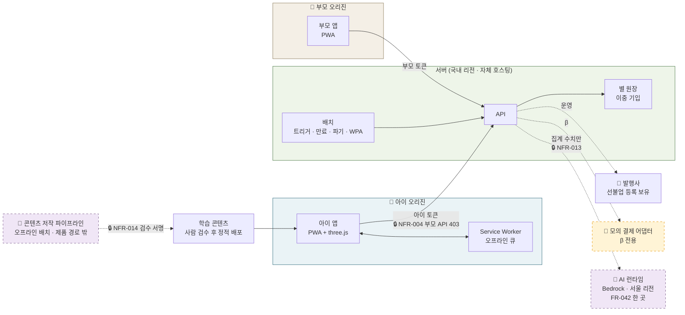
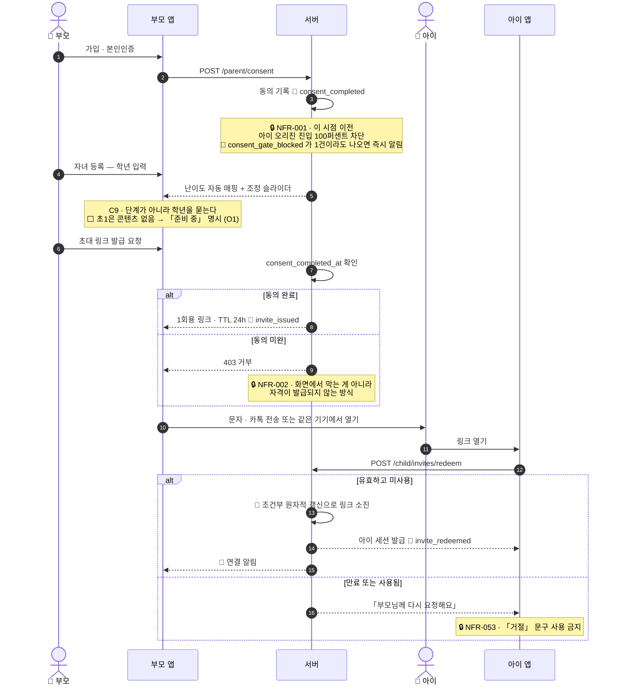
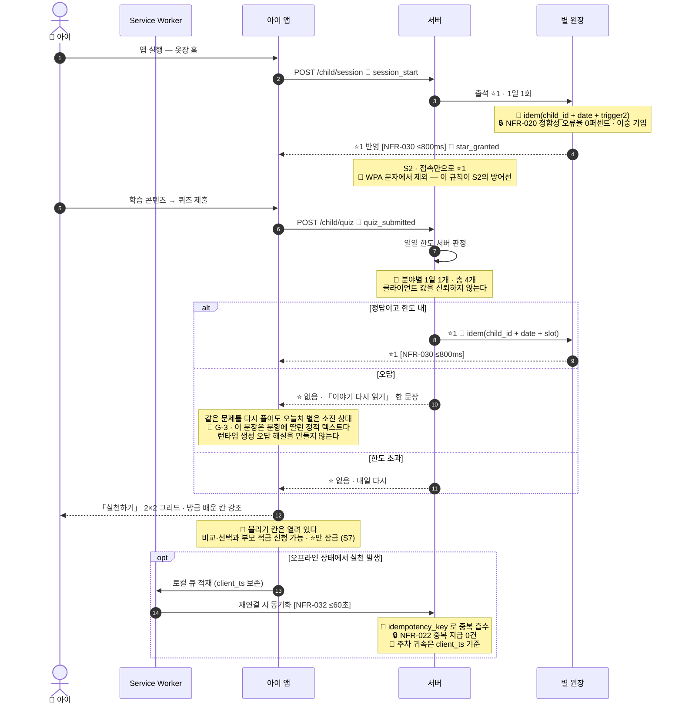
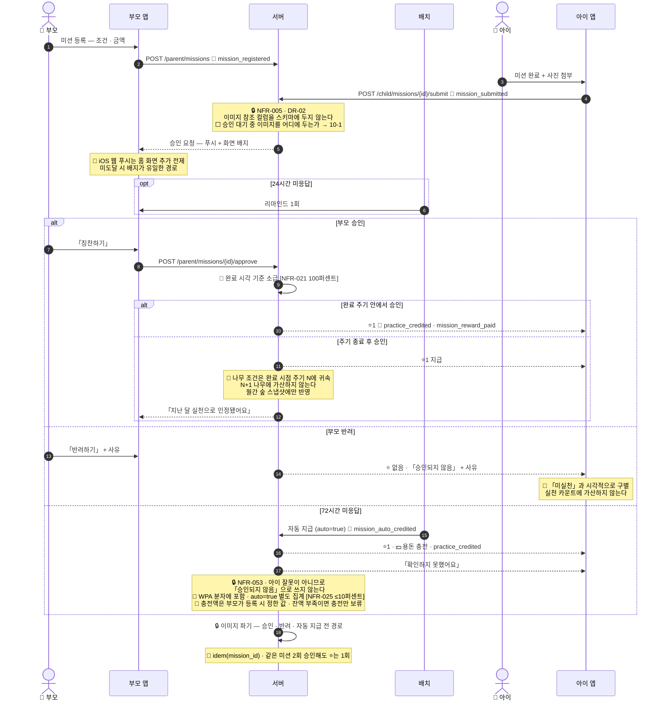
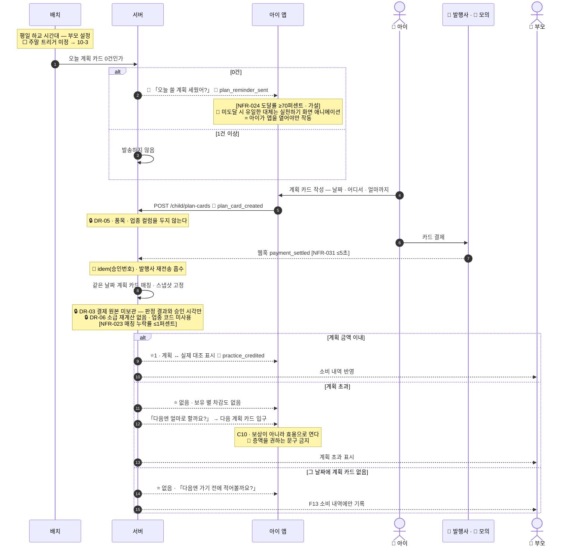
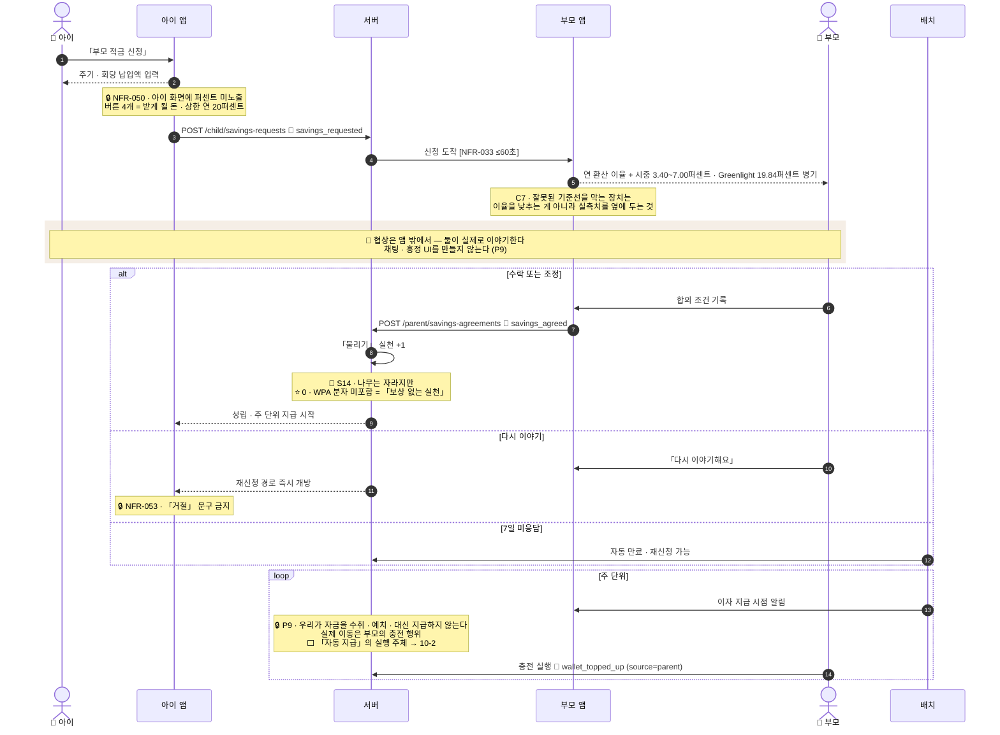
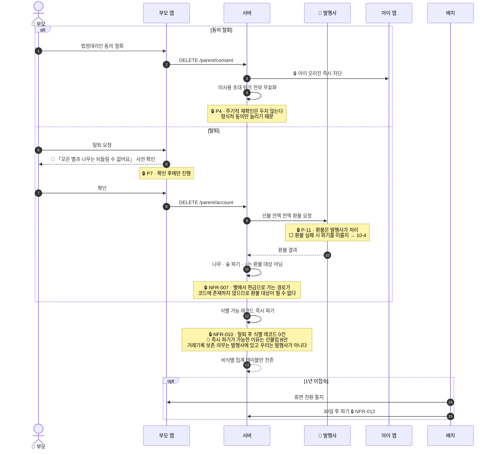
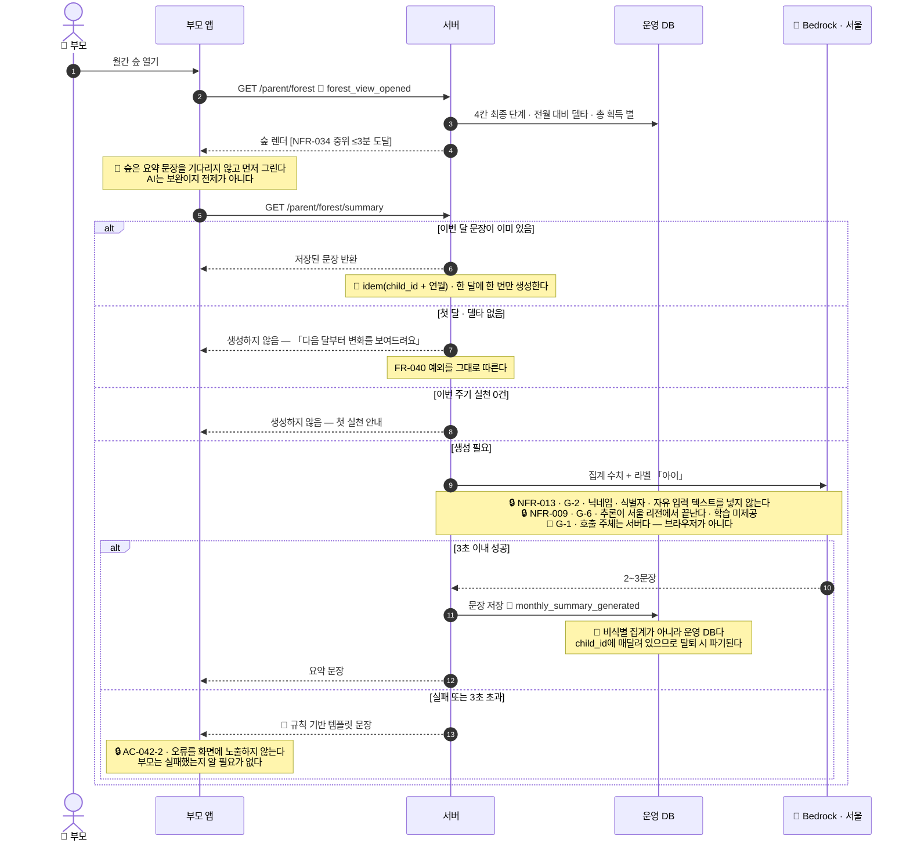

# 증강 시퀀스 다이어그램 (구현 명세)

새싹프렌즈 1팀 · 2차 역기획 프로젝트 · **수빈** 작성 / **병윤** 구현 · 2026-09-01

> **무엇인가** [`SRS_핀프렌즈_v1_0.md`](../00-%EC%82%AC%EC%96%91/SRS_%ED%95%80%ED%94%84%EB%A0%8C%EC%A6%88_v1_0.md) §3의 시퀀스 4개에 **성능 상한 · 예외 분기 · 규제 게이트 · 이벤트 적재 · 멱등 키**를 얹고, 빠져 있던 **3개(미션 승인 루프 · 탈퇴/동의 철회 · 월간 숲 요약 문장)** 를 더한 것입니다.
> **설계 원칙** 🔑 **화살표 하나가 API 하나에 대응**하도록 썼습니다. §9의 API 후보 목록이 그 결과물이고, 다음 산출물(API 명세)의 입력이 됩니다.
> **기준 문서** SRS v1.0 **§2.5 기술 스택** · [`PRD v0.3`](../00-%EC%82%AC%EC%96%91/PRD_%ED%95%80%ED%94%84%EB%A0%8C%EC%A6%88_v0_3.md) · [`PWA`](../../wiki/10-%EC%A0%9C%ED%92%88/PWA.md)

---

## 0. 읽는 법

| 표기 | 뜻 | 출처 |
|---|---|---|
| `[NFR-030 ≤800ms]` | **성능 잠정 상한** — 넘으면 AC가 성립하지 않는 값 | SRS §5.3 |
| 🔒 `NFR-001` | **규제 게이트** — 설계 변수가 아니라 상수. 위반 시 자동 차단 | SRS §5.1 |
| 📝 `event_name` | **이벤트 적재 지점** | SRS §6.3 |
| 🔑 `idem(...)` | **멱등 키** — 이 키로 중복 실행을 흡수 | NFR-022 |
| 🔴 | 구현 시 가장 틀리기 쉬운 지점 | — |
| 🤖 `G-3` | **AI 가드레일** — 위반 시 해당 기능을 끈다 | SRS §2.5.2 |
| ⬜ | **미확정 — 병윤 결정 필요** (§10) | — |

> ⚠️ **성능 값은 전부 `[가설]`입니다.** 확정 SLO가 아니라 **AC에서 역산한 상한**이며, 프로토타입 실측 후 교체합니다.

---

## 1. 컴포넌트 · 신뢰 경계

> 🤖 **AI가 이 그림에 두 번 나오는데 둘의 지위가 다릅니다.** `LLM`은 **제품 런타임 안**이라 규제 대상이고,
> `저작 파이프라인`은 **요청 경로 밖**이라 아동 데이터를 만지지 않습니다 (SRS §2.5.1).
> 🔴 **아이 앱에서 AI로 가는 화살표가 없는 것이 설계입니다** — 있으면 `G-1`·`G-3` 동시 위반입니다.

| 경계 | 어떻게 보증하나 |
|---|---|
| 🔒 **NFR-003** 아이 번들에 부모 엔드포인트 0건 | **빌드 파이프라인 정적 스캔 — 실패 시 배포 차단** |
| 🔒 **NFR-004** 아이 토큰 → 부모 API 403 | 서버 스코프 강제 + 통합 테스트 |
| 🔒 **NFR-008** 제3자 오리진 요청 0건 | **CSP로 강제** · 외부 CDN 미사용 · **폰트·라이브러리 자체 호스팅** |
| 🤖 **G-1** 브라우저 → LLM 직접 호출 0건 | **CSP + 번들 스캔** — 클라이언트에 모델 엔드포인트·키가 존재하지 않는다 |
| 🤖 **G-2 · NFR-013** LLM 페이로드 내 아동 식별 데이터 0건 | **스키마 화이트리스트 자동 테스트** + 요청 로그 표본 감사(주 1회) |
| 🤖 **G-3 · NFR-014** 아이가 보는 생성 텍스트 0건 | 저작물은 **오프라인 생성 → 사람 검수 → 정적 배포.** 미검수 배포 시 파이프라인 차단 |
| 🧪 **발행사 ↔ 모의 어댑터** | O8 — β는 제휴 없이 모의. **같은 인터페이스로 갈아끼울 수 있게 경계를 끊어둘 것** |

---

## 2. S-1 · 온보딩 · 페어링

### 구현 주의

| 🔴 | 내용 |
|---|---|
| **링크 = 자격증명** | 소진 처리를 **조건부 UPDATE**(`WHERE used_at IS NULL`)로 해야 동시 요청 두 건에서 중복 연결이 안 생깁니다 |
| **재발급 시 기존 링크 무효화** | 미사용 링크가 여러 장 살아 있으면 안 됩니다. **P4(동의 철회)와 같은 무효화 경로**를 씁니다 → S-6 |
| **세션 스코프** | 아이 세션은 `child` 스코프만. 부모 API 호출 시 **403** (NFR-004) |

**API 후보** — `POST /parent/consent` · `POST /parent/children` · `GET /parent/children/{id}/difficulty` · `POST /parent/invites` · `POST /child/invites/redeem`

---

## 3. S-2 · 학습 → 퀴즈 → 실천 진입

### 구현 주의

| 🔴 | 내용 |
|---|---|
| **별 원장은 이중 기입** | NFR-020이 **0%(협상 불가)** 입니다. 단일 컬럼 증감이 아니라 **원장 행 추가 + 일일 정산 배치 대사** |
| **일일 한도는 서버 판정** | 아이 기기가 오프라인 큐를 갖고 있으므로, 클라가 계산하면 큐를 쌓아 한도를 우회할 수 있습니다 |
| **오프라인 주차 귀속** | `server_ts`로 귀속하면 재연결이 늦은 아이의 실천이 **다음 주로 밀려 WPA가 왜곡**됩니다. `client_ts` 기준 |
| **출석 ⭐ 상관 감시** | `출석률 × WPA 상관 r ≤ 0.3`. 초과하면 S2 결정 자체가 철회 대상입니다 |
| 🤖 **지문·문항·해설은 전부 정적 자산** | 저작에 LLM을 쓰지만(SRS §2.5.1 평면 A) **오프라인 배치 + 사람 검수 후 정적 배포**입니다. 🔴 **이 시퀀스의 어떤 화살표도 런타임에 LLM을 부르지 않습니다**(`G-3` · NFR-014). 아이 화면에 실시간 생성 텍스트가 한 문장이라도 들어오면 위반입니다 |

**API 후보** — `POST /child/session` · `POST /child/quiz` · `GET /child/practice-board` · `POST /child/sync`

---

## 4. 🆕 S-3 · 미션 승인 루프

> **SRS §3에 없던 시퀀스입니다.** 미션은 **별 트리거 8종 중 유일한 수동 판정**이고, 예외 경로가 가장 많습니다 (반려 · 72h 자동 지급 · 주기 이월 소급 · 중복 승인 · 이미지 파기).

### 구현 주의

| 🔴 | 내용 |
|---|---|
| **파기는 세 경로 모두에** | 승인·반려만 파기하고 **자동 지급 경로를 빼먹기 쉽습니다.** 72h 자동 지급 시에도 반드시 파기 |
| **주기 이월이 가장 헷갈립니다** | ⭐는 **지급**하되 나무 조건은 **완료 시점 주기**에 귀속. 두 개가 다른 곳으로 갑니다 |
| **자동 지급의 지표 처리** | *"미실천 아님 + 분모 유지"* 이고 **분자에도 포함**합니다. `auto=true`로 별도 집계해 부모 무응답 비중을 따로 봅니다 |
| **일괄 승인** | 5건 이상 누적 시 일괄 승인 경로. 일괄이어도 **각 건의 완료 시각 기준으로 개별 소급** |

**API 후보** — `POST /parent/missions` · `POST /child/missions/{id}/submit` · `POST /parent/missions/{id}/approve` · `POST /parent/missions/{id}/reject` · `POST /parent/missions/bulk-approve` · *(배치)* `auto-credit-missions`

---

## 5. S-4 · 계획 카드 → 결제 → 대조

### 구현 주의

| 🔴 | 내용 |
|---|---|
| **스냅샷 고정** | 판정 시각의 계획 금액을 `SETTLEMENT_MATCH`에 **복사**해 둡니다. 아이가 나중에 계획 금액을 고쳐도 **판정이 바뀌지 않아야** 합니다 |
| **한 계획에 여러 결제** | **합계로 판정**하고 건별 내역을 나열 |
| **모의 어댑터** | β는 발행사 자리에 스텁이 들어갑니다. **인터페이스를 동일하게** 두어야 제휴 후 갈아끼울 수 있습니다 |
| **못 재는 것** | 🔴 **업종 매칭 정확도는 β에서 판정 불가**(O8). 다만 ⭐ 판정이 금액만이라 **치명적이지 않습니다** — 영향은 F13 표시 품질뿐 |

**API 후보** — `POST /child/plan-cards` · `PATCH /child/plan-cards/{id}` · `POST /webhook/settlement` · `GET /child/reconciliation/{id}` · `GET /parent/spending` · *(배치)* `plan-reminder`

---

## 6. S-5 · 부모 적금 신청 · 협상

### 구현 주의

| 🔴 | 내용 |
|---|---|
| **자금 흐름에 우리 계정이 없어야** | P9의 성립 조건입니다. 아키텍처 리뷰에서 **자금 경로에 우리 계정 부재**를 검증 항목으로 둡니다 |
| **재신청 반복 관측** | S13이 *"아이가 거절당하는 경험"* 을 대가로 받아들였습니다. **재신청률을 계측**해 C4 인터뷰와 대조합니다 |
| **⭐ 0인데 나무는 자람** | 별 원장에 기록이 없는 실천입니다. `PRACTICE_EVENT`와 `STAR_LEDGER`가 **1:1이 아님**을 스키마가 허용해야 합니다 |

**API 후보** — `POST /child/savings-requests` · `GET /parent/savings-requests` · `POST /parent/savings-agreements` · `POST /parent/savings-requests/{id}/retalk` · *(배치)* `savings-expire` · `savings-payout-remind`

---

## 7. 🆕 S-6 · 탈퇴 · 동의 철회

> **SRS §3에 없던 시퀀스입니다.** 규제 시나리오라 빠지면 안 됩니다 — P3 · P4 · P7 · NFR-010 · NFR-011 · NFR-012가 전부 여기서 만납니다.

### 구현 주의

| 🔴 | 내용 |
|---|---|
| **결제 내역 사본을 들면 이 시퀀스가 무너집니다** | 🔒 **NFR-011 · DR-03.** 사본을 드는 순간 법정 보존 대상이 되어 **즉시 파기가 불가능**해집니다. 성능·오프라인을 이유로 캐시하고 싶어질 때 이 결정이 먼저 무너집니다 — **캐시는 세션 범위 · 서버 미저장만** 허용 |
| **파기는 배치가 아니라 동기 트랜잭션** | 그리고 **잔존 스캔**으로 사후 검증합니다 |
| **철회와 탈퇴는 다릅니다** | 철회 = 아이 접근 차단 + 링크 무효화. 탈퇴 = 거기에 **환불 + 전체 파기**가 더해집니다 |

**API 후보** — `DELETE /parent/consent` · `DELETE /parent/account` · `POST /issuer/refund` · *(배치)* `dormancy-notify` · `dormancy-purge` · `residual-scan`

---

## 8. 🆕 S-7 · 월간 숲 · 요약 문장 (AI)

> **SRS §3에 없던 시퀀스이고, AI가 제품 런타임에 들어오는 유일한 지점입니다**(`FR-042` · `PRD ADR-017`).
> 🔴 **부모 화면 전용입니다.** 아이는 이 문장을 보지 않고, 아이 오리진에는 이 엔드포인트가 존재하지도 않습니다.

### 구현 주의

| 🔴 | 내용 |
|---|---|
| **숲과 요약을 한 응답에 묶지 않습니다** | 묶으면 **LLM 지연이 숲 전체를 3초 붙잡습니다.** 끊어 두면 요약이 죽어도 숲은 정상 동작하고, `FR-042`를 **끄는 것이 엔드포인트 하나를 내리는 일**이 됩니다 |
| 🤖 **페이로드는 화이트리스트로 만듭니다** | 집계 객체를 그대로 직렬화하면 **나중에 추가된 필드가 조용히 딸려 갑니다.** 보낼 필드를 열거하고, **그 목록을 자동 테스트가 검사**합니다 (NFR-013) |
| 🔴 **계획 카드의 「어디서」를 절대 넣지 않습니다** | 자유 입력이라 **아이의 생활 반경**이 드러납니다. P-19(위치 미수집)를 페이로드로 우회하는 경로가 됩니다 |
| **템플릿 문장은 기능이지 폴백이 아닙니다** | 🔴 **Bedrock 서울 리전에 모델이 없으면 이게 유일한 경로**가 됩니다(SRS `OI-09`). 템플릿만으로도 화면이 성립해야 합니다 |
| **저장한 문장은 파기 대상입니다** | `child_id + 연월`로 저장하므로 **운영 DB에 두고 탈퇴 시 함께 파기**합니다(S-6 · NFR-010). 🔴 **비식별 집계에 넣으면 탈퇴 후에도 남습니다** |
| **아이 오리진에서 0건** | 🔒 AC-042-4 — 아이 번들 정적 스캔이 `/parent/forest/summary`를 발견하면 **배포를 막습니다**(NFR-003) |

**API 후보** — `GET /parent/forest` · `GET /parent/forest/summary`

---

## 9. API 후보 목록 — 다음 산출물의 입력

> 위 7개 시퀀스의 화살표에서 그대로 뽑았습니다. **시나리오에 없는 엔드포인트는 만들지 않습니다.**

| 오리진 | 메서드 · 경로 | 시퀀스 |
|:-:|---|:-:|
| 부모 | `POST /parent/consent` · `DELETE /parent/consent` | S-1 · S-6 |
| 부모 | `POST /parent/children` · `GET /parent/children/{id}/difficulty` | S-1 |
| 부모 | `POST /parent/invites` | S-1 |
| 부모 | `POST /parent/missions` · `POST .../approve` · `POST .../reject` · `POST .../bulk-approve` | S-3 |
| 부모 | `GET /parent/savings-requests` · `POST /parent/savings-agreements` · `POST .../retalk` | S-5 |
| 부모 | `GET /parent/spending` · `GET /parent/tree` | S-4 |
| 부모 | `GET /parent/forest` · 🤖 `GET /parent/forest/summary` | S-7 |
| 부모 | `DELETE /parent/account` | S-6 |
| 아이 | `POST /child/invites/redeem` | S-1 |
| 아이 | `POST /child/session` · `POST /child/quiz` · `GET /child/practice-board` · `POST /child/sync` | S-2 |
| 아이 | `POST /child/missions/{id}/submit` | S-3 |
| 아이 | `POST /child/plan-cards` · `PATCH /child/plan-cards/{id}` · `GET /child/reconciliation/{id}` | S-4 |
| 아이 | `POST /child/savings-requests` | S-5 |
| 외부 | `POST /webhook/settlement` · `POST /issuer/refund` | S-4 · S-6 |
| 배치 | `plan-reminder` · `auto-credit-missions` · `savings-expire` · `savings-payout-remind` · `wpa-daily` · `ledger-reconcile` · `dormancy-notify` · `dormancy-purge` · `residual-scan` | 전체 |

**합계** — 부모 16 · 아이 9 · 외부 2 · 배치 9 = **36**

> 🤖 **AI 저작 파이프라인은 이 목록에 없습니다.** 제품 요청 경로 밖의 **오프라인 배치**라 엔드포인트도 배치 잡도 만들지 않습니다(SRS §2.5.1 평면 A). 런타임에서 AI를 부르는 화살표는 **S-7 하나뿐**입니다.

---

## 10. ⬜ 미확정 — 병윤 결정 필요

> 🔴 **아래 4건은 시퀀스를 그리다가 드러난 것들입니다.** 지금 SRS·PRD·위키 어디에도 답이 없습니다.

### 10-1. 🔴 승인 대기 중 미션 사진을 어디에 두는가

**충돌** — NFR-005는 *"스토리지 내 미션 이미지 객체 **0건**"* 인데, 부모가 **최대 72시간 뒤에** 볼 수 있습니다. 그동안 이미지가 어딘가에 있어야 합니다.

| 안 | 방식 | 대가 |
|:-:|---|---|
| **A** | 아이 기기에 보관 · 부모 조회 시 업로드 | 🔴 **아이 앱이 켜져 있어야** 부모가 볼 수 있음 |
| **B** | 짧은 TTL 암호화 임시 저장 | 🔴 **NFR-005의 「0건」과 정면 충돌** — 기준을 「영구 객체 0건」으로 다시 써야 함 |
| **C** | 사진은 **실시간 확인용만** · 승인은 사진 없이 | 🔴 부모가 자리에 없으면 사진을 못 봄 |

> **가장 큰 미결입니다.** S4·P1의 *"서버 무저장"* 이 **동기 승인을 암묵 전제**하고 있었는데, O3이 **72h 비동기 만료**를 넣으면서 전제가 깨졌습니다.

### 10-2. 🔴 「주 단위 자동 지급」의 실행 주체

P9는 *"우리가 자금을 수취·예치·대신 지급하지 않는다"* 인데, C6은 *"**자동 지급** 기본값으로 부모 조작 4배 부담 상쇄"* 입니다. **우리가 자동으로 옮기면 자금 수취에 가까워집니다.**

| 안 | 방식 |
|:-:|---|
| **A** | 주간 리마인드 → **부모가 1탭 충전** *(자동이 아님 — C6의 상쇄 효과가 약해짐)* |
| **B** | 발행사 자동이체 기능에 위임 *(우리 경로를 안 거침 — 제휴 조건에 추가 필요)* |

### 10-3. ⬜ 주말 계획 카드 트리거

SRS §3.3은 *"주말 09:00"* 로 잡혀 있는데, **초1~3 주말 기상 시각은 08:00~09:00으로 편차가 크고 실측이 없습니다.** 그리고 소비는 **토 > 일 > 금**으로 주말에 몰립니다.
→ [`초1~3 소비 패턴 실측 자료`](../../%EC%A1%B0%EC%82%AC/%EC%88%98%EB%B9%88/%EC%B4%881~3%20%EC%86%8C%EB%B9%84%20%ED%8C%A8%ED%84%B4%20%EC%8B%A4%EC%B8%A1%20%EC%9E%90%EB%A3%8C%20(%EC%9A%94%EC%9D%BC%C2%B7%EC%9E%A5%EC%86%8C%C2%B7%ED%92%88%EB%AA%A9).md) §4-1 · **C4 인터뷰 선행**

### 10-4. ⬜ 환불 실패 시 파기 순서

발행사 환불이 실패하면 **탈퇴 파기를 미룰지** 결정해야 합니다. 미루면 NFR-010(식별 레코드 0건)이 지연되고, 강행하면 **환불받을 계좌 정보가 사라집니다.**

---

## 11. 📎 다음 단계

| # | 산출물 | 이 문서가 주는 입력 |
|:-:|---|---|
| **2** | 시스템 아키텍처 다이어그램 | §1 신뢰 경계 · 오리진 분리 · 모의 어댑터 위치 · **AI 두 평면의 배치** |
| **3** | **API 명세** | §9 후보 36개 — 시나리오에서 뽑았으므로 **고아 엔드포인트가 없습니다** |
| **4** | 배포 · 환경 설계 | β(모의) ↔ 운영 분리 · PWA 즉시 배포 · 롤백 |

> 🔴 **§10의 4건을 먼저 닫는 것을 권합니다.** 특히 **10-1은 스키마와 스토리지 설계를 바꾸므로**, API 명세보다 앞서야 합니다.
