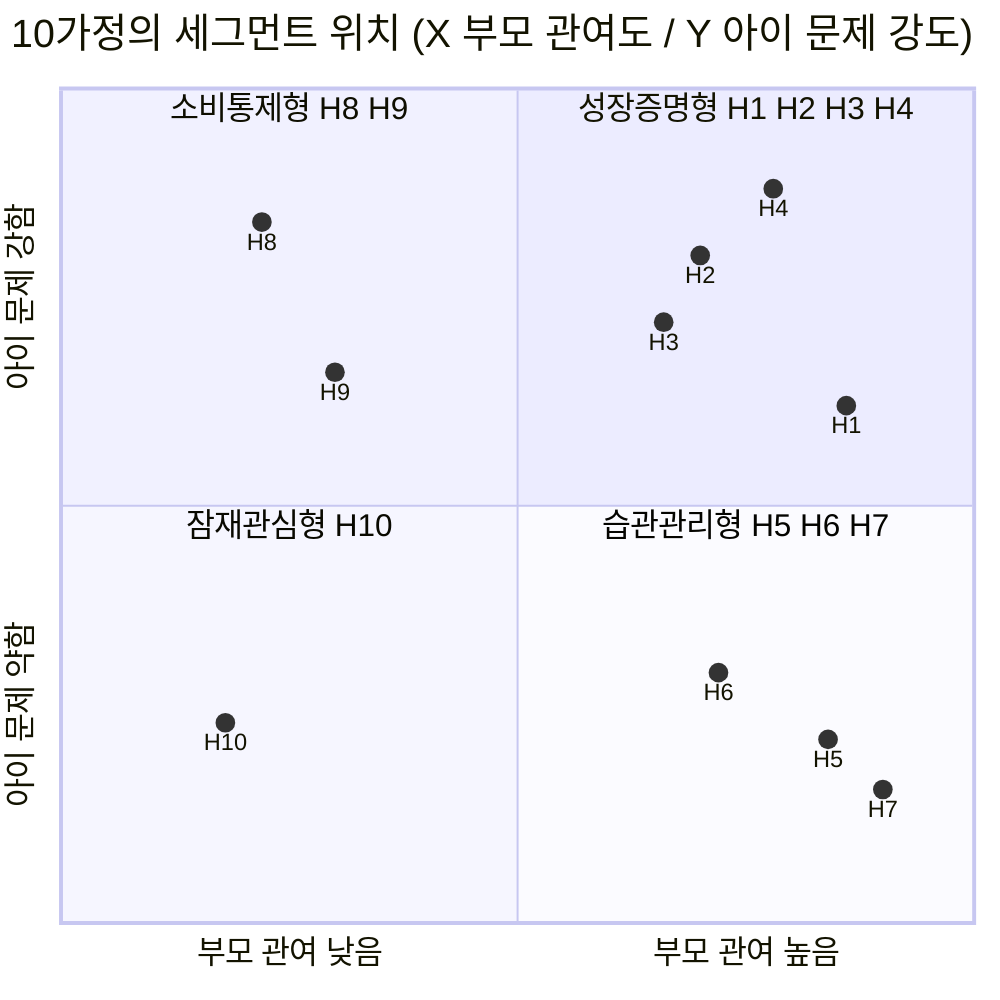

# 핀프렌즈 페르소나 — 10가정 (아이 1 + 부모 1)

> **작성** 2026-08-19 · 유림
> **기준 문서** [`기획산출물/00-사양/기능정의_v14.md`](../00-%EC%82%AC%EC%96%91/%EA%B8%B0%EB%8A%A5%EC%A0%95%EC%9D%98_v14.md) — 기능 번호·나무·별 규칙은 기준 문서를 따릅니다 (작성 시점 v11 → 현재 v12)
> **세그먼트 출처** [`조사/유림/시장분석/TAM-SAM-SOM_시장세분화.md`](4-TAM-SAM-SOM_%EC%8B%9C%EC%9E%A5%EC%84%B8%EB%B6%84%ED%99%94.md) §5
> **여정·페인 출처** [`조사/혜원/고객분석/고객여정지도.md`](../../%EC%A1%B0%EC%82%AC/%ED%98%9C%EC%9B%90/%EA%B3%A0%EA%B0%9D%EB%B6%84%EC%84%9D/%EA%B3%A0%EA%B0%9D%EC%97%AC%EC%A0%95%EC%A7%80%EB%8F%84.md) · [`조사/혜원/고객분석/페인포인트_근거보강.md`](../../%EC%A1%B0%EC%82%AC/%ED%98%9C%EC%9B%90/%EA%B3%A0%EA%B0%9D%EB%B6%84%EC%84%9D/%ED%8E%98%EC%9D%B8%ED%8F%AC%EC%9D%B8%ED%8A%B8_%EA%B7%BC%EA%B1%B0%EB%B3%B4%EA%B0%95.md) · [`조사/하영/01_리뷰분석/pain_point_evidence_final.md`](../../%EC%A1%B0%EC%82%AC/%ED%95%98%EC%98%81/01_%EB%A6%AC%EB%B7%B0%EB%B6%84%EC%84%9D/pain_point_evidence_final.md)

---

## 🔴 이 문서의 지위 — 전부 [가정]입니다

**부모 인터뷰 0건 · 아이 인터뷰 0건입니다.** (혜원 고객여정지도 §0-2)

이 10가정은 **관측된 사용자가 아니라, 검증 인터뷰를 설계하기 위한 가설 도구**입니다.
발표·PRD에서 *"이런 부모가 있습니다"* 로 인용하면 안 되고, *"이런 부모를 만나 확인하려 합니다"* 로 써야 합니다.

| | |
|---|---|
| ✅ 이 문서로 할 수 있는 것 | 인터뷰 모집 기준 세우기 · 기능 커버리지 공백 찾기 · v11 설계 결정의 리스크 드러내기 |
| ❌ 하면 안 되는 것 | 시장 근거로 인용 · "사용자가 이렇게 말했다" 서술 · 수치화(전환율·이탈률) |

---

# 0. 읽는 법 — 고정값과 창작값의 구분

페르소나는 창작물이지만, **바꾸면 안 되는 뼈대**가 있습니다.

| 항목 | 값 | 출처 | 성격 |
|---|---|---|---|
| 아이 연령 | 만 7~9세 (초1~3) | 용돈 시작 평균 **만 8.4세** [A] | 🔒 **고정** |
| 월 용돈 | 2~4만원대 | 월평균 **30,740원** [A] | 🔒 **고정** |
| 지급 주기 | 대부분 주 단위 | 매주 **61.0%** / 매월 32.8% [A] | 🔒 **고정** |
| 세그먼트 배분 | ① 4가정 · ② 3가정 · ③ 2가정 · ④ 1가정 | 35.8% / 33.0% / 16.3% / 14.9% | 🔒 **고정** |
| 구독료 저항 기준선 | 월 5,900원 | SOM 산출 전제 | 🔒 **고정** |
| 이름 · 직업 · 에피소드 · 대사 | — | 없음 | ✍️ **창작** |

> 즉 **연령·용돈·주기·세그먼트 비율은 통계에 묶여 있고, 나머지는 인터뷰에서 깨져야 할 가설**입니다.

## 세그먼트 4:3:2:1 배분 근거

```
① 금융성장 증명형  35.8%  →  4가정 (H1~H4)   ★ 1차 타깃
② 금융습관 관리형  33.0%  →  3가정 (H5~H7)
③ 용돈 소비통제형  16.3%  →  2가정 (H8~H9)
④ 금융교육 잠재관심형 14.9% → 1가정 (H10)
                            합계 10가정
```

비율을 그대로 반올림한 것이라 **인터뷰 모집 시에도 이 비율을 유지**하면 표본이 시장 구조를 닮습니다.

---

# 1. 10가정 한눈에

| 코드 | 세그 | 부모 | 아이 | 한 줄 상태 | 첫 진입 기능 (v11 §2) | 월 5,900원 |
|---|---|---|---|---|---|---|
| **H1** | ① | 정미경 (39) | 정하율 (초2·8세) | 퍼핀 8개월차, 재구독 직전 흔들림 | **⑥⑦ 나무·월간 리포트** | 🟢 높음 |
| **H2** | ① | 배성우 (42) | 배주안 (초3·9세) | 현금 봉투 용돈, 문구점 충동구매 반복 | **②📍 위치 알림** | 🟢 높음 |
| **H3** | ① | 문세라 (37) | 문지호 (초3·9세) | 세뱃돈 40만원이 어디 갔는지 모름 | **③💳 결제 내역** | 🟡 중간 |
| **H4** | ① | 강동혁 (45) | 강루아 (초3·9세) | 게임 아이템 결제로 용돈 증발 | **③💳 결제 내역** | 🟢 높음 |
| **H5** | ② | 오하늘 (38) | 오시윤 (초2·8세) | 얌전하지만 모을 이유가 없음 | **④🎯 위시리스트** | 🟢 높음 |
| **H6** | ② | 류지원 (36) | 류하민 (초1·7세) | 앱을 켜지 않음, 3일 만에 흥미 소진 | **⑩🐾 아바타·옷장** | 🟡 중간 |
| **H7** | ② | 신가영 (41) | 신윤슬 (초3·9세) | 아이부자(무료) 사용 중 | **⑤💰 예적금 비교** | 🔴 낮음 |
| **H8** | ③ | 임태경 (43) | 임서준 (초2·8세) | 편의점 소비 통제가 목적, 교육 의도 없음 | **②📍 위치 알림** | 🟡 중간 |
| **H9** | ③ | 백현주 (40) | 백노아 (초2·8세) | 시간이 없어 미션 승인을 못 함 | **①🧹 미션 루프** | 🔴 낮음 |
| **H10** | ④ | 곽민석 (35) | 곽서아 (초1·7세) | 용돈 막 시작, 무엇부터인지 모름 | **⑩🐾 아바타·옷장** | 🔴 낮음 |



---

# 2. 세그먼트 ① 금융성장 증명형 — 4가정 ★ 1차 타깃

> **공통 JTBD** "아이에게 돈을 주는 것을 금융교육으로 연결하고, 아이가 실제로 돈을 잘 관리하게 성장했음을 **확인**하고 싶다"
> **공통 진입점** 🌳 나무 + 📊 월간 리포트 — 이 세그먼트에만 구독 과금 근거가 성립합니다.

## H1 · 정미경 가정 — 「숫자는 쌓이는데 확신은 안 쌓인다」의 원형

| | 부모 — **정미경 (39)** | 아이 — **정하율 (초2 · 만 8세)** |
|---|---|---|
| **상황** | 중학교 교사, 맞벌이. 퍼핀 8개월 사용 | 주 8,000원 (월 3.2만) · 퍼핀 캐릭터 레벨 12 |
| **행동** | 주 1회 퍼핀 학습현황 열람 → 숫자 3개 확인하고 닫음 | 하루 5문제, 틀리면 재시도해서 절반 보상 수령 |
| **속마음** | *"116일, 75문제, 6,650원 — 그래서 우리 애가 뭘 배운 거지?"* | *"틀려도 절반은 받으니까 일단 눌러보자"* |
| **막힌 지점** | 확인은 되는데 **성장인지 알 수 없음** (E-11) | 보상은 받는데 **성장한 느낌이 없음** (🟡 추론) |

- **핀프렌즈 첫 반응** — 나무 4칸을 보고 *"어디가 멈췄는지 보인다"*. 성장 조건에 「행동 실천 1회」가 있다는 설명에 신뢰가 붙음
- **나무 초기 예상** — 💰🌿 새싹 · 🛒🌱 씨앗 · 🐷🌱 씨앗 · 🌱⬜ 잠김 (퀴즈는 익숙, 실천은 처음)
- **별 차감 반응** — 하율이 첫 주에 별을 다 써서 옷을 삼 → 미경은 *"이번 달 얼마나 모았는지"* 를 못 봄 → **월간 리포트의 「총 획득 별」이 이 불만을 받아내야 함** (v11 §4)
- **이탈 트리거** — 나무가 2주 넘게 안 자라면 *"우리 애는 못하는 애인가"* 로 해석될 위험
- 🔎 **v11에 던지는 질문** — 검증과제 ①(부모가 금융 집중을 원하는가). 미경은 퍼핀의 한국사·시사 퀴즈를 *"그것도 공부니까 좋다"* 고 답할 수 있는 유형 → **(b) 시나리오의 대표 케이스**

## H2 · 배성우 가정 — 현금 봉투에서 디지털로 넘어오는 가정

| | 부모 — **배성우 (42)** | 아이 — **배주안 (초3 · 만 9세)** |
|---|---|---|
| **상황** | 자영업(카페). 매주 일요일 현금 5,000원 지급 | 주 5,000원 (월 2만) · 학교 앞 문구점이 동선 |
| **행동** | 아이 지갑을 가끔 열어보는 것이 유일한 확인 수단 | 하교길 문구점에서 뽑기·팽이에 3,000원 소진 |
| **속마음** | *"현금으로 주니까 어디 쓰는지 아예 모르겠어요"* | *"돈 있으면 사고, 없으면 못 사는 거지"* |
| **막힌 지점** | 소비 데이터가 **아예 존재하지 않음** | 쓰기 전에 멈출 계기가 없음 |

- **핀프렌즈 첫 반응** — 📍 위치 알림 설명에서 *"문구점 앞에서 알림이 온다고요?"* 로 즉시 이해. 이 가정의 진입 후크는 나무가 아니라 **위치 알림**
- **나무 초기 예상** — 💰🌱 · 🛒⬜ · 🐷🌱 · 🌱⬜ (학습 이력 자체가 없음)
- **별 차감 반응** — 주안은 별을 모아 옷을 사는 구조를 게임과 동일하게 이해 → 마찰 없음
- **이탈 트리거** — 카드 발급·본인인증 온보딩(부모 화면 5단계)에서 **현금 습관 대비 번거로움**이 이김
- 🔎 **v11에 던지는 질문** — 검증과제 ②(아이가 위치 알림에서 실제로 참는가)의 **최적 관측 대상**. 문구점이라는 고정 동선 + 소액 반복 구매 = 프로토타입 테스트 조건이 가장 깨끗함

## H3 · 문세라 가정 — 「앱 외부 현금」 범위 제외와 정면충돌하는 가정

| | 부모 — **문세라 (37)** | 아이 — **문지호 (초3 · 만 9세)** |
|---|---|---|
| **상황** | 프리랜서 디자이너. 월 3만원 계좌 이체 | 월 3만원 + **설 세뱃돈 40만원** |
| **행동** | 세뱃돈은 "엄마가 보관" 후 흐지부지 | 세뱃돈의 존재는 알지만 액수를 모름 |
| **속마음** | *"큰돈이 들어올 때가 진짜 교육 기회인데 그건 앱 밖이네요"* | *"내 돈인데 왜 내가 못 써?"* |
| **막힌 지점** | 가장 교육 효과가 큰 금액이 **서비스 범위 밖** (v11 §8) | 소유감과 통제권의 불일치 |

- **핀프렌즈 첫 반응** — ③ 결제 내역 확인에 만족. 다만 *"세뱃돈도 여기 넣을 수 있나요?"* 를 온보딩에서 반드시 물음
- **나무 초기 예상** — 💰🌿 · 🛒🌱 · 🐷🌿 · 🌱🌱 (저축 경험은 있음)
- **별 차감 반응** — 지호는 별을 아껴 비싼 옷을 노림 → **「별도 월 초기화되나」(v11 §11) 질문이 이 가정에서 터짐**. 초기화되면 저축 전략 자체가 무너짐
- **이탈 트리거** — 세뱃돈을 못 넣는다는 답을 들으면 *"그럼 반쪽이네"*
- 🔎 **v11에 던지는 질문** — §8 범위 제외(앱 외부 현금)가 **합리적 절단인지, 회피인지**. 세뱃돈 충전 경로를 부모가 수동 충전으로 해결할 수 있는지 확인 필요

## H4 · 강동혁 가정 — 디지털 소비가 이미 문제인 가정

| | 부모 — **강동혁 (45)** | 아이 — **강루아 (초3 · 만 9세)** |
|---|---|---|
| **상황** | 회사원, 주 양육자. 월 4만원 지급 | 월 4만원 · 모바일 게임 2종 데일리 접속 |
| **행동** | 앱스토어 결제 알림을 보고서야 지출을 인지 | 게임 아이템에 월 용돈의 60% 소진 |
| **속마음** | *"용돈을 준 게 아니라 게임 회사에 준 것 같아요"* | *"한정 스킨은 지금 아니면 못 사"* |
| **막힌 지점** | 소비가 **오프라인이 아니라 앱 안**이라 위치 알림이 안 통함 | FOMO형 즉시 구매 |

- **핀프렌즈 첫 반응** — 📍 위치 알림은 무용지물, **💳 결제 내역 회고**가 유일한 개입 지점
- **나무 초기 예상** — 💰🌱 · 🛒⬜ · 🐷⬜ · 🌱⬜
- **별 차감 반응** — 루아는 **앱 내 옷장을 게임 스킨의 하위호환으로 인식**할 위험 → 3D 아바타 퀄리티가 곧 동기 크기 (v11 §11 「동물 몇 종·옷 몇 벌」)
- **이탈 트리거** — 옷장 아이템이 빈약하면 아이가 먼저 이탈
- 🔎 **v11에 던지는 질문** — **위치 알림이 못 잡는 소비 유형이 존재한다.** 온라인 결제에 대한 사전 개입(§2 ②의 공백)이 설계에 없음

---

# 3. 세그먼트 ② 금융습관 관리형 — 3가정

> **공통 JTBD** *"용돈은 주고 있는데, 스스로 관리하는 습관이 생겼으면 좋겠어요"*
> **공통 진입점** 🎯 위시리스트 · 💰 예적금 비교 — 문제가 아직 없으므로 **동기 설계가 전부**입니다.

## H5 · 오하늘 가정 — 저축 격차 53%p의 표본

| | 부모 — **오하늘 (38)** | 아이 — **오시윤 (초2 · 만 8세)** |
|---|---|---|
| **상황** | 약사. 주 7,000원 지급 + 돼지저금통 병행 | 주 7,000원 (월 2.8만) · 절반은 그냥 남음 |
| **행동** | 저축을 시키고 싶지만 **시킬 이유를 못 만듦** | 안 쓰는 게 아니라 **살 게 떠오르지 않아서** 남음 |
| **속마음** | *"모으라고만 하지 왜 모으는지는 설명을 못 하겠어요"* | *"모으면 뭐가 좋은데?"* |
| **막힌 지점** | 부모 희망 1위 저축 **65.8%** ↔ 아이 실행 꼴찌 **12.8%** | 목표 부재 |

- **핀프렌즈 첫 반응** — 🎯 위시리스트 + 🌱 불리기(이자)에 즉시 반응. **"이자가 이유를 만든다"** 는 발표 포인트 ③이 그대로 꽂히는 가정
- **나무 초기 예상** — 💰🌿 · 🛒🌿 · 🐷🌳 · 🌱🌱
- **별 차감 반응** — 시윤은 옷을 사지 않고 별을 쌓아둠 → **별 차감형이 이 아이에게는 동기가 되지 않음.** 목표-경사 효과가 별이 아니라 위시리스트에서 발생
- **이탈 트리거** — 부모 이자 설정 부담(월 1,700원)이 아니라 **이자 계산 주기 체감 부족** (v11 §11)
- 🔎 **v11에 던지는 질문** — 검증과제 ③(부모가 이자를 실제로 줄 것인가)의 **긍정 케이스 후보**. 하늘은 줄 의향이 있고, 문제는 금액이 아니라 **주 단위/월 단위 체감**

## H6 · 류지원 가정 — 아이가 앱을 안 여는 가정

| | 부모 — **류지원 (36)** | 아이 — **류하민 (초1 · 만 7세)** |
|---|---|---|
| **상황** | 맞벌이 사무직. 월 2만원 | 월 2만원 · 스마트폰은 부모 폰 공유 |
| **행동** | 교육앱 3개를 깔았고 전부 2주 내 방치 | 첫날 재밌고 3일차에 안 열음 |
| **속마음** | *"결국 제가 시켜야 하면 앱이 아니라 숙제죠"* | *"이거 또 해야 돼?"* |
| **막힌 지점** | 학습앱 이탈 경험 반복 | 7세 집중 시간 · **정보 과부하** |

- **핀프렌즈 첫 반응** — 🐾 아바타·옷장이 유일한 후크. **v11 §3의 "7세에게 나무 4개는 정보 과부하" 판단이 맞는지 검증되는 가정**
- **나무 초기 예상** — 전부 🌱 씨앗 (부모 화면에서만 보임)
- **별 차감 반응** — 하민은 **"별 2배" 규칙을 이해하지 못할 가능성** → v11 §3의 유일한 실천 유도 장치가 7세에게 작동하는지 미확인
- **이탈 트리거** — 3일차. 아이 이탈이 곧 구독 해지
- 🔎 **v11에 던지는 질문** — **아이 화면에는 실천 유도 장치가 「별 2배」 하나뿐이다.** 이게 7세에게 안 통하면 §3 설계 전체가 부모 화면만 남음

## H7 · 신가영 가정 — 무료 대체재를 이미 쓰는 가정

| | 부모 — **신가영 (41)** | 아이 — **신윤슬 (초3 · 만 9세)** |
|---|---|---|
| **상황** | 은행원. **하나 아이부자 사용 중(무료)** | 월 4만원 · 아이부자 카드 보유 |
| **행동** | 이미 디지털 용돈에 익숙, 추가 지출에는 보수적 | 카드 결제에 능숙 |
| **속마음** | *"공짜로도 이미 되는데 월 5,900원을 왜 내죠?"* | *"카드 하나 더 있어도 되고"* |
| **막힌 지점** | **무료 78만 계정의 벽** — 게임화가 아니라 성장 증거만이 차별점 | 없음(전환 동기 없음) |

- **핀프렌즈 첫 반응** — 나무·리포트를 보고 *"이건 아이부자에 없네"* 까지는 인정. 지불로는 바로 안 이어짐
- **나무 초기 예상** — 💰🌳 · 🛒🌿 · 🐷🌿 · 🌱🌿 (경험 많음)
- **별 차감 반응** — 무관심. 이 가정의 의사결정자는 전적으로 부모
- **이탈 트리거** — 무료 체험 종료 시점
- 🔎 **v11에 던지는 질문** — **월간 리포트 누적이 5,900원의 값을 하는가.** SOM 440가구 가정이 이 가정에서 가장 세게 시험됨. 금융사 제휴·결제 수수료 없이 구독 단독으로는 설득 불가

---

# 4. 세그먼트 ③ 용돈 소비통제형 — 2가정

> **공통 특징** 문제는 명확하나 **교육 의도가 없음**. 메시지를 '통제'에서 '교육'으로 옮기는 단계가 필요합니다.

## H8 · 임태경 가정 — 「감시」로 읽힐 위험을 드러내는 가정

| | 부모 — **임태경 (43)** | 아이 — **임서준 (초2 · 만 8세)** |
|---|---|---|
| **상황** | 물류업. 월 3만원, 경제교육은 해본 적 없음 | 월 3만원 · 학원가 편의점에서 매일 소진 |
| **행동** | *"그만 좀 사"* 라고 말하는 것이 유일한 개입 | 친구들과 편의점 간식 나눠 사기 |
| **속마음** | *"교육까진 바라지도 않고 그만 좀 썼으면 좋겠어요"* | *"나만 안 사면 이상하잖아"* |
| **막힌 지점** | 목표가 **통제**라 리포트·나무에 관심이 낮음 | 또래 압력 |

- **핀프렌즈 첫 반응** — 📍 위치 알림을 **"어디 있는지 알려주는 기능"** 으로 오해 → 이 오해가 곧 위치정보 동의 이슈
- **나무 초기 예상** — 💰⬜ · 🛒🌱 · 🐷⬜ · 🌱⬜
- **별 차감 반응** — 서준은 별을 즉시 소비. 차감형이 **저축 학습에는 역효과**일 수 있음
- **이탈 트리거** — 소비가 줄지 않으면 1개월 내 해지. 나무는 설득 근거가 안 됨
- 🔎 **v11에 던지는 질문** — 검증과제 ④(위치정보법 P-19). **만 14세 미만 위치정보 동의를 부모가 "감시 기능"으로 받아들이면, 옵트인은 쉬워지고 아이 신뢰는 깨진다.** 아이용 고지 문구(§6, 개인정보보호법 §22조의2)가 이 가정에서 반드시 필요

## H9 · 백현주 가정 — 미션 루프의 부모 운영 코스트를 드러내는 가정

| | 부모 — **백현주 (40)** | 아이 — **백노아 (초2 · 만 8세)** |
|---|---|---|
| **상황** | 요양보호사, 교대 근무. 주 6,000원 | 주 6,000원 (월 2.4만) |
| **행동** | 앱 알림을 며칠 뒤 몰아서 확인 | 미션을 하고 승인을 기다림 |
| **속마음** | *"승인 눌러줄 시간에 그냥 돈을 주는 게 빨라요"* | *"엄마가 확인 안 해줘서 별을 못 받았어"* |
| **막힌 지점** | **미션 생성·금액 설정·승인** 3단계가 전부 부모 수동 | 보상 지연 → 실천 동기 붕괴 |

- **핀프렌즈 첫 반응** — ① 미션 루프의 취지에는 공감, 운영 부담에서 막힘
- **나무 초기 예상** — 💰🌱 · 🛒🌱 · 🐷🌱 · 🌱⬜
- **별 차감 반응** — 노아는 실천 별(+1)을 **승인 지연 때문에 못 받음** → v11의 「실천하면 별 2배」가 **부모의 응답 속도에 종속**됨
- **이탈 트리거** — 미승인 미션 3건 누적
- 🔎 **v11에 던지는 질문** — 🔴 **「행동 실천 횟수」가 나무 성장 조건인데, 실천 판정 권한이 부모에게 있다.** 부모가 바쁘면 나무가 멈추고, 부모는 그걸 **아이가 안 한 것으로 읽는다.** v11 §3의 신뢰 논리(나무=실천 증거)가 깨지는 유일한 경로 — **자동 판정 가능한 실천(결제 참기·목표 달성)의 비중 설계가 필요**

---

# 5. 세그먼트 ④ 금융교육 잠재관심형 — 1가정

## H10 · 곽민석 가정 — 용돈을 이제 막 시작한 가정

| | 부모 — **곽민석 (35)** | 아이 — **곽서아 (초1 · 만 7세)** |
|---|---|---|
| **상황** | IT 회사원. 입학 후 용돈 시작 3개월차 | 주 3,000원 (월 1.2만) |
| **행동** | 검색은 해봤지만 무엇부터인지 모름 | 돈의 크기 개념이 아직 흐릿함 |
| **속마음** | *"언젠간 시켜야 하는데 7살한테 뭘 어떻게 해요"* | *"천 원이 큰 거야 작은 거야?"* |
| **막힌 지점** | 문제 인식 → 교육 → 구매의 **2단계 추가** = CAC 최고 | 수 개념 자체가 학습 대상 |

- **핀프렌즈 첫 반응** — 🐾 3D 동물 아바타. **금융이 아니라 캐릭터로 진입**
- **나무 초기 예상** — 전부 ⬜ 잠김
- **별 차감 반응** — 서아에게 별 1개와 2개의 차이는 인지되지만, **"실천"의 정의는 이해 못 함**
- **이탈 트리거** — 온보딩 5단계(본인인증·계좌·카드신청·자녀초대·카드등록) 완주 실패
- 🔎 **v11에 던지는 질문** — §6 아이 눈높이 용어(벌기/잘 쓰기/모으기/불리기)가 **만 7세에게 실제로 통하는지**. 「불리기 = 저절로 늘어나요」는 복리 개념인데, 7세 인지 발달 단계에서 검증 필요

---

# 6. 기능 커버리지 매트릭스 — 어떤 기능이 비어 있나

`◎` 핵심 진입 후크 · `○` 사용함 · `△` 반응 약함 · `✕` 작동 안 함

| v11 기능 | H1 | H2 | H3 | H4 | H5 | H6 | H7 | H8 | H9 | H10 |
|---|---|---|---|---|---|---|---|---|---|---|
| ① 🧹 미션 루프 | ○ | ○ | ○ | ○ | ○ | △ | ○ | △ | **◎✕** | △ |
| ② 📍 위치 알림 | ○ | **◎** | ○ | **✕** | △ | △ | ○ | **◎⚠️** | ○ | △ |
| ③ 💳 결제 내역 | ○ | ○ | **◎** | **◎** | ○ | △ | ○ | ○ | ○ | △ |
| ④ 🎯 위시리스트 | ○ | ○ | ○ | ○ | **◎** | ○ | ○ | △ | ○ | △ |
| ⑤ 💰 예적금 비교 | ○ | △ | ○ | △ | ◎ | ✕ | **◎** | ✕ | △ | ✕ |
| ⑥ 🌳 일일 리포트(나무) | **◎** | ○ | ○ | ○ | ○ | ○ | ○ | △ | ○ | △ |
| ⑦ 📊 월간 리포트 | **◎** | ○ | ○ | ○ | ○ | ○ | **◎** | △ | △ | ✕ |
| ⑧ 📊 소비 내역 | ○ | ○ | ○ | ○ | ○ | ○ | ○ | ◎ | ○ | △ |
| ⑨ ⭐ 별 | ○ | ○ | **⚠️** | ○ | **△** | **⚠️** | △ | △ | **⚠️** | ○ |
| ⑩ 🐾 아바타·옷장 | ○ | ○ | ○ | **⚠️** | △ | **◎** | △ | ○ | ○ | **◎** |

## 이 표가 드러낸 것 3가지

| # | 관찰 | 영향 | 개선 방향 |
|---|---|---|---|
| **1** 🔴 | **⑤ 예적금 비교에 ✕가 3개** (H6·H8·H10) — 관여도 낮거나 저연령인 가정에서 전혀 작동 안 함 | 4칸 중 「🌱 불리기」가 전체 세그먼트의 30%에게 죽은 칸 | 불리기 진입 조건을 별도 설계하거나, 저학년 버전에서 잠금 상태를 명시적 목표로 전환 |
| **2** 🔴 | **② 위치 알림이 H4(온라인 소비)에 ✕, H8에 오해(⚠️)** | 우리 차별점 「사전 개입」이 온라인 소비를 못 잡고, 오프라인에서는 감시로 읽힘 | 온라인 결제 사전 개입 설계 추가 검토 · 아이용 고지 문구 필수 |
| **3** 🟡 | **⑨ 별에 ⚠️가 3개** (H3 저축 전략 붕괴 · H6 규칙 미이해 · H9 승인 지연) | v11의 유일한 아이 측 실천 유도 장치가 세 방향에서 흔들림 | §11 「별 월 초기화 여부」를 **유지**로 결정 + 자동 판정 실천 비중 확대 |

---

# 7. v11 검증과제 ↔ 인터뷰 모집 기준

v11 §10의 검증과제를 **어느 가정을 만나야 확인되는지**로 옮긴 표입니다. (부모 3~5명 인터뷰 계획에 그대로 사용)

| v11 검증과제 | 확인 대상 가정 | 모집 스크리너 질문 |
|---|---|---|
| **① 🔴 부모가 금융 집중을 원하는가** | **H1** · H5 · H7 | "자녀 학습앱에서 금융 외 과목(한국사·시사)이 섞여 있으면 어떠신가요?" |
| **② 아이가 위치 알림에서 참는가** | **H2** · H8 | "자녀가 하교길에 정기적으로 들르는 가게가 있나요?" |
| **③ 부모가 이자를 실제로 줄 것인가** | **H5** · H1 | "자녀 저축액에 월 1,700원 정도의 이자를 직접 주실 의향이 있나요?" |
| **④ 위치정보법 동의 요건** | H8 (수용성 확인용) | "자녀 위치 기반 알림에 동의하실 때 가장 걱정되는 점은?" |
| **⑤ 예적금 가입 연결의 중개업 여부** | — (법령 확인 과제, 인터뷰 대상 아님) | — |
| **⑥ 선불업 제휴 조건** | — (제휴사 문의 과제) | — |
| **🆕 미션 승인 부담** | **H9** | "자녀가 집안일을 했을 때 확인해주기까지 보통 얼마나 걸리시나요?" |
| **🆕 무료 대체재 대비 지불의향** | **H7** | "아이부자·퍼핀을 쓰신다면, 어떤 기능이 있어야 월 5,900원을 내시겠어요?" |

> **모집 비율 권고** — 5명 인터뷰 시 ① 2명 / ② 2명 / ③ 1명. 세그먼트 비율(4:3:2:1)을 유지해야 표본이 시장 구조를 닮습니다.

---

# 8. 이 페르소나가 v11에 남기는 설계 질문 3개

우선순위는 **심각도 × 영향범위** 순입니다.

| # | 질문 | 근거 가정 | 왜 급한가 |
|---|---|---|---|
| **1** 🔴 | **실천 판정을 부모가 하는 구조를 유지할 것인가** | H9 | 나무 성장 조건의 「행동 실천」이 부모 응답 속도에 종속되면, **"나무 = 실천 증거"라는 v11의 핵심 논리가 성립하지 않음** (전역 영향) |
| **2** 🔴 | **별은 월 초기화되는가** (v11 §11 미결) | H3 · H5 | 초기화하면 저축형 아이(H3·H5)의 전략이 매달 무너짐. **유지 쪽이 옷 저축과 정합** |
| **3** 🟡 | **온라인 결제에 대한 사전 개입이 없다** | H4 | 위치 알림은 오프라인 전용. 게임 아이템 소비형 가정에 사전 개입 수단이 없음 |

---

# 9. 한계

| 한계 | 내용 |
|---|---|
| **인터뷰 0건** | 부모·아이 모두 미실시. 대사·감정·행동은 전부 창작이며 **관측이 아님** |
| **아이 트랙 신뢰도** | 혜원 §0-2와 동일 — 아이 본인 진술 근거 0건, 리뷰 3건(0.3%)은 전부 부모 관찰 |
| **세그먼트 독립성 가정** | 관여도 × 문제강도 교차 데이터 부재 → 4:3:2:1 배분은 **모델값이지 관측값이 아님** |
| **생존자 편향** | 이탈 트리거는 리뷰 921건에 남지 않은 이탈자를 추정한 것 |
| **n=10** | 10가정은 시장 대표성이 아니라 **커버리지 점검 도구**. 통계로 인용 금지 |

---

## 다음 단계

1. 이 문서 §7 스크리너로 **부모 5명 인터뷰 모집** → 검증과제 ①③ 우선 확인
2. §8의 설계 질문 3개를 스크럼 안건으로 올려 v12에 반영
3. 인터뷰 후 H1~H10 중 **깨진 가정을 취소선으로 남기고** 실측 페르소나로 교체 (창작값만 수정, 🔒 고정값은 유지)
