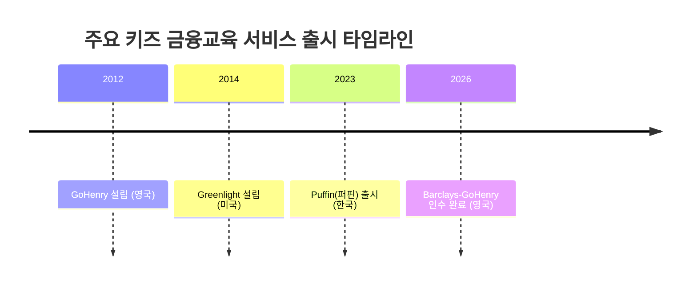

# Executive Summary  
초등학생 대상 키즈 금융교육·행동 보상 시장은 **금융교육 콘텐츠, 용돈관리 앱·플랫폼, 행동보상(포인트·선물) 서비스, 부모·학교 연계 프로그램** 등을 포괄한다. 2025년 글로벌 디지털용돈관리 앱 시장 규모는 약 **48억 달러**에 달했으며(2025년 기준), 전 세계 금융교육 시장(모든 연령 포함)은 2025년 **128억 달러**(약 16조원) 규모로 예상된다. 한국에서는 어린이 핀테크 시장 규모가 **약 5조원**(5000억원) 수준이라는 분석이 있다. 대표 서비스 사례로 미국 Greenlight(2021년 300만 가구 가입), 영국 GoHenry(2026년 50만 어린이)와 NatWest RoosterMoney(2026년 50만 사용자) 등이 있으며, 국내에서는 퍼핀(2025년 가입자 34만명, 매출 14억원), 아이쿠카(2024년 가입 46만명, MAU 33만, 매출 6억원) 등이 대표적이다. 고객군은 **학부모, 초등학생, 학교/교육기관, 금융사** 등으로 구분되며, 인식→관심→평가→구매/구독→활용→재구매 단계마다 **신뢰·안정성 요구, 비용 부담, 자녀 관심도, 개인정보보호 규제** 등의 페인포인트가 존재한다. 주요 플레이어로 Greenlight, GoHenry, Puffin(퍼핀) 등 글로벌·국내 서비스와 금융기관이 있으며, 사업 모델은 구독료·트랜잭션 수수료·광고 수익 등을 활용한다. 규제 측면에서는 COPPA(미국 아동온라인개인정보보호법), 한국의 선불전자지급수단 라이선스 등 개인정보·금융규제가 사업에 영향을 준다. 기회 요인으로는 **비대면·디지털화 추세, 의무화된 금융교육, 부모의 재무관심 증가** 등이 꼽히며, 위협으로는 **낮은 지불의사, 콘텐츠 경쟁 심화, 데이터 규제 강화** 등이 있다. TAM 산정을 위해 “초등학생 수 × 서비스 도입률 × 연간 지출” 방식이 사용될 수 있으며, 예컨대 글로벌(9억명 초등학생 가정) * 도입률 5% * 연간 20달러 지출 = **9억 달러**(보수적 시나리오) 등으로 시나리오별 산출이 가능하다.  

## 시장 정의 및 범위  
키즈 금융교육·행동보상 시장은 **초등학생 등 미성년자를 대상으로 한 금융학습과 경제활동 보상 서비스를 포함**한다. 구체적으로는 *체험형 금융교육 콘텐츠(동영상·게임·교구 등)*, *용돈·저축·투자 교육 앱과 선불카드 플랫폼*, *가정 내·학교 기반 행동보상 시스템(미션 달성 시 용돈 또는 포인트 제공)*, *부모·학교 연계 서비스(자녀 관리 기능, 교육기관 제휴 프로그램 등)* 등을 포함한다. 예를 들어, **Greenlight, GoHenry, Puffin(퍼핀)** 등 용돈 관리 앱은 부모가 아이에게 주기적으로 용돈을 송금하고 소비·저축 학습을 지원하며, **RoosterMoney** 같은 서비스는 미션 수행으로 포인트를 주기도 한다. 범위에 애매한 부분은 “제한 없음”으로 간주하고, 부모 대상 서포트 앱, 학교 금융교육 프로그램 등도 포함시킨다. 

## 글로벌·국내 시장 규모 (TAM)  
- **글로벌 TAM**: 시장조사기관에 따르면, 2025년 디지털용돈관리 앱 시장은 약 **48억 달러**(약 6조원)로 추정되며, 2026년부터 2034년까지 연평균 12.8% 성장하여 2034년 142억 달러(약 18조원) 규모로 성장할 전망이다. 또한 광범위한 금융문해교육 시장(프로그램·솔루션·서비스 포함)은 2025년 약 **128억 달러** 규모로, 2034년까지 9.3% 성장해 286억 달러에 이를 것으로 예측된다. 북미가 2025년 기준 전체 매출의 38.2%(약 4.89억 달러)로 최대 점유율을 차지했으며, 유럽(29.6%), 아시아·태평양(20.8%) 순이다. (아래 원형 차트 참조)  

    ```mermaid
    pie
        title 2025년 지역별 디지털용돈앱 매출 비중
        "미주(38.2%)": 38.2
        "유럽(29.6%)": 29.6
        "아태(20.8%)": 20.8
        "기타(11.4%)": 11.4
    ```  

- **국내 TAM**: 국내 초등학생 수는 2023년 기준 약 **260만명**으로 추정되며, 저출산에 따라 감소 추세다. 업계에서는 한국의 어린이 전용 핀테크 시장 규모를 **약 5조원(5000억원)** 가량으로 추정한다. 구체적 근거는 불명확하나, 한편 금융감독원 등 공적 통계에는 아직 별도 분류가 없어 직접적 통계는 없다. 다만 국내 **금융교육 예산**은 2025년에 13.79억원으로 전년 대비 감소했다는 보도가 있어, 공적 지원 규모는 크지 않은 편이다. 

## 지불의사 사례 (구독·인앱·단품)  

| 기업/서비스          | 국가   | 연도 | 사용자/가입자 수         | 매출/구독료 등 주요 지표                   | 비고               |
|--------------------|-------|------|-----------------------|-----------------------------------------|------------------|
| **Greenlight** (가족금융 앱)    | 미국    | 2021 | **3,000,000 가구** (전 세계) | 월 $4.99 (기본), $9.98 (투자 포함) 구독 | 6~18세 대상, 부모 결제  |
| **GoHenry** (용돈관리 앱)      | 영국    | 2026 | **500,000 명** (영국 어린이)   | 월 £2.99 구독                        | 6~18세 대상, 학습 콘텐츠 제공 |
| **RoosterMoney** (NatWest) | 영국    | 2026 | **500,000 명** (영국 어린이) | 연 £19.99 (월 £1.99 구독)  | 6~17세 대상, 은행제휴 상품   |
| **Acorns Early** (자산관리)  | 미국    | 2023 | **1,400,000 명** (가족 고객)   | 무료 (부모 투자 수익 일부 수수료)         | 0~18세 대상, 증권사 연계     |
| **퍼핀 (Firfin)**     | 한국    | 2025 | **340,000 명** (가입자)         | 2025 매출 **14억 원** (2024년比 2배) | 기본 무료, 교육 콘텐츠 기반 |
| **아이쿠카 (Iqoocca)**  | 한국    | 2025 | **460,000 명** (누적가입)       | 2024 매출 **6억 원** (주 수입: 광고)  | 무료 서비스, 2025년 월 1500원 구독 예정 |

각 사례를 보면, 구독 기반 수익(월 구독료 또는 연간 과금)이 일반적이며, 무료 모델도 동작 중이다. **구독 전환율**이나 **인앱 결제 비율**에 대한 공개된 자료는 드물지만, Greenlight·GoHenry 등 해외 기업은 상당수 사용자가 유료 플랜(구독)에 가입한다. NatWest의 RoosterMoney는 년 £19.99 요금을 받으며, 아동 1인당 평균 연간 용돈은 £506로 조사되었다. 한국 사례에서는 퍼핀과 아이쿠카가 무료 서비스로 시작했으며, 퍼핀은 출시 1년 만에 누적 충전금액 1,000억 원을 달성하며 매출도 급증했다.   

## 고객군 및 행동 단계  
고객군은 **학부모, 초등학생, 학교·교육기관, 금융사** 등으로 구분할 수 있다. 이들의 구매·사용 여정은 대체로 인식→관심→평가→구매/구독→활용→재구매(추천) 단계로 나뉜다. 각 단계별 니즈와 페인포인트는 다음과 같다:

- **인지 단계**: 학부모는 “자녀의 금융역량 강화” 필요를 인지하지만, 키즈 금융서비스의 존재 자체를 모르는 경우가 많다. 아동은 용돈관리에 대한 게임적 재미를 기대한다. **페인포인트**: 시장 신생성으로 인지도가 낮고, 부모는 거부감(“돈에 관심 갖기 아직 이르다” 등)을 가질 수 있다. 특히 저소득층 학부모는 유료 앱에 대한 부담을 크게 느껴 지불 의사가 낮다. 학교는 공교육 커리큘럼 외 교육 채널로 인식한다.

- **관심 단계**: 관심을 보인 학부모는 “신뢰성·안정성”을 우선 검토한다. 개인정보·아동보호 규제(COPPA·개인정보보호법)에 따른 안심 여부가 중요하다. 자녀는 인터페이스의 친숙함, 게임성, 즉각적 보상이 있기를 원한다. **페인포인트**: 서비스가 많아 선택 어려움, 무료 대안(현금 용돈)과 비교. 일부 부모는 “가족 금융 플랫폼”에 대한 필요성을 인지하지만 기존 은행 계좌 개설의 법적 한계(미성년자 단독 계좌 불가)로 진입장벽을 느낀다.

- **평가 단계**: 부모는 서비스의 **교육 효과, 비용 대비 가치, 보안성**을 비교한다. 아동은 또래 인기 서비스나 게임을 고려할 수 있다. 학교는 교육 당국 승인 여부, 커리큘럼 적합성 등을 본다. **페인포인트**: 유료 구독 모델의 **가격 민감도**가 높다. 해외 사례에서도 “저소득층은 유료앱 가입을 꺼린다”는 의견이 있다. 또한, 아동의 개인정보 및 금융 데이터 보호 요구사항(COPPA, GDPR-K 등)은 서비스 구현 난이도를 높인다.

- **구매/구독 단계**: 부모가 직접 결제하며, 결제 편의성(무통장·카드·휴대폰 결제)과 안전성이 관건이다. **페인포인트**: 미성년자는 결제수단이 없으므로, 부모 명의 선불카드·어카운트 등을 활용한다. 예컨대 퍼핀은 은행계좌 없이도 미성년자 전자지갑을 만들 수 있도록 *선불전자지급수단 라이선스*를 획득했다. 결제 시 부모 동의 절차 및 본인 인증이 복잡하면 이탈이 일어난다.

- **활용 단계**: 아동이 서비스를 실제 사용하며 금융습관을 형성한다. 학부모는 **실시간 알림, 학습 피드백** 등을 원한다. 학교는 학습 관리 기능을 요구할 수 있다. **페인포인트**: 콘텐츠·기능의 **지속적 신선도 부족**으로 아동의 흥미 저하가 빈번하다. 또한, 서비스 제공 기업은 낮은 **사용자 유지율(고객이탈율)**을 겪는데, 퍼핀은 출시 후 약 97%의 높은 고객 유지율을 보였으나, 이는 대개 콘텐츠 혁신에 의존한다. 개인정보 보호나 보안 이슈(허가되지 않은 결제, 개인정보 유출 우려)도 관리 과제다.

- **재구매/추천 단계**: 만족한 학부모·아동은 구독 갱신 또는 업그레이드 의사(예: 투자 기능 추가 등)를 가지게 된다. 친구나 온라인 리뷰를 통한 **입소문 효과**도 중요하다. **페인포인트**: 부모는 “비용 대비 교육효과”를 재검토하며 구독 연장 결정을 한다. 만약 수익 모델이 광고 중심이라면 학부모와 규제당국의 반감(아동대상 광고 제한)도 리스크가 된다.  

아래 차트는 고객의 구매 여정을 간략히 나타낸 것이다.  


## 시장 다이내믹 및 경쟁 구도  
세계적으로 **Greenlight(미국)**, **GoHenry(영국)**, **RoosterMoney(영국)** 등이 대표적이며, **JP모건체이스**, **바클레이즈** 등 대형 은행도 키즈 금융에 진출했다. 실제로 Greenlight는 JP모건의 지원을 받고 성장했으며, 바클레이즈는 2026년 GoHenry를 인수했다. 국내에서는 **하나은행 ‘아이부자’**, **부지런컴퍼니(부지런), 레몬트리(퍼핀)** 등 스타트업과 금융사가 경쟁 중이다. 사업 모델은 *월정액 구독*, *선불카드 수수료*, *투자·저축 상품 연계 수익*, *광고·파트너십* 등이 혼합된다.  

정책·규제 영향으로는 아동 개인금융서비스 제공 시 **아동 개인정보 보호**(COPPA, 개인정보보호법)와 **금융자본시장법**(미성년자 신용거래 제한) 준수가 필수적이다.  미국 등에서는 COPPA가 13세 미만 아동의 서비스 이용에 법적 제한을 두며, 유럽연합의 GDPR-K도 16세 미만 개인정보 처리에 부모 동의를 요구한다. 한국은 선불전자지급수단 등록(퍼핀이 획득)이나 한국형 청소년 대상 금융교육 가이드라인 등이 영향을 미친다. 한편, 정부의 금융교육 의무화 흐름(OECD·UNESCO 국제금융교육주간 참여 등)과 ESG 금융정책 강화는 수요 요인이다.  

앞으로는 **핀테크 융합 기회**가 많다. 예를 들어, *증권사·자산운용사 협업*으로 “초등용 소액투자 플랫폼”이 부상할 수 있다. 기술적으로는 **챗봇 기반 금융 멘토링, AI 개인화 교육 콘텐츠, 메타버스 금융체험** 등의 융합이 기회다. 위협 요인으로는 부모의 지불 의사 한계, 과도한 경쟁(게임·쇼핑앱과의 주의 끌기 경쟁), 규제 강화(미국 COPPA 2.0 등) 등이 있다.  

아래 타임라인 차트는 주요 글로벌·국내 키즈 금융 서비스의 출현 시기를 나타낸다.  



## 수치 기반 산정 방법론 제안  
시장 규모를 추정할 때는 **“(대상인구 수)×(시장 도입률)×(연간 1인당 소비)”** 공식이 유용하다. 예를 들어, 가정해보자. 전 세계 초등학생(약 7~12세, 9억명 가정) 중 5%가 서비스에 가입하고, 한 명당 평균 연 20달러(연간 2.4만원)를 지출한다고 하면 TAM≈`9억×0.05×20`＝9억 달러(약 1.1조원) 정도다. 이를 보수적 시나리오라 할 때, 도입률 10%, ARPU(1인당 매출) 30달러를 적용하면 TAM≈`9억×0.10×30`＝27억 달러, 낙관 시 10억 달러까지 가능하다. 국내 예로는 초등학생 260만명(2023년 기준) 중 도입률 10%, ARPU 5만원이면 TAM≈`260만×0.10×5만원`＝130억원 규모(연간)로 추정할 수 있다. 구체값은 시장 진입 전략과 고객 특성, 과거 유사 시장(예: 청소년 금융 앱, 에듀테크 시장) 데이터를 참고해 보완해야 한다. 이와 같은 계산식을 제시하여 **보수적·중간·낙관 시나리오**별 예상 매출액을 산출해볼 수 있다.    

**출처:** 국내외 시장조사 보고서와 언론 자료 등. 

