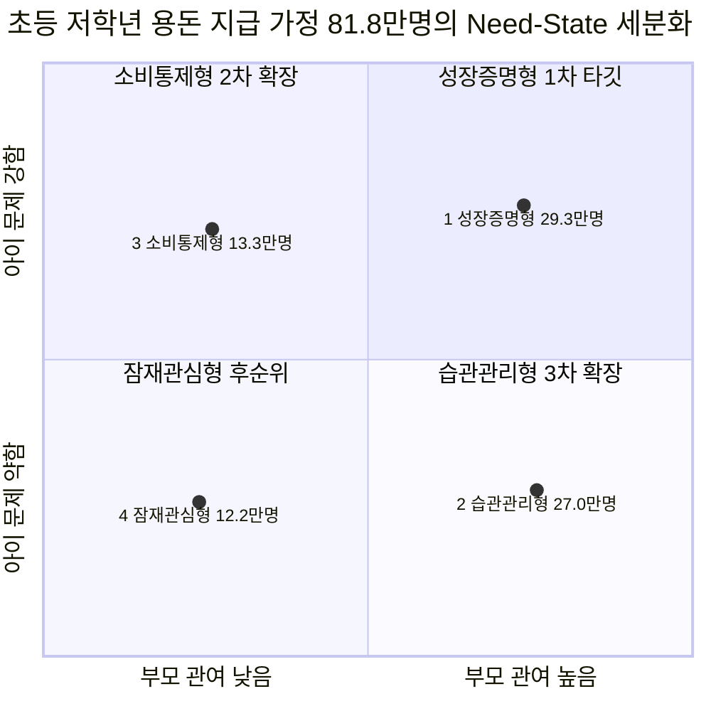
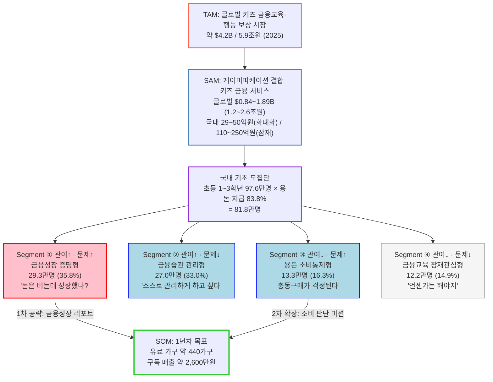

# TAM–SAM–SOM & Market Segment 분석
### 키즈 금융교육·행동 보상 시장

> **작성** 송유림 (팀장·통합) | **최종 수정** 2026-08-16
> **원자료** [심층 리서치 원문](../gpt_deep_research_키즈%20금융교육·행동%20보상%20시장.md) · [ChatGPT 대화 캡쳐 1~4](../chatgpt_캡쳐본/)

---

## 요약 3줄

1. **시장 규모** — TAM(글로벌 키즈 금융교육·행동 보상)은 약 **5.9조원**, SAM(게이미피케이션 결합)은 글로벌 **1.2~2.6조원**. 다만 국내 SAM은 톱다운 추정 110~250억원과 달리, 실제 사업자 매출로 역산한 **화폐화된 시장은 29~50억원**에 그친다.
2. **핵심 고객** — 국내 초등 1~3학년 97.6만명 중 용돈을 받는 **81.8만명**을 「부모 관여도 × 아이 금융행동 문제」로 4분할하면, 1차 타깃인 **① 성장증명형이 29.3만명(35.8%)** 으로 가장 크다.
3. **1년차 목표** — SOM은 유료 가구 약 **440가구 / 매출 약 2,600만원**. 구독 단독으로는 규모가 나오지 않으므로 **결제 수수료·금융사 제휴를 포함한 수익모델 설계가 전제**다.

---

## 목차

- [0. 이 문서를 읽는 법](#0-이-문서를-읽는-법)
- [1. 시장 정의](#1-시장-정의)
- [2. TAM — 키즈 금융교육·행동 보상 시장](#2-tam--키즈-금융교육행동-보상-시장)
- [3. SAM — 게이미피케이션 결합 시장](#3-sam--게이미피케이션-결합-시장)
- [4. 원인 분석 — 왜 이렇게 세분화하는가](#4-원인-분석--왜-이렇게-세분화하는가)
- [5. Market Segment Map](#5-market-segment-map)
- [6. SOM — 실질 공략 가능 시장](#6-som--실질-공략-가능-시장)
- [7. 전체 구조도](#7-전체-구조도)
- [8. 근거 신뢰도 등급 · 검증 로그](#8-근거-신뢰도-등급--검증-로그)
- [9. 다음 단계](#9-다음-단계)
- [부록. 출처 전체 목록](#부록-출처-전체-목록)

---

## 0. 이 문서를 읽는 법

**TAM / SAM / SOM이 뭔가요?** 시장 크기를 3단계로 좁혀가는 방법입니다.

| 단계 | 뜻 | 우리 경우 |
|---|---|---|
| **TAM** (Total Addressable Market) | 이 분야 전체 시장 | 키즈 금융교육·행동 보상 전부 |
| **SAM** (Serviceable Available Market) | 그중 우리 방식으로 가능한 시장 | 게임 요소를 쓰는 디지털 서비스만 |
| **SOM** (Serviceable Obtainable Market) | 그중 1년 안에 실제로 딸 수 있는 몫 | 특정 고객군 × 실제 결제 |

**신뢰도 표기.** 모든 숫자 뒤에 원출처 확인 결과를 붙였습니다.

| 등급 | 뜻 |
|---|---|
| **[A]** | 원출처 직접 확인, 수치 일치 |
| **[B]** | 출처 존재 확인, 2차 인용이거나 일부만 일치 |
| **[C]** | 원출처 미확인 (ChatGPT·심층리서치 기재값 그대로) |
| **[D]** | **검증 결과 오류 또는 불일치 — 본문에서 정정함** |

**환율 가정.** 이 문서의 원화 환산은 모두 **1,400원/$** 기준입니다.

**한 줄 주의.** [C] 등급 숫자는 발표자료에 **단독 근거로 쓰지 마세요.** [D] 항목은 ChatGPT가 잘못 정리한 부분이며, 정정 내용을 그대로 인용하시면 됩니다.

---

## 1. 시장 정의

세 단계를 한 문장씩으로 고정합니다. 이후 모든 숫자는 이 정의에 종속됩니다.

| 단계 | 정의 |
|---|---|
| **TAM** | 미성년자(주로 초등학생)를 대상으로 **금융 학습**과 **실제 금융 행동**을 연결하고, 그 행동을 **용돈·포인트로 보상**하는 모든 서비스 |
| **SAM** | 위 중에서 **퀴즈·미션·포인트·레벨·배지·캐릭터·챌린지 등 게임 요소를 핵심 UX로 사용하는 디지털 솔루션** |
| **SOM** | 위 중에서 **초등 저학년(1~3학년) 자녀에게 정기적으로 용돈을 주면서, 실제 소비·저축 습관 개선까지 원하는 부모** 가 1년 내 유료 결제하는 규모 |

> **정의상 경계** — 학교 대상 B2B 금융교육 솔루션, 성인 금융교육, 단순 용돈 송금 앱(교육·보상 요소 없음)은 SAM에서 제외합니다. 우리 서비스는 *부모가 결제하고 아이가 매일 쓰는 B2C 금융행동 서비스*에 가깝기 때문입니다.

---

## 2. TAM — 키즈 금융교육·행동 보상 시장

### 2-1. 결론

**글로벌 약 $4.2B (약 5.9조원, 2025년)**

### 2-2. ⚠️ 먼저 정정할 것 — ChatGPT 수치 오류

ChatGPT는 TAM 근거로 *"Dataintelo 기준 키즈 금융교육 시장 2025년 $4.2B → 2034년 $9.8B, CAGR 9.8%, 모바일 앱 비중 31.4%"* 를 제시했습니다. **검증 결과 이 조합은 확인되지 않습니다.** [D]

실제로 확인된 Dataintelo 값은 다음과 같습니다.

| 항목 | ChatGPT 기재 | **검증된 실제 값** |
|---|---|---|
| 보고서명 | "Kids Financial Education Market" | **Kids Debit Card Platform Market** |
| 2025년 | $4.2B | $4.2B ✔ 일치 |
| 2034년 | $9.8B | **$12.8B** ✘ |
| CAGR | 9.8% | **13.2%** ✘ |
| 모바일 앱 비중 31.4% | 제시됨 | **확인 불가** ✘ |

→ **동일 조사기관의 다른 보고서를 혼동한 것으로 보입니다.** 2025년 값 $4.2B만 우연히 일치합니다.

**어떻게 쓸 것인가.** 다행히 *Kids Debit Card Platform*(아이용 선불·체크카드 플랫폼 = 용돈 충전 + 소비 + 부모 관리)은 우리 TAM 정의와 **실질적으로 매우 가깝습니다.** 따라서 TAM 헤드라인은 $4.2B를 유지하되, **출처와 시장명을 정확히 바꿔서** 표기합니다.

> ✅ **발표자료 권장 문구**
> "글로벌 키즈 금융·용돈 플랫폼 시장 **$4.2B (약 5.9조원, 2025)** → **$12.8B (2034), CAGR 13.2%**
> *출처: Dataintelo, Kids Debit Card Platform Market Report 2034*"

### 2-3. 참고용 인접 시장 (심층리서치 기재, 원출처 미확인)

| 시장 정의 | 2025 | 2034 | CAGR | 등급 |
|---|---|---|---|---|
| 디지털 용돈관리 앱 | $4.8B | $14.2B | 12.8% | [C] |
| 금융문해교육 (전 연령) | $12.8B | $28.6B | 9.3% | [C] |

> ⚠️ **시장조사기관 신뢰도 주의** — Dataintelo·MarketIntelo 계열은 자동 생성형 리포트 벤더로, 학술·공공 통계와 동급으로 취급하면 안 됩니다. **TAM 슬라이드에는 반드시 "민간 시장조사기관 추정치" 라벨을 붙이세요.**

### 2-4. TAM보다 강한 근거 — 실제로 돈이 움직인 증거

시장조사기관 숫자보다 **실제 사업자 실적**이 훨씬 방어력이 높습니다.

**Greenlight (미국)** [A]
- 2024년 추정 매출 **$228.5M** (전년 대비 +16%) — Sacra 추정
- 2024년 아이들이 관리한 금액 **$20억+** — 자사 Year in Review 2024
- 요금제: Core $5.99 / Max $10.98 / Infinity $15.98 / Family Shield $24.98 (월)
- 2025년 5월 기준 **부모+자녀 합산 650만명**

> ⚠️ **정정** [D] — ChatGPT는 "600만+ **가족**"으로 표기했으나, 실제로는 **부모와 자녀를 합산한 650만명**입니다. 가족 수로 쓰면 약 2배 과대계상됩니다.

**GoHenry (영국)** [C] — *원출처 미확인, 발표 시 재확인 필요*
- 활성 어린이 약 65만명 / 연간 총 용돈 £2.8억 / 주당 평균 용돈 £9.62
- **행동 수행으로 번 돈 주 £0.86** / 총 저축액 £5,100만

**한국** [A]
- **퍼핀(레몬트리)**: 2024년 9월 기준 가입자 **26만명**, 카드 발급 14만장, **누적 충전 484억원**
- **아이쿠카**: 2024년 10월 기준 가입자 **36만명**
- **토스 유스카드**: 2021년 출시 이후 누적 발급 **320만장**, 토스 틴즈 가입자 300만명 돌파, **중·고생 85% 이용**
- **카카오뱅크 mini**: 만 7세부터 이용 가능 [C]

> 💡 **해석** — 한국은 "키즈 금융 서비스를 써본 적 없는 시장"이 아니라, **이미 인프라가 깔린 시장**입니다. 우리 과제는 *금융 서비스 도입*이 아니라 *교육·성장 레이어의 차별화*입니다.

### 2-5. 한국의 지불능력 근거

TAM 자체는 아니지만, **부모가 초등 자녀 교육에 돈을 쓰는가**에 대한 가장 강한 공식 통계입니다. [A]

| 항목 | 2024년 |
|---|---|
| 초·중·고 사교육비 총액 | **29.2조원** (전년비 +7.7%) |
| **초등학교** | **13.2조원** (학교급 중 최대) |
| 초등 사교육 참여율 | **87.7%** |
| 초등 전체학생 1인당 월평균 | **44.2만원** |

*출처: 통계청·교육부 「2024년 초중고사교육비조사」 (전국 약 3,000개 학급, 7.4만명 대상)*

---

## 3. SAM — 게이미피케이션 결합 시장

### 3-1. 결론

| 구분 | 규모 |
|---|---|
| **글로벌 SAM** | **$0.84B ~ $1.89B (약 1.2조 ~ 2.6조원)**, Base $1.26B (약 1.8조원) |
| **국내 SAM (잠재)** | 약 **110억 ~ 250억원**, Base 약 180억원 |
| **국내 SAM (현재 화폐화)** | 약 **29억 ~ 50억원** ← **본 문서에서 새로 추가한 교차검증값** |

### 3-2. 글로벌 SAM 산출

```
글로벌 키즈 금융 플랫폼 TAM   $4.2B
  × 게이미피케이션 적용 비중   20% ~ 45%
= 글로벌 SAM                  $0.84B ~ $1.89B  (약 1.2조 ~ 2.6조원)
```

**적용 비중 20~45%의 근거**

| 근거 | 값 | 등급 |
|---|---|---|
| 게이미피케이션 교육 시장에서 K-12가 차지하는 비중 (FMI) | 44.8% | [C] |
| 글로벌 게이미피케이션 교육 시장 규모 (기관별 편차) | $0.82B ~ $3.5B | [C] |
| 키즈 금융 앱은 게임화 UX를 적극 사용하나, 전부는 아님 | 정성 판단 | — |

> ⚠️ **기관별 추정 편차가 4배** — Market Glass $0.82B / MarketDataForecast $1.55B / TBRC $2.5B / FMI $2.96B / GIA $3.5B. **특정 1개 기관 숫자를 단독 인용하면 안 됩니다.** [C]

### 3-3. 국내 SAM — 톱다운 추정 (ChatGPT 방식)

```
한국 EdTech 시장 (2024)        $6,241.3M   [A] GlobalData
  × K-12 + Pre-K12 비중         54.8%      [C] ← "최대 세그먼트"는 확인, 정확한 %는 미확인
= 한국 K-12 EdTech              $3.42B
  × 금융교육 비중 Proxy          1.15%      [가정] ← 글로벌 금융교육($4.2B) ÷ 글로벌 EdTech($364.5B)
= 한국 디지털 키즈 금융교육      $39M
  × 게이미피케이션 적용          20% ~ 45%  [가정]
= 국내 SAM                      $7.8M ~ $17.6M  ≒ 110억 ~ 250억원
```

### 3-4. ⚠️ 이 톱다운 추정의 논리적 결함

이 계산에는 **자기모순**이 있습니다.

> **문제:** 글로벌 비율(1.15%)을 한국에 그대로 적용했는데, ChatGPT 스스로 *"한국은 금감원 어린이 금융스쿨·은행연합회 AR 금융교육 등 **무료 공공 교육이 상당 부분을 차지해 유료시장으로 상품화되지 않았다**"* 고 서술했습니다.
>
> **모순:** 무료 공급이 크다면 한국의 **유료** 금융교육 비중은 글로벌 평균보다 **낮아야** 합니다. 같은 1.15%를 쓰면 시장이 과대추정됩니다.

또한 4개의 비율을 연쇄 곱셈했고 그중 2개가 순수 가정이므로, **오차가 곱으로 누적**됩니다.

### 3-5. ✅ 보완 — 바텀업 교차검증 (본 문서 추가분)

실제 국내 사업자 매출로 시장을 역산했습니다.

```
퍼핀 매출 (2025)        약 14억원   [C]
아이쿠카 매출 (2024)    약  6억원   [C]
────────────────────────────────
상위 2사 합산           약 20억원

신생 니치 시장에서 상위 2사 점유율을 40~70%로 가정하면
  20억 ÷ 0.70 =  29억원  (상위 2사가 70% 점유 시)
  20억 ÷ 0.40 =  50억원  (상위 2사가 40% 점유 시)
→ 현재 화폐화된 국내 시장 ≈ 29억 ~ 50억원
```

> **왜 40~70%인가** — 플레이어가 소수인 초기 니치 시장에서는 상위 2사 합산 점유율이 통상 40~70% 구간에 형성됩니다. 만약 톱다운 값 180억원이 맞다면 상위 2사 점유율이 11%에 불과하다는 뜻인데, **플레이어가 5곳 남짓인 시장에서 성립하기 어렵습니다.**

### 3-6. 국내 SAM 최종 권장 표기

| 구분 | 값 | 의미 |
|---|---|---|
| **잠재 시장 (Potential)** | 110억 ~ 250억원 | 게임화 키즈 금융교육이 EdTech 지출을 정상 비율만큼 가져갔을 때의 상한 |
| **현재 화폐화 시장 (Monetized)** | **29억 ~ 50억원** | 지금 실제로 돈이 오가는 규모 |

> ✅ **발표자료 권장 문구**
> "국내 SAM은 **현재 화폐화 기준 약 30~50억원**, **잠재 기준 약 110~250억원**.
> 이 격차(약 4~5배)가 곧 **미개척 여지**이며, 동시에 **아직 지불의사가 검증되지 않았다는 리스크**다."

---

## 4. 원인 분석 — 왜 이렇게 세분화하는가

세그먼트 축을 「부모 관여도 × 아이 금융행동 문제」로 잡은 이유입니다. **인구통계(성별·지역·소득)보다 Need State가 구매를 훨씬 잘 설명**하기 때문이며, 그 근거는 아래 학술 데이터입니다.

### 4-1. 핵심 실패 구조

```
금전 보상 지급
  → 아이는 '배우는 것'보다 '돈 받는 것'을 목표로 함
  → 미션은 빨리 끝내지만 금융 개념을 실제 상황에 적용하지 못함
  → 부모: "앱에서 돈은 벌었는데, 금융교육이 된 건가?"
  → 아이: 자기 금융 역량이 성장했다는 증거를 체감 못 함
  → 신뢰 하락 · 이탈
```

### 4-2. 이를 뒷받침하는 검증된 연구 [A]

| # | 발견 | 수치 | 출처 |
|---|---|---|---|
| 1 | **금융교육은 '아는 것'은 올리지만 '하는 것'은 잘 못 바꾼다** | 지식 **+0.33 SD** vs 행동 **+0.07 SD** (37개 실험). RCT만 보면 지식 +0.15 SD, 행동 +0.07 SD | Kaiser & Menkhoff (2020), *Economics of Education Review* |
| 2 | **금전 보상은 내재적 동기를 깎을 수 있고, 아동에게 더 해롭다** | 참여조건 **d=−0.40** / 완료조건 **d=−0.36** / 성과조건 **d=−0.28**. 흥미도 d=−0.15~−0.17. 유형적 보상은 대학생보다 **아동에게 더 부정적** | Deci, Koestner & Ryan (1999), *Psychological Bulletin* (128개 실험) |
| 3 | **게임화만으로는 동기가 크게 오르지 않는다** | 전체 효과 **Hedges' g=0.257** (작은 효과). 자율성 g=0.638, 관계성 g=1.776인데 **역량감은 g=0.277로 최저** | *Educational Technology R&D* (2024), 35개 개입·2,500명 |
| 4 | **금융이해력은 실제 행동으로 나타난다** | 상위권 학생은 하위권 대비 저축 확률 **+72%**, 구매 전 가격비교 확률 **+50%**. 부모와 돈 이야기를 월 1회 이상 하는 학생 **68%** 가 더 높은 이해력 | OECD PISA 2022 금융이해력 (Volume IV) |

> ⚠️ **정정** [D] — ChatGPT는 부모와의 금융 대화 비율을 **64%** 로 기재했으나, OECD 원자료는 **68% (월 1회 이상)** 입니다.
>
> ⚠️ **중요한 적용 한계** [A] — **한국은 PISA 2022 금융이해력 평가에 참여하지 않았습니다.** (참여국 20개: 오스트리아·벨기에 플랑드르·캐나다 8개주·코스타리카·체코·덴마크·헝가리·이탈리아·네덜란드·노르웨이·폴란드·포르투갈·스페인·미국 + 파트너 6개국) → **"OECD가 한국 아이들에 대해 말했다"는 식으로 인용하면 안 됩니다.**

### 4-3. 반드시 함께 봐야 할 반대 증거

**"그럼 돈을 주지 말자"는 잘못된 결론입니다.**

- 초등 5학년 106명(보상군 50 / 통제군 56) 대상 교육게임 실험에서, 외적 보상이 **동기·흥미를 훼손하지 않았고 오히려 개념 이해도 향상이 더 컸습니다.** [C]
- OECD PISA 2022에서, 정기적으로 집안일을 하고 용돈을 받는 학생이 **오히려 금융이해력이 낮게 나온 국가가 10곳** 있었습니다. (OECD도 인과 해석에 주의를 요구) [C]

> **→ 결론: 보상의 존재 여부가 아니라, 보상이 무엇에 연결되어 있는가가 문제입니다.**

### 4-4. 🔑 국내 데이터에서 발견한 결정적 격차 (본 문서 추가분)

윤선생 조사(초등 학부모 586명)를 교차하면, **부모의 의도와 아이의 실제 행동 사이에 정면 충돌**이 드러납니다. [A]

| 부모가 **하려는** 교육 | 비율 | | 아이가 용돈을 **실제 쓰는** 곳 | 비율 |
|---|---|---|---|---|
| **저축 습관 만들기** | **65.8%** (1위) | ↔ | **저축** | **12.8% (최하위)** |
| 용돈 스스로 관리 | 50.1% | | 간식·군것질 | 77.0% (1위) |
| 이자 등 금융지식 | 20.3% | | 문구·학용품 | 47.5% |

> 💡 **이것이 우리 서비스의 문제 정의입니다.**
> **부모가 1순위로 원하는 교육(저축, 65.8%)이 아이의 실제 행동에서는 꼴찌(12.8%)** 입니다.
> 격차 **53.0%p** — 이 문서 전체에서 가장 강력한 문제 증거이며, ChatGPT 분석에는 없던 내용입니다.

**또 하나의 발견 — 결제 인프라는 이미 깔려 있다** [A]

| 용돈 지급 수단 | 비율 |
|---|---|
| **체크카드(충전식)** | **64.2%** |
| 현금 | 48.9% |
| 부모 명의 신용카드 | 2.6% |

> → 선불·충전식 카드는 이미 **초등 가정의 3분의 2에 침투**했습니다. 우리 서비스는 *새 결제수단을 설득할 필요가 없고*, 기존 카드 위에 **교육·성장 레이어를 얹는 문제**입니다. 진입장벽이 그만큼 낮습니다.

### 4-5. 실패 요인 우선순위

ChatGPT가 제시한 상대적 중요도입니다. **연구에서 직접 측정한 점수가 아니라, 확인된 효과크기와 반복 등장 빈도를 근거로 한 가설적 모델**입니다. [C]

| 순위 | 실패 요인 | 상대 중요도 | 근거 강도 |
|---|---|---|---|
| 1 | 금융행동으로 전이되지 않음 | 100 | 매우 강함 (Kaiser & Menkhoff) |
| 2 | 성장 증거가 없음 | 90 | 강함 |
| 3 | 부모가 교육 효과를 확인 못 함 | 85 | 간접근거 강함 |
| 4 | 보상이 학습보다 목적이 됨 | 80 | 매우 강함 (Deci et al.) |
| 5 | 역량감 부족 | 75 | 강함 (게임화 메타분석) |
| 6 | 콘텐츠 반복 | 50 | 일반론 |
| 7 | 재미 부족 | 40 | 약함 |
| 8 | UI 불편 | 25 | 보조적 |
| 9 | 캐릭터 디자인 | 15 | 보조적 |

> **핵심 시사점:** *"돈이 적어서 재미없다"* 보다 ***"돈은 받는데 내가 뭘 잘하게 됐는지 모르겠다"*** 가 훨씬 중요한 문제입니다.
> 부모에게 필요한 건 **Reward Report(활동량)** 가 아니라 **Growth Evidence(성장 증거)** 입니다.

---

## 5. Market Segment Map

### 5-1. 기초 모집단 확정

**초등 저학년(1~3학년) 학생 수 — 2026년 기준** [A]

| 학년 | 2026년 학생 수 | 근거 |
|---|---|---|
| 초1 | **298,178명** | 교육부 「2025년 초·중·고 학생 수 추계 보정 결과(2026~2031)」 |
| 초2 | **324,040명** | 2025년 초1 실측 코호트 연결 |
| 초3 | **353,713명** | 2024년 초1 실측 코호트 연결 |
| **합계** | **975,931명 (97.6만명)** | |

> ⚠️ 초2·초3은 직전 연도 초1 실측치를 코호트로 연결한 **추정치**입니다. 전입·전출·유예를 반영한 2026년 확정 학년별 통계가 아닙니다.

> 🚨 **전략적으로 중요한 사실 (본 문서 추가분)** — 이 모집단은 **매년 줄어듭니다.**
> 초1 학생 수: 2023년 401,752명 → 2024년 353,713명 → 2025년 324,040명 → **2026년 298,178명(첫 30만명 붕괴)** → 2027년 277,674명 → 2030년 232,268명 → 2031년 220,481명
> **연 5~8% 감소.** 5년 뒤 모집단은 지금의 약 74% 수준입니다. → **시장 진입 속도 자체가 경쟁력**이며, 장기 성장은 1인당 ARPU 상승 또는 연령 확장으로만 가능합니다.

**용돈 지급 가정으로 좁히기**

```
초등 1~3학년              975,931명
  × 용돈 지급률 83.8%     [A] 윤선생 조사
= 세분화 기초 모집단       817,830명 (81.8만명)
```

용돈을 주지 않는 **158,101명(16.2%)** 은 용돈 연동 서비스의 초기 대상이 아니므로 시장 외부로 둡니다.

### 5-2. 세분화 축 — 왜 Need State인가

성별·지역·맞벌이·소득 같은 인구통계보다, **부모가 왜 금융교육을 시키는가**와 **아이에게 지금 어떤 문제가 있는가**가 구매 가능성을 훨씬 잘 설명합니다.

| 축 | 변수 | 대리지표(Proxy) | 값 |
|---|---|---|---|
| **X축** | 부모의 금융교육 관여도 | 자녀에게 경제교육을 실시 중인가 | 실시 **68.8%** / 미실시 31.2% [A] |
| **Y축** | 아이의 금융행동 문제 강도 | 「계획 없는 충동구매」또는「절약 없이 모두 사용」을 걱정하는가 | **41.2% ~ 63.0%** (아래 참조) |

### 5-3. ⚠️ ChatGPT 계산의 치명적 오류 2건 — 정정

#### 오류 ① 복수응답 문항을 단순 합산 [D]

ChatGPT는 문제 강도를 `충동구매 41.2% + 모두 사용 21.8% = 63.0%` 로 계산했습니다.
**그러나 이 문항은 복수응답입니다.** 복수응답 비율은 응답자가 중복되므로 **더할 수 없습니다.**

원자료 전체 항목: 충동구매 41.2% / 모두 사용 21.8% / 친구 정산 11.6% / 더 달라고 함 6.5% / 분실 6.3% / 고가 구매 3.9% → **합계 91.3%**

따라서 두 항목의 **합집합**은 아래 범위 안에 있습니다.

| | 값 | 조건 |
|---|---|---|
| **하한** | **41.2%** | 「모두 사용」이 「충동구매」에 완전히 포함될 때 |
| **중앙값** | **52.1%** | 본 문서 Base 채택 |
| **상한** | **63.0%** | 두 항목이 전혀 겹치지 않을 때 (= ChatGPT 값) |

> → ChatGPT의 63.0%는 **측정값이 아니라 상한값**입니다. 본 문서는 **중앙값 52.1%를 Base로 채택**하고, 세그먼트 규모를 범위로 제시합니다.

#### 오류 ② 2×2 매트릭스가 상호배타적 분할이 아님 [D]

ChatGPT의 세그먼트 계산식은 다음과 같았습니다.

| 세그먼트 | ChatGPT 계산식 | 결과 |
|---|---|---|
| ① 습관관리형 | 97.6만 × 83.8% × **61.5%** | 50.3만 |
| ② 성장증명형 | 97.6만 × 83.8% × **69% × 63%** | 35.6만 |
| ④ 용돈통제형 | 97.6만 × 83.8% × **63%** | 61.5만 |

**세 가지 결함이 있습니다.**

1. **②는 ④의 부분집합입니다** (② = ④ × 69%). 서로 다른 사분면이 아니라 포함 관계이므로 매트릭스가 성립하지 않습니다.
2. **①에는 문제 강도 항이 아예 없습니다.** 61.5%(용돈을 주는 이유가 경제관념)는 *관여도* 지표이지 *문제 없음* 지표가 아닙니다.
3. **④에는 관여도 항이 없습니다.** "관여 낮음" 조건이 계산에 반영되지 않았습니다.

→ 결과적으로 네 값의 합이 모집단과 맞지 않고, ChatGPT도 *"합산하면 안 된다"* 고만 적었을 뿐 구조를 고치지 않았습니다.

**본 문서의 정정 — 실제 분할이 되도록 재계산**

```
기초 모집단 817,830명
├─ 관여 있음 68.8% → 562,667명
│   ├─ 문제 있음 52.1% → ① 성장증명형   293,149명
│   └─ 문제 없음 47.9% → ② 습관관리형   269,518명
└─ 관여 없음 31.2% → 255,163명
    ├─ 문제 있음 52.1% → ③ 소비통제형   132,940명
    └─ 문제 없음 47.9% → ④ 잠재관심형   122,223명
                              합계 = 817,830명 ✔
```

> **독립성 가정** — 관여도와 문제 강도의 교차조사 데이터가 공개된 바 없어 두 변수가 독립이라고 가정했습니다. 실제로는 상관이 있을 수 있으므로(예: 관여도 높은 부모가 문제를 더 민감하게 인지) **모델값이며 관측값이 아닙니다.**

### 5-4. 시장 세분화 지도

**시각화 방식 선택 근거** — 변수가 2개(관여도 × 문제강도)이고 각 조합이 서로 다른 전략을 요구하므로, **2×2 좌표평면(매트릭스)** 이 가장 적합합니다. 벤다이어그램은 배타적 분할을 표현하지 못하고, 히스토그램·히트맵은 축의 의미(전략 방향)를 잃습니다. 매트릭스는 *"어느 칸이 우리 고객인가"* 를 한눈에 보여줍니다.



### 5-5. 세그먼트 정의표

| | 세그먼트 | 위치 | 규모 (Base) | 비중 | 규모 범위 (하한~상한) |
|---|---|---|---|---|---|
| **①** | **금융성장 증명형** ★ | 관여↑ · 문제↑ | **293,149명** | **35.8%** | 23.2만 ~ 35.4만 |
| ② | 금융습관 관리형 | 관여↑ · 문제↓ | 269,518명 | 33.0% | 20.8만 ~ 33.1만 |
| ③ | 용돈 소비통제형 | 관여↓ · 문제↑ | 132,940명 | 16.3% | 10.5만 ~ 16.1만 |
| ④ | 금융교육 잠재관심형 | 관여↓ · 문제↓ | 122,223명 | 14.9% | 9.4만 ~ 15.0만 |
| — | *(시장 외부)* 용돈 미지급 | — | 158,101명 | — | 고정 |

### 5-6. 세그먼트별 프로파일

#### ① 금융성장 증명형 — 핵심 SOM ★

> **부모의 말:** *"아이가 앱에서 돈은 벌고 있는데, 그래서 금융적으로 성장하고 있는 건가요?"*

| 항목 | 내용 |
|---|---|
| **규모** | 29.3만명 (23.2만~35.4만) |
| **상태** | 이미 경제교육 중(68.8%) + 용돈 지급(83.8%) + 아이에게 실제 소비 문제 있음 |
| **핵심 JTBD** | "아이에게 돈을 주는 것을 금융교육으로 연결하고, 아이가 실제로 돈을 잘 관리하게 성장했음을 **확인**하고 싶다" |
| **왜 1차 타깃인가** | 문제를 **이미 인지**하고 있어 별도 문제인식 교육 단계가 불필요 → 전환 경로가 가장 짧음 |
| **핵심 기능** | **금융성장 리포트** (Activity Metrics → Outcome Metrics 전환) |
| **획득 메시지** | "우리 아이가 정말 성장하고 있는지 보여드려요" |

#### ② 금융습관 관리형

| 항목 | 내용 |
|---|---|
| **규모** | 27.0만명 |
| **부모의 말** | *"용돈은 주고 있는데, 스스로 관리하는 습관이 생겼으면 좋겠어요"* |
| **근거** | 부모가 실제 하는 교육 1위 저축 습관 65.8%, 2위 용돈 스스로 관리 50.1% |
| **핵심 기능** | 저축·소비 미션 |
| **획득 메시지** | "용돈을 스스로 관리하는 습관을 만들어줘요" |

#### ③ 용돈 소비통제형

| 항목 | 내용 |
|---|---|
| **규모** | 13.3만명 |
| **부모의 말** | *"돈을 너무 많이 써서 걱정돼요"* |
| **특징** | 문제는 명확하나 **교육 의도가 없음** → 메시지를 '통제'에서 '교육'으로 전환시키는 단계 필요 |
| **핵심 기능** | 소비 판단 미션 |
| **획득 메시지** | "충동소비를 금융 미션으로 바꿔보세요" |

#### ④ 금융교육 잠재관심형

| 항목 | 내용 |
|---|---|
| **규모** | 12.2만명 |
| **부모의 말** | *"언젠가는 시켜야 하는데 어떻게 할지 모르겠어요"* |
| **왜 후순위인가** | `문제인식 → 교육 → 구매` 라는 **추가 2단계**가 필요해 CAC가 가장 높음 |
| **핵심 기능** | 입문 콘텐츠 |
| **획득 메시지** | "놀이처럼 시작하는 첫 금융교육" |

### 5-7. 세분화를 지지하는 시장 사실

| 사실 | 값 | 의미 |
|---|---|---|
| 용돈 시작 평균 나이 | **만 8.4세** | **초등 1~3학년(만 7~9세)과 정확히 일치** → 타깃 연령 설정의 강력한 근거 |
| 월평균 용돈 | 30,740원 | 서비스 내 순환 자금 규모 |
| 정기 지급 비율 | 83.8% 중 **82.1%** | 반복 사용 습관이 이미 존재 |
| 정기 지급 주기 | 매주 **61.0%** / 매월 32.8% | **주 단위 미션 사이클**이 자연스러움 |
| 용돈 지급 이유 1위 | 경제관념 형성 **61.5%** | 부모가 이미 `돈 → 교육` 연결을 의도 중 |

> 💡 **만 8.4세라는 숫자가 핵심입니다.** `용돈 지급 시작 → 경제관념 교육 시작 → 금융습관 형성 → 게임화 개입` 이 자연스러운 고객 여정이 만들어집니다.

---

## 6. SOM — 실질 공략 가능 시장

### 6-1. SOM을 3단계로 정의하는 이유

**29.3만명을 그대로 SOM이라고 부르면 안 됩니다.** 이는 *문제를 가진 사람의 수*일 뿐, *돈을 낼 사람의 수*가 아닙니다.

| 단계 | 정의 | 규모 | 상태 |
|---|---|---|---|
| **Level 1** — Problem Pool | 초등 저학년 + 용돈 + 부모 관여 + 금융행동 문제 | **293,149명** | ✅ 추정 완료 |
| **Level 2** — Targetable Pool | 위 중 **앱으로 금융교육을 시킬 의향**이 있는 부모 | ❓ 미확인 | ⚠️ 공개 데이터 없음 → 조사 필요 |
| **Level 3** — Actual SOM | 위 중 **실제 유료 결제**하는 부모 | **아래 산출** | 🔶 벤치마크 기반 추정 |

### 6-2. Level 3 — 1년차 SOM 산출

**전제 벤치마크** [A]

| 변수 | 값 | 근거 |
|---|---|---|
| 유료 전환율 (실측) | **1.54%** | 퍼핀: 가입자 26만명 중 유료 구독 4,000명 (2024.10, 구독 출시 8개월차) |
| 1년차 가입 도달률 | 3~8% | 퍼핀이 출시 약 1.5년만에 26만 가입자 확보한 속도 참고 |
| ARPU | 월 4,900원 (연 58,800원) | 제안 가격대 3,900 / 5,900 / 9,900원의 중앙 |

**시나리오별 산출**

| 시나리오 | 가입 도달률 | 유료 전환율 | 유료 가구 | **1년차 매출** |
|---|---|---|---|---|
| 보수 | 3% (8,794명) | 1.5% *(퍼핀 실측)* | 132가구 | **약 780만원** |
| **Base** | **5% (14,657명)** | **3%** | **440가구** | **약 2,590만원** |
| 공격 | 8% (23,452명) | 5% | 1,173가구 | **약 6,900만원** |

> **Base에서 전환율 3%를 쓰는 이유** — 성장증명형은 문제를 이미 명확히 인지한 집단이므로, 전체 평균(퍼핀 1.54%)보다 높은 전환율을 기대할 수 있습니다. 다만 **검증되지 않은 가정**입니다.

**교차검증** — 국내 화폐화 시장 29~50억원의 1~3%를 신규 진입자가 1년차에 확보한다고 보면 **2,900만 ~ 1.5억원**. 위 바텀업 결과(780만~6,900만원)가 이 범위 하단에 들어와 **두 접근이 일관**됩니다. ✔

### 6-3. 🚨 이 숫자가 말하는 것 — 가장 중요한 전략 시사점

**1년차 구독 매출 2,590만원은 사업으로 성립하기 어려운 규모입니다.** 이는 추정 실패가 아니라 **이 시장의 구조적 특징**입니다.

퍼핀의 실제 구조를 보면 명확합니다.

```
퍼핀 구독 매출 (추정)  4,000명 × 5,000원 × 12개월 ≈ 2.4억원
퍼핀 전체 매출 (2025)                          ≈ 14억원  [C]
────────────────────────────────────────────────────────
차액 약 11.6억원 = 카드 결제 수수료 + 충전 잔액 + 제휴 수익
```

> ✅ **결론: 구독은 이 시장의 주 수익원이 아닙니다.**
> 퍼핀 누적 충전액 **484억원**이 보여주듯, 실질 수익은 **결제 수수료(interchange)** 와 **금융사 제휴**(퍼핀-신한투자증권 주식거래, 퍼핀-국민은행 적금·청약)에서 나옵니다.
>
> **→ 우리 서비스도 「구독 + 결제 수수료 + 제휴」 3중 수익모델을 전제로 설계해야 합니다.** 구독 단독 모델로 계획하면 1년차에 규모가 나오지 않습니다.

### 6-4. SOM 최종 표기

> ✅ **발표자료 권장 문구**
>
> **Target Problem Pool ≈ 29.3만명**
> *초등 저학년 중 용돈 경험 · 부모의 금융교육 관여 · 금융행동 개선 니즈를 동시에 가진 것으로 추정되는 고객군*
>
> **1년차 SOM ≈ 440가구 / 약 2,600만원** *(구독 기준, Base 시나리오)*

> ❌ **이렇게 쓰면 안 됩니다**
> ~~"한국 초등 저학년 금융교육 게이미피케이션 SOM = 35.6만명"~~
> → 게이미피케이션 앱 **이용 의향**이 확인되지 않았고, 35.6만은 복수응답 합산 상한을 쓴 값입니다.

---

## 7. 전체 구조도



---

## 8. 근거 신뢰도 등급 · 검증 로그

### 8-1. 검증 결과 정정된 항목 [D] — 발표 전 필독

| # | ChatGPT 기재 | 검증 결과 | 영향 |
|---|---|---|---|
| 1 | Dataintelo "키즈 금융교육 시장" $4.2B → $9.8B, CAGR 9.8%, 앱 31.4% | **Kids Debit Card Platform Market** $4.2B → **$12.8B**, CAGR **13.2%**. 앱 비중 확인 불가 | TAM 출처·시장명 정정 |
| 2 | 걱정 항목 41.2% + 21.8% = **63.0%** | **복수응답 문항 — 합산 불가.** 합집합은 41.2%~63.0% 범위, 63.0%는 **상한** | 세그먼트 규모 −17% |
| 3 | 2×2 매트릭스 4개 세그먼트 규모 | **상호배타적 분할이 아님** (②⊂④, ①·④에 축 하나씩 누락) | 매트릭스 전면 재계산 |
| 4 | Greenlight "600만+ **가족**" | **부모+자녀 합산 650만명** (2025.5) | 가족 수 기준 약 2배 과대 |
| 5 | 부모와 금융 대화 **64%** | OECD 원자료 **68%** (월 1회 이상) | 수치 정정 |
| 6 | 조사 출처 "매일경제" | **윤선생** 설문 (2025.10.15~20, 초등 학부모 586명) | 출처 귀속 정정 |
| 7 | OECD PISA 2022 결과를 한국에 적용 | **한국은 PISA 2022 금융이해력 미참여** | 적용 한계 명시 필요 |

### 8-2. 등급별 요약

| 등급 | 주요 항목 |
|---|---|
| **[A] 직접 검증** | 윤선생 조사 전 항목 · 교육부 학생 수 추계 · 통계청 사교육비 · Kaiser & Menkhoff · Deci et al. · 게임화 메타분석 · OECD PISA 2022 · GlobalData 한국 EdTech 총액 · 퍼핀/아이쿠카/토스 실적 · Greenlight 매출·요금제 |
| **[B] 부분 검증** | GlobalData K-12 비중(“최대 세그먼트”는 확인, 54.8% 정확값 미확인) |
| **[C] 미검증** | GoHenry 2024 전 수치 · FMI K-12 44.8% · 게이미피케이션 교육 시장 기관별 추정 · 퍼핀 2025 매출 14억 · 아이쿠카 매출 6억 · 초등 5학년 106명 실험 · 카카오뱅크 mini · 글로벌 EdTech $364.5B |
| **[D] 정정됨** | 위 8-1 표 7건 |

### 8-3. 남은 한계 — 정직하게 밝힐 것

1. **초등 저학년 직접 실증 데이터 부족** — 근거 중 상당수가 초등 5학년(교육게임 실험) 또는 만 15세(PISA) 대상입니다. **만 7~9세에 그대로 일반화할 수 없습니다.**
2. **교차조사 부재** — 관여도 × 문제강도 교차표가 공개된 바 없어 독립성을 가정했습니다. 세그먼트 규모는 **모델값**입니다.
3. **조사 주체 편향** — 세분화의 기반인 윤선생 조사는 **영어교육 기업**이 실시했으며, 표본 586명 기준 표본오차는 95% 신뢰수준에서 약 ±4.0%p입니다.
4. **시장조사기관 품질** — Dataintelo·MarketIntelo 등은 자동 생성형 리포트 벤더로, 공공 통계와 동급으로 취급할 수 없습니다.
5. **지불의사 미검증** — Level 2(앱 이용 의향)가 공백입니다. **SOM의 가장 큰 불확실성**입니다.

---

## 9. 다음 단계

### 9-1. 최우선 — SOM 검증 조사

이 단계에서는 추가 시장조사보다 **자체 SOM 검증 조사**가 훨씬 가치가 높습니다. 부모 **300~500명** 대상으로 아래 5문항이면 충분합니다.

1. 현재 자녀에게 용돈을 주고 있는가?
2. 용돈을 금융교육 목적으로 활용하는가?
3. 현재 금융교육 앱/콘텐츠를 사용하는가?
4. 미션 수행 시 포인트/용돈을 지급하는 서비스에 관심이 있는가?
5. **월 3,900원 / 5,900원 / 9,900원 중 실제 결제 의향이 있는가?**

→ `초1·2·3 × 금융교육 관여도 × 자녀의 소비문제` 로 교차하면 **97.6만 → 29.3만 → 실제 유료 SOM**까지 정교하게 내려갈 수 있습니다.

### 9-2. 함께 진행할 것

| 우선순위 | 과제 | 이유 |
|---|---|---|
| 1 | **[C] 등급 수치 원출처 확보** — 특히 GoHenry 2024, 퍼핀/아이쿠카 매출 | 발표 중 질문 시 방어 불가 |
| 2 | **수익모델 재설계** — 구독 + 결제 수수료 + 제휴 | 6-3의 구조적 결론 |
| 3 | **7~9세 대상 A/B 실험 설계** — 보상 중심 / 성장 피드백 중심 / 보상+성장 | 저학년 직접 근거 공백 해소 |
| 4 | **Outcome Metrics 정의** | 서비스 핵심 차별점의 실체 |

### 9-3. 서비스 설계로 이어지는 결론

```
[기존 구조]  미션 → 정답 → 포인트 → 레벨업 → 끝
             ↳ "그래서 금융적으로 무엇이 성장했지?" ← 답이 없음

[바람직한 구조]
  금융 개념 학습 → 게임 미션 → 금융 의사결정 → 실제 행동 → 금전 보상
                                                    ↓
                              다음 금융행동 ← 성장 피드백 ← 행동 결과 기록
```

**부모 대시보드가 보여줘야 할 것**

| ❌ Activity Metrics (현재 대부분의 앱) | ✅ Outcome Metrics (우리의 차별점) |
|---|---|
| 오늘 3개 미션 완료! 500P 획득! | 충동 소비 판단: 2회 → 5회 |
| 며칠 연속 접속 | 저축 목표 설정: 1회 → 3회 |
| 몇 문제 풀었는지 | 구매 전 가격 비교: 0회 → 4회 |

> **단, 아이에게는 다르게 보여줘야 합니다.** 초등 저학년에게 "금융역량 +13%"는 의미가 없습니다.
> → *"사기 전에 한 번 더 생각했어요"* / *"원하는 것을 위해 돈을 모으고 있어요"* 처럼 **행동 증거를 성장의 단위**로 제시해야 합니다.

**핵심 가설 (검증 대상)**

> *"금전적 보상 자체가 아이의 금융교육을 방해하는 것이 아니라, **보상이 금융역량의 성장과 연결되지 않을 때** 아이에게는 돈 벌기 게임이 되고 부모에게는 효과를 믿기 어려운 서비스가 된다."*

---

## 부록. 출처 전체 목록

### 공공 통계 · 정부 [A]

| 출처 | 사용 수치 | 링크 |
|---|---|---|
| 통계청·교육부, 「2024년 초중고사교육비조사 결과」 | 사교육비 29.2조 / 초등 13.2조 / 참여율 87.7% / 월 44.2만원 | [교육부](https://www.moe.go.kr/boardCnts/viewRenew.do?boardID=294&boardSeq=102822&lev=0&m=020402) · [정책브리핑](https://www.korea.kr/briefing/policyBriefingView.do?newsId=156678713) |
| 교육부, 「2025년 초·중·고 학생 수 추계 보정 결과(2026~2031)」 | 2026 초1 298,178명, 2027~2031 전망 | [강원도민일보](https://www.kado.net/news/articleView.html?idxno=2027858) · [투데이신문](https://www.ntoday.co.kr/news/articleView.html?idxno=124169) |
| 교육부 학생 수 실측 | 2023 초1 401,752 / 2024 353,713 / 2025 324,040 | [아시아경제](https://www.asiae.co.kr/article/2026011308003694258) |
| OECD, PISA 2022 Results (Volume IV) | 저축 +72% / 가격비교 +50% / 부모 대화 68% / 참여국 20개(한국 미참여) | [OECD](https://www.oecd.org/en/publications/pisa-2022-results-volume-iv_5a849c2a-en.html) · [OECD Topics](https://www.oecd.org/en/topics/student-financial-literacy.html) |

### 학술 논문 [A]

| 출처 | 사용 수치 | 링크 |
|---|---|---|
| Kaiser, T. & Menkhoff, L. (2020). *Financial education in schools: A meta-analysis of experimental studies*, Economics of Education Review | 37개 실험 / 지식 +0.33 SD / 행동 +0.07 SD / RCT 18개 0.15·0.07 | [ScienceDirect](https://www.sciencedirect.com/science/article/abs/pii/S0272775718306940) · [PDF](https://epub.ub.uni-muenchen.de/69210/1/187.pdf) |
| Deci, E., Koestner, R. & Ryan, R. (1999). *A meta-analytic review…*, Psychological Bulletin | 128개 실험 / d=−0.40, −0.36, −0.28 / 흥미 −0.15~−0.17 / 아동에게 더 부정적 | [PDF](https://home.ubalt.edu/tmitch/642/articles%20syllabus/Deci%20Koestner%20Ryan%20meta%20IM%20psy%20bull%2099.pdf) · [SDT](https://www.selfdeterminationtheory.org/SDT/documents/2001_DeciKoestnerRyan.pdf) |
| *Gamification enhances student intrinsic motivation…* (2024). Educational Technology Research and Development | 35개 개입·2,500명 / g=0.257 / 자율성 0.638 · 관계성 1.776 · 역량감 0.277 | [Springer](https://link.springer.com/article/10.1007/s11423-023-10337-7) · [ERIC](https://eric.ed.gov/?id=EJ1424760) |

### 국내 설문 · 언론 [A]

| 출처 | 사용 수치 | 링크 |
|---|---|---|
| **윤선생** 설문조사 (2025.10.15~20, 초등 학부모 586명, 금융의 날 기념) | 경제교육 68.8% / 용돈 83.8% / 정기 82.1% / 매주 61.0% / 8.4세 / 30,740원 / 경제관념 61.5% / 저축습관 65.8% / **저축 사용처 12.8%** / **체크카드 64.2%** / 충동구매 41.2% | [이투데이](https://www.etoday.co.kr/news/view/2519042) · [아시아에이](https://www.asiaa.co.kr/news/articleView.html?idxno=228343) · [경기신문](https://www.kgnews.co.kr/news/article.html?no=871115) |
| 전자신문 (2024.10.09) | 퍼핀 가입 26만·카드 14만장·충전 484억·**구독 4,000명**(2024.2 도입) / 아이쿠카 36만 | [전자신문](https://www.etnews.com/20241008000165) |
| 아시아에이 | 토스 유스카드 누적 320만장 / 틴즈 300만명 / 중·고생 85% | [아시아에이](https://www.asiaa.co.kr/news/articleView.html?idxno=211346) |

### 해외 사업자 [A/C]

| 출처 | 사용 수치 | 등급 | 링크 |
|---|---|---|---|
| Sacra, Greenlight | 2024 매출 $228.5M(+16%) / 2025.5 부모+자녀 650만명 / 요금 $5.99·$10.98·$15.98·$24.98 | [A] | [Sacra](https://sacra.com/c/greenlight/) · [Latka](https://getlatka.com/companies/greenlight.com) |
| Greenlight, Year in Review 2024 | 2024년 아이들이 관리한 금액 $20억+ | [A] | [Greenlight](https://greenlight.com/learning-center/case-studies/year-in-review-2024) |
| GoHenry Youth Economy Report | 65만명 / £2.8억 / £9.62 / £0.86 / £5,100만 | **[C]** | [GoHenry](https://www.gohenry.com/uk/youth-economy-report/) *(직접 확인 실패)* |

### 시장조사기관 [B/C/D]

| 출처 | 사용 수치 | 등급 | 링크 |
|---|---|---|---|
| GlobalData, South Korea EdTech Market | 2024 $6,241.3M / CAGR 11.2%(2019-24) / Pre-K12+K-12 최대 세그먼트 | [A] (54.8%는 [B]) | [GlobalData](https://www.globaldata.com/store/report/south-korea-edtech-market-analysis/) |
| Dataintelo, **Kids Debit Card Platform Market** | 2025 $4.2B → 2034 $12.8B, CAGR 13.2% | [A] | [Dataintelo](https://dataintelo.com/report/kids-debit-card-platform-market) |
| ~~Dataintelo "Kids Financial Education"~~ $4.2B→$9.8B, 앱 31.4% | — | **[D] 검증 실패** | — |
| FMI 등 게이미피케이션 교육 시장 추정 | K-12 44.8% / $0.82B~$3.5B | [C] | — |

### 원자료 (프로젝트 내부)

- [`../gpt_deep_research_키즈 금융교육·행동 보상 시장.md`](../gpt_deep_research_키즈%20금융교육·행동%20보상%20시장.md) — 1단계 심층 리서치 원문
- [`../chatgpt_캡쳐본/`](../chatgpt_캡쳐본/) — ChatGPT 대화 캡쳐 1~4 (TAM → SAM → 원인분석 → 세분화)

---

*이 문서의 모든 정정 사항은 ChatGPT 산출물의 검증 결과이며, 원자료 자체의 기여를 부정하지 않습니다. 구조와 접근법(Need-State 세분화, 3단계 SOM)은 원자료를 따랐고, 산술과 출처 귀속을 바로잡았습니다.*
