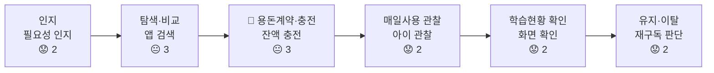
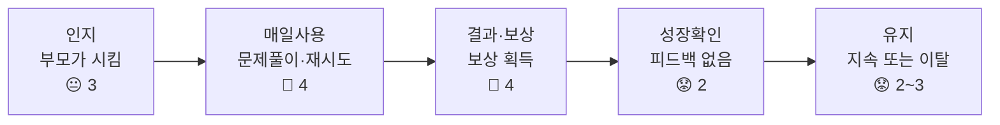
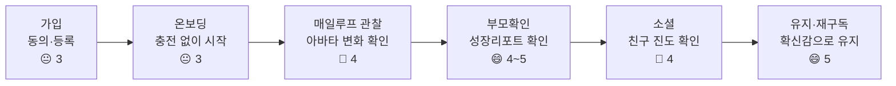
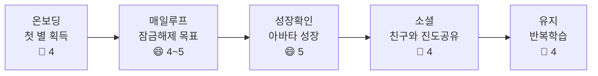

# 고객 여정 지도 — 핀프렌즈 (부모 · 아이)

> **여정 주체** 부모 **금융성장 증명형** 
/ 아이 = ⚠️ **가설 트랙**(세그먼트·인터뷰 부재 — 아래 §0-2 참고)
> **맵 구성** 핀프렌즈는 신규 서비스이지만 "기존 서비스(퍼핀) 개선"이 문제 정의이므로 **맵 2개로 분리**:
> - **맵 A** — 퍼핀 사용자 AS-IS 여정 (경쟁사 진단용, 근거 탄탄)
> - **맵 B** — 핀프렌즈 이용자 TO-BE 여정 (기대 여정, 가설 기반 — 검증 전)

---

## 0. 여정 설계 메모 (방법론 경고 반영)

### 0-1. 왜 표준 5단계를 안 쓰는가

퍼핀·핀프렌즈 둘 다 **"부모가 돈을 넣어야 아이가 시작할 수 있는" 구조적 게이트**가 있어 '온보딩' 앞에 **자금 게이트 단계를 별도로 세워야** 실제 여정을 반영합니다. 맵 A와 맵 B의 3단계가 서로 대비되는 이유입니다.

### 0-2. 아이 트랙에 대한 신뢰도 경고

아이 트랙의 근거는:

| 근거 | 강도 |
|---|---|
| 과잉정당화 효과·목표-경사 효과 (이론) | 🟡 이론적 유추 — 원 실험은 성인이 관찰한 아동 놀이 상황 |
| 리뷰 3건 (전부 부모가 관찰해서 씀, 아이 본인 진술 0건) | 🔴 매우 약함 |
| 퍼핀 개발사 자기인정 1건(2024-04-01) | 🟢 공급자 인정이나 n=1 |
| 아이 인터뷰 | ⬜ **미실시** — 

**그래서 아이 트랙의 감정 점수·Pain Point는 전부 추론이며, 인터뷰 전까지 발표·PRD에서 "확인된 사실"로 인용하면 안 됩니다.** 표에 🟡/🔴 표시를 유지합니다.

### 0-3. 부모 페르소나 스냅샷

> **세그먼트 ① 금융성장 증명형** (29.3만명, 관여↑·문제↑) — `유림/시장분석/TAM-SAM-SOM_시장세분화.md` §5-5
> **부모의 말**: "아이가 앱에서 돈은 벌고 있는데, 그래서 금융적으로 성장하고 있는 건가요?"
> **핵심 JTBD**: 아이에게 돈을 주는 것을 금융교육으로 연결하고, 아이가 실제로 돈을 잘 관리하게 성장했음을 **확인**하고 싶다.
> **선정 이유**: 문제를 이미 인지하고 있어 전환 경로가 가장 짧은 1차 타깃 — 페인포인트 근거와 정확히 겹침.

---

# 맵 A — 퍼핀 사용자 AS-IS 여정

## A-0. 핵심 단계 재정의

| # | 단계 | 왜 이 단계인가 |
|---|---|---|
| 1 | 인지 (문제 자각) | 경제교육 필요성을 부모가 스스로 인지 |
| 2 | 탐색·비교 | 앱 후보 검토 |
| 3 | 🔑 **용돈계약·충전** | *(신설)* — "부모 잔액이 충전돼야 아이가 퀴즈를 시작할 수 있다"(퍼핀 도움말 Q4)는 구조적 게이트. 이게 없으면 다음 단계 자체가 성립 안 함 |
| 4 | 매일 사용 (퀴즈→판정→보상) | 실사용 핵심 루프 |
| 5 | 학습현황 확인 | 부모가 성장을 확인하려는 시도 |
| 6 | 유지·이탈 판단 | 재구독/이탈 분기점 |

## A-1. 부모 트랙

| 단계 | 행동 | 생각 | 감정 | Pain Point | 근거 |
|---|---|---|---|---|---|
| 인지 | 아이 용돈·경제교육 필요성 인지 | "돈 관리를 언제부터 가르쳐야 하지" | 2 관심·부담 | 방법을 모름 | 유림 세그먼트① JTBD |
| 탐색·비교 | 퍼핀 등 키즈 금융앱 검색 | "이 앱은 뭘 가르쳐주는 거지" | 3 기대 | 앱 설명만으로 실제 커리큘럼 순도 파악 불가 | `pain_point_evidence_final.md` §3-1 |
| 🔑 용돈계약·충전 | 학습보상 금액 설정 + 퍼핀 잔액 충전 | "이것부터 넣어야 시작하네" | 3 순응 | **아이의 학습이 부모의 지갑 상태에 종속**됨 | 퍼핀 도움말 Q4 (`병윤/01_서비스구조/서비스구조_확정.md`) |
| 매일 사용 관찰 | 아이가 5문제 푸는 것을 곁눈질 | "제대로 읽고 푸는 건가" | 2 불안 | 오답에도 보상 절반 지급 → 아이가 **문제보다 돈을 우선시**하는 걸 목격 | E-05 (2024-03-28 리뷰) |
| 학습현황 확인 | 부모앱 학습현황 화면 확인 | "숫자만 있고 뭘 배웠는지는 없네" | 2 불확실 | 화면에 **누적일수·문제수·보상액 숫자 3개뿐** | E-11 (팀 직접 캡처, 2026-08-03) |
| 유지·이탈 판단 | 재구독 여부 판단 | "돈은 도는데 뭘 배웠는지는 모르겠다" | 2 신뢰 저하 | 최다공감 리뷰(👍206)조차 **성장 언급 없이 "100원" 만 서술** | E-08 |

## A-2. 아이 트랙 ⚠️ 가설 트랙 (§0-2 신뢰도 경고 적용)

| 단계 | 행동 | 생각 | 감정 | Pain Point | 근거 |
|---|---|---|---|---|---|
| 인지 *(수동)* | 부모가 시켜서 앱을 처음 접함 | "이걸 왜 해야 하지" | 🔴 3 무관심 | 아이 스스로 필요성 인지 안 함 | 추론 |
| 용돈계약·충전 | 관여 없음(부모가 처리) | — | — | — | — |
| 매일 사용 | 5문제 풀이, 오답 시 재시도 | "틀려도 절반은 받네" | 🔴 4 즉흥적 만족 | **문제 풀이가 아니라 정답 클릭 자체가 목적화**될 위험 | E-05, 과잉정당화 효과(🟡 이론) |
| 결과·보상 | 보상 획득 확인 | "돈 벌었다" | 🔴 4 만족(단기) | 해설 열람이 선택 사항이라 **학습이 안 남을 수 있음** | 퍼핀 개발사 인정(2024-04-01, 🟢 n=1) |
| 성장 확인 | 확인할 화면 자체가 없음 | *(피드백 없음)* | 🔴 2 무감각 | 레벨업 외 **금융 지식 성장을 보여주는 장치 없음** | `pain_point_evidence_final.md` §3-4 |
| 유지 | 계속 사용 또는 흥미 저하 | "그냥 하던 대로" | 🔴 2~3 (추정 불가) | 이탈자는 리뷰를 안 남겨 **생존자 편향** 위험 | 하영 문서 §근거부족 4 |

> ⚠️ 이 트랙 전체가 가설 — §0-2 신뢰도 경고 참고

---

# 맵 B — 핀프렌즈 이용자 TO-BE 여정 (가설 · 검증 전)

## B-0. 핵심 단계 재정의

| # | 단계 | 맵 A 대비 핵심 차이 |
|---|---|---|
| 1 | 가입 (법정대리인 동의) | 만 14세 미만 동의 절차 (R-04) |
| 2 | 온보딩 (첫 별⭐ 획득) | 🔑 **부모 충전 없이 시작 가능** — 맵 A의 "용돈계약·충전" 게이트를 제거하는 것이 설계의 본질 |
| 3 | 매일 루프 (경제문제→별⭐→잠금해제→아바타) | 1층 보상(별⭐)에 부모 개입 0 |
| 4 | 부모 확인 (성장 리포트) | 맵 A "학습현황 확인"의 대체재 — 숫자 3개 대신 시각적 성장 |
| 5 | 소셜 (친구와 진도 공유) | 사진 공유 없음, 랭킹 없음(경쟁압박 차단, `서비스구조_확정.md` §7-2) |
| 6 | 유지·재구독 / 월간 미션(Phase 2) | 현금 미션은 선불업 등록 전제로 별도 트랙 |

## B-1. 부모 트랙 (🟡 가설 — 검증 필요)

| 단계 | 기대 행동 | 기대 생각 | 목표 감정 | 해소하려는 AS-IS Pain | 검증 필요 사항 |
|---|---|---|---|---|---|
| 가입 | 법정대리인 동의, 결제수단 등록 | "동의 절차가 명확하네" | 3 | — | R-04 UX 실사용 테스트 |
| 온보딩 | 아이가 첫 문제 푸는 걸 지켜봄 | "충전 안 해도 되네?" | 3 순응 확인 | 용돈계약·충전 게이트 제거 | 실제로 이탈 없이 온보딩 완료하는지(E4, `06_실험_설계서.md`) |
| 매일 루프 관찰 | 아이 아바타 변화를 처음 확인 | "뭔가 바뀌었네" | 4 신기함 | 학습현황 숫자 3개 → 시각적 변화 | E2 "성장 루프가 실제 학습을 유발하는가" |
| 부모 확인 (성장 리포트) | 나무 성장 UI·진도·정답률 확인 | "이제 뭘 배웠는지 보이네" | 4~5 확신감 | **핵심 페인포인트 직접 해소 지점** | E3 성공기준: 습관화 인식 동의율 ≥70%, 주1회+ 조회율 ≥50% |
| 소셜 | 친구 진도만 확인 (사진 X) | "비교당하는 느낌은 없네" | 4 안심 | 경쟁 압박·이미지 유출 리스크 제거 | 랭킹 없는 UI가 실제로 안심을 주는지 |
| 유지·재구독 | 절감액 아닌 "확신감"으로 유지 결정 | "성장하고 있다는 확신이 든다" | 5 (가설) | 맵 A의 "돈은 도는데 성장은 안 보임" | E3 성공기준 3개 중 2개 충족 여부 |

> 🟡 전체 가설 — 검증 전(B-1 표 참고)

## B-2. 아이 트랙 (🟡 가설 — 검증 필요)

| 단계 | 기대 행동 | 기대 생각 | 목표 감정 | 해소하려는 AS-IS Pain | 검증 필요 사항 |
|---|---|---|---|---|---|
| 가입 | 관여 없음(부모 처리) | — | — | — | — |
| 온보딩 | 첫 경제문제 풀고 첫 별⭐ 획득 | "문제 풀면 별을 주네" | 4 | — | E4 무개입 온보딩 도달률 |
| 매일 루프 | 별⭐로 테마·옷장 잠금해제 | "이거 모으면 뭐가 바뀌는데?" | 4~5 목표지향 (목표-경사 효과 🟡) | 정답 클릭이 목적화되는 위험 완화 시도 | E1 "가시적 성장이 소멸성 용돈보다 동기로 작동하는가" |
| 아바타 성장 확인 | 성장한 아바타 확인 | "내가 진짜 컸다" | 5 성취감 (가설) | 레벨업 외 성장 장치 부재 | 실제 성취감이 학습 지속으로 이어지는지(과잉정당화 효과 반증 여부) |
| 소셜 | 친구와 진도(별 개수·성장 단계)만 공유 | "쟤도 크고 있네" | 4 | — | 랭킹 없는 비교가 압박이 아닌 동기로 작동하는지 |
| 유지 | 반복 학습 | "다음엔 뭐가 열리지" | 4 (가설) | 흥미 저하·이탈 | 오답 후 이탈률 등 반증 지표 상시 관찰(`05_KPI_Tree.md` [반증] 항목) |

> ⚠️ 이 트랙 전체가 가설 — §0-2 신뢰도 경고 참고

---

# Ⅲ. 맵 A → 맵 B 대응 — 무엇이 무엇을 해소하는가

| 맵 A의 Pain | 근거 | 맵 B의 해소 설계 | 근거 |
|---|---|---|---|
| 부모 충전 없인 시작 불가 (지갑 종속) | 퍼핀 도움말 Q4 | 1층 별⭐ 보상, 부모 개입 0 | 결정 5-1, R-03 |
| 학습현황 = 숫자 3개뿐 | E-11 | 나무 성장 UI + 진도·정답률·출석률 | `05_KPI_Tree.md` |
| 오답에도 절반 보상 → 문제보다 돈 우선시 | E-05, E-12 | (미확정) — 오답 보상 정책 R-18 신고·재채점만 명시, **오답 시 별 지급 여부는 맵 B에 아직 없음** | ⚠️ 공백 |
| 사진·랭킹 통한 경쟁 압박 유발 가능성 | 시장분석 §7-2 실패요인 4위 | 랭킹 없음, 진도만 공유 | 결정 5, `서비스구조_확정.md` §7-2 |
| 최근 리뷰 급감(2023년 554건→2026년 43건) — 신뢰 마모 정황 | `pain_point_evidence_final.md` §1 | 확신감 기반 재구독 설계(E3) | `06_실험_설계서.md` |

**🔴 이 표에서 드러난 설계 공백 1건**: 맵 A의 두 번째로 뾰족한 Pain("오답에도 보상 지급 → 학습 이탈")에 대응하는 맵 B 쪽 설계가 아직 명시돼 있지 않습니다. `05_KPI_Tree.md`의 "[반증] 오답후 이탈률" 지표만 있고, 별⭐ 정책 자체(오답 시 지급 여부)는 병윤 문서 R-01~R-20에 없습니다. — **8/19 스크럼에서 결정 필요.**

---

# Ⅳ. 이 문서가 딛고 선 가정 — 다음 검증 순서

| 순위 | 가정 | 검증 방법 |
|---|---|---|
| 1 | 아이 트랙 전체(감정·Pain) | 초등 자녀 3~5명 인터뷰 |
| 2 | 부모가 "금융 집중"을 실제로 원하는가 | 부모 3~5명 인터뷰 |
| 3 | 맵 A "탐색·비교" 단계의 금융 비율 근거 | 퀴즈 40문항 실물 수집 → 금융 비율 % |
| 4 | 맵 B 전체(온보딩 무개입 도달률, 확신감, 학습 유발) | E1~E4 실험(`06_실험_설계서.md`) 실행 |
| 5 | 오답 시 별⭐ 지급 정책 공백 | 팀 논의 후 R-ID 신설 |

---

## 참고 자료

- `business-research/06-customer-journey/methodology-customer-journey-map.md` — 방법론
- [`혜원/고객분석/페인포인트_근거보강.md`](페인포인트_근거보강.md) — 페인포인트 3계층 근거
- [`하영/리뷰수집/pain_point_evidence_final.md`](../../하영/01_리뷰분석/pain_point_evidence_final.md) — 리뷰 921건 재검증, E-01~E-15 원본은 1차 `03_페인포인트_근거표.md`
- [`병윤/01_서비스구조/서비스구조_확정.md`](../../병윤/01_서비스구조/서비스구조_확정.md) — 핀프렌즈 서비스 구조·R-01~R-20
- [`유림/시장분석/TAM-SAM-SOM_시장세분화.md`](../../공용공간/4. TAM-SAM-SOM_Market-Segment/TAM-SAM-SOM_시장세분화.md) — 세그먼트 ①~④
- 1차 `05_KPI_Tree.md`, `06_실험_설계서.md` — TO-BE 성공 지표·실험 설계 (참고용, 비-깃 폴더)
